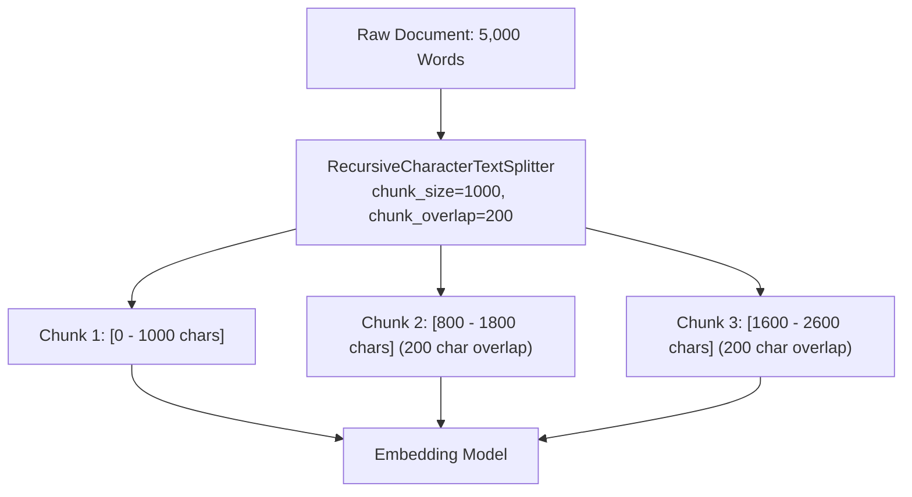

# 📹 Text Splitters in LangChain

<div className="video-card" style={{border: '1px solid #30363d', borderRadius: '8px', padding: '16px', marginBottom: '24px', background: 'rgba(56, 139, 253, 0.05)'}}>
  <div style={{display: 'flex', gap: '16px', flexWrap: 'wrap'}}>
    <div><strong>Instructor:</strong> Nitish Singh (CampusX)</div>
    <div><strong>Duration:</strong> 3541</div>
    <div><strong>Course:</strong> Module 2: LCEL, Local LLMs & Tool Calling</div>
    <div><strong>Watch Link:</strong> <a href="https://www.youtube.com/watch?v=SEWS9P4ODmc" target="_blank" rel="noopener noreferrer">YouTube Lecture ↗</a></div>
  </div>
</div>

## 📌 Executive Summary

Embedding models have fixed context windows and degrade in semantic resolution when fed oversized text blocks. Text Splitters partition documents into semantically coherent chunks with controlled boundary overlap to maximize vector retrieval relevance.

This guide details chunking strategies: `RecursiveCharacterTextSplitter`, `TokenTextSplitter`, separator priority hierarchies, and balancing chunk size against retrieval precision.

---

## 🏗️ System Architecture & Execution Flow



---

## 📖 Core Concepts & Technical Deep Dive

### 1. The Chunking Trade-Off
- **Oversized Chunks (>2000 tokens):** Dilute specific semantic signals, causing embedding vectors to average out distinct topics.
- **Undersized Chunks (&lt;100 tokens):** Lack sufficient context, causing the LLM to hallucinate missing prerequisites.
- **The Sweet Spot:** 500 to 1,000 characters with a 10-20% boundary overlap.

### 2. Recursive Splitting Algorithm
`RecursiveCharacterTextSplitter` recursively inspects a priority hierarchy of separators: `["

", "
", " ", ""]`. It attempts to split on double newlines (paragraphs) first, falling back to single newlines (sentences) and spaces (words) only when chunks exceed the limit.

### 3. Token-Aware Chunking
Characters do not equal tokens. A 1,000-character chunk in English is ~250 tokens, but in code or non-Latin scripts, it may exceed 800 tokens. Using `from_tiktoken_encoder` ensures chunk sizes match embedding model token limits.

---

## 💻 Production Implementation

```python
from langchain_text_splitters import RecursiveCharacterTextSplitter

raw_document = """Production AI systems require defensive engineering. 
First, validate all inputs against schema constraints to prevent injection attacks.

Second, decouple model serving from business logic using standard protocols like MCP.
This allows seamless model upgrades without refactoring application code.

Third, maintain automated evaluation suites measuring Faithfulness and Relevance in CI/CD."""

splitter = RecursiveCharacterTextSplitter(
    chunk_size=150,
    chunk_overlap=30,
    separators=["\n\n", "\n", " ", ""]
)

chunks = splitter.split_text(raw_document)
for i, chunk in enumerate(chunks, 1):
    print(f"--- Chunk {i} ({len(chunk)} chars) ---")
    print(chunk)
```

---

## ⚙️ Production Gotchas & Best Practices

:::tip Semantic Overlap
Always configure a 10-20% `chunk_overlap`. This prevents sentences or key technical facts from being abruptly severed at an arbitrary character index.
:::

:::warning Code and Markdown Chunking
Do not use standard text splitters on source code or markdown tables. Use `RecursiveCharacterTextSplitter.from_language(Language.PYTHON)` or markdown-aware splitters to preserve syntax blocks.
:::

---

## 📊 Architectural Reference & Comparison

| Splitter Class | Splitting Logic | Best For |
| :--- | :--- | :--- |
| `RecursiveCharacterTextSplitter` | Paragraphs -> Sentences -> Words | General prose, technical documentation |
| `CharacterTextSplitter` | Single separator strictly | Predictable structured text logs |
| `TokenTextSplitter` | Raw token counts (BPE) | Strict token budget compliance |
| `MarkdownHeaderTextSplitter` | Markdown `#`, `##` headers | Preserving document hierarchy |

---

## 📚 Key Takeaways & Enterprise Checklist

- [ ] **Architecture Verification:** Ensure your design addresses latency, decoupled interfaces, and strict data validation contracts.
- [ ] **Deterministic Testing:** Run unit tests and golden dataset evaluations before shipping changes to staging or production.
- [ ] **Security & Observability:** Enforce input/output guardrails, scrub sensitive credentials/PII, and capture distributed traces.
- [ ] **Scalability & Sizing:** Calibrate model parameters, context limits, and compute instance requirements against projected request concurrency.
