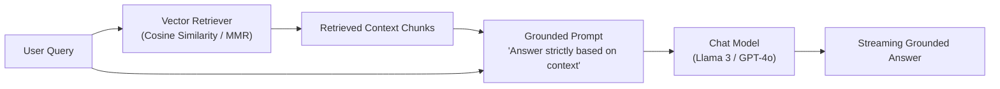

# 📹 Retrieval Augmented Generation ｜ What is RAG ｜ How does RAG Work ｜ RAG Explained

<div className="video-card" style={{border: '1px solid #30363d', borderRadius: '8px', padding: '16px', marginBottom: '24px', background: 'rgba(56, 139, 253, 0.05)'}}>
  <div style={{display: 'flex', gap: '16px', flexWrap: 'wrap'}}>
    <div><strong>Instructor:</strong> Nitish Singh (CampusX)</div>
    <div><strong>Duration:</strong> 3564</div>
    <div><strong>Course:</strong> Module 2: LCEL, Local LLMs & Tool Calling</div>
    <div><strong>Watch Link:</strong> <a href="https://www.youtube.com/watch?v=X0btK9X0Xnk" target="_blank" rel="noopener noreferrer">YouTube Lecture ↗</a></div>
  </div>
</div>

## 📌 Executive Summary

Retrieval-Augmented Generation (RAG) bridges the gap between static foundation models and dynamic enterprise data. By retrieving relevant document contexts from vector databases and injecting them into the prompt, RAG suppresses hallucinations and eliminates the need for expensive model retraining.

This lesson explores the naive RAG architecture, retrieval-augmented prompt engineering, managing token context budgets, and source citation grounding.

---

## 🏗️ System Architecture & Execution Flow



---

## 📖 Core Concepts & Technical Deep Dive

### 1. The Architectural Need for RAG
Foundation models suffer from two primary limitations:
- **Knowledge Cutoff:** Models cannot answer questions about internal company databases or recent news.
- **Parametric Hallucinations:** Models generate plausible but factually incorrect assertions when lacking confidence.
RAG solves both by converting generation from an open-book memorization task into a closed-book comprehension task.

### 2. The RAG Ingestion vs Query Lifecycle
- **Ingestion Pipeline:** Load raw documents -> Split into overlapping chunks -> Generate vector embeddings -> Store in vector index.
- **Query Pipeline:** User submits question -> Convert query to embedding vector -> Top-K vector retrieval -> Synthesize grounded prompt -> Stream model completion.

### 3. The Context Window & 'Lost-in-the-Middle'
Injecting dozens of retrieved documents causes attention dilution. Models pay highest attention to the beginning and end of the context window, frequently ignoring facts positioned in the middle. Keeping top-K between 3 and 5 optimizes recall and token expenditure.

---

## 💻 Production Implementation

```python
from langchain_core.prompts import ChatPromptTemplate
from langchain_core.runnables import RunnablePassthrough
from langchain_core.output_parsers import StrOutputParser
from langchain_community.chat_models import ChatOllama
from langchain_community.vectorstores import Chroma
from langchain_community.embeddings import OllamaEmbeddings

# 1. Setup local vector store & retriever
embeddings = OllamaEmbeddings(model="nomic-embed-text")
vectorstore = Chroma(collection_name="kb", embedding_function=embeddings)
retriever = vectorstore.as_retriever(search_kwargs={"k": 3})

# 2. Strict grounding prompt template
rag_template = """You are an authoritative enterprise knowledge assistant.
Answer the question using STRICTLY the provided context. If the answer cannot be deduced from the context, state: 'Insufficient context available.'

Context:
{context}

Question:
{question}

Answer:"""

prompt = ChatPromptTemplate.from_template(rag_template)
llm = ChatOllama(model="llama3:8b", temperature=0.0)

def format_docs(docs):
    return "\n\n".join(f"[Doc {i+1}]: {doc.page_content}" for i, doc in enumerate(docs))

# 3. Declarative RAG Chain
rag_chain = (
    {"context": retriever | format_docs, "question": RunnablePassthrough()}
    | prompt
    | llm
    | StrOutputParser()
)

print("RAG Chain compiled and ready for execution.")
```

---

## ⚙️ Production Gotchas & Best Practices

:::tip Refusal Prompting
Explicitly instruct the model: "If the context does not contain the answer, reply with 'Insufficient information'". Without this instruction, models fallback to internal parametric assumptions and hallucinate.
:::

:::warning Context Pollution
Do not feed raw HTML tags, navigation bars, or repeated headers into the prompt. Clean documents during ingestion to maximize effective context density.
:::

---

## 📊 Architectural Reference & Comparison

| Metric | Naive RAG | Fine-Tuning |
| :--- | :--- | :--- |
| **Knowledge Dynamic Updates** | Immediate (re-index docs) | Requires expensive re-training |
| **Hallucination Control** | High (grounded citations) | Low (can still hallucinate weights) |
| **Setup Cost** | Low (open-source vector DB) | High (GPU compute clusters) |
| **Auditability** | High (direct document links) | Low (opaque weight parameters) |

---

## 📚 Key Takeaways & Enterprise Checklist

- [ ] **Architecture Verification:** Ensure your design addresses latency, decoupled interfaces, and strict data validation contracts.
- [ ] **Deterministic Testing:** Run unit tests and golden dataset evaluations before shipping changes to staging or production.
- [ ] **Security & Observability:** Enforce input/output guardrails, scrub sensitive credentials/PII, and capture distributed traces.
- [ ] **Scalability & Sizing:** Calibrate model parameters, context limits, and compute instance requirements against projected request concurrency.
