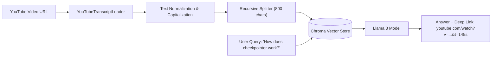

# 📹 YouTube Chatbot using LangChain ｜ Building a RAG system in LangChain

<div className="video-card" style={{border: '1px solid #30363d', borderRadius: '8px', padding: '16px', marginBottom: '24px', background: 'rgba(56, 139, 253, 0.05)'}}>
  <div style={{display: 'flex', gap: '16px', flexWrap: 'wrap'}}>
    <div><strong>Instructor:</strong> Nitish Singh (CampusX)</div>
    <div><strong>Duration:</strong> 20m 00s</div>
    <div><strong>Course:</strong> Module 2: LCEL, Local LLMs & Tool Calling</div>
    <div><strong>Watch Link:</strong> <a href="https://www.youtube.com/watch?v=str" target="_blank" rel="noopener noreferrer">YouTube Lecture ↗</a></div>
  </div>
</div>

## 📌 Executive Summary

Video content represents an immense reservoir of unstructured technical knowledge. Building a YouTube transcript chatbot requires fetching automated or manual subtitle streams, segmenting spoken transcripts into topical intervals, indexing them in Chroma, and querying them with time-linked video citations.

This lesson explores YouTube transcript parsing, handling non-punctuated conversational text, and generating deep-linked YouTube video timestamps.

---

## 🏗️ System Architecture & Execution Flow



---

## 📖 Core Concepts & Technical Deep Dive

### 1. Spoken Transcript Peculiarities
Spoken speech lacks formal punctuation, contains filler words ("uh", "you know"), and has speech recognition phonetic errors. Cleaning conversational transcripts prior to embedding prevents semantic distortion.

### 2. Deep-Linked Timestamp Citations
Each subtitle segment has a start timestamp in seconds. Storing `start_time` in chunk metadata allows generating clickable links: `https://youtu.be/<video_id>?t=<start_seconds>`, taking users directly to the video segment.

---

## 💻 Production Implementation

```python
def generate_youtube_citation(video_id: str, start_seconds: int, title: str) -> str:
    minutes, seconds = divmod(start_seconds, 60)
    timestamp_str = f"{minutes:02d}:{seconds:02d}"
    url = f"https://www.youtube.com/watch?v={video_id}&t={start_seconds}s"
    return f"[{title} at {timestamp_str}]({url})"

citation = generate_youtube_citation("WJKsPchji0Q", 145, "What is an API")
print(f"Generated Video Citation: {citation}")
```

---

## ⚙️ Production Gotchas & Best Practices

:::tip Video Timestamp Links
Always format video references as clickable markdown links with `&t=Xs` parameters to enhance study navigation.
:::

:::warning Unpunctuated Subtitles
Auto-generated transcripts lack periods and sentence boundaries. Run chunks through a lightweight sentence punctuation restorer before indexing.
:::

---

## 📊 Architectural Reference & Comparison

| Transcript Feature | Auto-Generated Subtitles | Manual Creator Subtitles |
| :--- | :--- | :--- |
| **Punctuation** | Often missing entirely | Clean grammatical sentences |
| **Timestamps** | High granularity (every 2-3s) | Phrase-level granularity |
| **Technical Terms** | Prone to phonetic typos | High domain accuracy |

---

## 📚 Key Takeaways & Enterprise Checklist

- [ ] **Architecture Verification:** Ensure your design addresses latency, decoupled interfaces, and strict data validation contracts.
- [ ] **Deterministic Testing:** Run unit tests and golden dataset evaluations before shipping changes to staging or production.
- [ ] **Security & Observability:** Enforce input/output guardrails, scrub sensitive credentials/PII, and capture distributed traces.
- [ ] **Scalability & Sizing:** Calibrate model parameters, context limits, and compute instance requirements against projected request concurrency.
