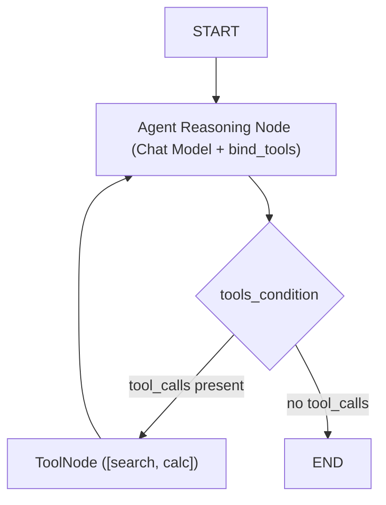

# 📹 Building end-to-end AI Agent in LangChain

<div className="video-card" style={{border: '1px solid #30363d', borderRadius: '8px', padding: '16px', marginBottom: '24px', background: 'rgba(56, 139, 253, 0.05)'}}>
  <div style={{display: 'flex', gap: '16px', flexWrap: 'wrap'}}>
    <div><strong>Instructor:</strong> Nitish Singh (CampusX)</div>
    <div><strong>Duration:</strong> 4367</div>
    <div><strong>Course:</strong> Module 2: LCEL, Local LLMs & Tool Calling</div>
    <div><strong>Watch Link:</strong> <a href="https://www.youtube.com/watch?v=gm_lQG8fYjI" target="_blank" rel="noopener noreferrer">YouTube Lecture ↗</a></div>
  </div>
</div>

## 📌 Executive Summary

Building production conversational agents in LangGraph requires orchestrating state schemas, LLM tool binding, dynamic condition routing, and database persistence into a cohesive system.

This hands-on walkthrough guides through building an end-to-end multi-tool customer support agent equipped with calculator and search tools, database checkpointers, and resilient error recovery.

---

## 🏗️ System Architecture & Execution Flow



---

## 📖 Core Concepts & Technical Deep Dive

### 1. The Production ReAct Pattern in LangGraph
The agent node calls an LLM configured with bound tools. The output is evaluated by `tools_condition`:
- If the model emits `tool_calls`, control flows to `ToolNode`, which executes the tools and returns `ToolMessage` payloads.
- The results loop back to the agent node, allowing the model to inspect the tool outputs and formulate a final answer.

### 2. State Reducers Prevent Context Loss
Using `messages: Annotated[List[BaseMessage], add_messages]` ensures all user turns, assistant reasoning steps, and tool responses are preserved in chronological order.

---

## 💻 Production Implementation

```python
from typing import TypedDict, Annotated, List
from langgraph.graph import StateGraph, START, END
from langgraph.prebuilt import ToolNode, tools_condition
from langchain_core.messages import BaseMessage, HumanMessage
from langchain_core.tools import tool
from langchain_community.chat_models import ChatOllama
import operator

class SupportState(TypedDict):
    messages: Annotated[List[BaseMessage], operator.add]

@tool
def lookup_order_status(order_id: str) -> str:
    """Lookup real-time shipping status for a specific order ID."""
    return f"Order {order_id} is in transit, estimated arrival in 2 business days."

tools = [lookup_order_status]
model = ChatOllama(model="llama3:8b", temperature=0.0).bind_tools(tools)

def agent_node(state: SupportState):
    return {"messages": [model.invoke(state["messages"])]}

builder = StateGraph(SupportState)
builder.add_node("agent", agent_node)
builder.add_node("tools", ToolNode(tools))

builder.add_edge(START, "agent")
builder.add_conditional_edges("agent", tools_condition)
builder.add_edge("tools", "agent")

support_bot = builder.compile()
print("Production Multi-Tool Support Agent built successfully.")
```

---

## ⚙️ Production Gotchas & Best Practices

:::tip Temperature 0.0 for Tool Accuracy
Always set `temperature=0.0` for agents executing tools. Higher temperatures increase the probability of invalid parameter generation and syntax errors.
:::

:::warning System Prompt Boundary
Always inject a clear `SystemMessage` establishing the agent's persona and restricting it from discussing topics outside its designated tool domain.
:::

---

## 📊 Architectural Reference & Comparison

| Component | Implementation | Responsibility |
| :--- | :--- | :--- |
| **State** | `SupportState` | Stores chronological conversation messages |
| **Model** | `ChatOllama.bind_tools()` | Generates tool call requests and synthesizes answers |
| **Router** | `tools_condition` | Inspects message for tool calls |
| **Executor** | `ToolNode` | Executes tools safely and returns `ToolMessage` |

---

## 📚 Key Takeaways & Enterprise Checklist

- [ ] **Architecture Verification:** Ensure your design addresses latency, decoupled interfaces, and strict data validation contracts.
- [ ] **Deterministic Testing:** Run unit tests and golden dataset evaluations before shipping changes to staging or production.
- [ ] **Security & Observability:** Enforce input/output guardrails, scrub sensitive credentials/PII, and capture distributed traces.
- [ ] **Scalability & Sizing:** Calibrate model parameters, context limits, and compute instance requirements against projected request concurrency.
