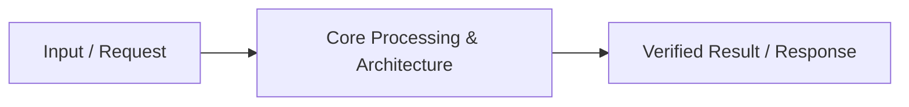

# 📹 Ollama Masterclass 2026: Run Powerful Local LLMs with Ollama (3-Hour Full Course)

<div className="video-card" style={{border: '1px solid #30363d', borderRadius: '8px', padding: '16px', marginBottom: '24px', background: 'rgba(56, 139, 253, 0.05)'}}>
  <div style={{display: 'flex', gap: '16px', flexWrap: 'wrap'}}>
    <div><strong>Instructor:</strong> Nitish Singh (CampusX)</div>
    <div><strong>Duration:</strong> 169m 41s</div>
    <div><strong>Playlist:</strong> Generative AI using LangChain (CampusX)</div>
    <div><strong>Watch Link:</strong> <a href="https://www.youtube.com/watch?v=YcAYmIFtA0o" target="_blank" rel="noopener noreferrer">YouTube Lecture ↗</a></div>
  </div>
</div>

## 📌 Executive Summary & Learning Objectives

This lecture covers **Ollama Masterclass 2026: Run Powerful Local LLMs with Ollama (3-Hour Full Course)**, focusing on production implementations, edge cases, and industry standards:
- Core intuition, architecture, and underlying mechanisms.
- Key differences between theoretical research implementations and scalable enterprise patterns.
- Concrete Python walkthroughs, error recovery, and performance optimization.

---

## 🏗️ Architecture & Conceptual Workflow



---

## 📖 Core Concepts & Technical Deep Dive

### 1. Architectural Foundations
In modern production AI engineering, **Ollama Masterclass 2026: Run Powerful Local LLMs with Ollama (3-Hour Full Course)** is essential for ensuring reliability, low latency, and deterministic outcomes. As AI systems evolve from naive prompt-in / completion-out scripts into distributed systems, engineers must handle:
- **State management & consistency:** Ensuring intermediate states and tool invocations are tracked.
- **Error boundaries & recovery:** Graceful degradation when external LLMs or vector stores encounter rate limits or network partitions.
- **Resource utilization & cost efficiency:** Caching common queries and reducing unnecessary foundation model token expenditure.

### 2. Operational Considerations
- **Latency Optimization:** Pre-computing embeddings, utilizing asynchronous non-blocking event loops, and streaming tokens via Server-Sent Events (SSE).
- **Security & Sandboxing:** Validating inputs before ingestion, sanitizing LLM outputs, and isolating tool execution environments.

---

## 💻 Production Implementation Walkthrough

```python
# Production Implementation Blueprint
def run_production_pipeline():
    print("Executing production pipeline...")

if __name__ == "__main__":
    run_production_pipeline()
```

---

## 💡 Production Best Practices & Tips

:::tip Production Deployment Guideline
When deploying Ollama Masterclass 2026: Run Powerful Local LLMs with Ollama (3-Hour Full Course) in enterprise environments, always configure automated retries with exponential backoff and telemetry tracing (such as OpenTelemetry or LangSmith).
:::

:::warning Common Failure Modes
Watch out for state contamination across concurrent requests. Ensure each session or user interaction uses an isolated thread ID or execution context.
:::

---

## 🎯 Key Takeaways & Quick Reference

| Dimension | Production Standard | Pitfall to Avoid |
| :--- | :--- | :--- |
| **Execution** | Async / Non-blocking with timeouts | Synchronous blocking calls in event loops |
| **Data Validation** | Strict Pydantic v2 schemas | Untyped dictionary access |
| **Monitoring** | Distributed tracing & latency percentiles | Relying only on standard console logs |

## ⏱️ Lecture Timeline & Key Topics

| Timestamp | Key Topic / Concept Discussed |
| :--- | :--- |
| **00:00:00** | Hi guys, my name is Nitesh and you are welcome.... |
| **00:44:43** | Roast loaded the model Sorry Olama Run... |
| **01:26:39** | By doing my LL.M. generate an output.... |
| **02:08:02** | Still working. And this is in the API endpoint which... |
| **02:49:39** | In. Bye.... |


---

---

## 📜 Complete Lecture Transcript (English)

> **Language:** English | **Source:** `21 - Ollama Masterclass 2026： Run Powerful Local LLMs with Ollama (3-Hour Full Course) ｜ CampusX.en.srt` | **Total Segments:** 85 | **Word Count:** ~29,630 words

<details>
<summary><b>Click to expand full chronological transcript (85 timestamped intervals)</b></summary>

#### ⏱️ [00:00 ➔ 00:02]

Hi guys, my name is Nitesh and you are welcome. To my YouTube channel. So in 2025 we have Lots of JNAI related content on the channel upload videos and if you like those videos If you study, you will see a common pattern. Will give. The pattern is that whenever we Proof of concept shown in those videos Or any small project. So, we showed you there the LLM What was used was Open AI's GPT models. Now these models are very strong, very Reliable and use them however you like You can. But those models have a huge There is also a drawback and that drawback is that this The models are actually proprietary models. Which basically means that you have to use them to give Open AI some money Fall. Now, though that amount is huge. No, but if you have a credit card etc. then make international payment You might have some trouble with it. And the user base on our channel has a There is a huge proportion of students Those who do not have access to a credit card or access to international debit cards It is not there due to which we constantly The feedback came that Sir, please tell us something. Also working with Alternate LL.M.s teach and I was thinking what I I can teach you something that is just as reliable. As much as there are open AI models. so good The thing is that in the last one or two years, a and fields that go very well with GenII. Emerge Key was that of open source LL.M. field and in the last year and a half, a lot All Mature Open Source LLMs Market I came especially from China if you Talk about Deep Seek or talk about Queen. or GLM models as of today's date You have very powerful open source models. which you can use exactly the same way You can use proprietary models like Do you. So we sent out this opportunity notice. and then my team and I did a little I put in effort and prepared a course. I launched it around two months ago. Had done. And the course was centered around These open source models. How do you open these?

#### ⏱️ [00:02 ➔ 00:04]

You can use source models, access You can do it to create your own projects. How to deploy them Can you? We covered all this in that course. Covered in great detail. and edge it The expected response for the course That came out very well too. Butt response is good As we arrived, we received another piece of feedback: Sir, since you did not create this course, If you haven't taught this course, we're Not Really Sure About the Teaching Quality. And I felt like this is a very fair Response. Obviously, if you spend money If you are going to do it then you should be sure before that You will have to decide which product you invested your money on. Are you thinking whether it is good or not? and that's When I and my colleague Ajay who created This course decided that we should each have a kind Releasing an Off Trailer Introductory Video I want to release this video on YouTube. There are two prime motives behind doing this. First The motive is that whoever is ours, that open want to buy a course with source their This will serve as a trailer. This video By looking at this he judges the teaching quality. and if they like it then they You can go ahead and purchase the course. end second If someone is unable to purchase that course from LETS Even if it is due to any reason, we still consider it a I want to give him the opportunity to do this Watch this two-three hour introduction. By doing this you will at least understand a lot about the scholars. More about open source models Then apply it accordingly. Be able to build projects etc. so this is We made this video for two main reasons. are launching. So this is going to be An Introduction Video to Olama and Open Source Models. Now this is your typical ulama There is no surface level video where there are 15-20 You are told a lot in a minute. But instead we have a very detailed one here. We have taken the route and we have gone very deep into it. I will explain things to you. Not only we love you The Complete Landscape of Open Source Models Will explain. Will explain their requirements. How they are committing proprietary I will explain this with models. We will give you the Ulama

#### ⏱️ [00:04 ➔ 00:06]

Like what tools are needed I will tell you. And lastly we are the Ulama There are different modes in which you can use Olama I will tell you all the modes that you can do. In fact, you will get five different modes here. Will see you. We recommend you to use the Olama Will teach in CLI mode, REST API mode In, in Olama Library mode, Lang Chen and lastly we have Olama Cloud We will also tell you how to work above. On the hole it's a very updated video. Literally, the things that came up till the last week Yes, that is also covered here. and the idea is to give you an experience that you OLAM and open source models are very well known. be able to absorb, learn from, and use them You can build projects by doing this. through this video I would like to I hope you understand the Ulama well. Come. Plus you have Ajay who is my colleague Those who created that course have to teach them. I also liked the method and I would request that if you like their approach, you If this video helps anyone Please write in the comment how Tell us how you liked the video. The rest came I will not waste your time any more. Let's Start the video. Before Moving In To Olama Let Me Give You a Quick Summary About What are LLMs and let's see on the On the basis of accessibility we offer LL.M. In how many parts can it be divided? Right? So if I talk about LLM so LLMs Are Basically Your Complex Neural Networks. Complex Neural Networks with multiple layers There are many connections. Right? If I talk a little low level I will do it. So LLMs Are Basically Your Collection of numbers. Collection of numbers. Now what are these numbers? These numbers are basically your model weights and Biases. Right? And in these numbers, your All learning is stored for

#### ⏱️ [00:06 ➔ 00:08]

Any particular LL.M. means whenever my I had trained for LLM for my training. What is learned during the LLM Inside Sarah's Weights and Biases stared right so this is in short what is N LL.M. Right Now on the Basis of Accessibility and Control over model means whichever LL.M. You are using your LLM on that We can depending on how much control we have Classified LL Elms into Two Parts The Right One Is Yours Proprietary Models And others are your open source models. Right? Now let's look at proprietary models What are they? What are open source models? Are there? Let us understand these first. so if I talk about proprietary models, Proprietary models are those models Which were controlled by large companies. These are The Models That Are Owned and Controlled By Company. Right? Complete of Means in Models Ownership is with a company. Complete Ownership Is with a company. Right? Now now that company generally only gives the Access rights to the models to users. Means You can use those proprietary models You can only use it. of those models Architecture related information, weights and biases related information, their Training data related information, anything It is not public. All of them Information only and only with the company it occurs. & Co. does not share it. Is. So these are your models. Proprietary model. I am an example if you If I give you very famous examples, Gemini. Gemini is an proprietary model that is

#### ⏱️ [00:08 ➔ 00:10]

Developed by Google. That's where I'll talk GPT Chat GPT Chat GPT is Again An Proprietary model that is developed and Managed by Open A so these are proprietary You have a lot of models of these models. These models are not aware of this, only you You use it right and how do you use it? Yes, you use these models through API and through any controlled platform Plate platform right, this is what we have been doing I'm still here from Let's if I have Gemini Must be used for general purposes If so, I would go to Gemini's application. am that is again a control platform if I love Gemini for development and coding. I use an API key of the Gemini is not so these are proprietary The raw things you have of these models Raw Things What Happened to Architecture Your Weights and biases are all important to you. Does not pass off the proprietary Models. Ok? And these models you might all Have seen these models, basically we use are through paid subscription. Ok? Gemini Chat GPT which is your free There is a very limited tyre in it. You get access. But if you have these To use advanced capabilities, you Have to pay. These are yours Proprieting. Ok? So in proprietary models, if If I summarize crisply, proprietary Cases of proprietary models of models In this you have only one and only model to use have the right to do so. Information about that model Most of the time you don't have it. Deez Are your proprietary models. But if there Let me talk about open source models. So Open Source Models Are Just Opposite Of Proprietary models. Open source models What are they? What happened? Let's Assume A company ABC company has developed a model

#### ⏱️ [00:10 ➔ 00:12]

Develop it and as soon as that model is developed He trained that model Made it public. What I Mean By This The model was made public. Joe of the Means Model were also raw components The architecture of the Like model is based on the Waves model, The biases of the model, the training data of the model What did the entire company do? Made it public. Now What Will Happen? Now Any person can download these things and Can use it. Right? This is open source model. means one The model was developed and after development it What happened? It became public. anyone around The Globe Can Use That Model. these are called Open source models. Ok? Now if I talk about open source models Let me talk, what can you do? So these You can download the models. to the models Downloading basically means those models Weights, biases, architecture, all of these you You can download it from a very common Platforms like hugging face. and these What can you do to models? download You can run it on your local system. You only need electricity and Paying for hardware. These are your openings. Source model. Right? Very famous example of Open source models are your llama models, Meta Lama, Mistral Models, Dipsic Models. All these models are open for you. There are source models. Ok? Now if I talk about open source of the model. A Lot of Open Source Models It is a great specialty. What is that speciality? Since you have whatever RAW files of the model They are all there. what can you do now yes? You have the architecture of the model, the weights, Biases are everything. What can you do? in You can further fine tune the models. Right? You can customize these models according to your needs. You can customize it. How come this is possible?

#### ⏱️ [00:12 ➔ 00:14]

Because now you have the complete RAW file. It is lying there. Consider is something like this that You have a full length of cloth lying around. Is. Now you can change that length of cloth to any length. You can make your own dress by cutting it to size. yes. This is possible with the open source model Right. So I hope it is clear to all of you. will be that what are open source models and What are proprietary models? Now I B Just Like Me is a song on your mind too. The question might be coming that friend is open source Models when it's so good means yours The complete raw files of the models are coming Is. Use it in any way. To you There is no need to pay anyone. donation Why People Actually Go for Subscriptions? Why are you moving to proprietary models? Are you guys? Why People Are Paying to Chat GPT? Why are people paying to Gemini? If a question is coming in your mind. Let me solve this question for you. even two You have a lot of proprietary in the market There are open source models. Sorry not proprietary No. You have a lot of open market space. There are source models. But it doesn't mean that Using open source model is easy. Using open source is easy. Using the open source model is the biggest The pain point is for open source models. Why? I will explain this to you also. whenever A company releases its model. So In what form does the model release basically Is? If any company releases its model that The model is basically released as a raw model. Waits. Means yours in the form of numbers That model release in the form of architecture It happens. Right? Download this model now To do and run it on your PC it yourself is a Very big friction. Why? I am behind him I will tell you the reasons. The biggest first

#### ⏱️ [00:14 ➔ 00:16]

What is region? that these are the raw model weights How do you store it on your local system? Right? You should also add these raw model weights to your Optimizing the System as You Can Will have to. So that in your local system this LLM should work well. Do you Do you know how to do storage? If storage comes So where will you do it? Right? Let's say for Example: You stored the model. Now It has to be stored and used also. how are you Your working memory is whatever your RAM and V RAM is how do you configure it? Two Use these models. Because running the models Is. Calculations in Weights and Biases Will happen. Working memory is required. how are you Improve your working memory with anything you can. You will optimize. How do you do your working You will configure the memory. Ok? Meni At the time when these were raw weights and biases Yes, these are not compatible that you can directly install them on your local system I can use it. compatibility issue Comes. And there is such a long list because Of Vi which are open source models. Aldo De Are free their usage is very less. Right? There's so much friction in open source. To use models. So Theoretically, open source models are free, but Again we are able to use them practically. Have to solve many other problems. End Here exactly comes your Ola. And this friction solves your For your Ola. Now let's start actually with what is Hailstone. Ok? I hope you all understood will be what are proprietary models, open Use of source models and open source models What we have to do is friction. Ok? So if I talk about Olama, Olama Is basically a tool that helps you run large

#### ⏱️ [00:16 ➔ 00:18]

Language Models on Your Own Computer. If Let me speak in short language. So Olama is Basically a tool with the help of which you can open to source models You can download open source models. You can run and manage. All this thing on your local PC. So in In short, Olama is basically a tool that helps You can download open source models from You can, you can run, you can manage yes. And all this thing you can do is on your Local PC which is your local computer. Ok? Let me speak in simple language. So Open Whatever pen to run the source models Point These Things Storage Optimization How to use working memory Compatibility issues address all these pain points. Ola handles it for you, you just need to And just focus on running and you can From Using the Models to How to Model where to download and where to store it If the model is to be used, which memory How to load requests to models How is the response coming from the model? You don't need to worry about all this. Ulama, all these things are for you. handles in a very very efficient Okay, so you should understand the Ulama like this, just something like a WhatsApp Let's say if you send me any messaging app I wanted it so I chose WhatsApp, now I What am I doing when I use WhatsApp? If I use it, I only focus on sending. and receiving. Now this sending and receiving of anything It could be that. These are text messages It can be of images, it can be of audios It could be, it could be videos. I

#### ⏱️ [00:18 ➔ 00:20]

I am focusing on this very thing. Right? back How do these text messages finally pass? Are you? How can my privacy be maintained? How are the images being passed? each end Everything is handled by WhatsApp form. Ok? So what can you understand? olama is Basically WhatsApp for open source models which Sorry for you, what can you do by using it? Can you? You can download the models. You can run, you can manage. and all These are things you can do on your local piece. Right? This is Olama. All for you All friction points, pain points Olama handles that for you. Ok? Now let's move further and let's see Benefits of Olama. Right? And I hope you Everyone must have got some idea about what This is the olama. So let's move to the benefit of ulama. Ok? So the first benefit is Privacy and data control. How Olama's What can you do with help? Whatever your There is an open source LLM, you can get it from your local You are bringing it on PC only. You can get that LLM of yours Download it on your local PC. You are running it on your local PC. yes. Right? So what is happening? the reason for which Your privacy and data control from Are being maintained. Why? Because whatever Whatever data you pass to this LLM Will it ever go out of your local PC? Not at all. In fact, with the help of Ulama, you You can use LLM. to even without Internet Right this is the power of olama. So most The first benefit of using Olama is Privacy and data control. Your Data Never Leaves Your Computer. Why? so because Whichever LLM you are passing that data to Yes, you already have that LLM on your local PC. I downloaded it to the local system. Right? Second Benefit of Using Olama Lo Latency and offline access. What are you doing

#### ⏱️ [00:20 ➔ 00:22]

Can you? With the help of Olama, the model You can download them and use them without Even having a connection to the internet. Yes Initially when you are downloading that model You will have an internet connection at that time. Needed But after that how much do you like that model? Bar bhi use karo you don't need any internet Connection. Right? You can also view that offline. You can access the model. of latency There is no issue at all. Ok? Third Benefit of Using Olama is Cost Predictability and Potential Savings. means when you are using olama you What did you do? That model llama any The model can be downloaded from your local PC using Llama. I downloaded it. and now you are Using it. So the model is in your local PC. Is. It is lying in your local PC. His The RAW files are on your local PC and you are Using it. So you don't have to pay someone There is no need. What's in Cloud Models It happens? which are proprietary models What is there in it? The model you have He is in a cloud and with that cloud You have to pay to interact Is. Why? Why do I have to pay? Because the model's weights, biases, Whatever output the architecture generates, These are the main components of your output. Responsible for generations. This is Sara's The whole thing is contained within this cloud and To use them in the cloud, you pay Do you. But what did you do in the case of the ulama? Did you do it? You have all these things in your Downloaded it on local PC. and now you Are using them? You have to pay someone There is no need. Right? Moving to the Next Point Is Simple Installation and setup. Install Olama Very easy to do and setup. Just One Click and your Olama will be available in your local area. The system will be setup. Not only this. It's not just easy to set up Olama Is. With the help of Olama, models were locally

#### ⏱️ [00:22 ➔ 00:24]

download, Running models locally is also very It is much easier. Infact Simple Simple Command You can download the models locally from And you can run them. You need to complete the LLM You Don't Need to Have to Run Locally Annie ML Engineer. You Don't Need to Be Anyone ML Engineer. anyone who has a The laptop has a good configuration and can Use olama. And with the help of ulama it can Use models. Right? Olama's again a very If I talk about the biggest speciality then the Ulama Possesses prebuilt model libraries. Means Olama already has a lot of models Which you can download and use. Right? And these models are your big companies There are also models of . Like tipsy right? If I Talk about another that is meta lama's joe Llamas are models. Ok? In addition, you Have Queen Models. In addition, you have There are many models lying here. Correct Is? What did the ulama do? These models Already converted to these formats for you It is ensured that you can download them easily. You can and this can easily go into your system. Can be stored and easily usable. Ok? Prebuilt his own huge library Is. Even if I show you I go to I am on the Google web and I am writing Olama.com. Ok? So the first link is If you go to the model section there. So you can see here how many olamas have All models See There Is a Huge Huge List of Mod Wright You can see here at the Queen Family The models are of Mistal, the models are of Lama The models are Gamma's models here with you I am on. Lava models near you I am here. Right? You have a lot here All the models. Ok? If I show you

#### ⏱️ [00:24 ➔ 00:26]

You will also find a model of dipsic here. See Gemini Models You Have If I Search Dipsick Models You Have It Near Vast Variety of models are in its library Not only this, not just vast variety If I talk about variety then this In variety, your various families There are models. Models from your Gamma family Are. Your Geminis are family models. You have models from the Mistral family. Your The Queen family has models. Your Deep Sick There are family models. Different-Different Models at families' places. Ok? Not Only this is your model repository In this model repository of OLAM Models of different capabilities too Are. Let's say for example If I need a model who has vision Has capabilities. Meaning that my images Can read. Just Click on This Vision Button And C, you have all these models whose Has vision capabilities. See there is a Hughes List of Models. You have something like We need models with thinking capabilities. Yes, it can help in reasoning. Just Click On Thinking End Right Now They Are Not Having Any Models On Thinking but may be when you watch this video You have the video There Might Be Models On Thinking Also If You Want Some Models Those who have the capability of calling the tool Just click on tools you have that All models will come with tools Calling Key Capability Right If You Want Anyone Model on Embeddings Just Click On Embeddings. You have all those models. will go to those who have embeddings There is capability. Sorry there is a there are Models with Thinking Capabilities. I Actually vision and thinking both together It was clicked. So If I Only Show Models with Thinking Capabilities See There R Models with Thinking Capabilities Is. Right? If You Want to Use Olama Cloud What happens? We will discuss that later do. They also have Olama cloud models. Is. So you can see here at the Olama The Olama have created a huge repository of their own.

#### ⏱️ [00:26 ➔ 00:28]

I have made it. where you have a lot of From different families Models available in different categories Will go. Not only this. You here Models are also available in different sizes Will go. How let's say I'm Queen Three You have to use the model. so there are various Various sizes. Now you can update your system Different according to configuration You can also download models with sizes. yes. So the Ulama already have a big one for you. Repository is maintained so that you can store the model Just download and use it. Right? So I hope this point is also clear to you It must have happened. Moving Further If I Tell You What can you do with the help of Ulama? You can also customize your model. Correct Is? You can also tune your model instructably. You can. You can change the parameters of your model You can change by changing. You with your whole You can make the model according to your needs. Custom requirement. All this is possible Because of Ola. Ok? If I talk there should I Of the ulama. So through the ulama when you If you download the models then again your No vendor lock-in issues Is. There is no problem with IP protection. You don't follow any rules and norms. of a company that how you You can use their models. like you Choose their models as you like, whichever model you like. You can use the one you downloaded. yes. Right? Next point: Help of Ulama Running and managing models from It is much easier. What can you do with the help of Ulama? Can you do it? You can run the models, You can manage it. Just By Writing Simple Simple commands. I am simply here to tell you I am giving an example. If I had to llama Models have to be brought into your local system. So I'll write a command o llama pull. That's it. If I have to remove this model If you want to do it, I have one command, O Lama. R. Now that I am writing Olama Pul The scholars do all the work on my behalf. will upload that model from the web to my local system

#### ⏱️ [00:28 ➔ 00:30]

Which files should I bring to the How many files do I have to bring and where are the files? Pe store karna hai each and everything will be Taken care by Olama form right if I Which files am I removing? Where do I have to remove it? Bring it to the ulama and do all the work. You just have to focus on yourself and only on yourself. Each Each and Everything in Using the Model The Ulama handles it on your behalf. Is. You should understand it like this, Ulama, this is basically a Consultant who will take care of all your matters on your behalf All the technical things related to the model He is handling the aspect for you. That's it. Right? So I hope you all now The ulama cleared. Ok? Now let's talk About Requirements for Using olla. Meaning If you want to use Olama efficiently Is. So there are some system requirements That you need to follow. Right? Because what are you doing with the help of Ulama yes? Bring your models locally You are downloading, running locally. So there are some requirements That you need to satisfy. Ok? To all The first thing I talk about is the Ulama. Olama Your Mac OS, Windows & Linux It goes to all three. Ok? But the main thing When you use Olama that is your Hardware. Why hardware? because you Download the models. Your local to be stored in the system. And then you have To use that. Ok? So hardware is a lot It becomes a big point when you use the ulama Do it. Right? Now to use Olama Generally it is recommended that you have There should be at least 8GB of RAM. Peacock Ram More smooth. Ok? And if I talk about the processor So i53 Zen So if your processor is above or i5 13 You belong to Jain or above categories processor so in your case llama is very It should run smoothly or when used from Olama

#### ⏱️ [00:30 ➔ 00:32]

Whatever models you use when using Olama If you do it, it will run very smoothly. alldo lower than I also go to the ulama. But yes, if you Want a smoother experience, this is the Minimum Configuration You Need To Have. Correct Is? Third point is stow storage space. You have storage on your local PC Needed Why I'm Asking for That Storage? Because whichever model you download You do all the files of that model It is coming to your local system. Now he The local system should have storage so that Those files can be stored there. Ok? If I Show You See Me Queen 3 Vl 2 Downloading a model with a billion parameters Is. So I need to have approximately 2GB of storage in my system. I got 8 billion If you have to do it then I will have to do it approximately 6.2GB of storage is required on your local system. Why? Because now whatever is related to this model Those files will also be in my local system. They will come and be stored. That's for storage I need a storage space. Right? than you need An internet connection that is the first time Only when you are downloading Olama and Download the models from Olama's Olama had been. After that even if you have any No internet connection, that is not a big deal. Issue. Ok? Basic command line knowledge You also have your basic CMD commands. You should have very basic knowledge of these. Even if it's not a little, it's still okay. Is. Ok? And Optional Jeepu That Is Not Required but if you have optional GPU So that is something like cherry on the cake. The experience of the ulama is very good for you. Be more smooth. Right? So I hope it is clear to all of you. What is Olama? To use the ulama What are the benefits? And Olama for you What works. Ok? so we are Almost Done with the Theory and Now Actually Let's move into the practical and I hope You all are also excited. So now let's see

#### ⏱️ [00:32 ➔ 00:34]

How We Can Download and Use Olama. Correct Is? Because Olama's through models First of all download and use Ulama should also be in the local system. Right? What I just told you about the ulama is just like a consultant who is on your behalf It is working. So first of all that consultant Will have to hire. So how can you hire? And downloading Olama is very very simple. How? Just go to Google. Go to Google After that you will have to do it only on Google Pay. Have to search. That is Olama. Right? And your first page which will open, the link It will open, here you will have the download link. There is an option. All You Have To Do Is Just Click On This Download Button. As soon as you press this button If you click, you will see a setup file. Something like this. This Olama setup. What All you have to do is just click on this file. And after clicking on this file you will get a The Install button will appear. Just Click on That. That's it. Olama will be downloaded to your local system. Go. Ok? In fact, even if I show you You can see it is downloaded. And You Can See Olama is into my local system. Ok? See how simple it is to download Olama. And it is as simple as this through the Olama Running and downloading models. Right? So now Olama is installed into our System. I have Olama already installed. It happened in my system. You all can see here. Now let's see how we can use Olama. ulama How can we use it? Ok? So There are various ways to use Olama Various Ways. Ok? You basically tell the ulama You can use it through CLI commands, Through command prompts. You can use the olama

#### ⏱️ [00:34 ➔ 00:36]

You can do this through the Olama Library. You You can use Olama's REST API. Through you can use llama with integrations like lang chen okay you You can use Olama using there Olama App You can use Olama in all these ways You can do it, okay, and again, everyone's their own sense Right So Now Let's Start With How We Can Use Olama and how you can use Olama You can download and run the models. Be in your command. Ok? Now to the ulama Via CLI or via command prompt We Have Various Ways to Use Command Prt. We have various various you can Commands from. Ok? before telling them Or before discussing them, I want to Clear one very thing is that Olama is Basically a tool through which you can create models You can download it. You can run the models. You model You can manage it all in your local PC. Ok? Now some model is giving good output Is. A model is producing dirty output. Any The model is giving slow output. Sorry not Slow. No model works better than lettuce. not doing. No model image work. I am doing it. This is all dependent on the mod. Its Nothing to do with the Ulama. Your ulama Download Olama Models in Bihaf He will give it, he will make it run. He will manage them. But You are giving prop to any model. They How well the model is producing output. You You are passing the image to any model. They How well he is reading that image. It all depends on you On the models. Olama have nothing to do with. Ok? Olama generally your three tasks

#### ⏱️ [00:36 ➔ 00:38]

It is used for this only. Right? perfect. So Now Let's Move Inu Commands That you can run and through which you can use Olama in your command. Ok? So, our There are many CLI commands to basically to basically run olama inu your Terminal. Now enter all these commands one by one We look at the. Right? So What I Am What I'm doing is opening my command prompt. And this is my command. Ok? So make Sure Olama is installed. First of all I I will run the command. That Is Olama Dash Dash Version. Right? So here it is showing me Version of the Olama. So this means Olama my It has been downloaded to the local PC. It has been installed. Ok? Now. So if I have the repository of these Ulama. I had a repository on me Yes, I don't have any from the repository of Olama Download the model to your local system Is. So for that I have a command olama pull After the end pull, I generally mention the model end. His you can say para not parameter but a you How many billions from a can I want a model with A configuration. Correct Is? How? I will explain it to you with an example Am. Let's Say I Want to Install Ministral model and I have a model who Need in the system That is minstrel 3 8 Billion. Right? So I Need This Thing ministerial three at bill i will just Copy this and I'll just paste that it Now what will happen to this model on my behalf, Olam? will bring it to my local system How to store Where to store Which files are there for me, all the scholars? I'll see, okay, I'm stopping this, Karli.

#### ⏱️ [00:38 ➔ 00:40]

Right now you can modify your local system. I installed it, okay, after that You want to see which models I have It is in the local system. So for that we have a Command olama ls. Now See Currenty These Three I have installed the models in my local system. Have installed it. Queen 3 8 Billion, Gamma 34 billion, Lama 3.2 1 billion. these three Models stored in my local system. Correct Is? So through Olama LS or Olama List You can get all the list of the models who It is installed on your local system. Right? perfect. How to model the Now in local systems whether to bring it, how to look for it, which models Is? We learned this. How to run the model? That is the main task. For that again we have A Very Very Simple Command That Is olama Run And after that you write the name of the model. Olama Run Llama 3.21 million. That's it. Now What will this command do? Now your current The model is your memory which is stored in It's sturdy. What will this command do? whatever Model You have mentioned that model All the related files are yours from storage to your working memory I will bring it. That can be your reign, we RAM. And as soon as the model is working It comes to memory, you can use that Mod. Now See It is bringing the model and let me run it Again. O Lama Run I made a spelling mistake Lama had done it 32 One BC Now model will come to my working. memory end as soon as my working memory I can use it see I'm into My model, my model, my working memory. I have loaded it and now anything from this Ask Simply Hello It Is Giving Me Answer I I'm saying what is photosynthesis

#### ⏱️ [00:40 ➔ 00:42]

See it is telling what is photosynthesis. I can ask any question from. Ok? Whatever model I have loaded, I have no memory of this model. I can ask a question. I am asking What are the fundamentals Rights Given by the Indian Constitution Two Indians. Ok? What are the fundamentals? Do you have rights? And in fact, if you are looking for this model If you are connected to the internet while using Also get disconnected so it won't give any Error. Ok? Alldo for Recording I Can't Do this. But I request you that whenever you You are testing this whenever you read this lecture. You see, you must try this thing. Disconnect yourself from the internet. End After that give the prop your model you will give the output. Now you can ask him anything. You can. Fundamentals Which Indian Does the Constitution give? all of it It is written. Ok? So See, how simple Is. Calling models, running models. And you don't have to worry about anything. No need. You simply have to write the command. Olama Run. How will the model name be run? Olama will take care of that foil. Ok? Now let's see how I can share this model with you in an image. Near. Ok? How can we do that? I this I am copying the image. I'm Coping the Path to this image and I am going to my command Prem and I am writing a Summarize The Image for Me I Am Writing Summarizes The Image ok I passed the image now it is giving me output I can't summarize the Image file okay why it is giving so I'll tell you one reason, that reason is Because this llama is a model, let me go to the Model Llama 3.2 This model This model I just

#### ⏱️ [00:42 ➔ 00:44]

I am currently using it. near this model There are no vision capabilities. near this model Just one and only tool calling Capabilities. Right? It already has vision capabilities No. This is the reason he read my image I can't find it. Ok? Right? So, if I I want to get my image read. So, I need to Have a model with vision capabilities yes. Ok? If let me show you what I have Which of the models are there? Has vision capabilities. I Am Karli Inu This model. I want to exit this model. How can I do? Simply slash by command. If you type this you will exit your model. You have finished. you can see now you are into a sea Drive. You are not into your model. Let me Clear my screen and again let me run Olama LS. Ok? So this Gamma Three gamma three is basically a vision Model with Capability If I Show You Gamma Three So this model has vision capabilities Is. Ok? So let me load this model and If I pass my image to it it can Now summarize the image for me. Let Me Even Show You. So I'm writing Olama Run and my model is gamma 3 4 C what will this model be now my working memory me aa jayega that is RAM v RAM jo I'm into my model now What I Can Do Is Summarize the image for me okay and I did what I provided the path of the image. Now it has added the image and then it is telling me what is actually into the Image. And if I show you the image also. So this is the image. Basically it's about that How AI is affecting the environment. Sarah Details about power usage are available here. How much water is being used? each end Every infection. And this is exactly the

#### ⏱️ [00:44 ➔ 00:46]

Same output my model is giving. Right? So in this way you can show your model in images You can pass it too. Right? From your model You can get the embedding generated from it. But All That Is Possible Only With the Model Who has that particular capability. Ok? I hope you got this point. So Just Like a we had by command through which I was exiting the model. Just like our There are many more commands available. I Let me show you that. So currently I am Exiting this model and I am clearing the screen and I'm loading my very small model that is llama 3.2 1 billion I have this Roast loaded the model Sorry Olama Run llama 3.2 1 million Okay, this model is in my memory. Now loaded Working memory is fine Now If I Want to See Anything Related to This model I have a command that is slash show If I run this command, here I can come up with lots of other commands. come through whom I see this model I can see the details. If I click on slash show info so this basically what I do Will you give? Whatever information was there related to the model Who will give everything about the architecture? What is this model? Parameters of this model Which ones? The context length of this model What is? What is quantization? This model What capabilities does it have? Tools Capability is basically this model tool calling Is it capable of? Completion is basically Your Text Generation. Every model has this There is capability. Completion of all All the information comes to you here. If I click on show pay If I run show Partridges So whatever information about the parameters is there, It will come here. currently it is saying that There are no model defined parameters. Ok? If I run show system then whatever System instructions for this model will be He will come here. Currently this is saying

#### ⏱️ [00:46 ➔ 00:48]

that any system instruction here Not for the model. Ok? I am a job I do. I exit this model. And let me run by clearing the screen. Late Me list all the models and let me run Gamma Three Fore pay. Let Me Run This Model. Ok? Now Let's see the parameters of this model. I Run this command show parameters. Now It See It Is showing me this model by default? What are the paratrs? Ok? This model Is there any system instruction for this? It will show. Ok? All these systems Instructions Right C okay? So this way you What can you do basically? from your model You want to see any related information Can type slash show command. As soon as you do this You will type whatever is available to you. There are commands, they will come. and through them You can view any information of your model yes. Ok? Not only this. You just ination Can't you see? You can set your instructions You can do it too. Means whatever these parts Yes, you can change them. You these You can tune in. Your new system Can you give instructions? All the Things You Can Do that. How can you do that? We have Again is a command. That is set low. C As soon as you write the slush set you will have Various commands will appear through which you You can find and tune your model from here. You can provide instructions on your models. You can. Ok? If I click on If I Sorry type set parameter Again I have a complete list of commands. Through whom I will go to the models By setting different parameters I can. Right? c I have set parameters top k i have set parameters top p i have set parameter min p all key commands Your I infact even if I do you

#### ⏱️ [00:48 ➔ 00:50]

Show me I'm saying set Parameters You can say top a let's move to top p and After that what do I have to give float here I have to give and I am saying 0.90 C my jo The top p parameter is set to 0.99 In fact, if I show you the show right now Parameters Let me see what's the command. So It Is Show Partridges. Show Parameter C it is saying that the model defines These were the parameters but the user created a new one here. The parameter is defined. That Is Top P. So what will happen? Joe Top P Model Define He was in the parts, he would be overridden Using this parameter. So you can make your model You can also give instructions. So you your You can change the parameters of the models. so many paraters here right you what Can you do it? With the help of the set system, you Connect your model to the system instructions You can. Let me even show you. If I give you yahan pe show karun let me show you system Instructions. We just saw it too. Let Me Show You if a I am saying set System And after that you have to mention the string. And I am saying a URN helpful Assist. That's it. Your system Have an instruction set. Ok? Now whatever you The output from this model will be as follows: This system instruction and this set of Parameters whatever you set. How long does it take to stay It is simple to run the model, load the model bridge the model, tune the model Do it using olama. How simple this is. Right? So I hope it is clear to all of you. Hoga How to use olama using command. Correct Is? Infact if you look at the documentation You will go to Olama's you click on Olama. You Type Olama. You then go to the docs.

#### ⏱️ [00:50 ➔ 00:52]

After going to End Docs Just Go To This TLI References. So here you have more You will get all the commands which you can use. Can be used in line print. Ok? So I hope you all understand how You can run OLAM via command line prompts. Can run. Ok? Now I want to Share One Thing With You That Command Line Commands are basically used for Experimentation and testing. Wherever Developers are those different props, Different system instructions, Testing Difference-Different Model Behaviors Let's do it, let's experiment. and once They are satisfied with the result, my friend Let's say this particular set of systems Instruction, Parters is giving me the Output. once they are satisfied with that Give particular system instruction parameters basically integrate that model with that Particular system instructions and parameters Into a real application. Ok? to whom he Let's code it through Python and JavaScript. So whatever your CLI is Command line commands are basically Used for testing experimentation. Why? Because you may have seen it here. How easy it is to find any model here Passing a new system instruction. How much It is easy here to specify the parameters of any model. Change it. Right? It is very simple. So Because of this is CLI commands and OLAM When you use it from CLI, it Basically once you test your testing It is used for the same. Most of that. Right? So now we've just seen how you You can run Olama using CLI commands Through. But now just imagine someone chatting with you. Have to make a bot. Ok? And in that chat bot You can use a large language model. What you're looking for is that open source model. Which you downloaded through Olama Took. Ok? Right? So the command line This is not possible through. of the command line through you that chatbot, that interface, that

#### ⏱️ [00:52 ➔ 00:54]

Memories won't be able to do all those things. Correct Is? For that, you need to code. Now Let's See How in the code we can use Ola and how in the Code If I am making an application. In that application how can I use and Open Source LLM Jisko Olama Mere Liye Manage it. Ok? Let's see that. So if I am coding and in the coding I am Using Olama. So to use the olama I have various ways for this. I will particularly Focus on three ways only. Ok? One Is Through your Olama Library. Rest Next is yours through Rest API And next is your through take. Right? So first let's start with this Olama Library How to use Olama You can do it using Olama Library. So to use Olama using Olama Library First of all you have to go to the Olama library. It will have to be installed. So this is your The command that is pup install olama. So I Am Running this command. As soon as my There is a library, it will be downloaded. After That I need to import this. Right? So I came Have Done with the two very basic steps that we Everyone knows. If I have to go to any library Have to use. That is the library Install and then import it. Ok? So once I have done this now let's See What You Can and What We Can Do With This Library. With the help of this library What things can we do? end to Start with let's see whatever my local Downloaded models are what I downloaded Have done it. How to use those models I can generate the output Olama With the help of the library. Right? So if I Let me talk about the Olama Library. So over there We have a method called generate. Right? This

#### ⏱️ [00:54 ➔ 00:56]

What can I do using the generate method? Am? of any locally downloaded model Can generate your output with help Am. Ok? In this method, basically give me Things have to be passed. One Is Your Model And Another is your plot. Ok? so infact If I had just shown you Lama, the model of 3.21 billion is mine. Downloaded to the local system. So I Am using that model and that model I a I am passing the exam. And that prep is Why does the moon? I want to know why does the Moon. Ok? And whatever output comes from here I'm storing that into a Variable Response and Then I'm Printing Dec. Now let's run this. So first time If you're running a model, so it Will take time because time lagta hai model to come from storage to working memory. Ok? So see I got my response. Now which This is the response, there are many things in it. You have them. Ok? C you have Which model is it? At what time was this created? Happened? Ok? Eval Duration Eval Count You have multiple inations. Butt Joe Your actual text is here. Here is your actual text response. Inside. C Right? So if you want to get this text Only What You Do Is You Just Type Response.response&c. Now your The only text you have is yours It is nearby. Infact if I tell you better Let me show this right Response.response. So this is your Actual text. Right? So see, how easy it is Is. Any model can also be made through the Olama Library. Calling, using a model. Correct Is? Again, like I have this model and prop is the parameter of the generate method. Just like that my pe ek aur parameter hota hai that is your Stream. If you set this to true, Your output comes in streaming way Comes. As soon as the means are generated

#### ⏱️ [00:56 ➔ 00:58]

Will come to you. In fact, if I show you C. So here I gave the same again. Why does movi glow and you see as soon as The output being generated is complete on me. The complete output is coming. Right? If Will the stream be falling? when the whole The entire output will be generated then I The output will appear. But if you're streaming Want to show how the output is generated Used to be. What you can do is you here You can set the streaming parameter to true. Ok? So what will happen? The output you get It comes in chunks. Then and what I am Doing is inside this response variable which I also print the response chunks. used to do. That's it. This Is Your Stream You Parameters from the can. Ok? through which you Can generate streaming responses yes. Right? So Just Like Your Model Parameters, your received parameters, stream Parameters, and many more in the generate method Have parameters. Infact if I tell you I'm into documentation, I'm into it My Documentation. You will find the API here. Click on references. Click on Dec. And just a minute. Let me reload this. See so you have it on the right sorry left hand side You will see many N points here. If you click on this generate a response this Is basically your generate method. Now here you There are so many parameters from the can. Model Prop suffix, images if you need an image pass If you want to do this, you use this parameter. if you To give any system instruction, you use This parameter. If you have any questions about Lets To tune the parters, you can You use parameters. and this How many parameters can you use to You can tune the parameters. C Temperature Top K Top P Min P Stop You can tune a lot of parameters. yes. Right? So these are all the parts of generate method. Ok? Infact I tell you I will also show you by doing it. Right? Let's say if I need to pass an image to any model. Is. How can I do that? Let me show you that. So first of all I need to give the path of the

#### ⏱️ [00:58 ➔ 01:00]

Image. So basically this is the image. which right now This Big AI Dirty Secret We Saw. This is the image. I want to pass this image To my model. And I can do this through coding. I want to do it. How can I do that? Late Me show. Now before showing that let me move to The Documentation. And Here You Can See That that you can pass images in the images parameter You can. But the image that needs to be passed here, That should be a base64 encoded image. You General You cannot pass images here. You will first need to convert those images to base64. It has to be encoded. So, how can we do it? That? Let me show it. so I'm doing this Only. Here I am saving my images in base64 format. I am encoding it in base64. How I first told my path here. And I have imported a base64 library With the help of which I am doing encoding. Ok? Now what am I doing? I am Opening the file. Ok? I will delete that file I am reading. And this step and now What am I doing? I'm encoding it Into base 64. Ok? And what my inked image, I'll put it in the variable image64 I store it. That's it. Right? Now I Am again calling my model. Model This Time I'm using is gamma 34 billion. Gamma 34 Billion sorry because this model has Vision is capabilities. and the image that I have There is a parameter, in that parameter I have given as a List passed his image. And I I'm Just Simply Giving a Promote Give Caption to the image. That's it. Ok? Who He is also getting a response. In the variable I am storing. End Then I'm just printing response dot Response. Now let's run this. Let's Just Wait for a Few Seconds Because Why? First your model will be loaded and Only after that this image will be passed to the model. So C I got my output. So I asked for a caption. Was. These are my captions. Ok? Ok? A Dib Dove Into the Energy Consumption and financial impact of the top Five Tech Likes Big Dirt Big AI Dirty

#### ⏱️ [01:00 ➔ 01:02]

Secrets. All these captions are mine. Is it okay? If You Want to Pass Multiple Images Let's Say You don't want to pass a single image. I want to pass multiple images. How? How can you do that? Simply Un Multiple Mention the path of the images here as a List. Like I have mentioned here. So this is my first image and this is my Second image. Right? Simply nothing needs to be done. Multiple Pass the images. I am looking at all the images I am encoding it in base64. end encode After doing this I will save all the images in this in the variable which is a list of mine Store it. Right? And now what I am Doing? I'm calling my model. I mine Mention the model here. And this list There was a list of images, all of them. I have passed the list here. Simple. It is very simple. And simply I am Giving the Prop Generate a Story Based on the Images. That's it. Whatever response is coming I'm stoking into the response variable and I'll put my response here. I am printing. Now see let's just wait for a few seconds. Ok? See I got the output. a story here Pay has been generated. The Genesis of Green AI. Ok? Where is the concept of Green AI? Came from? This is from a particular image. Ok? And if you read this story. So here There are multiple information on it. Ok? Apple Massive Sales of 57 kilo megawatts Million US dollars on the arts. which of the Nivad There is also data given here. that data Where is it coming from? From this image. Right? So You can also pass multiple images this way. You can do it from your model. Ok? I hope you It must have become clear to everyone that vile coding How can you use the help of Olama Library? You can pass text and images to your Models. Ok? Now let's see if I Do you want to give any system instructions? How I can do this simply to the particular model. For that you have a you can see parameter That is system in generate method. you that

#### ⏱️ [01:02 ➔ 01:04]

your system instruction in parameter Mention it. What I'm Simply Doing Here Is I am writing olama generate. I generate I am calling the method. I mine I passed LLM, passed IPT and I The system has given instructions that friend, you should do this Have to behave in a proper manner. And that's it. Let me just run this. Now See What Will Happen? The output will come from me. This which Its output is a particular prompt He will come to me but he came in a funny way. Ok? You Can See Here All That Sounds Like a Fun Theory Best Friend forever against with the aliens. So Such phrases are coming. Why did this come Are you? Because now I'm telling my Model what you need to do? a funny You have to behave like an assistant. Ok? So passing system instructions is also very It is much simpler. You have a system is the parameter. Right? If You Want To, You Can Set Tune and You Can Change Any Parameters Off the model. You will get temperature, top peak, top key These values ​​have to be changed. how you can Do? You have the option parameter inside Your generate method. Ok? You can use that parameter I pass it as a dictionary. Which parameters do you need to change? And what should be their value? Ok? Which parameters can you change? yes? Again it is mentioned in the documentation. C Temperature Top K Top P Min P Stop Sara is mentioned here. so what you Generally what you do is put the option inside the generate method You call the parameter and that parameter In you as a dictionary, all these You pass the information. Ok? and that's It. Right? Now I'm doing the same thing here. I am Calling a model. I give this input to that model I am giving it. And I am saying that this input You need to keep these parameters in mind while processing the Have to follow. And that's it. I will just Store the output in the response and I'm here Response I will show you whatever is coming. Correct Is? So you can see the system instructions here. You can give it, you can change the parameters. All You Can Do With the Help of Generate Function. Ok? Sorry not function generate

#### ⏱️ [01:04 ➔ 01:06]

Method. Now the generate method has a limitation Is. That limitation is generate method your Cannot maintain context awareness. The Mean Generate Method Is Basically for Something Like one obtain one output? you like this Asked simple questions. why is Ocean blue? You will get the output. You Asked a simple question. Why is the car having Four tires? You have the output. These You don't have context awareness. Does not maintain your history. as you Late se chat jpt gemini whenever you If you talk, you have a proper history. It is maintained. Cases of Olama Generate Method This history is not maintained. generate Method is not built in that way. Right? So to Maintain the historical context of all this Again we have another one to maintain There is a method in Olama that is chat. If You will go here. so it is basically Used to have a conversation. Chat message in A conversation. Ok? where your entire The entire context is maintained. Right? Where your entire being You can maintain the history. It has the power to change your chat. Method from a can. Ok? I hope it is clear to all of you till here. You must have known how to access the Olama Library. What you can do by using it. You Output from the differ-different para model You can get it generated. You can see the models You can share different inputs. How can you tune the model? How Can you pass system instructions? End By now you must have understood one thing. How much can be gained by using the Ulama? Everything is going well. Sara's Sara Pain Point It is getting solved. to take tension from me I don't need that if I change the system If I give instructions, my model is local How does he behave in the system? Will do. Olama is handling that for you. How to download the model. Olama is Handling that for you. each and everything Olama is handling. Right? So just like a generate and chat method.

#### ⏱️ [01:06 ➔ 01:08]

We would have had many more methods. Are. Ok? ListModels. if you To list the models, you have the method Called list. If you want to pull a model, You have a method called pull. If you have a model you have a method called Delete. Ok? If you need more information about Lets If you want to see the details of the models, you have method you Have a method call show. Ok? Right? So like this Yes, you have a lot of methods. Ok? In fact, in the command line, I give you a command I forgot to tell you. That is to delete mode. Correct Is? If you want to delete any model Is. Let me just clear the screen. ulama LS. If you want to delete any model Is. How can you do that? Simply for him You have to run a command. That is Olama RM and after that you can enter the model name here. Please mention it. Ok? Let Me See Let me delete this model. I Will Just Right Olama RM and Model M that's it. Correct Is? Now it is saying this model is deleted. If I run Olama LS again now You can see this model is no bigger into my List. This is not on my list Because this model has been deleted. Ok? So this is how you can delete the model using Command. And if you want to go through the code So you have all of them here. There are methods. To delete a model you have a Delete method. To push a model, pull a model, You have a pull method. Now the general who There are methods, let's look at them. Ok? Let's From there we have a method that is list. If You Want to List Any Model, You Have a Method Called list. Olama.com list. ok if i Run this and generally the output you get is This comes. Ok? Now this would be the output What is? Basically you have your models and Different versions of models here It's sturdy. But If You Want to See Only Models, what can you do? Whatever the output You can by iterating over it

#### ⏱️ [01:08 ➔ 01:10]

Only See the Model and You Can Only See the Size. You can see it. I am just here Checking for the Model and Its Size and Then Another model and its size. That's it. Correct Is? Like you olama pull command command pr I used to run. Similarly, you have olama Pull command here also. I'll just run this From. What is happening now? Your model bridge It started happening. already i don't want to Pull this. I am stopping it. Ok? So this Olama Pool command is also for you It is nearby. Ok? If You Want to Show Anyone Details of the model you have Olama show. C I Am Writing Olama Show Olama 3.2 I deleted it. let me write something else Model. Let's say I want to see Queen Three. So you also have the Olama Show here. C You have all these details. Now this All these messy things that you see There are a lot of details inside it. What is your date time? Ok? Yours Joe What is the complete template of the model? What The way you give input to the model Reaches. Ok? What is a model file? Your models? Ok? The model you have Licensing you can say that are a philosophy. What is that? All those instructions to you Here. Ok? If you have any particular I want to see something about my model. so you can Just Use That Key Parameters Capabilities. So I am just writing this. See what I have Queen 3 model, it has completion key There is capability. It has tool calling key Capability is and thinking is capability Is. And by default the parameters are mine Queen 38 billion worth of those these paraters. Ok? So Just Like You Commands in Command Prompts Was driving. For the same commands you can click here You have maths in the Pay Olama library. You You can replicate using any method That command into your coding. Ok? So I came Hope you all have understood how you

#### ⏱️ [01:10 ➔ 01:12]

Generate content using the Olama library You can get it done from your local model. Ok? Let us go. So now the Ulama have to go to the library. We need to know a little bit about how to use it. I've got it. Now a very important Let's see the concept. that is of tool Calling. Ok. so now let's see what is Tool calling. So tool calling is basically a Methods that allow an LLM to use External Tools and Systems to Perform Tasks it cannot do by itself. If I If I explain the same line in simple language then Tool calling is a way through which you LL.M. You can get those works done which need to be done LLM is not initially capable for this. In simple words this is tool calling. Ok? Now let us understand this in a little more detail. Ok? How do we do tool calling? We also understand here. Right? But let me Tell You One Thing That We All Know That LL.M. R very good at generation. If I pursue LLM Tell me to generate anything They are very good at it. Ok? as well as LLM are very good at understanding Language. to understand the language The capability is also very good within LLM. It is cough. Ok? But there are still some Tasks in which LL.M.s fail. Like for example, I call my LLM say that please go and fetch data from my Database. Fetch data from my database. This is someone of mine There is a database. I am telling you to my LL.M. That you go and write data from this database. LLM will not be able to do this task for you. Ok? I am saying to LLM that please give me Current Temperature of Lates to Chandigarh. I am saying this to LLM. LLM these Achieve the task for you or this task also Couldn't perform for you. Ok?

#### ⏱️ [01:12 ➔ 01:14]

Let's say I told LLM that please give me a news Off today. Right? LLM, this task is for you too Could not perform. Ok? so there is A huge list of tasks that LLMs can do for you Cannot perform for. Why? Because LLM has some limitations of its own. Right? What are the biggest limitations? Of LLMs? That is knowledge cut off date. Right? The LLM is done on a particular date The train is available only on data up to . up to that date By extracting information from the data itself, can give. from that date onwards Later if you also have any question regarding LLM Ask him, even he doesn't answer you. This is one of the reasons. There is another such reason That LLM can't interact with outside. LLM which is brain, that is brain outside word Cannot interact with. Ok? End There are many such limitations in LLM. Because of which there are various tasks which LLMs cannot perform for you. Right Initially But What You Can Do Is Tool With the help of calling What You Can Do With the Help of Calling Tools Is this how you can do all these tasks through LLM? You can get it performed. Right? How? What do you do? basically Providing new capabilities to the LL.M. yes By giving them tools. which is my LLM This is my LLM from Letts. and this LLM is very good at generation. This LL.M. Is very good at reasoning. This LLM is Ah writing code from Very Good at Lets. This LLM is very good at solving LTSE Problems. These are all the capabilities of this of LLM. Ok? by tool calling what All I can do is I can do this LLM as an additional I can provide capabilities. Ok? They How do you deliver capabilities? They

#### ⏱️ [01:14 ➔ 01:16]

Capabilities you give by passing that LLM with New Tools. Right? Now these tools What is? These tools are nothing but Python Functions. And you say it in simple language Functions. Right? And in these functions basically you have What is written? The code is written to Achieve anything. To achieve any task You wrote code in these functions to remains. I am a very simple Let me explain it to you with an example. Ok? Let's say I have an LL.M. This LLM If I simply say that goes to my Database and get data from it. These LL.M. Could not perform this task. But I What did you do? Wrote a Python function. Ok? And in that Python function I I wrote the entire code, that's how to Access the database. I have my Wrote the credentials there. Which ones have to go to the database, from there which I want to run a query, what data should I bring? Yes, do I need to install filtration? I All queries are in this Python function. I wrote it. Ok? Now What I Can Do Is This LLM that I have, this LLM If I pass the Python function. so now what This LLM can do this for me He was not able to do the task initially. The The task was to retrieve data from the database. They He was not able to achieve the task. Now My LLM Can Actually Perform This Task for. Why? Because I have an LLM What did you do to him? Now a new capability Provided it. Through which whatever is mine He is an LLM and can now achieve a new task. Can. This is Tool calling. If I Let me summarize it in simple language. So Tool Calling is just a method through which you can express your You Can Say Capabilities of LLMs You increase it. Right? You increase the capabilities of LL.M. How do you leverage those capabilities? Do you increase it? By passing tools to LL.M. What do you do? to LL.M.s. You pass the tools. And these tools are Nothing but your Python functions.

#### ⏱️ [01:16 ➔ 01:18]

In which you would have written the entire code That's how to do a particular task. This is tool calling in simple C language. Who There is a term called tool, why did this coin happen? Is? This coin has happened because here What does Pay do? LLM Whenever you LLM You give someone a task and they complete that task. You have used LLM as a tool to achieve your goals. It has been provided. So what does an LLM do? Is? Calls that tool. LLM What What LLMs generally do is LLMs that Dude, whatever task the user said, I did it. I cannot achieve it. then what it does Is it easy to achieve this task? Do I have any tools for this? If he has the tool found. So Now What LLM Will Do LLM What will he do? will call this tool. this is The reason, the term used here, is that Is Tool Calling. Right? I hope you all understand What is the tool calling? Ok? Now I want to tell you a very interesting thing. I want. In That Olama you can see the same models You can get the tool calling done from those who have the tool There is capability. All of you Ulama Cannot perform model tool calling. only that Model tools can be called that have The tools have capabilities. Ok? Infact I'll show you that too. I'm into my ulama. These are my pay models. Sleep Function Gamma, the model, has a tool kit. There is capability. This tool can do calling. But let me talk about Almo 3 here. The tools don't have the capability. This model's Through you tool calling not effectively You will be able to perform. Right? Similar to this Model. All the models here that have tools have the capability, generally you are their You can get the calling done effectively through tools. Ok? So I hope you all understand. What is tool calling actually? it is Simply a way through which you can do LLM from Vo The work you get done is LLM initially. does not make. And how do you do that? Do you get it done through LLM? By Passing That LLM with New Tools. And what are these tools?

#### ⏱️ [01:18 ➔ 01:20]

Is? These tools are just your Python Functions. Ok? Now let me tell you an The entire flow that we follow while Performing tool calling L. Ok? So that flow once I'm with you I want to discuss and then through code I'll show you the actual tool. How to make a call. Right? So let's Begin. So your first step is Creating that is tools. to the tools Creating means you basically first You create functions and in those functions you You write the entire code so that someone How will a particular task be executed? Ok? This is your first step. Right? Now these tools that you create These tools can be used directly for any LLM. You cannot pass. Whoever you model is You cannot pass this tool directly to him. Can. Right? If you directly use this tool If you pass the LLM then the LLM will know It won't work what this tool is doing. Does it have properties? how to use it Have to do it. He will not know anything. Correct Is? Because LL.M.s like Human Reed and LLMs read and write as they do right do not do. Right? So what do we have to do Is? Once We Are Done With Creating Tool. What do we do next? We Tool Create the schema. Ok? Now the tool schema is basically an JSON object What do you do in it? In detail defined Do you. What tools do you have? Your detailed description of each and every Tool. Description of each and every tool. What is each tool doing? Ok? For what purpose can it be used Is. You also say here that every Which tools to use Need paraphernalia. Ok? Let's say for example I have a I created a tool and a function that I Returns the current temperature of any city He does it and gives it. Ok? But run this function

#### ⏱️ [01:20 ➔ 01:22]

You need a talent to do it. that is City. Right? So you specify in the tool schema Which parameters do you need? in You also tell the data type of the parameters. Right? What is this parameter? You can also do this You define it. Right? One of mine from Let's The function is ABC. It has a parameter City. So I will tell you these parameters actual Am I in it? So when I go to the tool schema I will make it and I will tell you in detail that This parameter is basically the city which the user Enter. So in the tool schema you can find these details Explain how many I have There are functions. You tell the LLM that How many functions are there? The functions that are What work are you doing? those functions Which parameters to use Needed And you write all this in Jason. Ok? In fact, the image you saw above Is. These are just examples of how you generally Write a tool schema. In the C Tools schema It is written like this. You write your Function name Description of the function You write and then for that function You write the parameters. Ok? you can See it to see which are the parameters. Right? This is your tools scheme. And here In the parameters you write in detail that What are the parameters? Let's say a is the parameter. Now you can type its data here. You will write on description of that parameter You will also write here. Then the second parameter is B. You can also type its data here. Will you write? You can also find its description here Will you write? So This Is How Actually You Define A tool schema. Ok? So in short tool Schema Is Just a Way to Explain Too What are the tools of LLM and that What do the tools do? one hundred seconds What do you do in Step? Tool Schema You make it. Ok? What is in the third step? You do what you do? Call to LL.M. Do you. Ok? And this LLM you What do you do? You pass your PRT. and the tool schema you use along with the prop You made it, you pass it on. You You are not passing the tools directly. You

#### ⏱️ [01:22 ➔ 01:24]

The tools pass the schema. Ok? so it will be What? Now what will happen in this step? Let's Have you given any such form from which LLM can process directly. Meaning LLM has capability. They Can achieve the task. So if something like this It is ready. So what will happen? LLM Complete that task using your capabilities Let's achieve it. Ok? From butt lats to your There is some task in the preparation which has to be achieved. LLM does not have the capabilities to do this. Ok? So what will Nau do then? LLM Will you look if I have any such tools? Using which I can achieve this task. I can. Ok? What will he do then? These Read the tool schema that is there. And whatever definition you have given in this tool schema All the things must have been given to him, he should read them. Ok? And then he will decide that Which tool to use? This is where it will Decide which tool to use. once it Has decided which tool to use. After that it decided whether to use this tool Which parameter do I need to do this? Ok? As soon as these two things are decided It's done. One is your tool, which one to use? And to use that tool, run it. Which parameters are required for this? These two things It is decided here. Ok? one the two Things are decided. Then what does an LLM do? Is? goes to your request. End Goes to the form and finds this The value of the parameter. Ok? I gave a prompt from the letters That I want to know the current temperature of Dehradun. Ok? So LL.M. found out I am not able to achieve this task, friend. I can do it. LLM has added a tool list to its tool list. Check it out. He found a tool. He saw that Dude, to use this tool, one Need parameters. So Now What LLM Is Doing LLM back to my pret And from there he will check that parameter. Bring the value. So what is the value of LLM? Got it? Dehra. Ok? So this whole step is done. Right? Now what will happen after that? LLM has

#### ⏱️ [01:24 ➔ 01:26]

What happened in the step? LLM gets to know Which tool is to be used? of that tool What are the parameters? and their value What is there? Right? My LLM came to know about this. Ok? Now What happens in the next step is me Let me explain to you. Now what in actuality It happens? LLM on its own Cannot run the function. any tool does not execute. Ok? So the third When LLM knows all these things in step If it works then what does the LLM do? Me Returns a Json object. Ok? and in this json object basically It is written which function to LL.M. Do you want to run it or which function is needed and What are the parameters of that function? and those are the parameters of that function What are the values, then LLM is such Please return the object to me, okay? And then what do you have to do manually? Run this object Right LLM on its own to any function Can't score runs. What do you do manually? Two? Run that function. Right? What did you do now? LLM has this I have told you completely in the object that The function has to be run. run that function Which parameter is there to do that. You have this Run the function. then the function will run You got an output. Ok? Right? To you Got an output here. then what do you do yes? Then you again in the next step You call LL.M. And this LLM What do you pass? You can pass this LLM Do what you prompted. Correct Is? Plus in response to the receipt which LLM said that call the tool, that you You pass it. Then you pass that tool The result that came after calling. Ok? So in short, if I say you You are passing a complete history. From the time of Prap Din De.

#### ⏱️ [01:26 ➔ 01:28]

Ok? What did you give? LLM What response did LLM give in return? Then Based on that response, you developed a tool. Execute it. Then the output of that tool Came. Then you will read this entire history. What do you do? You pass this LLM. These entire messages were LLM Which you pass here. Ok? LLM reads these entire messages. They Understands the user's query. Right? and users After understanding the query, he understands that To solve user queries He had an LLM and ran a particular tool. Told to do it. to run that tool What was the output after that? And combine all of these By doing my LL.M. generate an output. That's it. This Is Roughly the Entire Flow Joe In Olama you use tools. Ok? So I hope you all understand. That's how we do tool calling in Olama Are. Ok? Now I will tell you the tools in Olama I will show you by calling. Using a model The name of that model is I will be using Queen Three models. A Queen 3 8 Billion Parameters One. Ok? Now let me talk about this model. This model has the capability of tool calling. Right? So let's start. So Tool Calling Before I actually do it, I will tell you a Let me tell you the problem statement. I have to do this in calling tool. So Basically I am an electronic shop from Lets I am running. And Us Electronic Shop I have a database where I Data of the entire inventory It's sturdy. Ok? so basically I want my LLM to do it on my behalf Go to that database and extract the data Do it. Ok? and i also want my LLM to Calculate the Reward You Can See What I want to give to my loyal customers Am. Ok? Now these two problem statements I told you. Now initially LLM I can't do both for me. LLM in my database or whatever data I have Store it, don't go there and fetch the data Could initially. Ok? The second thing I What needs to be done? That is what I want my

#### ⏱️ [01:28 ➔ 01:30]

LLM to Calculate the Loyalty Discount For my customers. on the basis of how many Associated with us for years. LLM Vo Can't even do it. Because LLM doesn't know that By what formula or logic do I I want to calculate that particular Thing. Ok? So I will complete both these tasks I can get it done through LLM using tools Calling. Right? So let me work you through the Code. So first of all I want to import the ulama I am doing it. Ok? And what did I do? Is? Created a dummy database. Right? In this I have a laptop. There are five quantities And this is the base price. I have a monitor Which is not at all on me. means zero There are quantities. The base price is this much. I have a keyboard with 25 quantities on it. It is lying there. The base price is this much. So I had a This dummy database is ready here. Ok? Now I'm doing my first step, that is Defining tool. So my first tool is that Is Check Inventory. What is he doing? This You will pass a ah parameter to the tool. that The parameter will be your product. And this tool What will this function do? to that product will search my inventory database which I have created this temporary database. These Atomic database has been created. Ok? If If you get the product, it will return the And what will he do that The product is in stock and the base price is He will return all the things. Correct Is? So this tool, what is it doing? This tool If you pass any product to What will the tool do? You have a need for that product Sorry, you can't pass any product with this tool. What will this tool do if you do it? that product Will check the . I have it in my inventory These. Ok? Next my function is to Calculate the loyalty discount. give it here will go into the input. What is the base price? End Years as a customer. For how many years has he The customer is with us. Ok? and what What am I doing? I offer a discount to a customer providing based on the years of Customers. Ok? How many years have you been with us If there is a customer, I multiply it by 5%. I have been. Ok? and maximum discount I can give up to 30%. Right? His Later I calculated the final price here. Did it. And this is my function.

#### ⏱️ [01:30 ➔ 01:32]

He will return the final price to me. Ok? So what is the second function doing? Calculating loyalty discount. And To run this function you need to have base Price and YearsCustomer two parameters here Pay me. Ok? So these are my two functions. became. Ok? Now I will explain these functions I am mapping. Why am I doing this Am? I will explain it to you further. For now this Let's skip the step. Ok? Aldo I I'm running it but I'll explain it to you later. In. Right? So the first step was functions. Make The second step is to define the schema. to do. So here basically I am defining MySchema. that every single function of mine works What does it do? C I am telling you here What have I done? Two You Can Say Create objects. One is this and one is this. Correct Is? What I'm doing in this one Defining Each and Everything About My Function that is check invent. C this complete Piece of code. This whole piece of code I am Defining about my function. Calculate Loyalty discount. And I am here What am I defining? First of all I'm telling you what I'm defining Am. That is a function. and then i function I am writing all the details inside the key. Am. I am telling you what the name of the function is. What is? Check inventory. This function works What does it do? This function is doing this Particular. Ok? To run this function What are the parameters required for this? That Eye I'm writing over here. run this function An object type parameter to Need a parameter named A sorry whose name is product name whose data The type is string. Ok? And this Parameter compulsory. means if you like this The function has to be run. So these parameters You will have to pass it. Ok? So in This is how you actually define the tools scheme. I have told you in detail what I did here. What is that function? does he work? What are the parameters of that function? That What is the data type of the parameter? End Which parameters are required? Correct Is? Similarly, my second function was I also calculated the loyalty discount. Defined in detail here. So I Am

#### ⏱️ [01:32 ➔ 01:34]

Telling the Thing That I Am Defining Is a Inside the function and then function key I Write a complete description of the function. I have been. I am writing the name of the function What is? I described the function Wrote it here. For functions What are the parters? That's me here I am writing. So there is a parameter base Price that is of int data type. Second The parameter is years age customer that is of int data. Ok? And both of these The parameter itself is required. So this is my Tool scheme. I explained these details here. Given that, what is each of my functions? What is working? What are the parts? Does he need it? And which parameters It is compulsory to run that function. Correct Is? So this is my second step. now you Can see here these are my tools. This is mine There are tools. And I gave this to both of them Both tools are stored as a list. Is in my variable tools. Ok? Now The next step is what we do. We are LLM. Let's call. We present that LLM and together with your tool schema Also pass it. So This Is What I Am Doing at this stage. Ok? Now this Before I explain, let's get back to Description. So in the description we What did you see at the end when you again If you call LLM in the last then you You pass the entire history that What initials did you give? Then What did LLM do for that proposal by turning it around? Gave response. And whatever tools you call What was its result? So this is the whole You have to store the history and that You send this LLM at last. Ok? So to store the same history For this I have created a variable message And what do I do initializing that variable? Have I been? I am sending the PR. So I tagged given that is user is telling and user is Sending the prop. And what is that prt? Year. Ok? We all know that whenever we Solve conversion type problems If we do, then there we have There are different tags. we have User, We Have Assistant, We Have System Instructions. There are too many tags We have it there. Ok? So I am telling I am that user. What did the user do? These

#### ⏱️ [01:34 ➔ 01:36]

The print has been sent. Ok? And this is Sara's Sarah Jo The data I am storing in this variable is Am. Ok? and in this variable which LLM will respond back and that too I I will store it. Then I can do this by calling the tool Whatever output comes, I will store it in it. Ok? Now what am I doing? I am Calling my LM. Ok? LLM Call Now We use the methods we have to do this Let's check that. Ok? Why? I I will tell you the reason. Because what you have Generate method has tool calling key There are no capabilities. means generate method You cannot call tools using yes. There is such a parameter. No. to perform tool calling you have to Switch to chat method. Let me show you. If I Go to API References, then Generate You can see here, the tool is calling There is no parameter at all. C but and if I go into chat, C first Let me show you the complete generation. Any Not a parameter to the tool calling. But if I Go to chat, here you have the tool Calling. Ok? And here you can pass List of functional tools that the model may call During the chat. Ok? And here you are Whatever you pass in the message, that is chat in chat You pass it. Meaning whatever you input here You give, you give directly You don't write prp in this format there You give me a prop as to what this content is and Content Who Gave See Something Like This Role User Content Is This Okay So Similar Thing I'm doing it, I created that message, okay? And now I'm calling my l okay the The model that I'm using is Queen 3 8 Billion parameter model messages that There is a parameter in which I passed this message Dia and tools me basically lee I am Passing this scheme that I have in this variable Store it. Ok? Now let's run this. Correct Is? So now initially what I am asking I want to buy an iPhone can you check stock? Ok? Now LLM has this Capabilities not initially. LLM is

#### ⏱️ [01:36 ➔ 01:38]

Can't achieve it. So what will he do? Tool Will call. Ok? So turn back to me The response came. Right? And you can see here This is the response. And if this whole Response is the body. I am just one of these I will show you the messages. Ok? You Can See Role Assistant means LLM gave output Is. Content Blank Content does not contain anything Used to be. But in thinking, you can see thinking. In it is saying ok user want to buy an iPhone and asking for the stock. Let me See the Available Tool Includes Check Inventory Which requires a product. So LLM came to know that friend, I am doing this task I can't do it. He described the tool schema Read. He judged on the basis of the tool schema. I thought, friend, I can use this tool. And to use this tool, you need a Need parameters. That is the product. Ok? Then after that LLM is further mentioned. The user mentioned iPhone. so now what LLM is telling me what to do Will it have to? This function needs to be called with the Parameter i. Ok? And at the end you can c here comes a json object where I am being told which function to call and in the function that you What is the parameter to be passed? Right so now I as a human this function I'm executing okay so what I Am doing a what am I doing response I'm going to messages and there I am Checking if there is a key like tool calls So what I'm doing is I'm iterating over this message Ok? I am iterating over the message Am. And what am I doing from there? I am extracting the name of the function. If I do this If I execute the line then I will get This thing. Here is the name of the function. Ok? Then what am I doing? I am finding The out argument is what to pass. So I came Will get this edge output iPhone. Ok? So what am I doing? whatever LLM sent a message with that message extracting which function to be run and which arguments to pass to it Have to do it. I don't want to go and type it in manually. I have been. I wrote the code for that For. Ok? Right? Now what I am doing

#### ⏱️ [01:38 ➔ 01:40]

Is I'm using this mapping. which I have above The mapping has been created. I am using This mapping. And I call the function The one you are calling is put in this variable Go and store it. Ok? which is mine It is optional above the mapping. You manually Go here and write the function name as it is. You can. But give me a little bit of what you can I don't like manual work much. So I'm just Creating this mapping. In this mapping I have written that the function will come on December This is the key and this is the value. if these If it is a function then this will come in the output. Ok? So same thing. So what I'm doing is that Whatever the tool name is, using the mapping, I I am getting it inserted here. End Whatever response comes in return, that will happen again. Be at the tool that I have to call. I him Store it here. Ok? and after that I'm calling the function. Ok? and that My argument to the function is I am Passing this. Right? Ok? Now together with What am I doing? As soon as my results A I called this tool. to the function I executed the response message Had come. This particular task, this particular Cheese sorry not task. This particular thing What am I doing? with your message Append it to a variable. which is my list I appended it here. So now this There are two things on the list. Here's the first thing That is role user and what did the user give? The second thing that will happen is that the assistant and The assistant attached all these things to me. Did it. What am I doing at the same time? Now append to the message variable I had I am saying that the role I had was a tool. Meaning a tool call happened. and which tool call Happened? What was its result? which results in this It is stored in a variable, here I have Append. Ok? So now my whole self What will be in the message list? a u can se label yeh hoga role jo user hai user Content of. Then my second label will be that Label Will Be Assistant Assistant's Content End will be my third label Tool End

#### ⏱️ [01:40 ➔ 01:42]

Whatever the output of the tool is here. Ok? End This will be my message. Infact I tell you Let me simply print the message and show it to you. I'm moving it here and I'm printing Just message. See this user came and this assistant came And this tool has arrived. Ok? Now what am I doing? I am Again Calling the LL.M. I want to know that LLM What am I doing? I passed that LLM. Sorry I'm again calling the LL.M. my jo LLM That Is Queen 3 8 Billion Parameterized model. And what is this message? The entire conversation was with me. I am doing it. And I have to just run my eye Have to just run this method. Ok? and which also the output is coming i am displaying it Over. Ok? So I do one thing I will show you how to run it from the beginning. Am. Right? So this is my database. These The tools are being defined. This is mapping. And this is my tool schema. here i am Calling my LLM first time. Ok? Whatever response is coming. This is the Response. Ok? And again here I am I'll call the tool LLM said I have been. And now whatever message is coming After passing all the steps, whatever is mine A complete list of messages is made from You Can Say I should send him back to an LLM. And see I'll get my out. Let's just wait for a few seconds. Ok? So now I am getting the output. It Seems The iPhone is currently out of stock Zero units available. Why is this output coming? Used to be? Because my inventory There was a database, and it had something like an iPhone. Not there. Ok? If I simply do this Let me change the format. I want to buy Laptop. Let's now run this and let's see the out. Again we have to wait for a few seconds. C I am getting my output. there are

#### ⏱️ [01:42 ➔ 01:44]

Currently five laptops are in stock with the Base price of this. Ok? So what is happening now? my jo He is an LLM and is achieving my task. Hai by calling a tool. And what is that tool? Just a Python function I made Passed his LL.M. Ok? Let me Try this with another prot. I This is already written. let me copy this And let me paste it. Ok? Let's Try This also. It is taking time. perfect. Let's Just Wait a Few More Seconds to Get the Final Answer. Ok? So see it is telling me final Price of the laptop after increasing it by a fifth Years Loyalty Discount is 1140 u Received the discount of 60% ok 5% on Off the base price right and laptop is Currently in stock five units available okay my prep was what was my prep that I'm a customer for five years what What will be the final price of the laptop so now? Based on my prompt from my LL.M. Yahan pe kya decide kara that it needs to call these functions okay those functions I then made a call and called those functions After I'm getting the out. Ok? So my LLM decided here. that calculates the loyalty discount function You have to call here. And before that, if you See here, which is my function here. Pay which is my LLM that check inventory The function has to be called. because when Only after the inventory is checked, you You can give a discount. If in inventory If there is no stock then how can you get discount? Will you give? Ok? So this is the tool. Ok? I Hope you all understood the tool calling. ulama Me again is a very important concept And that concept is model file. Butt Model

#### ⏱️ [01:44 ➔ 01:46]

Before discussing the file, I want to Discuss Fundamental Problems with LL.M. Now What is that problem? That LLMs Are General Purpose Model. What I Mean by General Purpose Model Is My LLM to Shakespeare From Poem to Python code, everything is known. Is. Right? But in the real world, most of the Time gives us specialized behavior Models are needed. What I Mean By That? May be I might be needing an LLM That can act as a polite customer support Bot. I might be needing an LLM that can Actually Act as a Brutal Honest Code Reviewer. I might be needing an LLM That Can Actually Act as a Casual Genji Style chat bot. So in general when we are real LLMs in Productions in the World We use it most of the time LLMs with specialized behavior are required. There are. Right? Now there is a way to specialize The idea of ​​creating behavioral LL.M.s That's what you do? An LLM from RAW Do the code. Develop its architecture. Then You train him. One way is that. Right? But again, I will tell you a simple way. Am. To Create a Specialized Behavior LL that how what do you do first one who We have a general purpose model, take that General We took the purpose model, okay, which General purpose model means that it is already trendy He who already has learning has kept it I have learnt something, right, let's assume. This is my general purpose model okay now I What am I doing with this general purpose model? Pass an instruction file around What do I do in the second step? I pass an instruction file This is a general purpose model. Ok? Now this this I have included everything in the instruction file. It is written how this general purpose model How to respond to it, how to behave with it How to generate its output. So What did I actually do? I saw a general Purpose model taken which is already learning

#### ⏱️ [01:46 ➔ 01:48]

Had kept it. But that learning major me kiss I have told you how to use it in this way written in the instruction file and eventually What did I do? I made a new model. Using an existing model Right and what is this new model basically? This is a customized model okay how Customize the brain that is in this new model I already have an existing LLM but The learning that this brain has I have decided how to use it I changed it. I did that in a specific way You can define a specific path in Did it. How did I define that? Using this instruction file. Right? I What did you do? In this entire process, it Which is my complete two step process. Was. I did my LLM which is my actual It is the brain, not its learning at all. teased. I did not change his learning. Get it done. I did not format his learning. Get it done. There is no change you can make in it. Went. What I just did to make this learning I changed the way it is to be used. Did it. And eventually I came up with a What is New Model Joe doing? this learning is using in a specific way that That is my requirement. Right? Now that requirement can be anything. Is. There are so many examples here. Any of these let's that requirement Might be possible. Apart from this, there are many more There will be requirements. of that requirement Accordingly, I wrote the instruction file and With the help of this instruction file, which Already done learning is this, I give it space I am using it in a specific way. Ok? Right? You can understand this with such an example. I have a student from LETS. Right? End That student is very brilliant and she is Ah, from very complex maths letters The numerical solution of integration will be done. Right? But what it is doing is what He is solving numericals

#### ⏱️ [01:48 ➔ 01:50]

Solve it in the traditional way. Ok? I What did you do? This student found a new shortcut Tell. New shortcut. What is this student doing now? Is? These students now know these numerical Solving using this shortcut. So What did I do in this entire process? This In the entire process, I did not give any information about my Do not tamper with the student's learning. I have also done my student work somewhere. Change the concepts of learning I did not do it. I kept everything as it is. What did I just do? my student's After learning, the questions that are answered accordingly I was solving it from, the output was as per I was giving it, I changed that way. That's it. Right? So whatever you mean by speed Whatever instruction file you write, All the data from You Can would be inside. This is how you scale your model's learning. Want to use it. Ok? and this The Instruction File Is Nothing But Your Model File in terms of Ola. simple language Simple language. Ok? If I give you Should I tell you brother, what is a model file? Sleep Model The file is basically a configuration file In which you basically tell that o jo model how he should behave, in what way how to respond in the right way, that model It will be used. This is the model file, its There is no AI model inside. inside it There are only instructions. There are only blueprints. And These blueprints inform my LL.M. How should you use your learning? Have to do it. That's it. If I use simple C language Let me speak. So the model file is basically a text file and you can save it as a normal file In which only instructions are written Has happened. And these instructions are from my LL.M. are guiding the . LLM is mine already Accrediting LL.M. My Gamma's from Let's model, my meta model, my

#### ⏱️ [01:50 ➔ 01:52]

Queen's model. Any one existing I have an LLM. Now this to that LLM What is the file containing the instruction doing? She is guiding. This is in simple language and This file in simple language is your Instructions. Right? So if I talk about model file and Instruction file. would be inside him What is there? So the model file is Basically, first of all you mention it Two what your base model should be. Means the LLM to whom you give instructions Are you taking your learning in a specific way? You have to mention to use it in Which model is that? And then you You write down all the instructions. Ok? Now whatever those instructions are Can. Those instructions are for the model. can be related to parameters. They System Instructions Model of Instructions May be related to. those instructions How the model is supposed to generate output There may be related examples. that model Related to what a model template would look like It is possible Anything can happen. Right? So Once You Make This Model File and Instruction What do you do with the file? then already You use the existing LLM. This You then use the model file. and this You pass both of them to the scholars. and in By using both, the ulama now has one for you. What does he do? New Customized Model Made. Right? Creates new customized models. And this model according to your instructions will give the same output. Whatever you have done in this model file Mention me. This is in simple terms Model file. Ok? Infact I tell you It also takes you to the documentation of the ulama Am. And I'll show you there too. How all the model files look like Is. How is it written? So I Am Into my olama. I'm going to the docks and

#### ⏱️ [01:52 ➔ 01:54]

As soon as you go to the docks, turn left. You will find a link on the side. That Is Model Finance. Just Click On This. And you can Just Click on Format Over Here. So C So My model file looks something like this Is. You can go to the example first. Are. This is what my model file looks like. Ok? And in this model file first of all you Write which model you like. Instructions have to be passed and after that You write all these instructions. Ok? Now what instructions can you give? Can you? You can give the parts there. Ok? If I go to parameters what Are there partridges? You can see here. you over there Can you mention templates? You can mention it there if you want to give it. System Instructions What will each end Everything, many things you can find here You can mention right end in the model file Then what you have to do is simply this The model file has to be passed to your olama. What will the ulama do? will read this model file Inside this model file. Whatever you have done If you have mentioned LLM, then that LLM Will take. will create a layer on top of that LLM Whatever instructions you wrote and Bingo you have a customized model. Right? In fact, I will show you this as well. Am. Ok? So what I'm doing is I What am I doing? A lava 3.2 1 billion I am giving instructions to models with Am. I need to change that model in a particular way. I have to make him behave. what i want that What do I call this model? Will I do it? I will provide a text. Correct Is? And what does this model have to do with it? That The text has to be read. That text to me Sentiment has to be told and score has to be told. Ok? And the output that this model will give is I'll just give it to Jason. that JS There will be only two things in it. One Is My Sentiment: Positive, Negative, Neutral And the score is that particular sentiment. That's it. Apart from this, I don't like this model. will not give output. I want this model too Behave in this way. So what have I done? already jo mary

#### ⏱️ [01:54 ➔ 01:56]

The model file is written. So here I I'm mentioning that my route model will be Which will be my actual brain? So I'm Using Llama 3.2 1 Billion parameterized. Ok? And here I am Wrote down all the parameters. Ok? I am defining these parameters. Deez R the parameters. Ok? After this I Define system instructions here. Given. That You Are a Sentiment Analysis API You Only Output JSON in the Following Schema. I mentioned the schema. Correct Is? And the labels allowed in it are I have also mentioned which ones they are. Gave. What should the scores be? I mentioned it here. Ok? So What did I do? This model was taken as a route model base model and how that model All of them have to behave Instructions passed here. If I Let me tell you, this is a very basic example. I'm giving. You are very complex Pass Complex Instructions Here You can. Ok? Training of end models What have I done for it? something to him I have also given examples that you should do it in this way Have to behave. That's it. Ok? These I have written the file in a notepad. And I have saved this file by the name model Go to File and then to My Downloads. Saved. Ok? So this becomes my model file. Went. Now let's use this model file How you can create a customized LLM Are. Ok? So for that what you have to Do Is Simply Go To Your Command Prt. Correct Is? Let after going into end command print Me Just Moved to This Directory First Where I store this model file. Ok? So I'm moving to directory Dec. Ok? So I'm into my directory Where my model file is stored. Right? So Now what should I do after this? Now this A customized model file using I want to do LLM. So create an so too Create an LLM We have a The command is that is olama create. So What I will do just right is ulama Create. Ok? And what do you get after that? Do you have to do it? The new model you are building

#### ⏱️ [01:56 ➔ 01:58]

His name has to be mentioned. So I Am Writing sentiment and I'll give it a tag I am staying at the latest. That's it. Ok? End What do you have to do after that? write slash f that you have to tell that the file is On the basis of which you want to do a new LLM had been. That is basically your model file. What is his name? So I made my model The file was named model file. Is. So simple that's it. Just hit enter. So will what? Now what did my scholars do? For me, the existing model was my You get it read. above that Pass the instructions. And he did it for me What have you done now? A new customized LL.M. Ok? How? I will show you Am. Main I am writing olama ls. Now C here I have a new LL.M. Sentiment Latest Bol Ke. And these 17 Seconds already made. This is exactly the Same LLM which I have just made. Customized LL.M. Ok? infact I Let me show you how to use it. I am Writing Olama Run Sentiment and Latest. And here I am I am passing my PRT. that I love the Course. See Now This LLM Will Just Give Me In The Output. This LLM will give me output in The Json format only. C is coming here My pay score and label. And this is the output It is coming in JS format. Let's try with something else. I am Writing Olama Run Sentiment and I Love the Course But this course is Expensive. Ok? Let's see what the output is. So It is saying it is negative with the score of Dec. Ok? So what I basically want to Show what you've done with just one text The file is simply a text file You have written it in a notepad file for yourself. Customized LLM made to suit your needs

#### ⏱️ [01:58 ➔ 02:00]

As per the requirement of the requirement It is working and this is your benefit of model file write and these which customize LLM is it's not that you simply take it You can create it with the command print. You can also build it using the Python library. Infact if I go to the documentation And I'm here in the API references Should I go? So again you have a method here called Create a model. Just Click on That and This Is your code. Ok? You write all this code that here you mention the model and then A model file, all these details You can mention the details here. Correct Is? What can you do this way too? You can create your own customized LM. Here What has been done on it? Basically the model is It is written and then after that all his All the details are written. Ok? These Existing model. This is the new model What will that be? What will his name be? End All the details for that are here Mentioned curry. So you can do it this way also You can. I personally like this command line method. Seems much simpler. So I did this. So I hope you all know the Olama model file. I also understood that it happens. Ok. So let's C What is the concept of REST API And Olama and how can you use Olama You can do this using REST API. Ok? So So far what we have basically read is that the Ulama You can use it in two ways using your CLI Commands. Right? And the second way is Using the Python library. Ok? But now let me tell you one thing. Internally, Olama works using the REST API. Only. And these two methods we have used so far Read CLI Commands and Python Library These Are Just the Wrappers Around the End point of the API around the API. Deez are just the rappers around the end point of the API. The statement that I said that the Ulama Internally work using REST API and which

#### ⏱️ [02:00 ➔ 02:02]

These two methods we have studied so far are CLI Commands and Python Library These Are Just The rappers, I'll tell you what this means. Let me explain. Ok? And by explaining this First, let me actually explain to you how the Proprietary Models Work and Afterward We Will come back too. Ok? So what our There are proprietary models and how they work. Are? Just a little glimpse of him I will give it to you. Any company from Let's Let's Google it. Google Gemini Made the model. Ok? Once it has trended the Gemini model. What basically this company does Is this model a web store? She does it. Ok? Right? and what we As a user, what do we do? of this web Interact with using the API Request. This is the web address where we My brain is stupid, that brain is brain It's basically my LLM. API to that brain Send the request. Ok? this is how This is the way we interact. infact I Let me explain the entire flow to you. Correct Is? What happens? is the user. User a prt He writes. Right? This prt my convert It happens in API requests. Ok? These The API request then goes to my On the web server where my model is stored Is. Right? These web servers use this API Processes the request. flipping the web The server gives you a response. Ok? And then what is this response? Convert yours into human readable form is done. And then that response is yours reaches the user. So this is the entire Flow that is being followed. Right? Now this You must have understood one thing in the entire flow that whatever work is done in the entire flow of this whole It is happening only through API calls Is. Ok? You are interacting with the web yes. That is again your API call. The web allows you to He is giving a response in return. that is Again done by API. Right? So the whole thing The work is being done through API calls It is happening. Or it is happening through API. Ok? Now let me tell you one interesting

#### ⏱️ [02:02 ➔ 02:04]

Thing. What is the interesting thing that You can also use these proprietary models using this method. Do you use it? Lets let you use their chatbot are you using them through or are you using them through You are using them through libraries. Ok? Ok? Generally there are two methods Are. Whichever method you use them Yes, these methods are generally rappers. Ok? These methods are generally wraps. These What are rappers basically? you can Consider something like this, or just the thing you can do. from instances and these are just the things that Make the entire flow of this whole thing run smoothly Have been. or the entire flow of this whole Helping to execute smoothly Are. How? I will explain it to you with an example Am. Ok? The user gave a print. Now which The natural language that the user writes He writes in Hindi or English, whichever it is. He will write in the language that is available. Ok? Now this form is first converted API Request. Ok? Who does this work? Is it yours? Rapper. Rapper what? Who is a rapper? from lats If you are using through Checkbot or Then you are using it through the library. Ok? These rappers of yours perform this task. We do. Right? Now this API request Where will she go then? in my web Will go. The web will read that API request And he will give a response in return. These Response Again We All Know That API From When also we get output most of the Time comes in a structured format. Ok? So this is in a structured format. Human readable for me who for human It should not be in readable form for that. So What does the Again rapper do? This structured Converts form a human In readable form. Again this part Who is doing this again? Your wrapper. Deez R The Refs Chat Bot Libraries. Ok? And then this response comes back to you. near the user. So what is actually happening Is it in the back end? Full-fledged API It is happening through calls. And Jo Ye Chat Which libraries do you use? Just the wrappers that make this API call work Let's make it easy for humans. Right?

#### ⏱️ [02:04 ➔ 02:06]

I hope you understood this. So now coming back To the olama. The Ulama also follow the same flow. Does. This flow which I have just given you This entire flow of olama is also the same as shown above. Just follows the flow. The Only Difference In the case of Iz Olama Which is your brain, right? which is your LLM hota hai woh web pe host na hoke That LLM is your local host. What I mean is whenever you use Olama If you call any LLM then he Creates a server on your local system Is. Right? And that server is hosted locally At the address localhost port number 11434 At this web address, sorry at this local address Your LLM becomes a server. If I say in simple language, even the Ulama Follows the same work flow. In Olama What also happens? The user gives the prompt. That receipt is converted into an API request. It happens. That request again goes to my server. It is going near. Ok? one of the servers turned is responding. That response converts It is happening. Get converted and come to the user Used to be. The only difference in this flow is this The server is no longer on the web, it is your server. Create on local PC. which is your local system This server over there. Right? Ok? What happens? Whenever you are an ulama Call any model through run So what is that model? from your storage gets into your working memory and Go to this web address and create a server. Is. Ok? And whether you are a model Interact with using CLI commands Or you can interact with the model. using Python library. Ok? from any way

#### ⏱️ [02:06 ➔ 02:08]

You interact. What's happening on the back end Is? This entire flow is falling. Meaning in the front end you can interact with any way Do it from among. What is happening? in the back end This server is your local host. On port number 11434. On this server, your All the requests are going through. Correct Is? And after reverting from this server you will get a The response is coming. This is Actually Happening in the Back Right, this is the entire case of the ulama as well. A server is created but that server becomes your local server. at this port number is ok infact I'll take you to Olama's documentation. I will go there and understand you better. Will come. So I am into my Olama Documentation. Now here if I go to API references that we have so far Methods were reading Generate Chat List All these All of the methods are basically your API and Points if I click on Generate Response I want to see that this is the end point that is being What you do when you hit generate a method When you make a call, this is the endpoint that hits happens okay and this end point in this In the same way, if I Let me talk about list models. So this is the He hits the end point. Whether you are an ulama List Write, Olama LS Write or Olama Call the list method. This is the API. This is the end point sorry that is being Hit. And this end point to which address? local Hosted on your local system. And this is the Port number. Ok? Now on any command Go away. See if I go to push a model. again That is being done when you call that push model command Do you use it? Whether you use CLI commands Do it through. Whether you use Python libraries Do it through. Again what does that command do internally? Is it happening? This web hits this API endpoint

#### ⏱️ [02:08 ➔ 02:10]

Still working. And this is in the API endpoint which The server is your locally hosted server at the Port number this. Right? So whether you use the CLI interact through, whether you're using Python Contact through the library. back end All the work is being done by you. of REST API. Ok? You Can See That Joe Your generate function is this in that function The end point is being hit and this end point The post request is going to. Ok? When Your list one is sorry not a function method. This is your end point in the list method The hit is being hit and this end point is being called a gate The request is going through. So which end point? Want to hit? Which endpoints get to which Want to send a request? You are worried about this thing There is no need to take it. Olama Handles That Fall. Ok? Olama On with Server Your interest. Ok? And that ulama What are you doing? In Olama, basically you What have you done? which differ-different commands What can you do to these servers by using them? Do you? These are the end points You hit these servers. Correct Is? Infact what do I do to you? This I'll also show you through the code. Ok? So What I am generally doing is Have I been? Olama Generate Here Pay Call Using Kar I have been. I am using the generate method. And And in that I have Lava 3.2 and 1 billion. I am using the model. And I'm giving a Simple prop see it will give an output to Right, let's just wait. C I M Getting the Output. Ok? Now What I am doing is not calling the generate method. Doing is what I am doing? Joe End I am hitting this point. You Can See Here generate method also gave me the output that black holes are this this this sarah gave me the output. But now what I am What I'm doing is not using the generate method. what I'm doing is I'm hitting this End point. Ok? So what I did is I have created my request module as json Modules have been imported to handle them

#### ⏱️ [02:10 ➔ 02:12]

with the API request and this is my URL And send me this request on this URL Is. This is the C Models model. my jo It is clear that this is it. Ok? So this is the URL and this is the request I have to send. So what am I doing? I am using My Request Module. And what do I do Have I been? We have seen that which is the end point This is where the post request goes. C its Pass post request is going. So I Am Sending a post request. This is the URL and this is the request. Ok? Now what will I get in return? one output Will come. Right? Now the output that will come is The response variable contains the std. and Joe The output is stored in the response variable Basically these are stored in multiple json files. Ok? So what I'm doing is I I am iterating over the response variable. And what am I doing? each output I am printing. Let me show you. C Output is in multiple lines. This is yours The output is. Black holes are one of the most Fascinating and mysterious object. Correct Is? So what is going on here? I and I am hitting the point directly. I I'm still getting it now. Ok? and back end This particular command also performs the same task. Was following. But what happened? Age This The library is just a wrapper. here at my Coding has become easy for you. C If I I should not do anything. I should not code in this way. If I am directly hitting the end point. I Have to code in this way. a little It becomes complex. Ok? &c. Both cases are working points. in both cases I am getting the output. Ok? Now its Output I do one thing. I will give you the proper I will show them. so what am I doing Is I just creating an empty String end I iterate in every line and the output coming from there is I store it in this empty string I am paying the tax. And let me show you the Empty string. See This is your output. Right? I hope it is clear to all of you that How Rest API works in the back end And how do the scholars at the back end work?

#### ⏱️ [02:12 ➔ 02:14]

Does. Ok? I will give you another example Let me explain. I am using Olama list Method over here. Ok? Whatever the output I am storing it in a models variable I am doing it. And let me show you the output of The Models Variable. So this is the output. All your models related to here All the information is coming. Ok? This Is your model what we just created using Model file. Then this is your second model. Llama 3.2 then you have another model a that is You can see more models here. You will get That Is Queen 38 billion. I got all the model infestations. Correct Is? What I Need to Only Say Is Me Model Have to see the names. so what am I doing Is I Iterating Over This List Response Whatever output has come and from there only I nation of model C These are my models. Ok? You can do the same thing using Rest. Ok? So in this case I am Hitting this URL. Ok? end this url You can see here which is your list method You send a get request to it. Correct Is? And this is the URL. So this is my URL and this URL I get I am sending the request. I am getting an Output. I store that in an R variable. I have been. And then using R dot Jason I am getting the JSON data that I I am extracting. Ok? &c. This is my data. Let me show you this is my data. here All the infatuation about models and again I itrate kar kar agar name expect I will do it. So these are my models name. So here Pay again you can see here how easy it is here Hitting the through end point of the pay wrapper. But if I am not using the wrapper. I Have to write these extra lines of code To get the same out. Ok? So internally, Joe Olama is the one that works only on REST API. Is. And those are your CLI commands, Python libraries are these are just the Wrappers around this REST API. Ok? So I hope you all understand this concept. That must have been clear about the REST API. So Now Let's See How We Can Use Olama Using

#### ⏱️ [02:14 ➔ 02:16]

Lanchen. But before explaining that, I will I want to explain to you what Lachen is. Actually. So if I talk about Lachen, It is basically an open source framework With the help of which you can do Advanced Level LLM Can create applications. Ok? Whenever you pursue an industry level LLM Create applications. So like Framework de act as an ostrators layer overe there. Ok? What I mean by this? Let me explain. Whenever you are in an industry If you make a level LLM application then there But you just give input to LLM and from that You don't get the output generated. You There are many components to handle Do you. Managing a lot of parts yes. Ok? Let's say maybe it's yours In the application you have to give the component Off memory. You have to handle memory. In your application, let's say maybe you are Performing a Google search. Right? Yours In the application Let's Say You Have to Create Ambedux. many such parts or many All tasks or multiple components you You will be performing in your application And all these components together make up your entire An application may be being created. Right? So now Let's come to this point that LLM Act Age n Orchestrator Layer. Basic Sorry Lets Come to the point that Lung Chen Had acts as n Orchestrator Layer. So if I talk Karoon Lung Chen Ki So Basically Yours Jo Industry Graded LLM Application The Lung Chain Actually Helps to Coordinate between different parts from which Together, your entire LLM application It is being made. Ok? Now there are many parts May be in your LLM application. But what does the laxative do? Very easily for everyone all the parts all the parts to your He manages it for you. For you It coordinates. Ok? i you Let me explain with an example. Let's say I What is the plan? A chatbot for the company Have to make it. And that chatbot is basically on the

#### ⏱️ [02:16 ➔ 02:18]

Company policy. which is the company's policy Above I Need to Create a Chatbot. So Basically I need to create a rack base System. I want to build a rack based system. Ok? Now whatever is the company policy, let's Assume that is in PDF form. Now this rack Just see me to build the base system How many components to handle or how many tasks will have to be handled Will have to. Ok? First handle me You will have to do input handling. Me How do I handle reading PDFs? I will do it. Next I have to handle chunkings. Creating chunks. Next I have to Handle Embeddings. Create Embeddings to do. Right? Next I Have to Handle Database Creation: Where should I create the database? What kind of database should I create? Next I have To handle retrieval. Next I have to Handle that is final generation. Ok? So to build a rack base system How many components do I need to buy? Have to handle it. If I am in these If I talk about components, then only this one Part Embedding and Final Generation. My AI is doing the work of both these parts. Is. Doing LLM from that or you can Is. All other components are not Related to AI and LLM, right? So one What is the method to make this entire application? Of? That's what you do? This individual Start coding components from scratch Go. Ok? What should you do? write from scratch How to read a PDF file. What should you do? Write from scratch how to You make chunks. You write from scratch How do you create databases and all that? You write all the components from scratch. Get started. Ok? This is one way. Right? The Next Way Is Using Frameworks Like Lache. Now in a frame from Lakche basically your Have lots of components already returned It is written. Ok? Let's say I want to handle input and that input my PDF It is in the format. So I have a component

#### ⏱️ [02:18 ➔ 02:20]

Hai That Is Pie PD which is already coded for me and I What can I do using it? to this thing I can handle it. For Chunking Again What do I have? Is a component. Embedding My Pay Component to Generate It is already made. Data Bases, Retirements, generations, I have them all Components are already made. Right? So What is my job? just my job What is? Using these components And create your flow using these components Make Simply What We Generally Do? I What do I do? Let's take this entire flow Let me show you how to make it from Lang Chen. Correct Is? I have Pi for input handling PDS. Ok? After this I have for chunking Again components. Ok? For Embedding Embeddings in Let's Say I Have Olama. I have files, retrieval for databases Again I have retrievals and Again I am using Ola for generation. Correct Is? So what happened? What did I do? This whole To build a complete rack based application of for the land chain already built within There were components, I used them and those Using the components, I completed my The entire flow of was ruined. Ok? End I made the entire chain. Infact Using line chain you can make a complete chain of the whole. What will happen with that? of a component output automatically to another component The input will be made and your task will be done freely and Smooth and you can say smoothly the whole thing It will be executed. Right? So the this is The Benefit of Using a Component Saw Frameworks Like Luncheon. Ok? And if you want to know more about Lanchen Du Follow Campus X Playlist On Lanchen. Ok? so now let's see how you Can use olama using lanchen. Ok? So There are three ways you can use Olama in Langchen. You can do it. Infact if I tell you I'll also take you to the documentation of Langchen You Have to Just Search on Google Olama in

#### ⏱️ [02:20 ➔ 02:22]

Langchen and you get the first document Will go. Just Click on That. What are you doing Can you? Olama to Langchen through three ways You can use it. Either you can chat with the olama You can use it for your purpose. either you Can be used to generate embeddings yes. Or you can do normal completion tasks It happens that the text has to be generated for that You can use it for this. Ok? So I Let me show you all three one by one. Right? So I'm again moving to my Jupiter Notebook. So the first library that was I installed the module. Lachen Olama. Ok? And now let's START WORKING. Ok? So Lachen Olama I have imported a class called Chat ulama. What am I actually doing? First, I'm going to show you how to Create a chat-like interface with the help of Luckchain You can do this by using Olama. Ok? Or You can achieve this task like chat, ulama By using the . Ok? So what did I do? Lache Olama from the module which is mine Class is Chat Olama import it. End What am I doing? one of that class I am creating an object. Right? So Chat Olama What you have to basically mention is your Model. Whichever model you want to use And you have to make sure this model already It is downloaded to your local system. Correct Is? And one more thing you have to make sure that Olama is already installed on your local In the system. Ok? what do you do after this Can you? Whatever you want related to that model You have to pass the parameters, you can pass that. Ok? So what did I do here? Now this class of mine was Chat Olama, one of them was Created the object. Right? and this The object is nothing but my olama model or You can use the Lama model which I call Olama. I will download it from help. Ok? now now If You Want to Run Any Chain and If You Want To run any component in Lachen you can contact us. There is a function that is inbo. so what I'm simply doing what a module does I made this component I made I'm just calling it that. and this

#### ⏱️ [02:22 ➔ 02:24]

When calling the component I am just Passing my prot. Ok? this is my Prot. Explain the concept of quantum Entail Gamement in One Sentence. Ok? In B I'm pronouncing it wrong. it is Entail Gamement in One Sentences. whatever It is. Ok? end whatever the output from here It's coming, I'm going to respond to it. I am storing it. Ok? And I will give you Output response dot content here I am doing the show. So, let's see this. Let's just wait for a few seconds. Ok? And from here you have the output Okay, what's going on here on the back end? in the back end which is generating the output Your Llama 3.2 with 1 billion parameters Generating the model okay but from lets If you don't want chat-like execution Well if you like Simply a Text Generator You have to get the generation done simply. For that we have another class that is Olama LLA again what am I doing in that class I'm creating an object of ok? End in that object I need to just pass my Model. Ok? So this becomes my object. Went. That is stared in the variable LL.M. And now what I'm doing is I am Calling this object. Ok? I invoked I called the function and I got a result Passed it here. Ok? whatever The response is coming, I'm storing into the response variable and I'm printing the Response. See I got my output the capital of France Paris. Ok? So, what can you do? You can use Olama in Luck Chain Chat For conversation you can use non chat conversation You can use it for this as well, okay? In fact, if you go into the documentation If you want to refer to the chat like Conversation You Can Directly Go To Chat Olama, you will find the entire code here. files everything will be found okay but if you Want to just work on generation just go to This A ulama LLM and here you will get all the information. All the code files and each and everything mill

#### ⏱️ [02:24 ➔ 02:26]

Go. Ok? One Another Thing You Lache Olama In Langche's through Lung Chen of Olama You can do it through. Ok? That Is Embedding Generation. Ok? So how can we do that? Let me tell you. Again for that we have a Class called Olama Embeddings. Ok? What do I have to do in that too? Just your Create an object of the class. Ok? And I'm doing that Olama embeddings. And Here I need to mention my mode. Ok? So I am mentioning basically an embedding Generation. If you go to the website of Ol Olama I will go and see the models. So This Is Basically an embedding generation mod. Ok? I used this model and I have Create my object. Right? Now Here you have to run this object. For this you have a function called embed query. And here you pass your text. Ok? So I am doing the same. and whatever The result is coming, I am storing it in a variable. I am storing it. That is query result And I'm printing. So let's just do it It. See This is your embedding. which is your The text was What is Lang Chen his complete You have the complete embedding of. Ok? It's Not that you can just type single text. You can generate embeddings. You multiple You can also generate text embeddings. Ok? Let me show that. So what for him? What we do is embedding what I've done here. Instance created. Ok? of the same instance So again we have another function that is embed documents and in that function we pass Our multiple documents as a list. C What have I done here? These two are mine There are documents. Document One Content and document to content. I gave it an edge The list was passed. Ok? Now what will Happen? which this is my instance in which my The model store is the Embedding mode. What is it Will he? Both these documents are basically my What can be done with these two strings? Will you give? That will generate the embeddings. Right? Whatever output is coming I am storing Into the variable doc result and let me show UC generated two embeddings here

#### ⏱️ [02:26 ➔ 02:28]

And if I were to illustrate and show you I First of all, my second embedding is I go to its embedding okay I am going to dock result one see this is my dock to Embedding of Content Let Me Show You Doc One Embedding of Content See This My Doc One The content is embeddy right so I hope you all Everyone must have understood how you can kill Lang Chen. You can run Olama with help. Ok? Now the question may be coming in your mind It must be with the help of Lung Chen, why? What to do? This is a simple task so I Directly with the help of Olama Library I can do it too. Why should I go to Lachen Beach? Should I bring it? The simple answer to this is that. Correct Is? You can do this task with the help of Ulama. You can. But let's say if I do this again Let me go to the example. All these tasks are from letters what you can do is you do this task this End with particular task embedding generation Both these generation tasks are yours, You can do it with help. Ok? But what What about other tasks? What about other tasks? This is from the ulama It cannot be yours. So do these tasks For let's say you are using lung chains. Ok? A very good feature of Luck Chain In Hai That Lank Chain you can make long chains where you can make a component The output becomes the input of the other. Correct Is? And that chase was very smoothly and effectively. It works. Ok? So now let's You made the component from one link chain. Made from component to lung chain. This one You made it from the olama. So you are a proper You won't be able to make a chain. Ok? Your chain The break is happening right here. Right? But if you All the things were made from Lang Chen. All the components of your chain If you make it with help then you will make a proper chain. In which you can complete your task very smoothly. It will be executed. Ok? So I Hope You all must have understood how you can use Olama Using Land Chain. I want to discuss One more important concept of ulama that

#### ⏱️ [02:28 ➔ 02:30]

This is Olama Clock. So actually in September Olama will launch a new feature around 2025. Get it done. That was Olama Cloud. Now these ulama What is cloud? Is this the problem Does it solve? Let us understand this once. Ok? So what can we do with the help of Ulama? Can you? Basically anything open source There are LLMs and by downloading them you Can run in the system. Right? end if If you go to the Ulama's repository, there But you will also find models of various families. Will get it. And same model gives you various Available in various sizes also. Ok? In fact, let me show you. This is a model for me. Hai Queen 3 VL. Now this model is on me Available in different sizes. these models I also have a 2 billion parameter one on me. 4 There is also the builtin parameter. 8 billion, 30 Billion, 32 billion, 235 billion. Same models in different sizes You will get it, he said. Ok? And We All no that large as the model's parameter or the more parameters the models have The more the quality of my output It will be good. We All Know That. Ok? But Still we have models with large parts Download them to your local system I am not able to use it after doing it. Right? Olama me They don't stop for this thing. The Thing That Is Stopping me is my hardware. I have a hardware constraint. that is Topping Me to Download and Use Large Those with parterres. Why? Because whenever you pursue an LLM Download and run it on your local system yes. You download it and you can save it locally You are running it in the system. Right? so it will be What? Whatever computation of this LLM will be It will now be in your working memory. He Working memory can be your memory. Working memory can be your RAM, whatever The computation will take place in your RAM or VRAM. Right now this is working memory or RAM or

#### ⏱️ [02:30 ➔ 02:32]

We Ram Humare Paas Limited Hoti This Is The Whatever the region, our large parts Models are models with large parts I can't run them locally. because For their computation which I I need resources, I have those resources. It is not available locally. Ok? Let me explain it to you with an example. Let's I downloaded a model from 100 billion The one with the parterres. Ok? Now, like this model I will try to run this model It will come into my working memory. Ok? And This model will perform some computations. Ok? What will happen now? my working The memory is not compatible and you can as much as I can manage within my working memory It is not the capabilities of this model that Can handle computation. so it will be What? My entire system crashes Will go. Right? My system will completely crash Of. So this is the reason we are large Models with parameters are locally I can't even download and run it. Aldo We have the feature that you can do it locally You can download and run it. But we don't Can't do it because of our hardware Constraint. And this is what solved the problem Your Olama Cloud does. Right? So What Olama Cloud Is Basically Olama Cloud is a cloud-based extension of Olama Platform That Actually Allows You can run large language models without Needing powerful local hard. Ok? You What can you do? Large Language Models You can run it. Doesn't matter to you Whether there is local hardware or not. instead you can use those Converting large language models to your local By not running it in the system, you can You run language models. Powerful

#### ⏱️ [02:32 ➔ 02:34]

Data center grade hardwares called Olama He manages it. Meaning in simple language Olama Cloud is a feature that allows you to run Models with large parts. Ok? And this is how you get these models running. to What does it help with? it does it by Helping you to run this model on Olama Club And you can say Web Olama Web Olama what Have you done it? A very wonderful web Data center graded hardware made. He A very sturdy hardware managed Is. What can you do where? in large You can easily run parameterized models You can do it. So what will happen? which computation It should be in your local system. They Computation is no longer on your local system. Having done all that computation, now this Olama is a cloud It is happening on that. Right? which is the biggest We had the constraint that I was large Use of a model with large language parameters I was not able to do it. That constraint was this that which is the case with large parameters Computation is what my hardware handles. I won't be able to do it. The ulama said there was no problem. No. What you need to do is you Large Language Models that support large parameters You can use these models in your local system. I don't even drive it. The ulama say that I A powerful data center grade for you The hardware is ready. you over there You can go and drive these models. That's it. So what will happen? Whatever computation will be done now They were managed by these ulama who Manages these hardwares Not on your local system. Right? So I came Hope you all have understood what is Olama. Ok? Now let me explain one thing here. I love you. Every LLM that you

#### ⏱️ [02:34 ➔ 02:36]

If it is in the registry of the Ulama, you can call him an Ulama. Cannot run on the cloud. Each and Every LLM can't be run on Olama Cloud. You Only those LLMs are allowed by the Ulama Can run in the cloud for those who have Has cloud capabilities. Only models with cloud capabilities can you find on Olama You can run in the cloud. Ok? In fact, let me show you. If you are an ulama You will go to models. Click on this cloud. So These are basically the models that you can look up to. You can run in the cloud. Ok? These are Only the models you can find in Olama Cloud Whose competition you can do in Olama Cloud You can. Ok? So I hope you all here You must have understood by now. Now Actually Let Me Help you how to make models olama Can run in the cloud. Ok? So What am I doing? I am going to Olama Documentation. Ok? and Documentation After going in you have to go to cloud. And here are all the instructions. They are written. That's how you are models You can run them in Llama Cloud. Who Models from? Those with cloud capabilities Is. Ok? So what is your first step? Have to do it? You have to go to olla.com. End You have to go here and sign in. You Can See Here I am signed in using my Email. So first of all you have to go to the web And by going to the web you will find yourself signed in Have to pay it. Ok? what is the next step All you have to do is print your commands. I have to go. Ok? And now you have to Sign in. You can also sign in from here Is. So, for that we have a command olama Sign. Right? So, this will give you a URL. Just copy this URL. I copy this URL and I Go to the web and paste this URL Am. Ok? Now you have something like this The interface will appear. Just Click on Connect and What have you become now? signed in yes. Olama Olama. Olama Cloud for you

#### ⏱️ [02:36 ➔ 02:38]

You are signed in. Ok? Let Me Even Show you olama Sign in See it is showing me that you are already signed ind as user Ajay underscore 21. Ok? Now after this you can directly access Olama Cloud You can talk to the models. How? Late Me show you. I'm Going to Cloud Models And let's say I have this one in the dipic This is a model, it has to be run. Ok? So here Its command is written on it. I will just Copy it and I go to command print and type this Let me paste the command. And that's it. So Here you can see it is saying connected Two Depic V3 One. And these are the parameters of the model How many are there? This one with 671 billion parameters Is a model. And where is this connection? ulama In the cloud. It is not on your local system. Is. I can't even imagine that 671 billion The model with the parameters is on my local system. It's going on. But I can use that this model Only because of Olama Club. Ok? Let me Intact it with. I am saying high. It is giving my output. this is my Output. So I'm asking what are the Colors of Rainbow? C This is giving me output. Ok? This is a very simple question I am asking him. I am asking. You are much more complex than this You can ask complex questions. Right? And you use such a big model just for this reason You can do it because you have a feature. That is Olama Club. Ok? I hope it is clear to all of you How to access Olama cloud models locally You can use Olama cloud models. Ok? Now let me exit it. Ok? So you Olama Cloud via command line You can use models. And you Python OLMA Cloud Models via Library You can use it. Ok? Simply like You write general Python code to use Any model has the same code. beans

#### ⏱️ [02:38 ➔ 02:40]

It is exactly the same code. But the condition That is, whenever you use the llama cloud model Do you have to make sure that you llama jo Have an account Sign in means let me show You. If I show you now Let me clear my screen. I am writing Olama sign in ok I'm signed in too My olama is okay and now let me run this Command So here again I will use generate method I'm calling and age other models like us I call the rest of the models my I'm also calling the cloud model I'm Using the Cloud Model and I'm Asking The Simple Question: Why Do Winkers Start? And I am running this command Let's just wait for a few seconds and I Will I be able to see the output? I got my output and this output gave me this Particular model gave that is 671 billion parameter one de here is my out okay But let's say if I get out of here, sign I'll sign out, I'll sign out, okay now. It is saying I have been signed out and again If I run the same command I will get an error it is giving me an error that is un authorized so you have to make sure that whether You can also view the Llama Cloud models or the Olama Cloud Whether you are using it through CLI or Are you using it using the Python library? You have to make sure that you are signed in into the olama account right so as we Visualized using the OLAM cloud model Using CLI commands we installed Olama Cloud Testing the model using Python library also and we all know that back end I do all this work on REST API. Is he doing it right? So you Olama Cloud Models can also be called via REST API. Can. Ok? So I hope it is clear to all of you What are you Olama Cloud? Ok?

#### ⏱️ [02:40 ➔ 02:42]

Now let me tell you one more thing here. I want. Olama Cloud or Olama Cloud About models that this this feature of Olama is particularly free. For now this The feature is free. Ok? what in actual It happens? If you find these General Olama Cloud If you want to use it, you can use it freely. You can. Ok? You just have something There are limitations. And that limitation is Not on models. Models you whatever olama All use is authorized in the cloud You can do it. That limitation is only with the Amount of request you which you llama You are sending it to the cloud. Ok? Free You have limited requests in tyres Which you send to Olama Cloud. You can use any model that you have. Olama is a cloud capability. Ok? But if you need a commercial grade Creating an application where you are paying that you have a lot. You're assuming that your I get a lot of requests, you can Upgrade Your Models To Pro And Max. Right? So one thing came to my mind. Was. This might have come to your mind too. Yar Olama I used it only because the Ulama With the help of I can download and run the ll slowly in my system because of I was getting security from him. Me I was getting safety. My data you can was protected because it was I am never taking leave. Right? Butt Olama My data in the cloud is leaving. My system. He's going into a cloud. So where did the safety security go? like my A question came to your mind, may be The same question must have come to your mind. So If you go to Olama documentation you You will go to the cloud. So ulama basically this Claiming that whenever you make a request to the Ulama You send it to the cloud. So the scholars Does not retain the request. he that Processes the request. Process Along with doing this, he will also accept your request. Deletes it. Any data that is retained does not. Right? Olama is claiming that.

#### ⏱️ [02:42 ➔ 02:44]

But again, let's say Olama, who was their server to the one to whom the request is going Secured but this is the user's The request going from end to server This is the entire infrastructure. Your data may also be in this infrastructure There may be a leak. You can pay your data here. It can be copied from . Right? So again this is A trade-off means using Olama Cloud. You have high parameters or large parameters You are able to use the models. You are able to generate quality output but you Are compromising on safety. Safety Security You are compromising on all this. Right? So this is Olama. Ok? So at the end I want to explain it to you and I want to tell you one more way through which You can use Olama or Olama's Through this you can interact with the model. And this is probably one of the easiest Method and what we've seen so far to Interact with Olama and to use Olama. Correct Is? And that method is your Llama app. actual When you installed Olama, Along with that, there is also an application from the Ulama. Installed on your local system. Correct Is? And by using that application you Very easily with the llama's see-through model You can interact. Right? Let Me Show You That. So, I'm going to my search bar. I M typing olama. And see this is my Beautiful chat interface. Right? And through this app you can buy from any model You can interact very easily. Correct Is? If you go to the top left side, your You have two options here. that is new Chat. If you want to start a new chat End Settings. In the end settings you have Again, a lot of things. Ok? So I would Generally recommended that when you use the llama app

#### ⏱️ [02:44 ➔ 02:46]

You are using it. So make sure you sign in yes. Ok? Because if you sign in If yes, then you can access the Olama Cloud through the Olama app. You can also use models. Ok? So I'm again moving back and see Let's see that How do you use the interface? Interact with diff-diff models You can do it. Ok? So if you move here Here if you click on this you will get a You will find the complete list of models that you You can choose and with that model you You can interact. Whichever model you are looking for here Choose usko just aapko brown pass karna And that model will turn around and give you a response. I will give it. Ok? C I'm here right now Let's Say I'm Choosing Llama 3.2 1 Billion Parameterized Model And I'm Just Giving A I'm writing high. Ok? so it will be What? Now this model turns around and gives me a response. Will generate it and give it to you. C is so simple. Right? You can choose any model here. yes. Which will be already downloaded models There will be no download sign next to them. But If you want to download any model you can also You can do it from here and download it. Later you can also use that model. Correct Is? Similarly, there are many models here. Use whichever model you like. Ok? What do I do? A new chat I make it. And let me move to the model that Is gamma 3 4 model with William parameters. I know this model is having vision Capabilities. So what do you do with this model? Can you? You can also pass the image. I am Passing This Image and I Am Writing Summarize The Image Form. This is the same image where Joe We have used it till now. That is in which About the resources that AI is using It is written in. C You have this complete The summary has arrived. Right? so it is very easy Using Olama app. If you are with a model Want to interact. Ok? I want To Tell You One Thing About Olama App Is Olama App generally in fact most of the The time you will use for the interaction You need to download a model and I have to use it. You can use commands in all these

#### ⏱️ [02:46 ➔ 02:48]

Don't want to get trapped. You simply create a chat bot Like you want to use the Ulama. So that The best for this case is Your Olama App. Ok? But through the Olama app you can view the model Customization, Model Key You Can Choose From Parameters Changing the system instructions You will not be able to do these effectively. Ok? Okay now let me again make a new chat and Let me show you a model that hasn't been downloaded How can you use it? I want To Use This Model Dipsic R1 8 billion. These Not downloaded. I'm clicking here And I'm just giving my. So what will happen? First of all this model is in my system It will download and then I will use it. I can do it. C downloading is starting Is. I don't want to download it. I this I will stop it. Ok? Just like that you What can you do? with any model You can interact here. from lats The model you want to use is given in this Can't find it in the list. You can search Model over here. You can find it in the llama repository. Go. Pick up the model name from there. here Search it. Download it and use it. Ok? In a similar way, you can use Llama Cloud You can also use models. Ok? from lats I want to use this model. A Let's Say I Want to Use This Model GPT OSS 120 billion cloud model. Ok? Simple. I made him choose it. I need to Just Pass The Pro. And this model turned me around Generate the output and give it to me. Ok? See Again Olama app in the back end also your REST API He is using it only. Right? And Olama App I Wood highly recommended if you like models For general purposes only Have to use it. You Want to Use the Models Just to interact with them. You llama As a chatbot you want to use. llama app Is The Perfect Choice. Right? So I hope you Get an idea of ​​how to use the Olam app. Must have gone. I'd suggest go and explore This app. So much to explore There is nothing much in it. But yes, I do Explore the models. Do Intact With Different kinds of. So that was the

#### ⏱️ [02:48 ➔ 02:49]

Video Guys. I really hope Ajay did the I have taught you this method in these three hours. You have a good idea about the llama. There must have been some understanding. as well as You must have also understood that open How you can work with the source model yes. Now before I end the video, I I want to tell you one last thing Am. So if you remember the video I told you at the beginning that this You are watching a 3-hour introductory video. Yes, this is part of one of our bigger courses. So I would like to tell you about that Course. So This Is the Course Generative AI Using Open Source LL.M. This course will give you You will find it on our website. Of course You will find the link in the description. This Basically whatever you have done in the course, We have studied those things for hours I'm going to teach you a little more in detail and You can also make some projects. Are going to show it. So if you are an ulama and A little skill up on open source LL.M.s. If you want to build, this might be a Good option. Especially if you like Ajay's If you like the way of teaching then currently this The price of the course is Rs 599. But when you click on this link If you visit then you will have to pay an additional ₹200. You will get a discount. So essentially this course It will cost you ₹399 instead of ₹400. On the Hole The course is around 18 to 20 hours in Duration. So I think that the The pricing we have set is quite fair. Is. Ok? So with that I will close the Video. I really hope you get this I liked the introductory video. To you I liked Ajay's teaching method and You will also learn something new about the Ulama. Found. If you liked this video, you Please like it. If you have seen this channel If you haven't subscribed, please do. Subscribe. See you next video In. Bye.

</details>
