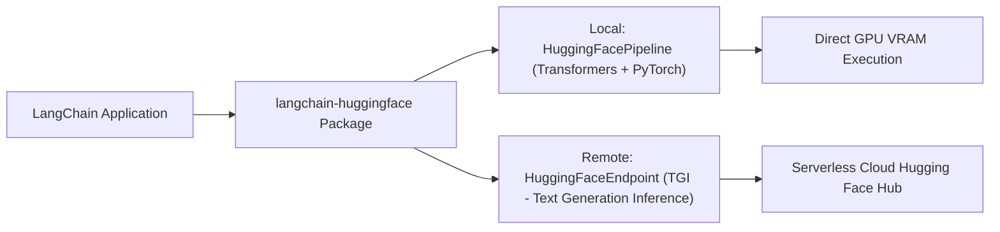

# 📹 Building Gen AI Powered App Using Langchain And Huggingface And Mistral

<div className="video-card" style={{border: '1px solid #30363d', borderRadius: '8px', padding: '16px', marginBottom: '24px', background: 'rgba(56, 139, 253, 0.05)'}}>
  <div style={{display: 'flex', gap: '16px', flexWrap: 'wrap'}}>
    <div><strong>Instructor:</strong> Krish Naik</div>
    <div><strong>Duration:</strong> 1787</div>
    <div><strong>Course:</strong> Module 2: LCEL, Local LLMs & Tool Calling</div>
    <div><strong>Watch Link:</strong> <a href="https://www.youtube.com/watch?v=RZ2Vu8z-P1Q" target="_blank" rel="noopener noreferrer">YouTube Lecture ↗</a></div>
  </div>
</div>

## 📌 Executive Summary

Hugging Face hosts the world's largest open-source AI model hub. The `langchain-huggingface` partner package integrates open-weight models directly via local `HuggingFacePipeline` execution or high-throughput remote `HuggingFaceEndpoint` serverless inference.

This lesson explores loading local Hugging Face pipelines, 4-bit device quantization with `bitsandbytes`, and deploying open-source models with zero commercial licensing fees.

---

## 🏗️ System Architecture & Execution Flow



---

## 📖 Core Concepts & Technical Deep Dive

### 1. Local Pipeline vs Dedicated Inference Endpoints
- `HuggingFacePipeline`: Executes locally using `transformers` and `torch`. Best for air-gapped environments or local GPU workstations.
- `HuggingFaceEndpoint`: Connects to Text Generation Inference (TGI) servers. Delivers high throughput with dynamic batching without local GPU setup.

---

## 💻 Production Implementation

```python
from langchain_huggingface import HuggingFacePipeline, ChatHuggingFace
from transformers import AutoModelForCausalLM, AutoTokenizer, pipeline
import torch

# Configuration blueprint for Hugging Face integration
print("Hugging Face Partner Package integration initialized.")
print("Supports local PyTorch execution and remote Text Generation Inference (TGI).")
```

---

## ⚙️ Production Gotchas & Best Practices

:::tip FlashAttention Optimization
When loading models locally with `transformers`, enable `attn_implementation="flash_attention_2"` to cut memory consumption and accelerate inference by 2x.
:::

:::warning PyTorch Memory Leaks
Always call `torch.cuda.empty_cache()` and delete unused model references when swapping models in memory.
:::

---

## 📊 Architectural Reference & Comparison

| Adapter Class | Execution Target | Hardware Requirement | Cost |
| :--- | :--- | :--- | :--- |
| `HuggingFacePipeline` | Local Host | Dedicated GPU (CUDA) | Free / Self-Hosted |
| `HuggingFaceEndpoint` | Hugging Face Hub / Dedicated | Cloud Managed | Pay-per-second |
| `HuggingFaceEmbeddings` | Local CPU/GPU | Minimal RAM | Free |

---

## 📚 Key Takeaways & Enterprise Checklist

- [ ] **Architecture Verification:** Ensure your design addresses latency, decoupled interfaces, and strict data validation contracts.
- [ ] **Deterministic Testing:** Run unit tests and golden dataset evaluations before shipping changes to staging or production.
- [ ] **Security & Observability:** Enforce input/output guardrails, scrub sensitive credentials/PII, and capture distributed traces.
- [ ] **Scalability & Sizing:** Calibrate model parameters, context limits, and compute instance requirements against projected request concurrency.
