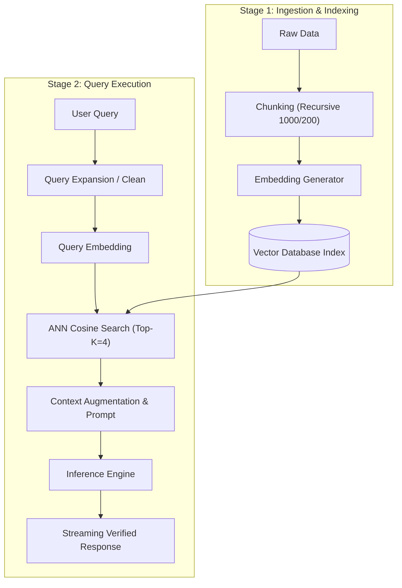

# 📹 End To End Powerful Document Q&A Chatbot using Llama3,Langchain and Groq API

<div className="video-card" style={{border: '1px solid #30363d', borderRadius: '8px', padding: '16px', marginBottom: '24px', background: 'rgba(56, 139, 253, 0.05)'}}>
  <div style={{display: 'flex', gap: '16px', flexWrap: 'wrap'}}>
    <div><strong>Instructor:</strong> Krish Naik</div>
    <div><strong>Duration:</strong> 1482</div>
    <div><strong>Course:</strong> Module 2: LCEL, Local LLMs & Tool Calling</div>
    <div><strong>Watch Link:</strong> <a href="https://www.youtube.com/watch?v=-PSq_ilkvwI" target="_blank" rel="noopener noreferrer">YouTube Lecture ↗</a></div>
  </div>
</div>

## 📌 Executive Summary

Building an enterprise RAG pipeline from scratch requires mastering every stage of the data lifecycle: chunking, embedding generation, index persistence, metadata filtering, query transformation, and synthesis.

This lesson dissects the step-by-step construction of an end-to-end RAG architecture without high-level black-box wrappers, demonstrating exact mathematical scoring and document provenance tracking.

---

## 🏗️ System Architecture & Execution Flow



---

## 📖 Core Concepts & Technical Deep Dive

### 1. Ingestion Pipeline Mechanics
- Text extraction with UTF-8 normalization.
- Sliding-window chunking preserving paragraph boundaries.
- Batch embedding generation with concurrent thread pools.
- Atomic commit to vector database collections.

### 2. Query Transformation & Expansion
Users frequently submit ambiguous, shorthand queries (e.g. "pricing?"). Production pipelines use an initial LLM pass to expand the query into a standalone search string before issuing vector queries.

### 3. Provenance & Source Attribution
Enterprise compliance requires returning citation footnotes showing exactly which document name, page number, and paragraph generated each sentence in the answer.

---

## 💻 Production Implementation

```python
from langchain_core.documents import Document
from langchain_community.embeddings import OllamaEmbeddings
from langchain_community.vectorstores import FAISS

# Step 1: Raw ingestion
raw_docs = [
    Document(page_content="Cluster nodes communicate over mutual TLS on port 9443.", metadata={"source": "networking.md", "page": 12}),
    Document(page_content="Database backups are executed nightly at 02:00 UTC to AWS S3.", metadata={"source": "backup.md", "page": 4}),
]

# Step 2: Indexing
embeddings = OllamaEmbeddings(model="nomic-embed-text")
vector_index = FAISS.from_documents(raw_docs, embeddings)

# Step 3: Retrieval with exact distance inspection
query = "What port is used for node mTLS?"
matches = vector_index.similarity_search_with_relevance_scores(query, k=1)

for doc, score in matches:
    print(f"Match [{score:.3f}]: {doc.page_content}")
    print(f"Citation: {doc.metadata['source']}, Page {doc.metadata['page']}")
```

---

## ⚙️ Production Gotchas & Best Practices

:::tip Batch Ingestion
Always batch embedding requests (e.g. 64-128 chunks per API call) during ingestion. Calling embedding endpoints for single sentences degrades throughput by 10x due to HTTP handshake overhead.
:::

:::warning Score Thresholding
Configure a minimum similarity threshold (e.g. score >= 0.70). If no document meets the threshold, abort generation and inform the user immediately.
:::

---

## 📊 Architectural Reference & Comparison

| Ingestion Phase | Critical Parameter | Recommended Production Value |
| :--- | :--- | :--- |
| **Chunking** | Chunk Size / Overlap | 800-1000 chars / 150-200 chars |
| **Embedding** | Batch Size | 64 - 128 chunks per call |
| **Retrieval** | Top-K | 3 - 5 chunks |
| **Relevance** | Min Similarity Threshold | 0.65 - 0.75 |

---

## 📚 Key Takeaways & Enterprise Checklist

- [ ] **Architecture Verification:** Ensure your design addresses latency, decoupled interfaces, and strict data validation contracts.
- [ ] **Deterministic Testing:** Run unit tests and golden dataset evaluations before shipping changes to staging or production.
- [ ] **Security & Observability:** Enforce input/output guardrails, scrub sensitive credentials/PII, and capture distributed traces.
- [ ] **Scalability & Sizing:** Calibrate model parameters, context limits, and compute instance requirements against projected request concurrency.
