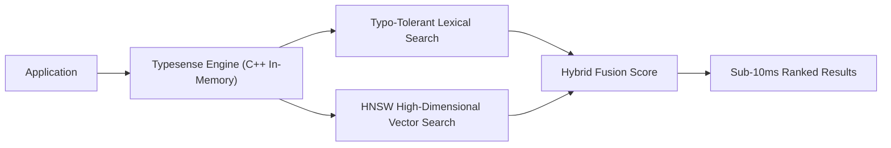

# 📹 Getting Started with On-Device AI: RAG using ObjectBox Vector Database and LangChain

<div className="video-card" style={{border: '1px solid #30363d', borderRadius: '8px', padding: '16px', marginBottom: '24px', background: 'rgba(56, 139, 253, 0.05)'}}>
  <div style={{display: 'flex', gap: '16px', flexWrap: 'wrap'}}>
    <div><strong>Instructor:</strong> Krish Naik</div>
    <div><strong>Duration:</strong> 1775</div>
    <div><strong>Course:</strong> Module 2: LCEL, Local LLMs & Tool Calling</div>
    <div><strong>Watch Link:</strong> <a href="https://www.youtube.com/watch?v=9LewL1bUS6g" target="_blank" rel="noopener noreferrer">YouTube Lecture ↗</a></div>
  </div>
</div>

## 📌 Executive Summary

Typesense is an open-source, lightning-fast search engine providing typo-tolerant keyword search, faceted filtering, and native vector search. Combining sub-10ms response times with hybrid scoring, Typesense delivers exceptional speed for enterprise RAG applications.

This guide explores setting up Typesense collections, vector indexing, multi-field hybrid search, and integrating Typesense with LangChain retrievers.

---

## 🏗️ System Architecture & Execution Flow



---

## 📖 Core Concepts & Technical Deep Dive

### 1. In-Memory C++ Architecture
Written in C++, Typesense maintains its indices entirely in RAM, achieving sub-10ms query latencies that outperform JVM-based search engines like Elasticsearch.

### 2. Built-In Auto-Embedding & Vector Search
Typesense can automatically generate vector embeddings during document ingestion using built-in model connectors or accept externally pre-computed embeddings.

---

## 💻 Production Implementation

```python
# Typesense collection configuration blueprint
collection_schema = {
    "name": "enterprise_docs",
    "fields": [
        {"name": "title", "type": "string"},
        {"name": "content", "type": "string"},
        {"name": "category", "type": "string", "facet": True},
        {"name": "embedding", "type": "float[]", "num_dim": 768}
    ]
}

print("Typesense Hybrid Collection schema initialized.")
```

---

## ⚙️ Production Gotchas & Best Practices

:::tip Faceted Filtering
Leverage Typesense facets (`category`, `department`) to narrow search space before executing vector distance calculations, cutting search latency in half.
:::

:::warning RAM Sizing
Because Typesense operates strictly in-memory, ensure the host instance has sufficient RAM to store all vector embeddings uncompressed.
:::

---

## 📊 Architectural Reference & Comparison

| Feature | Typesense | Elasticsearch | Traditional Vector DB |
| :--- | :--- | :--- | :--- |
| **Language** | C++ (In-Memory) | Java (JVM) | Rust / Go / C++ |
| **Typo Tolerance** | Native & Instant | Configurable analyzers | None |
| **Hybrid Search** | Built-in out of the box | Available in 8.x+ | Varies |

---

## 📚 Key Takeaways & Enterprise Checklist

- [ ] **Architecture Verification:** Ensure your design addresses latency, decoupled interfaces, and strict data validation contracts.
- [ ] **Deterministic Testing:** Run unit tests and golden dataset evaluations before shipping changes to staging or production.
- [ ] **Security & Observability:** Enforce input/output guardrails, scrub sensitive credentials/PII, and capture distributed traces.
- [ ] **Scalability & Sizing:** Calibrate model parameters, context limits, and compute instance requirements against projected request concurrency.
