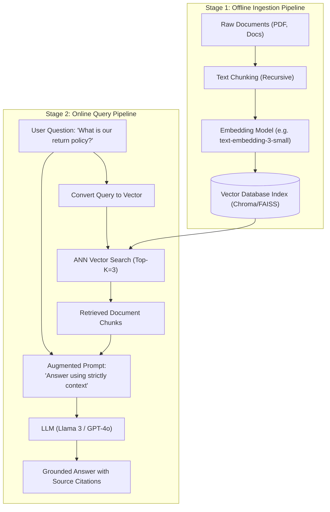

# RAG Architecture: Ingestion vs Retrieval Lifecycles

<div className="video-card" style={{border: '1px solid #30363d', borderRadius: '8px', padding: '16px', marginBottom: '24px', background: 'rgba(56, 139, 253, 0.05)'}}>
  <div style={{display: 'flex', gap: '16px', flexWrap: 'wrap', alignItems: 'center'}}>
    <div><strong>Curators:</strong> Unified Masterclass (CampusX & Krish Naik)</div>
    <div><strong>Module:</strong> Module 3: Advanced RAG & Conversational Memory</div>
    <div><strong>Focus:</strong> Beginner to Production</div>
  </div>
</div>

## 🎯 What You'll Learn
- Understand why foundation models hallucinate and how RAG converts memorization into open-book comprehension.
- Compare RAG vs Model Fine-Tuning across cost, latency, dynamic updates, and accuracy.
- Master the two distinct lifecycles: Offline Ingestion vs Online Query Retrieval.

---

## 💡 Concept & Architecture

Large Language Models have two major limitations:
1. **Knowledge Cutoff:** A model trained in 2024 has no idea what happened yesterday or what is stored inside your company's private Google Drive.
2. **Parametric Hallucinations:** When an LLM lacks confident knowledge, it generates factually false but grammatically convincing assertions.

**Retrieval-Augmented Generation (RAG)** solves both problems by treating generation as an **open-book exam**:
Instead of asking the model to guess from memory, we fetch the 3-5 most relevant paragraphs from our database, inject them into the prompt, and instruct the model: *'Answer strictly using only the provided context.'*

### The Two Lifecycles of RAG
1. **Phase 1: Ingestion (Offline / Batch):** Documents are loaded, cleaned, split into chunks, converted into vector embeddings, and stored in a vector database index.
2. **Phase 2: Retrieval & Generation (Online / Real-Time):** A user asks a question -> the question is converted to an embedding -> the vector DB finds matching chunks -> chunks + question are sent to the LLM -> a verified answer is streamed back.

### System Architecture & Data Flow



---

## 💻 Step-by-Step Code Walkthrough

Below is the complete implementation broken down into digestible parts so you can understand every line.

### Part 1: Step 1: Setting up the Grounded Prompt Template

```python
from langchain_core.prompts import ChatPromptTemplate
from langchain_core.output_parsers import StrOutputParser
from langchain_openai import ChatOpenAI

# Strict grounding prompt preventing hallucinations
rag_prompt = ChatPromptTemplate.from_template("""You are an authoritative enterprise knowledge assistant.
Answer the user's question using ONLY the provided context below.
If the answer cannot be found in the context, reply with:
"I am sorry, but the provided documentation does not contain that information."

Context:
{context}

Question:
{question}

Answer:""")

model = ChatOpenAI(model="gpt-4o-mini", temperature=0.0)
chain = rag_prompt | model | StrOutputParser()
```

#### 🔍 In-Depth Explanation:
Notice the strict refusal instruction: if the context doesn't have the answer, the model must explicitly refuse rather than guessing from parametric memory.

### Part 2: Step 2: Simulating Retrieval and Generating Grounded Answers

```python
# Simulated retrieved context chunks from vector database
retrieved_context = """
[Document: company_policy.pdf | Section 3.1]
All employees are eligible for up to 20 days of paid time off (PTO) per calendar year.
Unused PTO can roll over up to a maximum of 5 days into the following year.
"""

# Execute the RAG chain with context and question
response = chain.invoke({
    "context": retrieved_context,
    "question": "How many PTO days can roll over to next year?"
})

print("Grounded Answer:")
print(response)
```

#### 🔍 In-Depth Explanation:
Because the model is supplied with verified context and temperature is 0.0, it generates an answer grounded entirely in the retrieved document text.

---

## ⚠️ Beginner Tips & Best Practices

:::tip Always Include Refusal Instructions
Without an explicit instruction like *'If the answer is not in the context, say I don't know'*, models will fallback to their pre-trained assumptions and hallucinate plausible answers.
:::

:::warning Don't Overload Context (Lost in the Middle)
Avoid retrieving 20+ chunks. LLM attention degrades in the middle of long prompts (the 'Lost in the Middle' effect). 3 to 5 highly relevant chunks deliver the highest accuracy.
:::

---

## 📝 Key Takeaways & Summary

- RAG grounds LLMs in dynamic enterprise data without expensive retraining.
- The Ingestion pipeline prepares and indexes data; the Retrieval pipeline searches and generates answers.
- Strict prompt constraints prevent models from fabricating answers when documents lack information.

