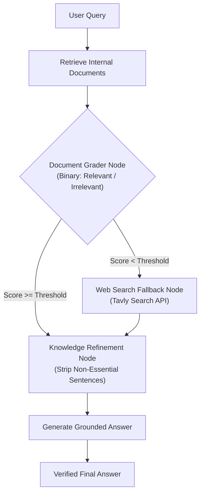

# 📹 Advanced RAG: How Corrective RAG (CRAG) Solves Traditional RAG Problems

<div className="video-card" style={{border: '1px solid #30363d', borderRadius: '8px', padding: '16px', marginBottom: '24px', background: 'rgba(56, 139, 253, 0.05)'}}>
  <div style={{display: 'flex', gap: '16px', flexWrap: 'wrap'}}>
    <div><strong>Instructor:</strong> Nitish Singh (CampusX)</div>
    <div><strong>Duration:</strong> 4509</div>
    <div><strong>Course:</strong> Module 3: Advanced RAG & Memory</div>
    <div><strong>Watch Link:</strong> <a href="https://www.youtube.com/watch?v=41XDn81nR5c" target="_blank" rel="noopener noreferrer">YouTube Lecture ↗</a></div>
  </div>
</div>

## 📌 Executive Summary

Naive RAG fails when vector retrievers return irrelevant or noisy document chunks, leading to catastrophic hallucinations. Corrective RAG (CRAG) introduces an active evaluation layer that grades retrieved documents for relevance, triggers external web search fallback (Tavly) when internal documents are insufficient, and strips irrelevant text before synthesis.

This guide details the CRAG decision graph, document grading rubrics, dynamic query rewriting, and fallback routing in LangGraph.

---

## 🏗️ System Architecture & Execution Flow



---

## 📖 Core Concepts & Technical Deep Dive

### 1. The Brittleness of Traditional RAG
In traditional RAG, whatever documents the vector store returns are unconditionally fed to the generator. If the retriever fetches noise, the model incorporates that noise into its answer.

### 2. The Three CRAG Confidence States
- **Correct:** Retrieved documents exceed the confidence threshold. Proceed directly to knowledge refinement.
- **Incorrect:** Retrieved documents score below the threshold. Trigger web search fallback to gather external ground truth.
- **Ambiguous:** Some documents are relevant, others irrelevant. Combine internal documents with web search to form a balanced context.

### 3. Knowledge Refinement & Sentence Decomposition
Rather than passing entire chunks, the refinement node parses documents into individual sentences, grades each sentence's relevance to the query, and discards extraneous filler text.

---

## 💻 Production Implementation

```python
from typing import TypedDict, List
from langgraph.graph import StateGraph, END

# 1. Define State Schema
class CRAGState(TypedDict):
    question: str
    documents: List[str]
    web_fallback_needed: bool
    generation: str

# 2. Node definitions
def grade_documents(state: CRAGState):
    print("--- EVALUATING DOCUMENT RELEVANCE ---")
    question = state["question"]
    docs = state["documents"]
    
    # Mock grading logic: check relevance
    relevant_docs = [d for d in docs if any(w in d.lower() for w in question.lower().split())]
    needs_fallback = len(relevant_docs) == 0
    return {"documents": relevant_docs, "web_fallback_needed": needs_fallback}

def web_search(state: CRAGState):
    print("--- TRIGGERING WEB SEARCH FALLBACK ---")
    return {"documents": [f"Web search results for: {state['question']}"]}

def generate(state: CRAGState):
    print("--- SYNTHESIZING GROUNDED ANSWER ---")
    return {"generation": f"Synthesized answer based on {len(state['documents'])} verified documents."}

# 3. Assemble Graph
workflow = StateGraph(CRAGState)
workflow.add_node("grade_docs", grade_documents)
workflow.add_node("web_search", web_search)
workflow.add_node("generate", generate)

workflow.set_entry_point("grade_docs")
workflow.add_conditional_edges(
    "grade_docs",
    lambda state: "web_search" if state["web_fallback_needed"] else "generate",
    {"web_search": "web_search", "generate": "generate"}
)
workflow.add_edge("web_search", "generate")
workflow.add_edge("generate", END)

app = workflow.compile()
print("CRAG State Machine successfully compiled.")
```

---

## ⚙️ Production Gotchas & Best Practices

:::tip Fast Lightweight Graders
Use small, fast models (such as Llama 3 8B or GPT-4o-mini) for document grading to avoid introducing multi-second delays before generation.
:::

:::warning Web Search Cost Controls
Configure strict rate limits and daily query caps on external web search APIs (Tavly/Google) to prevent runaway costs during traffic spikes.
:::

---

## 📊 Architectural Reference & Comparison

| Dimension | Traditional RAG | Corrective RAG (CRAG) |
| :--- | :--- | :--- |
| **Retrieval Evaluation** | None (Blind trust) | Explicit grading node |
| **Noise Resilience** | Poor (hallucinates on noise) | High (filters out irrelevant sentences) |
| **Fallback Mechanism** | None (returns wrong answer) | Dynamic Web Search (Tavly) |
| **Control Flow** | Linear DAG pipeline | Cyclical conditional StateGraph |

---

## 📚 Key Takeaways & Enterprise Checklist

- [ ] **Architecture Verification:** Ensure your design addresses latency, decoupled interfaces, and strict data validation contracts.
- [ ] **Deterministic Testing:** Run unit tests and golden dataset evaluations before shipping changes to staging or production.
- [ ] **Security & Observability:** Enforce input/output guardrails, scrub sensitive credentials/PII, and capture distributed traces.
- [ ] **Scalability & Sizing:** Calibrate model parameters, context limits, and compute instance requirements against projected request concurrency.
