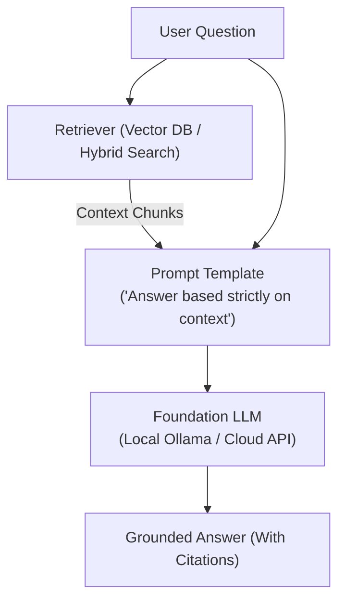

# 📹 Advanced RAG: How Corrective RAG (CRAG) Solves Traditional RAG Problems

<div className="video-card" style={{border: '1px solid #30363d', borderRadius: '8px', padding: '16px', marginBottom: '24px', background: 'rgba(56, 139, 253, 0.05)'}}>
  <div style={{display: 'flex', gap: '16px', flexWrap: 'wrap'}}>
    <div><strong>Instructor:</strong> Nitish Singh (CampusX)</div>
    <div><strong>Duration:</strong> 75m 9s</div>
    <div><strong>Playlist:</strong> Advanced RAG Playbook (CampusX)</div>
    <div><strong>Watch Link:</strong> <a href="https://www.youtube.com/watch?v=41XDn81nR5c" target="_blank" rel="noopener noreferrer">YouTube Lecture ↗</a></div>
  </div>
</div>

## 📌 Executive Summary & Learning Objectives

This lecture covers **Advanced RAG: How Corrective RAG (CRAG) Solves Traditional RAG Problems**, focusing on production implementations, edge cases, and industry standards:
- Core intuition, architecture, and underlying mechanisms.
- Key differences between theoretical research implementations and scalable enterprise patterns.
- Concrete Python walkthroughs, error recovery, and performance optimization.

---

## 🏗️ Architecture & Conceptual Workflow



---

## 📖 Core Concepts & Technical Deep Dive

### 1. Architectural Foundations
In modern production AI engineering, **Advanced RAG: How Corrective RAG (CRAG) Solves Traditional RAG Problems** is essential for ensuring reliability, low latency, and deterministic outcomes. As AI systems evolve from naive prompt-in / completion-out scripts into distributed systems, engineers must handle:
- **State management & consistency:** Ensuring intermediate states and tool invocations are tracked.
- **Error boundaries & recovery:** Graceful degradation when external LLMs or vector stores encounter rate limits or network partitions.
- **Resource utilization & cost efficiency:** Caching common queries and reducing unnecessary foundation model token expenditure.

### 2. Operational Considerations
- **Latency Optimization:** Pre-computing embeddings, utilizing asynchronous non-blocking event loops, and streaming tokens via Server-Sent Events (SSE).
- **Security & Sandboxing:** Validating inputs before ingestion, sanitizing LLM outputs, and isolating tool execution environments.

---

## 💻 Production Implementation Walkthrough

```python
from langchain_core.prompts import ChatPromptTemplate
from langchain_core.runnables import RunnablePassthrough
from langchain_core.output_parsers import StrOutputParser
from langchain_community.chat_models import ChatOllama

# RAG Prompt with strict grounding
rag_template = """Answer the question based strictly on the provided context:
Context:
{context}

Question: {question}
Answer:"""

prompt = ChatPromptTemplate.from_template(rag_template)
llm = ChatOllama(model="llama3", temperature=0.1)

# Format documents helper
def format_docs(docs):
    return "\n\n".join(doc.page_content for doc in docs)

# Complete RAG Chain
rag_chain = (
    {"context": retriever | format_docs, "question": RunnablePassthrough()}
    | prompt
    | llm
    | StrOutputParser()
)
```

---

## 💡 Production Best Practices & Tips

:::tip Production Deployment Guideline
When deploying Advanced RAG: How Corrective RAG (CRAG) Solves Traditional RAG Problems in enterprise environments, always configure automated retries with exponential backoff and telemetry tracing (such as OpenTelemetry or LangSmith).
:::

:::warning Common Failure Modes
Watch out for state contamination across concurrent requests. Ensure each session or user interaction uses an isolated thread ID or execution context.
:::

---

## 🎯 Key Takeaways & Quick Reference

| Dimension | Production Standard | Pitfall to Avoid |
| :--- | :--- | :--- |
| **Execution** | Async / Non-blocking with timeouts | Synchronous blocking calls in event loops |
| **Data Validation** | Strict Pydantic v2 schemas | Untyped dictionary access |
| **Monitoring** | Distributed tracing & latency percentiles | Relying only on standard console logs |

## ⏱️ Lecture Timeline & Key Topics

| Timestamp | Key Topic / Concept Discussed |
| :--- | :--- |
| **00:00:00** | हाय गाइस, माय नेम इज नितेश एंड यू वेलकम... |
| **00:18:04** | एकदम भी रेलेवेंट नहीं है तो फिर यहां पे... |
| **00:36:49** | करके सारे के सारे रिट्रीव्ड डॉक्यूमेंट्स... |
| **00:56:32** | पास भेजना पड़ेगा। रिफाइन नोड के पास और... |
| **01:15:07** | मिलते हैं नेक्स्ट वीडियो... |


---

---

## 📜 Complete Lecture Transcript (English)

> **Language:** English | **Source:** `08 - Mastering LLM Chatbots And RAG Evaluation Crash Course.en-orig.srt` | **Total Segments:** 34 | **Word Count:** ~11,514 words

<details>
<summary><b>Click to expand full chronological transcript (34 timestamped intervals)</b></summary>

#### ⏱️ [00:00 ➔ 00:02]

Hello all, my name is Krish Naik and welcome to my YouTube channel. So guys, another amazing crash course for every one of you out here. In this video, we are going to discuss about LLM chatbot and rag evaluation techniques. Now, this is one of the most important videos that was requested by everyone and the reason is very simple. Nowadays, people are focusing on how to probably use different evaluation metrics for any kind of applications that you specifically develop. Let it be a chatbot or a rag application or an agentic workflow, anything as such, LLM evaluation technique is must. So, what we're going to do in this particular crash course, I think it will be for a 1-hour, you know, completely we'll discuss about different different evaluation techniques. Now, for this, we are definitely going to use LangChain. We're going to use LangSmith. Already, if you know, in my previous videos, I have covered many things with respect to LangChain, LangGraph, and LangSmith. LangSmith is a kind of cloud where you'll be able to, you know, do all these evaluation stuff. So, you can probably go ahead and see the reports of various evaluation techniques over there. If you're developing agentic workflows, you'll be able to see the entire flow, how the data, how how each and every node is basically getting executed. So, we will be referring this. Here, our focus will be on four different things: AI judge evaluation, gold gold standard evaluation, functional test, human evaluations. And here, we'll be doing something like data construction, regression testing. We'll also try to do human annotations. Um I know this will be like a series of videos. Right now, we are just getting started and this will be something amazing to get started with, right? So, please make sure that you watch this video till the end. Uh please make sure that you implement everything is given with respect to code, with respect to written materials. Uh I'll be sharing in the description of this particular video. So, let's go ahead and enjoy this particular video. Hello guys, welcome to this new amazing module on understanding about evaluation of chatbots and rag application. So, this is one of the most important

#### ⏱️ [00:02 ➔ 00:04]

module in this entire uh course that we are specifically studying. And our main aim over here is basically to understand like how do we go ahead and evaluate a chatbot application or a rag application itself. Inside this module, again, there will be a series of videos wherein we will be seeing examples for both chatbot and different kind of rag applications itself. Okay? So, let's let's consider this simple chatbot that you are able to see in front of you, right? Inside this chatbot, I'm just giving an input and this chatbot is generating a kind of output. Now, when we see this kind of chatbots, right? There are many questions that may come in your mind. Okay? The first thing is that which LLM models to use? Okay? Which LLM models to use? Because they are different different models, right? You may use OpenAI models, you can use Google Gemini or Google Gemini models. You can go ahead and probably even use Grok open source LLM models. So, yes, cost is one of the factor which will actually help you to decide. But more important than cost is how accurate your output is basically getting generated for a specific use case, right? So, this is one of the most important question. Now, the second thing is that the input and output that is basically getting generated, how do we decide this LLM is absolutely fine for this particular use case? So, here also, we need to have some ground truth. Ground truth for the output, right? So, here, whatever response is basically getting generated, we should be able to compare both of the specific response along with the ground put ground truth from this specific input, right? And then we should probably go ahead and decide that we how we are going to probably compare the LLM models, right? So, this comparison of the output that is getting generated is also really really important. Okay?

#### ⏱️ [00:04 ➔ 00:06]

So, for this data generation, you need to really know how to create the data, right? Now, when I say data, it should be something like this. For this particular input, this should be my output. Right? This should be the sample of data that should be present with you. Right? And based on this, whatever output is there and whatever the LLM model is basically getting generated or whatever LLM model is generating the output, you should be able to compare it. And then, you should decide on some important evaluation metrics. Okay? So, third is you should basically go ahead and decide on the evaluation metrics. Now, the question rises in the evaluation metrics, who is basically going to do this comparison and all, right? So, here in this particular video, I will be showing you a specific approach which is called as LLM as a judge. The LLM will be specifically deciding because if we use LLM with a specific prompt and then we try to compare the output, then definitely you should be able to see some of the performance metrics. And this is for a chatbot, for RAG application, I will be showing you some other way. Okay? So, here clearly you can see that what are the steps we are basically going to follow. Okay? The first step is that we definitely need to gather data points. So, if I say step-by-step implementation, the first step is that we will be gathering some data points. Gathering some data points. When I say data points, it should be based on a specific input, it should be there should be some kind of output, right? Now, Now question arises how this data point should be, you know? And again, for this we will design one kind of schema where I have some kind of input and output. Okay, output data points. Then after having the specific data points,

#### ⏱️ [00:06 ➔ 00:08]

what we are going to do is that second step, right? To understand the correctness, we will use LLM as a judge. Okay, LLM as a judge. So, this step also I will be showing you how we can go ahead and implement it. Coming to the third most important step is based on the evaluation metrics. Then we'll see that how can we go ahead and apply evaluation metrics. Then fourth, we will be doing the comparison with multiple multiple LLM models. So, we will do the comparison with multiple LLM models. And whichever gives the best evaluation metrics result, we may select that LLM model. Okay? So, these are the steps that we're going to do. And for this, we are going to use LangSmith. Now, why I'm using LangSmith? Because we will be able to do the entire tracking in the LangGraph Cloud on the LangSmith Cloud itself. Okay? So, let's go ahead and do this step-by-step and see that how these things can be implemented. Okay? So, here you can see chatbot and rag evaluation. I've just put some definition for rag, you know? You can just go ahead and read it. So, first of all, what I will do, I will go ahead and write chatbot evaluation. Okay? Chatbot evaluation. Now, inside this chatbot evaluation, the first thing that you actually required, I'll open my command prompt. Okay? And quickly I will go ahead and add my library, which is called as LangSmith, because I require LangSmith and one more library which is called as open AI. Okay? So, I'll be using both these specific libraries to do the installation. Okay? Because I will be requiring it. Okay? So, here you can see that because Okay, my spelling is wrong. LangSmith. Okay. UV add LangSmith and open AI. You can

#### ⏱️ [00:08 ➔ 00:10]

see that I've installed both of them. So, again, please remember this name, UV add LangSmith and open AI. Now, the first thing is that if I'm using LangSmith, okay? I need to go ahead and create an API key for LangSmith. Okay? So, go to or just go ahead and search for LangSmith. Okay? So, here you'll be getting the first page. And from this LangSmith, I will just go ahead and click on sign up. And if you know about LangSmith, uh it is a unified observability and eval platform that team can debug, test, and monitor AI app performance whether building with LangChain or not. Okay? So, that is the reason we are specifically using this. Now, once I go ahead and sign up, this is how it looks like. Okay? Um and I hope from this entire course you may have seen about LangSmith or you should know about LangSmith itself. Okay? So, inside this you have so many different tracing projects. You can go ahead and trace, do each and everything whatever you want. Okay? Now, to get the API key, I will go to settings. Inside this settings, I will go ahead and create an API key. So, let's say I will go ahead and write evaluation. Okay? Then, I'll create the API key. So, I'll copy this API key. Then, I'll go back over here, open my .env file, and I'll paste it over here. See? I'm pasting it over here in front of you. I have to create a key called as LangSmith_API_key. Okay? So, I can go ahead and just use this. So, for my purpose, I will be using this. Okay? LangSmith_API_key. Perfect. Uh now, the next thing is that once I have this key, now it's time that we go ahead and import all the specific libraries. So first of all, I will go ahead and write import OS. And then from .env import load _ .env and I'll go ahead and initialize this. Two two keys that I want to really really import, right? So here I will

#### ⏱️ [00:10 ➔ 00:12]

write os.environ One is the LangSmith API key. So I will just go ahead and set up the environment for LangSmith API key and I'll write os.get get env. And then I will go ahead and use LangSmith API key. Okay? Now once I've done this, the next thing is that I will just go ahead and write os.environ for the same OpenAI API key. Because I will be requiring an OpenAI API key. So I'll just go ahead and write os. get env OpenAI _API_key. So once I initialize both of them, uh then I can also go ahead and use LangSmith tracing so that I will be able to trace each and everything. So I'll write on.environ And here we will go ahead and set this LangSmith _tracing is equal to and I'll make it as true. Okay? So these are the basic environment variables that I have uh loaded it, right? I means I have to load it. Now the next step is that I will first of all create the data points. Now create the data points. Now see, for creating the data points basically means for a specific input, what will be the output? And for this, what we will do, I will go ahead and import from LangSmith import client. Now, see, if I go back to LangSmith, okay? If I go back over here, okay? Here, you'll be able to see that in LangSmith, you will be able to do the observability, where you can trace the project, monitor it. Here, you can also evaluate. So, inside the evaluation, you'll be able to see that there is something called as datasets and experiments. There is something called as annotation

#### ⏱️ [00:12 ➔ 00:14]

and queue. And you can also do prompt engineering. And finally, if you want to do deployment, you can go ahead with LangGraph deploy platform deployment platforms, right? Where we have already seen LangGraph Studio. Now, here, I'm planning to use this evaluation. Now, inside evaluation, you will be having something called as datasets and experiment. So, the main aim of this particular section in the LangSmith is that you can go ahead and create your new data over here, and you can also evaluate it directly over here by performing some experiments. Okay? So, we are going to go ahead and use this specific module itself, okay? Now, the first step is that I want to go ahead and create some data and store it over here, okay? So, let's go ahead and do that. I will go ahead and store it directly over here. So, I'll go over here, and I'll import from LangSmith import client. I will quickly go ahead and initialize my client. So, it'll be like client of client. Okay? Um this will basically be my variable. So, I'm initializing a client. This client will be responsible in uploading the dataset. So, I will say define the dataset, and these are like these are your test data. Test data, okay? Now, I will go ahead and write dataset_name is equal to let's say uh it's a simple chatbot evaluation. I'm just going to go ahead and write like this. Okay? Now, the question arises, how do we go ahead and create a data set? So, data set is equal to client. create There's a There's a method which is called as client.create_dataset, and I will give the my data set name. Okay? Now, this will be an empty data set, but inside this, what See, this is the function. If you see this button, you create a data set in LangSmith API. But inside this, I need to insert some

#### ⏱️ [00:14 ➔ 00:16]

examples, right? So, here I can go ahead and write client. create examples. See, there are so many different different examples. Uh there are so many different different inbuilt functions like this. Create comment, create chat example, create annotation queue, create data set, right? Create data set we have used. I'll just go ahead and write create examples, okay? Now, create examples. Here, you can see you can give the input data set ID, data set name. All these are parameters. Create a data set example in the LangSmith API. Examples are row in a data set containing the input and the expected output. Only it requires an input or expected output. So, here, I will just go ahead and write something like data set _id. First of all, I need to go ahead and give the ID. So, for this, I will say dataset.id, okay? So, if I'm directly giving this .id, right? Whatever variable this is, this will by default initialize some kind of ID as the data is getting inserted. Now, the next thing is that we will go ahead and set up our examples. Now, this is where we will be putting our data set. Now, with the help of chat GPT, and when I was seeing the documentation, I've created some data set over here. You can see over here. So, inside this data set, you have like input and output. So, if you see, it is like This is the this is output. It should be in the form of key value pairs. Like question is what is LangChain? Answer is a framework for building LLM application. Then question what is LangSmith? Then output a platform for observing this. Then similarly like this we have done this. And it should be like a in inside a list of examples. So guys, now once we have created this as an examples, all I will do is that I will just go ahead and execute this code, okay? Now after this code is executed, right? So what will happen is that directly this all records will directly get created inside LangSmith. So let's see that. So I'm just going to execute this. So it is giving me an error, let's see.

#### ⏱️ [00:16 ➔ 00:18]

Conflict for data set uh Okay, data set name. I'll just go ahead and give some other data set name, just a second. I think I have created something like this, okay? So I'll say chatbot evaluation. I think I earlier I created this, so let me just go ahead and execute this now. Now here you can clearly see that my five records has got inserted. Now it's time that we go ahead and see this specific data set over here. So here you can see simple chatbot uh or see, simple chatbot evaluation I earlier I had created it, so that was an error. So I got this chatbot evaluation. See? All the five records are there. So whatever name you are specifically giving, you will be able to see that specific record and you can see just now it has got updated. All right, now it's 3:31 p.m., right? So all these specific records has got updated. So if you see over here, this is my input, this is my reference output. So this is my ground truth, okay? I'm just considering this as my ground truth. So this is how you go ahead and insert the data, okay? And here you can clearly see what I've actually done. I've created a client. I've given a data set name. We have created empty data set and then we are adding any number of examples as we want, okay? So you can also automate this particular process. Let's say if there are specific data set some team are actually working, they are doing the annotation putting inputs and outputs. We can also directly read that particular data set from a CSV file, from an Excel file, and directly go ahead and insert it over here. Right? So, this is the first step wherein we specifically discussed that we need to go ahead and gather some data points and create it for us. Okay? Now, in the next step, what we are going to do is that as I told you, right? We are going to use LLM as a judge, right? So, if you're using LLM as a judge, LLM will probably whatever the LLM model is generating the output, we will go ahead and see the correctness for that specific output and we'll build up a

#### ⏱️ [00:18 ➔ 00:20]

second step. And that is what we are going to discuss in the next video. So, yes, this was it from my side. I'll see you all in the next video. Thank you. Hello, guys. So, we are going to continue the discussion with respect to evaluation of chatbot. Already in our previous video, we have seen that how we can go ahead and directly create data points and insert even in the LangSmith Cloud, right? So, we have done that both step. And you could see that inside my LangSmith Cloud, we are also able to see this particular data set. Now, we can apply different different evaluation metrics. Now, already I have said that the kind of evaluation metrics that I'm actually going to apply is that I will create LLM as a judge who will be responsible in evaluating the output that is generated by any LLM itself, right? So, for this, what I will do, I will quickly go back to my coding file. And here, I will go ahead and write um we are going to go ahead and define the metrics. And as I said, for this, we will be using LLM LLM as a judge. Okay? Now, for this quickly, what I am actually going to do I will just go ahead and import. So, I'll write import open AI. Now, see when I say I'm using LLM as a judge I will create a function wherein I will say that hey, this is the prompt what LLM should basically follow. Based on the output that is generated by any LLM that we are using, we need to go ahead and judge whether those response based on the input is correct or not. Okay? Now, along with this I will go ahead and import from LangSmith import wrappers. Okay. Then, I will go ahead and define my open AI underscore client. This client will be my open AI model. So, here I will say open AI client is equal to wrappers dot wrap underscore open AI.

#### ⏱️ [00:20 ➔ 00:22]

Now, if you see this wrappers, this module provides a convenient tracing wrappers for popular libraries. See, in LangSmith uh since we also want to make sure to trace each and every call that is specifically happening in the LLM, we can directly use this particular wrappers and with the help of this wrap open AI, it will patch the open AI client to make it traceable. That's it. Okay? We are just using the specific inbuilt function over here. It supports chat and responses API sync and a sync open open AI clients and all. So, you will all just understand why I am actually making it as wrap underscore open AI. Okay? And here we will go ahead and call our open AI dot open AI for using any specific models. Okay? Now, the next thing is that we will go ahead and use some kind of instructions. Okay? So, instructions over here will be eval underscore instruction. I'm saying that you are a expert professor specializing in grading student answer to the question. Okay? So, this is the evaluation instruction. So, now I'm just going to go ahead and use one evaluation metrics that is correctness. I'll be defining this as my own custom one. Here, we will be giving our inputs. The inputs will be in the form of dictionary. Comma, the output will also be in the form of dictionary. Then, there will also be a reference output. Okay, reference outputs. And this output reference output is the ground truth output. Okay, so this will also be in the dictionary. And this function should return a boolean value. Okay? Saying that how accurate or how whether it is correct or not. That's it. Okay? Now, what we are going to do over here is that I will go ahead and define a variable. Inside this variable, I'm just saying that hey uh let me see this output spelling is wrong. Okay. So, inside this, I'm defining a prompt which is saying you are a grading the following question. So, this is my input. So, here I will go

#### ⏱️ [00:22 ➔ 00:24]

ahead and define this as outputs. Okay. You're grading the following question. Here is the input of question. Here is the real answer. You're grading the following predicted answer. Okay, and this answer will be generated by the chatbot. Respond with correct or incorrect grade colon. Okay. So, here it will either respond correct or incorrect and it should be a boolean value as a return, right? And that grade is equal to that specific value will come automatically. Now, inside this particular function, what we are going to quickly do is that we are going to go ahead and define our response variable. And here, I'm going to use my open AI underscore client dot chat completion chat dot completions dot create. Okay. Create. And here, we're going to use model is equal to GPT 4 o mini. Okay. Comma temperature is equal to zero. Comma messages is equal to Here I will be defining two important keys. So here, one comma and the other comma In the first, we are going to define the role. So role will be nothing but system. The role colon system. And then my content should be whatever content we have specifically given in the eval instruction. So this is a system prompt. You can just consider that. I'm providing a system prompt to my uh LLM model saying that, "Hey, you are an expert professor specializing in grading students and all, right?" Then the role next role will be for the user because user will be supplying the message. So here uh I will just go ahead and give my user and content will be nothing but it will be user (underscore) content. Okay? Whatever user (underscore) content is basically given over here. So this is

#### ⏱️ [00:24 ➔ 00:26]

what is the user giving as a message over here itself. Okay? So once this is done, uh then after this you can just go ahead and write dot choices of zeroth and you just read the last messages. message.content, okay? So this is how you specifically return it. And uh it will just return See, here it is responding either correct or incorrect, right? So what I will do if it should definitely return a boolean value. So here what I will do, I will write something like this. Okay? Correct. If the response is correct, it is just going to give as true, okay? If the response is correct, it is going to give true, otherwise it will give false, okay? So this is what we are basically done with respect to defining metrics, okay? Now along with this, I can also define one more metric. See, this is just one of the metric wherein this is the system prompt, this is the user question. We are just comparing it and this particular OpenAI client is basically making the decisions out there, right? Now, what we'll do, we will go ahead and create one more metric. And this metric is something called as concision, okay? I'll talk about this, but this metric is very simple. It is just checking over here. I'll just go ahead and give. It checks whether This is just like one kind of metrics I have applied it from my end. So, here what we are doing is that here we are checking whether the actual output is less than two times the length of the expected results. That's it, okay? So, here you can see I have the output, I have the res- reference output. I'm just comparing. Okay? If the length of output response is less than two into length of this. So, if both this satisfaction uh if both this criteria has been satisfied, that basically means it has passed both this particular metrics, okay? So, this is my first metric and this is my second metric. Now, uh

#### ⏱️ [00:26 ➔ 00:28]

the third important step will be like how to go ahead and run the evaluation, okay? And understand this specific evaluation should directly run in the LangSmith also and it should should you should be able to see the answer, okay? Now, that specific thing we will try to see in the next video. So, finally guys, we are into the run evaluation step wherein we are going to specifically run the evaluations for this particular chatbot. And uh if you remember, we have created two different metrics. One is this correctness function and the other one was the concision function, okay? So, based on both this functions, we are going to define the evaluations now, okay? We have We have to run uh I can basically say that these are my evaluation metrics and based on this we need to run every evaluations. So, first of all uh before I go ahead and start running any evaluation, first of all, what I will do is that I will just go ahead and create a default instruction. So, this is my default instruction. It responds to the user question in a short concise manner, one short sentences. This is what you need to generate with respect to the LLM. And then, I will define one function which is called as my_app. Now, inside this my_app, I give my model like GPT-4 Mini. There will be a question and there will be an instruction based on this. Because my LLM needs to generate an output and then for that particular output, we will go ahead and run both this particular metrics, right? So, here you can see I'm returning openai client.chat_completion.create. I have model, I have this message, instruction, question and we are basically giving this, okay? So, once I execute this here, you can actually see this particular function will be called, okay? Now, uh Now, this function needs to be called for every question inside my data set. So, what I will do since this And this function is nothing but it is basically my chatbot function, you can just say, right? My app chatbot, what it is doing, it is basically taking the

#### ⏱️ [00:28 ➔ 00:30]

question, model, instruction and it is generating some kind of output. So, I will go ahead and call this for every input question, right? So, I will call my_app for every data points and then we will compare, okay? So, for this, what I will do, I will go ahead and write, I'll create a function called as LS_target, input is equal to STR. Whenever I give an input, so that input question needs to be mapped over here, okay? And this function needs to be called for every input, okay? Uh input of question is basically every question is over there and this my app will be called and for that every response will be generated. So, once you have both these functions, now we can go ahead and run our evaluation. So, run our evaluation. Okay? So, for this, I will go ahead and write experimental or experiment (underscore) results is equal to client. evaluate And here, I'm going to specifically use LS (underscore) target. So, this is the function that is basically going to take every inputs. Uh so, I'm giving this. This is my uh I'll say your AI system, which will be generating the response. Then, I have my data. I need to provide my data set. So, data set (underscore) name. Um This data is the same data that we had actually worked on, right? The third important parameter is something called as evaluators. Now, inside this, we have created two function. One is correctness, (comma) concision. Okay? And then, fourth is I will just go ahead and write experiment is equal to uh experiment (underscore) prefix. Like, what should be the name of the experiment? If See, for this particular data, we need to run an experiment, right? So, I will just go ahead and write this as my name. So, this will be nothing but OpenAI &gt;&gt; [snorts] &gt;&gt; 4o mini. Okay? Prefix name for my experiment. So, once

#### ⏱️ [00:30 ➔ 00:32]

I go ahead and execute this, now see the magic. Or I'll say, "Hey, uh OpenAI 4o mini." I'll say, "This is for my chatbot." And let's see whether this will run or not. Okay? So, as soon as I run this, you see this. Okay? It'll take some time based on all the input question. And here, you can see you can view the uh evaluation results for the experiment in this specific uh uh URL. Okay? Now, what I will do, please remember this name, OpenAI 4o mini chatbot. Okay? I will go back to my LangSmith quickly, and I will go to data sets and experiments. So, here, you can see chatbot evaluation name is there. Okay. Uh and here, you can see this concussion and correctness. And this is my experiment name. Right? So, for correctness, it is somewhere around 0.60. For concussion, it is somewhere around 0.40. Okay? And if you see for the examples over here, uh it is there. Evaluators pairwise experiments also there are multiple options over here. But, I think I will just go ahead and click this. Now, you'll be able to see your input, your reference output, and your output. So, this is the output that is Here you can see reference output is over here. Okay? This is the output that has got generated. Okay? And we are basically comparing it and based on this concussion and correctness, some information you're able to get. Isn't it just amazing? Now, there may be scenarios that you also want to use different different models, right? So, for this also you can go ahead and try different different models. So, here what I will do, I will go back to my code. And I will rebuild this specific function. You see, this function over here takes input, right? And here I will go ahead and call this function for every data points. I'm giving my response my input. So, in my my input, right? You can also go ahead and give your model name. So, here by default it was GPT-4 Mini. Let's try some other model. So, here I will go ahead and say after question, model is

#### ⏱️ [00:32 ➔ 00:34]

equal to and let's try GPT-4 Turbo. 4 Turbo, okay? And let's call this. Uh now my list target is done. Now, I'll call the same experiment. And this time I'll write 4 Turbo. Turbo chatbot. Okay? And let's execute this. Now, this will be my second experiment that will get created. So, once I go ahead and see here in my chatbot evaluation, this will take some time. So, this is my second experiment. And here the accuracy is very good. Correctness is one. Okay? I think it is one only. So, it's still things are getting generated. It is taking some time. Yeah, now it is there. And here you can see that correctness is one. And based on this, the conciseness is less. Okay? Correctness, okay, it is 0.6. I thought it was one. I think it just got reduced. It got 0.6 and 0.2. So, if you get an option whether I should go ahead with OpenAI 4o mini or OpenAI 4 turbo, right? So, guys, I hope you like this particular video. Now, what you can do is that you can even try with different different models, different GPT versions, specifically with respect to OpenAI. And you can just go ahead and see with respect to that particular accuracy. And you can also observe them in the LangSmith. But I hope you were able to understand this particular video. This was about RAG evaluation for a chatbot. Okay? And here all the steps that we specifically followed, we created data points. Uh we made LLM as a judge. We created multiple metrics evaluation metrics. And we compared multiple LLM models. Now, based on this, you can go ahead and select any of the model that you like. Now, what we are going to do in the next video, in the upcoming videos, we are going to see for a RAG application. Now, see, for RAG application, what should be the usual metrics? And how we can use LLM as a judge to probably go ahead and create this. Because see, at the end of the day, RAG, you have third-party data. You have

#### ⏱️ [00:34 ➔ 00:36]

company data. You may have internal data. So, for this, how we can go ahead and apply the evaluation metrics, that is what we are going to discuss in the next video. So, I hope you like this particular video. I will see you in the next video. Thank you. Take care. Hello, guys. So, we are going to continue our discussion with respect to evaluation metrics in this particular video. And in the upcoming series of videos, we are going to discuss about RAG evaluation. Now, in RAG evaluation, we are going to specifically talk about topics like how to create test data sets. How to run RAG app with those specific test data sets. How to measure rag performance? Again, by using different different evaluation metrics. So, all these things we will discuss it step by step, okay? And again, here we are going to use LangSmith. Since uh in the back end you will be able to see that particular data, you'll be able to run experiments, right? So, we will be specifically doing all these things, okay? So, in order to make you understand like how we are going to go ahead with the rag evaluation, uh there are some things and I'll I'll just show you a workflow to understand which all evaluation metrics also we will be discussing about, okay? So, let's consider this particular diagram. This diagram was actually given in the documentation of LangSmith itself, okay? And with respect to this particular documentation, here you can see that here is my search retriever, okay? It can be a document search, it can be a web search, or anything as such. So, here when we give the question and with respect to this particular search, when we get this relevant documents, the first important performance metric is that should we not check whether these documents are really relevant or not? Okay? Based on this particular input question. So, this can be one of the metrics. The other metric is that once we generate the output by taking this particular relevant documents to and integrating it with LLM or giving it to the LLM in the form of context, once we generate the answer, the second

#### ⏱️ [00:36 ➔ 00:38]

important metric is that is the answer grounded in the documents? Okay? So, we basically go ahead and find out groundness. We go ahead and find out retrieval relevance. The third important thing is that once we get the output, we try to find out the correctness. Correctness basically means does the answer match the ground truth answer? Okay? So, because we should also have some kind of ground truth, right? And with respect to correctness, the answer that is generated, is it similar to the ground truth answer or not? Okay. One more very important thing is that with respect to the answer relevance, does the answer addresses the question? So, here are some few metrics that you should be able to see based on which you can actually go ahead and run a evaluation metrics on top of a rag to check the performance of the rag itself. Because accuracy is the main key thing. But, if I just consider by seeing this particular flow, there can be four amazing metrics that we can go ahead and implement it. And we'll do it step by step as we go ahead. But, this we'll still discuss and we'll we'll we'll implement each and everything step by step, okay? Now, how we are going to go ahead and do the rag evaluation? So, first of all, what we will do, the first step, the first and the most important step is that. So, here what all steps we are going to follow? The first step is that we will go ahead and create a rag. Okay, retrieval augmented generation, where there should be a retrieval, there should be some data set. So, when I say rag, there we will follow this entire cycle. We will go from data ingestion to creating retrieval and then we will also be creating this generation. Now, after doing this inside this retrieval, you know that we will be putting some kind of document. Now, based on that document, we will the second step will be that we will go ahead and create our test data. And here also the test data will be created in such a way that we will be able to see that based on a specific answer, what is the Oh, sorry.

#### ⏱️ [00:38 ➔ 00:40]

Based on a specific question based on a specific question, what is the answer? Okay, what is the answer? So, this answer will be our ground truth, okay? And then third the most important thing we will go ahead and create different evaluation metrics. This evaluation metrics will be based on this. Will be based on all these things that we discussed. 1 2 3 4. And here, if you really want to implement all these things, we will again consider LLM as a judge. Because LLM are really good. They are improving day by day. You have such a powerful models, then why not use LLM as a judge in order to find all this or in our order to implement all these evaluation metrics. So, we'll go step by step. So, first of all, in this particular video, let's go ahead and finish this step, okay? Where we'll create a DAG, where we have data ingestion, retrieval, and generation. This step must be easy now for you all, because we have implemented it many number of times, okay? Many, many number of times. So, quickly, uh let's see this, okay? Here, what we are going to basically do is that I'll be taking three important blogs article, okay? And I will try to create this particular rags. So, first of all, we will go ahead and create a rag. So, for rag, you'll be able to see that I'm using web based loader. We have in memory vector store, OpenAI embeddings, recursive character text splitter. I've used LangChain OpenAI. And this time we have used in memory vector store, okay? So, these are my list of URLs. So, blogs URL, you can see related to agent, prompt engineering, adversarial attack LLM. This was available even in the documentation. So, I thought of giving this particular example. You can go ahead and apply with any number of examples that you like. Then, we load all the documents from the URL, okay? We get all the documents. We initialize the text splitter. Then, we have recursive character text

#### ⏱️ [00:40 ➔ 00:42]

splitter. Then, once we do this, we split the specific documents. We get the vector store, and we finally get the retriever. So, this is my retriever. So, the rag part that you will be able to see, we are able to implement this, okay? So, this will take some time to execute, because there are so many content over here, but I think it should be. Now, with respect to retriever, I can just go ahead and use this and write dot invoke. If I ask a question, what is agents? I should be able to see the answer. Okay. So, I'm getting all this particular context. Okay. Now, this is done. So, here you can see I've also got this LangSmith rate limit exceeded because we have limited number of requests that we can do for LangSmith, but it's okay. Uh we'll try to do this. Okay. Now, the next thing is that what we are going to do is we are going to define the generative pipeline. Okay. Because we need to go ahead and generate it. So, for this, what I will do, already you know I have my LLM. So, this is uh my LLM was not defined. Let's see. On the top somewhere I should have defined LLM. Okay. Uh here it is. Oh, wee. Uh let's see where is the Okay, LLM is not defined. No worries. I will go ahead and define it again. Okay. So, first of all, I will go ahead and write import OS. And with respect to OS, I will Okay. I already have loaded the environment variable, right? So, I will say init. So, let me go ahead and write from LangChain under LangChain dot chat_models, we are going to specifically use chat_models import init model, init chat model. And here we are going to go ahead and use init chat model. And specifically, we are going to use the model like OpenAI GPT 4o mini. Okay, let's use the specific

#### ⏱️ [00:42 ➔ 00:44]

And this is what is my LLM looks like. Okay. Now, once I have this LLM model over here, okay, it looks good. Now, what I'm actually going to do is that I will go ahead and create that rag part. See, rag part I have the retriever, right? But I also need to have the the generation part, right? So, I will first of all import from LangSmith LangSmith import retrieve import for LangSmith import traceable, okay? Once we are using this traceable, that basically means I also want to trace everything of this in the LangSmith itself, okay? So, for this I will go ahead and add this decorator. So, on any function that you add this decorator, the tracing will automatically start. So, here I can go ahead and write traceable. And here I will go ahead and write definition rag underscore bot. So, this will basically be my bot. And here I will go ahead and write my question as str, okay? So, here we specifically give a question and in return we get a dictionary. Okay? Now, rag underscore bot should be very very simple. What it should happen I should be using this retriever dot invoke. I should be giving the question over here. So, the once I give this question based on this I will be getting the relevant context. So, here you can see that I will be getting the relevant context. So, first of all I really want to go ahead and define my entire rag itself. So, this rag underscore bot will be my generation part, right? Then what we'll do we will go ahead and use a docstring and we'll combine all the documents that we have, right? So, here you can see I have already done like this empty space dot join with respect to all the page content from all the documents that I'm getting. Now, the next thing is that we will go ahead and create a prompt. Because at the end of the day inside this prompt only we'll give this documents, right? So, you are a helpful

#### ⏱️ [00:44 ➔ 00:46]

assistant who's good at analyzing source information and answering the question. Use the following so and so. Use three sentences maximum. Keep the answer concise. And this is what is my document string. Okay? Document string means what is the relevant context that we are getting, right? And then finally, we will go ahead and use LLM. LLM invoke over here. Okay? So, let me quickly go ahead and write LLM.invoke. And here, we are going to specifically give based on our roles that we have decided, right? So, roles, instruction, and all the information is over here. Okay? So, here you can see that. I've given role, system user, instructions, question content is equal to question. Okay? So, here you can basically see based on this whatever instruction is there, whatever question is basically coming in, we are getting the invoke statement. We are doing it. And this becomes my AI (underscore) message or response. Okay? And we are going to go ahead and return this. Return this as answer. Answer colon AI (underscore) message. dot content. Content. Okay? And then we also going to go ahead and give out documents. Whatever documents were there. Right? Which is our relevant documents itself. I mean, retrieve documents. So, this becomes my generation function. Very simple. Right? So, I have created this as Very important, we had created this entire rag. Now, what we can actually do, this rag bot can basically go ahead and answer with respect to any question that we specifically ask. And automatically, we should be able to get the AI message.content and answer. So, let's say if I go ahead and ask over here. Uh AI, sorry. I'll go ahead and just call this particular function. Rag bot with the question. So, here if I go ahead and ask, what is agents? Okay? Then I should be able to get the answer over here with the message content and documents with respect to the other. So, agent refers to autonomous entity particular in this and

#### ⏱️ [00:46 ➔ 00:48]

this answer is there. And this is my entire context with respect to the documents. Okay? Now, you know that we have used this three important article as our retrieval. Okay? So, here if you go ahead and see, we have created this entire rag from data injection to retrieval to generation. Now, it's time that we go ahead and create a test data for question answering. Okay? So, in order to create the test data, so let's go ahead and create our data set. And we'll make sure that this data set will be available in the um you know, we we go ahead and import this directly in the LangSmith. Okay? So, for creating this particular data set again, we will go ahead and write from LangSmith import client. Okay? Client We will go ahead and initialize our client is equal to c l i e n t client. Okay? And then first of all, we will go ahead and create our examples of the data set, where I'll be having the inputs and outputs. See? So, input question is all How does the agent react using this self-reflection? This is the answer. So, this is my ground truth. Okay? Ground truth. Okay? With respect to the inputs and outputs. So, this is how you should basically go ahead and uh uh keep it, right? So, here inside you have your questions and answers also. Okay? Now, I will go ahead and create the data set data set and examples in LangSmith. Okay? LangSmith. Now, how do you do that? If you remember previously, I will just go ahead and write something like this. Okay? So, here you can see, data set client.create_dataset. I will just go ahead and use the data set name. So, let me go ahead and write a rag test evaluation. Okay? So, this is my data set. And this is based on the data that I have, right? My ex- my external data from that blog. So, based on this I created this three input data itself. And we'll try to test on basis of this. This output is my ground truth, right? When the LLM generates an output,

#### ⏱️ [00:48 ➔ 00:50]

we'll compare with this output. Okay? So, once we do this and once we execute it, so here you'll be able to see that this data has got created. So, let's see in our LangChain whether that data will be available or not. So, if I go back to data and experiments, so where is it? Uh Uh RAG test evaluation, see? Three records may be there over here. Okay? So, how does react is there? How does react uh this question is there? Agent uses self-reflection and this is the answer. So, I have all my data sets, right? Now, it's time that we start working on our evaluators. See, this step is very simple. Whatever we have done the couple of steps. Now, we have to go ahead and start creating our evaluators. Now, evaluators are something really important. We are going to go ahead and use four different evaluators. Okay? So, for this I will just go ahead and write some comments also for you. Okay? So, it's okay. In the next video I will show you. Before that, I will just go ahead and write it down. So, here I will say that from the next video, we're going to go ahead and work with the evaluators. Okay? Evaluators or metrics. Like what all metrics we have to specifically work on. So, here quickly you could see that from this particular diagram, we implemented the first step, second step. Now, the third step is that we will go ahead and create all these evaluation metrics, four evaluation metrics, 1 2 3 4, one by one. Okay? And then we will start working on it. So, I hope you like this particular video. This was it from my side. I'll see you all in the next video where we talk more about evaluation metrics and I'll show you how we can use LLM as a judge. Okay? So, yeah. I'll see you all in the next video. Thank you. Hello guys. So, we are going to continue the discussion with respect to evaluation metrics. The first evaluation metrics that we are going to discuss about is correctness. That is nothing but response versus res- reference answer.

#### ⏱️ [00:50 ➔ 00:52]

Now, already in our previous video, we have done these two steps, right? Creation of rag and also creation of the test data. And we inserted even in the LangSmith. Now, we have to go ahead and design evaluation metrics. Which all evaluation evaluation common metrics we can discuss with respect to rag are four, okay? So, here is the entire diagram. The first evaluation metrics we will go ahead and discuss about correctness. Now, what does correctness basically mean? Since you know that we already have the ground truth answer available in the LangSmith, right? For every question that we specifically ask or with respect to the question that we have designed. Right? So, that actually becomes our ground truth answer. And correctness basically means that whatever LLM is generating, we are going to compare that with our ground truth answer. That is the reason we have written something called as response versus reference answer. Response basically means it has been generated by the LLM. And reference answer is actually your ground truth value. So, here the goal is measure how similar or correct is the rag chain answer relative to a ground truth answer. Mode, it requires a ground truth reference answer supplied through a data set. Evaluator, here we are going to use LLM as a judge to assess answer correctness. That basically means LLM will make sure to compare the ground truth answer and the reference answer. Sorry, and the response answer. So, we'll go ahead and implement this. Already in our previous video, we have done all these things. So, let's go ahead and do this. So, for this, I will go ahead and write for typing (underscore) extension. First of all, I'm going to go ahead and import annotated (comma) type dict, okay? So, why we are doing this? Because we actually require this. Now, the first thing what we are going to do is that uh See, when LLM is basically comparing the ground truth answer and the response, it needs to provide you the output in some specific format, right? So, for that, what we will do, we will go ahead and

#### ⏱️ [00:52 ➔ 00:54]

write, okay, this will be my correctness output schema. Okay, so this is how my output is going to come. Okay? Now, how the output will going to come? I will go ahead and define class, and I'll write class correct correctness grade. Okay, so this will basically be my class. It will be of type date. So, my LLM should provide a response based on the specific class. Okay? Now, in this, we will define two different variables. One is explanation. This explanation is nothing but it will be an annotated type. Here, I'm going to go ahead and write string. Along with that, I will also go ahead and provide some description. I'll say explain your reasoning for the score that you generate by comparing. Okay? So, this basically becomes my description. Second, I'll say I'll also define a variable called as correct, which will also be a type of annotated. It will be a Boolean variable, and here, we'll say true if the answer is correct or false otherwise. Okay? False otherwise. So, this two, we are going and defining it, right? Now, the next thing is that we will go ahead and write the correctness prompt. So, what specific prompt we will be using? We will basically go ahead and write correctness prompt. So, for this, we will go ahead and create a prompt. The prompt looks something like this. Okay? Because this prompt will be used by the LLM. See, I'm saying that you're a teacher grading a quiz. You will be given an answer, you'll be given a question, the ground truth, and the answer. So, these three things will be given, and the student answer will be given. When we say student answer, that basically means we are considering it as a LLM answer. Here is the great criteria to follow. Grade the student answer based on only the factual accuracy relative to the ground truth answer. Ensure that student does not contain any conflicting statements. It's okay if the student answer contains more information than the ground truth as long as

#### ⏱️ [00:54 ➔ 00:56]

as long as it is accurate, okay? Correctness, so this will be the score. A correctness value of true means student answer meet all the criteria. False means it does not meet all the criteria. Explain your reasoning in step-by-step manner. All this information I've given it over here, okay? Now it's time that we go ahead and create our LLM, right? So now my LLM I will use a init chat model. So let's say over here my model name will be nothing but OpenAI or instead of using this, what I'll do since I'm going to also go ahead and use this. So I will go ahead and import from LangChain under score OpenAI im or LangChain under score uh OpenAI import chat OpenAI. Let's go ahead and use chat OpenAI instead of init OpenAI because here I will try to give my structured output, okay? So here I will be using OpenAI model. So my model name will be nothing but here I will go ahead and say model is equal to GPT-4o-mini okay? And then you'll be able to see that I will also give my temperature value. Let's say okay, let's go ahead and set up some temperature value. Temperature value is equal to zero, okay? And then this I will go ahead and write with structured output. Which structured output? Because LLM needs to provide the based on the output based on this particular class. That is correctness grade, okay? And then uh we will also make sure to provide the response in the form of schema. So here I will go ahead and write comma method is equal to and let's go ahead and select this as JSON (underscore) schema. Okay? And here we are going to make it strict is equal to true. So, I'm just saying that follow this specific structured output only. Okay? So, these are the parameters that we are specifically using in order to create the LLM. Now, the next step is that we will go

#### ⏱️ [00:56 ➔ 00:58]

ahead and define our correctness response, right? The how the evaluator will be. So, here I will go ahead and define a function. So, here you can see that let me change it to greater (underscore) LLM. So, here you can see in the correctness function, it is a independent function because this function is nothing but my evaluator. It takes the input, output, reference output in the form of dictionary and gives you a boolean value. So, here you can see I have given this particular answer. Question First of all, see this is how we are going to give the entire context to my LLM. So, question will be here, input of question, ground truth will be here, reference output of answer, student answer will be the output of answer, right? And then we are using this greater (underscore) LLM to invoke all the specific things based on correctness instruction. Correctness instruction is nothing but the prompt that we are giving to the LLM. And this is my user answer. User answer basically means this will be my LLM answer, right? And then finally we return grade of correct whether it is true or false. So, this becomes my correctness grade. Okay? So, this is what we have defined for this. Okay? So, this You can see correctness, right? Now, the second thing is that we can also go ahead and see the relevance part. Answer relevance. Does the answer address the question? Okay? It can be input versus output. So, if we are able to create this, the next step will be that after this evaluator we'll just go ahead and execute it. The next evaluator that we are going to go ahead and create is relevance versus response input. Okay? So, here I will just go ahead and give a marker for you. Now it's very easy for you because you know how to basically go ahead and do correctness. If you know this, it's all about playing with LLM and prompt, okay? So here you got relevance response versus input. This time we are going to check response versus input. The flow is similar to above, but we look at the input and output without needing the reference output. Without a reference answer, we can't grade accuracy, but still grade relevance. So here we are trying to find

#### ⏱️ [00:58 ➔ 01:00]

out the relevance. So for relevance, again I will create a separate class, separate function, and separate evaluator. See something like this. So this will be my relevance grade, explanation and relevant. These are my information. This is my prompt, okay? Then this is my relevance LLM, okay, with structured output method, JSON schema, everything. And here inside this you'll be able to see that we are going to go ahead and do this. Here we are just comparing input and the output. This output is basically generated by the LLM. This input is given by us. And here you can see a prompt. You are a teacher grading a quiz. You'll be given a question and a student answer. Ensure the student answer concise and relevant to the question. Ensure the student answer helps to answer the question. And relevance value of true means the student answer met all the criteria. Here it does not meet all the criteria if it is false. Explain your reasoning step by step, all this information. Finally we get the grade of relevant values, okay? So this becomes my second important metric. That is nothing but relevance. This is my first evaluation metric that is nothing but correctness. So this is also a evaluator. Okay? Evaluator metric. Evalu a evalu of evalu wait. Okay. Perfect. Now once this is done uh with respect to relevance, now again let's go back to the diagram. Relevance is done. Now we will also focus on groundness, right? So groundness is that is the answer grounded in the document. Okay? Is the answer grounded in the document? That basically means this we are going to compare between response versus retrieve documents. Okay? Whatever answer is there, we are going to compare with the retrieve documents. Okay? So, for this I will again go ahead and write one statement for you. You can just go ahead and observe this now. Since we have discussed so many things of this, I think it'll be easy for you to just go ahead and So, here we are generate seeing the response versus the retrieve documents. We're comparing it with the retriever output. Okay? So, here again I have

#### ⏱️ [01:00 ➔ 01:02]

created a class of grounded data. Grounded instruction is like this. This is the prompt. Okay? Here is a grade criteria to follow. Ensure the student answer is in the facts. Ensure the student does not contain hallucinated information outside the scope of facts. All these things. Then grounded LLM is there. Which structured output everything is over here. And then you can see this is my another evaluator which is called as groundness. The same thing. We're taking in the retriever content and we are comparing it with the with the generated response. Okay? So, this becomes my third evaluator. Finally, the fourth evaluator if you see in the diagram, that is nothing but retrieval relevance. That is retrieve documents versus the input. Okay? Whatever input is there versus the retrieve documents from this. So, for that I will just go ahead and mark another one. I'll write retrieval relevance. Uh retrieve docs versus input. And now I think you can do this, guys. Just go and see the code. Just see the prompt. Right? This is my greater LLM. Again, I've created another LLMs with respect to this retrieval relevance. And then we have created this. Okay? So, here I'm getting this. So, here also you can see the prompt. You are a teaching grading. You'll be given a question and set of facts provided by student. Your goal is to identify facts that are completely unrelated to the question and this is what is the prompt. It's all about since you're using LLM as a judge. So you can actually do this. Now finally you run the evaluation. Okay? Uh run the evaluation over here. Okay. Now for running the evaluation it's very simple. I'll create a function called as target rag bots of input of questions and here is my experimental results. I give my target data set name

#### ⏱️ [01:02 ➔ 01:04]

target if you see what is target. What is target? Let's see. Target is the specific function, right? Here we are giving the inputs over here and here is my data set name and this is the most important thing. What all evaluators we are using. So I have created all custom correctness, groundness, relevance and retrieval I created rag doctor relevance over here. Version I've given some LCL context. Let's say GPT-4 0 0.125 preview we have done it. And now if you also want to display it here also you can go ahead and display it. Okay, two pandas. So now let's go ahead and execute this. I think we should be Now this will get executed. If pandas is not there then I have to install pandas. I think pandas is not there. Um invalid schema. Incorrectness grade. Let's see what is that. Correctness correctness. Uh correctness correctness. Invalid schema. Okay. Okay okay okay I made one mistake because this we need to provide a parameter with descriptions. Okay? So true if that this this we have to keep it as empty because this comes at the last, okay? And once we go ahead and execute, now I think it should work. Now, let's execute this evaluation again. So, guys, finally, let's go ahead and run the evaluation now. You can see over here I've kept up all the evaluator metrics, which we have actually created in a custom way. And here we are also going to display this in the form of pandas, okay? So, let me quickly go ahead and execute this. So, here you can see that the evaluation metrics has been sent to LangSmith. It is going to take some time based on the number of input and output questions that we have. Uh and it is going to do one thing that it is also going to check with respect to all these evaluators. So, there will be

#### ⏱️ [01:04 ➔ 01:06]

a graph that will be created in the LangSmith with respect to all these evaluator metrics, okay? So, here you can see it took 15 seconds, 15.42 seconds. It is almost completed. So, let's see whether it is getting updated or not over here. So, here you can see beautifully it has got updated. Now, you have this correctness, groundness, relevance, all the specific values. Okay? So, here you can see with respect to relevance, you are able to find out the accuracy of one. Correctness is also one. Groundness is somewhere around 0.5. If you see inside this, you'll also be able to see more information, okay? And with respect to this, you can see that this is my input. This is my reference output, the ground truth. And this is the output that is generated by the LLM, right? And then here you can see correctness, groundness, relevance, retrieval, all the specific information is basically over here, which is really really good. And you can also see the accuracy, uh how much latency it is with respect to this, what is the token cost, and many more things, right? And this is how you go ahead and decide it, you know? And at the end of the day, we are playing up with amazing techniques metrics over here considering LLM as a judge. Over here we again based on our diagram that we have specifically used we found out all these important metrics that is correctness, groundness, retrieval relevance and answer relevance. Now there may be scenarios that you may try to add some more different techniques in your entire rag pipeline. So you can also make those kind of necessary changes and implement more additional metrics. But here in this particular video my main aim is aim was to show you that how you can go ahead and perform some kind of evaluation for rag you know by applying or by creating your own custom metrics. So I hope you like this particular video. This was it from my side. This was about evaluation with the help

#### ⏱️ [01:06 ➔ 01:06]

of LangChain. And I hope you got an idea like how to go ahead and do the evaluation with respect to chatbot and even rag. So yes this was it. I will see you in the next video. Thank you. Take care.

</details>
