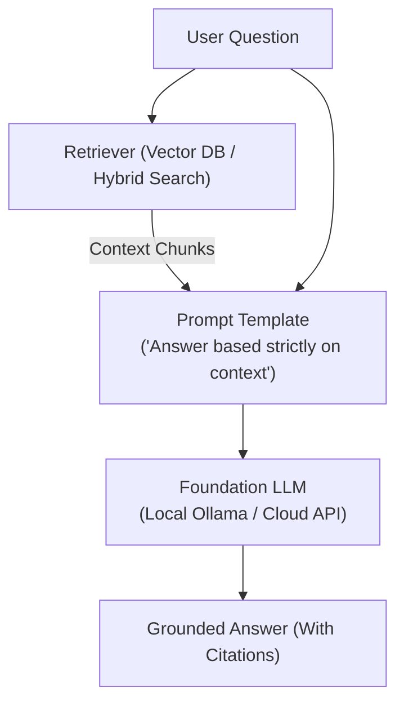

# 📹 Self-RAG Tutorial: How to Make Your AI Fact-Check Itself ｜ Advanced RAG

<div className="video-card" style={{border: '1px solid #30363d', borderRadius: '8px', padding: '16px', marginBottom: '24px', background: 'rgba(56, 139, 253, 0.05)'}}>
  <div style={{display: 'flex', gap: '16px', flexWrap: 'wrap'}}>
    <div><strong>Instructor:</strong> Nitish Singh (CampusX)</div>
    <div><strong>Duration:</strong> 68m 40s</div>
    <div><strong>Playlist:</strong> Advanced RAG Playbook (CampusX)</div>
    <div><strong>Watch Link:</strong> <a href="https://www.youtube.com/watch?v=BbO_XaEjzaA" target="_blank" rel="noopener noreferrer">YouTube Lecture ↗</a></div>
  </div>
</div>

## 📌 Executive Summary & Learning Objectives

This lecture covers **Self-RAG Tutorial: How to Make Your AI Fact-Check Itself ｜ Advanced RAG**, focusing on production implementations, edge cases, and industry standards:
- Core intuition, architecture, and underlying mechanisms.
- Key differences between theoretical research implementations and scalable enterprise patterns.
- Concrete Python walkthroughs, error recovery, and performance optimization.

---

## 🏗️ Architecture & Conceptual Workflow



---

## 📖 Core Concepts & Technical Deep Dive

### 1. Architectural Foundations
In modern production AI engineering, **Self-RAG Tutorial: How to Make Your AI Fact-Check Itself ｜ Advanced RAG** is essential for ensuring reliability, low latency, and deterministic outcomes. As AI systems evolve from naive prompt-in / completion-out scripts into distributed systems, engineers must handle:
- **State management & consistency:** Ensuring intermediate states and tool invocations are tracked.
- **Error boundaries & recovery:** Graceful degradation when external LLMs or vector stores encounter rate limits or network partitions.
- **Resource utilization & cost efficiency:** Caching common queries and reducing unnecessary foundation model token expenditure.

### 2. Operational Considerations
- **Latency Optimization:** Pre-computing embeddings, utilizing asynchronous non-blocking event loops, and streaming tokens via Server-Sent Events (SSE).
- **Security & Sandboxing:** Validating inputs before ingestion, sanitizing LLM outputs, and isolating tool execution environments.

---

## 💻 Production Implementation Walkthrough

```python
from langchain_core.prompts import ChatPromptTemplate
from langchain_core.runnables import RunnablePassthrough
from langchain_core.output_parsers import StrOutputParser
from langchain_community.chat_models import ChatOllama

# RAG Prompt with strict grounding
rag_template = """Answer the question based strictly on the provided context:
Context:
{context}

Question: {question}
Answer:"""

prompt = ChatPromptTemplate.from_template(rag_template)
llm = ChatOllama(model="llama3", temperature=0.1)

# Format documents helper
def format_docs(docs):
    return "\n\n".join(doc.page_content for doc in docs)

# Complete RAG Chain
rag_chain = (
    {"context": retriever | format_docs, "question": RunnablePassthrough()}
    | prompt
    | llm
    | StrOutputParser()
)
```

---

## 💡 Production Best Practices & Tips

:::tip Production Deployment Guideline
When deploying Self-RAG Tutorial: How to Make Your AI Fact-Check Itself ｜ Advanced RAG in enterprise environments, always configure automated retries with exponential backoff and telemetry tracing (such as OpenTelemetry or LangSmith).
:::

:::warning Common Failure Modes
Watch out for state contamination across concurrent requests. Ensure each session or user interaction uses an isolated thread ID or execution context.
:::

---

## 🎯 Key Takeaways & Quick Reference

| Dimension | Production Standard | Pitfall to Avoid |
| :--- | :--- | :--- |
| **Execution** | Async / Non-blocking with timeouts | Synchronous blocking calls in event loops |
| **Data Validation** | Strict Pydantic v2 schemas | Untyped dictionary access |
| **Monitoring** | Distributed tracing & latency percentiles | Relying only on standard console logs |

## ⏱️ Lecture Timeline & Key Topics

| Timestamp | Key Topic / Concept Discussed |
| :--- | :--- |
| **00:00:00** | हाय गाइस, माय नेम इज नितेश एंड यू वेलकम... |
| **00:16:50** | रेलेवेंट है तो फिर आप अगले स्टेप पे... |
| **00:33:58** | नहीं तो जनरेट डायरेक्ट पे जाओ। यहां पे... |
| **00:50:44** | डॉक्यूमेंट्स के अंदर से ही किए गए हैं।... |
| **01:08:37** | में। बाय।... |


---

---

## 📜 Complete Lecture Transcript (Hindi / Hinglish)

> **Language:** Hindi / Hinglish | **Source:** `09 - Self-RAG Tutorial： How to Make Your AI Fact-Check Itself ｜ Advanced RAG ｜ CampusX.hi.srt` | **Total Segments:** 35 | **Word Count:** ~11,858 words

<details>
<summary><b>Click to expand full chronological transcript (35 timestamped intervals)</b></summary>

#### ⏱️ [00:00 ➔ 00:02]

हाय गाइस, माय नेम इज नितेश एंड यू वेलकम टू माय YouTube चैनल। इस वीडियो में हम लोग रैग की एक और एडवांस टेक्निक कवर करेंगे। इफ यू रिमेंबर पिछले वीडियो में हमने सी रैग एज इन करेक्टिव रैग कवर किया था और इस वीडियो में हम एक दूसरी टेक्निक कवर करने जा रहे हैं जिसका नाम है सेल्फ रैग। व्हिच इज अगेन अ वेरी इंटरेस्टिंग टेक्निक। और यह एडवांस रैग में ही आता है। और धीरे-धीरे मेरा प्लान यही है कि मैं और जो भी एडवांस टेक्निक्स हैं रैग में वो भी कवर करते जाऊं। अ और इस वीडियो में हम सेल्फ रैग को डिटेल में देखेंगे। अ सबसे पहले मैं आपको सेल्फ रैग का थ्योरी पढ़ाऊंगा। व्हाई इज इट नीडेड? एग्जैक्टली कॉनसेप्चुअली क्या-क्या रहता है इस पर्टिकुलर टेक्निक में और लास्ट में फिर से हम क्या करेंगे? हमेशा की तरह लैंग ग्राफ में इस पूरी टेक्निक को कोड करेंगे, इंप्लीमेंट करेंगे। ठीक है? सो ऑन द होल वीडियो थोड़ा लंबा हो सकता है बट आई वुड मेक श्योर कि आपको सब कुछ समझ में आए बाय द एंड ऑफ़ द वीडियो। सो दैट्स इट नाउ लेट्स स्टार्ट द वीडियो। अब गाइस वीडियो को शुरू करने के पहले आपके लिए एक क्विक डिस्क्लेमर है और डिस्क्लेमर यह है कि यह वीडियो देखने के पहले आपको रैग के बारे में आईडिया होना चाहिए। आपने पास्ट में रैग का आर्किटेक्चर पढ़ रखा हो और इफ पॉसिबल आपने कुछ बेसिक एप्लीकेशनेशंस भी बना रखे हो। क्योंकि अगर आपको रैग ही नहीं पता तो फिर आप सेल्फ रैग बिल्कुल भी नहीं समझ पाओगे। तो इफ यू आर समवन जिसको अभी रैग के बारे में नहीं पता है तो आई वुड रिकमेंड मेरे चैनल पे लैंग चेन जो प्लेलिस्ट है उसके अंदर मैंने रैग को बहुत डिटेल में कवर किया है थ्योरिटिकली भी किया है प्रैक्टिकली भी किया है कोड लिख करके तो आई वुड रिकमेंड इस वीडियो को यहां पे छोड़ो एक बार जाके वो वीडियोस देखो और फिर आके इस वीडियो को कंटिन्यू करो तब आप इस वीडियो को सेल्फ रैग को ज्यादा एप्रिशिएट कर पाओगे ठीक है तो नाउ दैट द डिस्क्लेमर इज क्लियर अब हम वीडियो को स्टार्ट करते हैं हमारे टिपिकल स्टाइल में जहां पे हम सबसे पहले डिस्कस करेंगे द व्हाई कि सेल्फ रैग जैसा आर्किटेक्चर एक्सिस्ट क्यों करता है? अगर ट्रेडिशनल रैग है तो ऐसी क्या प्रॉब्लम है ट्रेडिशनल

#### ⏱️ [00:02 ➔ 00:04]

रैग में कि सेल्फ रैग जैसे आर्किटेक्चर की जरूरत पड़ी ये पॉइंट हम सबसे पहले कवर करेंगे। तो प्रिसाइज़ली देयर आर थ्री मेन प्रॉब्लम्स विद ट्रेडिशनल रैग। हम एक-एक करके इन तीनों को कवर करते हैं। सबसे पहली और सबसे बड़ी प्रॉब्लम है कि रैग रिट्रीव्स इवन व्हेन रिट्रीवल इज अननेसेसरी। और यह एक बहुत बड़ा फ्लॉ है। मैं आपको एक एग्जांपल के थ्रू समझाता हूं। मान लो आपने एक छोटा सा रैग चैटबॉट बनाया। यह एक बहुत स्पेशल चैटबॉट है आज जो आपने बच्चों के लिए बनाया। आपने इस चैटबॉट को बहुत सारे इनसाइक्लोपीडिया बुक्स प्रोवाइड कर दी। सो दैट बच्चे आकर के इससे चैट्स चैट करें और अलग-अलग फैक्ट्स रिट्रीव कर पाए। ठीक है? बट फिर एक बच्चा आया और उसने एक बहुत ही सिंपल क्वेश्चन पूछ लिया। हाउ मेनी सेकंड्स आर देयर इन अ मिनट। अब ऑब्वियसली इस क्वेश्चन को आंसर करने के लिए आपको किसी इनसाइक्लोपीडिया की जरूरत नहीं है। आपका जो एलएलएम है उसका जो पैरामेट्रिक नॉलेज है जो उसको ट्रेनिंग से मिला उस नॉलेज के बेसिस पे भी एलएलएम आराम से इस क्वेश्चन को आंसर कर सकता है। बट द प्रॉब्लम इज़ कि आपने इस एलएलएम को एक रैग चैटबॉट के अंदर फिट कर रखा है। बिकॉज़ ऑफ़ व्हिच पहले क्या होगा? पहले रिट्रीवल होगा। कुछ डॉक्यूमेंट्स फेच करके लाए जाएंगे। तो हो सकता है कि यह रिट्रीवल हुआ। फॉर एग्जांपल पहला चंक आया उसमें लिखा हुआ है अ मिनट इज अ यूनिट ऑफ टाइम इक्वल टू 60 सेकंड्स। ठीक है? फिर एक और चंक आया उसमें ये लिखा हुआ है इन सम कॉन्टेक्स्ट अ मिनट कैन कोलोकुली मीन अ शॉर्ट पीरियड ऑफ़ टाइम। ये शायद किसी हिस्ट्री इनसाइक्लोपीडिया से निकल के आया। फिर चंक सी में लिखा हुआ है द कॉनंसेप्ट ऑफ़ टाइम यूनिट्स इवॉल्वड हिस्टोरिकली। अगेन किसी और इनसाइक्लोपीडिया से ये चंक निकल के आया। अब हमारे एलएलएम को क्या करना है? इन तीनों चंक्स के बेसिस पे इस क्वेश्चन को आंसर करना है। तो देयर इज़ अ पॉसिबिलिटी कि आपका एलएलएम ये आंसर दे। अ मिनट टिपिकली कंसिस्ट्स ऑफ अबाउट 60 सेकंड्स डिपेंडिंग ऑन द कॉन्टेक्स्ट। अब यहां पे देखो दो प्रॉब्लम्स हुई हैं। पहली

#### ⏱️ [00:04 ➔ 00:06]

प्रॉब्लम ये हुई है कि बिकॉज़ एलएलएम को ऑलरेडी इस क्वेश्चन का आंसर पता था बट उसको ऊपर से और एक्स एडिशनल चीजें बताई गई। उसकी वजह से जो उसका आंसर निकल के आया था वो उतना कॉन्फिडेंट नहीं है। नॉट सो कॉन्फिडेंट। इसीलिए आप देखो एक सिंपल से आंसर के लिए वह टिपिकली अबाउट डिपेंडिंग ऑन द कॉन्टेक्स्ट जैसे वर्ड्स यूज़ कर रहा है। बिकॉज़ वो थोड़ा सा यू नो इट्स नॉट रियली श्योर बिकॉज़ अब ये क्वेश्चन आ गया कि भाई पीरियड ऑफ़ टाइम की बात कर रहे हैं या एक्चुअली सेकंड और मिनट की बात हो रही है। तो पहला प्रॉब्लम ये हो रहा है कि अननेसेसरीली एक्स्ट्रा कॉन्टेक्स्ट ऐड करने से जो मॉडल है वो थोड़ा अनश्योर हो जा रहा है और आंसर्स उतने कॉन्फिडेंट नहीं आ रहे। सेकंड कंप्यूटेशन का फालतू में हम वेस्टेज कर रहे हैं। ये क्वेश्चन आसानी से आंसर किया जा सकता था। बट हमने पहले रिट्रीवल किया। रिट्रीवल के बेसिस पे जनरेशन किया। तो यू गेट द आईडिया देयर आर सर्टेन सिनेरियोस जहां पे एक रैक चैटबॉट को अननेसेसरीली रिट्रीवल करने की जरूरत नहीं होती। वो डायरेक्टली मॉडल के पैरामेट्रिक नॉलेज से आंसर निकाल के दे सकता है। बट ट्रेडिशनल रैग में क्वेश्चन कैसा भी हो रिट्रीवल आपको करना ही पड़ता है। और इस चीज के लिए एक टर्म भी दिया गया है। इसको बोला जाता है इनडिसिमिनेंट रिट्रीवल। एंड दिस इज़ अ वेरी बैड थिंग। दिस इज़ प्रॉब्लम नंबर वन। प्रॉब्लम नंबर टू इज़ कि जो आपका ट्रेडिशनल रैग होता है ना वो रिट्रीव डॉक्यूमेंट्स के ऊपर ब्लाइंडली ट्रस्ट करता है। मैं आपको इसका भी एक एग्जांपल देता हूं। सो मान लो यह क्वेश्चन पूछा आपके एक यूजर ने व्हाट कॉजेस डायबिटीज? और जो रिट्रीव्ड डॉक्यूमेंट आया उसमें यह लिखा हुआ है। डायबिटीज इज अ क्रॉनिक मेडिकल कंडीशन दैट अफेक्ट्स हाउ द बॉडी प्रोसेससेस ब्लड शुगर। यहां पे कॉज की बात नहीं की जा रही है। यहां पे इफेक्ट की बात की जा रही है कि डायबिटीज का असर क्या होता है। तो अब सिंस हमारे एलएलएम को हम फोर्स कर रहे हैं कि इस चंख के बेसिस पे आंसर करो। तो हो सकता है आपका एलएलएम कुछ ऐसा आंसर करे। डायबिटीज इज कॉज्ड बाय

#### ⏱️ [00:06 ➔ 00:08]

प्रॉब्लम्स इन हाउ द बॉडी प्रोसेससेस ब्लड शुगर। अब ऑब्वियसली ये क्वेश्चन का आंसर सही नहीं है। फक्चुअली भी सही नहीं है और लॉजिकली भी थोड़ा अजीब साउंड कर रहा है। बट ये आंसर इसलिए गलत आया बिकॉज़ आपने ये रिट्रीव्ड डॉक्यूमेंट पकड़ाया एलएलएम को और बोला इसको देख के क्वेश्चन को आंसर करो। राइट? अब ये क्वेश्चन आपके दिमाग में आ सकता है कि फिर ये डॉक्यूमेंट रिट्रीव हुआ ही क्यों? अब डॉक्यूमेंट का जो रिट्रीवल होता है वो सिमेंटिक सिमिलरिटी के बेसिस पे होता है कि मीनिंग थोड़ा सा मैच कर रहा है कि नहीं। तो क्वेश्चन में डायबिटीज था। डायबिटीज के बारे में क्वेश्चन था। तो ये रिट्रीव डॉक्यूमेंट भी डायबिटीज से रिलेटेड है। तो इसीलिए फेच हो के आ गया। अब फेच हो के आ गया तो अब इसके बेसिस पे आंसर करना मजबूरी है एलएलएम की। एंड दैट इज़ व्हाई वो कर रहा है और आंसर सही नहीं निकल के आ रहा है। तो दिस इज़ प्रॉब्लम नंबर टू दैट रैग ब्लाइंडली ट्रस्ट रिट्रीव्ड डॉक्यूमेंट्स। एंड प्रॉब्लम नंबर थ्री इज़ कि रैग डज़ंट वेरीफाई इट्स ओन आंसर्स। एक बार रैग ने आंसर दे दिया जैसे कि उसने ये आंसर दे दिया। उसके बाद ये उसको वेरीफाई भी नहीं करता है। यही फाइनल आंसर बन जाता है जो आप यूजर को दिखा देते हो। बट आइडियली एक बार आंसर जनरेट होने के बाद किसी तरीके का चेक होना चाहिए कि जो आंसर मैं जनरेट कर रहा हूं क्या सच में वह सही है या फिर हेलुसिनेशन है या फिर गलत आंसर है तो दीज़ आर द मेजर प्रॉब्लम्स विद द ट्रेडिशनल रैग आर्किटेक्चर जिनको सेल्फ रैग सॉल्व करने की कोशिश करता है। तो अगला सवाल आपके मन में आ रहा होगा कैसे? तो वो डिस्कस करते हैं नेक्स्ट। गाइज़ अब हम डिस्कस करेंगे व्हाट एग्जैक्टली इज़ सेल्फ रैग। तो यहां पे सबसे पहले मैंने एक डेफिनेशन लिखा है। इसको एक बार रीड आउट करते हैं। सेल्फ रैग स्टैंड्स फॉर सेल्फ रिफ्लेक्टिव रैग वेयर द एलएलएम एक्टिवली जजेस इट्स ओन रिट्रीवल एविडेंस एंड आंसर्स इंस्टेड ऑफ़ ब्लाइंडली ट्रस्टिंग रिट्रीव्ड डॉक्यूमेंट्स। सो जो डेफिनेशन है वो काफी एक्यूरेट है। मैं अगर आपको और थोड़े सिंपल शब्दों में बताऊं तो सेल्फ रैग का जो सबसे

#### ⏱️ [00:08 ➔ 00:10]

बड़ा यूएसपी है वो है सेल्फ रिफ्लेक्शन। सो बेसिकली सेल्फ रैग में होता क्या है कि आप हर स्टेप पे खुद ही को जज करते हो। जो रैग आर्किटेक्चर आपका है वो हर स्टेप पे अपने ही एक्शंस को जज करता है कि उसने चीजें सही से की या नहीं। और वो प्रिसाइजली चार इंपॉर्टेंट सवालों का आंसर करने की कोशिश करता है। सबसे पहला सवाल क्वेरी को देखते ही वो सबसे पहले यह पूछता है कि क्या इस क्वेरी के लिए रिट्रीवल की जरूरत है भी या नहीं? दिस इज द फर्स्ट क्वेश्चन जहां पर वह सेल्फ रिफ्लेक्शन कर रहा है। सेकंडेंट क्वेश्चन जो रिट्रीव्ड डॉक्यूमेंट्स हमारे पास आए हैं क्या सारे के सारे रिट्रीव्ड डॉक्यूमेंट्स रेलेवेंट हैं क्वेश्चन को आंसर करने के लिए? दिस इज़ द सेकंड क्वेश्चन दैट सेल्फ रैग आंसर्स। थर्ड क्वेश्चन इज़ द जनरेटेड रिस्पांस ग्राउंडेड इन रिट्रीव्ड डॉक्यूमेंट्स? ये एक बहुतेंट क्वेश्चन है कि डॉक्यूमेंट्स हमारे पास आ गए। अब वो डॉक्यूमेंट्स हमने एलएलएम को दे दिए और हमने बोला कि इस क्वेश्चन को देखो और इन डॉक्यूमेंट्स को देखो और इस क्वेश्चन के लिए आंसर लिखो। अब जो आंसर जनरेट हुआ क्या उसमें जो बातें लिखी हुई हैं वो सब कुछ रिट्रीव्ड डॉक्यूमेंट से ही उठाई गई हैं या फिर एलएलएम ने खुद से अपने लेवल पे कुछ फैब्रिकेट कर दिया। कुछ हेलुसिनेट कर दिया। इसका मैं आपको एक एग्जांपल देता हूं। मान लो आपका क्वेश्चन था, यूजर का क्वेश्चन था, व्हाट आर द साइड इफेक्ट्स ऑफ ड्रग एक्स? और यह रिट्रीव्ड डॉक्यूमेंट्स हैं। पहला डॉक्यूमेंट है दैट ड्रग एक्स इज कॉमनली प्रिस्राइब्ड फॉर हाइपरटेंशन। दूसरा जो डॉक्यूमेंट आप रिट्रीव करके लाए उसमें लिखा हुआ है क्लीनिकल ट्रायल्स रिपोर्ट माइल्ड डिनेस एंड नजिया एज ऑब्जर्व्ड साइड इफेक्ट्स। अब आपने क्या किया? ये क्वेश्चन और ये डॉक्यूमेंट्स अपने एलएलएम को दे दिया और बोला कि आंसर

#### ⏱️ [00:10 ➔ 00:12]

जनरेट करो। अब आपके एलएलएम ने ये आंसर जनरेट किया। ड्रग एक्स मे कॉज डिज़नेस, नजिया, फटीग एंड हेडेक्स स्पेशली इन ओल्डर पेशेंट्स। अब यहां पर अगर आप देखो तो इस जनरेटेड रिस्पांस में डिजनेस एंड नजिया ये डॉक्यूमेंट से आ रहा है। बट ये जो है कि फटीग भी होता है, हेडेक्स भी होता है। स्पेशली इन ओल्डर पेशेंट्स यह एलएलएम ने अपने लेवल पर खुद से फैब्रिकेट कर दिया। क्यों फैब्रिकेट किया? बिकॉज़ उसने अपने पैरामेट्रिक नॉलेज में झांक के देखा। तो बहुत सारी ऐसी दवाइयां हैं जिनके साइड इफेक्ट्स में डिजीनेस, नजिया के साथ-साथ फटीग और हेडेक भी आता है। दैट इज व्हाई उसने उसने सोचा कि शायद यह भी मुझे अपनी साइड से ऐड कर देना चाहिए। इससे आंसर और अच्छा हो जाएगा। बट ऐसा होना नहीं चाहिए। बिकॉज़ दिस इज़ अ फॉर्म ऑफ़ हेलसिनेशन। हमने आपको जो एविडेंस दिया जिसके बेसिस पर आपको आंसर जनरेट करना था आपने कंप्लीटली सिर्फ उसके बेसिस पर आंसर ना जनरेट करके यू फैब्रिकेटेड सम एक्स्ट्रा एविडेंस ऑन योर ओन। दिस इज़ व्हाट हेलुसिनेशन इज़? सो सेल्फ रैग हेलुसिनेशन के अगेंस्ट भी क्वेश्चन पूछता है कि क्या मेरा मॉडल किसी भी लेवल पे हेलुसिनेट कर रहा है या नहीं? एंड द लास्ट क्वेश्चन डज़ द रिस्पांस एक्चुअली आंसर्स द यूज़र्स क्वेश्चन? जो फाइनल रिस्पांस आया है क्या वो यूजर का क्वेश्चन सही से आंसर कर भी रहा है या कि या नहीं? तो मान लो यूजर ने यह क्वेश्चन पूछा व्हाई डज़ आइस फ्लोट ऑन वाटर? और रिट्रीव्ड डॉक्यूमेंट में लिखा हुआ आया दैट आइस इज़ द सॉलिड फॉर्म ऑफ़ वाटर? अब सिंस एलएलएम को रिट्रीव्ड डॉक्यूमेंट्स के बेसिस पे आंसर करना है। तो, उसने यह आंसर किया। आइस इज़ द सॉलिड फॉर्म ऑफ़ वाटर दैट अकर्स एट लो टेंपरेचर। अब उसने इस रिट्रीव्ड डॉक्यूमेंट के बेसिस पर आंसर तो कर दिया। बट अगर आप यह सवाल पूछो कि क्या यह आंसर

#### ⏱️ [00:12 ➔ 00:14]

इस क्वेश्चन को आंसर करता है? तो द आंसर इज़ नो। तो सेल्फ रैग को यह पता चल जाएगा कि मैंने जो आंसर जनरेट किया वो क्वेश्चन के हिसाब से सही नहीं है। तो दिस इज़ द मेन डिफरेंस। दिस इज़ द मेन यूएसपी ऑफ़ सेल्फ रैग। सेल्फ रैग इज़ कॉन्शियस। नॉट लाइक इन अ वेरी कन्वेंशनल वे ऑफ़ सेइंग कॉन्शियस बट इट इज़ वेरी रिफ्लेक्टिव सेल्फ रिफ्लेक्टिव। वो हर स्टेप पे खुद से क्वेश्चन पूछता रहता है कि क्या मैं जो अगली चीज कर रहा हूं सही है या नहीं है और उसके बेसिस पे वो अपने एकशंस को मॉडिफाई करता है। तो दिस इज़ द बेस्ट पार्ट अबाउट दिस आर्किटेक्चर। तो आई नो आपको बेसिक लेवल पे आई गेस समझ में आ गया है कि व्हाट इज सेल्फ रैग? और आपके दिमाग में ऑब्वियस क्वेश्चंस आ रहे होंगे कि यह सारी चीजें आर्किटेक्चर में कैसे इंप्लीमेंटेड है। तो नेक्स्ट मैं वही करता हूं। मैं आपको दिखाता हूं हाउ सेल्फ रैग आर्किटेक्चर इज़ बिल्ट। अब यह जो आपको स्क्रीन पे दिखाई दे रहा है ना यह कॉम्प्लेक्स सी चीज ही आपका सेल्फ रैग का आर्किटेक्चर है। अब आई नो इसका फर्स्ट इंप्रेशन कुछ ऐसा जा रहा होगा कि बहुत ही डिफिकल्ट लग रहा है। बट ट्रस्ट मी इट्स वेरी लॉजिकल। स्पेशली अगर आपने पास्ट में इस तरह की चीजों के ऊपर काम कर रखा है, लंग ग्राफ के साथ आपने काम कर रखा है, तो यू विल एक्चुअली बी एबल टू अंडरस्टैंड कि इसको बनाना कैसे है। तो व्हाट आई विल डू इज़ फर्स्ट आई विल गिव यू अ कॉन्सेप्चुअल ओवरव्यू ऑफ़ दिस आर्किटेक्चर स्टेप बाय स्टेप विद एग्जांपल्स और फिर हम इसी को इंप्लीमेंट करेंगे लन ग्राफ के अंदर। ठीक है? तो देखो होता क्या है? यहां पर इस जगह पे हमारा यूजर हमें क्वेश्चन देता है। ठीक है? मान लो हमने कंपनी के लिए चार्टबॉट बनाया है ताकि कंपनी से रिलेटेड इंफॉर्मेशन हम रिट्रीव करवा पाएं। तो यहां पर यूजर हमसे क्वेश्चन पूछेगा। अब सबसे पहला स्टेप क्या होता है सेल्फ रैग में कि आप उस क्वेश्चन को देखते हो और आप यह क्वेश्चन पूछते हो कि क्या इस क्वेश्चन को आंसर करने के लिए मुझे रिट्रीवल की जरूरत है भी या नहीं? या फिर मेरा मॉडल डायरेक्टली आंसर दे सकता है। फॉर एग्जांपल अगर मेरा क्वेश्चन है हाउ मेनी पेड लीव डेज डू एंप्लाइजज़ एट आवर

#### ⏱️ [00:14 ➔ 00:16]

कंपनी गेट पर ईयर? तो ये एक ऐसा क्वेश्चन है जिसका आंसर निकालने के लिए मुझे कंपनी के डॉक्यूमेंट से इनेशन रिट्रीव करना पड़ेगा। बट अगर लेट्स से यूजर ने यह क्वेश्चन पूछ लिया ही इज़ अ फ्रेशर। उसने यह क्वेश्चन पूछ लिया व्हाट इज़ अ पेड लीव? तो अब इस क्वेश्चन के लिए मुझे डॉक्यूमेंट्स रिट्रीव करने की जरूरत नहीं है। मैं सिंपली क्या कर सकता हूं? मैं एलएलएम के पैरामेट्रिक नॉलेज के बेसिस पे आंसर कर सकता हूं। तो, यहां पे क्या हो रहा है? यह एक इंपॉर्टेंट क्वेश्चन को आंसर किया जा रहा है। हम सिंपली क्वेश्चन को देख के पूछ रहे हैं क्या इसके लिए रिट्रीवल चाहिए या नहीं? अगर रिट्रीवल नहीं चाहिए तो बहुत सिंपल है। हम क्या करेंगे? उस क्वेश्चन को सीधे एलएलएम के पास भेजेंगे। एलएलएम उसका एक डायरेक्ट आंसर जनरेट करेगा और फ्लोप खत्म हो जाएगा। इट विल एंड बट अगर कोई ऐसा क्वेश्चन है जहां पर हमें रिट्रीवल की जरूरत है तो हम अगले स्टेप पे मूव करेंगे जहां पे हम रिट्रीव करेंगे अपने डॉक्यूमेंट्स को वेक्टर स्टोर के अंदर से। ठीक है? अब इस स्टेप में हमारे पास डॉक्यूमेंट्स रिट्रीव हो के आ गए। अब हम जाएंगे अगले स्टेप में और यहां पर हम फिर से एक इंपॉर्टेंट क्वेश्चन पूछेंगे कि जो डॉक्यूमेंट्स रिट्रीव हो के आए हैं क्या हर डॉक्यूमेंट रेलेवेंट है क्वेश्चन को आंसर करने के लिए। मान लो आपके पास तीन डॉक्यूमेंट्स आए d1, d2, d3 तो आप हर डॉक्यूमेंट को ये सवाल पूछोगे कि क्या तुम रेलेवेंट हो क्वेश्चन को आंसर करने के लिए या नहीं? जो डॉक्यूमेंट्स रेलेवेंट होंगे सिर्फ वही बचेंगे। बाकी सब एलिमिनेट हो जाएंगे। आई होप आपको समझ में आ रहा है। तो फॉर एग्जांपल मान लो हमने ये डॉक्यूमेंट्स रिट्रीव किए। ठीक है? क्वेश्चन अगेन यही था। हाउ मेनी पेड लीव्स डू एंप्लाइजज़ एट आवर कंपनी गेट पर ईयर? तो तीन डॉक्यूमेंट्स फैच हो के आए। पहला डॉक्यूमेंट है द कंपनी ऑब्ज़र्व्स 12

#### ⏱️ [00:16 ➔ 00:18]

पब्लिक हॉलिडेज़ ईच ईयर। दिस इज़ द फर्स्ट डॉक्यूमेंट। सेकंड डॉक्यूमेंट है एंप्लाइजज़ मे वर्क रिमोटली अप टू टू डेज पर वीक। लीव रिक्वेस्ट मस्ट बी अप्रूव्ड बाय अ रिपोर्टिंग मैनेजर। अब अगर आप ध्यान से इन तीनों रिट्रीव्ड डॉक्यूमेंट्स को देखोगे तो आपको यह समझ में आएगा कि इस क्वेश्चन को आंसर करने के लिए दीज़ आर नॉट रेलेवेंट। तो अगर ऐसा सिनेरियो आता है जहां पर आपके पास एक भी डॉक्यूमेंट रेलेवेंट नहीं है क्वेश्चन को आंसर करने के लिए तो आप सीधे-सीधे यह प्रिंट कर दोगे दैट नो आंसर फाउंड और आपका फ्लो टर्मिनेट हो जाएगा। बट अगर आपके पास एक भी डॉक्यूमेंट ऐसा है जो आंसर कर सकता है, रेलेवेंट है तो फिर आप अगले स्टेप पे जाओगे जहां पे आप उस रेलेवेंट डॉक्यूमेंट के बेसिस पे आंसर जनरेट करोगे। ठीक है? फॉर एग्जांपल एक सेकंड सिनेरियो लेते हैं जहां पे हमारे तीन रिट्रीव्ड डॉक्यूमेंट्स ये थे। पहला है ऑल फुल टाइम एंप्लाइजज़ आर एंटाइटल्ड टू 24 पेड लीव्स पर कैलेंडर ईयर। सेकंड डॉक्यूमेंट इज़ एंप्लाइजज़ मे टेक डिफरेंट टाइप्स ऑफ लीव्स इंक्लूडिंग सिक लीव एंड कैजुअल लीव। एंड डॉक्यूमेंट नंबर सी इज़ लीफ अप्रूवल इज़ मैनेज्ड थ्रू एच एचआर पोर्टल। तो आप कह सकते हो कि पहला वाला तो बहुत ही रेलेवेंट है। डायरेक्टली इससे आंसर निकाला जा सकता है। दूसरा वाला भी काइंड ऑफ रिलेटेड है। आई कैन नॉट से कि एग्जैक्टली पूरी तरह से इररेलेवेंट है। थर्ड वाला आप बोल सकते हो इररेलेवेंट है। तो सिंस इस सिनेरियो में एटलीस्ट वन रिट्रीव्ड डॉक्यूमेंट इज़ रेलेवेंट। दैट इज़ व्हाई आप क्या करोगे? आप अगले नड के पास जाओगे और आप रेलेवेंट वाले डॉक्यूमेंट के बेसिस पे आंसर जनरेट करोगे और हो सकता है आपका मॉडल कुछ ऐसा आंसर जनरेट करे दैट ऑल फुल टाइम एंप्लाइजज़ एट आवर कंपनी आर एंटाइटल्ड टू 24 पेड लीव्स पर कैलेंडर

#### ⏱️ [00:18 ➔ 00:20]

ईयर। तो आई होप आपको यहां तक का फ्लो तो समझ में आ रहा है। अब एक बार आंसर के जनरेट हो जाने के बाद हम यह चेक करते हैं कि क्या हमारे आंसर में किसी भी टाइप का हेलुसिनेशन है कि नहीं। हेलुसिरेशन होने का सिंपल मतलब यह है कि जो आंसर मॉडल ने जनरेट किया है उस आंसर में प्रेजेंट हर फैक्ट हमारे रिट्रीव्ड डॉक्यूमेंट से ही आना चाहिए। हमारे आंसर में कुछ भी ऐसा नहीं होना चाहिए जो खुद से फैब्रिकेट हुआ है और डॉक्यूमेंट से ना आया है। सो देयर आर थ्री पॉसिबिलिटीज़। द फर्स्ट पॉसिबिलिटी इज कि जो आंसर निकल के आया है, जो आंसर जनरेट हुआ है, वह फुल्ली सपोर्टेड है। फुल्ली सपोर्टेड होने का मतलब एक ऐसा आंसर जिसमें प्रोवाइडेड हर फैक्ट गिवन डॉक्यूमेंट से ही निकाला गया है। फॉर एग्जांपल, अगर आप यह फर्स्ट आंसर देखो, तो दिस इज़ अ फुल्ली सपोर्टेड जनरेटेड आंसर। यहां पर लिखा आ रहा है 24 पेड लीव्स और वो इस डॉक्यूमेंट से आ रहा है। इसके अलावा यहां पर कोई भी और फैक्ट नहीं है जो इस डॉक्यूमेंट से बाहर का हो या इन तीनों डॉक्यूमेंट्स के बाहर का हो। ठीक है? फिर आता है सेकंड केस। सेकंड केस होता है एक ऐसा आंसर जो पार्शियली सपोर्टेड है। पार्शियली सपोर्टेड होने का मतलब कि कुछ फैक्ट्स रिट्रीव्ड डॉक्यूमेंट से आ रहे हैं। बट कुछ फैक्ट्स मॉडल ने खुद से फैब्रिकेट कर दिए। खुद से जनरेट कर दिए। क्योंकि उसको लगा कि वो आंसर का पार्ट होना चाहिए। फॉर एग्जांपल ये वाला देखो आप। सेकंड आंसर ऑल फुल टाइम एंप्लाइजज़ रिसीव 24 लीव्स पर ईयर व्हिच इंक्लूड्स सिक लीव्स एंड कैजुअल लीव्स एंड दीज़ लीव्स आर मैनेज्ड थ्रू एचआर पोर्टल। अब यहां पे उसने क्या देखा? इन दोनों डॉक्यूमेंट्स को देखा और उसके बेसिस पे उसने यह खुद से फैब्रिकेट कर दिया कि

#### ⏱️ [00:20 ➔ 00:22]

ये 24 पेड लीव्स के अंदर सिक लीव्स और कैजुअल लीव्स दोनों आती है। बट ये चीज डॉक्यूमेंट्स में बताई नहीं गई है। ये कोरिलेशन डॉक्यूमेंट में एक्सिस्ट नहीं करता। ये मॉडल ने खुद से बना दिया इन दोनों डॉक्यूमेंट्स को देख के। तो दैट इज़ व्हाई दिस इज़ एन एग्जांपल ऑफ़ पार्शियली सपोर्टेड। ठीक है? आई होप आपको समझ में आ रहा है। फिर थर्ड आता है नो सपोर्ट। ऐसा डॉक्यूमेंट या ऐसा आंसर जिसमें सारे के सारे फैक्ट्स कंप्लीटली खुद से जनरेटेड हैं। एलएलएम के डॉक्यूमेंट से कुछ भी नहीं आ रहा। रिट्रीव्ड डॉक्यूमेंट से कुछ भी नहीं आ रहा। जैसे यह वाला देखो। एंप्लाइजज़ आर एंटाइटल्ड फॉर 30 पेड लीव्स पर ईयर विद एडिशनल कैरी फॉरवर्ड बेनिफिट्स। अब यह दोनों जो फैक्ट्स हैं वो ना इस डॉक्यूमेंट में एक्सिस्ट करता है ना इसमें करता है ना इसमें करता है। यह सब कुछ यह पूरा आंसर मॉडल ने खुद से फैब्रिकेट किया है। तो दिस इज़ लाइक अ प्रॉपर हेलुसिनेशन केस। तो यहां पे क्या होता है? यहां पर आपके पास एक नोड होता है जो जो जनरेटेड आंसर है उसको चेक करता है कि वो फुल्ली सपोर्टेड है पार्शियली सपोर्टेड है या फिर एकदम ही नो सपोर्ट है एज इन पूरा हेलुसिनेट कर रहा है। अगर फुल्ली सपोर्टेड है मतलब हर फ़ैक्ट हर क्लेम रिट्रीव्ड डॉक्यूमेंट से आया है तो आप उस आंसर को एक्सेप्ट करके आगे भेज देते हो नेक्स्ट स्टेप के पास। बट अगर आपका आंसर पार्शियली सपोर्टेड है या फिर नो सपोर्ट है। इन दैट केस आप क्या करते हो? इन दोनों टाइप के आंसर्स को अगले नोड के पास भेजते हो जो कि है रिवाइज आंसर। रिवाइज आंसर में आप एक बहुत स्ट्रांग सिस्टम प्र्प लिखते हो और आप बोलते हो कि देखो इन डॉक्यूमेंट्स के बेसिस पे मेरे मॉडल ने ये आंसर जनरेट किया है और इसमें कुछ ऐसे फैक्ट्स हैं जो रिट्रीव्ड

#### ⏱️ [00:22 ➔ 00:24]

डॉक्यूमेंट्स में प्रेजेंट नहीं है। तो तुम उन फैक्ट्स को हटाओ। बेसिकली हम इस रिवाइज आंसर वाले प्र्प में पार्शियली सपोर्टेड और नो सपोर्ट को फुली सपोर्ट में कन्वर्ट करना चाहते हैं। ठीक है? तो, यह हो गया हमारा हेलुसिनेशन को ट्रीट करने वाला स्टेप। अच्छा, एक चीज मैं बताना भूल गया कि रिवाइज आंसर अपना काम करने के बाद, नया आंसर जनरेट करने के बाद वापस उस आंसर को प्रीवियस स्टेप में भेजता है। इन अ वे यहां पर एक लूप चल रहा है। ऊपर वाले नोड ने चेक किया कि पार्शियली सपोर्टेड है या नो सपोर्टेड है। तो, उसने रिवाइज़ आंसर के पास भेजा। रिवाइज आंसर ने फिर से नया आंसर जनरेट किया और वापस चेक करने के लिए यहां पर भेजा। तो यह लूप में चलता रहेगा। और जैसे ही फाइनली हमें एक आंसर आंसर मिल जाएगा जिसमें फुल्ली सपोर्टेड क्लेम्स हैं तो फिर हम ये पाथ छोड़ करके एक्सेप्ट आंसर वाले पाथ में आ जाते हैं। ये एक बहुत इंपॉर्टेंट चीज है जो मैं बताना भूल गया। आई रियली होप वो ग्राफ देख के भी आपको समझ में आ रहा है। और ये इनफाइनाइट लूप ना बने इसके लिए यहां पे आप कुछ ब्रेकिंग कंडीशन डाल सकते हो। जैसे मैक्स ट्राइस कितने होंगे? पांच बार से ज़्यादा ट्राई मत करना। 10 बार से ज्यादा ट्राई मत करना। ऐसा करके आप इस कंडीशन को ब्रेक कर सकते हो। उस लूप को ब्रेक कर सकते हो। अब बात करते हैं नेक्स्ट स्टेप की। एक बार जब हमें ऐसा आंसर मिल गया जो फुल्ली सपोर्टेड है व्हिच मींस कि वो जरा भी हेलसिनेट नहीं कर रहा। तो अब हम उस आंसर को एक और चीज के लिए चेक करते हैं। और वो चीज है उसकी यूज़फुलनेस। हम यह चेक करते हैं कि जो आंसर फाइनली जनरेट होकर आया क्या वह सच में क्वेश्चन को आंसर करने के लिए यूजफुल है भी या नहीं? अब देखो आपको थोड़ा कंफ्यूजन हो सकता है कि अगर हेलुसिनेशन नहीं है तो फिर ऑब्वियसली आंसर तो यूज़फुल ही होगा ना। ऐसा नहीं होता। कभी-कभी ऐसा सिचुएशन बन सकता है जहां पर आपका जो आंसर जनरेट हुआ

#### ⏱️ [00:24 ➔ 00:26]

है उसमें कोई हेलुसिनेशन नहीं है। वि मींस कि जो भी फैक्ट्स प्रेजेंट किए जा रहे हैं वो सब डॉक्यूमेंट्स से ही उठाए जा रहे हैं। बट स्टिल आपका आंसर क्वेश्चन को सही से जस्टिफाई नहीं करता। फॉर एग्जांपल मान लो ये आपके रिट्रीव्ड डॉक्यूमेंट्स हैं। ठीक है? यहां पे बताया गया पेड लीव्स कितना है। यहां पे बताया गया है कि आप सिक लीव और कैजुअल लीव ले सकते हो। यहां पे बताया गया कि एचआर पोर्टल से आप ये सारा काम कर सकते हो। बट आपका आंसर यह जनरेट हुआ। समऊ आपके मॉडल ने पहला वाला डॉक्यूमेंट कंप्लीटली इग्नोर मार दिया और उसने ये आंसर जनरेट किया। एंप्लाइजज़ मे टेक डिफरेंट टाइप्स ऑफ लीव्स सच एज सिक लीव एंड कैजुअल लीव्स एंड लीव रिक्वेस्ट आर मैनेज थ्रू एचआर पोर्टल। अब यह जो आंसर है ना यह फक्चुअली करेक्ट है। मतलब इसमें कोई हेलुसिनेशन नहीं है। सारे क्लेम्स एविडेंस के बेसिस पर ही हैं। कुछ भी एलएलएम ने अपने बेसिस पे अपने लेवल पे फैब्रिकेट नहीं किया है। बट क्या ये आंसर जस्टिफाई करता है क्वेश्चन को? द आंसर इज़ नो। तो अब इस स्टेप में हम क्या करते हैं? इज़ यूज़ वाले स्टेप में वी चेक कि जो आंसर जनरेट हुआ है क्या वो क्वेश्चन को जस्टिफाई कर रहा है कि नहीं? ठीक है? अगर जस्टिफाई कर रहा है तो हम उसको एंड पर ले जाएंगे और यूजर को दिखा देंगे। बट अगर जस्टिफाई नहीं कर रहा है इन दैट केस हम क्या करेंगे कि हम यूजर के इनिशियल क्वेश्चन को रीाइट करेंगे और वापस एकदम पीछे जाएंगे रिट्रीव वाले स्टेज में और वहां से हम फिर से ये पूरा प्रोसेस रिपीट करेंगे। हम नए डॉक्यूमेंट्स फैच करके लाएंगे। नए डॉक्यूमेंट्स के बेसिस पे हम चेक करेंगे नए डॉक्यूमेंट्स रेलेवेंट है कि नहीं और रेलेवेंट वाले डॉक्यूमेंट्स के बेसिस पे आंसर जनरेट करेंगे। आंसर जनरेट होने के बाद हेलुसिनेशन चेक करेंगे। हेलुसिनेशन चेक होने के बाद फिर से चेक करेंगे कि जो जनरेटेड आंसर है क्या वो यूज़फुल है कि नहीं और ये लूप चलता रहेगा। अब ये इनफाइनाइट लूप ना बने इसलिए यहां पे

#### ⏱️ [00:26 ➔ 00:28]

भी आप एक कंडीशन डाल सकते हो पांच या 10 बार चलाने का। और अगर पांच 10 बार चलाने के बाद भी आंसर यूजफुल नहीं लग रहा है तो हम यह थर्ड पाथ में जाएंगे और हम बोलेंगे नो आंसर फाउंड और आपका फ्लो खत्म हो जाएगा। एंड दिस इज़ हाउ सेल्फ रैग वर्क्स। अगर मैं आपको पीछे जाके दिखाऊं तो हम ये चारों क्वेश्चंस आंसर कर रहे हैं। रिट्रीवल होना चाहिए कि नहीं? सबसे पहले आंसर हो रहा है। क्या रिट्रीव्ड डॉक्यूमेंट्स रेलेवेंट है कि नहीं? ये भी हम आंसर कर रहे हैं। क्या जनरेटेड रिस्पांस ग्राउंडेड है? यह हम चेक कर रहे हैं इस सपोर्टेड की हेल्प से। क्या रिस्पांस सच में आंसर कर रहा है यूजर का क्वेश्चन? यह हम चेक कर रहे हैं इस यूज़फुल के हेल्प से। तो बेसिकली दिस इज़ हाउ द आर्किटेक्चर इज़ प्लंड फॉर सेल्फ रैक। तो आई रियली होप आपको सबसे पहले कॉन्सेप्चुअल लेवल पे थ्योरिटिकली एटलीस्ट समझ में आ गया कि ये आर्किटेक्चर काम कैसे कर रहा है और कैसे ये कन्वेंशनल ट्रेडिशनल रैक से बेटर है। अब हम क्या करेंगे? इस आर्किटेक्चर को बिल्ड करेंगे अ लनग्राफ के अंदर। ठीक है? और कोड करने के पहले दो चीजें बस आपको बताना चाहूंगा कि हम इसको स्टेप बाय स्टेप बिल्ड करेंगे। मैं ऐसा नहीं करूंगा कि मैं डायरेक्टली आपको पूरा एंड टू एंड कोड दिखा दूंगा और बोलूंगा कि दिस इज़ द आर्किटेक्चर ऑफ़ सेल्फ रैग। इंस्टेड हम इसको स्टेप बाय स्टेप बिल्ड करेंगे। पहला फीचर ऐड करेंगे। फिर उसके ऊपर दूसरा फिर तीसरा। तो बहुत ऑर्गेनिक तरीके से आपके दिमाग में ये आईडिया प्लांट होगा। सेकंड यह बहुत इंपॉर्टेंट डिस्क्लेमर है कि मैं जो कोड आपको दिखाने वाला हूं वह ओरिजिनल पेपर से थोड़ा डिफरेंट है। ओरिजिनल पेपर में उन्होंने अलग टाइप का मॉडल यूज़ किया था। अपने हिसाब से उसको फाइन ट्यून किया था और उसके बेसिस पे ये पूरा आर्किटेक्चर बिल्ड किया था। हम जो इंप्लीमेंटेशन करने वाले हैं वहां पे हम कोई फाइन ट्यून मॉडल ना ले के ओपन एआई के एलएलएम्स को यूज़ करेंगे। तो इंप्लीटेशन इंप्लीमेंटेशन पॉइंट ऑफ व्यू से थोड़ा डिफरेंट होगा हमारा कोड बट

#### ⏱️ [00:28 ➔ 00:30]

जो भी कोर आइडियाज हैं सेल्फ रैक के वो सब हम कवर करेंगे। तो कॉनसेप्चुअली सब कुछ सेम है बट जो फाइनर माइन्यूट डिटेल्स हैं वो डिफरेंट है। ये मैं पहले से क्लियर करना चाहता हूं। मैं एक काम और करूंगा। मैं ओरिजिनल पेपर का लिंक डाल दूंगा डिस्क्रिप्शन में। आप लोग जाके चेक करना और एक बार वीडियो देखने के बाद। आई एम प्रीटी श्योर आप उसको भी थोड़ा बहुत समझ पाओगे। ठीक है? तो नाउ दैट ये पूरा थ्योरी हमने कवर कर लिया। अब आगे बढ़ते हैं और इस पूरी चीज को कोड करते हैं लैंड ग्राफ में। सो गाइस जैसा मैंने बोला कि इतने बड़े कॉम्प्लेक्स आर्किटेक्चर को हम एक साथ कोड नहीं करेंगे। हम इसको स्टेप बाय स्टेप डेवलप करेंगे। तो सबसे पहले बात करते हैं स्टेप वन की। स्टेप वन में मेरा प्लान है कि मैं इस पूरे आर्किटेक्चर का बस इतना पार्ट बनाऊंगा जितना आपको इस रेक्टेंगुलर बॉक्स में दिख रहा है। सो इट विल बी दिस सिंपलीफाइड आर्किटेक्चर जहां पे हमें स्टार्ट में यूजर एक क्वेश्चन देगा। उस क्वेश्चन को हम एक नोट के पास भेजेंगे। इस नोट का काम बहुत सिंपल है। क्वेश्चन को देखना और यह डिसाइड करना कि इस क्वेश्चन को क्या हम डायरेक्टली एलएलएम के पैरामेट्रिक नॉलेज से आंसर कर सकते हैं या फिर हमें डॉक्यूमेंट्स रिट्रीव करने पड़ेंगे। ठीक है? तो डिपेंडिंग ऑन दिस नोट्स डिसीजन या तो हम इस राउट में जाएंगे या तो इस राउट में जाएंगे। अगर डायरेक्टली जनरेट करने का ऑप्शन आता है तो हम डायरेक्ट जनरेट कर देंगे विथ द हेल्प ऑफ़ एलएलएम। रिट्रीव करने का ऑप्शन आता है तो हम रिट्रीव करेंगे बट अभी जनरेट नहीं करेंगे। बेसिकली आपको मैं डॉक्यूमेंट्स दिखा दूंगा लेकिन उन डॉक्यूमेंट से आंसर अभी नहीं बनेगा। ठीक है? तो दिस इज़ द फर्स्ट स्टेप टुवर्ड्स बिल्डिंग दिस सेल्फ रैग आर्किटेक्चर। तो कोड मैंने लिख रखा है। मैं आपको दिखाता हूं। अ सो इस बार मैंने क्या प्लान किया है कि हम एक कंपनी के लिए रैक चार्ट बॉट बना रहे हैं और हमारे पास कंपनी से रिलेटेड कुछ डॉक्यूमेंट्स हैं। यह एक हाइपोथेटिकल कंपनी है Nexa एi सॉलशंस बोल के जो एक्सिस्ट नहीं करती। ये सारा डॉक्यूमेंट्स

#### ⏱️ [00:30 ➔ 00:32]

मैंने चार्ट जीपीटी से बनवाया है। तो सबसे पहले कंपनी प्रोफाइल है। जहां पे कंपनी का ओवरव्यू दिया गया है। कितने कब बनी थी कंपनी? हेड क्वार्टर कहां है? कितने एंप्लाइजज़ हैं? विज़न क्या है? मिशन क्या है? कोर वैल्यूस क्या है? फाउंडर के बारे में बताया गया है और लीडरशिप टीम के बारे में बताया गया है। देन वी हैव कंपनी पॉलिसीज़ जहां पे हमने एचआर पॉलिसीज, लीव पॉलिसी, वर्क प्लेस कंडक्ट, डिसिप्लिनरी एकशंस इतना डाल रखा है। एंड वी आल्सो हैव अ प्रोडक्ट एंड प्राइसिंग पेज जहां पे Nexa AI सॉलशंस के जो मेन प्रोडक्ट्स हैं उनके बारे में इंफॉर्मेशनेशन दिया गया है। अलोंग विद उनका प्राइसिंग के बारे में बताया गया है। ठीक है? तो इसी के बेसिस पे वी आर बिल्डिंग अ चैट बॉट रैक चैटबॉट। तो कोड बहुत सिंपल है। सबसे पहले हमने यहां पे लाइब्रेरीज़ को इंपोर्ट कर लिया। यहां पे हमने इन तीनों डॉक्यूमेंट्स को लोड कर लिया। ठीक है? उसके बाद यहां पे हम क्या कर रहे हैं? हम टेक्स्ट स्प्लिटिंग परफॉर्म कर रहे हैं। अ डिपेंडिंग ऑन द डॉक्यूमेंट। मैंने चंक साइज़ 600 रखा है। चंक ओवरलैप 150 रखा है। मैंने थोड़ा एक्सपेरिमेंट करके देखा। ये नंबर्स मुझे बेस्ट रिजल्ट दे रहे थे। आप एक्सपेरिमेंट कर सकते हो। इस स्टेप में हम दो काम कर रहे हैं। पहला अ इस पूरे के पूरे डॉक्यूमेंट्स को हम वेक्टर स्टोर में एंबेड कर रहे हैं और सेकंड हम एक रिट्रीवर ऑब्जेक्ट बना रहे हैं जिसकी हेल्प से हम रिट्रीवर रिट्रीव रिट्रीवल परफॉर्म करेंगे। ठीक है? इस स्टेप में हमने एक एलएलएम बनाया। उसके बाद हमने अपना स्टेट डिफाइन किया। स्टेट में देखो क्या-क्या है। क्वेश्चन जो यूजर पूछेगा नीड रिट्रीवल यह एक बुलियन की है जिसमें यस और नो आएगा जिसके बेसिस पे हम राउटिंग करेंगे। डॉक्स जहां पे हम रिट्रीव्ड डॉक्यूमेंट्स को स्टोर करेंगे और फाइनल आंसर जो हम यूजर को दिखाएंगे। ठीक है? अब यहां से शुरू होता है आपका अ ये पूरा का पूरा कोड। हम सबसे पहले बनाएंगे ये डिसाइड रिट्रीवल वाला नोड। ठीक है? तो यहां पे हम क्या कर रहे हैं? सबसे पहले एक पाइडेंटिक स्कीमा बना रहे हैं शुड रिट्रीव बोल के। तो हम अपने मॉडल

#### ⏱️ [00:32 ➔ 00:34]

को फोर्स कर रहे हैं कि इस स्कीमा में वो हमें आंसर बताएं। यस और नो। यहां पे लिखा हुआ है ट्रू इफ एक्सटर्नल डॉक्यूमेंट्स आर नीडेड टू आंसर रिलायबली एल्स फॉल्स। उसके बाद ये हमने एक सिस्टम प्र्प बना दिया। वीडियो पॉज करके आप देख सकते हो। यू डिसाइड वेदर रिट्रीवल इज़ नीडेड रिटर्न jसon दैट मैचेस दिस पर्टिकुलर स्कीमा। गाइडलाइंस क्या है? शुड रिट्रीव ट्रू होगा इफ आंसरिंग रिक्वायर स्पेसिफिक फैक्ट साइटेशंस और इनफो लाइकली नॉट इन द मॉडल एंड फॉल्स तब होगा जब जनरल एक्सप्लेनेशन होगा, डेफिनेशन चाहिए होगा या रीजनिंग चाहिए होगा। इफ अनशोर चूज़ ट्रू। ठीक है? अगर क्लेरिटी नहीं है तो ट्रू चूज़ कर लेना। यहां पे हम अपना यूजर का क्वेश्चन इंसर्ट कर देंगे। उसके बाद यहां पे हमने एक स्ट्रक्चरर्ड आउटपुट ऐड कर दिया हमारे एलएलएम में। और ये रहा हमारा छोटा सा नोड का कोड। क्या कर रहे हैं हम यहां पे? हम सिंपली स्ट्रक्चरर्ड एलएलएम को इनवोक कर रहे हैं विद दिस प्र्प और वहां से ट्रू या फॉल्स आ रहा है। उसको हम डिसीजन में स्टोर कर रहे हैं और नीड रिट्रीवल में उस डिसीजन को फाइनली डाल दे रहे हैं। ठीक है? उसके बाद हम ये वाला प्र्ट ये वाला नड क्रिएट कर रहे हैं। डायरेक्टली जो जनरेट करवाएगा अ एलएलएम से। तो यहां पे एक सिस्टम प्र्प है। सिस्टम प्र्ट क्या है? आंसर द क्वेश्चन यूजिंग योर जनरल नॉलेज। डू नॉट अस्यूम एक्सेस टू एक्सटर्नल डॉक्यूमेंट्स। इफ यू आर अनशोर और आंसर रिक्वायर स्पेसिफिक सोर्सेस, से आई डोंट नो बेस्ड ऑन माय जनरल नॉलेज। यहां पे हमने क्वेश्चन इंसर्ट करा दिया। सिंपल सा ये आपका फंक्शन है जहां पे हम इस अ एलएलएम को इनवोक कर रहे हैं। पलट के हमें आंसर मिल रहा है। उसका कंटेंट हम आंसर में स्टोर कर रहे हैं। ठीक है? उसके बाद आता है रिट्रीव वाला नोड व्हिच इज दिस वन जो कि बहुत ही सिंपल है। हम सिंपली रिट्रीवर डॉट इनवोक कर रहे हैं और क्वेश्चन भेज दे रहे हैं। ठीक है? और फाइनली एक राउटिंग के लिए हमने फंक्शन बना रखा है जो सिंपली ये बोल रहा है कि अगर रिट्रीवल की जरूरत है तो रिट्रीव पे जाओ नहीं तो जनरेट डायरेक्ट पे जाओ। यहां पे

#### ⏱️ [00:34 ➔ 00:36]

हमने अपना क्या किया? अ न्स डिफाइन कर दिए। यहां पे हमने अपने एजेस डिफाइन कर दिए। जिससे हमें ये एग्जैक्ट सेम ग्राफ मिल गया। ठीक है? अब हम इसको एक बार टेस्ट करते हैं। जैसे कि हमने पूछा हु इज द सीईओ ऑफ़ Nexa AI? तो इसमें क्या होगा कि आपका जो अ रिट्रीवल है वो चाहिए पड़ेगा। दैट इज़ व्हाई कोई आंसर आपको नहीं मिलेगा क्योंकि हम आंसर जनरेट नहीं करा रहे। बट अगर आप नीड रिट्रीवल पे जाओगे तो यू विल सी दैट इट इज़ ट्रू। ठीक है? और डॉक्स पर अगर आप जाओगे तो यू विल सी कि यहां पर डॉक्स में रिट्रीव हो रहा है। यहां पर कहीं पर आपको दिखाई भी देगा कि हु इज द सीईओ? आरव मेहता इज द सीईओ। ये सब आपको दिखने लग जाएगा। ठीक है? अगर मैं यहां पे कोई और क्वेश्चन डालूं जैसे व्हाट इज मशीन लर्निंग? तो अब क्या होगा? मुझे आंसर दिखाई देगा। बिकॉज़ अब हम जनरेट वाले ब्रांच के थ्रू जा रहे हैं। यह देखो। अब यहां पे नीड रिट्रीवल पे अगर आप जाओगे तो इट विल से फॉल्स। और यहां पे कोई डॉक्स नहीं होने चाहिए। बिकॉज़ इस बार रिट्रीवल नहीं हुआ। ठीक है? तो, हमने क्या किया? अभी जस्ट इतना पार्ट जो है, इतना पार्ट यह हमने बना लिया। ठीक है? अब आगे बढ़ते हैं। नेक्स्ट हम लोग अपने बने हुए वर्क फ्लो में एक छोटा सा इंप्रूवमेंट करेंगे और वो यह है कि जो डॉक्यूमेंट्स रिट्रीव हो के आए हैं, हम हर डॉक्यूमेंट के बारे में यह पता करेंगे कि वो डॉक्यूमेंट हमारे क्वेश्चन को आंसर करने के लिए रेलेवेंट है या नहीं। और जो डॉक्यूमेंट्स रेलेवेंट होंगे, हम उन्हीं को बचाएंगे। बाकी सबको इग्नोर कर देंगे। सो व्हाट वी विल डू इज कि हम एक रेलेवेंट

#### ⏱️ [00:36 ➔ 00:38]

डॉक्स बोल के की क्रिएट कर देंगे हमारे स्टेट के अंदर और रेलेवेंट डॉक्स में हम वही डॉक्स एज इन डॉक्यूमेंट्स को रखेंगे जो रेलेवेंट है हमारे क्वेश्चन के हिसाब से और फिर इसी रेलेवेंट डॉक की के बेसिस पे हम आंसर जनरेट करेंगे। ठीक है? तो ये जो आपको सराउंडेड ऑरेंज अ स्ट्रक्चर दिखाई दे रहा है, ये हम लोग बनाने वाले हैं और ये है उसका एग्जैक्ट लैंग ग्राफ वर्क फ्लो। ठीक है? डिसाइड रिट्रीवल से पता चला कि डायरेक्टली आंसर कर सकता है एलएलएम या रिट्रीवल चाहिए। अगर रिट्रीवल चाहिए तो रिट्रीव होगा और रिट्रीव होने के बाद हर डॉक्यूमेंट टेस्ट होगा और जो डॉक्यूमेंट्स रेलेवेंट होंगे उनको हम स्टोर कर लेंगे। बाकियों को इग्नोर कर देंगे और हमारा वर्क फ्लो एंड हो जाएगा। ठीक है? तो दिस इज़ द नेक्स्ट इमीडिएट इंप्रूवमेंट। लेट मी शो यू द कोड। सो अगेन मैंने कोड लिख रखा है। काफी कुछ कोड बिल्कुल सेम है। जो आपको मैंने पिछला कोड दिखाया उससे जो जो नई चीजें होंगी वो मैं आपको दिखा दूंगा। सो लाइब्रेरीज हमने सेम इंपोर्ट की है। डॉक्यूमेंट्स हमने सेम लोड किए हैं। टेक्स्ट स्प्लिटिंग बिल्कुल सेम है। अ वेक्टर स्टोर बनाना और रिट्रीवर ऑब्जेक्ट क्रिएट करना बिल्कुल सेम है। एलएलएम को इंपोर्ट करना बिल्कुल सेम है। स्टेट में हमने चेंजेस किए हैं। हमने एक नया की ऐड किया है रेलेवेंट डॉक्स बोल के व्हिच विल बी अ लिस्ट ऑफ डॉक्यूमेंट ऑब्जेक्ट्स। ठीक है? बिल्कुल डॉक्स की तरह है। बट डॉग्स में सारे रिट्रीव डॉक्यूमेंट्स होंगे। रेलेवेंट डॉग्स में सिर्फ रेलेवेंट डॉक्यूमेंट्स होंगे। ठीक है? उसके बाद ये है रिट्रीव डिसीजन वाला पूरा चीज। अ ये बिल्कुल सेम है। यहां पे कोई चेंजेस नहीं है। उसके बाद यह है डायरेक्ट जनरेशन वाला नड। यह भी बिल्कुल सेम है। यह है रिट्रीव वाला नोड। बिल्कुल सेम है। तो अभी तक ये ये और ये बिल्कुल सेम है। बस ये नई चीज ऐड हो रही है। तो इसका कोड देखते हैं। तो यहां पे ये है आपका इज़ रेलेवेंट वाला नोड। यहां पे हमने क्या किया है? एक पidेंटिक स्कीमा बना दिया है। जिसमें सिर्फ एक आपका फील्ड है इज़ रेलेवेंट बोल के जो कि बुलियन

#### ⏱️ [00:38 ➔ 00:40]

है। यहां पे हमने लिखा है ट्रू इफ डॉक्यूमेंट हेल्प्स द हेल्प्स आंसर द क्वेश्चन एल्स फॉल्स। यहां पे हमने एक सिस्टम प्र्प्ट बना दिया है। यू आर अ जजिंग डॉ यू आर जजिंग डॉक्यूमेंट रेलेवेंस रिटर्न jसon दैट मैचेस दिस स्कीमा। अ डॉक्यूमेंट इज़ रेलेवेंट इफ इट कंटेन इनेशन यूज़फुल फॉर आंसरिंग द क्वेश्चन। और हमने दोनों चीजें पकड़ा दी हैं। हमने क्वेश्चन भी पकड़ा दिया है और वो इंडिविजुअल डॉक्यूमेंट भी पकड़ा दिया है। इसके बेसिस पे वो ट्रू या फॉल्स हमें बता देगा। यहां पे हमने एक स्ट्रक्चरर्ड आउटपुट की हेल्प से रेलेवेंस एलएलएम बोल के एलएलएम क्रिएट कर लिया है। ये रहा हमारा नोड का कोड। बहुत ही सिंपल है। हमने रेलेवेंट डॉक्स बोल के एक एंप्टी लिस्ट इनिशियलाइज कर लिया है। जितने भी हमारे डॉक्स रिट्रीव हो के आए थे उसके ऊपर लूप चला रहे हैं और एलएलएम को इनवोक कर रहे हैं। और हर डॉक्यूमेंट के लिए ट्रू या फॉल्स आ रहा है। अगर ट्रू आ रहा है किसी पर्टिकुलर डॉक्यूमेंट के लिए डिसीजन तो हम उसको रेलेवेंट डॉक्स में स्टोर करते जा रहे हैं और रेलेवेंट डॉक्स स्टेट में स्टोर करते जा रहे हैं। दैट्स इट। दिस इज़ द कोड। ठीक है? उसके बाद राउट आफ्टर डिसीजन बिल्कुल सेम है। अगर रिट्रीवल चाहिए है तो हम रिट्रीव पे जा रहे हैं। अदरवाइज हम डायरेक्टली जनरेट कर रहे हैं। ठीक है? आगे का कोड भी बिल्कुल सेम है। हमने बस ये नया नोड ऐड कर दिया और यहां पे ये नया एच ऐड कर दिया। ठीक है? सो, दिस इज़ द स्ट्रक्चर जो मैंने आपको अभी दिखाया था। अब मैं आपको दिखाता हूं इसका आउटपुट। सो, यह हमारा क्वेश्चन है। हु इज़ द सीईओ ऑफ़ एन एनxआईआई? तो, ऑब्वियसली पहले रिट्रीव में जाओगे। रिट्रीव से फिर इस रेलेवेंट में आओगे। तो देखो एक बार हम इसको चला के देखते हैं। अभी भी कोई आंसर प्रिंट नहीं होगा बिकॉज़ रिट्रीव करके हम जनरेट नहीं कर रहे हैं। तो ये देखो उसके बाद नीड रिट्रीवल में ट्रू आ रहा है। और अब मैं आपको दिखाता हूं कितने डॉक्यूमेंट्स रिट्रीव हुए हैं। सो आप ध्यान दोगे तो टोटल चार डॉक्यूमेंट्स रिट्रीव हुए हैं। यह देखो ये चार डॉक्यूमेंट्स रिट्रीव हुए हैं। दिस इज़ द फर्स्ट वन। दिस इज द सेकंड वन, दिस इज द थर्ड वन एंड दिस इज द

#### ⏱️ [00:40 ➔ 00:42]

फोर्थ वन। ठीक है? 1 2 3 4 बार-बार मुझे थ्री क्यों लग रहा है? आई डोंट नो बट है ये फोर। 1 2 3 एंड ये फोर। ठीक है? फोर है। अब मैं आपको दिखाता हूं कि रेलेवेंट डॉक्स में कितना है। तो रेलेवेंट डॉक्स अगर आप चलाओगे तो अब आपको सिर्फ एक ही अ डॉक्यूमेंट दिख रहा है जो कि है पहला वाला। जहां पे सच में बात की गई है कि सीईओ कौन है। बाकी की चीजें सिंैटिकली क्लोज हैं बट दे आर नॉट रेलेवेंट टू आंसर द क्वेश्चन। दैट इज व्हाई वो सब इग्नोर हो गया और रेलेवेंट डॉग्स में सिर्फ फर्स्ट वाला आके स्टोर हो गया। अब जभी भी हम फ्यूचर में कभी आंसर जनरेट करेंगे। हम इन चारों के बेसिस पे नहीं करेंगे। हम सिर्फ इसके बेसिस पे करेंगे। तो यू कैन ऑलरेडी सी कि हम कैसे नॉइस फिल्टर आउट कर रहे हैं। ठीक है? तो ये हो गया हमारा नेक्स्ट इंप्रूवमेंट। सो नेक्स्ट हम अपने करंट वर्क फ्लो में एक छोटा सा फीचर और ऐड करेंगे। सो इस पॉइंट पर हम यहां पर हैं कि रिट्रीव होने के बाद हम अपने डॉक्यूमेंट्स को फिल्टर कर पा रहे हैं रेलेवेंस के बेसिस पे। बट अभी तक हम आंसर जनरेट करके नहीं दे रहे हैं। तो अब हम नेक्स्ट यही करने वाले हैं कि अगर एटलीस्ट एक भी डॉक्यूमेंट रेलेवेंट निकला तो हम रेलेवेंट डॉक्यूमेंट्स के बेसिस पे आंसर करेंगे। अगर एक भी डॉक्यूमेंट रेलेवेंट नहीं निकला तो हम सिंपली यूजर को बोल देंगे कि हमारे पास कोई इंफॉर्मेशन नहीं है और वर्क फ्लो आपका एंड हो जाएगा। ठीक है? तो बहुत छोटा इंप्रूवमेंट है बट मैं आपको दिखाता हूं कैसे करना है। सो अगेन एक नया पीस ऑफ़ कोड बट काफी कुछ पिछले कोड से मैच करेगा। लाइब्रेरीज़ को इंपोर्ट किया। डॉक्यूमेंट्स को लोड किया। चंकिंग हो गई। एंबेडिंग वेक्टर स्टोर हो गया। एलएम को लोड किया।

#### ⏱️ [00:42 ➔ 00:44]

यहां पे हमने कॉन्टेक्स्ट बोल के एक नया की ऐड किया है स्टेट में। सो बेसिकली व्हाट वी विल डू इज़ कि इस जगह पे हमारे जितने भी रेलेवेंट डॉक्स हैं एक हो सकता है, दो हो सकता है, उससे ज्यादा हो सकते हैं। उन सबको हम मर्ज कर देंगे। और उसी को हम कॉन्टेक्स्ट बुला रहे हैं। और यह कॉन्टेक्स्ट प्लस क्वेश्चन हम अपने एलएलएम को देंगे। और एलएलएम हमें जनरेट करके देगा हमारा आंसर जो हम यूजर को दिखाएंगे। तो दिस इज़ गोइंग टू बी द फ्लो। ठीक है? तो ये कॉन्टेक्स्ट हमने ऐड कर दिया व्हिच इज़ अ स्ट्रिंग। उसके बाद यह कोड आप ऑलरेडी देख चुके हो। यह बता रहा है कि हमें रिट्रीव करना चाहिए कि नहीं। यह डायरेक्ट जनरेशन वाला पूरा नोड है। यह रिट्रीव करने वाला नोड है। यह वह वाला नोड है जो बताता है कि हर डॉक्यूमेंट रेलेवेंट है या नहीं। और रेलेवेंट वालों को फ़्टर करके रेलेवेंट डॉक्स में स्टोर करता है। ये नया है। ये कोड है आपका इसका जनरेट फ्रॉम कॉन्टेक्स्ट वाले में। ठीक है? तो यहां पे हम क्या कर रहे हैं? हमने सिंपली एक प्र्प्ट लिख दिया दैट यू आर अ बिज़नेस रैग असिस्टेंट आंसर द यूज़र्स क्वेश्चन यूजिंग ओनली द प्रोवाइडेड कॉन्टेक्स्ट। ठीक है? अब यहां पे कोड बहुत सिंपल है। सबसे पहले हम क्या कर रहे हैं? रेलेवेंट टॉक्स में घुस करके कॉन्टेक्स्ट बना रहे हैं। उसके बाद हम एलएलएम को इनवोक कर रहे हैं। अपना क्वेश्चन दे रहे हैं और अपना कॉन्टेक्स्ट दे रहे हैं। हमें उससे आंसर मिल रहा है और कॉन्टेक्स्ट भी हमको इसी स्टेप में मिल रहा है। और ये हमने एक और एडिशनल नोड क्रिएट कर दिया है। ये वाला नो रेलेवेंट डॉक्स। आई नो इस पॉइंट पे आपके दिमाग में आ रहा होगा कि इस नोड की क्या जरूरत है। यहां से डायरेक्टली एंड पे चले जाओ। इसकी एक जरूरत है। मैं आपको थोड़ी देर में बताऊंगा। बट फिलहाल हमने यह काइंड ऑफ एक एंप्टी नड बना रखा है। जो सिंपली यह आंसर प्रिंट करके दे रहा है। ठीक है? उसके बाद यह पहले का कोड है। यह नया कोड है। यह

#### ⏱️ [00:44 ➔ 00:46]

बेसिकली यह ब्रांचिंग क्रिएट करने का कोड है। कि अगर आपका लेंथ ऑफ रेलेवेंट डॉक्स एक से ज्यादा है तो जनरेट फ्रॉम कॉन्टेक्स्ट पे जाओ। अदरवाइज नो रेलेवेंट डॉक्स पे जाओ। उसके बाद यह आपके ग्राफ का कोड है और यह रहा आपका ग्राफ जो मैंने अभी आपको दिखाया। ठीक है? अब इसको एक बार टेस्ट कर लेते हैं। सो मान लो हमने पूछा हु इज द सीईओ ऑफ़ nexसा एआई। ठीक है? ये इनेशन हमारे डॉक्यूमेंट्स में है। तो आई एम अस्यूमिंग एटलीस्ट एक रेलेवेंट डॉक निकल के आएगा। और उस रेलेवेंट डॉक से आंसर मिलना चाहिए। ठीक है? द सीईओ ऑफ़ Nexi इज़ आरव मेहता। अब यहीं पर अगर मैं सेकंड क्वेश्चन पूछ लूं कि व्हाट इज द रिफंड पॉलिसी ऑफ nexai? आप जाके डॉक्यूमेंट्स चेक करोगे तो आपको पता चलेगा कि रिफंड पॉलिसी के बारे में कुछ नहीं लिखा हुआ है। प्राइसिंग के बारे में लिखा हुआ है। रिफंड पॉलिसी के बारे में कुछ नहीं लिखा हुआ है। जब हम इसको रन करेंगे तो हम दूसरे वाले ब्रांच में घुस जाएंगे और हमें आंसर मिलेगा नो रेलेवेंट डॉक्यूमेंट फाउंड। ठीक है? तो दिस थिंग इज़ वर्किंग। आई होप आपको ये इंप्रूवमेंट समझ में आ गया। अब एक क्विक क्वेश्चन मैं आंसर करता हूं कि हमने ये एडिशनल नोड क्यों बनाया? यह कोई खास पर्पस सॉल्व नहीं कर रहा है। तो ये मैंने इसलिए बनाया क्योंकि आप बहुत ईजीली इसको रिप्लेस कर सकते हो विद अ वेब सर्च नोड। कि मान लो आपने डॉक्यूमेंट्स को रिट्रीव किया बट एक भी डॉक्यूमेंट क्वेश्चन के हिसाब से रेलेवेंट नहीं आया। इन दैट केस आप क्या कर सकते हो कि आप जाकर झट से वेब पर सर्च कर सकते हो और फिर वेब सर्च से आप वापस इसी स्टेप पे आ जाओ इज़ रेलेवेंट। सो वेब से हमें कुछ डॉक्यूमेंट्स मिले। हम उन डॉक्यूमेंट्स को चेक कर रहे हैं कि क्या उनमें से कोई रेलेवेंट है? अगर उनमें से कोई भी रेलेवेंट है तो हम जनरेट कर देंगे आंसर। तो ये भी एक एडिशनल स्टेप आप परफॉर्म कर सकते हो। ठीक है? कैसे करना है? उसके लिए मैंने कोड एक दे रखा है। आप नीचे लिंक में चेक करोगे रेपोजिटरी में तो आपको दिख

#### ⏱️ [00:46 ➔ 00:48]

जाएगा। ये कोड मैंने बना रखा है। यहां पे आप फ्लो देखो इज़ रेलेवेंट इफ इट इज़ नॉट रेलेवेंट। एक भी रिट्रीव्ड डॉक्यूमेंट इज़ नॉट रेलेवेंट। तो हम सबसे पहले क्वेरी रीाइट कर रहे हैं। क्वेरी रीराइट का मतलब हम वेब के हिसाब से क्वेरी को ऑप्टिमाइज कर रहे हैं। और उस क्वेरी को वेब पे सर्च कर रहे हैं। जिससे हमें डॉक्यूमेंट्स मिल रहे हैं। उन डॉक्यूमेंट्स को हम वापस इस रेलेवेंट के पास ले जा रहे हैं और पूछ रहे हैं क्या एक भी डॉक्यूमेंट रेलेवेंट है? अगर है तो हम जनरेट फ्रॉम कॉन्टेक्स्ट में जा रहे हैं और आंसर जनरेट कर दे रहे हैं। तो ये फ्लो आप कर सकते हो बहुत आसानी से। कोड मैंने दे दिया है। आप ट्राई कर लेना। बट गोइंग फॉरवर्ड हमारे सेल्फ रैग वाले आर्किटेक्चर में हम इस वेब सर्च वाले को इंप्लीमेंट नहीं कर रहे। मैंने आपको बस एक पॉसिबिलिटी बताई। दैट इज़ व्हाई मैंने वहां पे एक प्लेस होल्डर नड क्रिएट कर रखा है। आई रियली होप आपको समझ में आ गया। अब आगे बढ़ते हैं नेक्स्ट स्टेप पे। नेक्स्ट हम लोग आगे बढ़ेंगे अपने फ्लो में और हम यह फीचर ऐड करेंगे जहां पर हम चेक करेंगे कि जो आंसर जनरेट हुआ है डॉक्यूमेंट से रिट्रीव्ड डॉक्यूमेंट से क्या उसमें हेलुसिनेशन हो रहा है कि नहीं जैसा मैंने थोड़ी देर पहले आपको बताया था कि हम चेक करेंगे कि जो आंसर जनरेट हुआ है वो पार्शियली सपोर्टेड है फुल्ली सपोर्टेड है या नॉट सपोर्टेड है ठीक है तो वी आर गोइंग टू इंप्लीमेंट दिस इज़ एसयूपी नड इज़ सपोर्टेड नोट ठीक है इसके आगे का काम अभी हम इंप्लीमेंट नहीं कर रहे हम सिंपली ये जानना चाह रहे हैं कि जो जनरेटेड आंसर है वो किस कैटेगरी में फॉल करता है। तो दिस इज़ गोइंग टू बी द अ न्यू ग्राफ स्ट्रक्चर। अ यहां तक सब कुछ सेम है। अब बस जो आंसर जनरेट हुआ है उसको हम भेज रहे हैं यहां पे। यहां पर एक एलएलएम बैठा हुआ है जिसको हम क्वेश्चन प्रोवाइड कर रहे हैं और यहां से निकला हुआ आंसर प्रोवाइड कर रहे हैं। और ये एलएलएम जज कर रहा है अ कि बेस्ड ऑन द कॉन्टेक्स्ट एंड बेस्ड ऑन द क्वेश्चन। अ जो जनरेटेड आंसर है वो हेलुसिनेट कर रहा है कि नहीं किया। उसमें कोई भी फैक्ट्स एलएलएम ने खुद से फैब्रिकेट तो नहीं किए। ठीक है? तो दिस इज़ व्हाट वी आर गोइंग टू डू नेक्स्ट। तो लेट मी शो यू द कोड। सो

#### ⏱️ [00:48 ➔ 00:50]

अगेन पूरा फ्लो सेम है। यहां पे हमने लाइब्रेरी इंपोर्ट कर ली। डॉक्यूमेंट्स लोड कर लिए। टेक्स्ट स्प्लिटिंग, एंबेडिंग, एलएलएम। ग्राफ के स्टेट में अगर आप देखोगे तो दो नई चीजें ऐड हुई हैं। पहला इज सपोर्ट बोल के की ऐड किया है जिसकी वैल्यू इन तीनों में से ही कोई एक होगी। और एक एविडेंस बोल के हमने लिस्ट बनाया है। यहां पे हम बेसिकली जो भी हमारे कॉन्टेक्स्ट के अंदर फैक्ट्स हैं ना उनको एक्सट्रैक्ट करके डालेंगे। ये अगर आप नहीं भी यूज़ करते एविडेंस वाली चीज़ तो भी काम चल जाता। यह मैंने बस कोड डिबगिंग के हिसाब से ऐड किया है। इफ यू डोंट वांट इट, यू कैन रिमूव इट। इतना ज़्यादा यूज़फुल नहीं है। उसके बाद अह रिट्रीवल होगा कि नहीं? यह बिलकुल सेम है। डायरेक्ट आंसर जनरेशन बिलकुल सेम है। रिट्रीव करने का बिल्कुल सेम है कोड। रेलेवेंस फिल्टर बिल्कुल सेम है। हर डॉक्यूमेंट रेलेवेंट है या नहीं बताया जा रहा है। जनरेट फ्रॉम कॉन्टेक्स्ट बिल्कुल सेम है। नया है यह वाला जहां पे हम इस सपोर्ट को इंप्लीमेंट कर रहे हैं। अब इस सपोर्ट में हम पहले एक पidेंटिक स्कीमा इंप्लीमेंट कर रहे हैं। इस सपोर्ट बोल के उसमें एक की होगा जो इन तीनों में से कोई एक होगा और एविडेंस होगा जहां पे हम अ लिस्ट ऑफ एविडेंस ऐड करेंगे। ये रहा सिस्टम प्र्ट। इसको आप एक बार वीडियो पॉज़ करके पढ़ना जरूर। यहां पे काफी डिटेल में लिखा हुआ है कि क्या करना है हमारे एलएलएम को। हम प्रोवाइड कर रहे हैं अपना क्वेश्चन अपना आंसर जो जनरेट हुआ है और जो कॉन्टेक्स्ट जो बना है रेलेवेंट डॉक्यूमेंट से। ठीक है? उसके बाद यहां पे हमने एक स्ट्रक्चरर्ड आउटपुट वाला एलएलएम बना लिया। ये हमारा मेन कोड है नोड के लिए। यहां पे हम सिंपली क्या कर रहे हैं? इसको इनवोक कर रहे हैं। एंड वी आर प्रोवाइडिंग द क्वेश्चन द आंसर द कॉन्टेक्स्ट। और ये हमें पलट के बता रहा है कि ये पर्टिकुलर जनरेटेड आंसर फुल्ली सपोर्टेड है, पार्शियली सपोर्टेड है या फिर नॉट सपोर्टेड है। और एविडेंस में हम एविडेंस को स्टोर कर रहे हैं। ठीक है? उसके बाद ग्राफ का स्ट्रक्चर बिल्कुल सेम है। लास्ट में बस हमने क्या किया? ये एक नोड ऐड कर दिया। ठीक है? तो दिस इज़ द

#### ⏱️ [00:50 ➔ 00:52]

स्ट्रक्चर जो मैंने आपको अभी दिखाया। मेन है कोड का आउटपुट? वो मैं आपको दिखाता हूं। सो सबसे पहले मैं ये क्वेश्चन पूछ रहा हूं। हाउ मेनी एंप्लाइजज़ डस Nexa AI हैव? इसका आंसर डॉक्यूमेंट्स में है। ठीक है? तो इसको अगर हम रन करते हैं तो लेट्स सी आंसर क्या आता है। और साथ में मैंने कुछ एडिशनल डिटेल्स भी प्रिंट की है। वो भी मैं आपको दिखाऊंगा। सो नीड रिट्रीवल ट्रू है। टोटल डॉक्यूमेंट्स फेच हुए। शुरुआत में फोर। उसमें से रेलेवेंट निकले दो। अभी ये देखो ये इंपॉर्टेंट है कि इस सपोर्टेड का जो वर्डिक्ट है वो है कि दिस इज फुल्ली सपोर्टेड। मतलब हमारे आंसर में जो भी फैक्ट्स प्रेजेंट किए गए हैं वो रेलेवेंट डॉक्यूमेंट्स के अंदर से ही किए गए हैं। एलएलएम ने खुद से कोई एविडेंस फैब्रिकेट नहीं किया है। क्योंकि आंसर यह है nexa एआई हैज़ 85 ओवर 85 एंप्लाइजज़। और एविडेंस क्या है? यह एविडेंस एक्सट्रैक्ट हुआ है कॉन्टेक्स्ट से। तो ये देखो एंप्लाइजज़ 85 प्लस। दिस इज़ द फर्स्ट एविडेंस। उसके बाद ये भी एक एविडेंस है। ये भी एक एविडेंस है। तो हमेशा हमारे एविडेंस के अंदर से ही आंसर आना चाहिए। एविडेंस के बाहर से कुछ नहीं होना चाहिए। यहां पे एग्जैक्टली यही चीज हो रही है। दैट इज व्हाई दिस आंसर इज़ फुल्ली ग्राउंडेड इन द कॉन्टेक्स्ट प्रोवाइडेड। ठीक है? अब मैं आपको एक दूसरा प्र्प एग्जांपल दिखाता हूं। सो हमारा नेक्स्ट प्र्प है या क्वेश्चन है। डिस्क्राइब Nexa Aआई कंपनी कल्चर। ये मैंने बहुत ढूंढ के ये प्र्प्ट निकाला है। बहुत एक्सपेरिमेंट करके। इस प्र्प्ट में आप नोटिस करोगे कि जब आउटपुट आएगा तो आउटपुट पार्शियली सपोर्टेड होगा। क्यों? मैं आपको दिखाऊंगा। ये देखो पार्शियली सपोर्टेड है। ये पूरा एविडेंस है। ये हमारा आंसर यहां से शुरू होता है। ठीक है? अब अगर आप एविडेंस को पढ़ोगे वीडियो पॉज करके और आंसर को पढ़ोगे तो आप नोटिस करोगे कि यहां पर एलएलएम ने ना थोड़ा सा फ्रीडम ले लिया है और खुद से कुछ चीजें ऐड कर दी हैं। अब जैसे मुझे फिलहाल तो डायरेक्टली

#### ⏱️ [00:52 ➔ 00:54]

देखने में नहीं समझ में आ रहा है। अ बट एक बार आप वीडियो पॉज करके देखना। यू विल नोटिस कि देयर आर सर्टेन थिंग्स जो एडिशनल ऐड कर दिए हैं एलएलएम ने अपने बेसिस पे। अह एविडेंस के बाहर भी। दैट इज व्हाई इसको पार्शियली सपोर्टेड बताया जा रहा है इस सपोर्ट नोट के थ्रू। ठीक है? और अब मैं आपको दिखाता हूं लास्ट एक और प्र्प और वो है कि क्या Nexa AI का कोई फ्री ट्रायल है कि नहीं? अगर है तो कितने डेज का है। ठीक है? अगेन ये इंफॉर्मेशन डॉक्यूमेंट्स में नहीं है। जो डॉक्यूमेंट्स हमने प्रोवाइड किए हैं। लेट्स सी इसका आउटपुट क्या आता है। ये देखो बहुत इंटरेस्टिंग है ये। अ सो एविडेंस में कुछ भी हमने कैप्चर नहीं किया। मतलब हमारे जो हमने जो रेलेवेंट डॉक्यूमेंट्स निकाले उसमें कुछ भी ऐसी बात नहीं की गई है जो इस क्वेश्चन के अराउंड हो। और आंसर देखो क्या निकल के आया है। यस nexa ai प्लांस इंक्लूड अ फ्री ट्रायल व्हिच लास्ट फॉर 14 डेज। अब हुआ क्या है कि हमारे मॉडल को कोई भी फैक्ट कॉन्टेक्स्ट से नहीं मिला। लेकिन उसको आंसर करना था। तो उसने प्रेशर में क्या किया? अपने पैरामेट्रिक नॉलेज में जाके देखा। तो उसने शायद यह सीखा होगा अपनी ट्रेनिंग के दौरान कि मोस्ट ऑफ़ द सॉफ्टवेयर प्रोडक्ट्स दे हैव अ फ्री ट्रायल एंड दैट फ्री ट्रायल इज़ फॉर 14 डज़। तो वही उसने यहां पे प्रिंट कर दिया। बट अच्छी बात क्या है कि सिंस अब हम सेल्फ रिफ्लेक्ट कर रहे हैं तो वी आर एबल टू से दैट दिस कम्स अंडर नो सपोर्ट। ठीक है? तो आई होप आपको समझ में आ रहा है कि कैसे हम हेलुसिनेशन डिटेक्ट कर रहे हैं और कर पा रहे हैं। सो गाइस अब हमें इस नोट के पास ये तो पता चल गया है कि जो आंसर जनरेट हुआ है वो हेलुसिनेट कर रहा है कि नहीं। अब इस चीज के बेसिस पे हम आगे की डिसीजन मेकिंग करेंगे। ठीक है? सो देयर आर टू पॉसिबिलिटीज़। अगर हमारा आंसर फुल्ली सपोर्टेड है तो हम उस आंसर को फिलहाल के लिए एक्सेप्ट कर लेंगे और अपने वर्क फ्लो को एंड कर देंगे। बट अगर हमारा आंसर

#### ⏱️ [00:54 ➔ 00:56]

पार्शियली सपोर्टेड है या फिर नॉट सपोर्टेड है। इन दैट केस हम क्या करेंगे? एक नया नोड बनाएंगे बाय द नेम ऑफ़ रिवाइज़ आंसर। और इस रिवाइज आंसर नोड का पर्पस बहुत सिंपल है कि उसको गिवन कॉन्टेक्स्ट के बेसिस पे आंसर को इस तरीके से इंप्रूव करना है कि फिर कोई भी एक्स्ट्रा फैब्रिकेटेड फैक्ट ना रहे। जो भी फैक्ट्स रहे वो डायरेक्टली कॉन्टेक्स्ट से ही आए। अब एक बार रिवाइज आंसर अपना काम कर लेगा। उसके बाद हम वापस नए जनरेटेड आंसर को फिर से पीछे भेजेंगे। चेक करने के लिए कि जो नया आंसर हमें मिला है क्या वह अब फुल्ली सपोर्टेड है या पार्शियली सपोर्टेड है या फिर नॉट सपोर्टेड है तो इन अ वे हम यहां पे लूप कर रहे हैं और लूप करने के साथ-साथ रिस्क आता है इनफाइनाइट लूप का ऐसा हो सकता है कि हम बार-बार इसी लूप में फंस जाएं और कभी भी हमें फुल्ली सपोर्टेड आंसर ना मिले। इन दैट केस हमारे पास एक मैकेनिज्म होना चाहिए इस लूप को ब्रेक करने का और मैकेनिज्म बहुत सिंपल है। हम मैक्स रिटाइज बोल के एक काउंट रखेंगे कि हमने ये लूप कितनी बार चलाया। अगर हमने मान लो पांच बार से ज्यादा चलाया तो हम इस लूप के बाहर आ जाएंगे। ठीक है? और नॉट सपोर्टेड बोल के ही ये यूजर को आंसर दिखा देंगे। ओके? आई होप यू आर गेटिंग जो मैं बोल रहा हूं। ठीक है? तो दिस इज द फ्लो जो हम नेक्स्ट इंप्लीमेंट करने वाले हैं। सो कोड मैंने फिर से लिख रखा है। लाइब्रेरीज इंपोर्ट हो गई। डॉक्यूमेंट्स लोड हो गए। चंकिंग हो गया। वेक्टर स्टोर बन गया। एलएलएम आपका कॉल हो गया। अब यहां पर देखो अगर आप नोटिस करोगे तो आपको सबसे पहले दिखाई देगा यह एक नया वेरिएबल रिटाइज बोल के जहां पर हम स्टोर कर रहे हैं कि हम कितने रिटाइ ले

#### ⏱️ [00:56 ➔ 00:58]

रहे हैं और इसके बाद आगे का जो कोड है वो काफी कुछ सिमिलर है। डिसाइड कर रहे हैं कि रिट्रीवल होना चाहिए कि नहीं। डायरेक्ट जनरेशन कर रहे हैं। रिट्रीव कर रहे हैं। रेलेवेंस फिल्टर है यह। हर डॉक्यूमेंट के लिए। उसके बाद जनरेट फ्रॉम कॉन्टेक्स्ट है। यहां तक भी सब ठीक है। उसके बाद इज़ सपोर्टेड चेक कर रहा है कि आंसर सपोर्टेड है या नहीं। यहां तक सब कुछ सेम है। अब आता है ये जो नया कोड है। तो ये हमारा रिवाइज़ प्र्प्ट है। इसमें हम बहुत स्ट्रिक्टली बोल रहे हैं दैट यू आर अ स्ट्रिक्ट रिवाइजर। और आप क्या करो कि आप आंसर को इस तरीके से मॉडिफाई करो कि वो कॉन्टेक्स्ट के बेसिस पे ही लिखा हुआ हो। ठीक है? हम प्रोवाइड कर रहे हैं क्वेश्चन करंट आंसर एंड कॉन्टेक्स्ट और इससे हमें पलट के मिल रहा है नया आंसर एज एन रिवाइज्ड आंसर और रिटाइज में हम क्या कर रहे हैं कि हर बार जितनी बार ये फंक्शन कॉल हो रहा है हम रिटाइज में एक ऐड करते जा रहे हैं। ठीक है? उसके बाद आगे का कोड भी बहुत सिमिलर है। यहां पर बस हमने क्या किया कि यह रिवाइज आंसर वाला नोड ऐड कर दिया और रिवाइज आंसर को हमने वापस कनेक्ट कर दिया इस सपोर्टेड के साथ जिससे हमें ये पर्टिकुलर लूप मिल गया। ठीक है? और लूप में एक ब्रेकिंग कंडीशन भी आ गई। और अब देखो गाइज़ इस कोड को मैं रन करके दिखाता हूं। इफ यू रिमेंबर ये क्वेश्चन जब हमने लास्ट प्रेजेंट किया था अ तो हमारे मॉडल ने बोला था पार्शियली सपोर्टेड। तो मैं इस कोड को दोबारा रन करता हूं। एंड लेट्स सी क्या आता है। एंड यू कैन सी गाइस अब हमें इस सपोर्टेड में फुल्ली सपोर्टेड आ रहा है। और हमारा जो आंसर है वो भी काइंड ऑफ ट्रिम डाउन हो गया है। और वो बिल्कुल एविडेंस के बेसिस पे ही है। तो ये हमने काइंड ऑफ एक बहुत स्ट्रिक्ट रिवीजन इंप्लीमेंट किया जिसकी वजह से अब आपका आंसर हेलुसनेट नहीं करेगा। और अगर आप यहां पर चेक करना चाहो कि ये रिवीजन में हमें

#### ⏱️ [00:58 ➔ 01:00]

कितना टाइम लगा तो यू कैन सी हमने एक रीटाई मारा और उसी एक रीटाई में हमने अपने आंसर को पार्शियली सपोर्टेड से फुल्ली सपोर्टेड बना दिया। ठीक है? तो दिस इज़ हाउ यू इंप्लीमेंट द इज़ सपोर्टेड सेल्फ रिफ्लेक्शन। सो नाउ दैट वी अंडरस्टैंड वी नो कि हमारा आंसर हेलुसिनेट कर रहा है कि नहीं और अगर कर रहा है तो हम उसको ठीक कैसे करें। नेक्स्ट अब हम बढ़ेंगे लास्ट क्वेश्चन के ऊपर जो सेल्फ रैग आंसर करता है और वो क्वेश्चन है कि जो आंसर जनरेट हो के आया है क्या वो यूज़फुल है या नहीं? तो अब हम इस यूज़ वाले नोड को इंप्लीमेंट करेंगे। ठीक है? और दिस इज़ द स्ट्रक्चर। अ इस सपोर्टेड से अगर फुल्ली अ सपोर्टेड आंसर हमें मिलेगा तो उसको हम इज़ यूज़ के पास लेके जाएंगे। और इज यूज के बेसिस पर दो पॉसिबिलिटीज हैं। पहली पॉसिबिलिटी है कि आंसर इज यूजफुल। इन दैट केस हम एंड कर देंगे अपने फ्लो को। और अगर यूज़फुल नहीं है तो उस केस में भी फिलहाल हम इस डमी नोड के पास जाएंगे। नो आंसर फाउंड। बट फिर यहां से भी हम एंड ही कर देंगे। ठीक है? ठीक है? अब आई नो आपको वियर्ड लग रहा होगा कि अगर दोनों ही केसेस में हमें एंड करना है तो हमने दो पाथ क्यों बनाए? अ दो पाथ इसलिए बनाए बिकॉज़ आगे चलके हमें यहां पे एक लूप इंप्लीमेंट करना है। तो वो अभी मैं नहीं कर रहा हूं। स्टेप बाय स्टेप जाते हैं। फिलहाल बस ऐसे समझो कि इज़ यूज़ वाला जो नोड है वो एक एलएलएम से पूछेगा कि ये हमारा क्वेश्चन है और ये हमारा जनरेटेड आंसर है। सोच के बताओ कि क्या यह आंसर इस क्वेश्चन को जस्टिफाई करता है कि नहीं। अब हमारा मॉडल या तो यूज़फुल बोलेगा या तो नॉट यूज़फुल बोलेगा और इन दोनों के बेसिस पर हम दो अलग पाथ पर भेज देंगे हमारे कंट्रोल को। ठीक है? सॉरी दिस इज़ द लॉजिक। अब मैं आपको कोड दिखाता हूं। ठीक है? अगेन कोड बिल्कुल सेम है बहुत हद तक। और ये सब कुछ

#### ⏱️ [01:00 ➔ 01:02]

बिल्कुल सेम है। यहां पे बस आप देखोगे कि ये दो नई चीजें हमने स्टेट में ऐड की हैं। एक है इज़ यूज़ बोल के जिसमें दो ही पॉसिबिलिटीज़ हैं। या तो यूज़फुल होगा या तो नॉट यूज़फुल होगा। और एक साथ में हम रीजन भी अटैच करेंगे कि यूज़फुल है तो क्यों है? यूज़फुल नहीं है तो क्यों नहीं है। ठीक है? और ये बिल्कुल सेम है। ये भी बिल्कुल सेम है। रिट्रीव करना भी बिल्कुल सेम है। रेलेवेंस फिल्टर भी बिल्कुल सेम है। जनरेट फ्रॉम कॉन्टेक्स्ट भी बिल्कुल सेम है। यह हेलुसिनेशन फाइंड करने वाला भी बिल्कुल सेम है। और रिवीजन वाला भी बिल्कुल सेम है। यहां पे आपका नया कोड आता है। जहां पे हम एक पाइडेंटिंग मॉडल बना रहे हैं। इज़ यूज़ एंड रीज़ के लिए एक सिस्टम प्र्ट लिख रहे हैं। यू कैन पॉज़ एंड रीड द सिस्टम प्र्ट। और फिर हम एक स्ट्रक्चरर्ड आउटपुट के लिए एलएलएम बना रहे हैं। और यहां पे हम अपना नोड इंप्लीमेंट कर रहे हैं। नोड में सिंपली हम अपना क्वेश्चन और आंसर भेज रहे हैं। जो पलट के हमें ये दोनों वैल्यूज़ बता रहे हैं जिनको हम स्टेट में स्टोर कर रहे हैं। और उसके बाद का ये राउटिंग लॉजिक है कि अगर यूज़फुल है तो फाइनलाइज़ पे चले जाना। फाइनललाइज़ इज़ बेसिकली आपका एंड और अदरवाइज़ नो आंसर फाउंड पे चले जाना। ठीक है? तो अब अगर इस कोड को हम रन करें, दिस इज द ग्राफ स्ट्रक्चर जिससे आपको यह पूरा का पूरा ग्राफ मिलेगा। अगर मैं अब सर्च करूं हु इज़ द सीईओ ऑफ़ नेक्स्ट Nexai, तो वी आर गेटिंग दिस आंसर। ठीक है? यहां पे देखो इस सपोर्टेड में फुल्ली सपोर्टेड है। यह रहा हमारा एविडेंस। यह रहा हमारा फाइनल आंसर। यूज़फुलनेस स्टेटस देखो। यूज़फुल है। और यह रहा रीज़न। द आंसर डायरेक्टली प्रोवाइड्स द नेम ऑफ द सीईओ ऑफ़ Nexi। ठीक है? यही अगर हम डाल दें एक ऐसा क्वेश्चन जिससे रिलेटेड डॉक्यूमेंट्स अवेलेबल नहीं है। लेट्स से व्हाट इज द रिफंड पॉलिसी ऑफ nexa एआई?

#### ⏱️ [01:02 ➔ 01:04]

तो यू कैन सी इज़ सपोर्ट इज़ नो सपोर्ट। फाइनल आंसर इज़ नो आंसर फाउंड एंड यूज़फुलनेस स्टेटस इज़ नॉट यूज़फुल। बिकॉज़ हमने ये कोड कर रखा है कि अगर अ आपका आंसर नहीं आता है मल्टीपल रीट्राइज़ करने के बाद भी तो वी आर लेबलिंग इट एज नॉट यूज़फुल। ठीक है? व्हिच इज़ लॉजिकल। तो आई होप आपको समझ में आ रहा है कि कैसे हम यूज़फुलनेस को टेस्ट कर रहे हैं। अब हम यूज़फुलनेस के बेसिस पे डिसीजन मेकिंग करेंगे। सो डिसीजन मेकिंग सिंपल है। इस स्टेप में हमें पता चल जा रहा है कि हमारा जो आंसर जनरेट हुआ है, वह यूज़फुल है या नहीं। अब अगर यूज़फुल है तो बहुत सिंपल है। हम सिंपली अपने वर्क फ्लो को एंड कर देंगे। ठीक है? बट अगर यूज़फुल नहीं है तो हम क्या करेंगे? अपने आंसर को यूज़फुल बनाने की कोशिश करेंगे। और इसके लिए हम क्या करेंगे? हम सबसे पहले अपना जो क्वेश्चन है जो यूजर ने हमसे पूछा है, उसको रीाइट करेंगे। रीराइट क्यों करेंगे? सो दैट हम रीरिटन क्वेश्चन के बेसिस पे पीछे जाकर फिर से नए डॉक्यूमेंट्स को रिट्रीव कर पाएं जो कि ज्यादा बेटर हो क्वेश्चन को आंसर करने के लिए और यहां से हम फिर से पूरा फ्लो रिपीट करेंगे। फिर से हम नए डॉक्यूमेंट्स फैच करके लाएंगे। पता करेंगे उनमें से कितने डॉक्यूमेंट्स रेलेवेंट हैं। सिर्फ उनको ही रख के एक आंसर जनरेट करेंगे। आंसर को चेक करेंगे कि वो हेलुसिनेट कर रहा है कि नहीं। अगर नहीं कर रहा है तो हम फिर से यहां पहुंचेंगे और पता करेंगे कि क्या वह यूज़फुल है या नहीं और फिर से यह साइकिल चलता रहेगा। बट अगेन सिंस इट इज़ अ लूप तो इसको तोड़ने का भी लॉजिक होना चाहिए। तो तोड़ने का लॉजिक फिर से क्या है? हम मैक्स रीट्राइज़ बोल के यहां पे भी एक वेरिएबल लेके चलेंगे। जहां पे पांच या 10 अटेम्प्ट से ज़्यादा हो रहा है। तो हम ब्रेक कर देंगे और ब्रेक करके हम यहां भेज देंगे। नो आंसर फाउंड के पास

#### ⏱️ [01:04 ➔ 01:06]

और नो आंसर फाउंड से हमारा वर्क फ्लो एग्जिट कर जाएगा। आई होप आपको समझ में आ रहा है कि पूरा फ्लो कैसे जा रहा है। तो अब मैं आपको कोड में दिखाता हूं। सो सब कुछ सेम है। जो जो चीजें अलग है वो मैं आपको बता देता हूं। सो यहां पे हमने ये दो नए कीज़ ऐड की हमारे स्टेट में। एक है हमारी रिट्रीवल क्वरी। तो जैसा मैंने बोला आपको यहां पर अपना क्वेश्चन को रीाइट करना है। तो रीरिटन क्वेश्चन को ही हम रिट्रीवल क्वेरी बुला रहे हैं। और रीाइट ट्राइस इज़ बेसिकली दिस मैक्स ट्राइस। ठीक है? बाकी सब कुछ बिल्कुल सेम है। यह नोड बिल्कुल सेम है। यह भी नोड बिल्कुल सेम है। यहां पे एक चेंज है रिट्रीव वाले नोड में। रिट्रीव वाला जो नोड है वहां पर अब हम क्वेश्चन के बेसिस पर रिट्रीवल ना करके हम रिट्रीवल क्वेरी के बेसिस पे रिट्रीवल करेंगे। ठीक है? यह बड़ा चेंज है। उसके बाद रेलेवेंस फिल्टर सेम है। जनरेट फ्रॉम कॉन्टेक्स्ट सेम है। हेलुसिनेशन फाइंड करना सेम है। एक्सेप्ट आंसर अभी भी सेम है। रिवीजन सेम है। इज़ यूज़ डिसीजन सेम है। ये है नया जहां पे हम ये वाला काम कर रहे हैं। रीाइट क्वेश्चन वाला। तो यहां पे हमने क्या किया? रिट्रीवल क्वेरी बोल करके एक फील्ड बना ली और वहां पे हमने बोल दिया रीरिटन क्वेरी ऑप्टिमाइज्ड फॉर वेक्टर रिट्रीवल अगेंस्ट इंटरनल कंपनी पीडीएफ। अगेन आप इसका सिस्टम प्र्ट पढ़ लो। यहां पे देखो लिखा हुआ है रीाइट द यूज़र्स क्वेश्चन इंटू अ क्वेरी ऑप्टिमाइज्ड फॉर वेक्टर रिट्रीवल ओवर इंटरनल कंपनी पीडीएफ। कीप इट शॉर्ट प्रिज़र्व की एंटिटीज़ ऐड टू टू फाइव हाई सिग्नल कीवर्ड्स। और हम यहां पर प्रोवाइड कर रहे हैं अपना क्वेश्चन प्रीवियस रिट्रीवल क्वेरी और जो हमारा आंसर अभी जनरेट हुआ था। ठीक है? और उसके बेसिस पे

#### ⏱️ [01:06 ➔ 01:08]

हमने यहां पर एक स्ट्रक्चरर्ड आउटपुट वाला एलएम बना लिया और उसको हम यहां पे भेज रहे हैं। और इससे हमें मल्टीपल चीजें मिल रही हैं। पहला मिल रहा है नया रिट्रीवल क्वेरी। फिर कितने ट्राई हमने मार लिए वो हम अपडेट करते जा रहे हैं और इनको आप नहीं भी भेजोगे तो चलेगा। ठीक है? तो ये हो गया हमारा रिवाइज करने का कोड प्रिट्रीवल क्वेरी को। उसके बाद यहां पे हमने पूरा का पूरा ग्राफ बिल्ड किया है जो अब कुछ ऐसा दिखाई देता है। ठीक है? और फाइनली अब हम क्या कर रहे हैं? हम अपना स्टेट इनिशियलाइज करते टाइम क्वेश्चन भी भेज रहे हैं साथ में रिट्रीवल क्वेरी भी भेज रहे हैं। सो शुरू में जो हमारा क्वेश्चन है वही हमारा रिट्रीवल क्वेरी भी है। बट आगे चलके ये मॉडिफाई होता रहेगा अगर हमारा आंसर यूज़फुल नहीं रहा तो। ठीक है? और अब हम क्या कर रहे हैं? सारी चीजों को प्रिंट करके देख रहे हैं। तो लेट्स से हमने ये क्वेश्चन पूछा डिस्क्राइब Nexai कंपनी कल्चर। तो अब इसको रन करने पे यू आर गेटिंग समथिंग लाइक दिस। ठीक है? यहां पर देखो नीड्स रिट्रीवल ट्रू रीाइट ट्राई जीरो। सपोर्ट के लिए एक ट्राई मारना पड़ा। रिट्रीवल का ये पूरा का पूरा है। टोटल चार डॉक्यूमेंट्स आए। उसमें से दो रेलेवेंट निकले। ये रहे सोर्सेस जो हमने फेच किए। अ इज़ सपोर्टेड। फुल्ली सपोर्टेड है। ये रहा एविडेंस। यूज़फुलनेस के हिसाब से यूज़फुल है आंसर। रीज़न बताया गया है और लास्ट में यह हमारा फाइनल आंसर है। ठीक है? तो, अब हमने फाइनली अपना पूरा स्ट्रक्चर बना लिया एंड दिस एंटायर थिंग इज़ वर्किंग। ठीक है? मेरे पास अभी कोई ऐसा प्र्प्ट नहीं है जो मैं आपको दिखाऊं जहां पे पहले आंसर यूज़फुल नहीं था। बट बार-बार रिट्रीव करने के बाद वो यूज़फुल हो गया। ऐसा मेरे पास फिलहाल मैंने ट्राई किया। बट या तो वो यूज़फुल रह रहा था या तो यूज़फुल नहीं रह रहा था। तो आई वुड रिकमेंड एक बार आप इस कोड को टेस्ट करो और अलग-अलग

#### ⏱️ [01:08 ➔ 01:08]

क्वेश्चंस पूछो और देखो कि पहले यूज़फुल आ रहा है और बाद में वो नॉट यूज़फुल हो जा रहा है। बट इन एनी केस जो फ्लो था वो हमने सही से बिल्ड कर लिया है। ये जो आपको स्क्रीन पे दिखाई दे रहा है यही सेल्फ रैग का एसेंस है। कोर है और इसको हमने लैंग ग्राफ में बहुत स्टेप बाय स्टेप इंट्यूशन के साथ बिल्ड किया। आई रियली होप मैं आपको इस वीडियो के थ्रू समझा पाया कि सेल्फ रैग क्या होता है? उसकी क्यों जरूरत पड़ती है और लंग ग्राफ में उसको कैसे इंप्लीमेंट करना है। अगर आपको यह वीडियो पसंद आया तो प्लीज लाइक करना। अगर आपने इस चैनल को सब्सक्राइब नहीं किया है तो प्लीज सब्सक्राइब। मिलते हैं नेक्स्ट वीडियो में। बाय।

</details>
