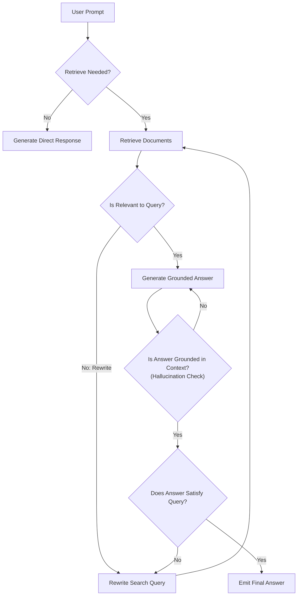

# 📹 Self-RAG Tutorial: How to Make Your AI Fact-Check Itself

<div className="video-card" style={{border: '1px solid #30363d', borderRadius: '8px', padding: '16px', marginBottom: '24px', background: 'rgba(56, 139, 253, 0.05)'}}>
  <div style={{display: 'flex', gap: '16px', flexWrap: 'wrap'}}>
    <div><strong>Instructor:</strong> Nitish Singh (CampusX)</div>
    <div><strong>Duration:</strong> 4120</div>
    <div><strong>Course:</strong> Module 3: Advanced RAG & Memory</div>
    <div><strong>Watch Link:</strong> <a href="https://www.youtube.com/watch?v=BbO_XaEjzaA" target="_blank" rel="noopener noreferrer">YouTube Lecture ↗</a></div>
  </div>
</div>

## 📌 Executive Summary

Self-Reflective RAG (Self-RAG) equips language models with dynamic introspection capabilities. Instead of retrieving on every query, Self-RAG determines *if* retrieval is necessary, critiques retrieved documents for usefulness, and grades generated responses for faithfulness and factual grounding.

This lesson explores self-reflection tokens, multi-stage critique rubrics, hallucination detection, and iterative retry loops in LangGraph.

---

## 🏗️ System Architecture & Execution Flow



---

## 📖 Core Concepts & Technical Deep Dive

### 1. Active vs Passive Retrieval
Passive RAG unconditionally retrieves documents even for queries the model knows perfectly ("What is 2+2?"). Self-RAG assesses whether external retrieval adds value, saving latency and vector search costs.

### 2. Multi-Stage Self-Reflection Criteria
- `[Retrieve]`: Predicts whether external retrieval is required (`yes`, `no`, `continue`).
- `[IsRel]`: Evaluates whether the retrieved context contains relevant supporting evidence.
- `[IsSup]`: Checks whether the generated claims are supported by the retrieved context (Faithfulness).
- `[IsUse]`: Evaluates whether the response genuinely answers the user's inquiry.

### 3. Loop Termination & Recursion Bounds
Because Self-RAG can loop back to rewrite queries or regenerate answers, production graphs must enforce a strict `recursion_limit` (e.g. max 3 iterations) to prevent infinite loops.

---

## 💻 Production Implementation

```python
from typing import TypedDict, List
from langgraph.graph import StateGraph, END

class SelfRAGState(TypedDict):
    query: str
    context: List[str]
    answer: str
    hallucination_score: float
    iteration_count: int

def hallucination_checker(state: SelfRAGState):
    print("--- CHECKING FACTUAL GROUNDING (HALLUCINATION GRADER) ---")
    # Score 1.0 represents perfect factual alignment with context
    return {"hallucination_score": 0.95, "iteration_count": state.get("iteration_count", 0) + 1}

def decide_next_step(state: SelfRAGState):
    if state["hallucination_score"] >= 0.85:
        return "approved"
    elif state["iteration_count"] >= 3:
        return "max_retries_exceeded"
    return "regenerate"

print("Self-RAG Reflection Logic initialized.")
```

---

## ⚙️ Production Gotchas & Best Practices

:::tip Guarding Against Infinite Loops
Always increment an `iteration_count` in the graph state. If the loop repeats more than twice without passing evaluation, fallback to a safe default message.
:::

:::warning Token Expenditure
Evaluating relevance, faithfulness, and utility on every turn triples the token cost. Reserve Self-RAG for high-stakes enterprise compliance or medical domains.
:::

---

## 📊 Architectural Reference & Comparison

| Reflection Dimension | Question Evaluated | Corrective Action on Failure |
| :--- | :--- | :--- |
| **Retrieval Need** | Is external knowledge required? | Skip retrieval and answer directly |
| **Context Relevance**| Does chunk contain relevant facts? | Rewrite search query and re-retrieve |
| **Groundedness** | Are claims backed by context? | Regenerate answer strictly on facts |
| **Utility** | Is user's original goal satisfied? | Refine output clarity and completeness |

---

## 📚 Key Takeaways & Enterprise Checklist

- [ ] **Architecture Verification:** Ensure your design addresses latency, decoupled interfaces, and strict data validation contracts.
- [ ] **Deterministic Testing:** Run unit tests and golden dataset evaluations before shipping changes to staging or production.
- [ ] **Security & Observability:** Enforce input/output guardrails, scrub sensitive credentials/PII, and capture distributed traces.
- [ ] **Scalability & Sizing:** Calibrate model parameters, context limits, and compute instance requirements against projected request concurrency.
