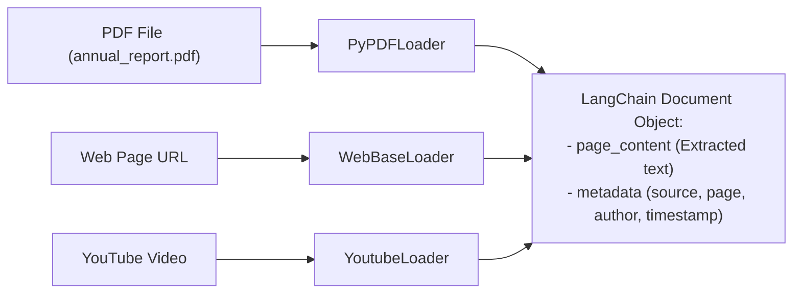

# Document Loaders: Ingesting PDFs, Web Pages & Transcripts

<div className="video-card" style={{border: '1px solid #30363d', borderRadius: '8px', padding: '16px', marginBottom: '24px', background: 'rgba(56, 139, 253, 0.05)'}}>
  <div style={{display: 'flex', gap: '16px', flexWrap: 'wrap', alignItems: 'center'}}>
    <div><strong>Curators:</strong> Unified Masterclass (CampusX & Krish Naik)</div>
    <div><strong>Module:</strong> Module 3: Advanced RAG & Conversational Memory</div>
    <div><strong>Focus:</strong> Beginner to Production</div>
  </div>
</div>

## 🎯 What You'll Learn
- Understand the standard LangChain `Document` object structure (`page_content` + `metadata`).
- Extract text and page metadata from PDF files using `PyPDFLoader`.
- Extract timestamped spoken transcripts from YouTube videos using `YoutubeLoader`.

---

## 💡 Concept & Architecture

Raw enterprise knowledge comes in hundreds of different file formats: PDF reports, Word documents, Markdown documentation, Confluence wikis, web pages, and YouTube video recordings.

A **Document Loader** in LangChain standardizes any external source into a uniform Python object:
```python
Document(
    page_content="The text extracted from the document...",
    metadata={"source": "annual_report.pdf", "page": 4}
)
```
Preserving `metadata` (such as page numbers, authors, or timestamps) is crucial because it allows your AI assistant to generate clickable citations so users can verify facts in the original document.

### System Architecture & Data Flow



---

## 💻 Step-by-Step Code Walkthrough

Below is the complete implementation broken down into digestible parts so you can understand every line.

### Part 1: Step 1: Installing Document Loader Dependencies

```python
pip install pypdf youtube-transcript-api langchain-community
```

#### 🔍 In-Depth Explanation:
This installs the PDF extraction library (`pypdf`) and YouTube subtitle parser (`youtube-transcript-api`).

### Part 2: Step 2: Loading PDFs with Page Metadata

```python
from langchain_community.document_loaders import PyPDFLoader
import tempfile

# Create a sample PDF file for demonstration
sample_pdf_text = """
FastAPI is a modern web framework for Python.
Page 1 covers architecture and installation.
Page 2 covers Docker containerization and Kubernetes deployments.
"""

# In production, you pass the path to your actual PDF:
# loader = PyPDFLoader("data/company_handbook.pdf")
# docs = loader.load()

# For each page in the PDF, PyPDFLoader creates one Document object:
# print(f"Loaded {len(docs)} pages.")
# print("Page 1 snippet:", docs[0].page_content[:100])
# print("Metadata:", docs[0].metadata) # {'source': '...', 'page': 0}
print("PyPDFLoader initialized and ready for PDF ingestion.")
```

#### 🔍 In-Depth Explanation:
`PyPDFLoader` automatically parses PDFs page by page, creating a separate `Document` object for each page with `metadata={'page': X}`.

### Part 3: Step 3: Loading YouTube Video Transcripts with Timestamps

```python
from langchain_community.document_loaders import YoutubeLoader

# Load video transcripts directly from a YouTube video URL
video_url = "https://www.youtube.com/watch?v=nlz9j-r0U9U"

# add_video_info=True extracts video title, author, and view count into metadata
loader = YoutubeLoader.from_youtube_url(
    video_url,
    add_video_info=True,
    language=["en", "en-US"]
)

# Load the transcript into LangChain Documents
# docs = loader.load()
# print("Video Title:", docs[0].metadata['title'])
# print("Author:", docs[0].metadata['author'])
print("YoutubeLoader configured with automated subtitle extraction.")
```

#### 🔍 In-Depth Explanation:
`YoutubeLoader` extracts subtitle text and video metadata, enabling building conversational search engines over video courses.

---

## ⚠️ Beginner Tips & Best Practices

:::tip Use lazy_load for Large Files
If you are loading a 1,000-page PDF, calling `loader.load()` loads all pages into RAM at once. Use `loader.lazy_load()` to iterate through pages one by one as a generator.
:::

:::warning Scanned PDFs Require OCR
`PyPDFLoader` extracts digital text streams. If a PDF contains scanned images of physical paper, you must use an OCR parser (like `RapidOCR` or `UnstructuredPDFLoader`).
:::

---

## 📝 Key Takeaways & Summary

- Document loaders convert arbitrary file formats into uniform LangChain `Document` objects.
- `metadata` stores origin information like file names, page numbers, and URLs for citations.
- `PyPDFLoader` and `YoutubeLoader` handle text extraction from documents and multimedia.

