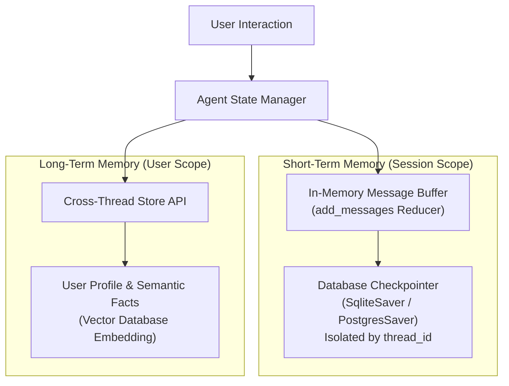

# 📹 How To Implement Short Term Memory Using LangGraph

<div className="video-card" style={{border: '1px solid #30363d', borderRadius: '8px', padding: '16px', marginBottom: '24px', background: 'rgba(56, 139, 253, 0.05)'}}>
  <div style={{display: 'flex', gap: '16px', flexWrap: 'wrap'}}>
    <div><strong>Instructor:</strong> Nitish Singh (CampusX)</div>
    <div><strong>Duration:</strong> 3166</div>
    <div><strong>Course:</strong> Module 3: Advanced RAG & Memory</div>
    <div><strong>Watch Link:</strong> <a href="https://www.youtube.com/watch?v=FSBkTI1QuvY" target="_blank" rel="noopener noreferrer">YouTube Lecture ↗</a></div>
  </div>
</div>

## 📌 Executive Summary

Large Language Models are completely stateless: every API call operates in isolation with zero memory of previous turns. Engineering stateful conversational applications requires building distinct memory architectures: short-term conversation state and long-term episodic/semantic memory.

This lesson analyzes short-term conversation buffers, checkpointer persistence in LangGraph, long-term user profile stores, and semantic memory retrieval.

---

## 🏗️ System Architecture & Execution Flow



---

## 📖 Core Concepts & Technical Deep Dive

### 1. Short-Term vs Long-Term Memory
- **Short-Term Memory (Thread-Scoped):** Maintains the immediate context of the current conversation (e.g. "What did I ask in the previous message?"). Stored in LangGraph state checkpointers and identified by `thread_id`.
- **Long-Term Memory (User-Scoped):** Persists facts, preferences, and entity knowledge across days and distinct sessions (e.g. "The user is a senior Python engineer who prefers Docker Compose"). Stored in semantic vector stores and keyed by `user_id`.

### 2. Context Window Overflow Strategies
As conversations progress, token limits are inevitably reached:
- **Sliding Window:** Keep only the last $N$ messages. Drops old context abruptly.
- **Summarization Buffer:** An intermediate LLM continuously summarizes older conversation turns into a running summary message.
- **Checkpointer Persistence:** Storing complete history in SQLite/Postgres while passing only pruned subsets to the active prompt.

---

## 💻 Production Implementation

```python
from typing import TypedDict, Annotated, List
from langgraph.graph import StateGraph, END
from langgraph.checkpoint.memory import MemorySaver
import operator

# Short-term memory state with add_messages reducer
class ChatState(TypedDict):
    messages: Annotated[List[str], operator.add]
    user_id: str

def assistant_node(state: ChatState):
    latest_query = state["messages"][-1]
    return {"messages": [f"Assistant responding to: {latest_query}"]}

workflow = StateGraph(ChatState)
workflow.add_node("assistant", assistant_node)
workflow.set_entry_point("assistant")
workflow.add_edge("assistant", END)

# In-memory checkpointer for thread isolation
checkpointer = MemorySaver()
app = workflow.compile(checkpointer=checkpointer)

# Multi-turn interaction on Thread-1
config = {"configurable": {"thread_id": "session-42"}}
app.invoke({"messages": ["Hello, I'm setting up an AWS cluster."], "user_id": "user-101"}, config=config)
state_snapshot = app.get_state(config)

print(f"Persisted Messages on Thread-1: {state_snapshot.values['messages']}")
```

---

## ⚙️ Production Gotchas & Best Practices

:::tip Thread Isolation
Always assign distinct `thread_id` keys to each user conversation session. Reusing thread IDs causes state contamination across distinct users.
:::

:::warning Unbounded Buffer Growth
Never allow raw message lists to grow indefinitely without summarization or window trimming. Unchecked message histories will exceed model context windows and cause HTTP 400 errors.
:::

---

## 📊 Architectural Reference & Comparison

| Memory Dimension | Short-Term Memory | Long-Term Memory |
| :--- | :--- | :--- |
| **Scope** | Single conversation thread | Cross-session user lifetime |
| **Storage Engine** | Checkpointer (SQLite / Postgres) | Vector Database + Key-Value Store |
| **Key Identifier** | `thread_id` | `user_id` / `org_id` |
| **Retrieval Logic** | Chronological replay | Semantic similarity query |

---

## 📚 Key Takeaways & Enterprise Checklist

- [ ] **Architecture Verification:** Ensure your design addresses latency, decoupled interfaces, and strict data validation contracts.
- [ ] **Deterministic Testing:** Run unit tests and golden dataset evaluations before shipping changes to staging or production.
- [ ] **Security & Observability:** Enforce input/output guardrails, scrub sensitive credentials/PII, and capture distributed traces.
- [ ] **Scalability & Sizing:** Calibrate model parameters, context limits, and compute instance requirements against projected request concurrency.
