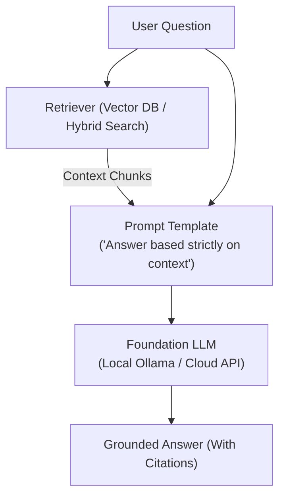

# 📹 3-Build RAG Pipeline From Scratch-Building Advanced Retreival Query Pipline-Part 2

<div className="video-card" style={{border: '1px solid #30363d', borderRadius: '8px', padding: '16px', marginBottom: '24px', background: 'rgba(56, 139, 253, 0.05)'}}>
  <div style={{display: 'flex', gap: '16px', flexWrap: 'wrap'}}>
    <div><strong>Instructor:</strong> Krish Naik (Krish Naik)</div>
    <div><strong>Duration:</strong> 16m 41s</div>
    <div><strong>Playlist:</strong> Complete RAG Playlist (Krish Naik)</div>
    <div><strong>Watch Link:</strong> <a href="https://www.youtube.com/watch?v=adPi3a8fq4c" target="_blank" rel="noopener noreferrer">YouTube Lecture ↗</a></div>
  </div>
</div>

## 📌 Executive Summary & Learning Objectives

This lecture covers **3-Build RAG Pipeline From Scratch-Building Advanced Retreival Query Pipline-Part 2**, focusing on production implementations, edge cases, and industry standards:
- Core intuition, architecture, and underlying mechanisms.
- Key differences between theoretical research implementations and scalable enterprise patterns.
- Concrete Python walkthroughs, error recovery, and performance optimization.

---

## 🏗️ Architecture & Conceptual Workflow



---

## 📖 Core Concepts & Technical Deep Dive

### 1. Architectural Foundations
In modern production AI engineering, **3-Build RAG Pipeline From Scratch-Building Advanced Retreival Query Pipline-Part 2** is essential for ensuring reliability, low latency, and deterministic outcomes. As AI systems evolve from naive prompt-in / completion-out scripts into distributed systems, engineers must handle:
- **State management & consistency:** Ensuring intermediate states and tool invocations are tracked.
- **Error boundaries & recovery:** Graceful degradation when external LLMs or vector stores encounter rate limits or network partitions.
- **Resource utilization & cost efficiency:** Caching common queries and reducing unnecessary foundation model token expenditure.

### 2. Operational Considerations
- **Latency Optimization:** Pre-computing embeddings, utilizing asynchronous non-blocking event loops, and streaming tokens via Server-Sent Events (SSE).
- **Security & Sandboxing:** Validating inputs before ingestion, sanitizing LLM outputs, and isolating tool execution environments.

---

## 💻 Production Implementation Walkthrough

```python
from langchain_core.prompts import ChatPromptTemplate
from langchain_core.runnables import RunnablePassthrough
from langchain_core.output_parsers import StrOutputParser
from langchain_community.chat_models import ChatOllama

# RAG Prompt with strict grounding
rag_template = """Answer the question based strictly on the provided context:
Context:
{context}

Question: {question}
Answer:"""

prompt = ChatPromptTemplate.from_template(rag_template)
llm = ChatOllama(model="llama3", temperature=0.1)

# Format documents helper
def format_docs(docs):
    return "\n\n".join(doc.page_content for doc in docs)

# Complete RAG Chain
rag_chain = (
    {"context": retriever | format_docs, "question": RunnablePassthrough()}
    | prompt
    | llm
    | StrOutputParser()
)
```

---

## 💡 Production Best Practices & Tips

:::tip Production Deployment Guideline
When deploying 3-Build RAG Pipeline From Scratch-Building Advanced Retreival Query Pipline-Part 2 in enterprise environments, always configure automated retries with exponential backoff and telemetry tracing (such as OpenTelemetry or LangSmith).
:::

:::warning Common Failure Modes
Watch out for state contamination across concurrent requests. Ensure each session or user interaction uses an isolated thread ID or execution context.
:::

---

## 🎯 Key Takeaways & Quick Reference

| Dimension | Production Standard | Pitfall to Avoid |
| :--- | :--- | :--- |
| **Execution** | Async / Non-blocking with timeouts | Synchronous blocking calls in event loops |
| **Data Validation** | Strict Pydantic v2 schemas | Untyped dictionary access |
| **Monitoring** | Distributed tracing & latency percentiles | Relying only on standard console logs |

## ⏱️ Lecture Timeline & Key Topics

| Timestamp | Key Topic / Concept Discussed |
| :--- | :--- |
| **00:00:00** | Hello guys. So we are going to continue... |
| **00:04:13** | so that we import or we load the entire... |
| **00:08:52** | So once we do this uh then we can... |
| **00:12:37** | score and what is the preview... |
| **00:16:38** | next video. Thank you. Take care.... |


---

---

## 📜 Complete Lecture Transcript (English)

> **Language:** English | **Source:** `03 - 3-Build RAG Pipeline From Scratch-Building Advanced Retreival Query Pipline-Part 2.en-orig.srt` | **Total Segments:** 9 | **Word Count:** ~2,925 words

<details>
<summary><b>Click to expand full chronological transcript (9 timestamped intervals)</b></summary>

#### ⏱️ [00:00 ➔ 00:02]

Hello guys. So we are going to continue the discussion with respect to rag. Uh till now we have already discussed about the entire data injection pipeline and with the help of user query you know we are also able to retrieve the context. uh we have completely implemented this first pipeline that is called as data injection pipeline where we did the data injection. We did the chunking uh then we converted the text into vectors and after that you know uh we were able to probably store everything inside a vector DB and we also persisted in the local directory so that we can always read whenever we definitely want okay based on a specific query. Now we are going to go towards the second pipeline that is the query retrieval pipeline wherein we are also going to use LLM with it. Okay. So here we are going to specifically use LLM models and this LLM models will actually help us to generate a summarized output okay in the rag. So the entire pipeline will look something like this. And uh when we talk about this query retrieval pipeline, we are specifically talking about something called as augmented generation. Okay. See in retrieval uh rack basically means retrieval augmented generation. And this augmented generation how does it specifically work? Okay. So let's consider that this vector DB is already ready. And you know that how did I create this particular vector DB? By following this particular pipeline, right? Now once we follow this pipeline the data is stored inside the vector DB. Now whenever a user gives a new query okay it has a new query related to the documents that are already ingested inside the vector DB then what we do we take up this query we apply the same embedding and in this particular embedding what we do we convert the query to vectors right and then from this particular

#### ⏱️ [00:02 ➔ 00:04]

embedding we hit the vector DB we get the context and then whatever context we get along with the prompt engineering like basically with a simple prompt we give that instruction to the LLM right so prompt is just like an instruction to the LLM like how the LLM should basically work now once we are doing this right this this step is basically called as augmentation okay this step is basically called as augmentation wherein we are giving we are taking the context and along with that we are also combining it with a specific prompt And finally you'll be able to see that we'll generate the output from the LLM. And this step is nothing but generation right this is the retrieval step. So here I have my retrieval step wherein we are giving a query we're converting that into vectors and we hitting the vector DB. So you really need to understand the entire concepts with respect to rag. Okay. So let's go ahead and implement this entire retrieval uh query retrieval pipeline along with the LLMs. Okay. Now here we are also going to go ahead and set up the LLM. So guys, now let's go ahead and implement this uh with the help of practical implementation. So here we are going to integrate vector DB context pipeline with LLM output. U as suggested we are going to implement the augmented and generation. Now first first of all what we are going to do is that I'm going to use the my Gro API key. Okay. So I have updated the gro API key over here in the env file and uh you know here we are going to probably go ahead and create a simple rag pipeline okay uh with the gro lm okay so first of all what we are going to do is that uh again uh if you remember in our requirement txt we will go ahead and import this two libraries that is called as langin- gro and then you have pythonv Okay. And then after this uh we will go ahead and

#### ⏱️ [00:04 ➔ 00:06]

uh you know quickly initialize from langchain grock import chat gro. Okay. Along with this I'm also going to go ahead and import os. Then from env I'm going to use load_.env so that we import or we load the entire environment variables. Then the next thing is that we will go ahead and initialize the gro lm and set your environment a gro api key inside this. Okay. And in order to do this again here you'll be able to see that I'm using gro api key o.get env something like this. Okay. If you just go ahead and call this sometime uh my suggestion would be that directly don't call from get envit directly test it by pasting the environment keys directly over here. Okay. So here I will go ahead and paste it. Otherwise you go ahead and replace it. Just for testing purpose I'm actually doing this. Now we'll go ahead and initialize our LLM model chat gro. And here I will use my gro API key is equal to API sorry Grock API key. Okay. And then model name is gamma 2 temperature I will select it as 0.1 and maximum number of tokens it will generate is 1024. Okay. So this is my LLM. We have initialized the gromm. Now the second thing is that we will quickly go ahead and create a simple rag function and this is going to integrate everything from retrieve context plus generate response and if you remember guys here is my retriever before class like the previous u session we have already seen that how this rag retriever was actually created we created a class for that okay so here uh we are going to probably take two different parameters Inside this we'll first of all define a function called as rag simple and then here we are going to go ahead and give our query. Then we are going to go ahead and give our retriever llm

#### ⏱️ [00:06 ➔ 00:08]

top k is equal to three. Okay. And then uh over here uh quickly let's go ahead and first of all retrieve the context. Yeah. So we going to retrieve the context. So here I'm going to write results is equal to retriever dot retrieve query. So here you have this query and top k is equal to k. Okay. And then uh we are just going to get the context or I'll go ahead and define my context inside this context. I will say that hey whatever information I'm getting from my results right just go ahead and combine everything and put it inside this right. So here I'm saying that hey for doc in results whatever content I'm getting I'm going to join it with a uh double new line over here. If results are this empty we are just going to keep it as empty. So this is my context over here right then uh I can still go ahead and write one more condition saying that hey if not context okay we are just going to go ahead and return saying that no relevant context form. Okay to the answer question and then we are going to generate the answer using gro lm okay and now I'm just going to go ahead and define my prompt obviously I required a prompt if you remember here I can again use a prompt template also I can directly use a prompt over here so here with respect to the prompt I will give a query saying that hey this is what you really need to do, you need to go ahead and answer this specific question and you should probably get a response for that. Right? So here what I will do, I will quickly go ahead and paste it. Use the following context. So here you can see use the following context to answer the question uh uh question concisely. Okay. And here what we can basically do is that we can

#### ⏱️ [00:08 ➔ 00:10]

just go ahead and um do one thing on over here quickly. I'll say just put tab. Okay. So use the following context to answer the question uh precisely or concisely. So here I have given the context here I've given the query. Okay. Now the next thing after this is that we will go ahead and create a response. So response is equal to this time we are going to use llm dot invoke. Okay. And here uh let's go ahead and put something like prompt dot format. And here we are going to write context is equal to context and here you have query is equal to query whatever query I have. Okay. And then we go ahead and return the response dot content. So once we do this uh then we can specifically call this particular function. Okay. So now what we are going to do is that I will just go ahead and write answer is equal to rag simple and let's say I go ahead and ask a question what is attention mechanism okay and here I need to give my rag retriever along with the llm and then we can go ahead and print the answer okay so here you can see attention mechanism is a function that maps a query in this right And we are able to get the answer over here. This is really good. See a very simple pipeline where I have initialized my LLM model. I've defined a function and then this function what it is doing first of all it is hitting the rag retriever retrieve function. It is getting the context. It is combining the context and along with the prompt we are hitting the llm. So if you remember we are we are just following this entire process and generating a proper output right if that particular output is available inside the uh vector DB right now guys uh what we are going to do is that we are going to enhance the rack pipeline the simple

#### ⏱️ [00:10 ➔ 00:12]

rack pipeline that we have created over here okay we'll enhance in such a way that it will have more amazing features in it okay so now we're going to go ahead and create an amazing enhanced track pipeline and this is the code so now you can see over Here we have a function called as rag advanced. I'm giving a query retriever llm top key elements like how many we want minimum scores return context is equal to false. So here you can see that um beforeh we were simply like we were just combining the context we are putting the information in the prompt and we were probably generating the response. In this what we will do is that here we are going to generate this entire pipeline with some more additional features like what all additional features we'll be requiring. See here we are directly getting the answers right but we do not have much information about the source about the context over here right so here what we are doing we will return answers sources confidence score optionally fully context full context okay so first of all again the code will be similar where we are retrieving the context so this becomes my context when we are retrieving it from retriever retrieve and then uh I have written if not results if results are empty we are saying that no relevant context found and here we are giving sources is blank, confidence is 0.0 and context is blank. This context is basically coming from the vector DB. Let's say that if we are getting some kind of results over here, we are combining all those results and we are preparing the context over here and then we are adding sources. See this sources which is the list here we are adding metadata information source file right and along with that you can see metadata page number from which page number you are able to get then what is the similarity score and here what I will do is that I'll just try to go ahead and you know display at least 300 um length of the content right so up to 300 characters we'll try to display and then we are going through each and every docs that is available inside this results then we are going to calculate the confidence uh we are actually getting that information in this doc

#### ⏱️ [00:12 ➔ 00:14]

similarity score here is my prompt in this prompt we are giving context query each and everything and we are invoking it and the output will be in this format so let's now go ahead and execute this rag advanced function here I've given all the information like I've asked what is the attention mechanism what is rag retrie like rag retrievy I'm given over here llm written context is equal to true minimum score all these things is given right so now I'll go ahead and execute this now as soon as I ask what is attention mechanism here you'll be able to see that I'm getting this particular information right and it is also giving me the source information which number page number what is the score and what is the preview information along with that here is my final information that you can see right where we are displaying the first 300 characters let's say that I go ahead and change my question okay I I ask something else I'll say hey uh attention mechanism was one of the thing But if I go ahead and see my data, my PDFs. Okay, I will go ahead and ask something else. Okay, let's see what I can ask. So I'll go to embeddings.pdf. I'll say okay. And then let me search something else, right? I will say hard negative. I'll ask this question hard negative mining techniques. Okay, so I will go to my question over here. hard negative mining techniques. Okay. And I'll go ahead and search this thing from my vector retriever. So here you can see that I'm able to get this entire information. and the test destroy several hard NC conan embeddings NV retriever all these information and again you can see that embedding PDF page 4 I'm able to see all the information along with the context right so this is uh really amazing and here we have just created an enstrack pipeline

#### ⏱️ [00:14 ➔ 00:16]

why we say this as an N rack pipeline because here we are providing information related to answers we are providing information related to confidence score and each and everything now let me just show you one more amazing way and this is also an advanced rack pipeline but this time I will tell you to probably go through this particular code and tell me so here what we are doing we're doing streaming citation history and summarization so all these things we have included over here and uh you can just go and search for this and you can see the answer okay final answer roment context found because that question may not be there okay I will just or let me just change this minimum score to 0.1 I think we should be able to get something still nothing uh let Let me change the question. Let's say hard negative mining techniques. And here we are just going to go ahead and display this particular output. Okay. So now you just go ahead and explore this. Okay. I'll keep this for you at least see some kind of coding. Okay. So here we are not able to get anything as such. Uh let's see. Advanced rack query hard query top quering summarize equal to true. Uh no relevant this one. Let's see that I go ahead and ask what is what is attention is all you need. Okay, I'll go ahead and execute it. So here you can see that I'm able to see all these particular answers over here. Right. Yeah, for some of the queries this will not it is not giving there may be some problem with respect to the context size but it's okay. You can try out with different different things. If it if something is not coming then we'll try to optimize that also as we go ahead we'll try to see this. So here we have seen three amazing rack pipelines. One was a simple rack pipeline here was an enhanced rack pipeline and here uh in the last one we have made sure to put streaming citation and history and summarization with all this kind of information over here. You just go ahead and check it out all the

#### ⏱️ [00:16 ➔ 00:16]

information and just see the code. I think you should be able to understand it. So overall uh if you see I hope you were able to understand this particular video and uh yeah this was about rack pipeline. Now in the upcoming videos what we will do is that we will try to create some modular coding because see here the entire everything is basically created in one IP file. Now what I will do is that as we go ahead I will start implementing all these things inside a source folder like how a model structure of coding can be applied inside this entire rack pipeline. Right? So yes this was it from my side. I'll see you in the next video. Thank you. Take care.

</details>
