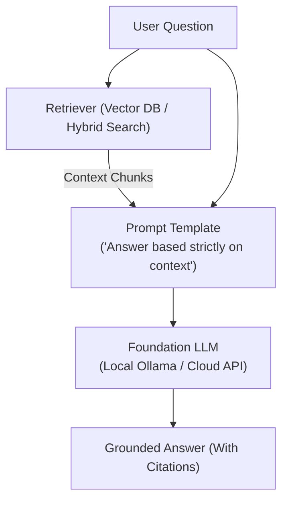

# 📹 4-Building RAG With Typesense- Lightning Fast,Open Source Search

<div className="video-card" style={{border: '1px solid #30363d', borderRadius: '8px', padding: '16px', marginBottom: '24px', background: 'rgba(56, 139, 253, 0.05)'}}>
  <div style={{display: 'flex', gap: '16px', flexWrap: 'wrap'}}>
    <div><strong>Instructor:</strong> Krish Naik (Krish Naik)</div>
    <div><strong>Duration:</strong> 23m 7s</div>
    <div><strong>Playlist:</strong> Complete RAG Playlist (Krish Naik)</div>
    <div><strong>Watch Link:</strong> <a href="https://www.youtube.com/watch?v=MMS04bku3FE" target="_blank" rel="noopener noreferrer">YouTube Lecture ↗</a></div>
  </div>
</div>

## 📌 Executive Summary & Learning Objectives

This lecture covers **4-Building RAG With Typesense- Lightning Fast,Open Source Search**, focusing on production implementations, edge cases, and industry standards:
- Core intuition, architecture, and underlying mechanisms.
- Key differences between theoretical research implementations and scalable enterprise patterns.
- Concrete Python walkthroughs, error recovery, and performance optimization.

---

## 🏗️ Architecture & Conceptual Workflow



---

## 📖 Core Concepts & Technical Deep Dive

### 1. Architectural Foundations
In modern production AI engineering, **4-Building RAG With Typesense- Lightning Fast,Open Source Search** is essential for ensuring reliability, low latency, and deterministic outcomes. As AI systems evolve from naive prompt-in / completion-out scripts into distributed systems, engineers must handle:
- **State management & consistency:** Ensuring intermediate states and tool invocations are tracked.
- **Error boundaries & recovery:** Graceful degradation when external LLMs or vector stores encounter rate limits or network partitions.
- **Resource utilization & cost efficiency:** Caching common queries and reducing unnecessary foundation model token expenditure.

### 2. Operational Considerations
- **Latency Optimization:** Pre-computing embeddings, utilizing asynchronous non-blocking event loops, and streaming tokens via Server-Sent Events (SSE).
- **Security & Sandboxing:** Validating inputs before ingestion, sanitizing LLM outputs, and isolating tool execution environments.

---

## 💻 Production Implementation Walkthrough

```python
from langchain_core.prompts import ChatPromptTemplate
from langchain_core.runnables import RunnablePassthrough
from langchain_core.output_parsers import StrOutputParser
from langchain_community.chat_models import ChatOllama

# RAG Prompt with strict grounding
rag_template = """Answer the question based strictly on the provided context:
Context:
{context}

Question: {question}
Answer:"""

prompt = ChatPromptTemplate.from_template(rag_template)
llm = ChatOllama(model="llama3", temperature=0.1)

# Format documents helper
def format_docs(docs):
    return "\n\n".join(doc.page_content for doc in docs)

# Complete RAG Chain
rag_chain = (
    {"context": retriever | format_docs, "question": RunnablePassthrough()}
    | prompt
    | llm
    | StrOutputParser()
)
```

---

## 💡 Production Best Practices & Tips

:::tip Production Deployment Guideline
When deploying 4-Building RAG With Typesense- Lightning Fast,Open Source Search in enterprise environments, always configure automated retries with exponential backoff and telemetry tracing (such as OpenTelemetry or LangSmith).
:::

:::warning Common Failure Modes
Watch out for state contamination across concurrent requests. Ensure each session or user interaction uses an isolated thread ID or execution context.
:::

---

## 🎯 Key Takeaways & Quick Reference

| Dimension | Production Standard | Pitfall to Avoid |
| :--- | :--- | :--- |
| **Execution** | Async / Non-blocking with timeouts | Synchronous blocking calls in event loops |
| **Data Validation** | Strict Pydantic v2 schemas | Untyped dictionary access |
| **Monitoring** | Distributed tracing & latency percentiles | Relying only on standard console logs |

## ⏱️ Lecture Timeline & Key Topics

| Timestamp | Key Topic / Concept Discussed |
| :--- | :--- |
| **00:00:00** | Hello guys. So we are going to continue... |
| **00:05:53** | host come from? Where did this port come... |
| **00:11:32** | created. Right? But still I will not be... |
| **00:17:19** | splitter character text splitter... |
| **00:23:06** | Thank you.... |


---

---

## 📜 Complete Lecture Transcript (English)

> **Language:** English | **Source:** `04 - 4-Building RAG With Typesense- Lightning Fast,Open Source Search.en.srt` | **Total Segments:** 12 | **Word Count:** ~4,466 words

<details>
<summary><b>Click to expand full chronological transcript (12 timestamped intervals)</b></summary>

#### ⏱️ [00:00 ➔ 00:02]

Hello guys. So we are going to continue a discussion with respect to rag. Already in our previous video if you remember we have completed the entire pipeline from data injection to chunking to embedding and finally converting the text to vectors and storing into a vector store which was stored locally. Now in this particular video I want to show you an example wherein after we convert the text into vectors we store this into a vector DB that is hosted in a cloud. Okay. So for this we are going to use this amazing platform which is called as Typesense and thank you Typesense for sponsoring this video. Now for all those people who do not know about Typesense. It is lightning fast open-source search and here it is designed for use cases such as website mobile search. It provides amazing features like instance search uh natural language support semantic and vector search capabilities. Right? So if you just go ahead and search for something right let's say that there are so many different kind of records over here how fast it is able to probably make that particular search and display you the result right so that is the most amazing thing now you may be thinking why typesense is really really fast when compared to other vector databases that are available so this is actually built in C++ and it is written in an in-memory architecture and because of this it is incredibly fast and memory efficient. Now in this particular video I am going to show you that how we can go ahead and work with typesense cloud. How we can create a collection over there directly from our code. How we can actually perform the data injection performing the embedding storing the entire vector inside this particular uh database uh as in a vector DB and then how we can query it and get the result. So all this specifically thing will be showed in this particular video as in we are just trying to develop a rag application. you can consider where our vector database is basically coming from Typesense cloud right so let me go ahead and

#### ⏱️ [00:02 ➔ 00:04]

upload this so first of all I will show case my previous code that I have actually written now I'll close this and here what I will do I will quickly first of all go to my requirement txt and we will go ahead and import one more library which is called as typesense okay so this typesense needs to be installed so I will go to my command prompt and I will write uv type sense. Okay. So once the installation happens uh so here you'll be able to see that uh the installation will take place and here you can see that typesense 1.1 is basically installed. So once we do this the next thing that I will do I will go ahead and write typesense dot ipyv. Okay. Now inside this ipv I will go ahead and select my kernel and then we will start writing the code over here. And the code this will be with respect to creating a rag application. Rag application using type sense. Okay. Using type sense. Perfect. Now once this is done first of all you need to go ahead and sign up into this particular account. So once you go ahead and sign up with any email id right the first thing that you will see is that it'll tell you to probably go ahead and make a new cluster and initially this new cluster can be created for this default configuration completely for free and you can also go ahead and create some of the collection inside this particular clusters okay so here what I will do I will just go ahead and click on launch okay so once I go ahead and click on launch here you'll be able to see that your cluster is being provisioned and after this we will also go ahead and create our own API keys. Okay. So let this happen. It will probably take around 4 to 5 minutes. So till then what I will do I will go back to my IPB file and from here I will start writing my code. Okay. Now step by step I will show you that how I will be creating the entire data injection

#### ⏱️ [00:04 ➔ 00:06]

pipeline along with that embeddings and then how I will go ahead and store inside this particular vector database collection that is available inside our typesense. Okay. So step by step I will go ahead and show it. So first thing that you have to do is that we will go ahead and import types since we have already uh you know we have already import uh installed this. So I think it will tell me that hey uh it is giving me an error. No worries. So I'll just say import typesense. And now you can see that I'm able to work with this in a very easy way and it is imported correctly. That basically means the library has been installed correctly. Okay. Now the first thing is that when I need to create the typesense collection right so inside this particular platform after this cluster is being initialized you know so we also need to go ahead and create a collection the collection will be the place where we will be storing the entire vector store right so for that in order to create the collection or in order to access this particular DB you know what we need to do is that we need to go ahead and create a typense client okay so now what we will do we will quickly go over here and I will go ahead and write client is equal to okay I'll create a variable I'll use the same type since dotclient here you can see that I'm using this dotclient function and inside this doclient function right inside this client function we have to go ahead and provide some information okay now what all information we need to go ahead and provide so let me paste it over here so that you'll be able to understand so here you can see that I'm providing some nodes information over here. So for the first inside my nodes there is something called as host there is something called as port there is something called as protocol. Okay along with this we also provide API key and we also provide connection timeout. Okay now by default you may be thinking kish where did this host come from? Where did this port come from? Where did this protocol come from or where did this API come from? Right? So we will be discussing about this but

#### ⏱️ [00:06 ➔ 00:08]

understand why we are specifically creating this client so that we will be able to communicate with our types cloud platform right now the question rises Chris how do we decide what host we really need to use okay let's say that you want to just go ahead and use local so what I will do I will say local over here that basically means I'm working it local so I'm just writing local over here you can go ahead and provide any port that you want which is available in your local let's say uh 88080 and Then if you are not if you're just using local you can also use HTTP right so this is basically the local configuration and here you also don't require any API key okay so let's say that if I go ahead and write XY Z this is more than sufficient like API key is not there right so since in local you don't require an API key but if I'm specifically using the cloud platform we make this specific changes so let me see that whether this is got initialized or not still it is taking some amount of time for initialization but it it is going to take for the first time for somewhere around 4 to 6 minutes. Okay. But later on we will go ahead and update this changes. So till now what I will do I will just go ahead and write like this and I will just keep the default values. This is there right and this entire information the host information we will be getting from the cluster right the cluster that we are creating port number whenever we are connecting to the typesense cloud you can see that by default we need to use 443 and the protocol will be https and this API key we directly get from the types cloud. Okay. So once the cluster is basically created, we will be able to get that specific information. So right now I will just go ahead and execute this by putting some default values and this is how my client looks like. Okay. So this is my typesense client and I will be using this particular client to create collections to do anything that I really want. Okay. So all these things will be there. Now let me go over here and let me see that whether this cluster is initialized or not. Okay. So now here you can see that the cluster is initialized. Now the first thing is that you will be able to see some node

#### ⏱️ [00:08 ➔ 00:10]

information right. So this node information you can directly copy it from here. So I will copy it over here. Okay. And I will paste it over here. Okay. Node information is basically over here uh with respect to the host. Okay. And that usually goes with the host. Right? Port will be like that. Protocol will be like that. Now we need to think of how we will be able to get the API key. So now again I will go over here and if you click on this API keys here you can see you can just go ahead and click on create API key and this key is basically called as admin key right whenever you have an admin key that basically means you will be able to use it for any purpose like read write delete any kind of operation so I'll copy this API key I'll go back to my code over here and then I will paste it over here right so this is how we basically go ahead and create the client okay now very simple way I have all the information over here itself with respect to this my API key uh my host uh my connection timeout each and everything right now the next thing is that we will go ahead and create our collection now for creating a collections we will look for first of all we need to provide a schema okay now how does a schema looks like right let's say that if I have some kind of data now in that particular data I may have fields like name I may have fields like type, authors, it can be different different information, right? It can be having some more information like publication year, ratings, average rating, it can have anything, right? So here you'll be able to see that I have one example where I have in this particular format. Let's say that I have a JSON format which is basically coming from the API. Now inside this the schema looks like it has title, it has authors, it has publication year, it has ID, it has average rating, right? It has some kind of image information. So all this and it also has the rating counts. So let's say in my JSON I have all the specific values and I really want to convert this into a rag application and

#### ⏱️ [00:10 ➔ 00:12]

also stores this information in our types cloud. Okay. So for doing that what I will do I will go ahead and create my schema. So here I will go ahead and write my book schema. My book schema will look something like this. See so this is how my book schema will look like. So the name is book and here I have used some kind of fields. Inside my fields, it may have name, title, type. Okay, it may have name, author's, type, string, facet, true. It may have this is the key. The name can be publication year. Type is int 32. Facet is true. Then again I have name, rating counts. You can see rating counts is also one of the feature that is available inside this JSON. Right? It can be considered as a new column altogether. Right? So all this is how we are setting up the schema. The reason of setting up this particular schema is that we are going to go ahead and create our own collection by using the schema and then we will go ahead and insert some information out there. Okay. Like uh after creating the schema whatever things are available over here we'll try to insert it inside our types cloud. Okay. Now we will go ahead and write print and let's go ahead and create client.colction.createbook schema. So once I go ahead and write, we can go ahead and see that it has got created. Okay. And we have used the same client. This is the typesense client. Now let's see whether it has got updated over here or not. So I'll go to my collection. I will see that my books is been created. Right? But still I will not be able to see any kind of data. But here clearly you can see that in a very easy way. What did I do out of this particular code? In this particular code, you'll be able to see that I created my client. I created my book schema and then we used client.colction.create or book schema whenin I created the entire collection. Now once this is done, what we will do is that we will try to read this JSONal file books.json file and then we will try to uh import

#### ⏱️ [00:12 ➔ 00:14]

all this particular information inside our collection. Okay. So for doing that we will go ahead and write this particular code with books.json JSON dot read that basically means we are opening this particular file in the read mode by using a encoding UTF8 characters and then we are reading this particular file and then we are saying that hey select this particular collection that is book document.imp import of data. So with the help of this particular function automatically the import will happen. So if I go ahead and execute this based on some amount of time the entire information will directly go over here. So if I just go ahead and see the collection now and here you can see the document count is 9979 right in a such a easy way you are able to see that with the help of Typescence cloud we are able to you know just go ahead and upload all the records and all the records is basically shown over here right you have titles you have publication year rating count average rating all the informations over here uh is easily uploaded and you can probably go ahead and do the search since Typesense supports puts faster search you'll be able to probably do semantic search you'll be able to do any kind of vector search right now it's time that we go ahead and see the search right so the best part about the search is that when I go to this particular book right I can query by title I can probably query by any kind of parameters right so I can query by title I can do apply face it and filter by you know author's publication date and all now in the coding side how do I probably go ahead and apply this search parameters okay so here what I will do I will go ahead and create this I'll create some search parameters. Okay, inside the search parameter first parameter is nothing but Q and I have just seen this. Okay, so here you can see inside this this is my query parameter, right? Q query by and all this all these criterias we'll try to put it over there in our code. Okay, so Q is nothing but let's say I want to search for Harry Potter. Okay, so let's

#### ⏱️ [00:14 ➔ 00:16]

say I'm searching for Harry Potter in the book. Okay, there are some information related to Harry Potter. And let's say there is my another parameter which is something called as query by title authors. Title comm, authors. I can also do that query by title or authors. And finally I will also go ahead and sort sort by rating count in the description order in the decreasing order. Okay. So now this actually becomes my search parameters. Okay. Now by using the search parameter now I can again go ahead and call my client docolction.books books dod documents do.arch based on this search parameter. So if I just use client collection dod documents dots search and if I just give a query directly over here it'll be based on that. If I add some more additional parameters it will be based on this particular information that is query by and sort by. Okay. And once I probably do the search you should be able to see that I'm getting 17 documents and these are all my information that is probably coming from the vector DB. The most amazing part is that see how fast this is. Yes, how amazing and how fast this is. Right now you may be thinking Kish can we also add filter by you know can we do some kind of filtering criteria or yes definitely. So now here you can see that if I go ahead and write code and here you can see filter by publication year less than 9898. Right? So once I do this here you'll be able to see all the information which is less than 1998 like the publication year is less than 1998 you'll be able to see all those information over here. Now just just imagine this is what is the context right at the end of the day if you remember here what is the main name we are hitting the vector DB we are getting the context now we can just give this context to our LLM and probably generate any kind of output that we want. Yes. So that is the reason why we are doing this specific thing where is uh we are using some specific search parameters called Harry Potter I mean getting this entire information out there right now you can

#### ⏱️ [00:16 ➔ 00:18]

go ahead and write any kind of queries based on your uh requirement you know uh let's say that I also want to apply face it right so we had also a feature called a face it right so let's let's say my query is experiment I'm giving the tit query by title face it by authors right and average rating is equal to uh in disc decreasing order. So here you can see highlighted author names are there value all the information Mahatma Gandhi value Mahatma Gandhi highlighted James Peterson right so here you will be able to see that much more in an amazing way the result is basically been displayed now this is all the basic stuffs that we have learned already okay now the main thing is that kish can we also do this with the help of langchen so the best part is that langchen and typense plus typense Yes, press GRO lm and we can definitely go ahead and create a rag application. Now let's try one more with the help of lang chain you know I will just go ahead and quickly create an entire simple rag. Okay and what I will do I I'll go ahead and create a new collection on the go. Okay so this is my first libraries that I'm going to use. I'm going to use document loaders text loader uh vector storage type sense langchen text splitter character text splitter langchen embedding hugging face embeddings we'll go ahead and use langchen gro chat gro. So let's let's go ahead and use this. Okay. So these are libraries we'll be specifically using. Along with this, we will also go ahead and set up our gro API with this API key. And I hope everybody knows how to get the gro API key. I'll go ahead and use this. Now there is one file over here test.txt. So let's say that this is my file and this is like an essay on artificial intelligence. What we'll do? We'll try to store this entire information with the help of langen directly into our types cloud. Okay. So first of all what we'll do we will convert we will read this data by using

#### ⏱️ [00:18 ➔ 00:20]

text loader. Then we do loader.load. We get the documents. We apply character text splitter. Let's say that chunk overlap we'll go ahead and apply 100 text.plit documents. And finally we go ahead and apply the embeddings. So embedding also we are initializing it over here. If you're getting this deprecated warning you can use langin_hugging face. So all these things I've already discussed in my entire rack playlist. Okay. So here what we are doing here we are doing data injection here we are doing pre-processing here we are splitting the documents and with the help of this embeddings we will go ahead and apply the embeddings and the best part is that here uh you can see that I have also imported lang community.vector Vector stores import time sense right so typesense is available in the form of a vector store also you can also do it in local you can also go ahead and do it in cloud okay it is up to you so however you want to probably go ahead and do it you can go ahead and do it okay now what I will do till then I will go ahead and write doc search now I'll show you how we can use typesense along with langchen so for here what I am going to do is that I'll write typesense dot from documents here I given the documents We are embeddings and then we have this type client parameters and here we are going to specify that entire information which we had right so if I go up that all information we'll try to put it up so this is my host so let's say that this is my entire client I will copy and paste it over here okay code okay so we'll try to replace this this is my host my host will be pasted over here then 443 https and then this is my key and here you can see my collection name is lang chain that is what I have actually considered right now once I execute this the best part will be that you'll be able to see the collection getting created okay so now this has got

#### ⏱️ [00:20 ➔ 00:22]

executed I think the collection has got created so if I just go ahead and click on the collections and refresh it here you can see lang chain so they eight specific documents that is available over here and here you can see autonomy accountability who's responsible uh who's responsible when an AI system makes mistakes so let's ask this question also okay and here you can see national security and defense AI is increasing uh transportation AI so all the chunking specifically everything is basically over here right now I'll go back over here quickly and I will do a normal similarity search so this is my query what is artificial intelligence? I'll use the same doc search and there is a function called as dots similarity search of query. Okay. And I can just go ahead and print found sorry found docs of page content. So if I go ahead and write this you should be able to see that I'm able to get the response right. Similarly you can go ahead and search for more things. You can also even convert this into a retriever also. See I will go ahead and convert into a retriever right. So for doing that I will write retriever doc search as retriever and you can use the same retriever to invoke the queries right. So here you can use this. So here you can see that I'm getting a artifier transforming has emerged as one of the transformative centuries and all right. So this is how easy it is and the best part is that you are able to see everything is over here in the cloud right I've created two collections books I've created books as a collection you can see all the books over here it has 9,000 plus records and probably done each and everything over here so this is one beautiful example where I try to showcase that how you can go ahead and use all these things and uh you know probably go ahead and uh you know see

#### ⏱️ [00:22 ➔ 00:23]

that how records have been getting appended uh how you are able to add how you are able to create collections you can also do this in local as I told you the local setting is very simple I'll just go ahead and set this to local I'll give the port number of the local and make this HTTP API key is not required at all okay but that is what we have actually able to do with the help of type sense you should definitely go ahead and use it it is very very fast the open source alternative it is written away easier to use alternative for elastics search here from scrappy startups to household name so many different clients are basically using it has all this particular functionalities like search as your type autocomplete geio search semantic search recommendation built-in rag and then here you can also go ahead and compare how it is different from the other search that is available out there and since this is open source search definitely go ahead and use it right so uh I hope you like this particular video this was it from my side uh go ahead and implement more examples and let me know that whether you have understood it or not. Right? So yeah, this was it for my side. I'll see you in the next video. Thank you.

</details>
