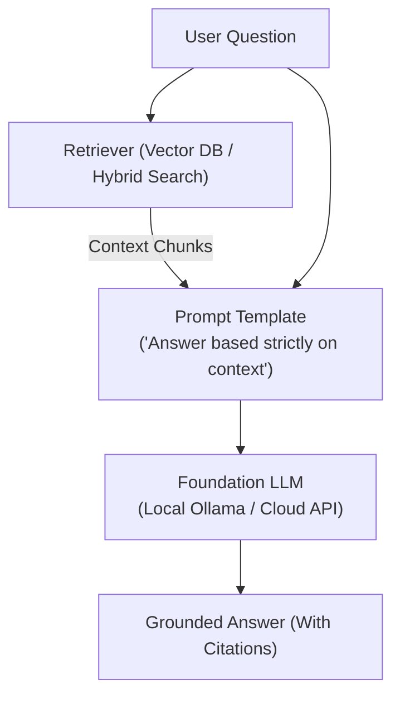

# 📹 Agentic AI 3.0 - Live Ultimate RAG Bootcamp Course Announcement

<div className="video-card" style={{border: '1px solid #30363d', borderRadius: '8px', padding: '16px', marginBottom: '24px', background: 'rgba(56, 139, 253, 0.05)'}}>
  <div style={{display: 'flex', gap: '16px', flexWrap: 'wrap'}}>
    <div><strong>Instructor:</strong> Krish Naik (Krish Naik)</div>
    <div><strong>Duration:</strong> 8m 11s</div>
    <div><strong>Playlist:</strong> Complete RAG Playlist (Krish Naik)</div>
    <div><strong>Watch Link:</strong> <a href="https://www.youtube.com/watch?v=hSO4zjeQO48" target="_blank" rel="noopener noreferrer">YouTube Lecture ↗</a></div>
  </div>
</div>

## 📌 Executive Summary & Learning Objectives

This lecture covers **Agentic AI 3.0 - Live Ultimate RAG Bootcamp Course Announcement**, focusing on production implementations, edge cases, and industry standards:
- Core intuition, architecture, and underlying mechanisms.
- Key differences between theoretical research implementations and scalable enterprise patterns.
- Concrete Python walkthroughs, error recovery, and performance optimization.

---

## 🏗️ Architecture & Conceptual Workflow



---

## 📖 Core Concepts & Technical Deep Dive

### 1. Architectural Foundations
In modern production AI engineering, **Agentic AI 3.0 - Live Ultimate RAG Bootcamp Course Announcement** is essential for ensuring reliability, low latency, and deterministic outcomes. As AI systems evolve from naive prompt-in / completion-out scripts into distributed systems, engineers must handle:
- **State management & consistency:** Ensuring intermediate states and tool invocations are tracked.
- **Error boundaries & recovery:** Graceful degradation when external LLMs or vector stores encounter rate limits or network partitions.
- **Resource utilization & cost efficiency:** Caching common queries and reducing unnecessary foundation model token expenditure.

### 2. Operational Considerations
- **Latency Optimization:** Pre-computing embeddings, utilizing asynchronous non-blocking event loops, and streaming tokens via Server-Sent Events (SSE).
- **Security & Sandboxing:** Validating inputs before ingestion, sanitizing LLM outputs, and isolating tool execution environments.

---

## 💻 Production Implementation Walkthrough

```python
from langchain_core.prompts import ChatPromptTemplate
from langchain_core.runnables import RunnablePassthrough
from langchain_core.output_parsers import StrOutputParser
from langchain_community.chat_models import ChatOllama

# RAG Prompt with strict grounding
rag_template = """Answer the question based strictly on the provided context:
Context:
{context}

Question: {question}
Answer:"""

prompt = ChatPromptTemplate.from_template(rag_template)
llm = ChatOllama(model="llama3", temperature=0.1)

# Format documents helper
def format_docs(docs):
    return "\n\n".join(doc.page_content for doc in docs)

# Complete RAG Chain
rag_chain = (
    {"context": retriever | format_docs, "question": RunnablePassthrough()}
    | prompt
    | llm
    | StrOutputParser()
)
```

---

## 💡 Production Best Practices & Tips

:::tip Production Deployment Guideline
When deploying Agentic AI 3.0 - Live Ultimate RAG Bootcamp Course Announcement in enterprise environments, always configure automated retries with exponential backoff and telemetry tracing (such as OpenTelemetry or LangSmith).
:::

:::warning Common Failure Modes
Watch out for state contamination across concurrent requests. Ensure each session or user interaction uses an isolated thread ID or execution context.
:::

---

## 🎯 Key Takeaways & Quick Reference

| Dimension | Production Standard | Pitfall to Avoid |
| :--- | :--- | :--- |
| **Execution** | Async / Non-blocking with timeouts | Synchronous blocking calls in event loops |
| **Data Validation** | Strict Pydantic v2 schemas | Untyped dictionary access |
| **Monitoring** | Distributed tracing & latency percentiles | Relying only on standard console logs |

## ⏱️ Lecture Timeline & Key Topics

| Timestamp | Key Topic / Concept Discussed |
| :--- | :--- |
| **00:00:00** | Hello all, my name is Krishna and... |
| **00:02:15** | week uh enjoy that time you know... |
| **00:04:18** | distributing between us. Whoever will be... |
| **00:06:11** | this one module three um module four... |
| **00:08:09** | care bye-bye... |


---

---

## 📜 Complete Lecture Transcript (English)

> **Language:** English | **Source:** `05 - Agentic AI 3.0 - Live Ultimate RAG Bootcamp Course Announcement.en.srt` | **Total Segments:** 5 | **Word Count:** ~1,549 words

<details>
<summary><b>Click to expand full chronological transcript (5 timestamped intervals)</b></summary>

#### ⏱️ [00:00 ➔ 00:02]

Hello all, my name is Krishna and welcome to my YouTube channel. So guys, uh less than two months are left for the completion of 2025. Um this year has been quite amazing. Uh we were able to teach many many people out there. Uh many people were able to make successful career transition specifically in the field of generative AI, agentic AI. Uh many people have even started their own startups. They're doing some amazing work building specific agentic AI applications. uh uh how do I count this year as a successful because I feel that how much values we are able to add in others life right and uh through our courses through our Udemy courses through the things that we do in our YouTube channel uh we were able to see that specific growth right uh in this specific video I really want to talk about one amazing course announcement and this is probably the last course for this entire year uh this is the last course because anything that will be coming will be coming after January month the next uh next year January right so uh that was related to this specific announcements uh so I know some people will not be interested to hear about courses and all if you're not interested please go ahead close this video down you can go ahead and watch all my YouTube videos I have been continuously uploading over there but if you are really interested in understanding what this specific batch is all about This is the Agentic AI 3.0 and I really want to name this batch as ultimate rag boot camp wherein we will build traditional to agentic systems with cloud deployment. So this is the course that we are specifically coming up with. Uh initially I had decided this course date to October 26th. Okay. But we are going to change this particular course date you know. So if I just go ahead and reload it, uh this course date will get changed to November 2, 2025. The reason why extending it to one more

#### ⏱️ [00:02 ➔ 00:04]

week because October 26th that will still be the festive season wherein we have the power. So I really want to people to enjoy that specific uh uh period of time you know the entire one week uh enjoy that time you know somewhere around uh if you see with respect to the calendar everybody will be busy uh from 18th 19 20 21 22 23 so I don't want to probably disturb this specific week you know so I definitely want you all to enjoy the poly with your family and all and uh from the first week of November that is on Sunday we will be starting ing this particular batch you know uh the main aim over here is to talk about how to build agentic rags system also talk about generative agentic AI in the specific batch itself um the reason why I'm making this particular batch it is very simple because nowadays every companies are focusing on building agentic AI system itself right um and uh when we talk about application wise rag is one of the most important use cases that everybody's building Okay. Now, uh in this particular batch, as I said, the start date is November 2, 2025. Uh timing will be Saturday and Sunday, every Saturday and Sunday from 9:00 a.m. ISTT to 12:00 p.m. 12:00 p.m. IST. 12 p.m. basically means uh after this 12 itself, you know. Uh so 3 hours of class. It will also include doubt clearing session. If doubt clearing session gets extended, we may extend this class till 1 p.m. Okay. Here we are going to build scalable and intelligent rag applications. Foundation of rag these all things are there. These all things we'll be learning right we'll be learning foundation of l ra ra ra ra ra ra ra ra ra ra ra ra ra ra ra ra ra ra ra rag, lang chain, llama index, hast tag, document parsing, lang graph, work workflow orchestration, enhanced rag techniques, multistructure and structure rag, multimodel and structure rag, conversational and contextual rag, agentic rag, cutting edge innovation, model context protocol, production and deployment and portfolio project. So we

#### ⏱️ [00:04 ➔ 00:06]

will be discussing about all the specific stuff. Okay. Now uh over here uh my entire team with respect to the mentors are this four main mentors that is Sunonny Savvita Mang Paul and myself. So either one of them will be coming and taking specific modules. We may be distributing between us. Whoever will be available with respect to this we will be taking up the session. Okay. So that is one very important announcement and till now the amazing feedback that we have got out of five we have an average feedback of 4.7 right so which is really really tremendously amazing you know from all the students that we have got from the previous cohort or boot camps now the other thing that I really want to mention over here is that till this particular December uh since we are starting this right and till December we will be completing all our previously launched boot camps only one boot camp will be remaining that is ultimate data science boot camp. We initially projected that it will be completing in 8 to 10 months but now I think it'll be going more than 12 months. The reason is that because there we are teaching everything from basics. Okay. So here are all the information. Now the price of this particular boot camp is 69. Right now since there is a festive season going on you know uh I would definitely like to give 20% off for you. So you can use AI20 as the coupon code. Now in order to enroll uh you should also be just go ahead and click on enroll now. So let's say if I go ahead and click on enroll now here you will be able to get all the information right. So here we are also providing dashboard access with 1.5 years free Udemy courses whenever the coupons are available. I keep on distributing free Udemy coupons. I have more than 12 to 13 courses and it covers almost each and everything. So whenever we get a free coupon we distribute it to our students specifically. Right. Then community chat forum for discussion, live doubt clearing session, hackathons with rewards, resume discussion, mock interview. So these all things we do. If you want to get to know about the detailed syllabus, so here is the

#### ⏱️ [00:06 ➔ 00:08]

detailed syllabus. Just click this specific link and the detailed syllabus will be available over here. You should be able to find out all the information like what all things we'll be covering. Module one foundation of rag module 2 this one module three um module four module five there are so many different modules there are around 8 to 10 modules the duration will be somewhere around four to 5 months to complete this okay so the main aim is that to make you industry ready right and we are going to deep dive everything that is related to rag because one of the important use cases now people are working on is specifically rag right so go ahead With respect to this then along with this what you do is that you also get access to course dashboard. I've already uploaded some of the prerequisite videos in the course dashboard and along with that you also get a community chat forum right. So here you'll be able to even communicate with your peers right uh yeah this was more about the course and all uh over here at the end of the day uh our main aim is to teach you in such a way that that you should be able to understand everything uh and start implementing things in your companies right so that is the main thing here we are focus is on generative AI genic AI and more focus is basically given on rag um and all the previous batches that we have focused on We have given some good weightage on every of these topics but in this particular batch we are giving more weightage on rag because that is the one of the amazing use cases that every companies are specifically building right so all this information will be provided in the description of this particular video and along with this what we are also going to do is that I'm also going to give the counseling team number so if you have any kind of queries uh definitely go ahead and uh utilize those and again just a quick reminder guys this 20% off is only for the next 10 days I guess uh after this uh we will be closing down the coupon because we'll also be there there are very limited seats for this uh go ahead and utilize this particular opportunity and uh yeah uh this was it

#### ⏱️ [00:08 ➔ 00:08]

from my side just hit a like share with this particular video with everyone I'll see you all in the next video have a great day ahead thank you and all take care bye-bye

</details>
