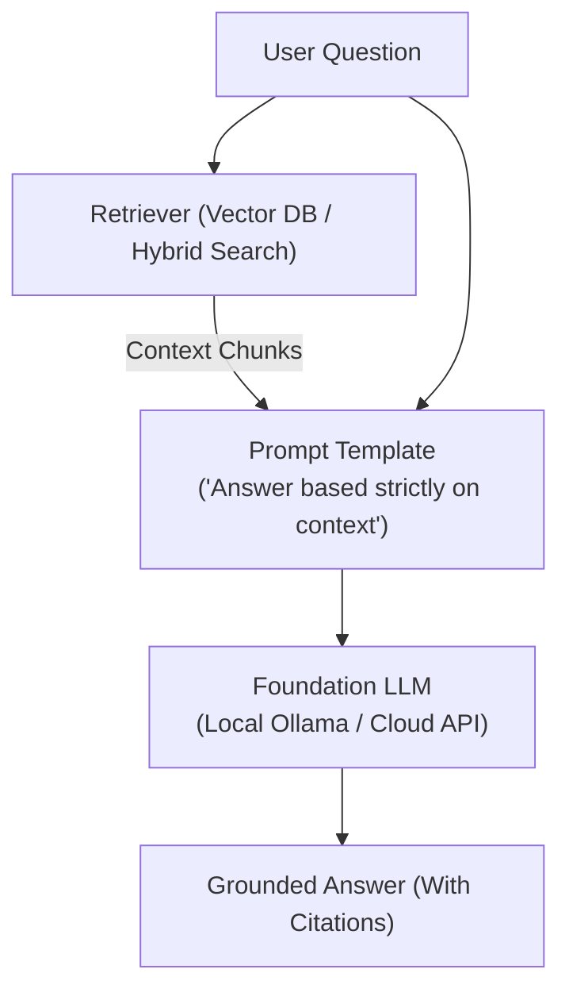

# 📹 5-Getting Started With Agentic RAG With Detailed Implementation Using LangGraph

<div className="video-card" style={{border: '1px solid #30363d', borderRadius: '8px', padding: '16px', marginBottom: '24px', background: 'rgba(56, 139, 253, 0.05)'}}>
  <div style={{display: 'flex', gap: '16px', flexWrap: 'wrap'}}>
    <div><strong>Instructor:</strong> Krish Naik (Krish Naik)</div>
    <div><strong>Duration:</strong> 22m 31s</div>
    <div><strong>Playlist:</strong> Complete RAG Playlist (Krish Naik)</div>
    <div><strong>Watch Link:</strong> <a href="https://www.youtube.com/watch?v=Chl-cRcwVpA" target="_blank" rel="noopener noreferrer">YouTube Lecture ↗</a></div>
  </div>
</div>

## 📌 Executive Summary & Learning Objectives

This lecture covers **5-Getting Started With Agentic RAG With Detailed Implementation Using LangGraph**, focusing on production implementations, edge cases, and industry standards:
- Core intuition, architecture, and underlying mechanisms.
- Key differences between theoretical research implementations and scalable enterprise patterns.
- Concrete Python walkthroughs, error recovery, and performance optimization.

---

## 🏗️ Architecture & Conceptual Workflow



---

## 📖 Core Concepts & Technical Deep Dive

### 1. Architectural Foundations
In modern production AI engineering, **5-Getting Started With Agentic RAG With Detailed Implementation Using LangGraph** is essential for ensuring reliability, low latency, and deterministic outcomes. As AI systems evolve from naive prompt-in / completion-out scripts into distributed systems, engineers must handle:
- **State management & consistency:** Ensuring intermediate states and tool invocations are tracked.
- **Error boundaries & recovery:** Graceful degradation when external LLMs or vector stores encounter rate limits or network partitions.
- **Resource utilization & cost efficiency:** Caching common queries and reducing unnecessary foundation model token expenditure.

### 2. Operational Considerations
- **Latency Optimization:** Pre-computing embeddings, utilizing asynchronous non-blocking event loops, and streaming tokens via Server-Sent Events (SSE).
- **Security & Sandboxing:** Validating inputs before ingestion, sanitizing LLM outputs, and isolating tool execution environments.

---

## 💻 Production Implementation Walkthrough

```python
from langchain_core.prompts import ChatPromptTemplate
from langchain_core.runnables import RunnablePassthrough
from langchain_core.output_parsers import StrOutputParser
from langchain_community.chat_models import ChatOllama

# RAG Prompt with strict grounding
rag_template = """Answer the question based strictly on the provided context:
Context:
{context}

Question: {question}
Answer:"""

prompt = ChatPromptTemplate.from_template(rag_template)
llm = ChatOllama(model="llama3", temperature=0.1)

# Format documents helper
def format_docs(docs):
    return "\n\n".join(doc.page_content for doc in docs)

# Complete RAG Chain
rag_chain = (
    {"context": retriever | format_docs, "question": RunnablePassthrough()}
    | prompt
    | llm
    | StrOutputParser()
)
```

---

## 💡 Production Best Practices & Tips

:::tip Production Deployment Guideline
When deploying 5-Getting Started With Agentic RAG With Detailed Implementation Using LangGraph in enterprise environments, always configure automated retries with exponential backoff and telemetry tracing (such as OpenTelemetry or LangSmith).
:::

:::warning Common Failure Modes
Watch out for state contamination across concurrent requests. Ensure each session or user interaction uses an isolated thread ID or execution context.
:::

---

## 🎯 Key Takeaways & Quick Reference

| Dimension | Production Standard | Pitfall to Avoid |
| :--- | :--- | :--- |
| **Execution** | Async / Non-blocking with timeouts | Synchronous blocking calls in event loops |
| **Data Validation** | Strict Pydantic v2 schemas | Untyped dictionary access |
| **Monitoring** | Distributed tracing & latency percentiles | Relying only on standard console logs |

## ⏱️ Lecture Timeline & Key Topics

| Timestamp | Key Topic / Concept Discussed |
| :--- | :--- |
| **00:00:00** | Hello all, my name is Krishna Nayak and... |
| **00:05:49** | retrieve... |
| **00:11:29** | something right so deciding whether to... |
| **00:17:05** | will also be able to get the answer.... |
| **00:22:28** | Take care. Have a great day. Bye-bye.... |


---

---

## 📜 Complete Lecture Transcript (English)

> **Language:** English | **Source:** `06 - 5-Getting Started With Agentic RAG With Detailed Implementation Using LangGraph.en-orig.srt` | **Total Segments:** 12 | **Word Count:** ~4,284 words

<details>
<summary><b>Click to expand full chronological transcript (12 timestamped intervals)</b></summary>

#### ⏱️ [00:00 ➔ 00:02]

Hello all, my name is Krishna Nayak and welcome to my YouTube channel. So guys, we're going to continue our advanced agentic rag series. In this specific video, we will go ahead and understand what exactly is agentic rag is all about, how it is different from traditional rag. Along with that, we'll also go ahead and do the implementation with Python and langraph and lang. So we'll be going ahead and implementing all these things as we go ahead. Please make sure that whatever videos that I'm trying to upload right now, it is super important in every companies when you really want to develop some amazing rag with specific autonomous agents. This all series of videos will be important based on different different use cases. You may have to require different types of rack. So my suggestion would be that please go ahead and implement along with me. Right? So let's go ahead. But before I go ahead, I really want to quickly announce an important announcement. Since right now we have an amazing festive season of Diwali, all the live class, all the live courses in Krishnak Academy is available with 20% off. You just need to go ahead and use code AI20. So if you see we have lot of live classes which is currently going on from AI for leaders and professionals LLM ops ultimate data science and genai ultimate rag boot camp then we have building agentic AI engine course 2.0 0 this ultimate track boot camp is also starting like it is a new course and it is going to start on November 2nd. So if anybody is basically interested to probably go ahead and join where our team will be taking care of all the live sessions and giving you an amazing experience. You can go ahead and check it out. All the information will be given in the description of this particular video. Now quickly let us go ahead and understand about agentic rag and how it is completely different from a traditional rag. Already in our series of videos we have already learned about traditional rag. I've also uploaded an amazing crash course on traditional rag and I've shown to shown you all

#### ⏱️ [00:02 ➔ 00:04]

everything that you really need to uh understand it over there. Right now let's go ahead and understand with respect to agentic rag there are two main important components. Okay. The first component is rag which is nothing but retrieval augmented generation and the second component is nothing but autonomous agent. Right now this two components is the most core important thing of an agentic rag. So if you really want to go ahead and define agentic rag, it is an advanced AI system architecture where an autonomous agents now this is really important where an autonomous agent makes intelligent dynamic decisions. decisions about the retrieval and generation. Now this is really important to understand this definition is the core behind agentic rag and and its types. Right? So here I've written the main work that you will be able to see is of this autonomous agent. So one core component will be autonomous agent which we regularly create in agentic rag in the form of a workflow and the other component is simply rag right whenever we talk about rag this can be anything it can be an external API it can be an external tool it can be a tool it can be a vector DB right it can be any kind of databases right it can be anything as such so this is nothing but it is an external data source so Here whenever we talk about rag we basically talking about external data source right and here the autonomous agent will basically take all the decision right um about the retrieval so from where we should probably go ahead and take the context right and where how should we

#### ⏱️ [00:04 ➔ 00:06]

give the context to the LLMs right so in short if I probably consider with a traditional rag in a traditional rag what do you have let's say that there's a human over here the human will basically ally give the query right so let's say this is my query over here now this query will what it will happen it'll just go ahead and uh you know let's say that there is some kind of vector databases or any kind of tool let's say this is my vector DB it'll go ahead and probably give this particular query and based on this query and based on the embedding techniques that we have applied in in return we will be getting some kind of context and this context along with the prompt is basically given to to the LLM right and LLM will finally generate the output. So this is what a traditional rag looks like right now how you are basically considering or what difference do you find from a traditional rag and an agentic rag it is very simple right so here traditional rack system it only allows a fixed retrieve and then generate pipeline so it is following this specific fixed pipeline right it has to go in this way there's a query it'll go ahead and go go ahead and probably get the context from the vector DB it is going to probably combine it with the prompt and give it to the lmm finally generate the output So this is how the pipeline will be going ahead. But in case of agentic rag we are using autonomous agents and this autonomous agent is responsible for intelligent and dynamic decision and things right it probably ba uh based on its reasoning capabilities right it will probably make a decision like which tools to call how to call how to get the retrieval and all right so here there are five more important points which I really want to talk about right what does autonomous agent do it basically knows when to retrieve info okay I'll just go ahead and write when to retrieve referral uh retrieve info what to retrieve what to retrieve. Third important thing is that where to

#### ⏱️ [00:06 ➔ 00:08]

retrieve and fourth is how many times to retrieve. Okay. So these are some of the important points right and this all decision is basically taken by what autonomous agents right. So that is why we say that agentic rag is very important and the future right now is all about developing this kind of autonomous agents right for different purpose. So these are the main two important things. Uh now I hope you got an idea about agentic rag how it is different from a traditional rag. Now the next step is that we are going to go ahead and implement this workflow wherein this basically defines an agentic rag workflow. Okay, agentic rag workflow. Now you may be thinking why you're saying this as an agentic rag. Now see this workflow. Okay, and this we are going to implement it with the help of langraph. Okay, because lang graph actually helps you to create an amazing workflow itself. So here whenever a user gives a query we will probably go ahead and go to the first node. This node will be acting like an agent. Okay, this will be my agent one and this agent will be deciding whether we need to go ahead and request the context from the retriever or directly we should generate it. Here the generation is definitely taken from an LLM. Here the retriever will be an external vector DB. It can be a vector store. In our case we will try to uh create a vector store. So it will probably make this particular decision whether we need to go over here whether it need to needs to go over here. Okay. And this is what an autonomous agent is basically doing over here right and based on this it will go ahead and assign that specific task and finally we'll be able to generate it. Amazing example al together. So quickly let's go ahead and implement this. So um I will basically continue uh the same no uh projects that we have actually done for the traditional rag. We had all the notebooks. We have also implemented about modular coding. So you can just go

#### ⏱️ [00:08 ➔ 00:10]

ahead and explore all those things. Uh this is what my agentic rag basically looks like. Here I've created some sections. We will go ahead and start working on this. Now the first thing uh that you actually require is that since we are going to use langraph. So for langraph what we really need to do is that we need to go ahead and install some of the libraries right like langraph and all lang. So here what I'll do so in the my requirement.txt txt I've added couple of libraries called as langun openai and lang graph lang openai the reason is very simple I want to use openai API keys over here because whenever you try to create an agent the decision that the agent actually takes uh it is directly proportional to the better LLM models that we use and right now openai has a very good LLM models if we specifically want to create this kind of applications to be true right so all those things we will be discussing over here Um that's the best part you know. So here once you go ahead and update this requirement.txt all you have to do is that just go ahead and write uv add minus r requirement.txt. You can see that I have already installed all the packages. Okay. Now if I go to the agentic rag ipynb file. So first of all uh this is just a you know title over here. Now the first thing that I'm actually going to do I'll create a code cell here also I'll create some of the code cell. Now first thing that I require is some of the installation of important libraries. Uh so here I'm going to use see uh I've already created a dedicated playlist on lang graph. I think you should be having some prerequisite knowledge of lang graph so that we take up this series in a serious way. Um so first of all you can see that I have imported type list then I have state graph then I'm using chat openai openai embeddings. I'm using this vector store called as fires. Then I have recursive character text splitter. And finally I have a document. Right? So recursive character text splitter is specifically used for splitting text. Uh so if I don't know whether I want to use this or not but definitely let's see in the later stages

#### ⏱️ [00:10 ➔ 00:12]

whenever I see this I will try to use it. Right? Then here you have text splitter. Then you have lang community.vector stores chat openai open ai embeddings we are going to use. Right? So once this is done then the next step will be that we will be loading our environment variables. And as I said, I'm going to go ahead and use my open AI API key. My open AI API key is updated in the ENB file. You should also go ahead and update it, right? So here uh we can quickly go ahead and do this, right? Where we are importing all the libraries. Then finally, I will also go ahead and load my environment variables open AI API key. So I'll write os.environment. And uh here instead of writing os.environment, I'll say get env get env. And here I'm going to go ahead and give my open AI API key. Okay, perfect. So here uh you can see that I'm using uh GPD 3.5. Instead of using this, I can use 4.1. That is good. So here I have I have my LLM. So you can go ahead and check out what is my LLM. So here you can see that I'm used this particular LLM model, right? GPT 4.1 that is the model name that I'm actually going to use. Now the next thing is that we will go ahead and define our state definition. Remember whenever we define any kind of workflows we need to define this particular state definition right now here uh the important state definition can be since we are giving a query so question can be one variable that we need to use then uh you'll be able to see that here we are deciding something right so deciding whether to go to the retriever or generate so here we can create a boolean variable so that we can say that hey if it is probably taking a retriever make that that true otherwise make it as false right so that is the second variable that I really want to use and if it goes to the retriever it is going to take out some of the context information so that I really want to keep in the form of documents okay and uh finally the whatever the output generation is basically happening we'll also store that in some variable so here uh inside my state definition I will define a

#### ⏱️ [00:12 ➔ 00:14]

class called as agent state it is inheriting type dictionary and here you'll be able to see that I'll be using question is equal to str okay okay and uh here you'll be able to See I'm using documents list of documents. Then answer is equal to str and needs retriever as boolean variable. So I have defined all the specific variables over here. Okay. Now uh once this is done let's also create a sample documents. Now I have to go ahead and create some kind of sample documents and vector store. Right? I'll also go ahead and create this. Okay. See creating a documents is very simple. uh you can read it from the PDF file and all. Uh but what I am actually going to do is that I I'll just take some sample text that is generated. So here you can see that I've taken four different text langraph rag vector database agentic AI system. So I've taken some four different sentence and then I will convert this into a documents. So document is really important. All right. Now with respect to document I will go ahead and use my document over here. Okay. And with respect to document I will say hey let's go ahead and use this page content and then this will be text okay and here I can go ahead and iterate it for text in sample text right and then finally let's go ahead and create a vector store right so for creating a vector store it is very simple we will go ahead and use this okay files from this documents and here you See I will just go ahead and name this as documents and here as retriever I'll make it as three. See this is what is my vector store by using fires which we have already discussed. Retriever we're converting this into a retriever and done that's a good one right now I will delete all the cells because it is not required. Okay now I have my retriever I have my state definition.

#### ⏱️ [00:14 ➔ 00:16]

Now it's time that we start defining agentic functions. Now what exactly is agentic function? Now see over here what is the main functionality of the agents right this node may have a different definition this node may have a different definition this node may have a different definition right so we need to go ahead and define all those definition so first of all the first is deciding right whether we need to go to the retrieval or generate right so for that I will create a function now here I'm not going to use any kind of llm we'll use simple plain python code so here you can see I have defined a function called as decide retrieval. The state is given as agent state and over here and we are deciding if we need to retrieve the documents based on the question. So first of all we need to get the question. So obviously we will put the question in the state variable which is coming from the agent state initially right and then I will get this particular question and now here I can replace this code with my LLM also I can give a prompt the LLM should decide whether we need to go to the retrieval or directly we should generate by the LLM. But here what I'm doing is that I I'll show you with very basic conditions how I'm writing this particular function. So here I use retrieval keywords and whenever my question contains this words right like what how explain describe tell me at that point of time I'll make this boolean variable as true needs retrieval that basically if this this exists in my question then definitely we need to go ahead with the retriever right so this needs retrieval will be basically set to true right so that is what we are basically checking over here and we are returning state with this needs retrieval whatever needs retrieval value is which is a boolean one Right. So this is my first function. So here I will just go ahead and execute it. The second function you know it is retrieve documents. Right? Now you know how to retrieve the documents. It is basically from files or retriever. Right? So here I have defined a retrieve documents. State is equal to agent state. Agent state over here. Then question is equal to state of question. Documents is equal to retriever.voke of question. So we are now invoking from

#### ⏱️ [00:16 ➔ 00:18]

this to get the context. So once we have whatever we get the context so it will be stored over here and we are returning this particular value wherein we are updating this documents variable which presents inside which is present inside my agent state right so here you'll be able to see that I will be saving this particular value also okay then let's finally go ahead and generate the answer that will be my third node definition now generating part is very simple here I'll take the question I'll take the documents if there is a document when we are taking the documents right if it nothing is present over here we'll keep it as empty so if documents are there what I will do I will I will create a prompt I'll say based on the following context answer the following question uh answer this each and every information uh over here so here you'll be able to uh uh see that I'm getting the questions I'm able to probably answer this and finally you can see that I'm invoking it with the help of prompt and response content if there is nothing in the documents directly it'll go ahead and set up this particular prompt and it will generate the answer and finally I will also be able to get the answer. There are two important condition guys. Very clear, very simple, very easy. If there is a document present, we will set up the context. We will set up the prompt and finally we will uh in the else condition you know if it does not present we'll set just set up a prompt and we'll say llm to invoke it and we'll get the content content and that content is nothing but your answer. So three important function I have actually defined it. Okay. Now comes like how should we generate the conditional logic. Now see why is conditional logic required. See after this particular node there are two arrows either this or this right I know decide function is what it is basically setting up that needs retriever is equal to true or false but it also needs to make sure to traverse either should go to the retrieve or generate. So now what we'll do we'll put this as conditional logic. Whenever we say conditional logic uh when does that basically happen? whenever there is a two path from a simple node. Okay, so

#### ⏱️ [00:18 ➔ 00:20]

here there is a two path. So I will go ahead and define my conditional u and this function I will define it as should retrieve. Now here I'm just saying if state of needs retrieval then go to retrieve node otherwise go to generate node. Okay, very simple and I'll go ahead and execute this. Now finally we will go ahead and build the graph. Now building the graph is very simple. Okay. And uh first of all I need to go ahead and write how many nodes we have. So I have decide node, retrieve node and generate node. Okay. For so for decide you will be able to see that I have something called as retrieve documents over here. Then I have generate answer. This all function has been defined. Now how the nodes are basically connected. So for this first of all I will go ahead and set an entry point. Okay. Now entry point basically means from start to decide. See over here the first path is start to decide. Then from decide you have either retrieve or generate. Okay. So here whenever we say retrieve or generate here we'll add a conditional logic. Okay. Now for adding a conditional logic it is very simple. We will set up the next thing conditional logic. Here I'm writing workflow. Add conditional ages decide. Okay. From decide node we will call this function should retrieve. Now what is shoot retrieve doing? It'll check whether the needs retrieval is there. It'll return retrieve. Otherwise it will generate. Okay. So here we are returning retrieve or generate for this retrieve which node to probably connect it. So from retrieve we have to connect to this particular node which will indirectly call this particular function. And from generate we are going to call this particular node and the mapping will be for generate answer. Right? So that is what is my conditional edges. Now after the conditional edges one more very important thing is that from retrieve I need to go to generate and then end. From decide it is going to generate only and then from generate to end. Okay. So that path also we need to go ahead and add it up. So here I'm going to go ahead and add the edges. Here you can see retrieve to generate, generate to end. And finally I'm

#### ⏱️ [00:20 ➔ 00:22]

compiling the graph. Okay. And now let's see the graph whether it is coming or not. See start decide conditional logic is there. Retrieve generate. And finally you'll be able to see that it is in the end. Now finally we should be able to go ahead and run this particular workflow and test it out. Okay. So let's test the agentic system. Now I hope you have understood it what exactly we are doing. So for testing it here I'm going to go ahead and define a definition. Ask question right. So here we'll give the question. This question will be set up in the initial state on this particular variable. Question is equal to question and documents answer need retrieval is false. Then we are going to invoke by this particular app which is my workflow. Right? And it's just going to go through this and generate me an output. Right? Return result. So now let's quickly go ahead and do this. And now let's test a question. What is langraph? I know it is basically available in the retriever. And I'll just go ahead and print this. So result one should be giving me question, answer, documents, all the things. So question is over here. What is langraph? Now documents is over here. You can see that I'm getting all this from the retriever. And this is my answer. Lang graph is a library and needs retriever is true. That basically means obviously it is hitting the retriever right now for this if I really want to display it in a much more better way I will try to show you to uh one with one more question. So let's test with another one. How does rag work? I'm using this answer question and then we are seeing question how many retrieved documents are there? What is the result? Each and every information and here you can clearly see it'll just take some time for displaying things. Okay. uh let's wait and should be able to display my the answer. I think uh my open AI API key is okay it works. So how does rag work? So here you can see that I'm getting all the four documents and finally I'm able to generate the output right see all these answers retrieve

#### ⏱️ [00:22 ➔ 00:22]

documents are four and all the values are there. So I hope uh we are really good to get started with agentic rag right now. You just go ahead and create your own workflow where you have some kind of deciding agent which will be acting as an autonomous agent out there and making the specific decisions. Right? So we will keep a like target of thousand guys. Uh it takes a lot of effort to make all these particular videos. I definitely want your support. Uh yeah this was it from my side. I'll see you in the next video. Thank you. Take care. Have a great day. Bye-bye.

</details>
