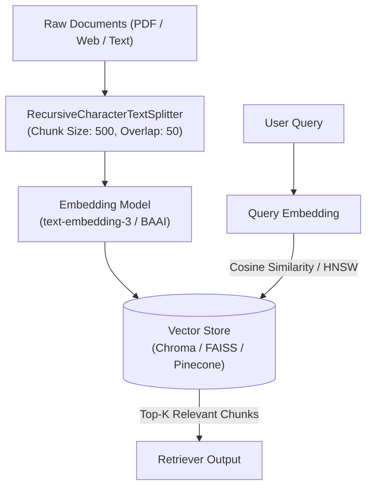

# 📹 Build Advanced Retrieval-Augmented Generation (RAG) with MongoDB Vector Search

<div className="video-card" style={{border: '1px solid #30363d', borderRadius: '8px', padding: '16px', marginBottom: '24px', background: 'rgba(56, 139, 253, 0.05)'}}>
  <div style={{display: 'flex', gap: '16px', flexWrap: 'wrap'}}>
    <div><strong>Instructor:</strong> Krish Naik (Krish Naik)</div>
    <div><strong>Duration:</strong> 33m 56s</div>
    <div><strong>Playlist:</strong> Complete RAG Playlist (Krish Naik)</div>
    <div><strong>Watch Link:</strong> <a href="https://www.youtube.com/watch?v=FepDo-0DrSo" target="_blank" rel="noopener noreferrer">YouTube Lecture ↗</a></div>
  </div>
</div>

## 📌 Executive Summary & Learning Objectives

This lecture covers **Build Advanced Retrieval-Augmented Generation (RAG) with MongoDB Vector Search**, focusing on production implementations, edge cases, and industry standards:
- Core intuition, architecture, and underlying mechanisms.
- Key differences between theoretical research implementations and scalable enterprise patterns.
- Concrete Python walkthroughs, error recovery, and performance optimization.

---

## 🏗️ Architecture & Conceptual Workflow



---

## 📖 Core Concepts & Technical Deep Dive

### 1. Architectural Foundations
In modern production AI engineering, **Build Advanced Retrieval-Augmented Generation (RAG) with MongoDB Vector Search** is essential for ensuring reliability, low latency, and deterministic outcomes. As AI systems evolve from naive prompt-in / completion-out scripts into distributed systems, engineers must handle:
- **State management & consistency:** Ensuring intermediate states and tool invocations are tracked.
- **Error boundaries & recovery:** Graceful degradation when external LLMs or vector stores encounter rate limits or network partitions.
- **Resource utilization & cost efficiency:** Caching common queries and reducing unnecessary foundation model token expenditure.

### 2. Operational Considerations
- **Latency Optimization:** Pre-computing embeddings, utilizing asynchronous non-blocking event loops, and streaming tokens via Server-Sent Events (SSE).
- **Security & Sandboxing:** Validating inputs before ingestion, sanitizing LLM outputs, and isolating tool execution environments.

---

## 💻 Production Implementation Walkthrough

```python
from langchain_community.vectorstores import Chroma
from langchain_community.embeddings import OllamaEmbeddings
from langchain_core.documents import Document

# 1. Initialize Local Embeddings
embeddings = OllamaEmbeddings(model="nomic-embed-text")

# 2. Sample Documents
docs = [
    Document(page_content="LangChain LCEL provides unified streaming and batch interfaces.", metadata={"source": "lcel.md"}),
    Document(page_content="ChromaDB is a lightweight embedded vector database for fast retrieval.", metadata={"source": "chroma.md"}),
]

# 3. Ingest into Chroma Vector Store
vectorstore = Chroma.from_documents(docs, embedding=embeddings)

# 4. Similarity Search with Relevance Score
results = vectorstore.similarity_search_with_score("How does ChromaDB work?", k=1)
for doc, score in results:
    print(f"Content: {doc.page_content} | Score: {score:.4f}")
```

---

## 💡 Production Best Practices & Tips

:::tip Production Deployment Guideline
When deploying Build Advanced Retrieval-Augmented Generation (RAG) with MongoDB Vector Search in enterprise environments, always configure automated retries with exponential backoff and telemetry tracing (such as OpenTelemetry or LangSmith).
:::

:::warning Common Failure Modes
Watch out for state contamination across concurrent requests. Ensure each session or user interaction uses an isolated thread ID or execution context.
:::

---

## 🎯 Key Takeaways & Quick Reference

| Dimension | Production Standard | Pitfall to Avoid |
| :--- | :--- | :--- |
| **Execution** | Async / Non-blocking with timeouts | Synchronous blocking calls in event loops |
| **Data Validation** | Strict Pydantic v2 schemas | Untyped dictionary access |
| **Monitoring** | Distributed tracing & latency percentiles | Relying only on standard console logs |

## ⏱️ Lecture Timeline & Key Topics

| Timestamp | Key Topic / Concept Discussed |
| :--- | :--- |
| **00:00:00** | Hello all, my name is Kash Nayak and... |
| **00:08:08** | you know uh OpenAI, Py is... |
| **00:16:38** | blog for MongoDB. Okay, it has some kind... |
| **00:25:31** | execute this, you'll be able to see that... |
| **00:33:54** | Take and bye-bye.... |


---

---

## 📜 Complete Lecture Transcript (English)

> **Language:** English | **Source:** `07 - Build Advanced Retrieval-Augmented Generation (RAG) with MongoDB Vector Search.en-orig.srt` | **Total Segments:** 17 | **Word Count:** ~6,187 words

<details>
<summary><b>Click to expand full chronological transcript (17 timestamped intervals)</b></summary>

#### ⏱️ [00:00 ➔ 00:02]

Hello all, my name is Kash Nayak and welcome to my YouTube channel. So guys, today in this particular video, we are going to build a rag application with the help of MongoDB vector search and uh whenever we talk about rag, it is nothing but retrieval augmented generation. We'll try to see how we can use MongoDB vector search database and step by step how we can actually create uh the entire rag application. We'll also be discussing about the entire architecture. Now before I proceed with this particular video, I'd like to thank MongoDB for sponsoring this particular video. So now let's go ahead and start it creating a account in MongoDB. So first of all, you need to go ahead and uh go to this URL www.mongodb.com and then you can go ahead and sign in or you can also go ahead and click on get started. So if you have not if you do not have an account, go ahead and sign up. I will go ahead and use my Google account. So let's go ahead and use my Google account. So I will just go ahead and use my uh any email id. So let's say one of the email ID that I want to use is uh my official email ID. You can use anything as you like. Uh it will ask me to verify it. Okay, no worries. I will just go ahead and verify it and I will use the code. So now uh the next step will be that once I go ahead and sign up uh this will be the account it'll look like and uh here you'll be able to see that we are going inside our account. As soon as you go ahead you know you'll be able to see some kind of organization details and project default project over here. Now let me go ahead and show you a brief architecture about uh what kind of project we are actually going to build. So first of all you'll be able to see that we are planning to create a rag application and this will be the architecture that we will be using. So in rag the most important components there are specifically three most important components. One is injection retrieval and generation. In the injection from a specific data source we

#### ⏱️ [00:02 ➔ 00:04]

will be using some kind of embedding models. It can be different different embedding models. It can be openi google jamin whatever you want. And then after using this embedding models, so we will go ahead and create the vector embeddings and store it into the MongoDB cluster. Okay. So this MongoDB cluster uh will be where all your vector embeddings will be stored. Okay. And then whenever we go ahead and give any kind of questions, we will try to retrieve the vectors from the MongoDB cluster. Okay. We'll do the vector search based on some semantic search itself. And here you can also see for this particular question also we will go ahead and apply some kind of embedding model like what embedding model we are using in order to store it in the MongoDB cluster. Then we are going to do the vector DB search over here. Once we get the relevant documents we will combine the question along with the prompt and give it to our large language model to generate the response. Okay. So this is the overall architecture and if you are probably following my entire rack playlist, we have done this. We have discussed about this kind of architecture. But here our main focus is that how we can go ahead and use MongoDB vector search which will be important for people who are specifically working in industries because MongoDB is one of the most popular databases that is being used for creating rag application. Okay. Now once we have this now here you'll be able to see in the database you have clusters you have search and vector search. So I'll just go ahead and click on search and vector search and I'll start creating the cluster. So uh I will go ahead and click on create the cluster. I will give the cluster name. You cannot change the cluster name once the cluster is created. It's okay. Um whatever cluster you specifically want, you can go ahead and give it over here. Right? Let's say that I want to give uh rag is my cluster name. You can select AWS, Google Cloud, Azure. You can select the region wherever you want. And I will go ahead and click on create uh deployment. Okay. And here also you have uh three different options when you are deploying a cluster. Okay. one is M10 which the charges are somewhere around

#### ⏱️ [00:04 ➔ 00:06]

08 per hour. Um here you'll be able to get a RAM of 2GB storage of 10 GB and two uh CPUs you'll be getting two vCPUs. You also have flex uh one more plan. I will go ahead and show you with the help of free because the project that we are going to build uh will be more than sufficient with the help of this. Okay. Now I'll go ahead and click on create deployment. Okay. So uh this deployment uh will start happening. Okay. And here you can see that we can also go ahead and create our uh users right username we can create password we can create a database user and all okay so first of all what I will do I will just go ahead and create a database user okay so it'll say say that set up a connection security I will choose a connection method uh you can select any of this drivers you if you want Python you can go ahead and select on Python okay and this is what it is you know so here you can see along with my username and password default password that we have used. We have got this entire URL, right? I can copy this. I can keep it in my notepad. Okay, because I will be using this connection string. Okay, so I will copy and paste it over here. You also have to do the same thing. If you really want to you see that how we can use it in a uh code, you can also go ahead and click this. And this is how it'll look like you know where we are using this MongoDB contact DB users this is my password all these things and the app name is rag right which is my cluster name okay and before I go ahead you know you have to make sure that you have to also install pyongo okay and this I will show you step by step how you can go ahead and start okay so I have this uh good enough okay I I've also saved my entire uh URL which I will be using I'll also save this code uh and I'll keep it over here so that we can just check whether my connection is working absolutely fine or not. You can also keep this is somewhere uh in your node no you know node++ or

#### ⏱️ [00:06 ➔ 00:08]

not. Now I'll click on done. Okay. And now let's go ahead and see this search vector database. Okay. So this is loading this is getting created now. Until then uh since this will get uh this will get created. So I have my clusters and here you can see this rag is basically getting built. Okay. Now till this is getting created what I will do is that by default also it will go ahead and use some kind of data. Okay. We'll also see that what data it will try to create uh like what collection it will try to create. I think by default some collection will be getting created once you go ahead and create a uh cluster with the help of search and vector search. Okay. Now I will go back to my code editor and I will start my project here. Okay. So the first thing what I will do I will go ahead and open my terminal. I'm using Google anti-gravity ID. Uh it's an amazing ID to work with. So I will go ahead and open my command prompt. Now first thing I will go ahead and uh initialize this as a new project workspace. So I will go ahead and write UV in it. I'm going to use UV. Okay, UV is a very good package manager. And uh I'm initializing this entire project workspace. And then I will go ahead and create my environment. UV venv. Okay, so once I create my virtual environment, I have already created it with the help of Python 3.132. I will activate it. And now I will go ahead and uh you know create my uh libraries or you I'll just go ahead and install all the libraries that I specifically want. Okay. So let me go ahead and do that. So first of all what I'm actually going to do I'll go ahead and you know create a requirement.txt file requirements.txt file. Now inside this requirement.txt file I will start using some of the requirements that I really want. Okay. So first of all I'm going to use py since we are going to use py in order to create or communicate with

#### ⏱️ [00:08 ➔ 00:10]

our vector database uh that is available in the Okay, then I'm going to use OpenAI. Okay, and along with this uh you know uh OpenAI, Py is more than sufficient to go ahead with. Uh but as we require more and more libraries, um let's do one thing, you know, I will also go ahead and use langin lang chain uh because lang chain we'll be specifically using in order to build our application like the data injection part and then we also going to use lang community. Okay. uh we will also go ahead and write pi pdf and then we'll also go ahead and use langin- open here. So uh we going to use all the specific libraries uh uh for this and now I will go ahead and write uv minus r requirement.txt. Please make sure to do all this installation within your virtual environment that you have created. Okay. So here you can see some warnings you'll get. It's okay. But all my packages has been installed. Okay. One more thing that I need to install is UV add ipi kernel so that I can work with my Jupyter notebook. Okay. So I will go ahead and create another file called as rag do ipynb ipynb and then I will go ahead and select my kernel. Okay. So it'll be installing the Jupyter not node uh extension that is basically required. I think I'm doing it for the first time in this anti-gravity. So I'm getting all these things. Okay. So once it this gets installed, I can go ahead and select my kernel. So I will go ahead and select my Python 3.13. Okay. Perfect. Now let's run some code and see whether it is working fine or not. So connecting to this particular kernel and I think it should get executed. Yeah, perfect. So we are good. Uh I will just go ahead and minimize this. And this is where we are going to go ahead and write our entire uh rag code. Inside this rag

#### ⏱️ [00:10 ➔ 00:12]

with MongoDB here we are going to go ahead and implement our data injection retrieval and generation pipeline. Okay, generation pipeline. So we'll go ahead step by step. But before that let's see whether this is got say it is loading your sample data set. see some some by default some data is basically there and if you just go ahead and click on browse collection here you'll be able to retrieve the list of collections so there are some some uh you know like comments theaters so these all collections has been already created okay and you'll be able to see this comments is also there sample emplex uh a collection is basically getting created over here I think it has some information regarding some actors and all so this is the movie flex uh data set which is already provided by MongoDB. Okay, we will try to use this anyhow but no worries. I'll go back to my clusters and see that it is still loading. So it it is going to take some time to load. I think by default some of the data set is already there and is loading those. Okay. Uh but now what I will do I will start uh creating my own data set and also I want to go ahead and load it into the cluster or inside this particular collection. Okay. Now what I will do? I will go back to my code editor. So first of all uh let's start with my data injection. Okay. Now for data injection first of all I'm going to import OS. Okay. And uh I will go ahead and you know initialize my OpenAI API key. Okay. And OpenAI API key I will just go ahead and use this over here. Okay. So this is my OpenAI API key which I'm initializing it setting it into my environment. So let me just go ahead and execute this. I think these all things are not required. So uh here I will be getting lot of suggestion from the ID but I really want to develop application which is agent assisted. Okay. Then uh the next step will be that

#### ⏱️ [00:12 ➔ 00:14]

uh if you see this specific architecture right I need to go ahead and use some kind of embedding model. there should be a data source and I should try to uh you know apply this data processing or chunking with the embedding model and store it into the MongoDB cluster. Okay. And here what I will actually do I will go ahead and write from open AI import open AI. Okay. We will initialize the client initialize the client. Okay. Client is equal to open AI. Okay. Here uh I will not go ahead and specifically give any kind of API case because we have already initialized it uh on the top. Okay. Here we are going to specify the my embedding model. So let's go ahead and specify the embedding model that we are going to use from OpenAI. The model name will be nothing but text embedding embedding and here we are going to use three large. Okay. We going to specifically use this particular model. Okay. So this is the model that we are going to basically use for text embedding. You can also use large, you can use small, whatever things you like. Okay? Then I'm going to go ahead and define the function to generate embeddings because we need to define a function to generate the embeddings. Right? So let's go ahead and create a function called as get embedding. And here I am going to give two important information. and one is text and I will say hey input type we are actually trying to give a document okay whenever a document is basically given uh you can go ahead and you know do some kind of embeddings inside this so I will go ahead and create my response response now the thing is that I need to apply this embedding right so I'll say client do embedding dotcreate and here I'm going to specify typically use what model whatever model we have

#### ⏱️ [00:14 ➔ 00:16]

initialized on the top right model comma input is equal to text right so here you can clearly see that what we have created this particular function whenever we call this function we are giving the text and we are going to use this particular model and perform the embedding for this particular text right perform this embedding and then once the embedding is done we just go ahead and return response dot data of zero of embedding so whatever embedding is basically creat created. We're going to go ahead and return this. Okay. So once this is getting executed now see once I call the function once I call this particular function what will happen? So I will go ahead and call this get embedding. Get embedding and let's say that I give the text called as rag technology. Now if you want to go ahead and see the embedding for this particular text um open object openi object has no attribute embeddings. Let's see where is the Oh, it should be embeddings. Okay. Okay. No worries. It should be embeddings. Okay. So now once I give rack technology automatically this function is going to give the embedding for this particular line. Okay. So here you can see that it is giving the entire embedding for this particular line for this sentence and will be of some specific size. Uh if you want to go ahead and just see the size. So let's say if I go ahead and write embed and if I write length of embed it is going to basically show you that what is the size of this. Okay. So it is around 3072. So whenever we go ahead and use this particular model text embedding three large it is going to give you a response of 3072 length. Okay. So once this is done uh we go ahead now u you know we have created our embedding. So if you see from this particular graph we know that we have our embedding model our embedding function which is uh which can take uh take any text and create a vector embeddings of data. Okay. Now the next thing that I really want to do is

#### ⏱️ [00:16 ➔ 00:18]

that I will go ahead and create I'll take some kind of data source. I will do some processing and chunking and then store it in use that same embedding model and store it into the MongoDB cluster. Okay. So now here we are going to go ahead with our data injection. Now for the data injection it is very simple. We are going to use langchain community dot document loaders. Okay, I'll use pi pdfdf loader and then I'm also going to use recursive character text splitter for doing the data prep-processing and chunking. Now let's go ahead and load the PDF and for loading the PDF you know I will just take one of the blog like this is the blog for MongoDB. Okay, it has some kind of PDFs. Okay, and I'm writing data is equal to loader.load. We are loading this and then we'll apply and split this data. So we can split this data into chunks. Just a second I will go ahead and write split the data into chunks. And for splitting it what we can do is that we can go ahead and apply text splitter which is nothing but recursive character text splitter of 400 size and then we are basically going to split that documents. Okay. So once I execute this you will be able to see that these will be my documents. Okay. So here I'm getting no module name textsplitter. Okay no worries. Uh let's see uh textsplitter instead of uh writing like this from langunin.extsplitter I think the recent version has got changed over here. I'll go ahead and write langunin textplitters. Okay. And I'll go ahead and execute it. So once I do this and if I go ahead and see the documents, you should be able to see all the documents from this particular uh URL. Okay. And if you want to see this URL also, you can go ahead and just open it over here. Right. So this is my PDF and we have we are basically going to create a kind of chatbot for this particular PDF. Okay. In short, so this is done. Uh we're good

#### ⏱️ [00:18 ➔ 00:20]

enough. Uh I have my documents. Now uh the next thing is that the data injection part is done. Now I have to take all the specific documents and convert this into embeddings. So I will write prepare documents for insertion docs to insert. Okay. And I will just go ahead and write this one. I'll say hey uh what should be my text and how I'm basically going to convert it. Okay. So for this I will go ahead and use this one text is equal to doc.page contain and I'm using um get embedding and taking the page content in order to convert it into an embeddings. Okay. So once I do this you should know that what should be my docs basically to uh you know to insert it into the MongoDB right so this will basically get applied to all these particular documents and it'll go ahead and create a embeddings now I can also go ahead and search for what is this docs_2_insert I think it's going to take some amount of time because there are so many different documents over here I think it'll take around 30 seconds I guess 30 to 40 seconds but let's see okay so uh we are in this stage where uh we are applying this embedding model to the entire data source which we have actually done the processing and chunking once it creates the vector embedding for the data then we will go ahead and first of all create a connection to our MongoDB cluster and then store or push all these embeddings into the MongoDB cluster so still it is taking time it is going to take time because this is a huge data it is not just a small data Uh obviously this needs to be having many many records. Okay. And uh this is basically happening. Let's wait. Yeah. Done. Now if I go ahead and click on docs to insert, you'll be able to see that this is my first uh document text. And these are

#### ⏱️ [00:20 ➔ 00:22]

the embeddings like this you have for every document. Okay. Now it's time that we have all our embeddings. Now we need to push it into the MongoDB cluster. uh according to this particular diagram that pushing into the MongoDB cluster before that we need to make this specific connection. So for making this connection uh first of all I will go ahead and import from pi pi import client and then I will connect to your mongodb deployment whatever deployment that we have done and for this we are going to go ahead and create a client and I'm just going to go ahead and write this now see this information from where it will come if you remember we have already stored this information over here right from username, password, everything. So I will paste it over here. Okay. So I have all my information. This is my username. This is my password. Don't use mine. Instead you create your own and use it. Okay. And then I'm going to go ahead and write collection is equal to client. Okay. Client of let's see what is the client name browse collection. Okay, see so many different things are there over here. Okay, rag dbs. So all everything is over here. Collections. So uh I can use any of the specific collections, right? What collection you definitely want uh based on that. Okay. Or you can also go ahead and create your own collection. It is up to you. So I will uh see at the end of the day all these simple collections are available inside this sample_mflix. So what I will do I will go ahead and write over here sample flex okay sample flex and inside this sorry it should be mflex and inside this I will go ahead and create my own collection name that is nothing but rag

#### ⏱️ [00:22 ➔ 00:24]

okay something like rag rag rag uh rag pdf okay something like this so this will be my collection and then finally I will insert document into the collection. Now in order to insert it, I will write result is equal to whatever collection is there dot insert many. There is something called as insert many and whatever docs we have actually created over here docs to insert we will do this and finally you should be able to see what is the result. So let's see whether this will work fine or not. But this should create a new collection inside my So here you can see uh if I just refresh it or do I have option to refresh it? So here you can see uh somewhere rack PDF is there and this is the documents that you can actually see right. So I have shown you how to probably also by default it is providing you but here also you'll be able to see that all the information is there. So here you can see that uh see one of what all the records is over here right and if you go and click on next so you'll be also able to see the other records along with the embeddings. So everything is inserted you can check out all the other records just by clicking on next next and there are around 88 records uh that are available. Okay. Now the next step will be that uh since we have actually created this see we have completed this we have stored everything into our MongoDB cluster. Okay. But now thing is that whenever we have some kind of questions right how we should proceed with this and how should we query from the MongoDB cluster that is the thing that we need to look upon on and for this uh in MongoDB uh you have something like you need to go ahead and create your search index. Okay. Now how to go ahead and create a search index so that you will be able to query

#### ⏱️ [00:24 ➔ 00:26]

anything uh from this particular vector DB that I will be showing you. Okay. So now I will go back to my code and I'll start writing for quering with search index. Okay. Now first of all uh let me go ahead and uh create a simple search index for you so that you'll be able to understand how the search index work. So first of all I will go ahead and import from my pyongo dot operations import search index model uh search index model. Okay and then we're also going to go ahead and import time. Now in order to create the search index we will be requiring some information like what is my index name? What so here we'll be seeing that I have written the index name as word uh vector index. Then we going to use this search index model wherein we provide the type is equal to vector. Number of dimension is very important. This number of dimension should match with your embedding model. Right? So my embedding model is giving me 3072. So it should be making sure to match with this. The path will be embedding and similarity that it is going to apply is cosine similarity. So these will be the key names. Name is equal to index name and type is equal to vector search. and we go ahead and create this search index by using this particular collection. So we use collection.tcreate search index model is equal to search index model. So once I execute this, you'll be able to see that here uh if I just go ahead and see for search indexes. Okay, you'll be able to see that I have created this vector index. Okay, so this vector index has been created and here you can see that it is still in pending. Okay. Uh is pending and non-query queryable. You can't queries on because the index is pending. This means the atlas has not yet started building the except please wait until the index build is completed. So this will take some amount of time so

#### ⏱️ [00:26 ➔ 00:28]

that uh you'll be able to query it. So it is very simple. What is the main idea is that if you really want to do any kind of search on this kind of collections, you'll be seeing that you need to go ahead and create some kind of search indexes. Okay, I have all my data over here. There is something called as indexes over here. Okay, uh from this particular indexes, you will be able to do the search. But more extreme good searches you'll be able to see inside the search indexes. Okay. So now here you can see 88 documents hundreds indexed of 88. So this indexing is basically done. Now if I go back over here and uh now first of all what we'll do we will go ahead and test this code right. this code that we have used send a ping to confirm a successful connection with the MongoDB. Okay. So now I will just go ahead and copy that entire code and paste it over here. See so I'm I'm just writing polling to check if the index is ready. This may take up to a minute. If predictable is known predicted llama index is equal to index.get queryable is true or not. So if my index is ready here you can see my vector index is ready for querying. It is giving me that specific information. Right? Now it's time that first of all I need to probably run this entire cycle right from question to embedding to vector search. This vector search will basically happen in the vector search index that we have created. So first of all what I will do I will go ahead and write query embedding. Let's say that I search for something which is like get embedding. Let's say I go ahead and search for AI technology. Okay. So first of all what we need to do as soon as I give if my question is AI technology that question needs to go to the embedding model. Now this is this function is making sure that it gives you the embedding right. So once I go ahead and do the embedding for this particular question let's go ahead and see my embeddings quickly. Query embeddings. So here you'll be able to see that for this particular query or question. This is how the embedding

#### ⏱️ [00:28 ➔ 00:30]

looks like. Now the next step is that I need to go ahead and take that embeddings and do a vector search from the search index. Right. So that will be basically be my next step. And for doing that you know I will just go ahead and use this collection. Okay. Dot collection dot uh let's see what is that particular information my uh my I will just go ahead and see my rag. Just a second. I will just go ahead. I I just want to check out what is my collection name. Okay. So it should be rack PDF. Okay. So rack PDF I will open this. I'll write rag PDF dot aggregate. Uh and then with respect to this vector index path embedding query embeddings number of candidates is 3072 and limited. So once I execute this here you can see query embedding is not defined. Why it is not defined? Okay it is query embeddings sorry spelling. Okay. So here I will go ahead and execute it. So here you can see that quickly I'm able to see the result. Okay. Now in order to see the entire uh so that basically means this query is working right. Whenever we do the query for the vector search index uh uh that is nothing but my vector index I'm able to see some kind of response. Okay. But it is always good that I get a detailed response right. So what I will do I will create a function and this function will actually run vector search queries. So here you can see get embeddings function is there input type query this one uh print query embeddings vector search same thing then whenever I get a result uh or like this also we can do okay so let's say that this results that I get okay so I will save it over here inside my results variable and then I will go ahead and just you know I will go ahead and probably use a for loop I'll say for

#### ⏱️ [00:30 ➔ 00:32]

doc in results results and then I will just go ahead and print the doc. So let's see uh right now if I go ahead and just see the results whether we are getting anything or not. Let's see. Okay, some information we are getting. So what I can also do is that I will just go ahead and write like this array of results. So all the information I'll try to store it in my list. Okay. So now if I go ahead and execute this and if I go ahead and search for array of results you should see that I'm getting an empty response right. So here you can actually see that guys uh we have completed this entire thing right from question to embedding models to vector search. But right now nothing relevant to the question was able to we were able to find out right we were not able to find out. Now let's do one thing. Let's change my query. Okay. Now before I do the changing for the query, whatever functionalities I have written in the top, I will just convert that into a function. So these all functionalities that I have written, I'll convert that into a function. So here you'll be able to see that I have defined a function to run vector search queries. Uh this is what is my function name. I'm doing the embeddings doing creating this entire pipeline to do the search. And then you here you can see I'm writing collection.ggregate of pipeline. I'm printing the results. Okay. So this uh will be my entire uh you know function. Okay, whatever function that we have created. And now I will go ahead and search for the function with a sample query. Let's say the mongod vector search is there. I'll go ahead and search it. And now here you can see this is my embeddings and this is the text that we are able to see the response. Okay. So this is amazing. Right now you can see that this entire pipeline has got completed and we are able to do get this relevant documents right and these are my relevant

#### ⏱️ [00:32 ➔ 00:33]

documents with respect to the text and it is matching the vector DB uh MongoD vector DB right by using this vector DB search. Now once we have done this now final is basically to integrate with my LLM the final integration of this once I get the relevant documents apply it with the prompt give it to the large language model and for this I can use open AI and this we have discussed many number of times in my videos so let's say that this is my query by using get query results I will get my context doc I will join all these things I'll use a prompt I'll initialize openAI client use my model name and then we'll use chat.comp completion.create and finally get the output. So here you can see that I'm actually able to get the output from the lm my final output. So here you can see I've asked what are MongoDB's latest AI announcement and here you can see MongoDB's latest AI announcement includes the launch of MongoDB AI application everything is over here. Now you can keep on changing the queries uh you can do anything that you want okay and uh you can keep on working on this but at the end of the day the most important thing is that we followed this entire pipeline. The last generation pipeline was very simple. So let me also make a note over here so that you understand when the generation pipeline is basically coming up. So this is my generation pipeline. Okay. And here we have used openAI models. Right? This is my second retrieval pipeline and the data injection pipeline also we have seen. So I hope you like this particular video. Uh in short we have covered the complete end to end uh rag application with the help of MongoDB vector search. This is important. MongoDB is one of the popular database that is being used by many many companies and can be definitely beneficial for you. So I hope you like this particular video. This was it for my side. I'll see you in the next video. Have a great day. Thank you and all. Take and bye-bye.

</details>
