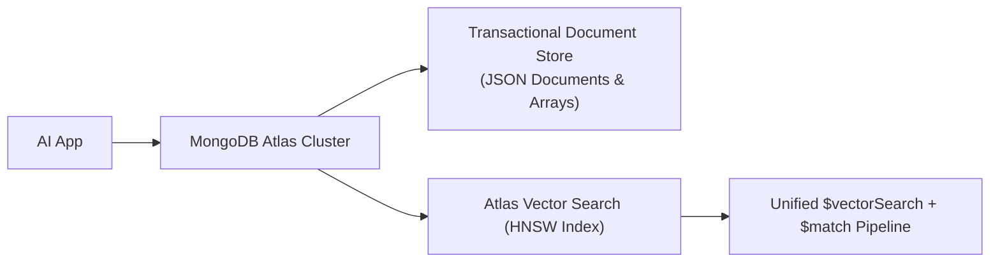

# 📹 Build Advanced Retrieval-Augmented Generation (RAG) with MongoDB Vector Search

<div className="video-card" style={{border: '1px solid #30363d', borderRadius: '8px', padding: '16px', marginBottom: '24px', background: 'rgba(56, 139, 253, 0.05)'}}>
  <div style={{display: 'flex', gap: '16px', flexWrap: 'wrap'}}>
    <div><strong>Instructor:</strong> Krish Naik</div>
    <div><strong>Duration:</strong> 2036</div>
    <div><strong>Course:</strong> Module 3: Advanced RAG & Memory</div>
    <div><strong>Watch Link:</strong> <a href="https://www.youtube.com/watch?v=FepDo-0DrSo" target="_blank" rel="noopener noreferrer">YouTube Lecture ↗</a></div>
  </div>
</div>

## 📌 Executive Summary

MongoDB Atlas Vector Search allows enterprises to combine operational transactional data with semantic vector indexing within the same database engine, eliminating the operational complexity of maintaining dual data stores.

This lesson explores creating Atlas vector search indexes, hierarchical document structuring, MQL (MongoDB Query Language) pipeline filtering, and building LangChain RAG apps backed by MongoDB.

---

## 🏗️ System Architecture & Execution Flow



---

## 📖 Core Concepts & Technical Deep Dive

### 1. Eliminating Dual-Store Architecture
Traditionally, organizations maintain MongoDB for operational user data and a separate vector database for embeddings. Atlas Vector Search unifies both: embeddings live directly inside existing BSON documents.

### 2. Aggregation Pipeline Integration
Vector queries execute via standard MongoDB aggregation pipelines using the `$vectorSearch` stage, allowing seamless chaining with `$match`, `$project`, and `$lookup` operations.

---

## 💻 Production Implementation

```python
from langchain_community.vectorstores import MongoDBAtlasVectorSearch
from langchain_community.embeddings import OllamaEmbeddings

# Blueprint for MongoDB Atlas Vector Search
embeddings = OllamaEmbeddings(model="nomic-embed-text")

print("MongoDB Atlas Vector Search adapter configured.")
print("Supports unified $vectorSearch aggregation pipelines with pre-filtering.")
```

---

## ⚙️ Production Gotchas & Best Practices

:::tip Pre-Filtering in $vectorSearch
Always include metadata filters inside the `$vectorSearch` stage rather than in a subsequent `$match` stage. Pre-filtering dramatically reduces candidate vectors before calculating Euclidean distances.
:::

:::warning Index Synchronization
Vector indexes in Atlas are built asynchronously in the background. Allow indexing to reach 100% completion before executing production query traffic.
:::

---

## 📊 Architectural Reference & Comparison

| Feature | MongoDB Atlas Vector Search | Standalone Vector DB |
| :--- | :--- | :--- |
| **Operational DB Integration** | Unified single database | Separate external synchronizer required |
| **Query Language** | Aggregation Pipeline ($vectorSearch) | Custom vendor REST/gRPC API |
| **ACID Compliance** | Multi-document transactions | Typically eventual consistency |

---

## 📚 Key Takeaways & Enterprise Checklist

- [ ] **Architecture Verification:** Ensure your design addresses latency, decoupled interfaces, and strict data validation contracts.
- [ ] **Deterministic Testing:** Run unit tests and golden dataset evaluations before shipping changes to staging or production.
- [ ] **Security & Observability:** Enforce input/output guardrails, scrub sensitive credentials/PII, and capture distributed traces.
- [ ] **Scalability & Sizing:** Calibrate model parameters, context limits, and compute instance requirements against projected request concurrency.
