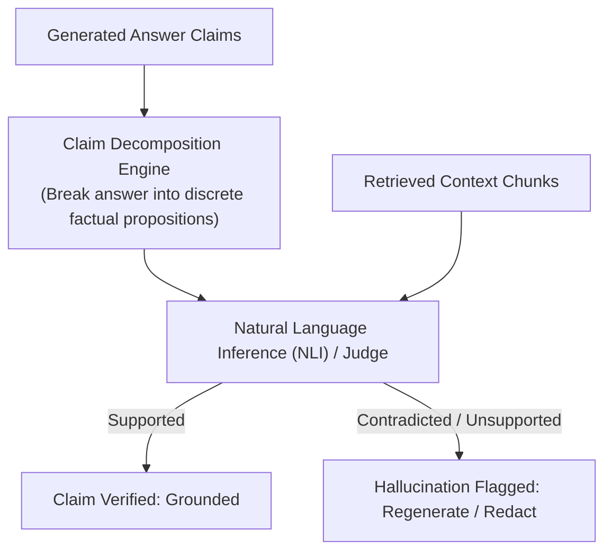

# 📹 Mastering LLM Chatbots And RAG Evaluation Crash Course

<div className="video-card" style={{border: '1px solid #30363d', borderRadius: '8px', padding: '16px', marginBottom: '24px', background: 'rgba(56, 139, 253, 0.05)'}}>
  <div style={{display: 'flex', gap: '16px', flexWrap: 'wrap'}}>
    <div><strong>Instructor:</strong> Krish Naik</div>
    <div><strong>Duration:</strong> 3972</div>
    <div><strong>Course:</strong> Module 3: Advanced RAG & Memory</div>
    <div><strong>Watch Link:</strong> <a href="https://www.youtube.com/watch?v=NebOSOTp-zA" target="_blank" rel="noopener noreferrer">YouTube Lecture ↗</a></div>
  </div>
</div>

## 📌 Executive Summary

Hallucinations in Large Language Models occur when models generate syntactically confident but factually fabricated statements. In RAG applications, hallucinations stem from context omission, retrieval noise, or strong parametric model priors overriding retrieved facts.

This guide details measuring hallucination rates, strict prompt boundary engineering, negative constraints, and deploying automated hallucination verification nodes.

---

## 🏗️ System Architecture & Execution Flow



---

## 📖 Core Concepts & Technical Deep Dive

### 1. The Anatomy of Hallucinations
- **Intrinsic Hallucination:** The model's answer contradicts the provided context documents.
- **Extrinsic Hallucination:** The model's answer introduces unverifiable information not present in the context.

### 2. Prompt Engineering Defenses
- Strict Negative Constraints: `"Answer ONLY using the provided text. Do not extrapolate."`
- Citation Anchoring: Demanding that every factual assertion include a direct quote from the source.
- CoT Grounding: Instructing the model to write down relevant quotes first before formulating its final response.

### 3. Automated Faithfulness Verification
Running generated claims through an automated NLI (Natural Language Inference) classifier or LLM judge verifies that every statement is strictly entailed by the context documents.

---

## 💻 Production Implementation

```python
def evaluate_claim_grounding(claim: str, context: str) -> bool:
    """Verify whether a generated claim is explicitly mentioned in the context."""
    # Heuristic substring check for demonstration
    words = [w.lower() for w in claim.split() if len(w) > 4]
    matches = [w for w in words if w in context.lower()]
    return len(matches) / max(1, len(words)) >= 0.7

context_sample = "Cluster nodes communicate over mutual TLS on port 9443."
claim_1 = "Nodes communicate using mTLS on port 9443."
claim_2 = "Nodes authenticate via unencrypted HTTP on port 80."

print(f"Claim 1 Grounded: {evaluate_claim_grounding(claim_1, context_sample)}")
print(f"Claim 2 Grounded: {evaluate_claim_grounding(claim_2, context_sample)}")
```

---

## ⚙️ Production Gotchas & Best Practices

:::tip Quotation Grounding
Force models to extract verbatim quotes before answering: `"Step 1: Extract 2 direct quotes from context. Step 2: Answer using only those quotes."` This reduces hallucinations by $>80\%$.
:::

:::warning Zero-Temperature Assumption
Setting `temperature=0.0` reduces token sampling randomness but DOES NOT eliminate hallucinations if the prompt lacks grounding constraints.
:::

---

## 📊 Architectural Reference & Comparison

| Hallucination Type | Cause | Detection Method | Mitigation |
| :--- | :--- | :--- | :--- |
| **Intrinsic** | Model misinterprets context | NLI / LLM Judge verification | Few-shot grounding examples |
| **Extrinsic** | Model brings in outside data | Sentence-by-sentence check | Strict refusal prompt ("Do not extrapolate") |
| **Retrieval Miss**| Desired fact was never retrieved | Retrieval Recall metric | Hybrid search, query rewriting |

---

## 📚 Key Takeaways & Enterprise Checklist

- [ ] **Architecture Verification:** Ensure your design addresses latency, decoupled interfaces, and strict data validation contracts.
- [ ] **Deterministic Testing:** Run unit tests and golden dataset evaluations before shipping changes to staging or production.
- [ ] **Security & Observability:** Enforce input/output guardrails, scrub sensitive credentials/PII, and capture distributed traces.
- [ ] **Scalability & Sizing:** Calibrate model parameters, context limits, and compute instance requirements against projected request concurrency.
