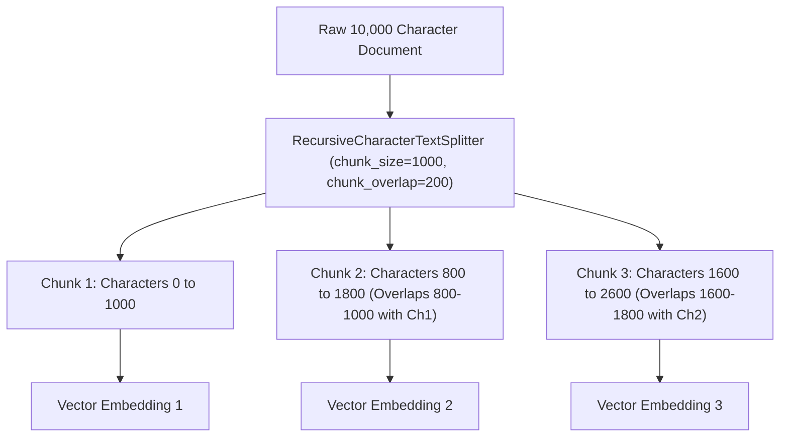

# Text Splitters & Optimal Chunking Strategies

<div className="video-card" style={{border: '1px solid #30363d', borderRadius: '8px', padding: '16px', marginBottom: '24px', background: 'rgba(56, 139, 253, 0.05)'}}>
  <div style={{display: 'flex', gap: '16px', flexWrap: 'wrap', alignItems: 'center'}}>
    <div><strong>Curators:</strong> Unified Masterclass (CampusX & Krish Naik)</div>
    <div><strong>Module:</strong> Module 3: Advanced RAG & Conversational Memory</div>
    <div><strong>Focus:</strong> Beginner to Production</div>
  </div>
</div>

## 🎯 What You'll Learn
- Understand why raw documents cannot be fed directly to embedding models without chunking.
- Master the two critical parameters: `chunk_size` and `chunk_overlap`.
- Use `RecursiveCharacterTextSplitter` to keep paragraphs and sentences semantically intact.

---

## 💡 Concept & Architecture

Why can't we embed an entire 50-page PDF as a single vector?
1. **Embedding Model Limits:** Embedding models (like `text-embedding-3-small`) have token limits (e.g. 8,192 tokens).
2. **Semantic Dilution:** If you embed 50 pages into one vector, specific details (like a single phone number or price) get washed out and become unsearchable.
3. **Retrieval Precision:** When a user asks a question, we only want to retrieve the specific 2-3 paragraphs that answer it, not an entire book.

A **Text Splitter** cuts long text into smaller pieces (chunks). 

### Why Chunk Overlap Matters:
Imagine a sentence is cut right down the middle:
- Chunk 1 ends with: *'The total budget approved for the new AI platform was'*
- Chunk 2 starts with: *'$2,500,000 in fiscal year 2026.'*
If a user searches for the budget, neither chunk alone contains the full semantic thought! **Chunk overlap** repeats the last 100-200 characters of Chunk 1 at the beginning of Chunk 2, ensuring context is never lost across boundaries.

### System Architecture & Data Flow



---

## 💻 Step-by-Step Code Walkthrough

Below is the complete implementation broken down into digestible parts so you can understand every line.

### Part 1: Step 1: Implementing RecursiveCharacterTextSplitter

```python
from langchain_text_splitters import RecursiveCharacterTextSplitter

# Sample long text describing microservices architecture
document_text = """
Microservices architecture structures an application as a collection of loosely coupled services.
Each service is self-contained and implements a single business capability.

Services communicate using either synchronous protocols like HTTP REST or asynchronous message brokers like Kafka.
Decoupling services allows independent team deployment and horizontal scaling.

However, microservices introduce distributed system complexities:
1. Distributed transaction management (Saga pattern)
2. Network latency and partial failure modes
3. Distributed tracing and centralized logging
"""

# Initialize the recursive splitter
splitter = RecursiveCharacterTextSplitter(
    chunk_size=200,          # Target character length per chunk
    chunk_overlap=40,        # Overlapping characters between adjacent chunks
    separators=["\n\n", "\n", ".", " ", ""] # Priority order of split points
)

chunks = splitter.split_text(document_text)

print(f"Original text split into {len(chunks)} chunks.\n")
for idx, c in enumerate(chunks):
    print(f"--- CHUNK {idx + 1} ({len(c)} chars) ---")
    print(c.strip())
```

#### 🔍 In-Depth Explanation:
`RecursiveCharacterTextSplitter` tries to split on double newlines (`\n\n`) first to keep paragraphs intact. If a paragraph is too long, it splits on single newlines, then periods, then words, preserving natural readability.

---

## ⚠️ Beginner Tips & Best Practices

:::tip Recommended Production Chunk Sizes
For standard text Q&A, a `chunk_size` of 800-1000 characters with a `chunk_overlap` of 150-200 characters strikes the best balance between semantic depth and vector search precision.
:::

:::warning Don't Split Code with Standard Character Splitters
Standard splitters break code functions in half. Use `RecursiveCharacterTextSplitter.from_language(Language.PYTHON)` when chunking code, which respects function definitions and class boundaries.
:::

---

## 📝 Key Takeaways & Summary

- Chunking breaks large documents into semantically coherent snippets suitable for vector embedding.
- `chunk_overlap` prevents context from being severed across chunk boundaries.
- `RecursiveCharacterTextSplitter` respects paragraph and sentence boundaries for optimal retrieval quality.

