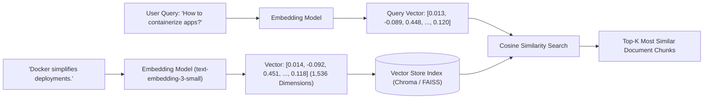

# Vector Embeddings & Vector Stores (FAISS, Chroma, AstraDB)

<div className="video-card" style={{border: '1px solid #30363d', borderRadius: '8px', padding: '16px', marginBottom: '24px', background: 'rgba(56, 139, 253, 0.05)'}}>
  <div style={{display: 'flex', gap: '16px', flexWrap: 'wrap', alignItems: 'center'}}>
    <div><strong>Curators:</strong> Unified Masterclass (CampusX & Krish Naik)</div>
    <div><strong>Module:</strong> Module 3: Advanced RAG & Conversational Memory</div>
    <div><strong>Focus:</strong> Beginner to Production</div>
  </div>
</div>

## 🎯 What You'll Learn
- Understand how vector embeddings translate semantic meaning into geometric coordinates.
- Compare local in-memory vector stores (FAISS, Chroma) with managed cloud vector databases.
- Build, persist, and query an embedded vector store using LangChain.

---

## 💡 Concept & Architecture

Computers cannot understand the meaning of English words directly. An **Embedding Model** transforms a piece of text into an array of floating-point numbers (e.g. 1,536 numbers).

The magic of embeddings:
- Sentences with **similar meanings** are positioned close together in high-dimensional space.
- *'The dog chased the cat'* and *'A hound pursued the feline'* have almost identical vector coordinates, even though they share zero identical words!

A **Vector Database** (like Chroma, FAISS, or Pinecone) is a specialized index optimized to execute **Approximate Nearest Neighbor (ANN)** searches across millions of vectors in under 10 milliseconds.

### System Architecture & Data Flow



---

## 💻 Step-by-Step Code Walkthrough

Below is the complete implementation broken down into digestible parts so you can understand every line.

### Part 1: Step 1: Installing Vector Store Libraries

```python
pip install langchain-community faiss-cpu langchain-openai
```

#### 🔍 In-Depth Explanation:
This installs `faiss-cpu` (Facebook AI Similarity Search), an ultra-fast in-memory vector indexing library.

### Part 2: Step 2: Creating and Indexing Documents with FAISS

```python
from langchain_core.documents import Document
from langchain_openai import OpenAIEmbeddings
from langchain_community.vectorstores import FAISS

# 1. Sample document chunks with metadata
documents = [
    Document(
        page_content="PostgreSQL supports ACID transactions and JSONB semi-structured storage.",
        metadata={"source": "db_overview.txt", "topic": "sql"}
    ),
    Document(
        page_content="Redis is an in-memory key-value data store used for ultra-fast caching and pub/sub.",
        metadata={"source": "db_overview.txt", "topic": "nosql"}
    ),
    Document(
        page_content="FastAPI is an asynchronous Python web framework built on Starlette and Pydantic.",
        metadata={"source": "api_overview.txt", "topic": "backend"}
    )
]

# 2. Initialize the embedding model
embeddings = OpenAIEmbeddings(model="text-embedding-3-small")

# 3. Create FAISS vector store from documents
vectorstore = FAISS.from_documents(documents, embeddings)
print("FAISS Index successfully built with", len(documents), "vectors.")
```

#### 🔍 In-Depth Explanation:
`FAISS.from_documents()` calls the embedding model in a batch, receives vectors for each document, and builds a similarity index.

### Part 3: Step 3: Performing Similarity Search with Relevance Scores

```python
# Query the vector store
query = "What database should I use for fast RAM caching?"

# Search for the top-1 most relevant document along with distance score
results = vectorstore.similarity_search_with_score(query, k=1)

for doc, score in results:
    print(f"Similarity Distance Score: {score:.4f} (lower is closer)")
    print(f"Matched Content: {doc.page_content}")
    print(f"Source Metadata: {doc.metadata}")
```

#### 🔍 In-Depth Explanation:
FAISS compares the query vector to stored vectors and returns the Redis document chunk because its vector coordinates are mathematically closest to the question.

---

## ⚠️ Beginner Tips & Best Practices

:::tip Persist Vector Stores to Disk
In-memory FAISS indices vanish when Python exits. Use `vectorstore.save_local('faiss_index')` and `FAISS.load_local('faiss_index', embeddings)` to save and reload your index.
:::

:::warning Never Mix Embedding Models
If you index documents using `text-embedding-3-small` (1,536 dimensions), you CANNOT query the index using `nomic-embed-text` (768 dimensions). The coordinate spaces and dimensions must match exactly.
:::

---

## 📝 Key Takeaways & Summary

- Embedding models convert semantic meaning into high-dimensional numerical vectors.
- Vector databases perform high-speed cosine and Euclidean similarity searches.
- FAISS and Chroma provide lightweight, local vector storage ideal for rapid development and testing.

