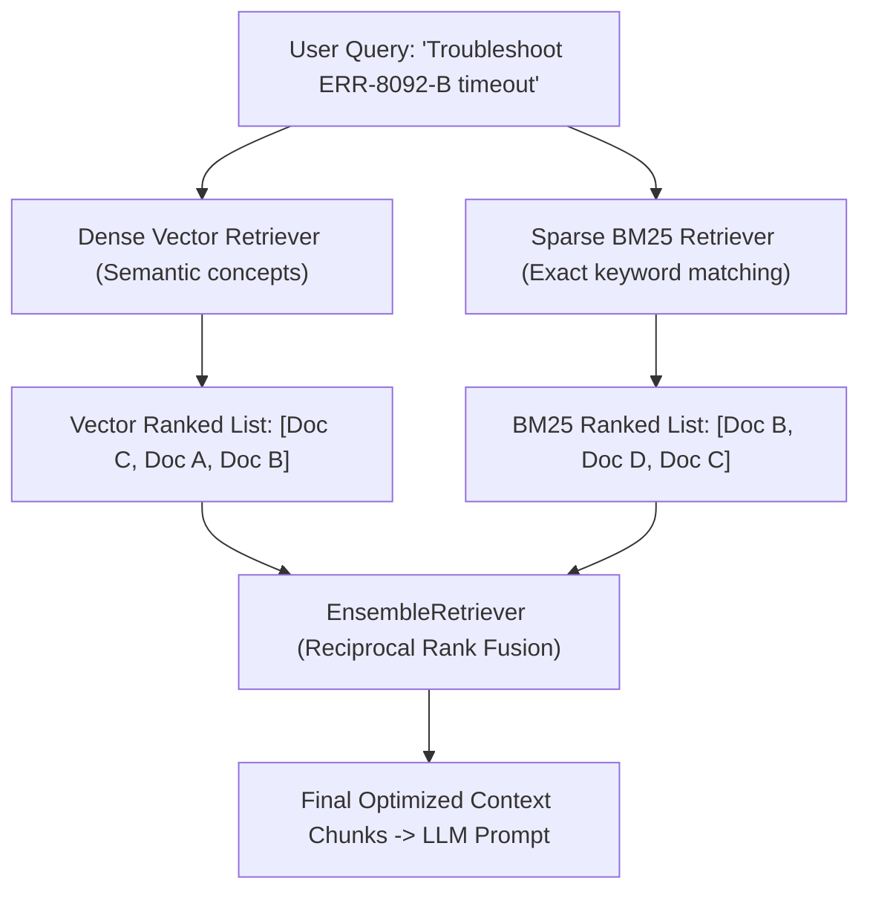

# Advanced Retrievers & Hybrid Search (Dense + Sparse BM25)

<div className="video-card" style={{border: '1px solid #30363d', borderRadius: '8px', padding: '16px', marginBottom: '24px', background: 'rgba(56, 139, 253, 0.05)'}}>
  <div style={{display: 'flex', gap: '16px', flexWrap: 'wrap', alignItems: 'center'}}>
    <div><strong>Curators:</strong> Unified Masterclass (CampusX & Krish Naik)</div>
    <div><strong>Module:</strong> Module 3: Advanced RAG & Conversational Memory</div>
    <div><strong>Focus:</strong> Beginner to Production</div>
  </div>
</div>

## 🎯 What You'll Learn
- Understand why purely semantic dense retrieval fails on exact keywords, product SKUs, and acronyms.
- Master Sparse Keyword Retrieval (BM25) vs Dense Vector Retrieval.
- Combine both using LangChain's `EnsembleRetriever` with Reciprocal Rank Fusion (RRF).

---

## 💡 Concept & Architecture

Naive vector search has an Achilles' heel: **Exact Keyword Matching**.

If a user searches for an exact model code: *'Error code ERR-8092-B'*, a vector embedding model might return documents about *'General system errors'* because the vector coordinates capture general meaning rather than the exact alphanumeric string.

Conversely, traditional keyword search (BM25 / Elasticsearch) fails when users ask concept questions without using the exact matching words.

**Hybrid Search** combines the best of both worlds:
1. **Dense Retriever (Vectors):** Captures concepts, synonyms, and natural phrasing.
2. **Sparse Retriever (BM25):** Captures exact names, product IDs, and error codes.
3. **Reciprocal Rank Fusion (RRF):** Blends rankings from both retrievers to pick the ultimate top results.

### System Architecture & Data Flow



---

## 💻 Step-by-Step Code Walkthrough

Below is the complete implementation broken down into digestible parts so you can understand every line.

### Part 1: Step 1: Installing rank_bm25

```python
pip install rank_bm25
```

#### 🔍 In-Depth Explanation:
This installs the BM25 lexical ranking algorithm used for sparse keyword search.

### Part 2: Step 2: Building an EnsembleRetriever Combining BM25 and Vector Search

```python
from langchain_community.retrievers import BM25Retriever
from langchain_community.vectorstores import FAISS
from langchain_openai import OpenAIEmbeddings
from langchain.retrievers import EnsembleRetriever
from langchain_core.documents import Document

# Sample corpus containing both technical jargon and error codes
docs = [
    Document(page_content="Error code ERR-8092-B indicates database connection pool exhaustion."),
    Document(page_content="System crashes occur when RAM memory consumption exceeds 95%."),
    Document(page_content="Configure max_connections in postgresql.conf to prevent socket drops."),
]

# 1. Initialize Sparse BM25 Retriever (Keyword matching)
bm25_retriever = BM25Retriever.from_documents(docs)
bm25_retriever.k = 2

# 2. Initialize Dense Vector Retriever (Semantic search)
embeddings = OpenAIEmbeddings(model="text-embedding-3-small")
vectorstore = FAISS.from_documents(docs, embeddings)
vector_retriever = vectorstore.as_retriever(search_kwargs={"k": 2})

# 3. Create Hybrid Ensemble Retriever combining both with weights
ensemble_retriever = EnsembleRetriever(
    retrievers=[bm25_retriever, vector_retriever],
    weights=[0.5, 0.5] # 50% keyword weight, 50% semantic weight
)

# Test query with exact error code
results = ensemble_retriever.invoke("How do I fix ERR-8092-B?")
print("Top Retrieved Document:")
print(results[0].page_content)
```

#### 🔍 In-Depth Explanation:
The `EnsembleRetriever` runs both the BM25 keyword search and the FAISS vector search in parallel. It uses Reciprocal Rank Fusion to synthesize an optimal unified ranking.

---

## ⚠️ Beginner Tips & Best Practices

:::tip Tune Ensemble Weights by Domain
For legal, medical, or financial documents with strict terminology, increase BM25 weight to 0.6 or 0.7. For conversational FAQ bots, increase semantic vector weight to 0.7.
:::

:::warning BM25 Indexes are Not Auto-Updated
When you add new documents to your vector database, remember that the BM25 index must also be rebuilt to include the new words in its vocabulary dictionary.
:::

---

## 📝 Key Takeaways & Summary

- Dense vector retrieval excels at semantic concepts; sparse BM25 retrieval excels at exact keywords and codes.
- Hybrid Search merges both approaches to eliminate blind spots in enterprise search.
- `EnsembleRetriever` blends rankings using Reciprocal Rank Fusion.

