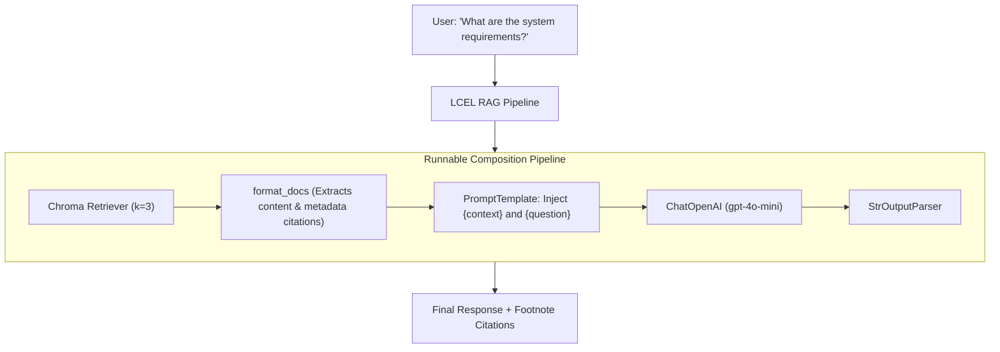

# Building an End-to-End RAG Pipeline from Scratch

<div className="video-card" style={{border: '1px solid #30363d', borderRadius: '8px', padding: '16px', marginBottom: '24px', background: 'rgba(56, 139, 253, 0.05)'}}>
  <div style={{display: 'flex', gap: '16px', flexWrap: 'wrap', alignItems: 'center'}}>
    <div><strong>Curators:</strong> Krish Naik</div>
    <div><strong>Module:</strong> Module 3: Advanced RAG & Conversational Memory</div>
    <div><strong>Focus:</strong> Beginner to Production</div>
  </div>
</div>

## 🎯 What You'll Learn
- Tie together all foundational components: Loader, Splitter, VectorStore, Retriever, Prompt, and LLM.
- Assemble a complete declarative LCEL pipeline with `format_docs` helper.
- Return answers with verifiable source document page citations.

---

## 💡 Concept & Architecture

Now that we have explored each component of the RAG stack individually, it's time to assemble them into a cohesive, production-grade RAG pipeline.

In this lesson, we build an end-to-end question-answering system:
1. Ingests technical documentation chunks.
2. Embeds and stores them in Chroma DB.
3. Formulates a declarative LCEL retrieval chain.
4. Generates answers that cite the specific document sources and page numbers.

### System Architecture & Data Flow



---

## 💻 Step-by-Step Code Walkthrough

Below is the complete implementation broken down into digestible parts so you can understand every line.

### Part 1: Step 1: Ingesting and Vectorizing Knowledge Chunks in Chroma

```python
from langchain_core.documents import Document
from langchain_community.vectorstores import Chroma
from langchain_openai import OpenAIEmbeddings

# Sample enterprise documentation chunks
knowledge_base = [
    Document(
        page_content="Production API clusters require a minimum of 4 vCPUs and 16GB RAM for high concurrency.",
        metadata={"source": "infrastructure_spec.pdf", "page": 4}
    ),
    Document(
        page_content="Database connections must utilize SSL mode verify-full with certificates rotated every 90 days.",
        metadata={"source": "security_handbook.pdf", "page": 18}
    ),
    Document(
        page_content="Nightly backups are archived to immutable AWS S3 Glacier buckets at 02:00 UTC.",
        metadata={"source": "backup_protocol.pdf", "page": 2}
    )
]

# Create an in-memory Chroma vector store
embeddings = OpenAIEmbeddings(model="text-embedding-3-small")
vectorstore = Chroma.from_documents(knowledge_base, embeddings)
retriever = vectorstore.as_retriever(search_kwargs={"k": 2})

print("Chroma knowledge base initialized with 3 documentation pages.")
```

#### 🔍 In-Depth Explanation:
We index 3 documents into Chroma with rich metadata (`source` and `page`). `vectorstore.as_retriever(search_kwargs={'k': 2})` configures retrieval to fetch the top 2 matching chunks.

### Part 2: Step 2: Building the format_docs Helper to Retain Citations

```python
def format_docs_with_citations(docs):
    """Format retrieved chunks with explicit document provenance tags."""
    formatted_chunks = []
    for i, doc in enumerate(docs):
        chunk_header = f"[Source {i+1}: {doc.metadata['source']} | Page {doc.metadata['page']}]"
        formatted_chunks.append(f"{chunk_header}\n{doc.page_content}")
    return "\n\n".join(formatted_chunks)

# Test the formatting output
sample_docs = retriever.invoke("What are the cluster CPU requirements?")
print("Formatted Context Fed to LLM:\n")
print(format_docs_with_citations(sample_docs))
```

#### 🔍 In-Depth Explanation:
By injecting `[Source: X | Page: Y]` into the context string, the model learns the exact origin of each fact and can cite it in its final response.

### Part 3: Step 3: Assembling and Running the LCEL RAG Chain

```python
from langchain_core.prompts import ChatPromptTemplate
from langchain_core.runnables import RunnablePassthrough
from langchain_core.output_parsers import StrOutputParser
from langchain_openai import ChatOpenAI

# Strict prompt enforcing citation references
prompt = ChatPromptTemplate.from_template("""You are an enterprise technical support specialist.
Answer the user's question using ONLY the provided context.
Always cite the source document name and page number at the end of your response.

Context:
{context}

Question:
{question}

Answer:""")

model = ChatOpenAI(model="gpt-4o-mini", temperature=0.0)

# Declarative assembly with pipe operator
rag_chain = (
    {"context": retriever | format_docs_with_citations, "question": RunnablePassthrough()}
    | prompt
    | model
    | StrOutputParser()
)

# Execute the complete pipeline
answer = rag_chain.invoke("What are the hardware specifications for cluster nodes?")
print("\n--- FINAL GENERATED ANSWER ---")
print(answer)
```

#### 🔍 In-Depth Explanation:
`RunnablePassthrough()` passes the user's question directly to the prompt, while `retriever | format_docs_with_citations` fetches and formats the context in parallel.

---

## ⚠️ Beginner Tips & Best Practices

:::tip Use RunnablePassthrough.assign for Clean Debugging
If you need to return both the retrieved source documents and the generated answer to the frontend, use `RunnablePassthrough.assign` instead of reducing context directly.
:::

:::warning Inspect Retrieved Chunks Before Blaming the LLM
If the model gives a bad answer, 90% of the time the issue is in retrieval (poor chunking or low K), not the model. Always log your retrieved chunks during debugging.
:::

---

## 📝 Key Takeaways & Summary

- An end-to-end RAG pipeline binds retrieval, context formatting, prompting, and LLM inference into a single LCEL chain.
- Formatting context with document names and page numbers enables accurate source citation.
- `RunnablePassthrough` synchronizes query distribution between the retriever and prompt template.

