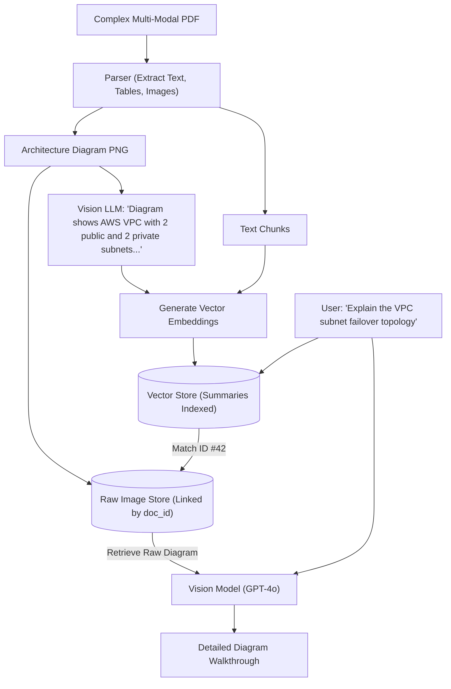

# Multi-Modal RAG: Indexing Text, Tables & Images with Vision Models

<div className="video-card" style={{border: '1px solid #30363d', borderRadius: '8px', padding: '16px', marginBottom: '24px', background: 'rgba(56, 139, 253, 0.05)'}}>
  <div style={{display: 'flex', gap: '16px', flexWrap: 'wrap', alignItems: 'center'}}>
    <div><strong>Curators:</strong> Krish Naik</div>
    <div><strong>Module:</strong> Module 3: Advanced RAG & Conversational Memory</div>
    <div><strong>Focus:</strong> Beginner to Production</div>
  </div>
</div>

## 🎯 What You'll Learn
- Understand why standard text embeddings fail on architecture diagrams and complex tables.
- Master the Multi-Vector Retriever pattern: embed text summaries, retrieve raw images/tables.
- Pass extracted images directly to vision foundation models (GPT-4o / Claude 3.5 Sonnet).

---

## 💡 Concept & Architecture

Enterprise documents rarely consist of plain text. The most critical information is often stored in:
- System architecture diagrams and network topologies.
- Multi-column financial balance sheets.
- Medical x-rays and circuit schematics.

### The Multi-Vector Retriever Pattern
Directly embedding raw image pixels with CLIP models often yields poor text-to-diagram search accuracy. The industry standard pattern:
1. Extract images and tables from the PDF.
2. Use a Vision LLM (GPT-4o) to generate a dense, detailed **text summary** describing what the diagram or table depicts.
3. Embed and store the **text summary** in the vector database.
4. When a user asks a question, match against the summary embedding, but retrieve and pass the **raw high-resolution image** to the generator model.

### System Architecture & Data Flow



---

## 💻 Step-by-Step Code Walkthrough

Below is the complete implementation broken down into digestible parts so you can understand every line.

### Part 1: Step 1: Encoding Images to Base64 for Vision API Delivery

```python
import base64

def encode_image_file_to_base64(image_path: str) -> str:
    """Read a local image file and convert it into a base64 encoded string."""
    with open(image_path, "rb") as img_file:
        return base64.b64encode(img_file.read()).decode("utf-8")

# Blueprint demonstrating payload construction for Vision models
# base64_image = encode_image_file_to_base64("architecture.png")
print("Base64 image encoding utility ready.")
```

#### 🔍 In-Depth Explanation:
Vision models accept images either via public URLs or as base64-encoded strings within the message payload.

### Part 2: Step 2: Constructing a Multi-Modal Vision Prompt with LangChain

```python
from langchain_core.messages import HumanMessage
from langchain_openai import ChatOpenAI

# Initialize Vision-capable foundation model
vision_llm = ChatOpenAI(model="gpt-4o", temperature=0.0)

# Blueprint for passing both text questions and image data
def create_multimodal_message(question: str, base64_img: str):
    return HumanMessage(content=[
        {"type": "text", "text": question},
        {
            "type": "image_url",
            "image_url": {"url": f"data:image/jpeg;base64,{base64_img}"}
        }
    ])

print("Multi-Modal message constructor compiled successfully.")
```

#### 🔍 In-Depth Explanation:
LangChain's `HumanMessage` accepts a list of content blocks, allowing arbitrary combinations of text strings and image objects.

---

## ⚠️ Beginner Tips & Best Practices

:::tip Downscale Giant Images Before Sending
Vision APIs charge tokens based on image pixel dimensions. Downscaling diagrams to a max dimension of 1568px preserves fine text readability while cutting token costs by 50%.
:::

:::warning Never Flatten Tables to Plain Text
Plain text extraction strips row-column spatial relationships from financial tables. Always extract tables as structured Markdown or HTML tables.
:::

---

## 📝 Key Takeaways & Summary

- Multi-Modal RAG bridges textual and visual information in technical documents.
- The Multi-Vector pattern indexes dense textual summaries while retrieving raw images.
- Vision models synthesize diagrams, charts, and tables to provide complete answers.

