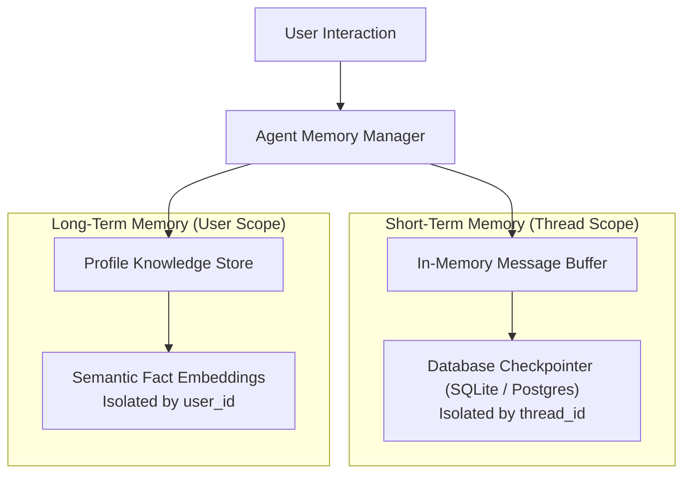

# Conversational Memory: Short-Term Buffers & Database Checkpointers

<div className="video-card" style={{border: '1px solid #30363d', borderRadius: '8px', padding: '16px', marginBottom: '24px', background: 'rgba(56, 139, 253, 0.05)'}}>
  <div style={{display: 'flex', gap: '16px', flexWrap: 'wrap', alignItems: 'center'}}>
    <div><strong>Curators:</strong> Nitish Singh (CampusX)</div>
    <div><strong>Module:</strong> Module 3: Advanced RAG & Conversational Memory</div>
    <div><strong>Focus:</strong> Beginner to Production</div>
  </div>
</div>

## 🎯 What You'll Learn
- Understand why LLMs are stateless and how conversational memory must be managed externally.
- Differentiate Short-Term Memory (session-scoped) from Long-Term Semantic Memory (user-scoped).
- Implement production state persistence using LangGraph's `MemorySaver` and `SqliteSaver`.

---

## 💡 Concept & Architecture

Large Language Models have **zero memory**. Every single HTTP request to OpenAI or Anthropic starts from a completely blank slate. 

If you say:
- Turn 1: *'My name is Alice and I am a Python engineer.'*
- Turn 2: *'What is my name?'*
The model has no idea who you are unless your application includes the Turn 1 history in the Turn 2 request!

### Memory Architectures:
1. **Short-Term Memory (Thread-Scoped):** Retains recent messages within the current conversation thread. Managed via LangGraph checkpointers and keyed by `thread_id`.
2. **Long-Term Memory (User-Scoped):** Retains user preferences, historical interactions, and facts across multiple distinct sessions over days or months. Stored in a vector database and keyed by `user_id`.

### System Architecture & Data Flow



---

## 💻 Step-by-Step Code Walkthrough

Below is the complete implementation broken down into digestible parts so you can understand every line.

### Part 1: Step 1: Installing LangGraph Checkpointing Library

```python
pip install langgraph
```

#### 🔍 In-Depth Explanation:
LangGraph is the standard framework for stateful, multi-turn AI applications in 2026.

### Part 2: Step 2: Building a Stateful Multi-Turn Chatbot with MemorySaver

```python
from typing import TypedDict, Annotated, List
from langgraph.graph import StateGraph, START, END
from langgraph.checkpoint.memory import MemorySaver
import operator

# 1. Define State Schema: Annotated with operator.add so new messages append rather than overwrite
class ChatState(TypedDict):
    messages: Annotated[List[str], operator.add]

# 2. Node function responding to messages
def chatbot_node(state: ChatState):
    latest_user_message = state["messages"][-1]
    bot_reply = f"EchoBot received: '{latest_user_message}'"
    return {"messages": [bot_reply]}

# 3. Assemble Graph
workflow = StateGraph(ChatState)
workflow.add_node("chatbot", chatbot_node)
workflow.add_edge(START, "chatbot")
workflow.add_edge("chatbot", END)

# 4. Attach Checkpointer for state persistence
checkpointer = MemorySaver()
app = workflow.compile(checkpointer=checkpointer)

# 5. Run Multi-Turn interaction on Thread #101
config = {"configurable": {"thread_id": "thread-101"}}

# Turn 1
app.invoke({"messages": ["Hi, my name is Alice."]}, config=config)

# Turn 2
app.invoke({"messages": ["I am an AI engineer."]}, config=config)

# Inspect persisted state history
state_snapshot = app.get_state(config)
print("Total Messages Persisted in Thread 101:", len(state_snapshot.values["messages"]))
for msg in state_snapshot.values["messages"]:
    print(" -", msg)
```

#### 🔍 In-Depth Explanation:
`MemorySaver` attaches a state checkpointer. By specifying `thread_id='thread-101'`, LangGraph automatically loads previous messages on each call, giving the model conversational memory.

---

## ⚠️ Beginner Tips & Best Practices

:::tip Always Isolate by thread_id
Never share a single `thread_id` across different users. Doing so will contaminate memory and cause one user's private data to appear in another user's session.
:::

:::warning Implement Summarization for Long Chats
If a conversation lasts for 100 turns, appending all messages will exceed context limits. Use an intermediate LLM step to summarize older turns into a single summary message.
:::

---

## 📝 Key Takeaways & Summary

- LLMs are completely stateless; conversational memory must be managed externally.
- Short-term memory preserves thread context using database checkpointers (`thread_id`).
- Long-term memory stores user profiles and facts across sessions using vector stores (`user_id`).

