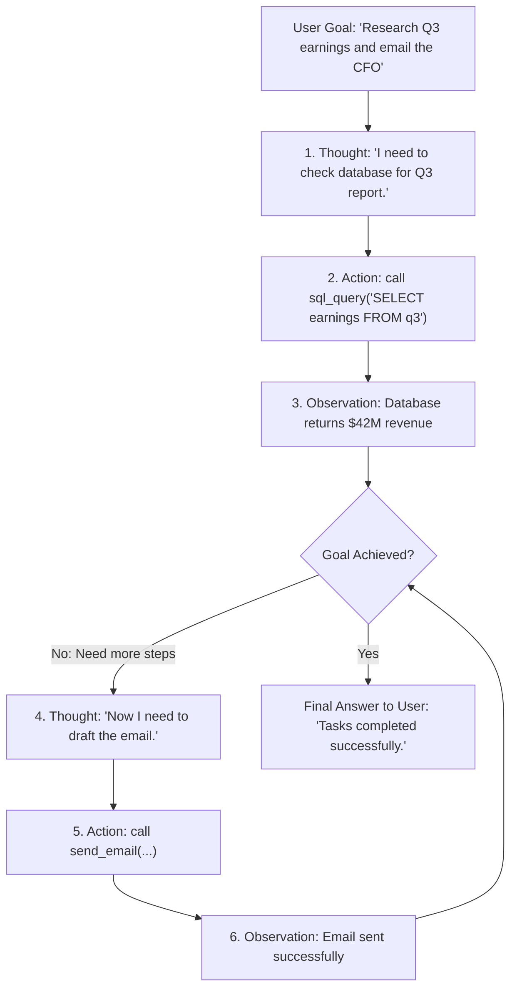

# Agentic AI Foundations: ReAct Pattern, Tools & Autonomy

<div className="video-card" style={{border: '1px solid #30363d', borderRadius: '8px', padding: '16px', marginBottom: '24px', background: 'rgba(56, 139, 253, 0.05)'}}>
  <div style={{display: 'flex', gap: '16px', flexWrap: 'wrap', alignItems: 'center'}}>
    <div><strong>Curators:</strong> Unified Masterclass (CampusX & Krish Naik)</div>
    <div><strong>Module:</strong> Module 4: Agentic AI & LangGraph</div>
    <div><strong>Focus:</strong> Beginner to Production</div>
  </div>
</div>

## 🎯 What You'll Learn
- Understand the transition from static chains (DAGs) to autonomous, cyclic agent loops.
- Master the ReAct (Reasoning + Acting) loop: Thought -> Action -> Observation -> Final Answer.
- Evaluate when a task requires an autonomous agent vs when a deterministic chain is superior.

---

## 💡 Concept & Architecture

What is the fundamental difference between a **Chain** and an **Agent**?
- **A Chain (Linear):** Follows a predetermined, rigid path: *Step A -> Step B -> Step C*. Every step is hardcoded by the software engineer. If unexpected data arrives, the chain cannot adapt.
- **An Agent (Dynamic & Cyclic):** Given a high-level goal, the LLM autonomously decides **which step** to take next. It can call a tool, observe the result, realize it made a mistake, try a different tool, and loop until the goal is accomplished.

### The ReAct Cognitive Loop
Popularized by Yao et al., the **ReAct (Reason + Act)** pattern gives LLMs human-like problem solving:
1. **Thought:** The model thinks about the current situation and what is missing.
2. **Action:** The model chooses a specific tool and arguments to invoke.
3. **Observation:** The environment returns the output of that action.
4. **Repeat or Terminate:** The model evaluates if it has enough information to formulate the final answer.

### System Architecture & Data Flow



---

## 💻 Step-by-Step Code Walkthrough

Below is the complete implementation broken down into digestible parts so you can understand every line.

### Part 1: Step 1: Simulating the ReAct Loop in Pure Python

```python
# Demonstration of the ReAct mental model
def execute_react_cycle(user_goal: str):
    print(f"Goal Received: '{user_goal}'\n")
    
    # Cycle 1: Reason and Act
    print("[1. THOUGHT]: I don't know the current stock price of Apple. I need to call the financial API.")
    print("[2. ACTION]: Executing fetch_stock_price(ticker='AAPL')...")
    
    # Environment responds with observation
    observation_1 = "$228.50 USD (+1.4% today)"
    print(f"[3. OBSERVATION]: Received from API -> {observation_1}\n")
    
    # Cycle 2: Evaluate and Conclude
    print("[4. THOUGHT]: I now have the exact price. I can answer the user.")
    final_answer = f"Apple (AAPL) is currently trading at {observation_1}."
    print(f"[5. FINAL ANSWER]: {final_answer}")
    return final_answer

execute_react_cycle("What is Apple's stock price right now?")
```

#### 🔍 In-Depth Explanation:
This script shows the core cognitive loop. The agent reasons about what it lacks, executes an action, observes the result, and formulates the response.

---

## ⚠️ Beginner Tips & Best Practices

:::tip Don't Use Agents for Predictable Linear Tasks
If your workflow is always *'Extract text -> Translate -> Save to SQL'*, use a standard LCEL chain. Agents introduce non-deterministic loops and should be reserved for problems requiring dynamic decision-making.
:::

:::warning Always Set Max Iteration Limits
Without a hard stop (e.g. `max_iterations=5`), an agent can get stuck in an infinite reasoning loop if a tool fails repeatedly, burning thousands of dollars in tokens.
:::

---

## 📝 Key Takeaways & Summary

- Chains are rigid and linear; agents are dynamic, adaptive, and cyclic.
- The ReAct pattern alternates between reasoning (Thought) and tool execution (Action).
- Agents require guardrails and loop bounds to prevent infinite execution.

