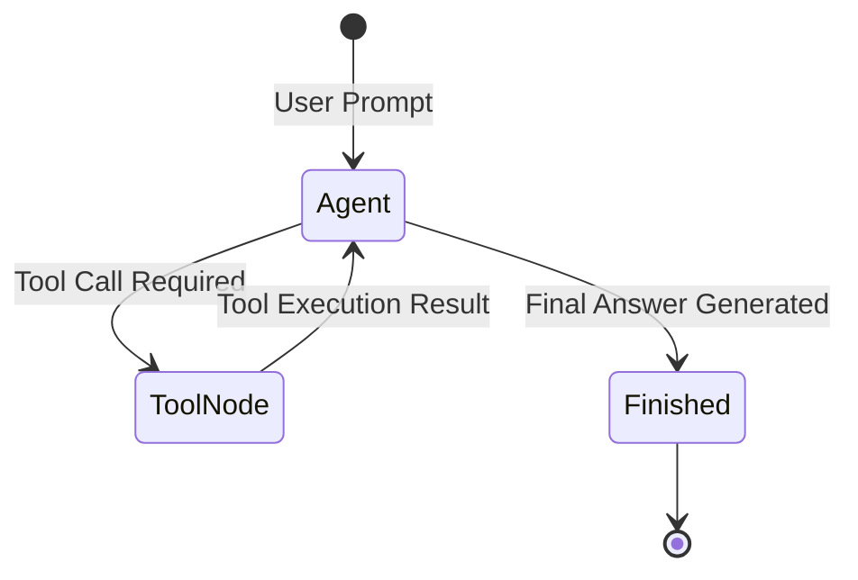

# 📹 What is Agentic AI? ｜ Agentic AI using LangGraph

<div className="video-card" style={{border: '1px solid #30363d', borderRadius: '8px', padding: '16px', marginBottom: '24px', background: 'rgba(56, 139, 253, 0.05)'}}>
  <div style={{display: 'flex', gap: '16px', flexWrap: 'wrap'}}>
    <div><strong>Instructor:</strong> Nitish Singh (CampusX)</div>
    <div><strong>Duration:</strong> 60m 25s</div>
    <div><strong>Playlist:</strong> Agentic AI with LangGraph (CampusX)</div>
    <div><strong>Watch Link:</strong> <a href="https://www.youtube.com/watch?v=GWnSsjT4V68" target="_blank" rel="noopener noreferrer">YouTube Lecture ↗</a></div>
  </div>
</div>

## 📌 Executive Summary & Learning Objectives

This lecture covers **What is Agentic AI? ｜ Agentic AI using LangGraph**, focusing on production implementations, edge cases, and industry standards:
- Core intuition, architecture, and underlying mechanisms.
- Key differences between theoretical research implementations and scalable enterprise patterns.
- Concrete Python walkthroughs, error recovery, and performance optimization.

---

## 🏗️ Architecture & Conceptual Workflow



---

## 📖 Core Concepts & Technical Deep Dive

### 1. Architectural Foundations
In modern production AI engineering, **What is Agentic AI? ｜ Agentic AI using LangGraph** is essential for ensuring reliability, low latency, and deterministic outcomes. As AI systems evolve from naive prompt-in / completion-out scripts into distributed systems, engineers must handle:
- **State management & consistency:** Ensuring intermediate states and tool invocations are tracked.
- **Error boundaries & recovery:** Graceful degradation when external LLMs or vector stores encounter rate limits or network partitions.
- **Resource utilization & cost efficiency:** Caching common queries and reducing unnecessary foundation model token expenditure.

### 2. Operational Considerations
- **Latency Optimization:** Pre-computing embeddings, utilizing asynchronous non-blocking event loops, and streaming tokens via Server-Sent Events (SSE).
- **Security & Sandboxing:** Validating inputs before ingestion, sanitizing LLM outputs, and isolating tool execution environments.

---

## 💻 Production Implementation Walkthrough

```python
from typing import TypedDict, Annotated, List
from langgraph.graph import StateGraph, END
import operator

# 1. Define State Schema
class AgentState(TypedDict):
    messages: Annotated[List[str], operator.add]
    next_step: str

# 2. Define Node Functions
def analyze_input(state: AgentState):
    print("Analyzing query...")
    return {"messages": ["Query analyzed."], "next_step": "generate"}

def generate_response(state: AgentState):
    print("Generating response...")
    return {"messages": ["Final response generated."], "next_step": "end"}

# 3. Build StateGraph
workflow = StateGraph(AgentState)
workflow.add_node("analyze", analyze_input)
workflow.add_node("generate", generate_response)

workflow.set_entry_point("analyze")
workflow.add_edge("analyze", "generate")
workflow.add_edge("generate", END)

app = workflow.compile()
output = app.invoke({"messages": ["Hello Agent"], "next_step": ""})
print(output)
```

---

## 💡 Production Best Practices & Tips

:::tip Production Deployment Guideline
When deploying What is Agentic AI? ｜ Agentic AI using LangGraph in enterprise environments, always configure automated retries with exponential backoff and telemetry tracing (such as OpenTelemetry or LangSmith).
:::

:::warning Common Failure Modes
Watch out for state contamination across concurrent requests. Ensure each session or user interaction uses an isolated thread ID or execution context.
:::

---

## 🎯 Key Takeaways & Quick Reference

| Dimension | Production Standard | Pitfall to Avoid |
| :--- | :--- | :--- |
| **Execution** | Async / Non-blocking with timeouts | Synchronous blocking calls in event loops |
| **Data Validation** | Strict Pydantic v2 schemas | Untyped dictionary access |
| **Monitoring** | Distributed tracing & latency percentiles | Relying only on standard console logs |

## ⏱️ Lecture Timeline & Key Topics

| Timestamp | Key Topic / Concept Discussed |
| :--- | :--- |
| **00:00:00** | हाय गाइस, माय नेम इज नितेश एंड यू वेलकम... |
| **00:15:11** | में बहुत स्मूथली और एफिशिएंटली करता है।... |
| **00:30:10** | आइट्रेटिवली आप करते हो जब तक आपका गोल... |
| **00:45:27** | चेंज हो जाएंगे तो फिर आपको ऑब्वियसली... |
| **01:00:22** | हैं नेक्स्ट वीडियो में।... |


---

---

## 📜 Complete Lecture Transcript (English)

> **Language:** English | **Source:** `03 - Tutorial 3- Live Build Agentic AI Chatbot Using LangGraph.en.srt` | **Total Segments:** 33 | **Word Count:** ~9,513 words

<details>
<summary><b>Click to expand full chronological transcript (33 timestamped intervals)</b></summary>

#### ⏱️ [00:00 ➔ 00:02]

Heat. Hey. Hey. Hey. [Music] Hello guys, am I audible? Can you give me a quick confirmation if you are able to hear me out? Yep. Yep. Yep. Yep. Okay. uh we'll wait for some time so that everybody joins yet another exciting session in Langraph. Okay. Yeah, I'm audible I guess. Great. Let me check from my end if looks fine. Hello DHS. Hello everybody. Hello from Peru. Hi Mario. So I'm also live in LinkedIn. So people are able to hear me in LinkedIn also. Ravi Shakarwarma says yes. Okay. We also have people from Turkey. Great. Okay. Uh welcome everyone. This is the tutorial third and in this session we are going to discuss about uh how to build chat bots with the help of langraph. Again a practical session completely and yes uh we will also see

#### ⏱️ [00:02 ➔ 00:04]

how we can probably go ahead and implement things. Okay. Uh so please make sure that you hit like because this langraph series is going to go on for a longer time and soon we also going to start with MCP. again I will be using Langra framework itself for doing all the necessary things itself okay so yeah I hope everybody uh is probably audible you are able to hear me out and yes I watch lecture but it difficult difficult to execute in code no worries will help you in that please end to end projects perfect that also I will plan okay so let me quickly go ahead and share my screen and then we are just going to start with each and everything. Okay. So, just let me know once you're able to see my screen. Yeah. Hi K Manoj here from Bangalore. Hello. Thank you very much sir. Uh is MLOps compulsory before learning LLMs? No, not not necessary but it is good to have. Okay. So everybody uh I hope you all are ready. I hope you are able to hear me out quickly. So let's go ahead and let's work on today's use case. Okay. So here our main plan over here is that we are going to build a chatbot. So first of all I'll go just go ahead and write about the entire agenda what all things we are basically going to discuss. Okay. So we are going to create a chatbot with the help of Langraph. Now this will not just be a simple chatbot. With this we are going to integrate tools multiple tools. I'm not talking about just one tool multiple tools. And then we will try to also discuss

#### ⏱️ [00:04 ➔ 00:06]

about a react architecture. I don't know how many of you have heard about this react architecture. So that you know your chatbot will be specifically working based on this react architecture. Okay. Now what exactly is this react architecture? This is not a JavaScript framework react. Okay. It is something else. Um we we say this as based on reasoning and acting. Okay. So here specifically we use two terms. one is reasoning and then you are acting. Okay. So now in this chatbot see later on the reason why I'm explaining you this because soon we also going to start to talk about MCP. Okay. MCP that is model context protocol. Model context protocol. Okay. Model context protocol. And if I talk about model context protocol here we'll also try to develop some kind of protocol. how langraph or any AI assistant will be able to communicate with this kind of tools. Okay. But first of all as usual we will cover all this specific stuffs. We will implement it practically. We will try to understand each and everything with respect to this. Okay. Now quickly going ahead you know uh what we are basically going to do what uh what is our plan uh you know uh that I'm actually going to talk about. No. So here we are going to create a workflow. This workflow will be nothing but it is a chatbot workflow. Chatbot workflow. Now inside the chatbot workflow what we are basically going to do is that we will create something like this. Let's say this is my start node. This is my start node. Okay. inside my workflow. This will be my AI assistant. Let's say this is my AI

#### ⏱️ [00:06 ➔ 00:08]

assistant. And this AI assistant, let's say this will be having some Grock opensource models. That is what we are going to use. We are not going to use OpenAI because I hope everybody will be able to uh get the Grock access because it is completely for free at least for some number of request. And this AI assistent will will have will have um the access to tools, right? So this is basically going to have the access to some tools. Okay. Now what all tools I will try to create? We can create anything like let's say I have RIFF tools. I have Wikipedia tools. Okay. Or I may have any any internet search tool. Okay. Internet search tool. Okay. Now based on this specific tool what will happen is that once I have this particular tool that basically means when I ask a question that the LLM will not be knowing it. You know let's say that if I ask hey what is the current news? what is the news for this particular day let's say what is the news of April 14th what is the recent AI news on April 14th so what AI assistant will do is that it will try to go ahead and see that hey what tools it specifically have you know and based on these tools let's say that it is having this internet search tool so based on this particular information we will get some kind of response okay we'll get some kind of response otherwise if I'm doing any search that requires a Wikipedia search we can also go over here okay so this once we get this specific information then we are going to go towards the end section. Okay, end section. Now this is my entire workflow that I am going to

#### ⏱️ [00:08 ➔ 00:10]

create. This is the entire workflow that I am going to create with the help of langraph. Does this make sense everybody? Yeah. Can I get a quick yes if you are able to understand it? You know the reason why I'm making this why I'm showing you because in the future sessions what I will do is that I'll replace this tools and in between I'll become I'll I'll bring a MCP protocol and through that you will be able to call this service providers you know how we will be able to call it I will talk about it okay but here I hope you are able to understand now we spoke about something called as react architecture okay reasoning and acting right see When AI assistant is getting some kind of input, you know, it is basically asking this particular tools whether you have that specific output for this input or whether you can serve that particular uh information whatever information the human is basically giving. Are you able to help us out with that? And one of the tool will basically give you the kind of response. Right? Now here my AI assistant is basically the brain, right? brain right here. My AI assistant is basically the brain. As soon as I get an input, AI assistant will be responsible in making the tool call. Okay, tool call. This will be responsible, right? It'll it'll be responsible because we have already integrated all these tools with our AI assistant for this specific node. For this specific node, this will know, hey, we have to probably go ahead and make the tool call. I will show you practically how do we integrate it each and everything. Don't worry about it. Now once it knows hey I need to make a tool call. So it will just go ahead and make a tool call for this particular node. So this will be also a node and this node I will name it as something called as tool

#### ⏱️ [00:10 ➔ 00:12]

node. Something called as tool node. So in langraph you have something called as tool node. Tool node basically means it is a kind of node which is integrated with some tools. Okay, it is basically integrated with some kind of tools. So here I have multiple tools. So all these things are integrated in a tool node. So what happens is that once a request goes to this specific node this node which has the LLM. So this node has the LLM integrated over here. It will be able to decide whether there is a tool call or not. If there is not a tool call, this will give the response and it will go to end. Otherwise, this will decide hey whether we need to make a tool call. So here we make a tool call based on the input. We basically call that specific tool get the output and give it to the AI assistant. And this is what a React architecture basically works. React architecture basically works. Okay. And I should not be naming it something like this. It should be something like react. Okay. React. Okay. Now let's say if my question is something like this. I have a tool. Okay. I I'll say hey tell me about research paper and I will give the research paper number. Okay. And then I'll say hey then search for AI what is AI agents or tell me what is AI agents okay so if this kind of question is there here you can see I have two questions first question is that I'm saying hey tell me about the research paper and the research paper name so in this particular scenario when this input goes the AI assistant will first of all understand Hey, this is my first part of the sentence. Okay. So after seeing this

#### ⏱️ [00:12 ➔ 00:14]

particular sentence, it will think hey whether I need to make a tool call. Since we are talking about research paper and I've got the research paper name, I have a tool which is called as RF. So definitely I will first of all take this part go ahead and hit the tools and go ahead and hit my RF tool and get the response back. Right? Then the AI assistant will think hey still there is some more input that is left now what should be my next step right what should be my next step now it is saying that hey what is AI agents now it will just go ahead and see whether the LLM can provide the response if the LLM can provide the response AI assistant will then provide the response it will say that hey now I don't need to make a tool call I have to probably give the answer right so what happens the first context answer will be something else the Second context answer will be given by the AI assistant and finally this node will combine them and give it till the end that basically means to the user. Okay. So here react basically means reasoning and acting right. So based on every input this AI assistant which is having this specific LLM is able to think right and then act. Yes, I hope everybody's able to understand over here. Can I get a quick yes? If you are understanding everything what I'm explaining over here and if you like this explanation, please make sure to hit like and make sure to support the channel. Uh at the end of the day, all these things are specifically free for you all. Right. So tell me are you able to understand what is a react architecture? Yeah, perfect. So till here I hope everybody's clear. Now what I will do, I will just go ahead and start writing the code. Okay. Now it'll be amazing. Now previous example we built this simple uh simple graph you know simple graph over here. Right now what I'm actually going

#### ⏱️ [00:14 ➔ 00:16]

to do I will just go ahead and bring uh build some kind of so I'll write three langraph lang graph and I'll say hey tools or I can go ahead and write langraph tools. Okay. So, chatbot plus tools I will go ahead and write. So, here I will write chatbot multiple tools ipv. Now, let me just go ahead and show you everything step by step. Are you ready? Don't worry about the notes and the materials. Uh in the description there is a registration link where you can go ahead and just enroll it over there. I will put the code in that particular dashboard. Okay, is everybody ready? Shall we go ahead with the code? Yeah, give me a quick yes if you are specifically ready and then we are good to go. Okay. Now, first of all, what I will do, I will just go ahead and create since I'm going to use a uh LLM model. So, first of all, I'm just going to go ahead and create my ENV file. Now, inside my file, I'm going to use a API key, which is my gro API key. Right? So I hope everybody knows what a Grock API key is, right? So if you go to let me just open my browser. Okay. So here console.grock.com. Right. So inside this gro if you see just go ahead and click on playground. Here you'll be able to see there are so many different different kind of open source models right so we are going to use this opensource models specifically for uh doing all the works that we have right now if you want to get the API key just click on the API key create the API key I think if you are religiously following

#### ⏱️ [00:16 ➔ 00:18]

my YouTube channel you should be able to understand how to create an API key long back I've actually taught you okay just go ahead and create the API key and be ready with the API Now the next step is that I will just go ahead and open my file. So here I have pasted my API key the gro API key which we are going to specifically use in requirement.txt we have written all these particular libraries if require any kind of other libraries we will just go ahead and update it. Uh for right now let me just go ahead and update some of the libraries since we are going to also use a gro. So one is the python.enb. Now this specific library actually helps us to load the environment key variables from the env file. The next thing is that as I said you I'm just going to go ahead and write lang chain- groc. Okay. So this is also I will be requiring it. Perfect. Now till here I think everybody is very much clear with all the things that we have specifically done. Okay. And uh we will just go ahead and start our coding and first of all we will try to build uh the chatbot with multiple tools. Okay. So, uh before I go ahead, as I said already that here I'm going to use some different different libraries like Rafe tools, Rafe, Wikipedia, uh and there may be some more additional tools based on your tools that you can specifically use. Okay. And Langchain actually provides this specific tools also. So for this I will also go ahead and import two more libraries. One is RSIF and Wikipedia since we are going to use these two tools. Now I'll just go ahead quickly. I will write pip install minus r requirement.txt. Okay. Um soon I'm also going to move it to the UV package and recently I've also uploaded a video on that. If you have not seen that, please do let me know. Definitely do check it out. It is quite faster when compared to uh pip. Yeah. Now uh let's go ahead and write our code in chat multiple tools. Okay. Now the initial stage will

#### ⏱️ [00:18 ➔ 00:20]

be that I will first of all go ahead and create my tools. Okay tools. Okay. Now here the two tools that I'm actually going to use is RIV and Wikipedia. Okay. So for RSV if you just go ahead and probably see in langchain I will be able to see that how do we call RFI tool. I will just go ahead and write RF and here you have right. So if I just go ahead and click on this, you'll be able to see that hey, we require this RSF over here. Okay. And uh here you have something called as RF loader. Okay. And how do you specifically run this particular tool? All those particular information is basically there. Right? We have already done the installation of RF. So what I will do, I will just go ahead and write down the code. Again, you can refer it from the documentation. So first of all I will go ahead and import two important package. Okay. One is the RF query run and then you have the Wikipedia query run. Then RC API wrapper and RC sorry Wikipedia API wrapper and RC API wrapper. So this is just like a wrapper on top of that particular tool. I will just go ahead and execute this uh because this is what we are specifically going to use as we go ahead. Okay. Everybody clear with this? Yeah, everybody clear with this? This is very much simple. I did not do any much things itself but I feel that this is really really simple. Okay, now once I've created this r API wrapper, I will basically go ahead and create a variable API wrapper archiff. I don't know this. I will just disable my extension. Just a second. I hate this co-pilot. I don't know why unnecessary. It'll just go ahead

#### ⏱️ [00:20 ➔ 00:22]

and keep on making all the suggestion which I don't like. Okay. I don't like any kind of suggestion itself. Uh okay. This is my VNV. Perfect. Okay. API wrapper. And then I'm just going to initialize my RC wrapper. And I'm going to say hey probably if you're searching just provide the top k results is equal to two. And then the maximum number of characters that you should return is 500. Okay. So this is the kind of characters that I should be getting over here. And if I want to run it, I will just go ahead and write r is equal to r query run. Okay. Query run with this particular wrapper. And I'll also give a description saying that query RFI papers. Okay. And then I can just go ahead and print RFI dot name. Now here what I'm actually doing is that I'm creating a tools first of all, right? Whatever tools I require. Okay, we are just creating that particular tools. So RF is one of the tool that I have. Now similarly, Wikipedia also we have imported over here. So Wikipedia also will be one of the tool. Now let's say that if I want to use this r to do any kind of search how do we do it? So I will write archiff dot invoke invoke and here I will just go ahead and write uh let's say I will go ahead and write attention is all you need. Let's say if I want to search for this particular research paper now it is just going to use this particular tool and this particular providers to probably provide me the response over here. So here you can see attention is all you need u but you don't need all of it for this inference of large language model this paper information everything is provided over here and the maximum characters will be 500 so that basically means my RF tool is working absolutely fine similarly I will do it for Wikipedia also let's say if I want to do the Wikipedia search so Wikipedia API wrapper top results one doc contents max

#### ⏱️ [00:22 ➔ 00:24]

is 500 and similarly Wikipedia query run will create an API wrapper on top of it and this will basically be my tool. Okay. Now I hope everybody's clear with this what we have basically done. Can I get a quick confirmation? Yeah, please everyone. Yes. Is it interesting? The session is interesting. I hope you are able to understand it. I hope you are able to find out things very much easily. Uh just let me know whether you are following each and everything or not. Okay. So just quickly yes it's okay you can search for any paper that you want okay you can you can search for RNN okay what is the latest research on quantum computing just go and search for it okay and here you should be able to get the response fast and efficient nonvolatile the all things are there happy chhatan h I I have a lot of interest. Attention is all you need. But so that is the reason I usually search for all those things. Yeah. Perfect. Now my two tools are ready. Now I need to integrate this in my workflow. That is the most important thing. Right? I need to integrate it. Now the next thing is that I will just go ahead and import OS and call my API key. Okay. So here you can see I have my API key from load.env env load env importing OS OS environment tavly API key OS.get get env tavly API key is just like my internet search. I'm also going to use that specific key. So for this I will just go ahead and write tavly API key and let's go ahead and get it. Okay. So this search API is basically see connect your LM to the web. You can basically get started. I'll just go ahead and login. Once I log in I should be able to get my API key. So I

#### ⏱️ [00:24 ➔ 00:26]

will continue with Google. Okay, I'll continue with Google and this is what my API key is. Okay, so I can copy this specific API key and put this in my ENV file. So I will just go ahead and go to my environment variable and here itself I will just go ahead and write it down. Okay, so this basically becomes my Tavly API key. Okay, Tavly API is just for my like how duck go search will do. Similarly, internet search tavly API will do. Okay, and then uh what I will do is that I will just go over here. Okay, I will write OS.Evironment T API key get env this this this and we know how to import it, right? So once we do this uh the next step is that uh we are good to go with the uh this this is what I have for my LLM. I will be using the llm that is nothing but from the grock I will use one quen model or any other model that you have. Now since I have already uh imported the tably API key similarly we'll go ahead and create the taby tool right so let me just go ahead and do that again in langin you have something like from lang community tools.tavi Tavly search search import tably search results I have to initialize tably and then once I in execute this okay if I just go ahead and write tabi dot search oh sorry dot invoke okay invoke or let's say I will just go ahead and ask some different question okay provide me the recent AI news. I'll just go ahead and ask this particular question to them. Okay. So, three tools I will try to integrate three tools in my chatbot. So, here you can see I'm getting all the information

#### ⏱️ [00:26 ➔ 00:28]

along with uh you'll be able to see that I'm also getting the link of that particular page that is very very amazing right so this particular page I'm also getting this particular link information each and everything. Okay. I hope till here uh what we have done is that we have created three tools. One is the RFIF, one is the Wikipedia, one is the tably. Okay. And then we go to the next step. Now in the next step what we do we will be combining combining all these tools in the list so that we can integrate with our LLM. Okay. So I'll just go ahead and write hey tools is equal to r, wiki and tavi. Okay. So I have imported all these things. I'll just go ahead and execute this also. Okay. So this tools basically have all the list of tools. Right. Now it's time we will go ahead and initialize our LLM model. So initialize the LLM model. Right. From langchain Grock I'm going to import the gro lm. Sorry not grock lm should be chat grock. Chat grock. Okay. And then I will say hey llm is equal to chat gro. I'm initializing my chat gro. And here I will just go ahead and write model is equal to quen. Let's take the recent model that is there right quen 2 billion sorry 2.5 with 3 billion parameters or 32 billion parameters. Okay. So this is the information that I have and this is my LLM that I'm actually going to use. Okay. Let's say if I go want to use this LLM and just write dot invoke, I should be able to get the answer. What is AI? Okay. So this is my question. So LLM, it is giving me some error. Let's see. The model Quen has been decommissioned. Very good. Okay. So here instead of writing

#### ⏱️ [00:28 ➔ 00:30]

Quen, let me just go ahead and see some more models. Okay, I will say I'll think of okay this model. Okay, quen QW 32 billion. Okay, QWQ 32 billion. [Music] Q QWQ 32 Oh, Q perfect. So this has got executed I think. Yeah. So here you can see I'm getting the response. Let me start by breaking. Think all this information is basically there in the form of AI message. Okay. Now you should know that let's say if I have all the specific tools how do we combine with our LLM? That is the most important question. Right. So for this what I will do I'll just go ahead and write llm dotbind tools. Okay. And here we are going to specifically go ahead and specify my tools. Right? Once we just write like this, that basically means my LLM will get binded with this tools. That basically means the LLM will have the information for this particular tools. Okay. Then I will go ahead and write llmc_ith tools which is my variable. Okay, perfect. llm with tools. So I'll go ahead and execute this. And this executes perfectly well. Now in order to execute it, let's execute the call. Okay, what we are looking for if I go ahead and write lm also what is the latest research or let me just change this question. What is what is the recent news uh on AI? Okay, I'll just go ahead and search for this. Now here you can see one very amazing thing very very amazing thing that is happening over here. Okay.

#### ⏱️ [00:30 ➔ 00:32]

And you can just see this. Please observe on this. Okay. Here it is not giving me any answer. Instead it is saying hey it is a tool call and the function argument is something like this and we are doing a tably search result. See do you see this? It is doing a taby search result JSON. That basically means it knows now if the LLM is making a specific request based on the tools. It is basically telling that it is not directly giving you the output. Everybody does it make sense. Yeah. So I have binded LLM with this specific tools. My AI assistant is ready. Now what I will do? I will create the entire application in my langraph and my langraph will be doing that specific task. Does this make sense everyone? Yeah. Yes or no? Yeah. Yes. Can I get a quick yes everyone? Are you following perfectly fine? Is it making sense everybody? Yeah. Can I get a quick yes? Are you following all these things? Now you can see I'm not getting the output here. Instead, I'm getting at something called as tool calls because we know that the LLM will not be able to probably answer this. Which tool it is calling? If you see further here you can see tably right taby details is basically given right see model quen this this this tool call everything tably search see result JSON yeah so this is what is basically going to happen right and because of this I think you are now able to understand that hey my LLM is able to understand which tool to call for a specific input Okay. Now the main aim over here is that why it is only for tably because the

#### ⏱️ [00:32 ➔ 00:34]

other tools cannot answer this right. Do you think uh Wikipedia will be able to answer? It does not provide you news, right? Will RC be able to answer? If I go ahead and ask, hey, what is the latest research paper on quantum quantum computing? What should be give me the answer? Tell me. Tell me anyone. Anyone what should be who which tool should be giving the answer this one which tool it should call anybody any guesses which tool should it call if I'm asking this question what is the latest research on quantum computing tool right it is very simple so here now you can see tool call function argument quantum computing do you see the name RSF. Beautiful. Right now the LLMA is able to understand and it is able to say hey I know based on your input what tool should I call right now what will happen if I just go ahead and execute this particular sentence. Hey, what is machine learning? Now tell me which tool it will call. Will will it call any tool or whether the LLM will be able to answer it? There is a possibility that it may also call wiki tool or it may directly give you the answer. So here you can see that in this particular scenario it is basically calling the Wikipedia I guess Wikipedia. Yeah. And sometime what will happen is that when you keep on executing this the LLM may also give you the answer. Okay. The LLM may also give you the answer. Yeah. Now I hope everybody is

#### ⏱️ [00:34 ➔ 00:36]

able to understand. Yes, I hope you are able to clearly distinguish that how do we bind a specific tools or provider with LLM. And here you can also bind multiple tools. Clear? Everybody clear? Let's go with the next step now. The next step will be that I will start creating my langraph application. Now I will create my entire workflow based on this react architecture that we have drawn. It should start then go to AI assistant. We have to create all this tool node. On this tool node it should basically have this connection with respect to all the tools. Then we have to probably go to the next step. Okay. Ready everybody? Yes. Shall we go ahead now? Yeah. Perfect. Now we will try to create the workflow. Now you know that if you have attended my previous class. If I want to create the workflow. So first of all I will be importing some of the libraries. Right? So let me just go ahead and import some of the libraries like typed dict any message annotated add messages. This add messages is basically called as a reducers reducers and lang graph. Okay. I will talk about this more as we go ahead. What is the exact usage of reducers? Annotation basically means labeling. Okay, labeling any message basically means it can be either a human message or AI message. Okay. So if I combine both of them or if I combine AI message system message then it can it is a type of any message and type dict is basically for my entire state that I'm actually going to create. Okay. So once I execute this the first thing is that I

#### ⏱️ [00:36 ➔ 00:38]

need to define my state schema and inside my state schema the messages will be the key variable that will be passing through all the nodes. Okay. Now I will just go ahead and create my class state. Then this will be of type dict. Okay, type dict. And here we will be defining something like this. This will be nothing but messages is equal to instead of writing list of I will write annotated annotated and this will basically be list of list of any message any message add messages I will talk about this what exactly this basically means okay now here you can see that I am defining a variable that will be available in every node in that particular langraph flow langraph workflow and this is of type annotated list of any message. List of any message basically means this will be nothing but list of all the AI and the system message and the human message it will keep on getting appended. Now how it is basically getting appended because of this particular functionality that is called as add messages. This add messages is basically called as a reducers. Reducers basically means what this is going to do is that it will not override inside this particular variable. Instead it will append messages inside this particular variable. And finally the return type will be in the form of type date. Okay. Does this make sense everyone? Yeah. Yes. Does this make sense? I hope you are able to understand this. Every parameter we have discussed right annotated list of any messages basically

#### ⏱️ [00:38 ➔ 00:40]

means this will be a list of message with respect to the human interaction the AI interaction the system requirements based on that right and add messages this add messages is a kind of reducers reducers why if I use some other functions over here this messages variable will get overridden we don't need to override it we need to append it so this add messages which we have imported from here which is a reducer. It is basically appending it. Okay. Clear everyone? Yeah. So till here if you are very much clear then we will go ahead with our next step wherein we will just go ahead and create our entire graph. Okay. So now I will go ahead and create my chatbot. Okay. As I said you how many nodes we definitely require over here. There are three different nodes. one is start sorry I'll not consider start or end as nodes AI assistant is one of the node tool node is also there okay so I have to probably create this particular node and this node separately okay and then we need to add edges from start to AI assistant AI assistant to tools tools to probably uh tools from tools to we can also end it okay so we will try to create in that specific way okay so here uh first of all we will go ahead and import all these important libraries langraph.graph graph import state graph start end then I am having a tool node which is a pre-built in lang graph and one is tool condition tool condition basically means when should we call the tool node so that is the reason we specifically use tool conditions okay so tool conditions over here is just like if my LLM is calling a tool then what path I need to take if my LLM is not calling a tool what path should I take.

#### ⏱️ [00:40 ➔ 00:42]

Okay. So once I execute this, these are the default uh things that we specifically require. Then the next step is that we will go ahead and define our node definition. The first node definition which one this one AI assistant okay so for that I will be using this definition tool calling lm state is equal to state. And here you can see that it is returning LLM with tools. You do you remember what is LLM with tools? LLM with tools is the same LLM bit with tools which we have integrated with all the tools. So this is what we are calling it over here right lm with tools dot invoke state of messages okay state of messages. So state of messages will be having all the messages value and as soon as we write this you can see that we are writing this in the form of a list and because of this particular variable add messages it is just going to append it. Okay clear? Yeah. So this is my one node. Okay. Then we go ahead and building the graph. So this uh we will go ahead and build the graph. So for building the graph we will initialize state graph is equal to state. Then we are adding a node. Tool calling lm is nothing but this tool calling llm. And we are adding another node which is called as tool node. This tool nodes tool node right. And this tool node is basically uh aligning or we have to just pass all the tools that we have defined in our application. Okay, this is very very simple. One is tool calling LLM node. One is the tool node and this tools whatever we have we are passing it inside this. Okay, so this node is one first node is tool calling LLM and the second node is tools. Okay, I'll go ahead and execute this. So this is my lang graph with respect to this. It is ready. Okay. Now the next thing is that we will go ahead and add our edges. So first edge is from from start. So here you can see from

#### ⏱️ [00:42 ➔ 00:44]

start just a second. So here you can see the first edge is from start to tool calling LLM. That is this one. This tool calling LM. Then from tool calling LLM it will first of all determine see this tool condition will determine if the latest message result from the assistant is a tool call. If it is a tool call the tool condition routes to tool by default. If it is not a tool call then the tool condition routes to end. Okay. So that is the reason we have written tools condition over here. This is my additional conditional edges and tool calling LLM will be making that particular call whether I need to make a call to the tool or whether I should not make to a call to the tool. So my call to the tool is basically over here and it has to probably make this specific tool call. Okay, based on this tool condition, this tool condition is default available over here. See it is a it is a pre-built library and it is basically taking up this specific two steps. Okay. And then finally from the tools we will add this to the end. Okay. Right. So first edge is start to tool calling llm then tool calling lm to tools then tools to end. Okay. Now if I want to probably display this graph I will just go ahead and compile it and display it. See do you see this everyone? Amazing right? Yeah. Do you see this? See again I'll be repeating. Okay. So first of all what we did we defined our node definition. Okay. Inside our node definition I'm calling a tool calling llm. This llm it is nothing but it is just invoking whatever message it is basically getting and it will putting inside this particular messages variable. Okay. Then here you have you can see that I'm building a state graph. I'm adding node tool calling llm with tool calling llm.

#### ⏱️ [00:44 ➔ 00:46]

Then my another node is tools which is a type of tool node right and this tool node tools we are passing it inside it as a parameter right so it has references of all the tool providers available right then we are defining our edges okay builder do addage start tool calling llm okay then we are adding conditional edges from tool calling llm if it is a tool call directly tool conditioner will route to tools otherwise it will route to end. Okay. So here you can see that based on this particular tool conditions it will route to tools and if it is routing to tool from tool to end we will be creating one more edge and finally we are compiling it and we displaying this in the form of graph. So here you can see this particular graph from start tool calling LLM to tools to end make sense everybody. I hope everybody's able to understand or not. Yeah, I will talk about that also. Prioritizing tool called LLM MKartic just a second. Everybody's clear with this? Come on. Come on. Tell me guys yeah understood. Now it's time that we will just go ahead and invoke this and see whether this is working or not. Okay. So in order to invoke it, I will just go ahead and write me for messages for graph.invoke Invoke messages human message. Let's see if I give this particular number. What do you think which tool call it should make? This is a research paper

#### ⏱️ [00:46 ➔ 00:48]

number. This is a research paper number. Tell me archive. Right now see the magic. Okay. See one thing is very important that you need to understand when we give the input the first input goes to the LLM. The LLM then decides which tool call to make. So here we are making one specific tool call. Okay Rive. Let's say it says Rive. Then R save over here will execute and give you the output and then it will go to end. Okay. Now see this magic. I will execute this. Oh, human message is not defined. I have to import the human message. Just a second. Oh, it's it's okay. If I remove the human message also, it will work. I will just go ahead and execute this. Now, see this by default, this will become a human message only. Do you see? First of all, when I give this particular input with respect to the human message, the AI message, see AI message, why it is saying because this is my AI, right? This is my LLM. See observe this this output is really important for you all to understand. So this is my tool calling LM and this is basically giving you the output right. So the AI message says that hey it is a tool call r okay and the argument is nothing but this specific query right then what it goes it goes to this particular tool since it is making a tool call right so this tool is basically going to give you the output name rs published all the information regarding this particular research paper yeah so the output is basically see if output is coming from the tools it is basically a tool message Let's say if I give a message something like this. Let's say I give a

#### ⏱️ [00:48 ➔ 00:50]

message. Hi, my name is Kresh. Let's see now. White it is giving human and AI message. Why it did not hit a tool call? Isn't it amazing? See tell me which which flow it has followed. Now I said hey hi my name is kresh. It got to this tool calling llm and then it went to directly end. Yes or no? See AI message and it directly went to end Yashwant Alamuri if you don't know this how what you'll do with MCP. Huh? You'll play Katakali. H yes Anand you can also have your own tool okay isn't it good see this time I just asked hey hi my name is Kish I did not ask any questions related to any other thing this is my human message AI message basically says that I'm getting the response directly from the LLM here we were getting tool message and we are getting a direct response from tool. Understood yes or no. Now I'll ask you one question. You have to give me the answer. Okay. Let's see how much how many of you will be able to give the answer. H I will ask you one question. with tell me if I want to create something like this. Tell me what changes I need to do in the

#### ⏱️ [00:50 ➔ 00:52]

graph is very big right I remove this. Tell me if I have this diagram then what changes I have to make in the graph. Tell me right now the tool calling LLM is directly calling the tools and going to the end. Now if I need to make this specific changes add conditional edges from tool to tool calling LLM. Amazing. Great. Is it so? Great, great, great, great, great, great, great. Can I just do something like this? I'll copy this entire thing. I'll paste it over here. Now see this. If I want to create in that way, if I just say, hey, from tools go back to tool lm calling lm. If I make this specific changes, don't you think I'll get the same result? Yes or no? Hey Okay, I have to probably execute it once again. It's okay. I will just restart my kernel and execute it. Okay, but I hope you got an idea, right? This is basically React agent only. See from tool calling llm I have to call back the tools. Okay, so let me just go ahead and execute this again quickly quickly. tools quen what is AI [Music]

#### ⏱️ [00:52 ➔ 00:54]

tools. Now instead of calling this particular workflow this is my dictionary this is my this I will just instead of calling this I will call this the below code that I have written. Now see this graph lm tools tool calling l&M to tool calling tool calling why I'm getting this error let's see mermaid link [Music] oho I think this is active that is the reason I'm getting this issue This will execute it. This is giving me an error because I have already displayed one graph. That is the reason I'm getting it. It's okay. What we will do just a second. Add another edge to tool calling LLM from tool node. Add tool calling to an end. It's okay. We don't require. See over here tool calling LLM to end it will go automatically. Don't you think? Because here it shows that if the latest message for the assistant tool call conditions route to tools, right? So here it will happen that okay now see this magic. Okay. I will just go ahead and search for something like this. Now see my name is Kish and please tell me the see this everyone please everybody see me and please crush my why space is not working so let's execute this once first of

#### ⏱️ [00:54 ➔ 00:56]

Just a second. I have to make some changes. I will make it. Okay. Okay. So now if I ask this question, my name is Kish and please tell me the recent research paper on quantum computing. Okay. Okay. I'll ask this question. Now see how many questions I have asked. I've asked two. My name is Krish and please tell me the research recent research paper on quantum computing. Okay. Now based on this diagram just think like how the flow will be. Do you think the two question will be answered at a time or one by one it will be answered and this loop will be very very helpful in that way. First of all, tool calling LLM will take the first context, first sentence context and then it'll think whether I have to make a tool call or not. So let's let's see this. Okay. So I'm just going to go ahead and execute this. My name is Kish and please tell me the recent research paper on quantum computing. Let's see how it'll work. So first is the human message. Okay, my name is crush. Then here you can see tool call automatically is basically made. Okay. And it is probably going and finding this, right? So this is a problem out here. Okay. The reason why it was not able to answer and let me make this particular question

#### ⏱️ [00:56 ➔ 00:58]

change. Okay. I'll say hey um let's say what is the recent AI news and then please tell me something. Okay. I I'll ask this question. Let's see how it will probably give me the answer. Okay. What is the recent AI news? and then please tell me the recent research paper on quantum computing. Okay, do you see what is the recent AI news and then please tell me the recent uh recent research paper on quantum computing. So first it made this tool call. Do you see this RFIF tool uh sorry Tavly search tool call? Yeah. And then you can see I got this particular response from Tavi right. Then do you see I got a RIFF call. Yeah, the first thing was that it took the first sentence what is the recent AI news, right? And it did this stavly search. Now see observe with respect to this particular flow. I gave a longer sentence which had two different sentence out there. One was hey provide me probably the recent AI news and then tell me about the recent research paper on quantum computing. Okay now see the magic. So first of all the tool calling LLM is saying that hey I have to first of all handle this first sentence. So what it did based on this human message it made this specific tool call and it got this particular out output from the travely search J uh uh result JSON right then this next sentence continuation is happening. Now tell me where this should request should go whether it should go to RV or Tavi where it should go archive right so it made an archive call and finally this is basically your response yeah making sense yes or

#### ⏱️ [00:58 ➔ 01:00]

no everyone how happy we are you with the session and this is The framework that we have followed over there a react framework react basically means this will reason first of all a reasoning will happen and then the acting will happen yeah happy with the explanation and this is just one thing because I'm feeling that I'm I'm thinking that in the next session I will talk about MCP also how you can probably replace this entirely with MCP and what are the advantage that you specifically get with MCP right? Make sense everyone? Yes, it traverse one tool to the other tool. Right? It is jumping from one tool to the other tool. Yeah, sir. What are the prerequisites? See guys, again I'm telling you uh for this you definitely need to know Python programming language at least you know then you should be able to understand and all this specific stuff. I will be putting all this particular code in the registered link in given in the description either it may be in LinkedIn or YouTube just go ahead and see that and uh if you also want to join uh we are we are starting our batches recently uh two one live batch we are basically starting which is nothing but Agentic AI and uh this particular batch is nothing but if you probably go ahead and see the course detail syllabus like just go to krishnag.in in click on live classes and here you'll be able to see that live aentk and genetic AI application boot camp okay and if you go over here if you click on enroll now this is the page that you're going to go ahead you know so here we are going to probably take about each and everything so let me just open this again okay so

#### ⏱️ [01:00 ➔ 01:02]

here we are going to cover each and everything that is required for agentic genai and MCP with cloud boot camp all the information you'll be able to find out in the description of this particular video here. Our main aim is basically to show you how to build this kind how to use multiple frameworks like lang graph, lang chain, creai. We are also going to use different frameworks uh different techniques MCP everything is basically going to get covered over here. Okay. And uh if you are interested just go ahead and take this uh if not yes free sessions are obviously there which I will be obviously covering things out there. Okay. Mohammad says that sir please give some discount. We are not working professionals. Ham just call the counseling team that is provided in the description. They will definitely help you out for the students. Okay. For students there are good discounts that our team gives and uh based on that you can just talk to them. I don't know like what discounts are running over here. My main aim is basically to cover as much as syllabus that I can. Right. Uh change the edge. Which edge sir? Uh Anand yeah superb thank you go and check all the information is given in the description if you know want to know more about this particular batch but this batch is something like uh I will be starting we'll be talking about langra pidentic and all prerequisite is that you need to know python programming language at least okay then you're good to go ahead because here we are focusing on building applications okay sir I have one question is opensource LLM used in industries on production. Yes, you can use it. Okay. But again, it depends on the company's requirement whether you want to probably deploy it in the local or not. Yeah. So, how was the session overall everyone? Good. Did you like it? Yeah. Yes or no? Yes.

#### ⏱️ [01:02 ➔ 01:04]

Can I give the prompt to give the order of execution tool? Sometimes in my query need to use two tools. Yes, sometime three. Yes, you can give. As you give the question based on that the tools call will happen, right? Do you want me to continue this kind of live sessions? Guys, please do hit like. Obviously, that is required for my motivation. But I hope you like this particular session and uh you are able to understand each and everything. Okay. Yeah. Any questions that you have, I'll be happy to take it for the next 5 minutes. Yep. Then we'll take the more live session in the later stages. I'll try to integrate uh something like MCP also once I get time. Will I get a recorded version of this session? Yes, Sanjay, it is already it'll be available in YouTube in my live sessions. Can we connect LLM without frameworks? I mean through prompts you can do it but uh using frameworks will be a best way. Okay, perfect. Uh guys, thank you for attending this particular session. Um this was it. So where can I access the source code? Uh I will be giving in the description there is one registration link which you can go ahead and register. It is completely for free. Langraph and lang lang chain are related or different from each other. See lang chain is overall the company name. Langchain library is also there. Langraph is specifically used to create more complex workflows. Okay. Okay. Perfect. So thank you everyone. Uh this was it. Uh I hope you like this.

#### ⏱️ [01:04 ➔ 01:04]

Other than that if you want to probably join any sessions and yes uh in Udemy also if you want to buy any course there is a coupon code April02 which you can get courses in 399. You can go ahead and refer it out. Okay. So thank you everyone. Uh I hope you like this particular session. This was it from my side. I'll see you all in the next session. Have a great day. Thank you and all. Take care. Bye-bye. Bye-bye everyone. Okay. Uh, will there be any session regarding modular wise on Genai? Yes, Melvin. We will be having as we go ahead. I'll be developing that also. Okay. Thank you. Thank you everyone. Bye-bye. Have a great day.

</details>
