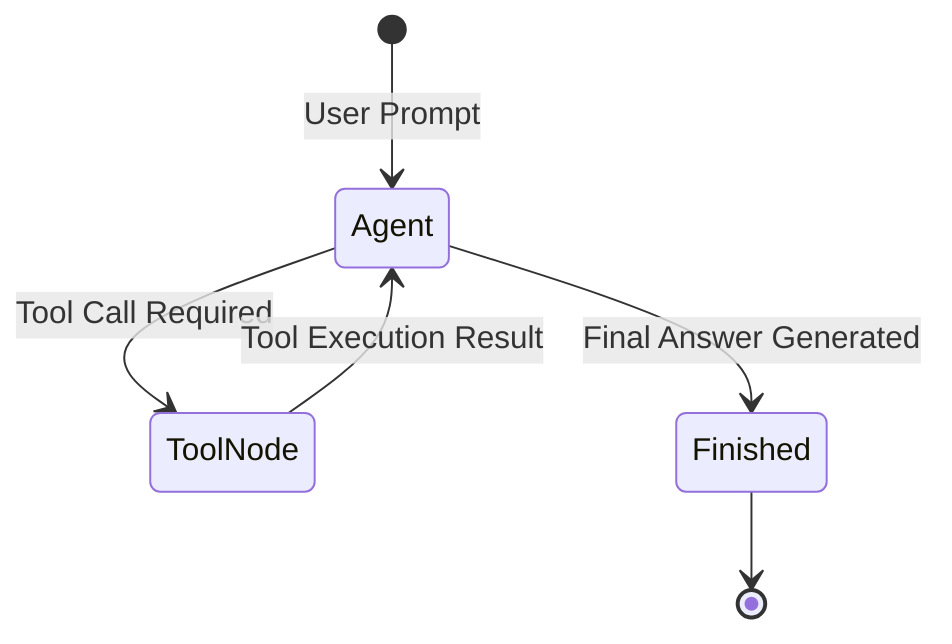

# 📹 Sequential Workflows in LangGraph ｜ Agentic AI using LangGraph

<div className="video-card" style={{border: '1px solid #30363d', borderRadius: '8px', padding: '16px', marginBottom: '24px', background: 'rgba(56, 139, 253, 0.05)'}}>
  <div style={{display: 'flex', gap: '16px', flexWrap: 'wrap'}}>
    <div><strong>Instructor:</strong> Nitish Singh (CampusX)</div>
    <div><strong>Duration:</strong> 49m 13s</div>
    <div><strong>Playlist:</strong> Agentic AI with LangGraph (CampusX)</div>
    <div><strong>Watch Link:</strong> <a href="https://www.youtube.com/watch?v=bAWujyAl1Kk" target="_blank" rel="noopener noreferrer">YouTube Lecture ↗</a></div>
  </div>
</div>

## 📌 Executive Summary & Learning Objectives

This lecture covers **Sequential Workflows in LangGraph ｜ Agentic AI using LangGraph**, focusing on production implementations, edge cases, and industry standards:
- Core intuition, architecture, and underlying mechanisms.
- Key differences between theoretical research implementations and scalable enterprise patterns.
- Concrete Python walkthroughs, error recovery, and performance optimization.

---

## 🏗️ Architecture & Conceptual Workflow



---

## 📖 Core Concepts & Technical Deep Dive

### 1. Architectural Foundations
In modern production AI engineering, **Sequential Workflows in LangGraph ｜ Agentic AI using LangGraph** is essential for ensuring reliability, low latency, and deterministic outcomes. As AI systems evolve from naive prompt-in / completion-out scripts into distributed systems, engineers must handle:
- **State management & consistency:** Ensuring intermediate states and tool invocations are tracked.
- **Error boundaries & recovery:** Graceful degradation when external LLMs or vector stores encounter rate limits or network partitions.
- **Resource utilization & cost efficiency:** Caching common queries and reducing unnecessary foundation model token expenditure.

### 2. Operational Considerations
- **Latency Optimization:** Pre-computing embeddings, utilizing asynchronous non-blocking event loops, and streaming tokens via Server-Sent Events (SSE).
- **Security & Sandboxing:** Validating inputs before ingestion, sanitizing LLM outputs, and isolating tool execution environments.

---

## 💻 Production Implementation Walkthrough

```python
from typing import TypedDict, Annotated, List
from langgraph.graph import StateGraph, END
import operator

# 1. Define State Schema
class AgentState(TypedDict):
    messages: Annotated[List[str], operator.add]
    next_step: str

# 2. Define Node Functions
def analyze_input(state: AgentState):
    print("Analyzing query...")
    return {"messages": ["Query analyzed."], "next_step": "generate"}

def generate_response(state: AgentState):
    print("Generating response...")
    return {"messages": ["Final response generated."], "next_step": "end"}

# 3. Build StateGraph
workflow = StateGraph(AgentState)
workflow.add_node("analyze", analyze_input)
workflow.add_node("generate", generate_response)

workflow.set_entry_point("analyze")
workflow.add_edge("analyze", "generate")
workflow.add_edge("generate", END)

app = workflow.compile()
output = app.invoke({"messages": ["Hello Agent"], "next_step": ""})
print(output)
```

---

## 💡 Production Best Practices & Tips

:::tip Production Deployment Guideline
When deploying Sequential Workflows in LangGraph ｜ Agentic AI using LangGraph in enterprise environments, always configure automated retries with exponential backoff and telemetry tracing (such as OpenTelemetry or LangSmith).
:::

:::warning Common Failure Modes
Watch out for state contamination across concurrent requests. Ensure each session or user interaction uses an isolated thread ID or execution context.
:::

---

## 🎯 Key Takeaways & Quick Reference

| Dimension | Production Standard | Pitfall to Avoid |
| :--- | :--- | :--- |
| **Execution** | Async / Non-blocking with timeouts | Synchronous blocking calls in event loops |
| **Data Validation** | Strict Pydantic v2 schemas | Untyped dictionary access |
| **Monitoring** | Distributed tracing & latency percentiles | Relying only on standard console logs |

## ⏱️ Lecture Timeline & Key Topics

| Timestamp | Key Topic / Concept Discussed |
| :--- | :--- |
| **00:00:00** | हाय गाइज़, माय नेम इज नितेश एंड यू आर... |
| **00:11:42** | ऑब्जेक्ट बनाते टाइम इनपुट में अपना स्टेट... |
| **00:23:14** | स्ट्रिंग होगा। दिस इज़ द फर्स्ट चेंज दैट... |
| **00:35:53** | एंड गोल है कि हम लैंग ग्राफ को यूज़ करना... |
| **00:49:10** | में। बाय।... |


---

---

## 📜 Complete Lecture Transcript (English)

> **Language:** English | **Source:** `06 - Building Agents And Multi Agents With LangGraph- Part 3.en-orig.srt` | **Total Segments:** 17 | **Word Count:** ~6,309 words

<details>
<summary><b>Click to expand full chronological transcript (17 timestamped intervals)</b></summary>

#### ⏱️ [00:00 ➔ 00:02]

Hello all, my name is Krishna and welcome to my YouTube channel. So guys, we are going to continue the discussion with respect to agentic AI with langraph. Already in my previous video, I have uploaded a crash course on agentic AI with langraph along with MCP where we discussed how to work with AI agents, how to create a simple aentic application and many more thing. Then in the part two uh in this specific playlist we also discussed about debugging and monitoring uh how to how you can use lang and langraph studio for the debugging purpose. Now this is the part three of the video wherein we are going to build some amazing multiAI agents u wherein different different ai agents will be communicating with themselves to solve a complex workflow. Uh so we will be discussing like what are the different ways there is a technique like supervised techniques supervisor architecture technique there is hierarchical architecture techniques. So all the specific techniques we'll be discussing again this is a crash course on understanding how you can go ahead and build multiAI agents to solve a very complex workflow. I'll show you how the graph looks like with respect to the workflow. Now before I go ahead uh there's a quick announcement. There's one amazing batch on aentki and LM ops with industry ready projects and this batch is going to start from July 12th. You can just go ahead and explore this particular batch. The timing is nothing but 2 p.m. to 5:00 p.m. IST. Uh you can download the syllabus. You can even contact our counseling team. All right. All the information will be given in this particular page. Go ahead and check it now in in the description. So let me quickly go ahead and start working on our project. So if you remember already uh we discussed so many things, right? We have already covered uh basic chatbot, human assistant, debugging. Now inside my agents folder I'm actually going to create a multiAI agent. So if you have not followed this go ahead and check out the playlist uh because it is it is important uh how to specifically work with now uh what all things we are going to build. See building multiAI

#### ⏱️ [00:02 ➔ 00:04]

agents using lang graph. We will discuss about three important architecture which we'll be covering almost each and everything right. The first one is simple multiAI agent. Here independent AI agents will communicate uh will create and uh there will be a flow of information from one agent to the other agent. The second one is supervised multi-AI agents. So this is one of the diagram here you can see there will be a supervisor you know and this supervisor will be responsible in passing the flow either to the analyst researcher writer you know and then once the work is done it will go back the request will go back again to the supervisor right and then supervisor will go ahead and end the workflow right this is called a supervisor multiAI agents usually supervisor multi agents is being used in multiple companies right because let's say in construction company and all there will be a supervisor let's say for a specific work how many employees is needed he will decide he will send a task to that particular worker the worker will complete it and give the conclusion to the supervisor back then once the supervisor get that then supervisor thinks that still this needs to be done more it'll go ahead and give the other worker the same work right so like that it is third technique that we are going to discuss about is hieral AI agent architecture by covering all these specific three important architecture your multi-AI agents implement mentation using lang graph will be completed. Okay. So quickly I will go ahead and open my notebook file. As I said the first diagram if you remember this is my first diagram. So in the first diagram you can see that it is a simple multiAI agent wherein I have a start researcher and writer right. So all the specific things are there. Now as usual what I will do I will quickly go ahead and open my browser uh coding pad uh this VS code and if you remember all this particular code is already given. Okay, then the next step what I'm actually going to do is that I'm going to go ahead and import some of the libraries. So here you can go ahead and use hey if you want to use grock I will be using grock. So I hope everybody is very familiar with all

#### ⏱️ [00:04 ➔ 00:06]

these things right because at the end of the day we have discussed this a lot in the specific playlist. Okay. So we have imported almost all these things. So we have imported type date annotated list literal base message human message AI message system message. Then over here I will just go ahead and write chat chat grock since we are going to use the gro and I'll go ahead and execute it. So here it shows that uh there's some no module called as lang community. So what I will do I will open my terminal. I'll go to my command prompt and then I will just go ahead and write uv add um uv langen community. Right. So this is the library that we are going to specifically use it. So here you can see that the library has got updated. Now if I go ahead and execute it again, it is going to work absolutely fine. So these are the basic libraries here. What we are basically going to do is that we are building a simple multi- AI agent architecture. Okay. So simple multiAI agent architecture. Here we will be creating independent evidence. Right now as you know that we are going to also go ahead and use our gro API. So quickly I will go ahead and write like this import OS from env import load env. And I'll go ahead and write os.environ and here I will be using my grock API key and I've already showed you how you can go ahead and use this. So get env gro API key. Okay. So this is loaded. Okay. And uh we are good to go. Uh state graph create react agent each and everything is there. Um I also need to go ahead and import some more libraries like uh tavly search results. Tavly search results is also there you know. Uh let me just go ahead and import some more libraries over here. So these are the libraries that I will be requiring. Tool node state graph end message state

#### ⏱️ [00:06 ➔ 00:08]

so that it will be able to retain the message and memory saver. Okay. Now the first step is that if I really want to go ahead and develop this architecture I will start with a normal state in that state let's say I will say hey which is my next agent okay so what I will do I will just go ahead and create a state this is my state I will write class agent agent state and here I will go be inheriting my messages state and if you remember inside this messages state there will be one variable right which is called as messages right and with respect to that particular messages we will be able to you know insert some kind of generic information during the flow of the graph let me go ahead and create one more variable called as next agent and this will be a kind of string this indicates like which agent should go next right should go next so once this is done you'll be able to see that uh I am pretty much good with respect to this and uh this is what my class agent is. This is nothing but this is my state. So here we are defining the state. The state will have all the information which will be flowing throughout the graph. Right? Then the next thing is that I will just go ahead and define one sample tool. So I have already shown you in my previous video how to go ahead and define the sample tool. Okay. So the sample tool over here shows that um here we are going to create a tool which is called as search web and with respect to the search web uh you can see it is searching the web for the information. Okay. And then here we are using tably search results with max result is equal to three and we are doing the invoke. So this basically means this function is actually getting converted in the form of a tool. I will also go ahead and create another tool. See why I'm creating this two because this researcher will be doing a web search and then once the output comes it will

#### ⏱️ [00:08 ➔ 00:10]

be giving to the writer. The writer has to write the entire summary. Right? So for that I will create another tool which will be nothing but write summary. Write summary I have given some doc string and it is basically going to write summary of the findings findings. And here you can see content of top 500 uh values has been basically displayed in this particular summary. Okay. So these are the two tools that we are specifically creating. Okay. Now the next thing is that we need to go ahead and initialize our grock model. So for that you know we use langin.oremodel importit chat_model and then we are initializing the chat_model with grock lama 3.1 8 billion instant parameter. Okay. So here you can see my chat gro has been loaded and you know that in my OS.vironment environment. I have already created it right now. Based on this particular diagram, I have to create two agents. One is the research agent, researcher agent and one is a writer agent. The researcher agent work is very simple. Uh what it is going to do is that it is going to use the LLM along with the tool that is binded. The tool is nothing but web search. Okay. And with respect to that particular web search, whatever tavly search it is doing, this function will be doing that. Okay. And then with respect to all the response that we are getting it will be given to the writer. Writer goes ahead and write the summary. Okay. So here what I'll be doing I will be defining my researcher agent. So now I'm actually trying to copy paste the code over here so that you understand how things work right. Writing code is not that difficult. If you just understand it if you're seeing my crash course this will become very very easy. So the researcher agent function node function is basically created. Here we are going to take the state which is nothing but agent state. So here you can see I'm taking the last all the messages. I'm putting a system message. I'm saying hey you are a research assist assistant. Use the search web tool to find the information about the user request. So whatever user request is there we will be able to like

#### ⏱️ [00:10 ➔ 00:12]

we we have to use the search web tool in order to find out informations. Then we will go ahead and call lm with the tools. We'll write llm.bind tools. And here we are going to go ahead and write the search web. So that basically means the search web tool I'm going to use it over here. Then in the response you will be seeing that we can use this llm researcher_lm.invoke along with the system message plus messages and we'll get the response. In the response I'm just giving the value that message with respect to this response. The next agent we need to pass this particular value to the writer. Okay very simple. So here you'll be able to see that from the researcher it is going to the writer. Okay. So since we have created a variable called as next agent. So next agent will have the information where the flow needs to go. So this is one of the function that we created. Now you know that with respect to the writer I have to again go ahead and use this llm. So here you can see I've written definition writer agent. We have taken the state of message. We are adding the system message. We are saying that you're a technical writer. Review the conversation and create a clear concise summary of the findings. So here we are using llm lm.invoke of system message plus messages and we are returning this right. And after this you know the next agent will be end because according to this particular diagram it needs to go to the end. Okay. So once we do this then you'll be able to see that this is executed. Now you know that we also need to make sure to create some kind of tool nodes right because two tool nodes that we want to use is search web and write summary. So what we'll do we will create one tool executor node which is nothing but definition of execute tools. Okay. So this is the name of the tool. Here we are going to use the state is equal to agent state. We using the messages. We are taking the last message and we'll check whether it is a tool call or not. If it is a tool call then we are just going to go ahead and create a tool node with the search web and write summary and we are going to provide this response from the tool node.invoke and that response will be returning all the information. Right?

#### ⏱️ [00:12 ➔ 00:14]

And here after executing this tool we will be returning the state. If you have seen my crash course, this is pretty much simple. Okay. Now see whenever we go ahead and create the graph, the graph looks very simple, right? So what I will do, I will just try to create a you know the multi- aent graph so that you get a very clear idea like what we are going to specifically do. Okay. So for creating a graph, I will just go ahead and execute one very good function which I have actually created with a real llm. Okay. So here you can see create minimal multi- aent. Here we have defined the researcher node. Okay. Here we have defined the writer node. Okay. Like you are a researcher and all all the information is over here. Right. U see analyze the user question and provide detailed things. Okay. So instead of even calling this you know I I can just remove all the specific stuff right like how we have defined on the top right. So let me do one thing. Okay. Let me remove all these things. Okay. So here we are going to basically go ahead and call this. Okay. Um create this particular function and I'm going to go ahead and build the graph. So let's go ahead and build the graph. So even I don't have to call this. Let's say I will go ahead and build this graph. Okay. So I've created a state graph with messages state. The first thing is researcher node. Did I define a function of researcher node? So here you'll be able to see instead of writing researcher node I will write researcher agent okay so this is the researcher agent writer agent okay and then I have researcher researcher to writer writer to end and we are basically writing workflow final workflow and we are compiling and we returning this okay like I will just go ahead and display this final_workflow Okay. So once I execute it, this is what

#### ⏱️ [00:14 ➔ 00:16]

is the graph that has got created. Now in order to execute this, this is very simple. I will use the final workflow. Final workflow dot and here uh we just going to go ahead and invoke it. Now with respect to the invoke method, what information we need to pass? You know that we have to pass our input query in the messages variable. So I will go ahead and write messages colon. Let's say I will go ahead and write research about the use case of agentic AI in business. Okay. So if I go ahead and execute this here you'll be able to see that I'm able to get this information. See AI message summary. So let's let's go ahead and do this. Okay. So here I will just go ahead and uh write this in the response. This is my response. Okay. And with respect to the response uh dot response of messages. Okay. Uh I want the last one. So last one dot content. So if I go ahead and see based on the source results I have identified key related to the use case of this this this all the information is basically there. See it is basically getting displayed. You can also use pretty print to go ahead and display this. Okay. the entire information in short. But here you can see that quickly we have executed this. The reason we say this as a multiAI agent is because two nodes are communicating with each other, right? This node is probably doing a tool search getting the information and sending the next data to the writer, right? So this way we specifically go ahead and create this and uh we make sure to probably go ahead and implement it. So that is what uh we have discussed about a simple multi-Ajs. Now here you can see that one very major disadvantage is that from researcher to writer right from writer to researcher it cannot go back right what you can do is that you can go ahead and create a one more line from writer to researcher but do you think it'll it work properly

#### ⏱️ [00:16 ➔ 00:18]

you know because this will be always in a loop right either I can put a conditional edge and say that hey convert this writer into a tool node and whenever there is a requirement we go ahead and basically execute this okay so there are a lot of disadvantage with this you cannot develop a very efficient system u by just using a simple multiAI agent architecture. Here we are going to use a supervised multiAI agent architecture. So next one that we are basically going to discuss about is supervise. So supervised multi- AI agent architecture right so we are basically going to use this now the supervised multi- ai agent architecture let's say that first of all I will just go ahead and use this packages okay now you need to understand what we are basically going to do here we are going to create one supervisor node which will be having the control as soon as we get an input it should be deciding whether we need to pass it to the analyst or the researcher or the writer Right? Let's say if I go ahead and say hey supervisor you need to write a article on agentic AI then supervisor what it will do you know directly it can give it to the writer or directly it can give it to the researcher the researcher will then probably go ahead and give it to the writer for writing it. It'll do the research it'll do the writing. If supervisor says hey analyze this particular report and then you probably go ahead and write it for me right. So what will happen is the supervisor first needs to pass to the analyst and then analyst will pass it to the writer. So we will try to create this kind of system wherein supervisor can completely um you know like everybody's dependent on the task that is provided by the supervisor a very efficient way with respect to defining things right so what I'm actually going to do I will first of all go ahead and create a state definition so in this state definition inside this messages state if I just go ahead and write f12 okay here you'll be able to see that inside this there will be a message variable along with this I will give information like current state agent task assignments Okay, it will be a dictionary string list of string. Okay, track what each agent should do. Let's say there are

#### ⏱️ [00:18 ➔ 00:20]

multiple tasks that I want to assign with every agent. So, we can probably convert that into a dictionary. Then you have this agent outputs. Now, with respect to the agent outputs here, you'll be able to see quickly that uh there will be an str of any right it stores the output for each agents. Then there will be something called as workflow stage. we can probably go ahead and assign with respect to the workflow. Okay. And uh here also you will be able to see this right and similarly you can go ahead and use with respect to maximum iteration final output and all this information is already there. Okay. So these are some of the information that I'm actually going to create in my state. Okay. So uh let's go ahead and quickly uh as you know that we have already done the imple uh importing u we already have the llm. Now uh what I'm actually going to do let me just make some changes on this. Instead of using uh current agent I will use next agent something like this. Okay. So this will basically be my state definition. Next agent research data analysis final report task complete current task. So here you can see that very simple u which is the next agent. This will decide research data what research needs to be done analysis final report task complete and current task. Okay. Now what we are basically going to do is that first of all you know that uh we need to create some kind of chain. Okay. And this chain I will create it as a supervisor chain. Now you'll understand what will be the importance of this. Okay. So here you can see supervisor with grock lm. I'm creating a supervisor chain. It creates a supervisor decision chain. Here I'm going to use a supervisor prompt. It is saying that hey you are a supervisor managing a team of agents. There are three agents that we are managing. Researcher gathers information and data. Analyst analyzes data and provide insights. Create reports and summaries. So this three agents I really want to work in a sync. You know they need to be communicating with each other. Based on the current state and conversation decide which agent should work next. If the task is

#### ⏱️ [00:20 ➔ 00:22]

complete respond with done. So here you'll be able to see current state and uh it has information like has research has analysis has report. So this is like this will be like a boolean variable whether uh the current state whether the research data is created or not whether the analysis data is created or not. So here we will just go ahead and uh you know put some boolean values and based on that we'll respond whether the agent name with the agent name like whether it is researcher analyst or writer. Let's say if this is false then obviously um you know we are just going to make sure to not give this particular agent and we if all these reports has been completed we'll just say done right that will actually end a task and here you can see with respect to the human it is asking the task and this is my prompt this is my LLM which is integrated in a chain right so this is my entire supervisor chain I will show you how we can go ahead and execute this okay first of all let me make some code cell so very simple It is just a simple prompt what this specific chain is basically doing based on the current state and government decides which agent should work next. If this is given then the next should be this. If this is given then the next should be done. Right? So one by one. Okay. Now what I'm actually going to do uh this is a kind of chain. The next step is that we will go ahead and create our entire supervisor node. Okay. Now supervisor agent node will be doing all the specific task. Supervisor decide next agent using grock lm. Okay. First of all we take the messages of the state. We take the last message. If there is a message we say it. Otherwise we say there is no task that is given. Right. As soon as the input is given from the user, we are just going to read that particular input and we are going to consider it as a task. If the input is not given, we will consider it as no task. Then we will just go ahead and see whether inside this research data variable whether there is something or not. If it is nothing if if this is nothing if this is nothing then we can put some kind of conditions. So here we

#### ⏱️ [00:22 ➔ 00:24]

are just checking what has been what task has been completed. Okay. Then we have get llm decision. We will go ahead and create that same supervisor chain and then we will make a decision. The task will be having the task value. This will be having the boolean value. This will be having the boolean value and this will be having the boolean value. Right? If all these boolean values is done, we will just go ahead and take the decision text. Okay, if it is done right and uh if it if the decision text is done or it has done or it says that the it also has the has report that basically means we need to go ahead and end the workflow. If there is researcher in this decision test then the next agent should be researcher and the supervisor message should be let's start with the research assigning to the researcher. Okay, if it is analyst then supervisor research is done, time for analysis and assigning to the analyst. If it is writer then you have to do the same thing. You have to pass it to the writer. If it is next agent is end you have to basically complete the task right and that is how you are returning all the values with respect to messages next agent and current task. So this is this when happens you know when the control is given back to the supervisor. Let's say if any of the subtask is completed, it will be given back to the supervisor, right? And when things are given back to the supervisor, then what will happen is that you'll be able to see the supervisor has to run that particular functionality again to return what is there, right? So this is with respect to the supervisor agent. Okay, supervisor agent. I know there is a lot of code but just follow this because here I don't have to write much code to make you understand because it is more about a flow, right? Then let's say the first important agent that you have is nothing but writer. Okay. So with respect to the writer agent here you can see a writer uses grock to create a final report. Okay. So this is basically going to create a final report. Uh supervisor agent is basically going to pass information. Okay. Uh and then after writer you can also go ahead and create different different uh systems in

#### ⏱️ [00:24 ➔ 00:26]

short. Right. Now um here with respect to the writer see uh let's see whether we have created the researcher agent or not. Okay research agent in just a second. Okay first of all let's discuss about a writer report. Okay, the writer agent what it does it takes the research data which is given from the uh researcher right it takes the analysis data which is given from the research and it takes the current task right and then it it we are going to write the prof report as a sorry a prompt as a professional writer create an exclusive report based on this particular task the research finding is this the analysis finding is this we're going to create a well ststructured document with all this information okay and then we are going to do llm invoke we are going to take the content and then finally we are going to create a final report on that with respect to date all these things and we are returning this particular value over here. What will be our next agent because as soon as the writer writes it, it will be sent back to the supervisor. Then the supervisor checks whether all the conditions are finished or not. Okay. And then it will probably go ahead and do it. So guys, now the writer uh writer functionality is done with respect to the agent. Now let's go ahead and create the research agent. Okay. And with respect to the researcher agent, it is very simple what we really need to do. So I will make a code cell again over here. Okay. And this is my research agent. Researcher agent will get the current task or the research topic. Okay. Then as a research specialist, we have just written a simple prompt and then we are going to probably go ahead and get a response. Okay. And then here you'll be able to see I've completed the research on this particular task and we are able to return this with respect to the research data. next agent and all remember researcher agent should given give us back the research data right and finally you have this particular uh data itself let's say in 21 something is wrong what is this cell 21 let's see uh return let's see let's see unexpected indent

#### ⏱️ [00:26 ➔ 00:28]

where it is [Music] to be precise let Let me check. Oh, just a second guys. I am just trying to fix this. Okay, now it looks good. There was some indentation issues with respect to this particular text. Okay, now agent is there. You also have a writer. Now only the thing that is pending is basically your uh analyst agent, right? So now for the analyst agent what you can actually do is that you can again go ahead and write your own analyst agent whatever agent specifically you have. Okay. And for that I will go ahead and create my another function. Okay. Similarly see now I hope you have got an idea like how each and everything is working. There are three agents that I'm creating analyst agent and all. See in the analyst agent we are taking the research data. We are taking the current task. We are analyzing it based on this particular prompt. We are saying that hey provide key insights and patterns and then finally we are invoking it and then we are getting the response content and then we are going and uh providing this back. Okay. So all these things has done. I have all these three agents created. Now it's time that we go ahead and build our uh router function. Uh now again uh router function it depends on what how you specifically want to route uh because based on a specific condition you need to route from one to other. So here I have written router over here it is taking the supervisor state literal supervisor researcher analyst writer and end. Okay it routes to the next agent based on the state state.get next agent supervisor. So here you can see that we getting the next agent. If it is not next agent then it'll go back to the

#### ⏱️ [00:28 ➔ 00:30]

supervisor by default. If next agent is end we are going to end it. If the next agent is either supervisor, researcher, analyst or writer, we are just going to give it to the next agent. Otherwise we are going to return it to the supervisor. Now perfect. This is done. Now we just have to go ahead and create our workflow. Now for creating the workflow we will be using this simple technique. Please remember the di diagram and graph that we had specifically used. Right? So first of all I'm going to create a workflow supervisor state. Uh then you have this add node supervisor supervisor agent then researcher research agent analyst analyst agent writer writer agent. Set entry will be from supervisor. If node in all these four then we're going to add a conditional edge. The conditional edge is very simple. Either it should go to supervisor or it should go to researcher. from researcher again it should go back to the supervisor right so from supervisor to supervisor should be there from researcher to researcher should be there from analyst to analyst is there writer to writer is there right so that kind of routing we have to specifically do and finally we're ending it okay and then here I will go ahead and write my graph graph is equal to workflow dot compile okay and then you will be able to see if I just go ahead and display my graph the same report will get created And this is the report that I was actually talking about from start to supervisor, analyst, researcher, writer. Now this graph can play a very important role right with respect to this. So what we can actually do is that always remember once this graph is created you understand the entire flow how the execution basically happens. Now after this we will just go ahead and invoke this particular graph and I will say hey graph.invoke and I will write hey what are the benefits and risks of AI in healthcare? Let's say if this is the question uh you are seeing that chat prompt template is not defined. No worries. Uh if chat prompt template is not defined we can directly go ahead and use it. Okay. So I think chat prompt

#### ⏱️ [00:30 ➔ 00:32]

template. Let me just do the Google search. Okay template where it is exactly. Just a second guys. I'm just doing the Google on the right hand side so that you should be able to see this. Okay. M chat. I'm just searching it. So here is my chart prompt template. No worries. I will just quickly execute this now. Now I will invoke it. Now here you can see that quickly I'm able to see the output. So finally here you can see that find graph invoke first it goes to the researcher then analyst then writer right and you can see the final report is basically over here. So if I just go ahead and create a response okay and uh with respect to the response if I just go ahead and display it. Okay. And if I just go ahead and see the final report, I should be able to see to it. Okay. Now, here is the final report generated. All this information is over here. I will provide a generic analysis. This this is the task of the writer at the end of the day, right? And uh this is what we have specifically discussed about supervisor multiAI agents. Now, similarly guys, I will give you one assignment. Please try to also follow some kind of hierarchal AI agent architecture. When we say about hierarchal right, one thing you have to keep in mind, right? There will be some kind of hierarchy when you are executing this. Okay, when you are executing this, there will be some kind of hierarchy. Now, with respect to the hierarchy, I am just going to go ahead and provide you some explanation so that you can try this. Okay? And this should be one task from you. Please try to go ahead and do

#### ⏱️ [00:32 ➔ 00:32]

this. Okay. So here let's say how to organize agents in teams with team leader. Let's say CEO is there. Any task that comes to CEO, CEO should decide whether we need to give it to the research team leader or the writing team leader. Okay. Let's say the it goes to the research team leader. Then the research team leader should make the data researcher do the work. Market researcher to do the work. Once this work is done, it should go back to the CEO and from CEO it should go back to the writing team leader with respect to the technical writer and sub uh summary writer. So my my main task or ask is over here that please try to just go ahead and follow this and try to implement it and see let's see that how you'll be able to do it. So yes this was it from my side. I'll see you in the next video. Have a great day. Thank you and all. Take care. You can also go ahead and check out the in the description of this particular video. We are soon coming up with this agent AI with a little mouse patch which will be very very beneficial for you. So thank you. This was it. I'll see you in the next video. Bye-bye.

</details>
