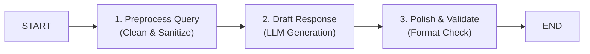

# 📹 Sequential Workflows in LangGraph

<div className="video-card" style={{border: '1px solid #30363d', borderRadius: '8px', padding: '16px', marginBottom: '24px', background: 'rgba(56, 139, 253, 0.05)'}}>
  <div style={{display: 'flex', gap: '16px', flexWrap: 'wrap'}}>
    <div><strong>Instructor:</strong> Nitish Singh (CampusX)</div>
    <div><strong>Duration:</strong> 2953</div>
    <div><strong>Course:</strong> Module 4: Agentic AI & LangGraph</div>
    <div><strong>Watch Link:</strong> <a href="https://www.youtube.com/watch?v=bAWujyAl1Kk" target="_blank" rel="noopener noreferrer">YouTube Lecture ↗</a></div>
  </div>
</div>

## 📌 Executive Summary

Sequential workflows represent linear multi-step processing pipelines where the output of Node A forms the direct input context for Node B. In production AI systems, sequential graphs structure multi-stage pipelines: query preprocessing -> retrieval -> drafting -> editorial critique.

This guide explores linear graph chaining, state propagation, and step-by-step intermediate state inspection.

---

## 🏗️ System Architecture & Execution Flow



---

## 📖 Core Concepts & Technical Deep Dive

### 1. Sequential Multi-Stage Processing
Rather than asking a single LLM prompt to perform five distinct tasks simultaneously, sequential graphs decouple concerns into dedicated nodes, reducing hallucination rates and allowing individual step retries.

### 2. State Mutation Across Sequential Steps
Each node receives the accumulated state dictionary and returns only the keys it modified, which LangGraph merges into the global state before invoking the next node in the pipeline.

---

## 💻 Production Implementation

```python
from typing import TypedDict
from langgraph.graph import StateGraph, START, END

class DocumentPipeline(TypedDict):
    raw_text: str
    cleaned_text: str
    summary: str
    sentiment: str

def clean_node(state: DocumentPipeline):
    return {"cleaned_text": state["raw_text"].strip().lower()}

def summarize_node(state: DocumentPipeline):
    return {"summary": f"Summary of: {state['cleaned_text'][:30]}..."}

def sentiment_node(state: DocumentPipeline):
    return {"sentiment": "POSITIVE"}

builder = StateGraph(DocumentPipeline)
builder.add_node("clean", clean_node)
builder.add_node("summarize", summarize_node)
builder.add_node("sentiment", sentiment_node)

builder.add_edge(START, "clean")
builder.add_edge("clean", "summarize")
builder.add_edge("summarize", "sentiment")
builder.add_edge("sentiment", END)

pipeline = builder.compile()
output = pipeline.invoke({"raw_text": "System performance is optimal across all nodes."})
print(output)
```

---

## ⚙️ Production Gotchas & Best Practices

:::tip Step Modularity
Keep node functions narrow in scope. A node should perform one logical operation (e.g. summarize, translate, or validate) to make debugging straightforward.
:::

:::warning State Pollution
Avoid storing large ephemeral intermediate objects in state unless needed by downstream nodes. Prune temporary scratchpad keys to keep state size small.
:::

---

## 📊 Architectural Reference & Comparison

| Step | Input Key | Output Key | Responsibility |
| :--- | :--- | :--- | :--- |
| **Clean** | `raw_text` | `cleaned_text` | Normalization & sanitization |
| **Summarize**| `cleaned_text` | `summary` | Core reasoning & condensation |
| **Validate** | `summary` | `sentiment` / `status` | Guardrail and contract check |

---

## 📚 Key Takeaways & Enterprise Checklist

- [ ] **Architecture Verification:** Ensure your design addresses latency, decoupled interfaces, and strict data validation contracts.
- [ ] **Deterministic Testing:** Run unit tests and golden dataset evaluations before shipping changes to staging or production.
- [ ] **Security & Observability:** Enforce input/output guardrails, scrub sensitive credentials/PII, and capture distributed traces.
- [ ] **Scalability & Sizing:** Calibrate model parameters, context limits, and compute instance requirements against projected request concurrency.
