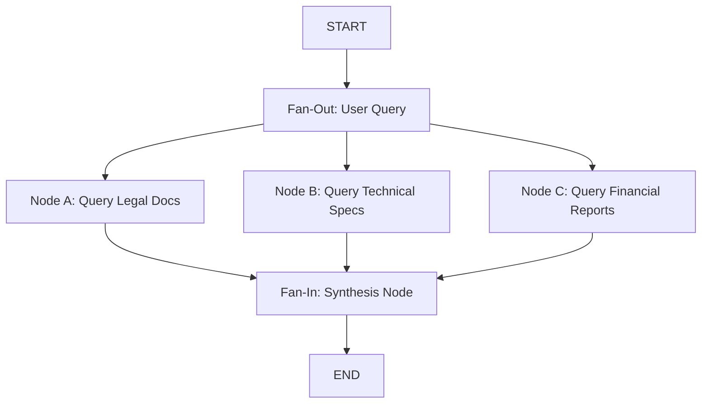

# 📹 Parallel Workflows in LangGraph

<div className="video-card" style={{border: '1px solid #30363d', borderRadius: '8px', padding: '16px', marginBottom: '24px', background: 'rgba(56, 139, 253, 0.05)'}}>
  <div style={{display: 'flex', gap: '16px', flexWrap: 'wrap'}}>
    <div><strong>Instructor:</strong> Nitish Singh (CampusX)</div>
    <div><strong>Duration:</strong> 3569</div>
    <div><strong>Course:</strong> Module 4: Agentic AI & LangGraph</div>
    <div><strong>Watch Link:</strong> <a href="https://www.youtube.com/watch?v=O6ryuSpqdOw" target="_blank" rel="noopener noreferrer">YouTube Lecture ↗</a></div>
  </div>
</div>

## 📌 Executive Summary

Parallel workflows execute multiple independent computation nodes concurrently from a single upstream branch point (Fan-Out) and synchronize their results into a single downstream node (Fan-In).

This lesson explores concurrent node scheduling, asynchronous execution, fan-in state merging, and optimizing I/O-heavy operations (such as querying multiple databases simultaneously).

---

## 🏗️ System Architecture & Execution Flow



---

## 📖 Core Concepts & Technical Deep Dive

### 1. Fan-Out & Fan-In Concurrency
When a node branches to multiple target edges without conditional routing, LangGraph schedules all child nodes concurrently. LangGraph automatically waits for all parallel branches to complete before executing downstream fan-in nodes.

### 2. State Merging with Reducers
If multiple parallel nodes attempt to write to the same state key, LangGraph requires a reducer function (`operator.add`) to resolve how values are merged; otherwise, a write collision error occurs.

---

## 💻 Production Implementation

```python
from typing import TypedDict, Annotated, List
from langgraph.graph import StateGraph, START, END
import operator

class MultiSourceState(TypedDict):
    query: str
    results: Annotated[List[str], operator.add]
    final_summary: str

def search_web(state: MultiSourceState):
    return {"results": ["Web source: Latency is 12ms."]}

def search_db(state: MultiSourceState):
    return {"results": ["Database source: 42 active clusters."]}

def synthesize(state: MultiSourceState):
    return {"final_summary": f"Merged {len(state['results'])} sources successfully."}

builder = StateGraph(MultiSourceState)
builder.add_node("web", search_web)
builder.add_node("db", search_db)
builder.add_node("synthesize", synthesize)

builder.add_edge(START, "web")
builder.add_edge(START, "db")
builder.add_edge("web", "synthesize")
builder.add_edge("db", "synthesize")
builder.add_edge("synthesize", END)

app = builder.compile()
output = app.invoke({"query": "Check infrastructure health", "results": []})
print(f"Aggregated Results: {output['results']}")
print(f"Final Output: {output['final_summary']}")
```

---

## ⚙️ Production Gotchas & Best Practices

:::tip Concurrency Latency Reduction
Always parallelize independent external network calls. Running 3 vector queries in parallel drops overall pipeline latency from 3x to 1x.
:::

:::warning Branch Write Collisions
Never write to an un-annotated state key from two parallel branches simultaneously. Always attach a reducer like `Annotated[List[T], operator.add]` to resolve concurrent writes.
:::

---

## 📊 Architectural Reference & Comparison

| Workflow Type | Concurrency | Synchronization | State Handling |
| :--- | :--- | :--- | :--- |
| **Sequential** | 1 node at a time | Automatic | Direct overwrite allowed |
| **Parallel (Fan-Out)**| $N$ nodes concurrently | Waits for slowest node | Requires reducer on shared keys |
| **Conditional** | 1 chosen branch | Instant | Single active branch |

---

## 📚 Key Takeaways & Enterprise Checklist

- [ ] **Architecture Verification:** Ensure your design addresses latency, decoupled interfaces, and strict data validation contracts.
- [ ] **Deterministic Testing:** Run unit tests and golden dataset evaluations before shipping changes to staging or production.
- [ ] **Security & Observability:** Enforce input/output guardrails, scrub sensitive credentials/PII, and capture distributed traces.
- [ ] **Scalability & Sizing:** Calibrate model parameters, context limits, and compute instance requirements against projected request concurrency.
