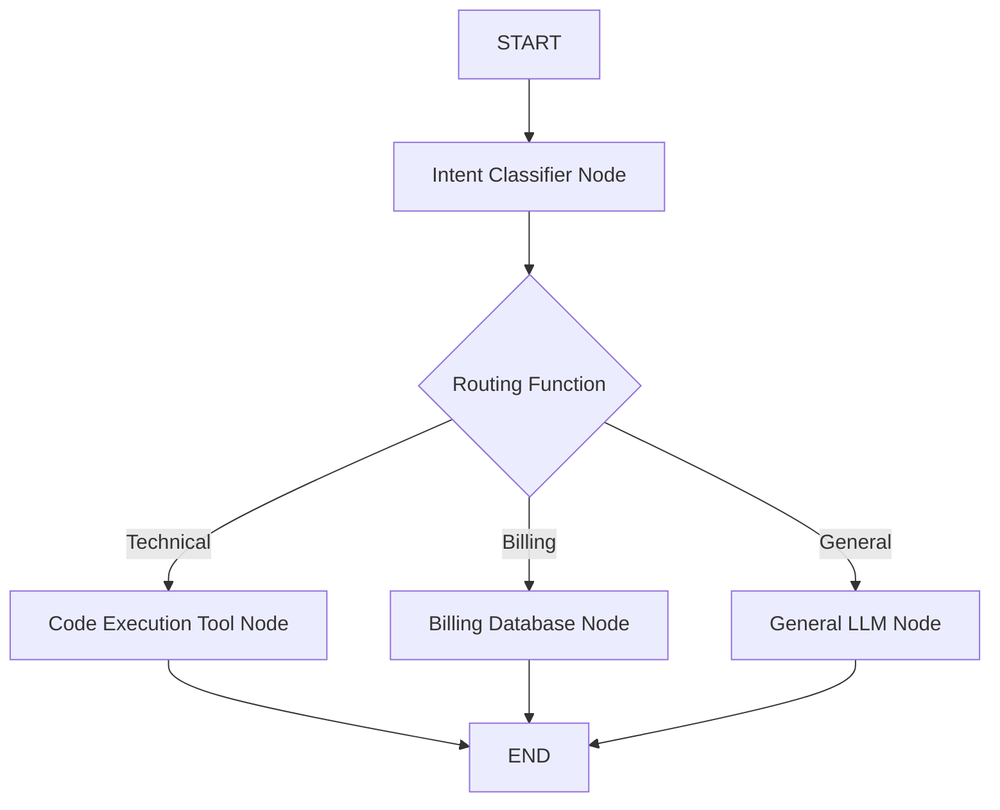

# 📹 Conditional Workflows in LangGraph

<div className="video-card" style={{border: '1px solid #30363d', borderRadius: '8px', padding: '16px', marginBottom: '24px', background: 'rgba(56, 139, 253, 0.05)'}}>
  <div style={{display: 'flex', gap: '16px', flexWrap: 'wrap'}}>
    <div><strong>Instructor:</strong> Nitish Singh (CampusX)</div>
    <div><strong>Duration:</strong> 2858</div>
    <div><strong>Course:</strong> Module 4: Agentic AI & LangGraph</div>
    <div><strong>Watch Link:</strong> <a href="https://www.youtube.com/watch?v=I-dvZqTz-Wc" target="_blank" rel="noopener noreferrer">YouTube Lecture ↗</a></div>
  </div>
</div>

## 📌 Executive Summary

Conditional workflows introduce dynamic decision routing into agent systems. Based on the evaluation of intermediate state, runtime classifiers route execution to specialized nodes (e.g. routing technical questions to Python code runners and billing questions to Stripe API tools).

This guide covers conditional edge definition, routing functions, mapping route keys to node names, and handling default fallback routes.

---

## 🏗️ System Architecture & Execution Flow



---

## 📖 Core Concepts & Technical Deep Dive

### 1. Conditional Edge Architecture
Conditional edges take three parameters:
`builder.add_conditional_edges(source_node, routing_function, path_map)`
- `source_node`: The node whose completion triggers the evaluation.
- `routing_function`: A function that inspects state and returns a string key (e.g. `"billing"`).
- `path_map`: A dictionary mapping the returned string key to the target node name.

### 2. Defending Against Unmapped Routes
If the routing function returns a key not present in `path_map`, LangGraph raises a runtime exception. Always include a default fallback route (e.g. `"general": "general_node"`).

---

## 💻 Production Implementation

```python
from typing import TypedDict
from langgraph.graph import StateGraph, START, END

class TriageState(TypedDict):
    user_query: str
    category: str
    response: str

def classify_intent(state: TriageState):
    query = state["user_query"].lower()
    if "invoice" in query or "charge" in query:
        return {"category": "billing"}
    elif "api" in query or "bug" in query:
        return {"category": "technical"}
    return {"category": "general"}

def route_intent(state: TriageState) -> str:
    return state["category"]

builder = StateGraph(TriageState)
builder.add_node("classifier", classify_intent)
builder.add_node("billing_node", lambda s: {"response": "Connecting to Stripe billing support."})
builder.add_node("tech_node", lambda s: {"response": "Forwarding to engineering issue tracker."})
builder.add_node("general_node", lambda s: {"response": "Standard support team is reviewing."})

builder.add_edge(START, "classifier")
builder.add_conditional_edges(
    "classifier",
    route_intent,
    {
        "billing": "billing_node",
        "technical": "tech_node",
        "general": "general_node"
    }
)
builder.add_edge("billing_node", END)
builder.add_edge("tech_node", END)
builder.add_edge("general_node", END)

app = builder.compile()
print(app.invoke({"user_query": "I have an unexpected charge on my invoice."}))
```

---

## ⚙️ Production Gotchas & Best Practices

:::tip Explicit Path Mapping
Always provide the `path_map` dictionary explicitly rather than relying on dynamic node string matching. Explicit maps make graph topology visible in visualization diagrams.
:::

:::warning Router Function Purity
Keep router functions side-effect free. Router functions should only inspect state and return a routing key; never perform network calls or mutate state inside a routing function.
:::

---

## 📊 Architectural Reference & Comparison

| Parameter | Type | Description |
| :--- | :--- | :--- |
| `source` | `str` | Node after which routing occurs |
| `path` | `Callable[[State], str]` | Evaluation function returning route key |
| `path_map` | `Dict[str, str]` | Maps returned key to destination node |

---

## 📚 Key Takeaways & Enterprise Checklist

- [ ] **Architecture Verification:** Ensure your design addresses latency, decoupled interfaces, and strict data validation contracts.
- [ ] **Deterministic Testing:** Run unit tests and golden dataset evaluations before shipping changes to staging or production.
- [ ] **Security & Observability:** Enforce input/output guardrails, scrub sensitive credentials/PII, and capture distributed traces.
- [ ] **Scalability & Sizing:** Calibrate model parameters, context limits, and compute instance requirements against projected request concurrency.
