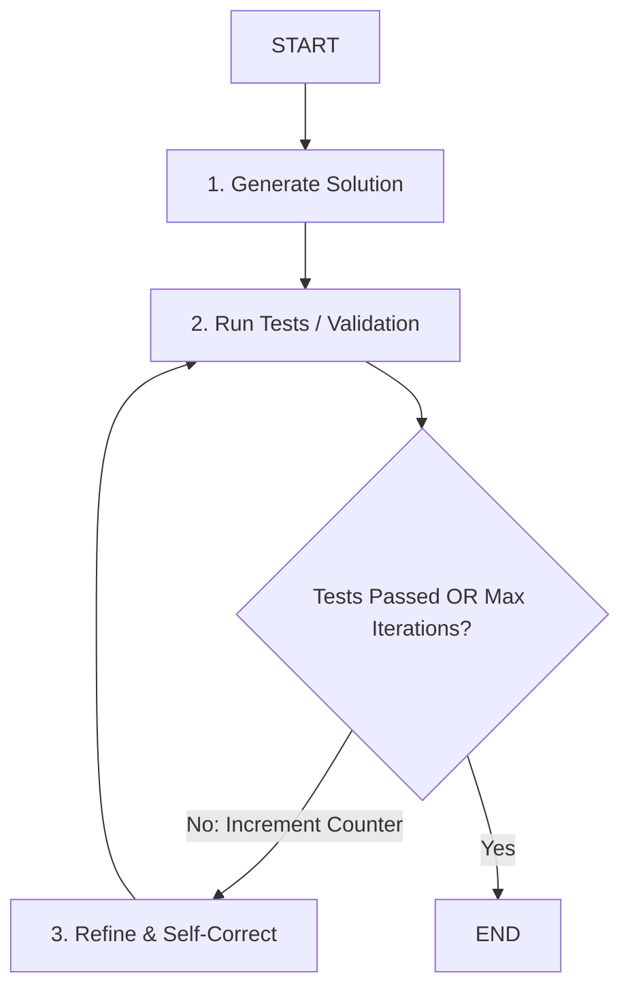

# 📹 Iterative Workflows in LangGraph

<div className="video-card" style={{border: '1px solid #30363d', borderRadius: '8px', padding: '16px', marginBottom: '24px', background: 'rgba(56, 139, 253, 0.05)'}}>
  <div style={{display: 'flex', gap: '16px', flexWrap: 'wrap'}}>
    <div><strong>Instructor:</strong> Nitish Singh (CampusX)</div>
    <div><strong>Duration:</strong> 2234</div>
    <div><strong>Course:</strong> Module 4: Agentic AI & LangGraph</div>
    <div><strong>Watch Link:</strong> <a href="https://www.youtube.com/watch?v=7CbSqrovcsE" target="_blank" rel="noopener noreferrer">YouTube Lecture ↗</a></div>
  </div>
</div>

## 📌 Executive Summary

Iterative workflows (loops) allow AI agents to iteratively refine outputs, execute code, observe compiler errors, rewrite code, and re-test until all unit tests pass or a maximum iteration threshold is reached.

This lesson explores cycle formation in state graphs, maintaining loop counters in state, convergence criteria, and preventing infinite loops with recursion limits.

---

## 🏗️ System Architecture & Execution Flow



---

## 📖 Core Concepts & Technical Deep Dive

### 1. The Power of Self-Correction
Single-pass generation frequently introduces subtle bugs. Iterative loops provide agents with execution feedback (e.g. unit test tracebacks), allowing the model to analyze its error and fix it autonomously.

### 2. Convergence & Bounded Loops
Every iterative graph MUST include:
- A clear stopping criterion (e.g. `tests_passed == True`).
- An integer `iteration` counter incremented on every pass.
- A hard ceiling (e.g. `iteration >= 5`) routing to `END` with an explanation if convergence fails.

---

## 💻 Production Implementation

```python
from typing import TypedDict
from langgraph.graph import StateGraph, START, END

class CodeFixState(TypedDict):
    code: str
    error: str
    iteration: int
    is_valid: bool

def test_code(state: CodeFixState):
    iter_num = state.get("iteration", 0) + 1
    # Mocking self-correction on iteration 2
    passed = iter_num >= 2
    err = "" if passed else "SyntaxError: missing colon on line 4"
    return {"iteration": iter_num, "is_valid": passed, "error": err}

def fix_code(state: CodeFixState):
    print(f"--- ATTEMPTING FIX (ITERATION {state['iteration']}) ---")
    return {"code": "def solve(): return True"}

builder = StateGraph(CodeFixState)
builder.add_node("tester", test_code)
builder.add_node("fixer", fix_code)

builder.add_edge(START, "tester")
builder.add_conditional_edges(
    "tester",
    lambda state: "end" if (state["is_valid"] or state["iteration"] >= 3) else "fix",
    {"fix": "fixer", "end": END}
)
builder.add_edge("fixer", "tester")

app = builder.compile()
print(app.invoke({"code": "def solve()", "iteration": 0, "is_valid": False, "error": ""}))
```

---

## ⚙️ Production Gotchas & Best Practices

:::tip Guardrail Counter in State
Track `iteration_count` directly in the graph state rather than relying solely on global variables to ensure thread safety across concurrent user sessions.
:::

:::warning Recursion Limit Configuration
Set `recursion_limit` in the runtime config (`app.invoke(inputs, config={"recursion_limit": 50})`) to provide an infrastructure safety net against infinite loops.
:::

---

## 📊 Architectural Reference & Comparison

| Loop Component | Role | Failure Consequence |
| :--- | :--- | :--- |
| **Feedback Node** | Gathers error trace | Model cannot deduce why it failed |
| **Iteration Counter** | Tracks attempt count | Runaway infinite loops |
| **Exit Condition** | Routes to END on success | Wasted tokens after task is complete |

---

## 📚 Key Takeaways & Enterprise Checklist

- [ ] **Architecture Verification:** Ensure your design addresses latency, decoupled interfaces, and strict data validation contracts.
- [ ] **Deterministic Testing:** Run unit tests and golden dataset evaluations before shipping changes to staging or production.
- [ ] **Security & Observability:** Enforce input/output guardrails, scrub sensitive credentials/PII, and capture distributed traces.
- [ ] **Scalability & Sizing:** Calibrate model parameters, context limits, and compute instance requirements against projected request concurrency.
