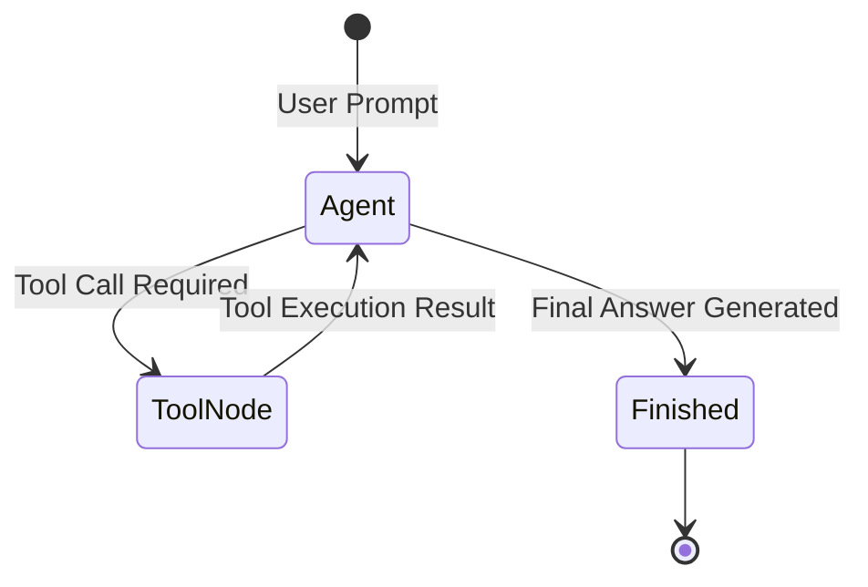

# 📹 Persistence in LangGraph ｜ Time Travel in LangGraph

<div className="video-card" style={{border: '1px solid #30363d', borderRadius: '8px', padding: '16px', marginBottom: '24px', background: 'rgba(56, 139, 253, 0.05)'}}>
  <div style={{display: 'flex', gap: '16px', flexWrap: 'wrap'}}>
    <div><strong>Instructor:</strong> Nitish Singh (CampusX)</div>
    <div><strong>Duration:</strong> 58m 14s</div>
    <div><strong>Playlist:</strong> Agentic AI with LangGraph (CampusX)</div>
    <div><strong>Watch Link:</strong> <a href="https://www.youtube.com/watch?v=_IPP7_Bi8uA" target="_blank" rel="noopener noreferrer">YouTube Lecture ↗</a></div>
  </div>
</div>

## 📌 Executive Summary & Learning Objectives

This lecture covers **Persistence in LangGraph ｜ Time Travel in LangGraph**, focusing on production implementations, edge cases, and industry standards:
- Core intuition, architecture, and underlying mechanisms.
- Key differences between theoretical research implementations and scalable enterprise patterns.
- Concrete Python walkthroughs, error recovery, and performance optimization.

---

## 🏗️ Architecture & Conceptual Workflow



---

## 📖 Core Concepts & Technical Deep Dive

### 1. Architectural Foundations
In modern production AI engineering, **Persistence in LangGraph ｜ Time Travel in LangGraph** is essential for ensuring reliability, low latency, and deterministic outcomes. As AI systems evolve from naive prompt-in / completion-out scripts into distributed systems, engineers must handle:
- **State management & consistency:** Ensuring intermediate states and tool invocations are tracked.
- **Error boundaries & recovery:** Graceful degradation when external LLMs or vector stores encounter rate limits or network partitions.
- **Resource utilization & cost efficiency:** Caching common queries and reducing unnecessary foundation model token expenditure.

### 2. Operational Considerations
- **Latency Optimization:** Pre-computing embeddings, utilizing asynchronous non-blocking event loops, and streaming tokens via Server-Sent Events (SSE).
- **Security & Sandboxing:** Validating inputs before ingestion, sanitizing LLM outputs, and isolating tool execution environments.

---

## 💻 Production Implementation Walkthrough

```python
from typing import TypedDict, Annotated, List
from langgraph.graph import StateGraph, END
import operator

# 1. Define State Schema
class AgentState(TypedDict):
    messages: Annotated[List[str], operator.add]
    next_step: str

# 2. Define Node Functions
def analyze_input(state: AgentState):
    print("Analyzing query...")
    return {"messages": ["Query analyzed."], "next_step": "generate"}

def generate_response(state: AgentState):
    print("Generating response...")
    return {"messages": ["Final response generated."], "next_step": "end"}

# 3. Build StateGraph
workflow = StateGraph(AgentState)
workflow.add_node("analyze", analyze_input)
workflow.add_node("generate", generate_response)

workflow.set_entry_point("analyze")
workflow.add_edge("analyze", "generate")
workflow.add_edge("generate", END)

app = workflow.compile()
output = app.invoke({"messages": ["Hello Agent"], "next_step": ""})
print(output)
```

---

## 💡 Production Best Practices & Tips

:::tip Production Deployment Guideline
When deploying Persistence in LangGraph ｜ Time Travel in LangGraph in enterprise environments, always configure automated retries with exponential backoff and telemetry tracing (such as OpenTelemetry or LangSmith).
:::

:::warning Common Failure Modes
Watch out for state contamination across concurrent requests. Ensure each session or user interaction uses an isolated thread ID or execution context.
:::

---

## 🎯 Key Takeaways & Quick Reference

| Dimension | Production Standard | Pitfall to Avoid |
| :--- | :--- | :--- |
| **Execution** | Async / Non-blocking with timeouts | Synchronous blocking calls in event loops |
| **Data Validation** | Strict Pydantic v2 schemas | Untyped dictionary access |
| **Monitoring** | Distributed tracing & latency percentiles | Relying only on standard console logs |

## ⏱️ Lecture Timeline & Key Topics

| Timestamp | Key Topic / Concept Discussed |
| :--- | :--- |
| **00:00:00** | हाय गाइज़, माय नेम इज़ नितेश एंड यू वेलकम... |
| **00:15:08** | चेक पॉइंटर की हेल्प से किया गया है। ठीक... |
| **00:29:42** | ऑब्जेक्ट बनाते हो। ठीक है? और आपका चेक... |
| **00:43:20** | दोबारा से रन करूंगा तो ये नहीं आएगा आपके... |
| **00:58:12** | में।... |


---

---

## 📜 Complete Lecture Transcript (English)

> **Language:** English | **Source:** `11 - Persistence in LangGraph ｜ Time Travel in LangGraph ｜ CampusX.hi.srt` | **Total Segments:** 30 | **Word Count:** ~10,400 words

<details>
<summary><b>Click to expand full chronological transcript (30 timestamped intervals)</b></summary>

#### ⏱️ [00:00 ➔ 00:02]

हाय गाइज़, माय नेम इज़ नितेश एंड यू वेलकम टू माय YouTube चैनल। इस वीडियो में भी हम लोग अपना एजेंटिक एआई यूज़िंग लैंडग्राफ प्लेलिस्ट कंटिन्यू करेंगे। और आज के वीडियो में जो टॉपिक हम कवर करने जा रहे हैं, उसका नाम है पर्सिस्टेंस। एंड ट्रस्ट मी व्हेन आई से दिस कि यह जो टॉपिक है, यह एक बहुत इंपॉर्टेंट टॉपिक है लैंग्राफ में। इसको आप एक फाउंडेशनल टॉपिक बोल सकते हो। व्हिच बेसिकली मींस कि इस टॉपिक के ऊपर और बहुत सारे टॉपिक्स बिल्ड हुए हैं। ठीक है? तो उस सेंस में आज का टॉपिक और आज का वीडियो बहुत ही इंपॉर्टेंट है। सो इन दिस वीडियो फर्स्ट आई विल टेल यू कि पर्सिस्टेंस होता क्या है? उसके बाद मैं आपको बताऊंगा कि पर्सिस्टेंस की जरूरत क्यों पड़ी और फिर मैं आपको कोड में लिख करके दिखाऊंगा कि पर्सिस्टेंस को आप कैसे इंप्लीमेंट करते हो इन लैंग ग्राफ। और यह वीडियो अगर आप पूरा देख लोगे एंड टू एंड तो नॉट ओनली आपको पर्सिस्टेंस का कांसेप्ट समझ में आ जाएगा। बट आगे जो कुछ कांसेप्ट्स हम पढ़ने जा रहे हैं उसके लिए भी एक सॉलिड फाउंडेशन तैयार हो जाएगा। ठीक है? तो प्लीज मेक श्योर आप ये वीडियो एंड टू एंड देखो। नाउ लेट्स स्टार्ट द वीडियो। तो चलो गाइस एकदम सिंपल शब्दों में समझने की कोशिश करते हैं कि पर्सिस्टेंस होता क्या है? मैंने यहां पर एक छोटा सा डेफिनेशन ऐड किया है। एक बार इस डेफिनेशन को गो थ्रू करेंगे। यहां पे लिखा हुआ है पर्सिस्टेंस इन लैंग ग्राफ रेफर्स टू द एबिलिटी टू सेव एंड रिस्टोर द स्टेट ऑफ अ वर्क फ्लो ओवर टाइम। अब हालांकि यह डेफिनेशन बहुत छोटा सा है और सिंपल सा है बट इसको फुल्ली समझने के लिए हमें थोड़ा पीछे जाना पड़ेगा और हमें यह याद करना पड़ेगा कि हमने अभी तक लैंग ग्राफ में सीखा क्या है। सो हमने लैंग्राफ में अभी तक दो बेसिक प्रिंसिपल्स सीखे हैं। पहला प्रिंसिपल हमने सीखा है कॉनंसेप्ट ऑफ ग्राफ। जहां पे हमने यह सीखा कि आप किसी भी हाई लेवल गोल को सेट ऑफ टास्क्स में डीकंपोज कर सकते हो। और फिर इन सेट ऑफ टास्क को आप एक ग्राफ के फॉर्म में रिप्रेजेंट कर सकते हो। जहां पर हर नोड आपके गोल का एक टास्क होगा। और दो नोड्स

#### ⏱️ [00:02 ➔ 00:04]

के बीच में जो एजेस हैं वो रिप्रेजेंट करेंगे एग्जीक्यूशन ऑर्डर को। मतलब ये एजेस हमें बताएंगे कि किस टास्क के बाद कौन सा टास्क एग्जीक्यूट करना है। टास्क वन के बाद टास्क टू एग्जीक्यूट होगा या फिर टास्क थ्री एग्जीक्यूट होगा। ये हमें इन एजेस की हेल्प से पता चलता है। तो ये पहला आईडिया है जो हमने लैंग ग्राफ में सीखा। जो दूसरा इंपॉर्टेंट आइडिया या प्रिंसिपल हमने सीखा है अभी तक वो है कांसेप्ट ऑफ स्टेट। सो कांसेप्ट ऑफ स्टेट क्या बोलता है कि आप जब भी कोई ग्राफ या वर्क फ्लो बिल्ड करते हो लन ग्राफ में जैसे कि यह वाला तो आपको हमेशा इस ग्राफ या वर्क फ्लो को बिल्ड करने के पहले उस ग्राफ का स्टेट बिल्ड करना पड़ता है। स्टेट क्या होता है? स्टेट का बेसिक फंडा यह है कि कभी भी किसी भी वर्क फ्लो या ग्राफ को एग्जीक्यूट होने के लिए कुछ इंपॉर्टेंट डेटा की रिक्वायरमेंट होती है। जैसे कि मान लो आप एक चैटबॉट का वर्क फ्लो बना रहे हो। तो चैटबॉट से रिलेटेड इंपॉर्टेंट डेटा क्या होगा? मैसेजेस जो भी मैसेजेस एक्सचेंज किए जा रहे हैं बिटवीन द एi एंड ह्यूमन वो इंपॉर्टेंट डेटा है जो आपको किसी तरीके से स्टोर करना पड़ेगा ड्यूरिंग द एग्जीक्यूशन ऑफ द चैट बॉट। तो आप क्या कर सकते हो इस तरह के इंपॉर्टेंट डेटा को स्टेट के अंदर स्टोर कर सकते हो। स्टेट इज़ नथिंग बट अ डिक्शनरी। यह हमने देख रखा है। अब मजे की बात क्या है कि आपके वर्क फ्लो का हर नोड कैन एक्सेस द वैल्यूस दैट आर स्टर्ड इन द स्टेट। इस स्टेट के अंदर जो भी की वैल्यू पेयर्स हैं, दे आर ऑल एक्सेसिबल फ्रॉम एनी नोड ऑफ योर ग्राफ। नॉट ओनली एक्सेसिबल। इनफैक्ट अगर आपके नोड्स चाहें तो आपके स्टेट के अंदर जो भी वैल्यूज़ रखी हुई हैं उनमें चेंजेस भी कर सकते हैं। सो बेसिक फंडा ये है कि आपका हर नोड आपके स्टेट में रीड भी कर सकता है और राइट भी कर सकता है। और यही

#### ⏱️ [00:04 ➔ 00:06]

फंडा होता है स्टेट का। और इन दो प्रिंसिपल्स की हेल्प से इन दो कोर आइडियाज की हेल्प से आप लैंग ग्राफ में कितना भी कॉम्प्लेक्स एलएलएम बेस्ड वर्क फ्लो बना सकते हो। और हमने बनाए भी। हमने मल्टीपल वर्क फ्लोस बनाए और उनको एग्जीक्यूट भी किया। अब एग्जीक्यूट करने के प्रोसेस में आपने शायद एक चीज ऑब्जर्व की होगी। एक बिहेवियर ऑब्जर्व किया होगा लैंग ग्राफ का जो मैं आपको अभी बताने वाला हूं। वो बिहेवियर यह है कि जब आप किसी वर्क फ्लो को ट्रिगर करते हो वि द हेल्प ऑफ इनवोक फंक्शन। तो होता क्या है कि आप अपने वर्क फ्लो को कुछ इनपुट देते हो। वो इनपुट स्टार्ट से हो के आपके ग्राफ में मूव करता है, नीचे जाता है और धीरे-धीरे आपका ग्राफ एग्जीक्यूट होना शुरू होता है। जैसे अगर आप इस ग्राफ की एग्जांपल लो तो सबसे पहले स्टार्ट को इनपुट मिलेगा। वो इनपुट नोड वन के पास जाएगा। नोड वन अपना काम करेगा। अपना आउटपुट नोड टू के पास भेजेगा। नड टू अपना काम करेगा और फिर आपका वर्क फ्लो एंड हो जाएगा। अब इस पूरे के पूरे एग्जीक्यूशन फ्लो में होता क्या है कि स्टेट में चेंजेस होते रहते हैं। राइट? नोड वन कुछ चेंजेस करेगा, फिर नड टू कुछ चेंजेस करेगा, चेंजेस होते रहेंगे और फाइनली आपके स्टेट में लास्ट में जाकर के आपको एक फाइनल स्टेट मिलेगा। अब जनरली क्या होता है कि जब आपका एग्जीक्यूशन रुक जाता है, खत्म हो जाता है तो आपके स्टेट के अंदर जो भी स्टर्ड है वो सारी की सारी वैल्यू्यूज इरेज हो जाती हैं। मतलब रैम से बाहर चली जाती हैं। और एक बार अगर आपका वर्क फ्लो खत्म हो गया तो आपके स्टेट के अंदर जो भी था आप उसको दोबारा एक्सेस नहीं कर सकते। मतलब अगर आपको फ्यूचर में उन वैल्यूस की जरूरत है तो आप उसको वापस रिकवर नहीं कर पाओगे। और यह एक कोर बिहेवियर है लैंग्राफ का। आप पर्सिस्टेंस की हेल्प से क्या कर सकते हो? आप इस कोर बिहेवियर को चेंज कर सकते हो। पर्सिस्टेंस में आपका बेसिक फंडा यह है कि आप अपने वर्क फ्लो का जो स्टेट है उसको कहीं पे

#### ⏱️ [00:06 ➔ 00:08]

सेव कर सकते हो। सो दैट आप फ्यूचर में भी जाकर के देख पाओ कि आपके स्टेट के अंदर क्या वैल्यूज़ पड़ी हुई हैं और आप उसको फ्यूचर में भी यूज कर पाओ। दिस इज द बेसिक फंडा बिहाइंड पर्सिस्टेंस। मैं एक बार फिर से समराइज करता हूं। हमने लंग ग्राफ में किसी भी गोल को ग्राफ के फॉर्म में रिप्रेजेंट करना सीखा। और हमने यह भी सीखा कि उस ग्राफ को एग्जीक्यूट करने के लिए हमें कुछ इंपॉर्टेंट पीसेस ऑफ डेटा चाहिए जिनको हम स्टेट में स्टोर करते हैं। बट लैंड ग्राफ का फंडामेंटल बिहेवियर ये है कि जैसे ही एक ग्राफ का एग्जीक्यूशन खत्म होता है तो फिर उस ग्राफ से रिलेटेड जो स्टेट है उसकी सारी वैल्यूज़ इरेज हो जाती हैं और आप उनको फ्यूचर में यूज़ नहीं कर सकते। बट अगर आप चाहो तो पर्सिस्टेंस की हेल्प से आपके स्टेट के अंदर जो भी वैल्यूस स्टर्ड हैं उनको कहीं पर सेव कर सकते हो। सो दैट आप फ्यूचर में उन वैल्यूज़ को वापस रिस्टोर कर पाओ और यूज़ कर पाओ। एंड दिस इज़ द बेसिक फंडा बिहाइंड पर्सिस्टेंस। देखो यहां पे लिखा हुआ है। पर्सिस्टेंस इन लैंग ग्राफ रेफर्स टू द एबिलिटी टू सेव एंड रिस्टोर द स्टेट ऑफ़ अ वर्क फ्लो ओवर टाइम। आई रियली होप सबसे पहले आपको बेसिक फंडा समझ में आ गया। अब हम थोड़ा और डीप ड्राइव करके समझेंगे कि पर्सिस्टेंस एग्जैक्टली काम कैसे करता है। अब पर्सिस्टेंस की सबसे बड़ी खासियत क्या है पता है? पर्सिस्टेंस की ये खासियत है कि पर्सिस्टेंस आपके स्टेट की सिर्फ फाइनल वैल्यूस को ही स्टोर नहीं करता। बट सारी की सारी इंटरमीडिएट वैल्यूस को भी स्टोर करता है। अब ये चीज समझाने के लिए मैं आपको एक एग्जांपल देता हूं। मान लो यह आपका वर्क फ्लो है। ठीक है? जहां पर आपके पास दो नोड्स हैं नोड वन एंड नोड टू। और आपके पास स्टेट में एक वेरिएबल है जिसका नाम है नेम। आपने क्या किया? जब इस वर्क फ्लो को ट्रिगर किया तो स्टार्ट में आपने

#### ⏱️ [00:08 ➔ 00:10]

नेम की वैल्यू दे दी a। अब जैसे ही आप नड वन पे आए तो नोड वन ने क्या किया? इस वैल्यू में चेंजेस कर दिए और नेम की वैल्यू को कर दिया बी। फिर हम नड वन से न टू पे आए और न टू ने क्या किया? इसी नेम में चेंजेस किए और B से वैल्यू कर दी C और फिर आपका वर्क फ्लो खत्म हो गया। और आपको जो फाइनल वैल्यू मिली नेम की वो क्या थी? C. राइट? अब अगर आप इस वर्क फ्लो में पर्सिस्टेंस का कांसेप्ट ऐड करोगे तो ऐसा नहीं होगा कि आप सिर्फ फाइनल वैल्यूज़ को स्टोर कर रहे हो या सेव कर रहे हो। आप इन सारी की सारी इंटरमीडिएट वैल्यूस को भी स्टोर करते हो। सो आप क्या करोगे? आप इस जगह पे नेम की क्या वैल्यू थी उसको भी स्टोर करोगे। इस नोड पे नेम की क्या वैल्यू्यूज थी वो भी आप स्टोर करोगे। नोड टू पे नेम की क्या वैल्यू थी वो भी स्टोर करोगे। और वर्क फ्लो के खत्म होने के बाद नेम की क्या वैल्यू थी ये भी स्टोर करोगे। सो सबसे इंपॉर्टेंट फंडा जो आपको यहां पर सीखना है वो यह है कि पर्सिस्टेंस का काम तो होता है स्टेट की वैल्यूस को सेव करना बट वो सिर्फ फाइनल वैल्यूस को स्टोर नहीं करता वो हर इंटरमीडिएट स्टेट पे या हर इंटरमीडिएट स्टेज पे जो वैल्यूज़ हैं स्टेट के अंदर उन सबको भी स्टोर करता है। एंड दैट इज़ व्हाई इस डेफिनेशन में देखो ध्यान से क्या लिखा हुआ है? पर्सिस्टेंस इन लैंग ग्राफ रेफर्स टू द एबिलिटी टू सेव एंड रिस्टोर द स्टेट ऑफ अ वर्क फ्लो ओवर टाइम। आई होप आपको यह इंपॉर्टेंट बात समझ में आई। और इस चीज की वजह से आप बहुत इंपॉर्टेंट काम कर सकते हो। फॉर एग्जांपल मान लो आप यह वर्क फ्ल्लो एग्जीक्यूट कर रहे थे। और सडनली से नोड वन को एग्जीक्यूट करने के प्रोसेस में आपका वर्क फ्लो क्रैश कर गया। कुछ भी रीजन हो सकता है। जिस

#### ⏱️ [00:10 ➔ 00:12]

सर्वर पर आपका वर्क फ्ल्लो चल रहा था, वह सर्वर डाउन हो गया या फिर इस नोड में आप किसी एपीआई को हिट कर रहे थे, वह एपीआई डाउन हो गई। कुछ भी रीज़न से न वन पे जाके या लेट्स से नड टू पे जाके आपका सर्वर आपका वर्क फ्लो क्रैश कर गया। तो सिंस आप इसके पहले हर इंटरमीडिएट स्टेज पे स्टेट की वैल्यूज़ को सेव करते आ रहे हो। तो आप क्या कर सकते हो? वापस से इस वर्क फ्लो को ट्रिगर कर सकते हो और आपका वर्क फ्लो स्टार्ट से स्टार्ट ना हो करके उस जगह पर रिस्टार्ट होगा जहां पे वो क्रैश किया था। सिंस हमारे पास ऑलरेडी यहां तक का प्रोग्रेस स्टर्ड है, सेव्ड है। तो, मैं एग्जैक्टली उस जगह से रिज्यूम कर सकता हूं अपने वर्क फ्लो को जहां पे मेरा वर्क फ्लो क्रैश किया था। और यह एक बहुत बड़ा फीचर है। इस फीचर को इनफैक्ट बोला जाता है फौल्ट टॉलरेंस। मैंने आपको बताया भी था इंट्रोडक्शन वाले वीडियो में कि फौल्ट टॉलरेंस लैंग्राफ का एक बहुत बड़ा फीचर है। और वो फीचर कहां से आ रहा है? पर्सिस्टेंस से। अगर पर्सिस्टेंस का कांसेप्ट नहीं होता, तो लैंग ग्राफ के जो वर्क फ्लोस हैं वो फौल्ट टॉलरेंट नहीं होते। ठीक है? और मैं आपको रीज़ंस देता हूं कि पर्सिस्टेंस किस तरह के सिनेरियोस में आपको हेल्प कर सकता है। सेकंड सिनेरियो जहां पर पर्सिस्टेंस आपको बहुत हेल्प कर सकता है वो है चैटबॉट्स बिल्ड करने में। सो जनरली अगर आपने कोई भी चैटबॉट यूज़ किया होगा तो आपको पता होगा कि आप जभी भी कोई चैट जीपीटी जैसे चैटबॉट पे जाते हो तो वहां पे आपके पास दो ऑप्शंस होते हैं। एक ऑप्शन होता है कि आप एक नया कॉन्वर्सेशन स्टार्ट करो अबाउट अ न्यू टॉपिक। ठीक है? सेकंड ऑप्शन होता है कि आप अपना कोई पुराना कॉन्वर्सेशन रिज्यूम करो। जैसे कि तीन दिन पहले मान लो मैंने किसी डाउट के बारे में चैट जीपीटी से बात की थी और आज मुझे एग्जैक्टली वही कॉन्वर्सेशन रिज्यूम करना है। अब खुद सोच के देखो यह पुराना

#### ⏱️ [00:12 ➔ 00:14]

कॉन्वर्सेशन रिज्यूम करने के लिए आपको क्या करना पड़ेगा। आई गेस आप समझ पा रहे हो कि आप जब अपना चैटबॉट का वर्क फ्लो बिल्ड करोगे तो वहां पर आपको पर्सिस्टेंस का कांसेप्ट यूज करना पड़ेगा और आपको अपने सारे के सारे जो भी मैसेजेस हैं जो कि स्टेट के अंदर स्टर्ड हैं उनको कहीं पे सेव करना पड़ेगा। सेव करोगे कहीं पर तभी आप उस जगह से वापस मैसेजेस को फैच करके ला सकते हो और अपने यूजर को दिखा सकते हो और तभी उस जगह से चैट रिज्यूम हो पाएगी। अगर आपने अपने स्टेट में रखे हुए मैसेजेस को कहीं पर सेव किया ही नहीं मतलब पर्सिस्टेंस का कांसेप्ट यूज किया ही नहीं तो फिर पुराने जो भी मैसेजेस हैं जो भी यूजर ने बात की थी चैट जीपीटी से वो रिज्यूम हो ही नहीं सकते और फिर आप कोई भी पास्ट चैट यूजर को नहीं दिखा पाओगे। तो कोई भी चैट बॉट जब आप बिल्ड कर रहे हो वहां पर आपको पर्सिस्टेंस का कांसेप्ट यूज करना पड़ेगा इन ऑर्डर टू गिव दिस फीचर ऑफ रिज्यूम चैट। आई रियली होप आप एप्रिशिएट कर पा रहे हो इस कांसेप्ट केेंस को। ठीक है? तो नटशेल में अभी तक हमारा डिस्कशन बहुत सिंपल रहा है। पर्सिस्टेंस एक ऐसा फीचर है जिसकी हेल्प से आप अपने स्टेट में रखी हुई वैल्यूस को कहीं पे सेव कर सकते हो। अब बार-बार मैं बोल रहा हूं कहीं पर सेव कर सकते हो। तो आपके दिमाग में आ रहा होगा कि एग्जैक्टली कहां पर कहां पर सेव करते हैं हम इन वैल्यू्यूज को? द आंसर इज़ सम सॉर्ट ऑफ़ डेटाबेस। आप कोई डेटाबेस यूज़ करते हो और उस डेटाबेस में अपनी स्टेट में रखी हुई वैल्यूज़ को स्टोर कर देते हो और फिर आप उसको फ्यूचर में रिट्रीव कर सकते हो। यही बेसिक फंडा है पर्सिस्टेंस का और पर्सिस्टेंस के होने से मल्टीपल फायदे हैं। एक फायदा तो यह है कि आप अपने सिस्टम में फौल्ट टॉलरेंस ला सकते हो। और ऐसा आप

#### ⏱️ [00:14 ➔ 00:16]

इसलिए कर पाते हो बिकॉज़ पर्सिस्टेंस सिर्फ आपकी स्टेट की फाइनल वैल्यूज़ को स्टोर नहीं करता बल्कि सारी की सारी इंटरमीडिएट वैल्यूज़ को भी स्टोर करता है। और सेकंड पर्सिस्टेंस की हेल्प से आप रिज्यूम चैट टाइप का फीचर बिल्ड कर सकते हो। बिकॉज़ आपने पास्ट सारे इंटरेक्शंस जो भी हुए थे जो भी आपने स्टेट में स्टोर कर रखे थे उनको डेटाबेस में स्टोर कर लिया। व्हिच मींस कि फ्यूचर में आके अगर यूजर मुझे बोलेगा कि भाई लाओ एक हफ्ते पहले मैंने क्या बात की थी वही मुझे दोबारा रिज्यूम करना है तो वो भी आप कर सकते हो। ठीक है? तो नटशेल में इट इज़ अ वेरी वेरीेंट कांसेप्ट जिससे आप बहुत पावरफुल एलएलएम बेस्ड वर्क फ्लोस बना सकते हो। एंड दैट इज व्हाई आज का वीडियो इज़ सुपरेंट। और अब हम डीप ड्राइव करेंगे कि एग्जैक्टली कोड में पर्सिस्टेंस को कैसे इंप्लीमेंट किया जाता है। अब कोड करने के पहले मैं आपको एक दो टर्म्स के बारे में बताना चाहूंगा बिकॉज़ ये टर्म्स आपको कोड में देखने को मिलेंगे। इनमें से पहला टर्म है चेक पॉइंटर का। सो चेक पॉइंटर क्या होता है? एक बार क्विकली डिस्कस करते हैं। सो लैंग्राफ में जो पर्सिस्टेंस का फीचर ऐड किया गया है वो चेक पॉइंटर की हेल्प से किया गया है। ठीक है? सो चेक पॉइंटर क्या करता है कि आपके पूरे ग्राफ के एग्जीक्यूशन को चेक पॉइंट्स में डिवाइड कर देता है और फिर हर चेक पॉइंट पे आपकी स्टेट की जो भी वैल्यू्यूज हैं उनको सेव करता चला जाता है। सो बेसिक फंडा ये है कि आपको सबसे पहले अपने ग्राफ को चेक पॉइंट्स में डिवाइड करना है। तो चेक पॉइंट्स बनते कैसे हैं? मैं आपको बताता हूं। सो आपके ग्राफ का हर सुपरस्टेप जो होता है वह एक चेक पॉइंट बन जाता है। अब अगर आपको याद होगा तो मैंने आपको फर्स्ट या सेकंड वीडियो में ही सुपरस्टेप्स के बारे में बताया था। सो मान लो ये आपका ग्राफ है। तो इस ग्राफ में जब आप स्टार्ट से नोड वन पे आ रहे हो। दिस इज़ वन सुपरस्टेप। ठीक है? अब आप नड वन से नोड थ्री पे भी जा रहे हो, नोड टू पे भी जा

#### ⏱️ [00:16 ➔ 00:18]

रहे हो, नोड फोर पे भी जा रहे हो। और ये तीनों चीजें पैरेलली हो रही हैं। तो हम इन तीनों स्टेप्स को मिला करके एक सिंगल सुपरस्टेप बोलेंगे। उसके बाद हम इन तीनों नोड से एंड पे जा रहे हैं। तो अगेन ये भी चीजें पैरेलली हो रही हैं। तो इन तीनों को भी हम मिला करके एक सिंगल सुपरस्टेप बोलेंगे। तो हम ऐसा बोल सकते हैं कि ये जो ग्राफ आपके स्क्रीन पे है इसमें तीन सुपरस्टेप्स इनवॉल्वड हैं। यह पहला यह दूसरा और यह तीसरा। तो इस लॉजिक से चेक पॉइंटर क्या करेगा? यहां पर एक चेक पॉइंट बिठा देगा। यहां पर एक चेक पॉइंट बिठा देगा। यहां पर एक चेक पॉइंट बिठा देगा। और लास्ट में यहां पे भी एक चेक पॉइंट बिठा देगा। और फिर वो क्या करेगा कि जब आपका ग्राफ एग्जीक्यूट हो रहा होगा तो हर चेक पॉइंट पे आपकी स्टेट की जो भी वैल्यूज़ हैं उन सारी वैल्यूज़ को इंटरमीडिएट वैल्यूज़ प्लस द फाइनल वैल्यू। इन सारी वैल्यूज़ को वो डेटाबेस में सेव करता चला जाएगा। तो ये एक बहुत इंपॉर्टेंट कांसेप्ट है जो आपको याद रखना है। ठीक है? मैं आपको एक बार समराइज़ कर देता हूं। पर्सिस्टेंस जो इंप्लीमेंटेड है लंग ग्राफ में वो चेक पॉइंटर की हेल्प से इंप्लीमेंटेड है। और चेक पॉइंटर के काम करने का तरीका क्या है? कि वो आपके पूरे के पूरे ग्राफ में अलग-अलग चेक पॉइंट्स बिठा देता है। चेक पॉइंट्स कैसे डिसाइड होते हैं? हर सुपरस्टेप पे आपका एक चेक पॉइंट है। और चेक पॉइंटर क्या करेगा कि जैसे ही आपका ग्राफ एग्जीक्यूट होना शुरू होता है तो हर चेक पॉइंट पे स्टेट की जो भी वैल्यूज़ हैं उनको सेव करता चला जाएगा डेटाबेस में। दिस इज हाउ दिस एंटायर थिंग इज इंप्लीमेंटेड इन लैन ग्राफ। आई रियली होप आपको यह पूरी चीज समझ में आ गई। अच्छा मैं एक काम और करता हूं। ऐसा हो सकता है कि ये जो कांसेप्ट है चेक पॉइंटर्स का और चेक पॉइंट्स का ये आपके लिए थोड़ा कंफ्यूजिंग हो। तो मैं एक एग्जांपल से आपको समझा देता हूं कि एग्जैक्टली कब किस जगह पे हम क्या स्टोर करेंगे पर्सिस्टेंस की हेल्प से। सो मान लो हमारा जो स्टेट है उसमें हमने नंबर्स बोल के एक एट्रिब्यूट रखा है जो कि एक लिस्ट ऑफ इंटीजर्स है।

#### ⏱️ [00:18 ➔ 00:20]

ठीक है? बेसिकली नंबर्स के अंदर मल्टीपल नंबर्स होंगे इनसाइड अ लिस्ट। और हमने यहां पर एक रिड्यूसर फंक्शन भी लगा रखा है जो कि हर अगली वैल्यू जो आ रही है उसको मर्ज करता जाएगा इस लिस्ट में। ठीक है? तो मान लो हमने जब इस वर्क फ्लो को स्टार्ट किया तो हमने नंबर्स की वैल्यू दे दी वन। तो यहां पे क्या होगा? चेक पॉइंट वन पे करेंटली नंबर्स की वैल्यू क्या है? एक लिस्ट जिसके अंदर वन स्टर्ड है। तो हम क्या करेंगे? इसको सेव कर लेंगे इन आवर डेटाबेस। दैट चेक पॉइंट वन पे नंबर्स की ये वैल्यू है। फिर हम आगे गए। मान लो नड वन पे हमने क्या किया? नड वन पे हमने एक और वैल्यू जनरेट की नंबर्स के लिए जो कि है टू। तो इस जगह पे नंबर्स की क्या वैल्यू हो जाएगी? इस जगह पे नंबर्स की वैल्यू हो जाएगी 1 2। व्हाई? बिकॉज़ हम ये रिड्यूसर फंक्शन यूज़ कर रहे हैं। तो रिप्लेस नहीं होगा। मर्ज हो जाएगा, ऐड हो जाएगा। तो, अब सिंस ये सेकंड चेक पॉइंट है, तो हम अभी नंबर्स की जो भी वैल्यू है, उसको भी सेव कर लेंगे हमारे डेटाबेस में। फिर हम आगे गए। अब नड थ्री ने क्या किया? नो थ्री ने यह वैल्यू प्रोड्यूस की। नो टू ने यह वैल्यू प्रोड्यूस की। नड फोर ने यह वैल्यू प्रोड्यूस की। और ये तीनों वैल्यूज़ मर्ज हो जाएंगी नंबर्स में। तो अब हमारा जो नंबर्स लिस्ट है वो ऐसा दिखाई देगा 1 2 3 4 5 और सिंस ये भी एक चेक पॉइंट है। तो हम फिर से यहां पे जो भी वैल्यू है नंबर्स की या स्टेट की उसको सेव कर लेंगे। उसके बाद हम जाएंगे एंड पर। यहां पर कोई वैल्यू्यूज चेंज नहीं हो रही है। तो यहां पर भी नंबर्स की जो वैल्यू है वो क्या है? 1 2 3 4 एंड फाइव। तो सिंस ये भी एक चेक पॉइंट है। तो अभी जो भी है इसको हम फिर से सेव कर लेंगे। तो अब बेसिकली डेटाबेस में मेरे पास ये चार स्टेट वैल्यूज़ स्टर्ड

#### ⏱️ [00:20 ➔ 00:22]

हैं। ठीक है? बिकॉज़ हमारे ग्राफ में देयर वर फोर चेक पॉइंट्स। दिस इज़ हाउ चेक पॉइंटर्स वर्क। आई होप आपको समझ में आ गया। एक और कांसेप्ट जो कि बहुत इंपॉर्टेंट है और आपको सीखना पड़ेगा कोड करने के पहले वह कांसेप्ट है थ्रेड्स का। अब थ्रेड्स का कांसेप्ट क्या है? समझाने के लिए मैं आपको एक सिंपल एग्जांपल देता हूं। मान लो यही आपका ग्राफ है जो अभी हमने डिस्कस किया। इस ग्राफ को आपने दो बार एग्जीक्यूट किया। मतलब आपने दो बार इनवोक फंक्शन को कॉल किया। जब आपने फर्स्ट टाइम इनवोक फंक्शन को कॉल किया तो आपने इनिशियल स्टेट में नंबर्स की वैल्यू वन भेजी। जिसकी वजह से इस नोड ने टू जनरेट किया तो नंबर्स वन टू हो गया। फिर इसके बेसिस पे थ्री टू और फोर ने ये वैल्यूज़ जनरेट की और ये आपकी फाइनल वैल्यू थी। ठीक है? तो सिंस आपने पर्सिस्टेंस लगा रखा था तो ये सारे के सारे चेक पॉइंट वाली वैल्यूस जाके स्टोर हो गई या सेव हो गई आपके डेटाबेस में और आपका एग्जीक्यूशन खत्म हो गया। अब आपने क्या किया? आपने दोबारा इनवोक फंक्शन को कॉल किया और इस बार आपने स्टेट की इनिशियल वैल्यू रखी सिक्स। और सिक्स रखने की वजह से अगले नोड ने सेवन प्रोड्यूस किया। जिसकी वजह से नंबर्स की वैल्यू हो गई 67 और 67 होने की वजह से न 32 और फोर ने 8 9 और 10 वैल्यूज़ को जनरेट किया जिससे आपकी नंबर्स की वैल्यू हो गई 6 7 8 9 10 और ये आपका फाइनल स्टेट है। और अगेन आपने इन सारी की सारी चेक पॉइंट्स पे जो भी स्टेट की वैल्यूज़ थी उन सबको सेव कर दिया कहां पे? डेटाबेस में। नथिंग स्पेशल सेम वर्क फ्लो है। अलग-अलग वैल्यू्यूज के साथ जब आप उसको इनवोक करोगे तो ऑब्वियसली आपको अलग-अलग रिजल्ट्स देखने को मिलेंगे और स्टेट में अलग-अलग वैल्यूज़ देखने को मिलेंगी। अब क्वेश्चन ये है कि मुझे रिज्यूम करना है या फिर मान लो इस पर्टिकुलर एग्जीक्यूशन में जो भी वैल्यू्यूज थी स्टेट में उनको

#### ⏱️ [00:22 ➔ 00:24]

देखना है तो मैं अपने डेटाबेस में से सिर्फ ये वाली वैल्यूज़ कैसे लोड करूं? मैं तो अपने डेटाबेस में ये वाली सारी वैल्यूज़ भी स्टोर कर रहा हूं। ये वाली सारी वैल्यू्यूज भी स्टोर कर रहा हूं। और आगे भी मैं जितनी बार इनवोक फंक्शन को कॉल करूंगा तो अलग-अलग जो वैल्यूज़ जनरेट होती जा रही है, मैं सबको डेटाबेस में स्टोर करता जा रहा हूं। बट मुझे लोड करना है सिर्फ इस पर्टिकुलर एग्जीक्यूशन की वैल्यूज़ को। तो, हाउ वुड आई डिफरेंशिएट? डेटाबेस के अंदर यह भी है, यह भी है। हाउ वुड आई मेक श्योर कि मैं सिर्फ यह वैल्यूज़ को लोड करूं। और इसी का आंसर है थ्रेड्स। सो, आप क्या करते हो? आप जब भी किसी वर्क फ्लो में पर्सिस्टेंस का कांसेप्ट यूज़ करते हो तो आप उस वर्क फ्लो को एग्जीक्यूट करते टाइम एक थ्रेड आईडी असाइन करते हो। जैसे कि मान लो जब मैं इस वैल्यू के साथ अपने इस वर्क फ्लो को एग्जीक्यूट करने जाऊंगा। तो यहां पे मैं एक यूनिक थ्रेड आईडी बता दूंगा। मान लो मेरा थ्रेड आईडी है वन। तो यह जो भी वैल्यूस डेटाबेस में सेव होंगी वो अगेंस्ट दिस थ्रेड आईडी स्टोर होंगी। सिमिलरली जब मैं सेकंड टाइम एग्जीक्यूट करने जा रहा हूं अपने वर्क फ्लो को विथ अ डिफरेंट इनिशियल वैल्यू तो यहां पर भी आई विल प्रोवाइड अ थ्रेड आईडी। मान लो मेरा थ्रेड आईडी है टू। तो अब ये जो भी इंटरमीडिएट वैल्यूस और फाइनल वैल्यू्यूज आ रही है इनको जब मैं डेटाबेस में स्टोर करूंगा तो मैं इस थ्रेड आईडी के अगेंस्ट स्टोर करूंगा। अब फायदा यह हुआ कि कल को अगर मुझे ये वाला एग्जीक्यूशन का स्टेट वैल्यूज़ चाहिए तो मैं अपने डेटाबेस में जाके बोलूंगा कि मुझे थ्रेड आईडी टू में जो भी वैल्यूज़ जनरेट हुई थी, वह निकाल के दो। तो, डेटाबेस में सब कुछ बहुत अच्छे तरीके से स्टर्ड है अगेंस्ट थ्रेड वैल्यूज़, थ्रेड आईडीज़। तो झट से आपको ये सारी वैल्यू्यूज मिल जाएंगी। तो दिस इज द बेसिक फंडा। आप जितनी बार अपने वर्क फ्लो को एग्जीक्यूट करते हो आप अलग-अलग थ्रेड

#### ⏱️ [00:24 ➔ 00:26]

आईडीस असाइन करते हो और फिर उसी थ्रेड आईडी को पकड़ करके आप उन स्टेट वैल्यूस को वापस रिट्रीव कर सकते हो। दिस इज द फंडा। और यह बहुत यूज़फुल है। इमेजिन करो आप एक चैट बॉट बिल्ड कर रहे हो। ठीक है? जहां पर आप हर चैट इंटरेक्शन को डेटाबेस में स्टोर करना चाहते हो। तो अब क्या होगा? जैसे ही यूजर आएगा और वह बोलेगा आई वांट टू स्टार्ट अ न्यू कॉन्वर्सेशन। तो आप क्या करोगे? अपने वर्क फ्लो में इस पर्टिकुलर सेशन या फिर एग्जीक्यूशन के लिए एक थ्रेड आईडी क्रिएट कर दोगे। मान लो ये थ्रेड आईडी है वन। अब अभी यूजर और आपके एआई के बीच में जितनी भी बातचीत होती जा रही है, उसको आप डेटाबेस में स्टोर करते जा रहे हो अगेंस्ट दिस थ्रेड आईडी। थ्रेड आईडी वन। फिर दो दिन बाद यूजर आया। उसने फिर से एक नया कन्वर्सेशन स्टार्ट किया। तो फिर से मैं एक नया थ्रेड आईडी बना दूंगा। थ्रेड आईडी टू और जो भी कन्वर्सेशन हो रहा है उसको मैं डेटाबेस में स्टोर करता जाऊंगा। अब मान लो यूजर ने बोला कि भाई मुझे यह पर्टिकुलर कॉन्वर्सेशन रिज्यूम करना है। तो मुझे बस क्या करना है? इसके कॉस्पोंडिंग जो भी थ्रेड आईडी है वह फच करना है और डेटाबेस में जाना है और वह सारे मैसेजेस निकालने हैं जो इस थ्रेड आईडी के अगेंस्ट डेटाबेस में स्टर्ड है। ऑटोमेटिकली मैं पूरा का पूरा चैट हिस्ट्री रिज्यूम कर सकता हूं। तो आई रियली होप आपको थ्रेड आईडी का कांसेप्ट समझ में आया। अभी थोड़ी देर बाद जब मैं पर्सिस्टेंस लगा के वर्क फ्लोस को एग्जीक्यूट करूंगा आप नोटिस करोगे वहां पे मैं थ्रेड आईडी प्रोवाइड करूंगा। सो गाइस अब पर्सिस्टेंस को सीखने के लिए जितना नेसेसरी थ्योरी रिक्वायर्ड था वो सब हमने पढ़ लिया है। अब एक बार हम लोग प्रैक्टिकली कोड करके देखेंगे कि पर्सिस्टेंस को कैसे इंप्लीमेंट किया जाता है लंग ग्राफ में। और जो एग्जांपल मैं आपको दिखाने वाला हूं वो एक बहुत सिंपल एग्जांपल है। सो इस एग्जांपल में हम एक सीक्वेंशियल वर्क फ्लो बनाने वाले हैं जिसकी हेल्प से हम एक गिवन टॉपिक के ऊपर एक जोक जनरेट करेंगे और फिर

#### ⏱️ [00:26 ➔ 00:28]

उस जोक का एक्सप्लेनेशन भी जनरेट करेंगे। ठीक है? सो, यह वर्क फ्लो कुछ ऐसा दिखाई देगा कि स्टार्ट पे आप एक टॉपिक प्रोवाइड करोगे। लेट्स से आपने टॉपिक प्रोवाइड किया पिज़्ज़ा। फिर आपका जो फर्स्ट नोड है वो है जनरेट जोक नोड। यहां पर हम एक एलएलएम की हेल्प से इस गिवन टॉपिक के ऊपर एक जोक जनरेट करेंगे। फिर अगले नोड पे हम अगेन एक एलएलएम की हेल्प से उसी जोक का एक एक्सप्लेनेशन जनरेट करेंगे और फिर हमारा वर्क फ्लो खत्म हो जाएगा। ये सिंपल वर्क फ्लो हम यूज़ कर रहे हैं। ठीक है? तो कोड मैंने लिख रखा है। मैं आपको दिखाता हूं। सो यहां पे मैंने क्या किया है? सारी की सारी नेसेसरी लाइब्रेरीज़ को इंपोर्ट कर लिया है। देखने वाली चीज़ यहां पे सिर्फ ये है जहां पर मैंने ल्राफ्ट डॉट चेक पॉइंट डॉट मेमोरी से इन मेमोरी सेवर बोल के क्लास को इंपोर्ट किया है। अब ये इन मेमोरी सेवर इज़ अ काइंड ऑफ़ चेक पॉइंटर जिसकी हेल्प से आप पर्सिस्टेंस इंप्लीमेंट कर सकते हो अपने वर्क फ्लो में। और यह जो पर्टिकुलर चेक पॉइंटर है यह आपके सारे के सारे स्टेट वैल्यूज़ को इंटरमीडिएट वैल्यूज़ प्लस फाइनल वैल्यूज़ को मेमोरी में सेव करता है एज़ इन RAM में सेव करता है। ठीक है? अब आप सोचोगे RAM में सेव करके क्या फायदा? प्रोग्राम बंद होगा तो सारी वैल्यूज़ डिलीट हो जाएंगी। अ यस आई नो दैट। अ बट ये पर्टिकुलर चेक पॉइंटर आप जनरली अ डेमोज़ के लिए यूज़ करते हो। चीजों को समझने के लिए यूज़ करते हो। प्रोडक्शन सेटअप में आप इसको यूज़ नहीं करते। प्रोडक्शन सेटअप में आपके पास दूसरे चेक पॉइंटर्स हैं। जैसे कि पोस्ट ग्रे का एक चेक पॉइंटर है। रेडिश का एक चेक पॉइंटर है। तो आगे चलके जब हम प्रोजेक्ट्स बिल्ड करेंगे तो वहां पे हम वो वाले चेक पॉइंटर्स यूज़ करेंगे। बट यहां पे सिंस मैं आपको एक डेमो दिखा रहा हूं। इसलिए मैंने ये सिंपल वाला चेक पॉइंटर यूज़ किया। बट कांसेप्ट बिल्कुल सेम है। ठीक है? तो ये मैंने इंपोर्ट कर लिया सब कुछ। उसके बाद यहां पर मैंने एक एलएलएम क्रिएट कर लिया है। उसके बाद यहां पे

#### ⏱️ [00:28 ➔ 00:30]

हमारा स्टेट है। स्टेट में तीन चीजें हैं। अगर आप ध्यान दो। एक है जोक का टॉपिक, दूसरा है जोक का जो टेक्स्ट है, कंटेंट है और तीसरा है जोक का एक्सप्लेनेशन। तीनों ही स्ट्रिंग्स हैं। ठीक है? सिंपल है बहुत। अ उसके बाद यहां पे हम क्या कर रहे हैं? हम अपना ग्राफ बिल्ड कर रहे हैं। ग्राफ बिल्ड करने के प्रोसेस में हम दो न्स ऐड कर रहे हैं। एक है जनरेट जोक और दूसरा है जनरेट एक्सप्लेनेशन। यू कैन सी हमारे पास दो नड्स हैं। ठीक है? यहां पर ऊपर मैंने दोनों नोड्स के लिए फंक्शनंस लिख रखे हैं। जैसे कि जनरेट जोक फंक्शन क्या करता है? इसको हम एक प्र्प्ट दे रहे हैं। जनरेट अ जोक ऑन द टॉपिक। टॉपिक हमने फेच कर लिया स्टेट से। एलएलएम के पास भेज दिया। एलएलएम में जोक जनरेट किया। हमने उसको रिस्पांस में स्टोर किया और स्टेट के जोक वाले एट्रिब्यूट में डाल दिया। सिंपल। सिमिलरली जनरेट एक्सप्लेनेशन में हम क्या कर रहे हैं? हम एक प्र्प्ट लिख रहे हैं। राइट एन एक्सप्लेनेशन फॉर द जोक। जोक हमने फैच कर लिया स्टेट से। ये प्र्ट हमने भेजा एलएलएम के पास। एलएलएम एक्सप्लेनेशन जनरेट करेगा। उसको हमने रिस्पांस में डाल दिया और फिर एक्सप्लेनेशन वाले की में स्टोर कर दिया स्टेट के। ठीक है? एकदम सिंपल है। असली जो कोड है वो आपको थोड़ी देर बाद देखने को मिलेगा। उसके पहले ये देख लो कि हमने कैसे एजेस बिल्ड किए हैं। सबसे पहले स्टार्ट से जनरेट जोक की तरफ एक एज आता है। दिस वन। उसके बाद जनरेट जोक से जनरेट एक्सप्लेनेशन के पास एक एज जाता है ये वाला और फिर जनरेट एक्सप्लेनेशन से एंड के पास एक जोक जाता है एक एज जाता है ये वाला। ठीक है? तो ये हमारा आर्किटेक्चर है ग्राफ का। अब यहां पे मेन चीज़ आती है कि आप क्या करते हो? आप इन ऑर्डर टू मेक श्योर कि आपका वर्क फ्लो पर्सिस्टेंस इंप्लीमेंट करे। आप यहां पर एक चेक पॉइंटर ऑब्जेक्ट बनाते हो। ठीक है? और आपका चेक पॉइंटर ऑब्जेक्ट है इन मेमोरी सेवर क्लास का। ठीक है? और अब आप क्या करते हो? ग्राफ को कंपाइल करने के प्रोसेस में चेक पॉइंटर में अपने चेक पॉइंटर को भेज देते हो। बस यह सिंपल सा कोड लंग्राफ को यह बताता है कि आप अपने ग्राफ की हर स्टेट वैल्यू को

#### ⏱️ [00:30 ➔ 00:32]

इंटरमीडिएट प्लस फाइनल स्टेट वैल्यूस को सेव करना चाहते हो इन द मेमोरी विद द हेल्प ऑफ इन मेमोरी सेवर। बस इतना ही करना है आपको। इसकी हेल्प से आपका काम हो गया। तो अब आपने वर्क फ्लो बिल्ड कर लिया है। अब आपको इस वर्क फ्लो को एग्जीक्यूट करना है, ट्रिगर करना है। तो आपको पता है वर्क फ्लो को चलाने का तरीका क्या है? वर्क फ्लो डॉट इनवोक और यहां पे आप अपना इनिशियल स्टेट भेजते हो। जैसे हमने बोला टॉपिक है पिज़्ज़ा। इसके ऊपर जोक जनरेट करो और फिर उसका एक्सप्लेनेशन जनरेट करो। बट मैंने आपको थोड़ी देर पहले बताया कि जब भी आप पर्सिस्टेंस इंप्लीमेंट कर रहे हो तो हमेशा आपको एग्जीक्यूट करते टाइम एक थ्रेड आईडी भेजना पड़ता है। उसी थ्रेड आईडी के अगेंस्ट चीजें स्टोर होंगी डेटाबेस में। ठीक है? तो यहां पर हम क्या कर रहे हैं? एक कॉन्फ़िग वेरिएबल बना रहे हैं। जहां पे हम बता रहे हैं कि हमारा थ्रेड आईडी फॉर दिस पर्टिकुलर एग्जीक्यूशन इज़ वन। तो जो भी यहां पे स्टोरेज होगा वो वन के अगेंस्ट होगा। ठीक है? तो ये आपका पूरा कोड है। अब मैं इस कोड को अगर रन करूं तो नॉर्मल एग्जीक्यूशन होगा। मुझे टॉपिक की वैल्यू मिलेगी, जोक की वैल्यू मिलेगी, एक्सप्लेनेशन की वैल्यू मिलेगी। तो एग्जीक्यूशन नॉर्मल तरीके से हुआ। अब क्या फायदा है कि आप वर्क फ्लो डॉट गेट स्टेट कर सकते हो और वहां पर अपना कॉन्फिग एज एन थ्रेड आईडी पास करके आपके वर्क फ्लो का जो फाइनल स्टेट वैल्यू है वो आप फैच कर सकते हो। ठीक है? यह देखो यहां पे वैल्यूज़ में अगर आप देखो तो आपको टॉपिक में दिखाई देगा पिज़्ज़ा। जोक में दिखाई देगा जो भी जोक वहां पे जनरेट हुआ है। व्हाई डिड एक बार इसको फिर से रन कर लेते हैं। व्हाई डिड द पिज़्ज़ा गो टू द डॉक्टर? बिकॉज़ इट वास फीलिंग अ लिटिल चीजी। ठीक है? और फिर एक्सप्लेनेशन भी आपको दिखाई देगा। तो मजे की चीज क्या है कि अगर आपने एक्चुअल डेटाबेस वाला मेमोरी सेवर यूज़ किया होता और आपने इनवोक करने के बाद प्रोग्राम बंद कर दिया होता और आप 3 दिन के बाद आते और इस कोड को रन करते तो भी आपको यह चीज बिल्कुल वैसे की वैसे दिखाई देती। बिकॉज़

#### ⏱️ [00:32 ➔ 00:34]

आपने इसको स्टोर कर लिया है। यह फाइनल वैल्यू है आपके स्टेट की और आपने इसको स्टोर कर रखा है डेटाबेस में। ठीक है? तो, यह फायदा है। पहला फायदा। दूसरा फायदा क्या है? कि आपको सिर्फ फाइनल स्टेट वैल्यूज़ नहीं मिलेंगी। आपको इंटरमीडिएट स्टेट वैल्यूज़ भी मिलेंगी। और अगर आपको इंटरमीडिएट स्टेट वैल्यूज़ देखनी है तो आपको ये कोड रन करना पड़ता है। वर्क फ्लो डॉट गेट स्टेट हिस्ट्री। यहां पे भी आपको अपना थ्रेड आईडी पास करना पड़ेगा। और अब आप देखो आपको चार अलग वैल्यू्यूज दिखाई दे रही होंगी। चार क्यों? मैं आपको जल्दी से बताता हूं। एक आपको मिलेगी स्टार्ट के पहले की वैल्यू, एक आपको मिलेगी जनरेट जोक के पहले की वैल्यू, एक आपको मिलेगी जनरेट एक्सप्लेनेशन के पहले की वैल्यू और एक आपको मिलेगी एंड के पहले की वैल्यू। ये देखो अगर आप यहां पे सोच के देखो स्टार्ट के पहले क्या वैल्यू होगा आपके स्टेट का? नथिंग। अभी आपके पास टॉपिक भी नहीं है, जोक भी नहीं है, एक्सप्लेनेशन भी नहीं है। तो आपका स्टेट एंप्टी दिखाई देगा। तो यहां पर देखो सबसे लास्ट वाला वैल्यू्यूज क्या है? एंप्टी है। और यहां पे यह भी बताया जा रहा है कि अगला आप कौन सा नोड एग्जीक्यूट करोगे? अगला जो नोड आप एग्जीक्यूट करोगे वो है स्टार्ट नोड। अब यहां पे आते हैं। जनरेट जोक के पहले स्टेट की क्या वैल्यू होगी? सिंपल है। इस टाइम पे हमारे पास टॉपिक की वैल्यू होगी। टॉपिक है पिज़्ज़ा। जोक की कोई वैल्यू नहीं होगी। बिकॉज़ जोक जनरेट नहीं हुआ है। एक्सप्लेनेशन की कोई वैल्यू नहीं होगी। बिकॉज़ एक्सप्लेनेशन जनरेट नहीं हुआ है। तो, यह देखो सेकंड वाला। यहां पे वैल्यूज़ में क्या है? टॉपिक पिज़्ज़ा और कुछ भी नहीं है। और नेक्स्ट हम कौन सा नोड एग्जीक्यूट करने वाले हैं? जनरेट जोक वाला। अब हम यहां पे आते हैं। एक्सप्लेनेशन जनरेट करने के जस्ट पहले हमारे पास क्या वैल्यूज़ होंगी? टॉपिक की वैल्यू होगी और जोक भी आ चुका होगा। तो, यहां पे नोटिस करना। टॉपिक पिज़्ज़ा है, जोक आ गया है। और अब नेक्स्ट हम कौन सा नोड एग्जीक्यूट करने जा रहे हैं? जनरेट एक्सप्लेनेशन। अब यहां पे एंड होने के जस्ट पहले हमारे पास कौन सी वैल्यू्यूज होंगी? जोक भी आ चुका होगा, एक्सप्लेनेशन भी आ चुका होगा। तो अब देखो इस वाले पे यहां पे आपके पास

#### ⏱️ [00:34 ➔ 00:36]

टॉपिक की भी वैल्यू्यूज हैं। जोक की भी वैल्यू्यूज हैं और एक्सप्लेनेशन की भी वैल्यू्यूज हैं। और अब आप नेक्स्ट कुछ भी एग्जीक्यूट नहीं करने जा रहे। बिकॉज़ ये आपका लास्ट अ नोड था। ठीक है? तो यू कैन सी नॉट ओनली मेरे पास फाइनल वैल्यू है मेरे स्टेट की बट मेरे पास इंटरमीडिएट वैल्यूज़ भी हैं जो मैंने अलग-अलग चेक पॉइंट्स पे स्टोर कर ली हैं। आई रियली होप आपको ये बात समझ में आ रही है। अब एक काम करते हैं। जल्दी से हम लोग अपने वर्क फ्ल्लो को दोबारा से इनवोक करते हैं। एज इन दोबारा से एग्जीक्यूट करते हैं। बट इस बार हमारे जोक का टॉपिक होगा पास्ता। ठीक है? तो इस बार मैं थ्रेड आईडी भी अलग कर दे रहा हूं। थ्रेड आईडी क्या है? टू और मैं इसको रन करता हूं। ये देखो अब पास्ता के ऊपर जोक है और उसका एक्सप्लेनेशन है। और अब मजे की चीज क्या है कि अब जब आप वर्क फ्लो डॉट गेट स्टेट में कॉन्फिग टू भेजोगे तो आपको पास्ता का जोक दिखाई देगा। बट अगर आप यहां पे कॉन्फिग वन एज इन थ्रेड आईडी वन भेजोगे तो आपको पिज़्ज़ा का जोक दिखाई देगा। और ये दोनों चीजें डेटाबेस में स्टर्ड हैं और आप इसको कभी भी किसी भी लेटर स्टेज में वापस रिट्रीव कर सकते हो। नॉट ओनली दैट आपका गेट स्टेट हिस्ट्री भी दोनों ही चीजों का स्टर्ड है। कॉन्फिग टू करोगे तो पास्ता का सारा का सारा इंटरमीडिएट वैल्यूज़ आपको दिखाई देगा। बट अगर आप कॉन्फिग वन करोगे तो आपको पिज़्ज़ा की सारी इंटरमीडिएट वैल्यूज़ दिखाई देगी। तो नाउ यू आर एबल टू अंडरस्टैंड राइट कि आप जितनी बार भी एग्जीक्यूट कर रहे हो अपने ग्राफ को अपने वर्क फ्लो को ईच टाइम आपकी जो भी स्टेट की इंटरमीडिएट वैल्यूज़ हैं वो डेटाबेस में जाके स्टोर हो गई हैं। एंड एट अ लेटर स्टेज आप उन वैल्यूज़ को कभी भी रिट्रीव कर सकते हो। फाइनल वैल्यूज़ को भी, इंटरमीडिएट वैल्यूज़ को भी। ठीक है? तो ये प्रैक्टिकली आपको दिखाता है कि आप कैसे पर्सिस्टेंस का कांसेप्ट यूज़ करते हो इन लैंग ग्राफ। सो हमने पर्सिस्टेंस के बारे में थ्योरी भी पढ़ ली और हमने प्रैक्टिकली भी देख लिया कि पर्सिस्टेंस को कैसे आप लैंग ग्राफ में इंप्लीमेंट कर सकते हो विद द हेल्प ऑफ चेक पॉइंटर्स। अब बात करते हैं

#### ⏱️ [00:36 ➔ 00:38]

कि लैंग ग्राफ में पर्सिस्टेंस के होने की वजह से क्या-क्या फायदे होते हैं। सो प्रिसाइज़ली हमें चार फायदे मिलते हैं पर्सिस्टेंस के होने पे। पहला फायदा यह है कि आप शॉर्ट टर्म मेमोरी इंप्लीमेंट कर सकते हो अपने चैट बॉक्स में। दूसरा फायदा यह है कि आप अपने वर्क फ्लोस में फौल्ट टॉलरेंस ला सकते हो। तीसरा फायदा है कि आप एचआईटीएल इंप्लीमेंट कर सकते हो एज एन ह्यूमन इन द लूप और फोर्थ फायदा होता है टाइम ट्रैवल करने का। तो ये चार चीजें हैं। इन चारों को एक-एक करके डिस्कस करते हैं। ठीक है? सबसे पहले डिस्कस करते हैं कि कैसे आप पर्सिस्टेंस की हेल्प से शॉर्ट टर्म मेमोरी इंप्लीमेंट कर सकते हो अपने चैट बॉक्स में। सो अगर आपको याद होगा थोड़ी देर पहले मैंने आपको दिखाया था कि अगर आप चैट जीपीटी जैसे टूल के साथ इंटरेक्ट कर रहे हो तो आपके पास दो ऑप्शंस होते हैं। पहला ऑप्शन होता है टू स्टार्ट अ न्यू कॉन्वर्सेशन। और दूसरा ऑप्शन होता है कि आप अपने किसी पास्ट कॉन्वर्सेशन को रिज्यूम करो। सो अगर आपको अपना पास्ट कॉन्वर्सेशन रिज्यूम करना है इट मींस कि आपने पास्ट में जो बातचीत की थी चैट जीपीटी से आप वो देखना चाहते हो और उसी जगह से रिज्यूम करना चाहते हो जहां पे आपने रोका था उस कॉन्वर्सेशन को। अब पास्ट का कन्वर्सेशन अगर आपको चाहिए तो वो आपको तभी मिल सकता है जब आपने उसको कहीं पे स्टोर किया हो। एज़ इन आपने पर्सिस्टेंस का कॉन्सेप्ट यूज़ किया हो। तो शॉर्ट टर्म मेमोरी इंप्लीमेंट करने के लिए पर्सिस्टेंस इज द ओनली वे इन लैंग ग्राफ। और अगर आपको प्रैक्टिकली देखना है कि ये चीज कैसे काम करती है तो आई वुड रिकमेंड आप एक बार जाके इस प्लेलिस्ट में मेरा लास्ट वीडियो जो है वो देखो जहां पे मैंने एक चैट बॉट बना के दिखाया है इन लैंग ग्राफ और वहां पे हमने शॉर्ट टर्म मेमोरी भी इंप्लीमेंट की है विथ द हेल्प ऑफ पर्सिस्टेंस। ठीक है? वो देख के आपको क्लियर आईडिया मिल जाएगा कि कैसे पर्सिस्टेंस हेल्प्स विद शॉर्ट टर्म

#### ⏱️ [00:38 ➔ 00:40]

मेमोरी। अब बात करते हैं कि कैसे पर्सिस्टेंस आपको हेल्प कर सकता है फौल्ट टॉलरेंस में। थोड़ी देर पहले मैंने आपको बताया था कि फॉल्ट टॉलरेंट होने का क्या मतलब है? फौल्ट टोलरेंट होने का यह मतलब है कि मान लो अगर आपके पास यह वर्क फ्लो है जहां पर आपके पास तीन नोड्स हैं और इस नोड पे आकर के आपका वर्क फ्लो क्रैश कर जाता है। तो आप क्या कर सकते हो? आप अपने वर्क फ्लो को एग्जैक्टली इसी पॉइंट पे रिज्यूम कर सकते हो। आपको ऐसा नहीं करना पड़ेगा कि आपको शुरू से दोबारा से पूरी चीज को रीग्जीक्यूट करना पड़ेगा। बिकॉज़ आप हर स्टेप पे स्टेट को स्टोर करते जा रहे हो। तो आपको पता है कि क्रैश एग्जैक्टली कहां पे हुआ और उस जगह पे स्टेट की क्या वैल्यू थी और नेक्स्ट कौन से नोड को एग्जीक्यूट करना है। सिंस हमारे पास ये सारा इनेशन है। वी कैन रिज्यूम आवर वर्क फ्लो एट द एग्जैक्ट पॉइंट वेयर द क्रैश हैपेंड। ठीक है? तो ये चीज डेमोंस्ट्रेट करने के लिए मैंने एक छोटा सा डेमो वर्क फ्ल्लो बनाया है। इनफैक्ट ये जो वर्क फ्लो आपके स्क्रीन पे दिख रहा है। मैं एग्जैक्टली यही वर्क फ्ल्लो यूज़ करने वाला हूं फौल्ट टॉलरेंस दिखाने के लिए। सो तीन स्टेप्स हमें एग्जीक्यूट करने हैं इस वर्क फ्लो में। और स्टेप नंबर टू में मैंने एक डिले ऐड कर दिया है 30 सेकंड्स का। व्हिच मींस कि यहां पर 30 सेकंड तक हमारा वर्क फ्लो रुका रहेगा। कुछ करेगा नहीं। और जब यह 30 सेकंड चल रहे होंगे तो मैं क्या करूंगा? मैं मैनुअली कीबोर्ड इंटरप्ट दूंगा। मतलब मैनुअली मैं इंटर जो एग्जीक्यूशन है उसको स्टॉप कर दूंगा। तो बेसिकली इस जगह पे मैं एक क्रैश को सिमुलेट कर रहा हूं। और फिर मैं क्या करूंगा? रिज्यूम करूंगा अपने वर्क फ्लो को। और आप नोटिस करोगे जब मैं रिज्यूम करूंगा तो एग्जैक्टली इसी जगह से हमारा वर्क फ्लो रिज्यूम होगा ना कि यहां से। ठीक है? बहुत इंटरेस्टिंग है। मैं आपको दिखाता हूं। सो, यह पर्टिकुलर कोड मैंने

#### ⏱️ [00:40 ➔ 00:42]

Google कोलैब में लिखा है। उसका रीजन यह है कि सम हाउ मैं कीबोर्ड इंटरप्ट नहीं दे पा रहा था वीएस कोड में। बट डोंट वरी हो सकता है आपकी मशीन पे आराम से हो जाए। अदरवाइज़ यह सेम कोड आप Google कोब पे चला के देख लेना। ठीक है? तो यहां पे मैंने कुछ नहीं किया है। यहां पे मैंने जो भी लाइब्रेरीज मुझे लगेंगी मैंने इंपोर्ट कर लिया है। यहां पे मैंने एक स्टेट डिफाइन किया है। सो यहां पे इनपुट बोल के एक एट्रिब्यूट है। स्टेप वन बोल के एक एट्रिब्यूट है। स्टेप टू बोल के एक एट्रिब्यूट है। स्टेप थ्री बोल के एक एट्रिब्यूट है। ठीक है? और ये हमने रन कर लिया इसको। और यहां पे हमने अपने अ ग्राफ को बिल्ड किया है। यू कैन सी। ये रहे हमारे तीन नोट्स। स्टेप वन, स्टेप टू, स्टेप थ्री। और इनके बीच के एजेस ये रहे। स्टार्ट से स्टेप वन के पास, स्टेप वन से स्टेप टू के पास, स्टेप टू से स्टेप थ्री के पास, स्टेप थ्री से एंड के पास। और यहां पे हमने स्टेप वन, स्टेप टू, स्टेप थ्री डिफाइन कर रखा है। अंदर कुछ हो नहीं रहा है। सिंपल प्रिंट स्टेटमेंट्स हैं। और हम बस स्टेट की वैल्यूज़ को चेंज करते जा रहे हैं। यहां पर हम फाइनली लास्ट वाले में स्टेप थ्री डाल देंगे और इसका वैल्यू भी डन बता देंगे। अब यहां पर बस एक ही इंटरेस्टिंग चीज है जो आपको देखनी है वो यह है कि स्टेप टू में हमने एक डिले इंट्रोड्यूस किया है 30 सेकंड का। ठीक है? सो अब देखना क्या कर रहा हूं मैं। मैं सबसे पहले अपना ग्राफ बिल्ड कर रहा हूं। ग्राफ बिल्ड करने के प्रोसेस में मैंने अपना चेक पॉइंटर बता दिया है। ये रहा बाय द वे मेरा ग्राफ। अब मैं क्या करूंगा? मैं इस कोड को रन करूंगा। ठीक है? यहां पे मैं सिंपली क्या कर रहा हूं? ग्राफ को इनवोक कर रहा हूं और इनपुट में स्टार्ट को प्रोवाइड कर रहा हूं। और यहां पे मैं एक थ्रेड आईडी दे रहा हूं जो कि वन है। अब मैं इसको चलाऊंगा। सो यहां पे देखो स्टेप वन एग्जीक्यूट हो गया। स्टेप टू अभी चल रहा है क्योंकि 30 सेकंड का डिले है। तो मैं क्या करूंगा? मैनुअली बंद कर दूंगा फ्लो को। यहां पे देखो आ गया कर्नल मैनुअली इंटरप्टेड। क्रैश हमने सिमुलेट कर दिया। अब इस पॉइंट पे जब मैं स्टेट की वैल्यूज़ एक्सट्रैक्ट करूंगा तो देखो मुझे

#### ⏱️ [00:42 ➔ 00:44]

क्या दिखाई दे रहा है। मुझे ये दिखाई दे रहा है कि करेंटली स्टेट की वैल्यू में इनपुट में है स्टार्ट और स्टेप वन डन है। स्टेप वन डन है। मतलब ये चीज हो गई है। पहला नोड एग्जीक्यूट हो गया है। बट स्टेप टू डन नहीं आया। व्हिच मींस कि स्टेप टू एज़ इन नोड टू पे क्रैश हुआ है। ठीक है? और इस पॉइंट पे अगर मैं गेट स्टेट हिस्ट्री पर जाऊं तो आपको दिखाई देगा कि हमारे पास तीन स्टेट वैल्यूस हैं। ये एक है, ये दूसरा है, ये तीसरा है। अगर आप पहले वाले पे देखो तो आपका फिलहाल वैल्यूज़ में कुछ भी नहीं है। अगर आप दूसरे वाले को देखो तो वैल्यूज़ में आपके पास इनपुट की वैल्यू स्टार्ट है। दिस इज़ योर स्टार्ट नोड। और फिर अगर आप यहां पे देखो तो आपके पास इनपुट की वैल्यू स्टार्ट है और स्टेप वन की वैल्यू डन है। और यहां पे आप रुक गए हो। ठीक है? अब मैं क्या करूंगा? मैं अपने वर्क फ्लो को रिज्यूम करूंगा और उसके लिए मैं फिर से ग्राफ डॉट इनवोक को कॉल करूंगा। बट इस बार मैं यहां पे नन प्रोवाइड करूंगा। पिछली बार मैंने क्या किया था? एक इनिशियल स्टेट वैल्यू दी थी। इनपुट की वैल्यू स्टार्ट। यहां पे मैं नन दूंगा। इस नन देने का मतलब है कि मैं अपने वर्क फ्लो को रिज्यूम करना चाहता हूं। जहां पे भी वो लास्ट रुका था। और ऑब्वियसली मैं सेम थ्रेड आईडी भी प्रोवाइड करूंगा जो मैंने ऊपर प्रोवाइड की थी इस जगह पे। अब देखना क्या होगा। जैसे ही मैं दोबारा से रन करूंगा तो ये नहीं आएगा आपके पास। स्टेप वन एग्जीक्यूटेड। देखना मैं रन कर रहा हूं। एंड दिस इज़ द आउटपुट। सीधे स्टेप टू से हमने स्टार्ट किया। अब 30 सेकंड तक ये नोड चलेगा। इस बार मैं इसको इंटरप्ट नहीं कर रहा। अब देखो स्टेप थ्री एग्जीक्यूट हुआ। और ये रहा आपका फाइनल स्टेट। इनपुट में स्टार्ट है। स्टेप वन डन है, स्टेप टू डन है, स्टेप थ्री भी डन है। और अब अगर मैं गेट स्टेट करके फाइनल स्टेट वैल्यू निकालूं, तो यह देखो, यह रही मेरी फाइनल स्टेट वैल्यू। और अगर मैं पूरी की पूरी हिस्ट्री निकालूं, तो आप देखना मेरे पास ज्यादा चीजें हैं। ये फर्स्ट है, यह सेकंड है, ये थर्ड है, यह फोर्थ है और यह

#### ⏱️ [00:44 ➔ 00:46]

फिफ्थ है। और फिफ्थ वाले में आप नेक्स्ट देखो। देयर इज़ नो नो टू एग्जीक्यूट। यहां पे नेक्स्ट क्या है? स्टेप थ्री वाला नोड। यहां पे नेक्स्ट क्या है? स्टेप टू वाला नोड। यहां पर नेक्स्ट क्या है? स्टेप वन वाला नोड। यहां पर नेक्स्ट क्या है? स्टार्ट वाला नोड। ठीक है? सो दिस इज हाउ यू इंप्लीमेंट फौल्ट टॉलरेंस यूजिंग पर्सिस्टेंस। ठीक है? बहुत ही सिंपल एग्जांपल था। बट अगर आप एक बहुत लॉन्ग रनिंग वर्क फ्लो चला रहे हो तो वहां पे ये बहुत काम आता है। अब बात करते हैं थर्ड बेनिफिट की जो कि है ह्यूमन इन द लूप। सो एक एग्जांपल से इसको डिस्कस करते हैं। मान लो हम एक सिंपल वर्क फ्लो बना रहे हैं। जहां पर हम अपने वर्क फ्लो को एक टॉपिक देंगे और हमारा वर्क फ्लो क्या करेगा? उस टॉपिक के ऊपर एक Lindin पोस्ट जनरेट करेगा और फिर हम उस Lindin पोस्ट को Lindin की एपीआई के थ्रू Lindin पे डाल देंगे। यह हमारा वर्क फ्लो है। ठीक है? तो इस वर्क फ्लो में बस मैं एक माइनर चेंज करना चाहता हूं और वो यह है कि मैं चाहता हूं कि Lindin पोस्ट जनरेट होने के बाद मेरा जो वर्क फ्लो है वो मुझसे परमिशन ले कि क्या मैं इस Lindin पोस्ट को Lindin पे डालूं या नहीं। सो बेसिकली इस पूरे वर्क फ्लो में बीच में यहां पे मैं एक ह्यूमन को बिठाना चाहता हूं। दैट इज व्हाई हम इसे ह्यूमन इन द लूप बोलते हैं। अब यह चीज सुनने में तो सिंपल लग रही है बट यह थोड़ी सी ट्रिकी है। क्यों? मैं आपको बताता हूं। आपने टॉपिक प्रोवाइड किया। आपके एलएलएम ने झट से Lindin पोस्ट जनरेट कर दिया और अब वो यूजर से पूछ रहा है कि क्या मैं इसको पोस्ट करूं या नहीं। अब यह जो इनपुट आएगा यूजर से यह तुरंत भी आ सकता है या फिर हो सकता है 1 घंटे बाद आए या फिर हो सकता है 2 दिन बाद आए यूजर पे डिपेंड करता है। अब आप ऐसा तो नहीं कर सकते ना कि 2 दिन तक

#### ⏱️ [00:46 ➔ 00:48]

आपका ये वर्क फ्लो एक्टिव रहेगा। मेमोरी में रहेगा। ये तो लॉजिकल नहीं है ना। तो लंग्राफ क्या करता है कि ह्यूमन इन द लूप को इंप्लीमेंट करने के लिए इस जगह पर आकर एग्जीक्यूशन को इंटरप्ट कर देता है। मतलब टेंपरेरीली सस्पेंड कर देता है। ठीक है? और वेट करता रहता है कि कब मेरे पास ह्यूमन का इनपुट आता है। जैसे ही ह्यूमन का इनपुट आता है तो लैंग्राफ क्या करता है? इस वर्क फ्लो को रिज्यूम करता है। एग्जैक्टली उसी जगह पे जहां पे उसने इंटरप्ट किया था। बट उसके पास यह इंफॉर्मेशन आएगा कैसे कि उसको रिज्यूम किस पॉइंट पर करना है? आई होप आपको आंसर समझ में आ गया। द आंसर इज़ पर्सिस्टेंस। सिंस आप हर चेक पॉइंट पे अपने वर्क फ्लो को सेव करते जा रहे हो। तो जब आप इंटरप्ट करोगे तो आपको रिज्यूम करते टाइम पता रहेगा कि आपने कहां पे इंटरप्ट किया था और आप फिर उसी जगह से रिज्यूम कर पाओगे। तो काइंड ऑफ ये फॉल्ट टॉलरेंस जैसा ही है। बट यह आप जानबूझ के करते हो। फॉल्ट टॉलरेंस एक्सटर्नल फैक्टर्स के ऊपर डिपेंड करता है। यहां पर आप ह्यूमन का वेट कर रहे हो। ठीक है? तो ह्यूमन इन द लूप इंप्लीमेंट करने के लिए भी आपको चाहिए पड़ेगा पर्सिस्टेंस। अब ये चीज मैं आपको कोड में अभी करके नहीं दिखाऊंगा बिकॉज़ आगे चलके मैं आपको एक डेडिकेटेड वीडियो में दिखाऊंगा कि कैसे आप ह्यूमन इन द लूप इंप्लीमेंट करते हो। बट जब भी मैं दिखाऊंगा वहां पे आप ध्यान देना कि मैं पर्सिस्टेंस भी यूज़ करूंगा। ठीक है? सो आई रियली होप आपको समझ में आ गया कि कैसे पर्सिस्टेंस ह्यूमन इन द लूप को पावर करता है। फोर्थ जो बेनिफिट है पर्सिस्टेंस का वो है टाइम ट्रैवल। अब ये सुन के बहुत इंटरेस्टिंग लगता है और सच में इंटरेस्टिंग है भी। ठीक है? सो टाइम ट्रैवल में आप क्या कर सकते हो कि आप अपने वर्क फ्लो के एग्जीक्यूशन को रीप्ले कर सकते हो। दोबारा से चला के देख सकते हो। जैसे कि यह मान लो हमारा वर्क फ्लो है। जहां पर हम जोक जनरेट कर रहे हैं। उसके

#### ⏱️ [00:48 ➔ 00:50]

बाद जोक का एक्सप्लेनेशन जनरेट कर रहे हैं। और मान लो यह पूरा का पूरा एग्जीक्यूशन एक बार हो गया। जोक भी जनरेट हो गया। उसका एक्सप्लेनेशन भी जनरेट हो गया। बट अब मैं क्या कर सकता हूं कि मैं पीछे जा सकता हूं किसी पर्टिकुलर चेक पॉइंट पे। और वहां से दोबारा से आगे वाले जो सारे न्स हैं उनका एग्जीक्यूशन रीप्ले कर सकता हूं। दोबारा से चला के देख सकता हूं। अब आप सोचोगे यह करके क्या फायदा मिलेगा? द आंसर इज डिबगिंग। कभी-कभी अगर आप एक बहुत कॉम्प्लेक्स वर्क फ्लो के साथ काम कर रहे हो और बीच में कहीं जाकर के कुछ गड़बड़ हो रहा है तो आप एक्चुअली उस चेक पॉइंट पे जाकर के अपने वर्क फ्लो को रीप्ले कर सकते हो। ठीक है? तो अभी मैं आपको एक एग्जांपल दिखाता हूं टाइम ट्रैवल का। सो हम सेम जोक जनरेशन वाला एग्जांपल ले रहे हैं। सो हमने ऑलरेडी पिज़्ज़ा और पास्ता के ऊपर जोक्स और उनका एक्सप्लेनेशन जनरेट कर लिया है। ठीक है? नाउ व्हाट आई वांट इज़ कि मैं इस स्टेज पे जाना चाहता हूं। जहां पे मुझे टॉपिक दिया गया था पिज़्ज़ा। और इस चेक पॉइंट से मैं आगे जो भी एग्जीक्यूशन है उसको दोबारा से चला के देखना चाहता हूं। मतलब पिज़्ज़ा से जोक फिर से जनरेट होगा और उस जोक का एक्सप्लेनेशन फिर से जनरेट होगा। ठीक है? तो इसके लिए हमें क्या करना पड़ेगा? सबसे पहले उस चेक पॉइंट पे पहुंचना पड़ेगा जहां पे हमारे पास टॉपिक का नाम है। बट जो कभी जनरेट नहीं हुआ है। सो इसके लिए हमें क्या करना पड़ेगा? हमें गेट स्टेट हिस्ट्री पे जाना पड़ेगा और वहां पे हमें उस पर्टिकुलर चेक पॉइंट पे जाना पड़ेगा जहां पे हमारे पास टॉपिक की वैल्यू आ चुकी है। ठीक है? तो ये देखो ये पर्टिकुलर जगह पे हमारे पास टॉपिक की वैल्यू आ चुकी है। तो हमें ये चेक पॉइंट पे पहुंचना है। अब इस चेक पॉइंट पे पहुंचने का तरीका क्या है? कि आपके पास हर चेक पॉइंट के कॉस्पोंडिंग एक चेक पॉइंट

#### ⏱️ [00:50 ➔ 00:52]

आईडी होता है। देखो आपको यहां भी मिलेगा, नीचे भी मिलेगा, यहां भी मिलेगा और लास्ट वाले में भी मिलेगा। सो हर चेक पॉइंट का खुद का एक आईडी होता है। हम उस चेक पॉइंट आईडी की हेल्प से पहुंचेंगे। उस चेक पॉइंट तक। तो मुझे इस चेक पॉइंट तक पहुंचना है। तो मैं क्या करूंगा? मैं इसका चेक पॉइंट आईडी जो है उसको कॉपी करूंगा। कॉपी। और अब मैं क्या करूंगा? वर्क फ्लो डॉट गेट स्टेट में जाऊंगा। और यहां पे अब मैं अपना थ्रेड आईडी तो दूंगा ही बट साथ ही साथ अपना चेक पॉइंट आईडी भी दूंगा ताकि मुझे फाइनल स्टेट ना मिल करके इस पर्टिकुलर चेक पॉइंट पे जो स्टेट था इंटरमीडिएट स्टेट वो मिल जाए। देखना अब मैं जैसे ही इसको रन करूंगा मुझे क्या दिखाई दे रहा है? टॉपिक पिज़्ज़ा। ठीक है? तो, अब मैं यहां पे पहुंच चुका हूं। सो, अब हमें क्या करना है? इस जगह से इस पर्टिकुलर चेक पॉइंट से एग्जीक्यूशन को दोबारा से चलाना है। तो मैं फिर से क्या करूंगा? वर्क फ्लो डॉट इनवोक को कॉल करूंगा और कोई इनिशियल स्टेट प्रोवाइड नहीं करूंगा। यहां पे नन रखूंगा और यहां पे मैं क्या करूंगा? अपना थ्रेड आईडी और अपना एग्जैक्ट वही चेक पॉइंट आईडी दे दूंगा जो मैंने ऊपर से कॉपी किया है। अब इस जगह से आगे का जो भी फ्लो है वह दोबारा से री एग्जीक्यूट होगा। सो अगर मैं इसको रन करूं तो देखो क्या हुआ। पिज़्ज़ा टॉपिक जो था वही है। बट जोक अब बदल गया। व्हाई डिड द स्लाइस ऑफ पिज़्ज़ा गो टू पार्टी? बिकॉज़ इट वांटेड टू गेट अ लिटिल सॉसी। बट अगर आप ऊपर जाओ यहां पे देखो हमारा पिज़्ज़ा का जोक क्या था? अच्छा अ इसमें भी वही है। व्हाई डिड द पिज़्ज़ा गो टू द पार्टी? बट आगे वाला जो आंसर है वो डिफरेंट है। सिमिलरली एक्सप्लेनेशन यहां पे अलग है और यहां पे आपका एक्सप्लेनेशन अलग है। ठीक है? सो, बेसिकली हमने क्या किया? हम इस जगह पर पहुंचे और यहां से आगे वाली पूरी चीज को हमने दोबारा से रीप्ले किया। ठीक है? ऑब्वियसली अलग चीजें दिखाई दी बिकॉज़ एलएलएम प्रोबेबलिस्टिक होता है।

#### ⏱️ [00:52 ➔ 00:54]

अलग-अलग आंसर्स जनरेट करता है। और अब मैं क्या कर रहा हूं? मैं दोबारा वर्क फ्लो डॉट गेट स्टेट हिस्ट्री पे जा रहा हूं। और इसको रन कर रहा हूं। इस बार आप देखो कि आपके पास चार ऑब्जेक्ट्स होने के बदले एक पांचवा ऑब्जेक्ट आ गया है। ठीक है? ये देखो पांचवा ऑब्जेक्ट क्या है कि हम एक दूसरा अ टोटल छह ऑब्जेक्ट्स आ गए। एक्चुअली ये चार तो फर्स्ट एग्जीक्यूशन की वजह से थे और ये जो अगले दो हैं ये टाइम ट्रैवल करने की वजह से आए। ठीक है? यह देखो टॉपिक पिज़्ज़ा यह नया जोक है। यह नया जोक है और इस अगले वाले में जोक के साथ-साथ एक्सप्लेनेशन भी है। सो, बेसिकली ग्राफ कुछ ऐसा रहा। इस जगह पे क्या हुआ? यहां पे हमने पिज़्ज़ा पास किया था। और यह फर्स्ट टाइम जोक जनरेट हुआ था। यह फर्स्ट टाइम उसका एक्सप्लेनेशन जनरेट हुआ था। इसी जगह पे हमने एक फर्क क्रिएट कर दिया। ब्रांच क्रिएट कर दिया। और अब फिर से एक दूसरा जोक जनरेट हुआ और उसका एक्सप्लेनेशन जनरेट हुआ। आई होप आपको समझ में आ रहा है। ठीक है? अब यहां पे आप एक और इंटरेस्टिंग काम कर सकते हो। आप किसी पर्टिकुलर चेक पॉइंट पे जाकर के अपने स्टेट की वैल्यूज़ को भी चेंज कर सकते हो। जैसे मैं क्या कर सकता हूं कि मैं इस जगह पे जाकर के टॉपिक को पिज़्ज़ा के बदले समोसा कर सकता हूं। और फिर आगे वाली पूरी चीज को दोबारा से चला के देख सकता हूं। तो अब मेरा जोक जो जनरेट होगा वो समोसा के ऊपर होगा और एक्सप्लेनेशन उस जोक का होगा। सो देखो मैं क्या कर रहा हूं। मैं वर्क फ्लो डॉट अपडेट स्टेट को कॉल कर रहा हूं। और यहां पे मुझे क्या करना है? मुझे उस चेक पॉइंट का आईडी देना है। अ जहां पे मेरे पास पिज़्ज़ा की वैल्यू है। ठीक है? सो, बेसिकली मुझे इस वाले चेक पॉइंट को पकड़ना है। तो, इसका चेक पॉइंट आईडी है यह। मैंने इसको कॉपी किया। और यहां पर डाल दिया। ठीक है? और

#### ⏱️ [00:54 ➔ 00:56]

लास्ट में आप देखो मैंने क्या किया है? स्टेट की अपडेटेड वैल्यू बताई है। मैं बोल रहा हूं कि टॉपिक पिज़्ज़ा ना हो के टॉपिक समोसा होगा। ठीक है? तो इस कोड की हेल्प से आई एम अपडेटिंग द स्टेट। ये देखो, स्टेट अपडेट हो गया। और अब अगर मैं गेट स्टेट हिस्ट्री करूं तो आप देखोगे एक एडिशनल स्टेप ऐड हो गया है। पहले छह थे। चार फर्स्ट एग्जीक्यूशन की वजह से। फिर दो टाइम ट्रैवल की वजह से। और अब एक और स्टेट ऐड हो गया जहां पर टॉपिक समोसा हो गया। तो बेसिकली मैंने इस जगह पे एक और कट मार दिया। और यहां पे अब समोसा है। अब मैं क्या करूंगा? इस पर्टिकुलर जगह से इनवोक करूंगा नन दे के अपने वर्क फ्लो को। और फिर से चेक पॉइंट आईडी यही होगा। और अब मैं जैसे ही रन करूंगा तो समोसा के ऊपर जोक आएगा। अ कुछ गलत किया क्या मैंने? देयर इज समथिंग रॉन्ग। एक बार फिर से चला के देखते हैं। पिछली बार जब मैंने किया था तो यू कैन सी समोसा के ऊपर जोक आया था और फिर समोसा का ऊपर एक्सप्लेनेशन आया था। इस बार ऐसा क्यों नहीं हुआ? हमने समोसा तो किया बट पिज़्ज़ा आ गया यहां पे। एक बार मैं वीडियो पॉज करके थोड़ा इसको फिगर आउट करता हूं और फिर मैं आपको बताता हूं ऐसा क्यों हुआ। सो गाइस, मुझे अपनी गलती समझ में आ गई और मैं आपको फिर से करके दिखाता हूं कि क्या गलती कर रहे थे। सो फिर से हम क्या कर रहे हैं? हम अपना स्टेट अपडेट कर रहे हैं। हमें पिज़्ज़ा के बदले समोसा चाहिए। तो व्हाट आई एम डूइंग इज़ कि जहां पे हम टॉपिक में पिज़्ज़ा सेट कर रहे हैं। वो चेक पॉइंट आईडी कॉपी कर रहा हूं मैं। और उसको मैं यहां पे पास कर रहा हूं अपडेट स्टेट वाले फंक्शन में। और साथ ही साथ मैं बता रहा हूं कि टॉपिक पिज़्ज़ा नहीं टॉपिक समोसा होना चाहिए। ठीक है? सेट हो गया। इस पॉइंट पर अगर मैं रन करूं तो यू कैन सी हमने एक नया फर्क क्रिएट कर लिया है। पहले से छह थे चार फर्स्ट एग्जीक्यूशन से दो टाइम ट्रैवल से और ये स्टेट अपडेट करने की वजह

#### ⏱️ [00:56 ➔ 00:58]

से। तो इस पॉइंट पे हमारे पास यहां पे समोसा आ गया। ठीक है? हमने एक नया ब्रांच क्रिएट कर लिया। अब मैं क्या गलती कर रहा था? मैं वापस यहां पे जहां पे पिज़्ज़ा सेट था वैल्यू उस चेक पॉइंट पे जाके एग्जीक्यूट कर रहा था अपने ग्राफ को। तो ऑब्वियसली वो पिज़्ज़ा के लिए जोक जनरेट करेगा और पिज़्ज़ा का जोक का एक्सप्लेनेशन जनरेट करेगा। इंस्टेड व्हाट आई हैव टू डू इज़ कि यह जो नया ब्रांच मैंने बनाया है, इस जगह से मुझे ग्राफ को एग्जीक्यूट करना है। तो, मुझे यह वाला चेक पॉइंट आईडी चाहिए। यह पर्टिकुलर चेक पॉइंट आईडी चाहिए। सो, इसको मैं कॉपी करूंगा और वर्क फ्लो डॉ. इनवोक पे जाऊंगा। यहां पे नन रखूंगा। और इस जगह पे आई विल पास माय चेक पॉइंट आईडी। और अब मैं जैसे इसको रन करूंगा यू वुड सी कि हमें जो जोक मिलेगा वो समोसा के ऊपर है और एक्सप्लेनेशन भी उसी जोक का है। और अब अगर मैं गेट स्टेट हिस्ट्री करूं तो ये देखो फर्स्ट चार इनिशियल एग्जीक्यूशन है। ये दोनों टाइम ट्रैवल है। ये वाला स्टेट अपडेट है और ये वाला फिर से टाइम ट्रैवल है। आई होप आपको समझ में आ रहा है। ठीक है? तो ये पूरी चीज वैसे आपको बहुत काम नहीं आएगी। स्पेशली अगर आप बहुत कॉम्प्लेक्स वर्क फ्लो नहीं बना रहे हो, अह दिस इज़ लाइक अ डीबगिंग थिंग। अह बट अगेन मुझे आपको दिखाना था कि पर्सिस्टेंस पर्सिस्टेंस से आप क्या-क्या कर सकते हो। दैट इज़ व्हाई मैंने आपको दिखाया। तो इवन इफ आपको ये पूरी चीज़ थोड़ी डिफिकल्ट लग रही है या आपको लग रहा है कि यार क्या हो रहा है। यू कैन इग्नोर दिस पार्ट। ठीक है? कोई प्रॉब्लम नहीं होगी। सो विथ दैट आई विल कंक्लूड दिस वीडियो। हमने आज के वीडियो में पर्सिस्टेंस के बारे में पढ़ा। थ्योरी पढ़ा, प्रैक्टिकली देखा और फिर हमने चार आस्पेक्ट्स के बारे में बात की। हमने बात की अबाउट शॉर्ट टर्म मेमोरी, हमने बात की अबाउट फॉल्ट टॉलरेंस, अबाउट ह्यूमन इन द लूप एंड लास्टली अबाउट टाइम ट्रैवल। ठीक है? तो, थोड़ा सा टेक्निकल वीडियो था। बट आई एम प्रीटी श्योर अगर आपको यह वीडियो समझ में आया, तो

#### ⏱️ [00:58 ➔ 00:58]

आप थोड़ा सा एक लेवल और बेटर समझ पाए लंग ग्राफ को। अगर आप आपको यह वीडियो पसंद आया, प्लीज आप लाइक करना। अगर आपने इस चैनल को सब्सक्राइब नहीं किया है, प्लीज डू सब्सक्राइब। मिलते हैं नेक्स्ट वीडियो में।

</details>
