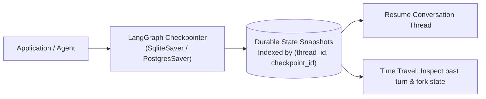

# 📹 Persistence in LangGraph ｜ Time Travel in LangGraph

<div className="video-card" style={{border: '1px solid #30363d', borderRadius: '8px', padding: '16px', marginBottom: '24px', background: 'rgba(56, 139, 253, 0.05)'}}>
  <div style={{display: 'flex', gap: '16px', flexWrap: 'wrap'}}>
    <div><strong>Instructor:</strong> Nitish Singh (CampusX)</div>
    <div><strong>Duration:</strong> 3494</div>
    <div><strong>Course:</strong> Module 4: Agentic AI & LangGraph</div>
    <div><strong>Watch Link:</strong> <a href="https://www.youtube.com/watch?v=_IPP7_Bi8uA" target="_blank" rel="noopener noreferrer">YouTube Lecture ↗</a></div>
  </div>
</div>

## 📌 Executive Summary

Production agents require persistence across server restarts, network disconnections, and long-running multi-day workflows. LangGraph achieves persistence via Checkpointers (`MemorySaver`, `SqliteSaver`, `PostgresSaver`), capturing state snapshots after every node execution.

This guide explores checkpointer architecture, session thread isolation with `thread_id`, state inspection, and Time-Travel state forking.

---

## 🏗️ System Architecture & Execution Flow



---

## 📖 Core Concepts & Technical Deep Dive

### 1. Checkpointer Mechanics
After a node completes, the checkpointer serializes the updated state dictionary and commits an immutable snapshot to the database alongside metadata:
- `thread_id`: Unique identifier isolating a user or session.
- `checkpoint_id`: Monotonically increasing version identifier.
- `parent_checkpoint_id`: Pointer to preceding state, forming a DAG of conversation history.

### 2. Time-Travel Debugging
Engineers can inspect past checkpoints using `app.get_state_history(config)`, rewind execution to a specific point in time, update state values manually via `app.update_state()`, and fork execution down a new branch.

---

## 💻 Production Implementation

```python
from langgraph.checkpoint.memory import MemorySaver
from langgraph.graph import StateGraph, START, END
from typing import TypedDict

class SessionState(TypedDict):
    count: int

def increment_node(state: SessionState):
    return {"count": state.get("count", 0) + 1}

builder = StateGraph(SessionState)
builder.add_node("increment", increment_node)
builder.add_edge(START, "increment")
builder.add_edge("increment", END)

# Attach checkpointer
memory_cp = MemorySaver()
app = builder.compile(checkpointer=memory_cp)

# Execute across isolated threads
cfg1 = {"configurable": {"thread_id": "thread-A"}}
cfg2 = {"configurable": {"thread_id": "thread-B"}}

app.invoke({"count": 0}, config=cfg1)
app.invoke({"count": 0}, config=cfg1)
app.invoke({"count": 0}, config=cfg2)

print(f"Thread A State: {app.get_state(cfg1).values['count']}") # 2
print(f"Thread B State: {app.get_state(cfg2).values['count']}") # 1
```

---

## ⚙️ Production Gotchas & Best Practices

:::tip Enterprise PostgresSaver
Use `PostgresSaver` in production deployments rather than in-memory stores to ensure persistence survives container restarts and scales across Kubernetes pods.
:::

:::warning Thread ID Cardinality
Generate cryptographically secure UUIDs for `thread_id` to prevent session hijacking in multi-tenant SaaS environments.
:::

---

## 📊 Architectural Reference & Comparison

| Checkpointer | Storage Medium | Persistence | Production Grade |
| :--- | :--- | :--- | :--- |
| `MemorySaver` | Python Process RAM | Lost on process restart | Prototype / Testing |
| `SqliteSaver` | Local SQLite File | Survives process restarts | Single-Instance Production |
| `PostgresSaver` | Distributed PostgreSQL | Highly available & durable | Multi-Node Kubernetes |

---

## 📚 Key Takeaways & Enterprise Checklist

- [ ] **Architecture Verification:** Ensure your design addresses latency, decoupled interfaces, and strict data validation contracts.
- [ ] **Deterministic Testing:** Run unit tests and golden dataset evaluations before shipping changes to staging or production.
- [ ] **Security & Observability:** Enforce input/output guardrails, scrub sensitive credentials/PII, and capture distributed traces.
- [ ] **Scalability & Sizing:** Calibrate model parameters, context limits, and compute instance requirements against projected request concurrency.
