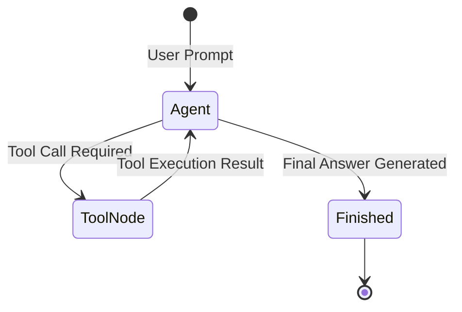

# 📹 Building a Chatbot with UI in LangGraph & Streamlit

<div className="video-card" style={{border: '1px solid #30363d', borderRadius: '8px', padding: '16px', marginBottom: '24px', background: 'rgba(56, 139, 253, 0.05)'}}>
  <div style={{display: 'flex', gap: '16px', flexWrap: 'wrap'}}>
    <div><strong>Instructor:</strong> Nitish Singh (CampusX)</div>
    <div><strong>Duration:</strong> 32m 28s</div>
    <div><strong>Playlist:</strong> Agentic AI with LangGraph (CampusX)</div>
    <div><strong>Watch Link:</strong> <a href="https://www.youtube.com/watch?v=voZAgDmO-rk" target="_blank" rel="noopener noreferrer">YouTube Lecture ↗</a></div>
  </div>
</div>

## 📌 Executive Summary & Learning Objectives

This lecture covers **Building a Chatbot with UI in LangGraph & Streamlit**, focusing on production implementations, edge cases, and industry standards:
- Core intuition, architecture, and underlying mechanisms.
- Key differences between theoretical research implementations and scalable enterprise patterns.
- Concrete Python walkthroughs, error recovery, and performance optimization.

---

## 🏗️ Architecture & Conceptual Workflow



---

## 📖 Core Concepts & Technical Deep Dive

### 1. Architectural Foundations
In modern production AI engineering, **Building a Chatbot with UI in LangGraph & Streamlit** is essential for ensuring reliability, low latency, and deterministic outcomes. As AI systems evolve from naive prompt-in / completion-out scripts into distributed systems, engineers must handle:
- **State management & consistency:** Ensuring intermediate states and tool invocations are tracked.
- **Error boundaries & recovery:** Graceful degradation when external LLMs or vector stores encounter rate limits or network partitions.
- **Resource utilization & cost efficiency:** Caching common queries and reducing unnecessary foundation model token expenditure.

### 2. Operational Considerations
- **Latency Optimization:** Pre-computing embeddings, utilizing asynchronous non-blocking event loops, and streaming tokens via Server-Sent Events (SSE).
- **Security & Sandboxing:** Validating inputs before ingestion, sanitizing LLM outputs, and isolating tool execution environments.

---

## 💻 Production Implementation Walkthrough

```python
from typing import TypedDict, Annotated, List
from langgraph.graph import StateGraph, END
import operator

# 1. Define State Schema
class AgentState(TypedDict):
    messages: Annotated[List[str], operator.add]
    next_step: str

# 2. Define Node Functions
def analyze_input(state: AgentState):
    print("Analyzing query...")
    return {"messages": ["Query analyzed."], "next_step": "generate"}

def generate_response(state: AgentState):
    print("Generating response...")
    return {"messages": ["Final response generated."], "next_step": "end"}

# 3. Build StateGraph
workflow = StateGraph(AgentState)
workflow.add_node("analyze", analyze_input)
workflow.add_node("generate", generate_response)

workflow.set_entry_point("analyze")
workflow.add_edge("analyze", "generate")
workflow.add_edge("generate", END)

app = workflow.compile()
output = app.invoke({"messages": ["Hello Agent"], "next_step": ""})
print(output)
```

---

## 💡 Production Best Practices & Tips

:::tip Production Deployment Guideline
When deploying Building a Chatbot with UI in LangGraph & Streamlit in enterprise environments, always configure automated retries with exponential backoff and telemetry tracing (such as OpenTelemetry or LangSmith).
:::

:::warning Common Failure Modes
Watch out for state contamination across concurrent requests. Ensure each session or user interaction uses an isolated thread ID or execution context.
:::

---

## 🎯 Key Takeaways & Quick Reference

| Dimension | Production Standard | Pitfall to Avoid |
| :--- | :--- | :--- |
| **Execution** | Async / Non-blocking with timeouts | Synchronous blocking calls in event loops |
| **Data Validation** | Strict Pydantic v2 schemas | Untyped dictionary access |
| **Monitoring** | Distributed tracing & latency percentiles | Relying only on standard console logs |

## ⏱️ Lecture Timeline & Key Topics

| Timestamp | Key Topic / Concept Discussed |
| :--- | :--- |
| **00:00:00** | हाय गाइज़, माय नेम इज़ नितेश एंड यू आर... |
| **00:07:41** | एंड बनेगा। ठीक है? इसके अलावा मैंने एक... |
| **00:16:13** | है। तो यहां पे भी हम सेम कोड रिपीट... |
| **00:24:31** | मैसेज हिस्ट्री। आई विल राइट दिस। सो, अब... |
| **00:32:26** | में। बाय।... |


---

---

## 📜 Complete Lecture Transcript (Hindi / Hinglish)

> **Language:** Hindi / Hinglish | **Source:** `12 - Building a Chatbot with UI in LangGraph & Streamlit ｜ CampusX.hi-orig.srt` | **Total Segments:** 17 | **Word Count:** ~5,407 words

<details>
<summary><b>Click to expand full chronological transcript (17 timestamped intervals)</b></summary>

#### ⏱️ [00:00 ➔ 00:02]

हाय गाइज़, माय नेम इज़ नितेश एंड यू आर वेलकम टू माय YouTube चैनल। इस वीडियो में भी हम लोग अपना एजेंटिक एआई यूज़िंग लंग्राफ प्लेलिस्ट कंटिन्यू करेंगे। अब अगर आपको याद होगा तो मैंने लास्ट टू लास्ट वीडियो में आपको लैंग ग्राफ को यूज़ करके एक चैटबॉट बनाना सिखाया था। अब वो चैटबॉट जो था वो काम तो सही से कर रहा था। उसमें हमने शॉर्ट टर्म मेमोरी का भी फीचर ऐड किया था। जिससे वह हमारे पास्ट मैसेजेस को याद रख पा रहा था। बट उस चैटबॉट में एक बहुत बड़ा फ्लॉ था। और वो फ्लॉ यह था कि उस चैटबॉट के पास कोई यूआई नहीं था। एज इन कोई यूजर इंटरफ़ेस नहीं था। हमें अगर उस चैटबॉट से इंटरेक्ट करना था, तो हम सेम जुपिटर नोटबुक के अंदर ही इंटरेक्ट कर रहे थे। आज के वीडियो में हम यह फ्लॉ दूर करने वाले हैं और हम अपने चैटबॉट को एक यूजर इंटरफ़ेस देने वाले हैं। सो, बेसिकली व्हाट वी विल डू इज़ कि हम एक वेब इंटरफ़ेस बनाएंगे। एक वेबसाइट बनाएंगे जहां पर हमारा वह सेम लंग्राफ चैटबॉट प्रेजेंट होगा और हमारा यूजर उस वेबसाइट के थ्रू हमारे चैटबॉट से इंटरेक्ट कर पाएगा। इनफैक्ट मैंने डेमो क्रिएट कर रखा है। वीडियो को शुरू करने के पहले आई वुड लाइक टू शो यू द डेमो। सो दैट आपको थोड़ा सा इंटरेस्टिंग लगे और आप इंस्पायर हो यह पूरा वीडियो एंड टू एंड देखने के लिए। ठीक है? सो ये जो आपको स्क्रीन पर दिखाई दे रहा है ये हमारा यूआई है। बहुत ही नाइस बहुत ही क्लीन यूआई है। अभी स्क्रीन पे आपको सिर्फ एक इनपुट बॉक्स दिखाई दे रहा है जहां पर यूजर अपना मैसेज टाइप कर सकता है। सो व्हाट आई विल डू इज आई विल सिंपली टाइप हाय एंड यू कैन सी जैसे ही मैंने हाय लिखा हमारा जो मैसेज था वो टॉप ऑफ द यूआई चला गया और वहां पे एक आइकॉन भी आ गया यूजर का और उसके ठीक नीचे हमारे असिस्टेंट का रिप्लाई भी आ गया इन अ डिफरेंट आइकॉन जिससे तुरंत समझ में आ रहा है कि कौन सा मैसेज किसने टाइप किया तो हमारा असिस्टेंट इज़ सेइंग हेलो हाउ कैन आई असिस्ट यू टुडे यहां पे मैंने लिखा लेट्स से माय नेम इज़ नितीश। नाउ माय असिस्टेंट इज़ सेइंग नाइस

#### ⏱️ [00:02 ➔ 00:04]

टू मीट यू नितीश। हाउ कैन आई हेल्प यू टुडे? सो, मैंने बोला, व्हाट इज द कैपिटल ऑफ इंडिया? तो, इट सेज़ द कैपिटल ऑफ इंडिया इज़ न्यू दिल्ली।" लेट्स से मैं कोई और क्वेश्चन पूछता हूं। व्हाट इज द रेसिपी टू मेक पास्ता? सो, यू कैन सी यह रहा उसका रिस्पांस। इंग्रेडिएंट्स बता दिए, इंस्ट्रक्शंस बता दिए। ठीक है? अब यहां पे भी शॉर्ट टर्म मेमोरी इंप्लीमेंटेड है। सो अगर मैं यहां पे पूछूं व्हाट इज माय नेम? तो उसको याद है कि मैंने पास्ट में अपना नाम नितेश बताया था। सो ये एग्जैक्ट यूजर इंटरफेस हम बनाने वाले हैं। और इस इंटरफेस की खास खासियत यह है कि अ बहुत सिंपल एंड सॉर्टेड टाइप का इंटरफेस है। जैसे-जैसे आप मैसेजेस ऐड करते जा रहे हो आपका जो पूरा यूआई है वो ऊपर जाता जा रहा है और अगर बहुत लंबा हो जा रहा है आपके मैसेजेस का पूरा कॉन्वर्सेशन तो फिर वहां पे एक स्क्रॉल बार आ जा रहा है। सो यू कैन स्क्रॉल थ्रू द मैसेजेस। ठीक है? तो बहुत ही सिंपल और नीट यूआई है और आप लोगों में से बहुत लोग शायद पहचान भी गए होंगे कि ये जो यूआई हमने बनाया है ये हमने स्ट्रीमलेट यूज़ करके बनाया है। सो स्ट्रीम इज़ अ लाइब्रेरी इन Python जिसकी हेल्प से आप वेबसाइट्स बना सकते हो। ठीक है? तो हम स्ट्रीमलेट यूज़ करेंगे इस वीडियो में। और भी अलग-अलग ऑप्शंस होते हैं। बट जस्ट टू शो यू अ डेमोंस्ट्रेशन। मुझे लगा कि स्ट्रीमलेट इज़ द बेस्ट एंड फास्टेस्ट ऑप्शन। ठीक है? सो अब आज के वीडियो में व्हाट वी आर गोइंग टू डू इज कि ये एग्जैक्ट अ जो यूआई है ये मैं आपको बना के दिखाऊंगा स्टेप बाय स्टेप फैशन में सो दैट आप भी अपने मशीन पे इसका एग्जैक्ट रेप्लिका तैयार कर पाओ। सो आई रियली होप यू आर एक्साइटेड। नाउ लेट्स स्टार्ट द वीडियो। सो पूरा ये यूआई बनाने के लिए आपको सबसे पहले क्या करना पड़ेगा कि आपको अपने पूरे चैटबॉट को दो पार्ट्स में डिवाइड करना पड़ेगा। सो, हमारे चैटबॉट में अब दो कंपोनेंट्स हो जाएंगे। पहला

#### ⏱️ [00:04 ➔ 00:06]

कंपोनेंट होगा हमारे चैट चैटबॉट का बैक एंड जहां पे हम लैंग ग्राफ वर्क फ्लो बिल्ड करेंगे। और सेकंड कंपोनेंट हो जाएगा फ्रंट एंड जहां पे हम स्ट्रीमलेट की हेल्प से एक वेबसाइट बनाएंगे। अब हमारा जो यूजर होगा वो फ्रंट एंड से इंटरेक्ट करेगा बाय टाइपिंग द मैसेज। और फ्रंट एंड क्या करेगा? इन टर्न लैंग्राफ के पास उस मैसेज को भेजेगा। लैंग्राफ का रिस्पांस फ्रंट एंड को मिलेगा और फ्रंट एंड पे वही रिस्पांस फिर यूजर को दिखाई देगा। तो बेसिकली आपको दो अलग फाइल्स बनानी है। एक बैक एंड के लिए और एक फ्रंट एंड के लिए। अगर मैं आपको लास्ट टू लास्ट वीडियो का कोड दिखाऊं जहां पे हमने वह बेसिक चैटब बनाया था। तो इस कोड में यह जो भी पार्ट आपको दिखाई दे रहा है जहां पर आप अपना वर्क फ्लो बिल्ड कर रहे हो, ग्राफ बिल्ड कर रहे हो, यह सारा पार्ट बैक एंड में चला जाएगा और वो पार्ट जहां पर आप यह पूरा लूप चला करके यूजर से इनपुट मांग रहे थे और फिर आप चैटबॉट को इनवोक कर रहे थे और जो भी रिस्पांस आ रहा था उसको प्रिंट कर रहे थे। यह सारा पार्ट फ्रंट एंड का पार्ट बन जाएगा। ठीक है? तो अच्छी चीज यह है कि आपको बैक एंड वाली साइड बहुत ज्यादा मेहनत करने की जरूरत नहीं है। मोस्ट ऑफ द कोड लिखा हुआ है। मेहनत जो हमें करनी है वो फ्रंट एंड वाली साइड करनी है। हमें सबसे पहले सीखना पड़ेगा कि स्ट्रीमलेट में आप चैट इंटरफेससेस बिल्ड कैसे करते हो। सो मेरा प्लान ऑफ एक्शन यही रहेगा कि फर्स्ट आई विल टीच यू हाउ टू बिल्ड चैट इंटरफसेस यूजिंग स्ट्रीमलेट और एक बार जब आपको यह पूरी चीज समझ में आ जाएगी तो फिर मैं लैंग ग्राफ के साथ कैसे इंटीग्रेट करना है स्ट्रीमलेट को वो दिखाऊंगा। इस पूरे

#### ⏱️ [00:06 ➔ 00:08]

वीडियो को समझने के लिए दो प्रीरक्व्विजिट्स हैं। पहला आपको स्ट्रीमलेट के फंडामेंटल्स आने चाहिए। अगर आपको नहीं भी आते हैं तो डोंट वरी इट्स अ वेरी सिंपल लाइब्रेरी। आपको YouTube पर जाकर के कोई भी वीडियो देखना है जो आपको स्ट्रीमलेट का दिखाई दे। विद इन 15 टू 20 मिनट्स आपको स्ट्रीमलेट के फंडामेंटल्स समझ में आ जाएंगे। इट्स अ वेरी-वेरी सिंपल लाइब्रेरी और सेकंड ऑब्वियसली आपको लंग ग्राफ के फंडामेंटल्स पता होने चाहिए। बेसिकली आपने अभी तक अगर हमारा प्लेलिस्ट फॉलो किया है तो फिर आपको कोई प्रॉब्लम नहीं होनी चाहिए। ठीक है? सो नाउ दैट वी हैव अ प्लान ऑफ एक्शन इन प्लेस। लेट्स स्टार्ट कोडिंग आवर चैटबॉट। अब गाइस कोड करने के पहले मैं आपको थोड़ा सेटअप समझा देता हूं। सो यह चार्टबॉट का यूआई बनाने के लिए मैंने एक कंप्लीटली नया प्रोजेक्ट फोल्डर बनाया है और वहां पर मैंने ऑलरेडी कुछ चीजें करके रखी हैं। सबसे पहले तो मैंने दो पython फाइल्स बना ली है। पहली फाइल का नाम है lang्राफ अंडरs बैक एंड डॉट py जो अभी आपके स्क्रीन पे है। यह हमारे चैटबॉट का बैक एंड है। और यहां पे ऑलरेडी कोड मैंने लिख रखा है। और ऑनेस्टली यह कोड आपको नया नहीं लगना चाहिए। बिकॉज़ ये एग्जैक्ट कोड आपने लास्ट टू लास्ट वीडियो में लिखा है। सो यहां पे हमने लाइब्रेरीज़ इंपोर्ट की हैं। यहां पे हमने अपना स्टेट डिफाइन किया है। और ये रहा हमारा सिंपल ग्राफ जहां पे हम स्टार्ट से चैट नोड पे जा रहे हैं और चैट नड से एंड पे जा रहे हैं। और यहां पे हमने एक चेक पॉइंटर यूज़ किया है। कौन सा? इन मेमोरी सेवर वाला। ठीक है? तो ये एग्जैक्टली वो कोड है जो हमने लास्ट टू लास्ट वीडियो में लिखा है और यही कोड हमारे चैटबॉट का बैक एंड बनेगा। ठीक है? इसके अलावा मैंने एक और फाइल बनाई है स्ट्रीमलेट अंडरस्कोर फ्रंट एंड बोल के और यहां पर हम अपने यूआई का कोड लिखेंगे। फिलहाल यहां पे कुछ भी नहीं है। ये सारा कोड हमें इस वीडियो में लिखना है। ठीक है? इसके अलावा हमारे पास एक डॉट एनवी फाइल है जहां पर मैंने अपना ओपन एआई अ की रखा है और मैंने सारी की

#### ⏱️ [00:08 ➔ 00:10]

सारी जो भी लाइब्रेरीज़ हैं वो ऑलरेडी यहां पे एक वर्चुअल एनवायरमेंट के अंदर इंस्टॉल कर ली है। ठीक है? क्या-क्या लाइब्रेरीज़ मैंने इंस्टॉल की है? मैंने लंगचेन इंस्टॉल किया है। लैंग्राफ इंस्टॉल किया है और ऑब्वियसली स्ट्रीमलेट इंस्टॉल किया है। ठीक है? सो इस पॉइंट पे नाउ वी आर रेडी टू स्टार्ट राइटिंग आवर कोड। ठीक है? तो फ्रंट एंड का कोड लिखने के पहले सबसे पहले आपको एक कॉनसेप्चुअल चीज समझनी पड़ेगी और वो ये है कि अगर आप स्ट्रीमलेट में कुछ इस तरह का यूआई बनाना चाहते हैं तो आपको सबसे पहले यह समझना पड़ेगा कि ये यूआई में क्या-क्या मेन कंपोनेंट्स हैं। सो इस पॉइंट पे इस यूआई में दो मेन कंपोनेंट्स हैं। एक कंपोनेंट है ये बॉक्स जहां पे मैसेज डिस्प्ले हो रहा है। ये बॉक्स चाहे ये बॉक्स चाहे ये बॉक्स ये वो बॉक्सेस हैं जहां पे आपका मैसेज डिस्प्ले हो रहा है यूजर का भी और एआई असिस्टेंट का भी स्ट्रीमलेट में इस बॉक्स को चैट अंडरs मैसेज बोला जाता है ये स्ट्रीमलेट का एक कंपोनेंट है और जो सेकंड कंपोनेंट है इस यूआई का वो है बॉटम पे यह इनपुट बॉक्स जिसकी हेल्प से यूजर चैट चैट टाइप करके भेज पा रहा है और इस कंपोनेंट को चैट इनपुट बोला जाता है। तो सबसे पहले हम क्या करेंगे? हम इन दोनों कंपोनेंट्स को बनाना सीखेंगे। क्योंकि अगर आपको ये दोनों कंपोनेंट्स नहीं आएंगे तो फिर आप यह पूरा यूआई बिल्ड ही नहीं कर पाओगे। ठीक है? तो सबसे पहले लेट्स फोकस ऑन हाउ टू बिल्ड अ चैट मैसेज एंड अ चैट इनपुट। तो गाइस सबसे पहले हम लोग एक छोटा सा चैट मैसेज इंटरफेस बनाएंगे। सो बेसिकली व्हाट आई विल डू इज कि मैं सिर्फ यह सेक्शन बनाऊंगा जहां पर

#### ⏱️ [00:10 ➔ 00:12]

हमें यूजर का एक सिंगल मैसेज दिखाई देगा वि द हेल्प ऑफ चैट मैसेज कंपोनेंट। उसके लिए आपको कुछ नहीं करना है। आपको सिंपली यह कोड लिखना है वि एसटी डॉट चैट मैसेज और इस फंक्शन के अंदर आपको सिर्फ रोल बताना है कि ये पर्टिकुलर मैसेज किसने भेजा है? यूजर ने या फिर एआई असिस्टेंट ने। तो सिंस ये यूजर ने भेजा है तो हम यहां पे यूजर लिखेंगे। कोलोन डालेंगे और फिर यहां पे आप एसटी डॉट टेक्स्ट के अंदर कुछ भी लिख सकते हो। हाय एंड दैट्स इट। बस इतना सा कोड क्या करेगा? हमारे लिए एक टेक्स्ट बॉक्स क्रिएट कर देगा। जहां पर हमें हमारे यूजर का मैसेज दिखाई देने लगेगा। सो इस कोड को रन करने के लिए हमें ये कमांड रन करना पड़ता है। स्ट्रीमलेट रन हमारी फाइल का नाम। हमारी फाइल का नाम है स्ट्रीमलेट अंडरs फ्रंट डॉट py। एंड यू कैन सी गाइज़ दिस इज़ द आउटपुट। हमारे पास हमारा टेक्स्ट बॉक्स है जहां पर हमारे यूजर यूजर का मैसेज हमें दिखाई दे रहा है। अब एक काम करते हैं। इसके ठीक नीचे हम हमारे एi असिस्टेंट का मैसेज अ डिस्प्ले करते हैं। सो उसके लिए फिर से हम क्या करेंगे? हम सेम लॉजिक यूज़ करेंगे। हम लिखेंगे वि एसटी डॉट चैट मैसेज। इस बार जो रोल है वह असिस्टेंट है। बिकॉज़ यह मैसेज असिस्टेंट प्रिंट कर रहा है। और फिर से हम यहां पर लिखेंगे हाउ कैन आई हेल्प यू क्वेश्चन मार्क सेव रीरन एंड नाउ यू कैन सी वी आर गेटिंग हमारे असिस्टेंट का मैसेज। आई गेस आप इतना समझ पा रहे हो कि ये जो आइकंस हैं वो हमें इन रोल्स को असाइन करने की वजह से मिल रहे हैं। सो अगर आप यहां पर यूजर लिख रहे हो तो आपको यह पर्टिकुलर आइकॉन दिख रहा है और अगर आप यहां पर असिस्टेंट लिख रहे हो तो आपको यहलो आइकॉन दिख रहा है। ऑब्वियसली आप इनको

#### ⏱️ [00:12 ➔ 00:14]

चेंज कर सकते हो। यहां पर एक अवतार बोल के पैरामीटर होता है। बट अगेन अभी हमें जरूरत नहीं है। एक काम करते हैं क्विकली एक और टेक्स्ट बॉक्स क्रिएट करते हैं। इस बार यह यूजर होगा और यहां पे लिखा होगा माय नेम इज नितीश सेव रीरन। एंड नाउ यू कैन सी हमारा थर्ड मैसेज भी डिस्प्ले हो गया। तो आई रियली होप आपको समझ में आ गया कि आप कैसे चैट मैसेजेस बनाते हो अपने इंटरफेस में यूजर इंटरफेस में। अब मूव करते हैं सेकंड कंपोनेंट की तरफ जहां पे हम हम एक इनपुट बॉक्स क्रिएट करेंगे जहां पे यूजर अपना मैसेज टाइप कर पाएगा जिसको हम चैट इनपुट बोलते हैं। तो वह भी बहुत सिंपल है। आपको क्या करना है? यहां पे एसटी डॉट चैट इनपुट फंक्शन को कॉल करना है और यहां पर आप एक प्लेस होल्डर डाल सकते हो। जैसे कि आपने लिख दिया टाइप हियर यूजर को बताने के लिए। अब यूजर यहां पे कुछ टाइप करेगा। जो भी टाइप करेगा उसको आप एक वेरिएबल में स्टोर कर सकते हो। लेट्स कॉल इट यूजर इनपुट। सेव किया वापस गए रीरन किया। एंड नाउ यू कैन सी बॉटम पे आपको आपका चैट इनपुट कंपोनेंट भी दिख रहा है। यहां पे यू कैन टाइप समथिंग। यू कैन प्रेस एंटर और एंटर पे कुछ एक्शन होगा। फिलहाल हमने कोई एक्शन डिफाइन नहीं किया है इसलिए आपको कुछ भी दिखाई नहीं दे रहा है। तो चलो एक एक्शन डिफाइन करते हैं। हम ये चाहते हैं कि यहां पे यूजर जो भी टाइप करे जैसे ही वो एंटर मारे वो ऊपर वो मैसेज हमें यूजर वाले बॉक्स में दिखने लग जाए। तो इसके लिए हम क्या करेंगे? बहुत सिंपल सा कोड लिखेंगे। हम यह लिखेंगे कि इफ यूजर इनपुट इज सेट मतलब यूजर ने अगर कुछ टाइप किया है तो हम उसको डिस्प्ले करना चाहते हैं एसटी डॉट चैट मैसेज के अंदर विद द रोल यूजर और हम डिस्प्ले क्या करना चाहते हैं एसटी डॉट टेक्स्ट के अंदर जो भी यूजर ने इनपुट दिया है। सेव किया वापस गए रीरन किया। अब यहां

#### ⏱️ [00:14 ➔ 00:16]

पे मैंने लिखा नितेश मैंने एंटर मारा। यह देखो यहां पर नितेश आ गया। अगर मैं कुछ और टाइप करूंगा तो वह अपडेट हो जाएगा। ठीक है? तो आई रियली होप आपको यहां तक समझ में आ गया कि ये दोनों कंपोनेंट्स को आप कैसे यूआई के ऊपर प्लेस करते हो। ठीक है? अब हम थोड़ा सा कॉम्प्लेक्सिटी को एक नच ऊपर लेके जाएंगे। और अब मैं आपको एक ऐसा चैटबॉट बना के दिखाऊंगा जहां पर यूजर यहां पे जो भी टाइप करेगा लेट से उसने टाइप किया हाय। तो हमारा जो एआई असिस्टेंट है वो एग्जजेक्टली वही मैसेज दोबारा से प्रिंट करके देगा। मतलब अगर मैंने लिखा हाय तो एआई भी लिखेगा हाय। मैं लिखूंगा माय नेम इज नितीश तो यूआई भी लिखेगा एआई भी लिखेगा माय नेम इज नितीश। सो बेसिकली हम चैटबॉट ही बना रहे हैं। बट इट्स अ डंप चैट बॉट। ठीक है? जो हम लिख रहे हैं हमें पलट के वही रिप्लाई दिखाई दे रहा है। यह हम लोग नेक्स्ट बनाएंगे। तो चलो गाइस बनाते हैं हम अपना कॉपी कैट चैट बॉट जहां पर यूजर जो टाइप करेगा हमारा असिस्टेंट भी एक्सजेक्टली वही टाइप करेगा। ठीक है? तो एकदम बेसिक लेवल बनाते हैं पहले और फिर उसमें इंप्रूवमेंट्स करेंगे। सो अभी सोचने पे ऐसा लग रहा है कि इट्स क्वाइट सिंपल। आपको बस इतना करना है कि आपको सबसे पहले यूजर को एक चैट इनपुट बॉक्स दिखाना है। सो बेसिकली आप चैट इनपुट बॉक्स दिखाओगे और आप यूजर को बोलोगे टाइप हियर। यूजर जो भी टाइप करेगा उसको आप एक वेरिएबल में स्टोर कर लोगे बाय द नेम ऑफ़ यूजर इनपुट। और आप चेक करोगे कि अगर यूजर इनपुट सेट है तो आपको क्या करना है? स्क्रीन पे सबसे पहले यूजर का मैसेज दिखाना है तो उसके लिए आप लिखोगे विद एसटी डॉट चैट मैसेज रोल हो जाएगा यूजर या ह्यूमन और यहां पे आप लिखोगे एसटी डॉट टेक्स्ट यूजर ने जो भी टाइप किया था।

#### ⏱️ [00:16 ➔ 00:18]

तो ये हो गया यूजर का मैसेज। अब हमें एआई वाला मैसेज या असिस्टेंट वाला मैसेज भी दिखाना है। अ बट गेस व्हाट? असिस्टेंट का मैसेज एग्जैक्टली वही है जो यूजर का मैसेज है। तो यहां पे भी हम सेम कोड रिपीट करेंगे और यहां पे हम डाल देंगे असिस्टेंट को और हम लिखेंगे एसटी डॉट टेक्स्ट फिर से यहां पे यूजर इनपुट सेव एक बार इसको चला के देखते हैं। यू कैन सी हमारे पास एक इनपुट बॉक्स है। हमने टाइप किया हाय तो देखो यूजर का भी मैसेज दिखाई दे रहा है। असिस्टेंट का भी मैसेज दिखाई दे रहा है। दोनों आइडेंटिकल है। नाउ द प्रॉब्लम इज दिस कि इस सिंपल इंप्लीमेंटेशन में जैसे ही आप सेकंड मैसेज टाइप करते हो लेट्स से हेलो तो पुराने जो भी मैसेजेस हैं वो उड़ जाते हैं। अब ऐसा इसलिए होता है बिकॉज़ स्ट्रीमलेट का नेचर क्या है कि जितनी बार आप एंटर प्रेस कर रहे हो या यूजर एंटर प्रेस कर रहा है यहां पे उतनी बार ये जो स्क्रिप्ट है ये ऊपर से नीचे री एग्जीक्यूट होती है। तो सोच के देखो अभी यहां पे हेलो लिखा हुआ है। ठीक है? अब यूजर आया उसने लिखा लेट्स से नितीश अब वो जैसे ही एंटर मारेगा ये स्क्रिप्ट ऊपर से नीचे फिर से री एग्जीक्यूट होगी तो होगा क्या यहां पे हम चेक करेंगे क्या यूजर इनपुट सेट है हां सेट है तो फिर हम क्या करेंगे यूजर वाले बॉक्स में यूजर का इनपुट डाल देंगे जो कि अभी क्या है नितीश और असिस्टेंट वाले में भी क्या डाल देंगे नितीश तो बेसिकली पहले से जो भी था वहां पे वो गायब हो जाएगा ये देखो सो दिस इज द प्रॉब्लम प्रॉब्लम द प्रॉब्लम इज कि हम करंट सेट ऑफ मैसेजेस तो डिस्प्ले कर पा रहे हैं बट उस प्रोसेस में हम पुराना जो कन्वर्सेशन हिस्ट्री है उसको उड़ा दे रहे हैं और उसके पीछे बहुत सिंपल रीज़न है कि हम जो कॉन्वर्सेशन हिस्ट्री है उसको कहीं पे स्टोर ही नहीं कर रहे तो हमें क्या करना पड़ेगा हमें कॉन्वर्सेशन हिस्ट्री को भी कहीं पे स्टोर करना पड़ेगा। सो व्हाट

#### ⏱️ [00:18 ➔ 00:20]

वी विल डू इज़ कि वी विल क्रिएट अ डिक्शनरी। ठीक है? एक डिक्शनरी हम लोग यहां पर क्रिएट करेंगे और उस डिक्शनरी में हम क्या करेंगे? इस तरीके से चीजें स्टोर करेंगे। मतलब डिक्शनरी में दो कीज़ होंगे। एक होगा रोल जो हमें बताएगा यूजर ने मैसेज टाइप किया है या असिस्टेंट ने और दूसरा होगा कंटेंट ऑफ द मैसेज। कि उस पर्टिकुलर टर्न में यूजर ने क्या बोला। हाय। फिर इसी तरह की और डिक्शनरीज़ होंगी। यहां पर आ जाएगा असिस्टेंट और फिर असिस्टेंट ने क्या बोला? तो हम बेसिकली क्या कर रहे हैं? इस तरह से डिक्शनरीज बना रहे हैं फॉर ईच मैसेज। और इन सारी डिक्शनरीज़ को व्हाट वी कैन डू इज़ वी कैन स्टोर इनसाइड अ पython लिस्ट। ठीक है? तो देखो, हम क्या कर रहे हैं? हम एकदम टॉप पे एक Python लिस्ट बना रहे हैं जिसका नाम है मैसेज अंडरस्कोर हिस्ट्री। ठीक है? और हम क्या करेंगे? जब भी यूजर का कोई मैसेज आएगा या फिर असिस्टेंट का कोई भी मैसेज आएगा तो उसको डिस्प्ले करने के पहले हम उस मैसेज को इस हिस्ट्री में ऐड करेंगे। ठीक है? कैसे? ये देखो। इस जगह पे हमारे पास यूजर का मैसेज आया। तो हम यहां पे पहले फर्स्ट ऐड द मैसेज टू मैसेज हिस्ट्री। ठीक है? तो हम क्या कोड लिखेंगे? हम लिखेंगे मैसेज हिस्ट्री डॉट अपेंड बिकॉज़ वो लिस्ट है और अपेंड क्या कर रहे हैं हम एक डिक्शनरी डिक्शनरी में होगा पहला की रोल और यहां पे रोल की वैल्यू होगी यूजर बिकॉज़ ये पर्टिकुलर मैसेज यूजर ने टाइप किया है और फिर आएगा कंटेंट और कंटेंट क्या है जो भी यूजर ने हमें दिया है यूजर इनपुट में और एक बार जब हम मैसेज हिस्ट्री में ऐड कर देंगे उस मैसेज को उसके बाद हम उसको डिस्प्ले भी कर देंगे ठीक है और यह सेम ट्रीटमेंट हमें क्या करना पड़ेगा? असिस्टेंट वाले मैसेज को भी देना पड़ेगा।

#### ⏱️ [00:20 ➔ 00:22]

सो व्हाट वी विल डू इज़ हम एग्जैक्टली सेम कोड यहां पे भी पेस्ट कर देंगे। सो मैसेज हिस्ट्री डॉट अपेंड यहां पे रोल में आ जाएगा असिस्टेंट और कंटेंट फिलहाल सेम ही रहेगा जो भी यूजर इनपुट है। ठीक है? तो अब फिलहाल हम इतना कर रहे हैं कि मैसेज को डिस्प्ले करने के पहले मैसेज हिस्ट्री में ऐड कर रहे हैं। अब हमें क्या करना है? एकदम टॉप पे इस जगह पे क्या करना है कि मैसेज हिस्ट्री के अंदर जितने भी मैसेजेस हैं उनको डिस्प्ले करना है। राइट? तो पहले पूरी की पूरी हिस्ट्री प्रिंट होगी। फिर आपका करंट यूजर मैसेज प्रिंट होगा। फिर आपका करंट असिस्टेंट मैसेज प्रिंट होगा। ठीक है? सो व्हाट वी विल डू इज़ हम यहां पे एक लूप चलाएंगे। फॉर मैसेज इन मैसेज हिस्ट्री। सो बेसिकली वी आर लूपिंग थ्रू ईच डिक्शनरी। और हर डिक्शनरी के लिए हम क्या कर रहे हैं? एसटी डॉट चैट मैसेज को कॉल कर रहे हैं। और यहां पे रोल क्या होगा? जो भी मैसेज वाली डिक्शनरी में रोल का वैल्यू है। रोल वाली की का वैल्यू है। और यहां पे आ जाएगा एसटी डॉट टेक्स्ट और यहां पे आ जाएगा आपका मैसेज का कंटेंट। ठीक है? सो एकदम टॉप पे व्हाट वी आर डूइंग इज़ वी आर लोडिंग द कॉन्वर्सेशन हिस्ट्री। और उसके बाद नीचे करंट यूजर मैसेज और इसके बाद करंट असिस्टेंट मैसेज हो गया। क्या लगता है आपको? काम करेगा। चलो ट्राई करते हैं। सो यहां पे आए हमने रीरन किया और फिलहाल कोई भी कॉन्वर्सेशन हिस्ट्री नहीं है। इसलिए कुछ भी लोड नहीं हुआ। अब हमने लिखा हाय तो हाय एंड हाय आ गया। अब मैं लिखूंगा हेलो। आइडियली क्या होना चाहिए? यह दोनों हाय यहीं पे रहना चाहिए और इसके नीचे दो हेलो आने चाहिए। लेट्स चेक। नहीं काम कर रहा है। अब आई वांट कि आप एक बार वीडियो पॉज करके सोचो कि ये जो हमने दिमाग लगाया ये काम क्यों नहीं किया? इसका आंसर बहुत

#### ⏱️ [00:22 ➔ 00:24]

सिंपल है। आंसर ये है कि जितनी बार आप एंटर प्रेस कर रहे हो उतनी बार ये स्क्रिप्ट ऊपर से नीचे फिर से रन हो रही है। अब ऊपर से नीचे फिर से रन हो रही है। तो ये पर्टिकुलर लाइन भी तो एग्जीक्यूट हो रहा है। और इस लाइन के एग्जीक्यूट होने से क्या हो रहा है? हर बार आपका जो कन्वर्सेशन हिस्ट्री है वो इरेज हो जा रही है। रिसेट हो जा रही है। उसमें जो भी मैसेजेस आप ऐड कर रहे हो इस लाइन की वजह से वो सब का सब इरेज हो जा रहा है। तो ये एक बहुत बड़ी प्रॉब्लम है। ये जो डिक्शनरी है ये हर बार रिसेट हो जा रही है। आइडली अच्छा होता अगर हमारे पास कोई एक ऐसी डिक्शनरी होती जो हर बार एंटर प्रेस करने पे रिसेट ना होती। मतलब उसके अंदर जो मैसेजेस स्टर्ड हैं वह वैसे के वैसे ही रह जाते। अब फॉरर्चूनेटली हमारे पास एक ऐसी डिक्शनरी होती है। स्ट्रीमलेट के पास एक कंपोनेंट होता है जिसको हम बुलाते हैं सेशन स्टेट। सेशन स्टेट होता एक डिक्शनरी ही है। बट इस डिक्शनरी की खासियत क्या है? कि आप जब एंटर प्रेस करते हो तो इसके अंदर की चीजें इरेज़ नहीं होती हैं। वो एज़ इट इज़ रहती हैं। इस डिक्शनरी के अंदर की चीजें सिर्फ तब इरेज़ होती हैं या रिसेट होती हैं जब आप अपने पेज को मैनुअली रिफ्रेश करते हो यहां से। अदरवाइज़ यहां पे चीजें एक्यूमुलेट होते रहती हैं। सो इंस्टेड ऑफ़ यूजिंग दिस सिंपल Python डिक्शनरी वी विल यूज़ दिस डिक्शनरी। ठीक है? सो आप क्या करोगे कोड में सबसे पहले ऊपर यहां पर चेक करोगे कि क्या सेशन स्टेट के अंदर ऑलरेडी मैसेज हिस्ट्री बोल करके कुछ है या नहीं। सो आई एम चेकिंग इफ मैसेज हिस्ट्री नॉट इन एसटी डॉट सेशन स्टेट अगर नहीं है तो आप क्या करोगे? सेशन स्टेट के अंदर मैसेज हिस्ट्री बोल करके एक लिस्ट ऐड कर दोगे और

#### ⏱️ [00:24 ➔ 00:26]

शुरू में वो लिस्ट एंप्टी होगा। ठीक है? समझना इस बात को। सेशन स्टेट खुद एक डिक्शनरी है। हमने उस डिक्शनरी के अंदर एक की ऐड किया। मैसेज हिस्ट्री नाम से और ये जो की है इसका वैल्यू क्या है? एक लिस्ट। ठीक है? तो अब मैं इस लाइन को हटा देता हूं। अब देखो मुझे क्या करना है? मुझे कन्वर्सेशन हिस्ट्री लोड करना है। कहां से? इस पर्टिकुलर लिस्ट से। तो नाउ व्हाट आई विल डू इज़ आई विल कॉपी दिस। इंस्टेड ऑफ़ मैसेज हिस्ट्री। आई विल राइट दिस। सो, अब मैं क्या कर रहा हूं? सेशन स्टेट के अंदर मैसेज हिस्ट्री वाली लिस्ट में घुस के एक-एक करके सारे मैसेजेस को लोड कर रहा हूं। और फिर उस मैसेज का रोल लोड कर रहा हूं और उस मैसेज का कंटेंट लोड कर रहा हूं। तो इससे क्या हो रहा है? मेरा कॉन्वर्सेशन हिस्ट्री प्रिंट हो रहा है। और मैं नीचे जाऊंगा और रादर दैन मैसेज हिस्ट्री में अपेंड करने के आई विल अपेंड इनसाइड सेशन स्टेट का ये पर्टिकुलर की एंड सेम फॉर दिस। एंड दैट्स इट गाइस। अब अगर इस कोड को मैं रन करूं रीरन। चलो टाइप करते हैं। लेट्स से हमने लिखा हाय। देखो हाय आ गया। अब मैं लिखता हूं हेलो। तो आइडियली क्या होना चाहिए? यह हाय यहीं पे रहना चाहिए और उसके नीचे दो हेलो आने चाहिए। ये देखो आर्या। यहां पे मैंने लिखा नितेश। देखो एग्जैक्टली आ रहा है। क्यों हो रहा है ऐसा? सोच के देखो। जितनी बार मैं एंटर मार रहा हूं। तो सबसे पहले तो यह वाला कोड एग्जीक्यूट नहीं हो रहा है। बिकॉज़ जब हमने फर्स्ट टाइम ही एक मैसेज टाइप किया तो मैसेज हिस्ट्री आ चुका है सेशन स्टेट में। ठीक है? और सिंस ये रिसेट नहीं हो रहा है तो आप इसके अंदर के मैसेजेस को एक-एक करके प्रिंट कर पा रहे हो। फिर आपका नया यूजर मैसेज आ रहा है। उसको भी आप मैसेज हिस्ट्री में डाल रहे हो और फिर यूआई में नीचे प्रिंट कर रहे हो। फिर आपका नया असिस्टेंट मैसेज आ रहा है। उसको भी आप पहले मैसेज हिस्ट्री में डाल रहे हो और फिर यूआई पर प्रिंट कर रहे हो। एंड दिस इज़ हाउ सेशन स्टेट वर्क्स। और

#### ⏱️ [00:26 ➔ 00:28]

हमने अपना सिंपल कॉपीकैट चार्ट बॉट बना लिया। सो विथ दैट नाउ हमें जो भी फंडामेंटल्स सीखने थे अ स्ट्रीमलेट में यूआई बिल्ड करने के चैट यूआई बिल्ड करने के वो हमने सीख लिए हैं। अब हम क्या करेंगे? इन्हीं फंडामेंटल्स को यूज़ करके स्ट्रीमलेट को कनेक्ट करेंगे लan ग्राफ के साथ। और अभी यह जो आपको डमी मैसेजेस आ रहे हैं, इसके बदले आपको इंटेलिजेंट एआई मैसेजेस आने लगेंगे। अब ऑनेस्टली एआई वाला चार्टबॉट बनाने के लिए आपको ज्यादा चेंजेस करने की जरूरत नहीं है इस कोड में। अगर आप स्टेप बाय स्टेप देखो तो कॉन्वर्सेशन हिस्ट्री लोड करने वाले कोड में आपको कोई चेंजेस करने की जरूरत नहीं है। यह बिल्कुल एज इट इज़ काम कर जाएगा। उसके बाद यूजर से इनपुट लेने वाले कोड में भी कोई चेंजेस करने की जरूरत नहीं है। इनफैक्ट यहां पर जहां पर आप यूजर के मैसेज को कॉन्वर्सेशन हिस्ट्री में ऐड कर रहे हो और फिर यूआई पे डिस्प्ले कर रहे हो। यहां पे भी आपको कोई चेंजेस नहीं करने। एक ही जगह पर आपको चेंजेस करने हैं और वो है इस जगह पर जहां पर आप एआई का मैसेज या असिस्टेंट का मैसेज स्क्रीन पे डिस्प्ले कर रहे हो और कॉन्वर्सेशन हिस्ट्री में ऐड कर रहे हो। अभी हमने जो लॉजिक लिखा है उसमें हम सिंपली क्या कर रहे हैं? जो यूजर का मैसेज है वही असिस्टेंट का मैसेज है। बट ऑब्वियसली रियल वर्ल्ड में ऐसा नहीं होगा। रियल वर्ल्ड में क्या होगा कि बेस्ड ऑन यूजर का जो भी मैसेज है हम उस मैसेज को एआई के पास भेजेंगे और एआई पलट करके एक रिस्पांस देगा और उस रिस्पांस को हमें स्क्रीन पे डिस्प्ले करना है। सो अगर आपको लास्ट टू लास्ट वीडियो याद है तो बेसिकली हमें ये वाला फ्लो कंप्लीट करना है। हमारे पास यूजर का एक मैसेज आएगा। उसको हम ह्यूमन मैसेज फॉर्मेट में कन्वर्ट करेंगे और चैटबॉट डॉट इनवोक फंक्शन को कॉल करेंगे जिससे हमें पलट के एक रिस्पांस मिलेगा और

#### ⏱️ [00:28 ➔ 00:30]

उस रिस्पांस के अंदर से हम एi वाले मैसेज को एक्सट्रैक्ट करेंगे। ठीक है? तो इस पूरी चीज को करने के लिए आपको सबसे पहले चैटबॉट डॉट इनवोक फंक्शन की जरूरत पड़ेगी जो कि यहां पर स्ट्रीमलेट वाले कोड में आपके पास नहीं है। ये चैटबॉट डॉट इनवोक आपके बैक एंड के पास है। यहां पे आपका चैटबॉट ऑब्जेक्ट पड़ा हुआ है। तो आप क्या करोगे? सबसे पहले अपनी स्ट्रीमलेट वाली फाइल में फ्रॉम lang्राफ बैक एंड यू विल इंपोर्ट द चैटबॉट ऑब्जेक्ट। आप इस ऑब्जेक्ट को ही इंपोर्ट कर लोगे। अब सिंस आपके पास यह ऑब्जेक्ट आ गया है तो आप क्या कर सकते हो? चैटबॉट इनवोक को कॉल कर सकते हो। यहां पर देखो यहां पे आप क्या कर सकते हो? आप चैटबॉट डॉट इनवोक को कॉल कर सकते हो। और आपको इनवोक के अंदर क्या भेजना है? आपको भेजनी है दो चीजें। पहला आपको ये इनिशियल स्टेट पास करनी है। जहां पे मैसेजेस की के अंदर आपको यूजर का इनपुट एज ह्यूमन मैसेज भेजना है। तो मैं एक काम करता हूं। इस पूरी चीज को कॉपी कर लेता हूं। इस पूरी चीज को कॉपी कर लेता हूं और यहां पे पेस्ट कर देता हूं। ठीक है? तो बेसिकली मुझे ये चीज़ एग्जैक्टली भेजनी है और उसके लिए हमें ह्यूमन मैसेज क्लास की जरूरत पड़ेगी। तो व्हाट वी कैन डू इज़ टॉप पे वी कैन राइट फ्रॉम लैंगचेन अंडरस्कोर कोर डॉट मैसेजेस वी कैन इंपोर्ट ह्यूमन मैसेज। ठीक है? और यहां पे कंटेंट में हम क्या भेजेंगे? जो भी यूजर का इनपुट आ रहा है। तो होगा क्या? इस पूरे कोड को एग्जीक्यूट करने से जो भी हमारे यूजर ने टाइप किया है हमारे यूआई पे उसको हम भेज रहे हैं अपने एलएलएम के पास। अब एलएलएम पलट के एक रिस्पांस भेजेगा। ठीक है? जैसे यहां पे भेज रहा है। अब उस रिस्पांस के अंदर से हमें सबसे लास्ट वाला मैसेज एक्सट्रैक्ट करना है। सो आई विल कॉपी एंड पेस्ट। और ये जो लास्ट मैसेज है यही हमारा एआई मैसेज है। ठीक है? और अब हम क्या करेंगे? रादर देन कंटेंट में यूजर इनपुट को भेजने के आई विल सेंड एआई मैसेज। और

#### ⏱️ [00:30 ➔ 00:32]

यहां पर भी डिस्प्ले करने के टाइम पे यूजर इनपुट के बदले आई विल सेंड एआई मैसेज। एंड दैट्स इट गाइस। बस इतना ही कोड हमें चेंज करना है। चलो एक बार ट्राई करते हैं इस कोड को। लेट्स रीरन। इनफैक्ट एक बार रिफ्रेश कर लेते हैं ताकि सेशन में जो भी है वो हट जाए। और यहां पे हम लिखेंगे हे। सो प्रॉब्लम यह है कि हमने इनवोक करने के प्रोसेस में सिर्फ और सिर्फ मैसेज भेजा। बट अगर आपको याद हो हमने सिंस यहां पे चेक पॉइंटर लगा रखा है तो हमें इनवोक करते टाइम एक थ्रेड आईडी भी भेजना पड़ता है। सो बेसिकली हमें ये कोड कॉपी करना पड़ेगा। साथ ही साथ हमें यहां पर कॉन्फिग भी पास करना पड़ेगा। और कॉन्फिग को हम क्या कर सकते हैं? टॉप पे डिफाइन कर सकते हैं। सो आई विल कॉपी और टॉप पे यहां पे आई कैन डिफाइन अ कॉन्फिग इनफैक्ट इसको कैपिटल लेटर्स में लिख लेते हैं। और थ्रेड में हम थ्रेड आईडी में थ्रेड वन डाल देते हैं। ठीक है? और अब मैं यहां पे आऊंगा और कॉन्फिग में कैपिटल लेटर में कॉन्फिग पास कर दूंगा। ठीक है? तो बेसिक गलती हो रही थी कि हम ऑलदो चेक पॉइंटर यूज़ कर रहे थे। बट इनवोक करते टाइम कोई थ्रेड आईडी नहीं दे रहे थे। सो लेट्स रीरन इनफैक्ट रिफ्रेश करते हैं। लेट्स राइट हेलो हाउ कैन आई असिस्ट यू? माय नेम इज नितीश व्हाट इज द कैपिटल ऑफ केरला तिरुवनंतपुरम। व्हाट इज माय नेम? एंड दैट्स इट गाइज़। हमने हमारा चैटबॉट बिल्ड कर दिया। हमने स्ट्रीमलेट और लैंडग्राफ को इंटीग्रेट किया। हमारा जो बैक एंड है वह यहां पर लिखा हुआ है बिल्कुल क्लीन कोड और इस बैक एंड को हम अपने फ्रंट एंड में यूज़ कर रहे हैं। एंड विथ दैट वी हैव आवर ओन चैटबॉट विथ अ यूआई। तो आई रियली होप मैं पूरी चीज

#### ⏱️ [00:32 ➔ 00:32]

को आपके लिए सिंपलीफाई कर पाया। एंड आई वुड हाइली रिकमेंड कि आप इस वीडियो को सिर्फ देखो मत। साथ ही साथ अपने मशीन पे कोड करके देखो। आउटपुट देख के आपको अच्छा लगेगा। ठीक है? सो दैट्स इट फॉर फॉर दिस वीडियो। अगर आपको वीडियो अच्छा लगा तो प्लीज लाइक करना। अगर आपने इस चैनल को सब्सक्राइब नहीं किया है तो प्लीज सब्सक्राइब। मिलते हैं नेक्स्ट वीडियो में। बाय।

</details>
