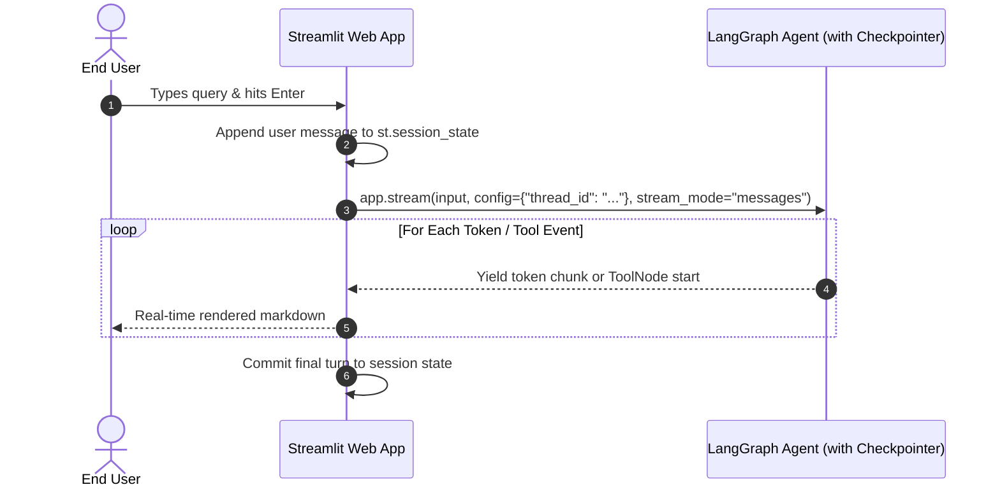

# 📹 Building a Chatbot with UI in LangGraph & Streamlit

<div className="video-card" style={{border: '1px solid #30363d', borderRadius: '8px', padding: '16px', marginBottom: '24px', background: 'rgba(56, 139, 253, 0.05)'}}>
  <div style={{display: 'flex', gap: '16px', flexWrap: 'wrap'}}>
    <div><strong>Instructor:</strong> Nitish Singh (CampusX)</div>
    <div><strong>Duration:</strong> 1948</div>
    <div><strong>Course:</strong> Module 4: Agentic AI & LangGraph</div>
    <div><strong>Watch Link:</strong> <a href="https://www.youtube.com/watch?v=voZAgDmO-rk" target="_blank" rel="noopener noreferrer">YouTube Lecture ↗</a></div>
  </div>
</div>

## 📌 Executive Summary

Connecting stateful LangGraph workflows to interactive user interfaces requires coordinating streaming token events with reactive frontend components. Using Streamlit and FastAPI, engineers can build production-grade conversational UIs complete with chat histories, session thread pickers, and tool execution status badges.

This lesson covers LangGraph event streaming, maintaining session state in Streamlit (`st.session_state`), and rendering tool call status cards.

---

## 🏗️ System Architecture & Execution Flow



---

## 📖 Core Concepts & Technical Deep Dive

### 1. The stream_mode Parameter
LangGraph supports multiple streaming modes:
- `stream_mode="values"`: Emits full state dictionary after each node finishes.
- `stream_mode="updates"`: Emits only the state updates returned by each node.
- `stream_mode="messages"`: Emits fine-grained token chunks and tool call events directly from the model as they generate.

### 2. Managing Chat Threads in UI State
Storing active `thread_id` values in `st.session_state` allows users to toggle between different conversation threads or start a fresh session with a single click.

---

## 💻 Production Implementation

```python
# Streamlit UI integration blueprint
import streamlit as st

def initialize_chat_ui():
    if "messages" not in st.session_state:
        st.session_state.messages = []
    if "thread_id" not in st.session_state:
        st.session_state.thread_id = "session-demo-01"

print("Streamlit UI state management blueprint initialized.")
```

---

## ⚙️ Production Gotchas & Best Practices

:::tip Status Badges for Tools
When an agent invokes a tool, display a collapsible status card in the UI (`st.status("Searching knowledge base...")`). This keeps users informed during 2-5 second tool execution phases.
:::

:::warning Thread Session Loss
Never rely on ephemeral browser storage for critical conversation threads; always ensure the backend LangGraph checkpointer persists to disk.
:::

---

## 📊 Architectural Reference & Comparison

| Stream Mode | Emitted Object | Best For |
| :--- | :--- | :--- |
| `values` | Full State Dict | Debugging node transitions |
| `updates` | Node Delta Dict | Updating specific UI dashboard widgets |
| `messages` | Token Chunks & Tool Events | Real-time conversational streaming |

---

## 📚 Key Takeaways & Enterprise Checklist

- [ ] **Architecture Verification:** Ensure your design addresses latency, decoupled interfaces, and strict data validation contracts.
- [ ] **Deterministic Testing:** Run unit tests and golden dataset evaluations before shipping changes to staging or production.
- [ ] **Security & Observability:** Enforce input/output guardrails, scrub sensitive credentials/PII, and capture distributed traces.
- [ ] **Scalability & Sizing:** Calibrate model parameters, context limits, and compute instance requirements against projected request concurrency.
