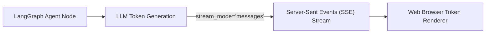

# 📹 Streaming in LangGraph

<div className="video-card" style={{border: '1px solid #30363d', borderRadius: '8px', padding: '16px', marginBottom: '24px', background: 'rgba(56, 139, 253, 0.05)'}}>
  <div style={{display: 'flex', gap: '16px', flexWrap: 'wrap'}}>
    <div><strong>Instructor:</strong> Nitish Singh (CampusX)</div>
    <div><strong>Duration:</strong> 1500</div>
    <div><strong>Course:</strong> Module 4: Agentic AI & LangGraph</div>
    <div><strong>Watch Link:</strong> <a href="https://www.youtube.com/watch?v=D1PcZaeQ2eg" target="_blank" rel="noopener noreferrer">YouTube Lecture ↗</a></div>
  </div>
</div>

## 📌 Executive Summary

Token streaming transforms conversational AI applications from sluggish, multi-second waits into responsive, interactive experiences. LangGraph provides multi-mode streaming interfaces that stream both fine-grained LLM tokens and discrete graph node transitions.

This lesson explores `.stream()` and `.astream()`, streaming modes (`values`, `updates`, `messages`, `custom`), and integrating Server-Sent Events (SSE).

---

## 🏗️ System Architecture & Execution Flow



---

## 📖 Core Concepts & Technical Deep Dive

### 1. Granular Streaming Modes
- `stream_mode="messages"`: Streams token-by-token chunks `(AIMessageChunk, metadata)` directly from internal chat models.
- `stream_mode="updates"`: Yields a notification when a node starts and finishes with its resulting state dictionary.

### 2. Custom Token Dispatches with get_stream_writer
Nodes can emit custom progress messages during long-running data processing tasks using `get_stream_writer()`, keeping end users updated before LLM synthesis begins.

---

## 💻 Production Implementation

```python
from langgraph.graph import StateGraph, START, END
from typing import TypedDict

class StreamState(TypedDict):
    query: str

builder = StateGraph(StreamState)
builder.add_node("process", lambda s: {"query": s["query"].upper()})
builder.add_edge(START, "process")
builder.add_edge("process", END)

app = builder.compile()

# Stream state updates
for event in app.stream({"query": "hello streaming"}, stream_mode="updates"):
    print(f"Event Received: {event}")
```

---

## ⚙️ Production Gotchas & Best Practices

:::tip Async Streaming
In web APIs, always use `astream()` inside asynchronous generator functions (`yield f"data: {chunk}\n\n"`) to prevent blocking server event loops.
:::

:::warning Buffering Proxies
Ensure reverse proxies (like Nginx or Cloudflare) have response buffering disabled (`X-Accel-Buffering: no`), otherwise streamed tokens will be buffered into large delayed blocks.
:::

---

## 📊 Architectural Reference & Comparison

| Mode | Stream Event Output | Typical Consumer |
| :--- | :--- | :--- |
| `messages` | `(AIMessageChunk, metadata)` | Web chat frontends |
| `updates` | `{'node_name': state_delta}` | Background progress bars |
| `values` | `full_state_snapshot` | Telemetry & state recorders |

---

## 📚 Key Takeaways & Enterprise Checklist

- [ ] **Architecture Verification:** Ensure your design addresses latency, decoupled interfaces, and strict data validation contracts.
- [ ] **Deterministic Testing:** Run unit tests and golden dataset evaluations before shipping changes to staging or production.
- [ ] **Security & Observability:** Enforce input/output guardrails, scrub sensitive credentials/PII, and capture distributed traces.
- [ ] **Scalability & Sizing:** Calibrate model parameters, context limits, and compute instance requirements against projected request concurrency.
