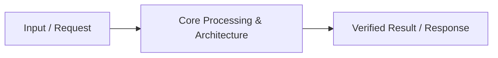

# 📹 How to build a Resume Chat feature like ChatGPT?

<div className="video-card" style={{border: '1px solid #30363d', borderRadius: '8px', padding: '16px', marginBottom: '24px', background: 'rgba(56, 139, 253, 0.05)'}}>
  <div style={{display: 'flex', gap: '16px', flexWrap: 'wrap'}}>
    <div><strong>Instructor:</strong> Nitish Singh (CampusX)</div>
    <div><strong>Duration:</strong> 39m 40s</div>
    <div><strong>Playlist:</strong> Agentic AI with LangGraph (CampusX)</div>
    <div><strong>Watch Link:</strong> <a href="https://www.youtube.com/watch?v=N2nVG2MGWJ8" target="_blank" rel="noopener noreferrer">YouTube Lecture ↗</a></div>
  </div>
</div>

## 📌 Executive Summary & Learning Objectives

This lecture covers **How to build a Resume Chat feature like ChatGPT?**, focusing on production implementations, edge cases, and industry standards:
- Core intuition, architecture, and underlying mechanisms.
- Key differences between theoretical research implementations and scalable enterprise patterns.
- Concrete Python walkthroughs, error recovery, and performance optimization.

---

## 🏗️ Architecture & Conceptual Workflow



---

## 📖 Core Concepts & Technical Deep Dive

### 1. Architectural Foundations
In modern production AI engineering, **How to build a Resume Chat feature like ChatGPT?** is essential for ensuring reliability, low latency, and deterministic outcomes. As AI systems evolve from naive prompt-in / completion-out scripts into distributed systems, engineers must handle:
- **State management & consistency:** Ensuring intermediate states and tool invocations are tracked.
- **Error boundaries & recovery:** Graceful degradation when external LLMs or vector stores encounter rate limits or network partitions.
- **Resource utilization & cost efficiency:** Caching common queries and reducing unnecessary foundation model token expenditure.

### 2. Operational Considerations
- **Latency Optimization:** Pre-computing embeddings, utilizing asynchronous non-blocking event loops, and streaming tokens via Server-Sent Events (SSE).
- **Security & Sandboxing:** Validating inputs before ingestion, sanitizing LLM outputs, and isolating tool execution environments.

---

## 💻 Production Implementation Walkthrough

```python
# Production Implementation Blueprint
def run_production_pipeline():
    print("Executing production pipeline...")

if __name__ == "__main__":
    run_production_pipeline()
```

---

## 💡 Production Best Practices & Tips

:::tip Production Deployment Guideline
When deploying How to build a Resume Chat feature like ChatGPT? in enterprise environments, always configure automated retries with exponential backoff and telemetry tracing (such as OpenTelemetry or LangSmith).
:::

:::warning Common Failure Modes
Watch out for state contamination across concurrent requests. Ensure each session or user interaction uses an isolated thread ID or execution context.
:::

---

## 🎯 Key Takeaways & Quick Reference

| Dimension | Production Standard | Pitfall to Avoid |
| :--- | :--- | :--- |
| **Execution** | Async / Non-blocking with timeouts | Synchronous blocking calls in event loops |
| **Data Validation** | Strict Pydantic v2 schemas | Untyped dictionary access |
| **Monitoring** | Distributed tracing & latency percentiles | Relying only on standard console logs |

## ⏱️ Lecture Timeline & Key Topics

| Timestamp | Key Topic / Concept Discussed |
| :--- | :--- |
| **00:00:00** | हाय गाइज़, माय नेम इज नितेश एंड यू वेलकम... |
| **00:09:30** | अगला काम स्टार्ट करते हैं। सो, अगला... |
| **00:19:14** | लेट्स क्लिक ऑन न्यू चैट। देखो यूआई खाली... |
| **00:29:37** | एट्रिब्यूट को एक्सेस करूंगा। एंड नाउ यू... |
| **00:39:37** | नेक्स्ट वीडियो में। बाय।... |


---

---

## 📜 Complete Lecture Transcript (Hindi / Hinglish)

> **Language:** Hindi / Hinglish | **Source:** `14 - How to build a Resume Chat feature like ChatGPT？ ｜ CampusX.hi-orig.srt` | **Total Segments:** 20 | **Word Count:** ~6,859 words

<details>
<summary><b>Click to expand full chronological transcript (20 timestamped intervals)</b></summary>

#### ⏱️ [00:00 ➔ 00:02]

हाय गाइज़, माय नेम इज नितेश एंड यू वेलकम टू माय YouTube चैनल। इस वीडियो में भी हम लोग अपना एजेंटिक एआई यूजिंग लैंडग्राफ प्लेलिस्ट कंटिन्यू करेंगे। और जैसा कि आपको पता ही है कि पिछले तीन-चार वीडियोस में हमने एक चैटबॉट बनाया है। और हर अगले वीडियो में हम उस चैटबॉट में कुछ नया फीचर ऐड कर रहे हैं। सो, हमने शुरू किया था एकदम बेसिक चैटबॉट से जिसके पास UI भी नहीं था। सारा का सारा चैटिंग कंसोल के थ्रू हो रहा था। उसके बाद हमने उस चैट बॉट में यूआई का फीचर ऐड किया और फिर लास्ट वीडियो में हमने उस चैटबॉट में स्ट्रीमिंग का फीचर ऐड किया। तो इस पॉइंट पे हमारा जो चैटबॉट है वो कुछ ऐसा दिखाई देता है। अ आपके स्क्रीन पे है चैटबॉट। सो अगर मैं लिखूं अ व्हाट इज द रेसिपी ऑफ लेट्स से बिरयानी? तो यू विल गेट एन आउटपुट लाइक दिस। ठीक है? मैंने आपको लास्ट वीडियो में बताया था कि स्ट्रीमिंग का सबसे बड़ा फायदा क्या है? ऑलमोस्ट इंस्टेंटली आपको एज एन यूजर को आउटपुट दिखने लग जाता है। जिससे आपका जो यूजर एक्सपीरियंस है वो बहुत अच्छा हो जाता है। ठीक है? दैट इज व्हाई हमने स्ट्रीमिंग का फीचर ऐड किया था। अब आज हम क्या करने वाले हैं? आज हम अपने चैटबॉट को थोड़ा और इंप्रूव करने जा रहे हैं। ठीक है? सो मैंने यह प्लान किया है कि हम अपने चैटबॉट में एक रिज्यूम चैट का फीचर ऐड करेंगे। सो रिज्यूम चैट का फीचर आई एम प्रीटी श्योर आपने एक्सपीरियंस कर ही रखा होगा। जैसे कि चैट बॉट कोई भी उठा लो। लेट्स से चैट जीपीटी उठा लो। तो वहां पर आपके पास जब आप चैट बॉट को ओपन करते हो लेट्स से आपने चार्ट जीपीडी को लोड किया तो अब आपके पास दो ऑप्शंस होते हैं। या तो आप एक नया चैट शुरू करो किसी नए टॉपिक के ऊपर या फिर आप किसी एग्जिस्टिंग चैट एज इन पुराने चैट को रिज्यूम कर सकते हो जो आपने दो-ती दिन पहले किया था। ठीक है? तो हम ये फीचर ऐड करने वाले हैं। इनफैक्ट मैंने डेमो प्रिपेयर कर रखा है। मैं आपको दिखाता हूं। सो, यह हमारा चैटबॉट रहने वाला है आफ्टर दिस वीडियो। सो जैसे ही आप इसको लोड करोगे फर्स्ट ऑफ ऑल आपके स्क्रीन पे यू विल सी

#### ⏱️ [00:02 ➔ 00:04]

टू अ सेक्शंस। वन सेक्शन इज वेयर यू विल चैट विद द चैट बॉट एंड सेकंड सेक्शन इज़ दिस साइड बार जहां पे आपको दो चीजें दिखाई जा दिखाई जा रही हैं। फर्स्ट आप एक न्यू चैट शुरू कर सकते हो। सेकंड आप अपने एकिस्टिंग कॉन्वर्सेशंस को एक्सेस कर सकते हो। ठीक है? तो फिलहाल मान लो कि हमने एक नया चार्ट ओपन किया है और मैं यहां पे लेट्स से लिखता हूं अ राइट द कोड टू कैलकुलेट द फैक्टोरियल ऑफ अ नंबर इन पython लेट्स से ये मैंने लिखा और मैंने एंटर मारा। अह सो उसने कोड तो जनरेट किया है। थोड़ा यहां पे फॉर्मेटिंग का कुछ इशू आ रहा है। अह बट जो कोड है वह सही है। अह फिर मैंने यहां पे लिखा माय नेम इज़ नितीश और हमारे चैटबॉट ने बोला हेलो नितेश हाउ कैन आई असिस्ट यू? ठीक है? तो ये मेरा एक सिंगल थ्रेड है। ठीक है? अब मैं क्या कर रहा हूं? मैं न्यू चैट में जा रहा हूं। जैसे ही मैं न्यू चैट पे क्लिक कर रहा हूं तो मुझे एक नया चैट विंडो मिल रहा है। जहां पे मैं कुछ और टॉपिक के ऊपर बात कर सकता हूं। जैसे कि राइट अ स्मॉल 100 वर्ड्स लॉन्ग ब्लॉग ऑन अ जॉब क्राइसिस इन द एज ऑफ एआई बहुत रेलेवेंट टॉपिक है। सो यह उसने एक ब्लॉग लिख दिया और यहां पे मैंने लिख दिया व्हाट इज या रादर लेट्स से माय नेम इज़ राहुल इट सेस हेलो राहुल थैंक्स फॉर शेयरिंग योर नेम। अब हमारा जो चैटबॉट है उसका फीचर यह है कि आप किसी भी थ्रेड को एक्सेस कर सकते हो। जैसे अगर मुझे वापस जाना है फैक्टोरियल वाले कोड पे तो मैं जा के इस पे क्लिक करूंगा एंड यू कैन सी ये रहा मेरा प्रीवियस थ्रेड जहां पे मैंने फैक्टोरियल के बारे में बात की थी। यहां पे मैंने अपना नाम भी बताया था। सो अगर मैं इससे पूछूं व्हाट इज़ माय नेम? तो वो बोलेगा योर नेम इज़ नितीश। एंड नाउ

#### ⏱️ [00:04 ➔ 00:06]

इफ आई वांट आई कैन गो बैक टू द अदर चैट एज वेल जहां पे मैंने उससे बात की थी अबाउट दिस ब्लॉग। और यहां पे भी मैंने अपना नाम बताया था। एंड यहां पे अगर मैं बोलूं व्हाट इज माय नेम? तो इट विल से कि योर नेम इज राहुल। तो ये फीचर हम लोग इंप्लीमेंट करने वाले हैं इस वीडियो में। ठीक है? सो स्टार्ट न्यू कॉन्वर्सेशन का भी फीचर होगा। रिज्यूम चैट का भी फीचर होगा। बिल्कुल वैसे ही जैसे चैट जीपीटी जैसे किसी सॉफ्टवेयर में होता है। ठीक है? तो आई होप आपको यह पूरा फीचर एक्साइटिंग लग रहा है। हम इस वीडियो में इस पूरे फीचर को हाथ से कोड करके अ फ्रॉम स्क्रैच डेवलप करेंगे। ठीक है? नाउ लेट्स स्टार्ट द वीडियो। तो चलो गाइस कोडिंग स्टार्ट करते हैं। अब अच्छी बात यह है कि ये जो फीचर हम डेवलप कर रहे हैं रिज्यूम चैट वाला। इसको डेवलप करने के लिए हमें अपने चैटबॉट के बैक एंड में कोई चेंजेस करने की जरूरत नहीं है। सो अगर आपको याद होगा हमने जो चैटबॉट बिल्ड किया है वो दो पार्ट्स में बिल्ड किया है। अ हमने एक बैक एंड बनाया है विद द हेल्प ऑफ लैंग ग्राफ और हमने एक फ्रंट एंड बनाया है विद द हेल्प ऑफ स्ट्रीमलेट। ठीक है? तो आज हम जो फीचर डेवलप कर रहे हैं रिज्यूम चार्ट का वहां पे आपको बैक एंड में कुछ भी चेंज करने की जरूरत नहीं है। यह एकिस्टिंग बैक एंड इज सफिशिएंट। जो भी चेंजेस हमें करने हैं वो हमें फ्रंट एंड में करने हैं। तो मैंने क्या किया है? मैंने एक नई फाइल बना ली है और इस नई फाइल के अंदर हम पूरा का पूरा कोड करेंगे इस फीचर का। ठीक है? अब मैंने क्या किया है कि ये जो पूरा फीचर हमें डेवलप करना है, इसको डेवलप करने का जो रोड मैप है, उसको मैंने ब्रेक डाउन कर लिया है इंटू स्मॉलर टास्क। आई पर्सनली फील कि प्रोग्रामिंग में जो सबसे इंपॉर्टेंट काम होता है वो यह होता है कि आपको जब कोई चीज बनानी है तो आप उस पूरी चीज को छोटे-छोटे टास्क में ब्रेक डाउन कर लो और फिर वो छोटे-छोट छोटे-छोटे टास्क को आप एग्जीक्यूट करते चले जाओ। आपका बड़ा फीचर बन जाता है। तो मैंने एग्जैक्टली यही प्रिंसिपल यहां पे यूज़ किया है। मैंने अपने इस बड़े टास्क को जहां पे मुझे

#### ⏱️ [00:06 ➔ 00:08]

रेज्यूम फीचर रेज्यूम चैट का फीचर डेवलप करना है उसको चार छोटे टास्क में डिवाइड कर दिया है। एज़ यू कैन सी ये पहला टास्क है। यह दूसरा है। ये तीसरा है और यह फाइनली चौथा है। अगर हम ये सारे टास्क कर लेंगे तो ऑटोमेटिकली हमारा फीचर भी बन जाएगा। ठीक है? तो हम एग्जैक्टली यही अप्रोच लेके चलने वाले हैं। तो सबसे पहले व्हाट आई विल डू इज़ कि मैं ये फर्स्ट स्मॉल टास्क एग्जीक्यूट करूंगा। जहां पे बेसिकली हम थोड़ा यूआई डेवलप करेंगे। ठीक है? तो कोड को स्टार्ट करने के पहले एक और चीज मैं आपको बताना चाहूंगा कि हम एग्जैक्टली जो कोड हमने लास्ट वीडियो में लिखा था उसको रीयूज़ करेंगे और उसी कोड के अंदर हम ये एडिशनल फीचर डेवलप करेंगे। सो पिछला वाला कोड मैं एज इट इज यहां पे पेस्ट कर रहा हूं। ये एग्जैक्ट कोड है लास्ट वीडियो का जहां पे हमने स्ट्रीमिंग का फीचर ऐड किया था। ठीक है? यहां पे बस मैंने थोड़ा सा ये कमेंट आउट कर दिया है जिससे कि हमारा कोड थोड़ा ज्यादा रीडेबल है। ठीक है? अब इसी कोड में हमें डेवलपमेंट करना है। तो चलो स्टार्ट करते हैं। सबसे पहले यहां पे मैंने लिखा है कि हमें एक छोटा सा यूआई चेंज करना है। जहां पे हम अपनी वेबसाइट में एक साइड बार ऐड करेंगे। जहां पर एक टाइटल लिखा होगा लंग्राफ्ट चैट बॉट बोल के और वहीं पर हम एक स्टार्ट चैट बटन का ऑप्शन देंगे जिस पे क्लिक करके यूजर एक नया चार्ट चैट स्टार्ट कर सकता है और हम वहीं पर एक अ सेक्शन क्रिएट करेंगे माय कॉन्वर्सेशंस बोल के जिसके नीचे हमें हमारे सारे पास्ट कॉन्वर्सेशंस दिखाई देंगे। ठीक है? तो इतना यूआई हमें सबसे पहले डेवलप करना है। तो व्हाट वी विल डू इज़ कि यहां पर इस जगह पे हम अपने कोड में एक और सेक्शन क्रिएट कर लेते हैं। और इस सेक्शन को हम बुलाते हैं साइड बार यूआई। सो साइड बार से रिलेटेड सारा का सारा यूआई हम यहां पे लिखेंगे। ठीक है? तो सबसे पहले हमें क्या करना है? हमें यहां पर एक टाइटल ऐड करना है। सो हम लिखेंगे एसटी डॉट साइड बार डॉट टाइटल। स्ट्रीमलेट में जैसे ही आप साइड

#### ⏱️ [00:08 ➔ 00:10]

बार यूज करते हो तो आगे वाला यूआई एलिमेंट साइड बार के ऊपर प्लेस होता है। ठीक है? यहां पे मैंने लिख दिया लैंग ग्राफ चैट बॉट। ठीक है? उसके बाद मुझे इसके नीचे एक बटन ऐड करना है। तो मैं लिखूंगा एसटी डॉट साइड बार बटन और बटन में मैं लिख दूंगा स्टार्ट या रादर आई कैन सिंपली राइट न्यू चैट। ठीक है? और इसके ठीक नीचे मुझे एक हेडर चाहिए जिसमें लिखा होगा माय कॉन्वर्सेशंस। ठीक है? ये हमने यूआई ऐड कर लिया। अब एक काम करते हैं चला के देखते हैं कि जो चेंजेस हमने किए हैं वो सही से रिफ्लेक्ट हो रहे हैं कि नहीं। सो हम ये कमांड रन करेंगे। स्ट्रीमलेट फ्रंट एंड थ्रेडिंग। ये है हमारी फाइल का नाम। इट सेस फाइल डज़ नॉट एकज़िस्ट। ओके माय बैड मैंने फाइल का नाम ही गलत लिखा है। यहां पर मैंने फाइल का नाम स्ट्रीमिंग लिख दिया है। मैं इसको एक बार रिनेम कर लेता हूं। इट शुड बी स्ट्रीमलेट। नाउ आई विल रन द प्रीवियस कमांड एंड नाउ इट शुड रन। एंड यू कैन सी गाइस ये रहा हमारा यूआई। ये तीनों चीजें आ गई हैं। ऑब्वियसली इस बटन पे क्लिक करने पे अभी कुछ नहीं होगा। बट हमारा जो चैटबॉट है वो सही से काम कर रहा है। देखा? सो यह जो फर्स्ट टास्क था यह हमने कर लिया। इसके सामने आई कैन सिंपली राइट डन। ठीक है? अब अगला काम स्टार्ट करते हैं। सो, अगला हमारा टास्क है कि हमें एक डायनेमिक थ्रेड आईडी जनरेट करना है और उसको सेशन में ऐड करना है। सो अगर आप एकिस्टिंग कोड देखोगे तो यहां पे आप नोटिस करोगे कि आप क्या कर रहे हो? आप जब चैटबॉट डॉट स्ट्रीम फंक्शन को कॉल कर रहे हो और अपना मैसेज पास कर रहे हो यूजर का साथ ही साथ आप एक थ्रेड आईडी पास कर रहे हो। बट ये जो थ्रेड आईडी है यह बेसिकली आपने खुद से जनरेट किया है।

#### ⏱️ [00:10 ➔ 00:12]

आपने खुद से थ्रेड वन लिखा है। अब प्रॉब्लम क्या है कि यह अप्रोच काम नहीं करेगा। बिकॉज़ होने क्या वाला है? यह न्यू चैट बटन पर क्लिक कर के आपका यूजर कितने भी नए थ्रेड्स या कॉन्वर्सेशन स्टार्ट कर सकता है। आपको नहीं पता पहले से। तो आप इसलिए इस तरीके से थ्रेड आईडीज मैनुअली जनरेट नहीं कर सकते। इंस्टेड आपको क्या करना पड़ेगा? आपको प्रोग्रामेटिकली थ्रेड आईडीज जनरेट करने पड़ेंगे फॉर ईच न्यू कॉन्वर्सेशन। ठीक है? तो इसके लिए हम क्या करेंगे? हम एक लाइब्रेरी है पython में जिसका नाम है यूययूआईडी। अ इसकी हेल्प लेंगे। इसकी हेल्प से आप हर बार एक रैंडम नया थ्रेड आईडी जनरेट कर सकते हो। ठीक है? सो व्हाट वी विल डू इज़ कि सबसे पहले हम एक यूटिलिटी फंक्शन बनाएंगे। जिसका काम ही होगा अ कि जब भी उस फंक्शन को कॉल किया जाएगा एक नया थ्रेड आईडी जनरेट होगा। सो व्हाट वी विल डू इज़ वी विल क्रिएट अ न्यू सेक्शन इन आवर कोड एंड वी विल कॉल इट यूटिलिटी फंक्शनंस। एक से ज्यादा होने वाले हैं। फ्यूचर में और भी यूटिलिटी फंक्शनंस होंगे। फिलहाल हम एक फंक्शन लिख रहे हैं जिसका नाम है जनरेट थ्रेड आईडी। इसको अपना काम करने के लिए कुछ नहीं चाहिए एज इनपुट। और जब आप इस फंक्शन को कॉल करोगे तो यह फंक्शन इन रिटर्न क्या करेगा? यूययूआईडी को कॉल करेगा और उसके अंदर से यूययूआईडी फोर फंक्शन को यूज़ करके एक रैंडम थ्रेड आईडी जनरेट करेगा। इसको मैं एक वेरिएबल में स्टोर कर लेता हूं। लेट्स कॉल इट थ्रेड आईडी और यह थ्रेड आईडी मैं रिटर्न कर दूंगा। ठीक है? तो यह बन गया मेरा यूटिलिटी फंक्शन। यह हर बार मुझे एक रैंडम नया थ्रेड आईडी जनरेट करके देगा। ठीक है? अब हमें क्या करना है? हमें एक डायनेमिक थ्रेड आईडी जनरेट करना है और उसको सेशन में ऐड करना है। तो हम क्या करेंगे? सेशन सेटअप वाले कोड में जाएंगे

#### ⏱️ [00:12 ➔ 00:14]

और यहां पे हम लिखेंगे इफ थ्रेड आईडी नॉट इन एसटी डॉट सेशन स्टेट इसका मतलब हमारा थ्रेड आईडी सेट नहीं हुआ है। तो थ्रेड आईडी को सेट करने के लिए हम क्या करेंगे? हम लिखेंगे एसटी डॉट सेशन स्टेट का थ्रेड आईडी विल बी इक्वल टू जनरेट थ्रेड आईडी। इसका सिंपल मतलब यह है कि अगर हमारा थ्रेड आईडी जनरेटेड नहीं है तो हम इस फंक्शन की हेल्प से एक थ्रेड आईडी जनरेट कर रहे हैं और उसको सेशन में ऐड कर रहे हैं। ठीक है? अब जनरेट तो हो गया। इसके अलावा हमें क्या चेंज करना पड़ेगा? यहां पे नीचे इस जगह पे जहां पे हम मैनुअली थ्रेड आईडी वन या थ्रेड वन भेज रहे हैं। इसके बदले हमें भेजना पड़ेगा एसटी डॉट सेशन स्टेट थ्रेड आईडी। ठीक है? और इस जगह पे जहां पे हम ये पूरा डिक्शनरी मैनुअली भेज रहे हैं। इसके बदले हम कॉन्फिग वेरिएबल भेज देंगे जो हमने यहां पे सेट किया है। ठीक है? तो बेसिकली पुराने कोड को हम थोड़ा सा और अ प्रॉपर्ली स्ट्रक्चर कर रहे हैं। मैनुअली थ्रेड आईडी जनरेट करने के बदले व्हाट वी आर डूइंग इज़ वी आर जनरेटिंग अ डायनेमिक थ्रेड आईडी। सो दैट फ्यूचर में जभी भी न्यू कन्वर्सेशन पे या न्यू चैट पे यूजर क्लिक करे नया चैट क्रिएट हो और उसका खुद का एक नया आईडी ऑटोमेटिकली जनरेट हो जाए। मुझे करने की जरूरत ना पड़े। ठीक है? तो हमने ये सेकंड टास्क भी अचीव कर लिया। डन। उसके बाद यहां पे थर्ड टास्क में लिखा हुआ है कि करंट जो कॉन्वर्सेशन चल रहा है, हम चाहते हैं कि उसका थ्रेड आईडी साइड बार में डिस्प्ले हो। बेसिकली इस जगह पर माय कन्वर्सेशंस में इसके नीचे हमारा जो करंट थ्रेड आईडी है जो करंट कॉन्वर्सेशन का थ्रेड आईडी है वो दिखाई देना चाहिए। तो इसके लिए हम क्या करेंगे? वापस अपने कोड में जाएंगे और जहां पे हमने साइड बार का यूआई बनाया है उस जगह जगह पे हम यहां पे लिखेंगे एसटी डॉट साइड बार डॉट टेक्स्ट और यहां पे हमें क्या डिस्प्ले करना है? हमें

#### ⏱️ [00:14 ➔ 00:16]

डिस्प्ले करना है हमारा करंट थ्रेड आईडी जो कि सेशन में स्टर्ड है। तो हम यहां पे लिखेंगे थ्रेड आईडी एंड सेव। ठीक है? अब एक काम करते हैं। टेस्ट करते हैं इसको। हमने रीलोड किया और जैसे ही हमने रीलोड किया, यू कैन सी ये रहा हमारा थ्रेड आईडी। यह करंट कॉन्वर्सेशन का थ्रेड आईडी है। ठीक है? आई रियली होप आपको यहां तक चीजें समझ में आ रही हैं। सो, हमने अपना फर्स्ट सेट ऑफ टास्क कंप्लीट कर लिए। आई रियली होप यहां तक आपको कुछ भी डिफिकल्ट नहीं लगा। चलो गाइस, अब हम लोग मूव करते हैं अगले सेट ऑफ टास्क की तरफ। ठीक है? हमारा अगला सेट ऑफ टास्क है कि हमने जो न्यू चैट बटन बनाया है यह वाला बटन इसमें हमें फंक्शनैलिटी ऐड करनी है। फिलहाल इसके क्लिक पे कुछ नहीं होता है। हमें इसके क्लिक पे एक फंक्शनैलिटी ऐड करनी है। फंक्शनैलिटी क्या है? कि जैसे ही कोई इस बटन पे क्लिक करेगा, हमें एक नया चैट या नया कॉन्वर्सेशन लोड करना है। ठीक है? मेरे कहने का यह मतलब है कि मान लो यूजर ने यह चैट बॉट चलाया लोड किया और उसने यहां पर लेट्स से चैट करना स्टार्ट किया रेसिपी ऑफ बिरयानी ठीक है वो चैट कर रहा है अचानक से उसको लगा कि मुझे एक डिफरेंट टॉपिक के ऊपर बात करनी है तो वो क्या करेगा वो इस न्यू चैट बटन पे क्लिक करेगा जैसे ही वो न्यू चैट बटन पे क्लिक करेगा होगा क्या कि यह जो यूआई है जहां पे आपको अभी अपना करंट चैट दिख रहा है रेसिपी ऑफ़ बिरयानी नी वाला यह क्लीन हो जाएगा, साफ हो जाएगा और यहां पे आपको एकदम प्लेन नया एंप्टी चैट दिखेगा। ठीक है? जहां पे यूजर नए टॉपिक के बारे में बात कर सकता है। ठीक है? तो ये हमें अचीव करना है। तो ये अचीव करने के लिए देखो हमें क्या-क्या टास्क करने हैं। सबसे पहले वी हैव टू ऐड अ न्यू चैट बटन ऑन द यूआई। ये हम ऑलरेडी कर चुके हैं। तो इस टास्क को मैं हटा देता हूं। रिपीट हो गया। यहां पे मैंने ऑलरेडी न्यू चैट बटन कर रखा है। अब हमें क्या करना है? ऑन द क्लिक ऑफ न्यू चैट वी हैव टू ओपन अ

#### ⏱️ [00:16 ➔ 00:18]

न्यू चैट विंडो एंड बिहाइंड द सीन्स हमें तीन काम करने हैं। पहला हमें एक नया थ्रेड आईडी जनरेट करना है। ऑब्वियसली एक नया कॉन्वर्सेशन स्टार्ट हो रहा है तो उसके कॉस्पोंडिंग एक नया थ्रेड आईडी भी होना चाहिए। ठीक है? उसके बाद वी हैव टू सेव दिस न्यू थ्रेड आईडी इन द सेशन। पुराने वाले थ्रेड आईडी को हम रिप्लेस कर देंगे सेशन में। एंड लास्टली वी हैव टू रिसेट द मैसेज हिस्ट्री। अब अगर आपको याद होगा तो मैंने दो-तीन वीडियोस पहले सेशन आईडी में सेशन में आई एम सॉरी मशन मैसेज हिस्ट्री बोल करके एक वेरिएबल क्रिएट किया था और यहीं पर हम अपने सारे के सारे मैसेजेस जो भी एक्सचेंज हो रहे थे बिटवीन द यूजर एंड द एi वो यहां पे स्टोर कर रहे थे। दिस वाज़ अ लिस्ट। ठीक है? तो जैसे ही यूजर ने बोला रेसिपी ऑफ बिरयानी तो वो आकर के यहां पे स्टोर हो जा रहा था। फिर एआई ने जो पूरा रेसिपी बना के दिया एज अ मैसेज वो भी इस मैसेज हिस्ट्री में स्टोर हो जा रहा था। और फिर हम क्या कर रहे थे? एक लूप चला रहे थे इस मैसेज हिस्ट्री के ऊपर और एक-एक करके हम ये सारे के सारे मैसेजेस को प्रिंट कर रहे थे। तो हमें क्या करना होगा कि अभी करेंटली जो कॉन्वर्सेशन चल रहा है बिरयानी वाला उसके जो भी मैसेजेस हैं उसको खाली करना पड़ेगा। उसको खाली करेंगे तभी हमारा यूआई क्लीन अप होगा नए कॉन्वर्सेशन के लिए। ठीक है? तो ये दो तीन टास्क हमें अचीव करने हैं। वी हैव टू जनरेट अ न्यू थ्रेड आईडी। वी हैव टू सेव इट इन अ सेशन एंड थर्ड वी हैव टू रिसेट आवर मैसेज हिस्ट्री। ठीक है? तो इसके लिए हम क्या करेंगे? सबसे पहले अपने कोड में जाएंगे और एक नया यूटिलिटी फंक्शन बनाएंगे। लेट्स कॉल दिस फंक्शन रिसेट चैट। और इसके अंदर हमें तीन काम करने हैं। सबसे पहले एक थ्रेड आईडी जनरेट करनी है। सो, हम एक नया थ्रेड आईडी वेरिएबल बनाते हैं। और यह हो जाएगा आपका जनरेट थ्रेड आईडी फंक्शन के बराबर। ठीक है? यह मुझे नया थ्रेड आईडी बना के देगा। अब मुझे इस नए थ्रेड आईडी को

#### ⏱️ [00:18 ➔ 00:20]

सेशन में स्टोर करना है। तो मैं लिखूंगा एसटी डॉट सेशन स्टेट का थ्रेड आईडी इक्वल्स थ्रेड आईडी। ये हो गया सेकंड टास्क। और थर्ड टास्क है मुझे अपना मैसेज हिस्ट्री को एंप्टी करना है। सो बेसिकली अभी जो भी है मैसेज हिस्ट्री के अंदर उसको मैं रिप्लेस कर दूंगा विद अ एंप्टी लिस्ट। इसका मतलब हुआ कि जो भी था वो क्लीन अप हो गया। और अब हम क्या करेंगे? नीचे जाएंगे साइड बार यूआई में जहां पे हमने ये बटन बना रखा है न्यू चैट का। इसमें हम लिखेंगे कि इफ दिस न्यू बटन या न्यू चैट बटन इज़ क्लिक सिंपली कॉल रिसेट चैट फंक्शन। एंड दैट्स द कोड गाइस। एक काम करते हैं। एक बार इसको चला के देखते हैं। मैंने रीलोड किया। यहां पर यूजर बात कर रहा है रेसिपी ऑफ इटली। ठीक है? यह उसका एक कन्वर्सेशन चल रहा है। अब उसको लगा कि मुझे एक नया कॉन्वर्सेशन करना है। तो वो जाएगा न्यू चैट पे क्लिक करेगा। अब यहां पे आपको दो चीजें ऑब्जर्व करनी है। दो चीजें होंगी। पहला जैसे ही वो न्यू चैट पे क्लिक करेगा यह जो आपका कॉन्वर्सेशन था इडली के बारे में यह रिप्लेस हो जाएगा। स्क्रीन खाली हो जाएगी। सेकंड यह जो थ्रेड आईडी है इडली वाले कॉन्वर्सेशन के बारे में यह रिप्लेस हो जाएगी विद अ न्यू थ्रेड आईडी। ठीक है? देखना अभी यहां पे लास्ट में 8874 है। लेट्स क्लिक ऑन न्यू चैट। देखो यूआई खाली हो गया और यह देखो नया थ्रेड आईडी आ गया। तो हम नया कॉन्वर्सेशन लोड कर पा रहे हैं। अब यहां पे यूजर कुछ और बात कर सकता है। प्रोग्राम टू स्वाइप टू नंबर्स इन Python। ठीक है? अगेन वो कुछ यूआई का बग है बट यू कैन सी एक नया कॉन्वर्सेशन यूजर कर पा रहा है। हां लेकिन अभी एक प्रॉब्लम यह आ गई है कि हमारा जो पिछला कॉन्वर्सेशन था वो गायब हो जा रहा है। उसका थ्रेड आईडी भी गायब हो जा रहा है। ठीक है? तो उसके बारे में अब हमें कुछ करना पड़ेगा। तो गाइस अब हम लोग मूव करते हैं हमारे थर्ड सेट ऑफ टास्क की तरफ। और यहां पे हमारा मेन फोकस रहेगा कि जो अभी हमारी एक प्रॉब्लम है कि जैसे ही हम न्यू चैट पे क्लिक कर रहे हैं तो हमारा

#### ⏱️ [00:20 ➔ 00:22]

पिछला थ्रेड आईडी गायब हो जा रहा है। हम समऊ उस थ्रेड आईडी को रिटेन करने की कोशिश करेंगे ताकि हम कोई भी थ्रेड आईडी लूज ना करें अगर हम नया चैट क्रिएट कर रहे हैं। ठीक है? तो इस प्रॉब्लम को सॉल्व करने के लिए हम क्या करेंगे? सबसे पहले एक लिस्ट बनाएंगे और उस लिस्ट के अंदर हम सारे के सारे थ्रेड आईडीज को स्टोर करेंगे। ठीक है? और ये जो लिस्ट होगी यह खुद हमारे सेशन का पार्ट होगी। तो ये लिस्ट कभी भी लूज नहीं होगी जब आप नया कॉन्वर्सेशन क्रिएट करोगे। ठीक है? तो बेसिक फंडा ये है कि सबसे पहले यू हैव टू क्रिएट अ लिस्ट इनसाइड योर सेशन व्हिच विल स्टोर ऑल द थ्रेड आईडीज़। ओके? तो ये करने के लिए हम कोड में जाते हैं और कोड में सेशन सेटअप के पास हम ये कोड लिखेंगे। इफ चैट थ्रेड्स यह हमारे लिस्ट का नाम है इज नॉट इन एसटी डॉट सेशन स्टेट तो हम सबसे पहले इसको क्रिएट कर लेंगे एसटी डॉट सेशन स्टेट चैट थ्रेड्स इज़ इक्वल टू अ एंप्टी लिस्ट ठीक है अब हमें क्या करना है कि हमारा जो करंट थ्रेड आईडी है जो फिलहाल खुद सेशन के अंदर स्टर्ड है उसको हमें चैट थ्रेड्स के अंदर डालना है। ठीक है? सो बेसिकली वी हैव टू ऐड अ थ्रेड टू दिस लिस्ट। बट सोच के देखो कि हमें यह काम कितनी बार करना पड़ेगा? बेसिकली हमारा जो सेशन के अंदर थ्रेड आईडी है उसको इस लिस्ट में डालने का काम हमें कितनी बार करना पड़ेगा। द आंसर इज़ टू टाइम्स। एक बार जब आप पेज को लोड करते हो फर्स्ट टाइम तब भी करना पड़ेगा। और सेकंड जितनी बार भी यह न्यू चैट बटन प्रेस होता है और एक नया कन्वर्सेशन क्रिएट होता है फिर से एक नया थ्रेड आईडी जनरेट होगा सेशन में स्टोर होगा तो उस नए थ्रेड आईडी को भी

#### ⏱️ [00:22 ➔ 00:24]

हमें चैट थ्रेड्स में ऐड करना है। तो बेसिकली ये काम हमें दो बार करना है। इसलिए हम क्या करेंगे? इस काम को करने के लिए भी एक यूटिलिटी फंक्शन बना लेंगे। एंड लेट्स कॉल दिस यूटिलिटी फंक्शन ऐड थ्रेड। और इसको अपना काम करने के लिए एक थ्रेड आईडी चाहिए। और यहां पर आप सिंपली यह काम करोगे कि आप सबसे पहले चेक करोगे कि इफ द गिवन थ्रेड आईडी इज नॉट प्रेजेंट इनसाइड एसटी डॉट सेशन स्टेट का चैट थ्रेड्स। अगर चैट थ्रेड्स के अंदर ऑलरेडी वो सेशन थ्रेड आईडी नहीं है। देन ओनली व्हाट यू विल डू इज़ आप सेशन स्टेट चैट थ्रेड्स के अंदर अपेंड कर दोगे इस थ्रेड आईडी को। ठीक है? दिस इज योर फंक्शन। अब आपको क्या करना है? जैसे ही पेज लोड हो रहा है, आप चैट थ्रेड्स बना रहे हो, आप इस जगह पर क्या करोगे? ऐड थ्रेड फंक्शन को कॉल करके आपके सेशन के अंदर जो करंट थ्रेड आईडी है, उसको ऐड कर दोगे चैट थ्रेड्स के अंदर। ठीक है? और सेकंड हमें का क्या करना है कि जब कोई इस बटन को क्लिक करे तो रिसेट चैट फंक्शन कॉल हो रहा है। रिसेट चैट में हम क्या कर रहे हैं? नया थ्रेड आईडी बना रहे हैं। उसको सेशन में स्टोर कर रहे हैं। और इसी जगह पर हम क्या करेंगे? इस नए थ्रेड आईडी को चैट थ्रेड्स वाली लिस्ट में भी ऐड कर देंगे। तो हम यहां पे भी क्या करेंगे? ऐड थ्रेड को कॉल करेंगे। और अ एसटी डॉट सेशन स्टेट थ्रेड आईडी दे देंगे। एंड नाउ वी आर डन। ठीक है? यह काम हमने कर लिया। हमारे पास एक लिस्ट है ऑफ लिस्ट है और उस लिस्ट लिस्ट के अंदर हमारे सारे थ्रेड आईडीस एग्जिस्ट करते हैं। ठीक है? अब हम क्या करेंगे कि जहां पे फिलहाल हम सिर्फ एक थ्रेड आईडी डिस्प्ले कर रहे हैं हमारे साइड बार में करंट कॉन्वर्सेशन वाला। इसके बदले हम क्या करेंगे कि जितने भी थ्रेड आईडीस मौजूद हैं इस पॉइंट पे चैट थ्रेड्स के अंदर उन सबको डिस्प्ले करेंगे। तो इसके

#### ⏱️ [00:24 ➔ 00:26]

लिए हमें क्या करना पड़ेगा? हमें वापस यूआई में जाना पड़ेगा। और साइड बार यूआई में हम क्या कर रहे हैं? हम सिर्फ करंट कॉन्वर्सेशन वाला जो थ्रेड आईडी है उसको डिस्प्ले कर रहे हैं जो कि सेशन में स्ट है। इंस्टेड व्हाट वी विल डू इज़ हम एक लूप चलाएंगे फॉर थ्रेड आईडी इन एसटी डॉट सेशन स्टेट का चैट थ्रेड्स। और इसके अंदर हम क्या करेंगे? टेक्स्ट के अंदर सारे के सारे थ्रेड आईडीस को डिस्प्ले कर देंगे। ठीक है? अब मैं आपको दिखाता हूं यह पूरी चीज काम कैसे कर रही है। सो अगर मैं इसको रीलोड करूं फिलहाल एक सिंगल थ्रेड आईडी है वह प्रिंट हो रहा है। इसमें मैंने बोला हाय माय नेम इज नितीश। ठीक है? अब मैंने न्यू चैट पे जैसे ही क्लिक किया देखना क्या होगा। यह वाला थ्रेड आईडी यहीं पे रहेगा। इसके नीचे एक और थ्रेड आईडी आ जाएगा। यह देखो। और यह मेरा करंट कॉन्वर्सेशन है। यहां पे आई कैन राइट हाय माय नेम इज़ राहुल। ठीक है? यू गेट द आईडिया। अगर मैं फिर से न्यू चार्ट करूंगा। इसके नीचे एक और थ्रेड आईडिया आ जाएगा। हाय माय नेम इज अतुल। ठीक है? सो बेसिकली हमने यह प्रॉब्लम सॉल्व कर लिया कि नया कॉन्वर्सेशन करते हुए पुराना वाला थ्रेड आईडी लूज़ कर जा रहे हैं हम लोग। अब ये प्रॉब्लम नहीं है। ठीक है? सो, हमने ये टास्क भी कर लिया। ये भी हो गया और ये भी कर लिया। अब एक लास्ट चीज और करनी है कि हम हमने जो टेक्स्ट डिस्प्ले कर रखा है यहां पर थ्रेड आईडी को हम एज अ टेक्स्ट डिस्प्ले कर रहे हैं। इसको हम एक क्लिकबल बटन बना देंगे ताकि इस पे क्लिक करने से आगे चलके हम वो कॉन्वर्सेशन लोड कर पाएं। रिज्यूम कर पाएं। तो कुछ नहीं करना है इसमें। ये टेक्स्ट के बदले हम लोग बटन यूज़ कर देंगे। दैट्स इट। रीलोड किया। अ ओके। सो द प्रॉब्लम इज़ आई गेस हमें इसको स्ट्रिंग बनाना पड़ेगा। लेट्स सी हम ये थ्रेड आईडी

#### ⏱️ [00:26 ➔ 00:28]

जो है इसको हमने एक्सप्लसिटली स्ट्रिंग बना दिया। बटन जो फंक्शन है वो स्ट्रिंग एक्सपेक्ट कर रहा है। ठीक है? अगर मैं न्यू चार्ट पे क्लिक करूं। फिर से न्यू चार्ट पे क्लिक करूं। आई एम एबल टू क्रिएट न्यू कॉन्वर्सेशंस। और हर कॉन्वर्सेशन का खुद का थ्रेड आईडी है जो कि हमारे लिस्ट में ऐड होता जा रहा है। और उस लिस्ट से हम सारे थ्रेड आईडीस को एक साथ लोड कर पा रहे हैं हमारे साइड बार में। ठीक है? अब बस एक लास्ट काम बच गया। हम चाहते हैं कि जैसे ही इनमें से किसी भी बटन पर हम क्लिक करें तो वो पर्टिकुलर कॉन्वर्सेशन यहां पे स्क्रीन पे लोड हो जाए। जैसे ही हम यह कर पाएंगे हमारा काम कंप्लीट हो जाएगा। तो चलो गाइस लास्ट सेट ऑफ टास्क को एग्जीक्यूट करते हैं। अब हमारा गोल बहुत सिंपल है कि जैसे ही कोई भी हमारे किसी पर्टिकुलर थ्रेड पे क्लिक करेगा तो हमें उस थ्रेड से एसोसिएटेड जो भी कन्वर्सेशन अभी तक हुआ है उसको मेन एरिया में लोड करना है। सो, बेसिकली व्हाट आई मीन इज़ कि किसी ने अगर अह इस पर्टिकुलर बटन या थ्रेड पे क्लिक किया, तो इस थ्रेड में जो भी बातचीत हुई है यूजर और एआई के बीच में उसको मुझे इस एरिया में लोड करना है। यही मेरा टारगेट है। ठीक है? अब अगर आप स्टेप बाय स्टेप बात करो तो आपको करना क्या पड़ेगा? सबसे पहले जो बटन क्लिक हुआ है उस बटन का थ्रेड आईडी आपको एक्सट्रैक्ट करना पड़ेगा। और फिर आप वह थ्रेड आईडी भेजोगे लंग ग्राफ के पास। और आप लैंग्राफ को बोलोगे कि देखो तुम्हारे पास इस पर्टिकुलर थ्रेड आईडी से एसोसिएटेड जितने भी मैसेजेस हैं वह मुझे ला के दो। लैंग्राफ आपको पलट के सारे मैसेजेस ला के देगा। आपको उन मैसेजेस को उठा के कहां पे डालना है? मैसेज हिस्ट्री में। और फिर मैसेज हिस्ट्री से मैसेजेस को प्रिंट करने का कोड ऑलरेडी लिखा हुआ है। ठीक है? तो स्टेप बाय स्टेप काम करते हैं। सबसे पहले मैं आपको यह दिखाता हूं कि फॉर अ गिवन थ्रेड आईडी आप कैसे मैसेजेस एक्सट्रैक्ट कर सकते हो। ठीक है? सो व्हाट आई विल डू इज़ मैं

#### ⏱️ [00:28 ➔ 00:30]

यहां से इतना कोड इतना कोड कॉपी कर रहा हूं। और लंग्राफ्ट बैक एंड के पास जा रहा हूं। और यहां पे व्हाट आई विल डू इज़ स्ट्रीम के बदले आई विल सिंपली कॉल इनवोक। यहां पर यूजर कंटेंट में आई विल जस्ट से समथिंग लाइक हाय माय नेम इज नितीश और कॉन्फिग के लिए व्हाट वी विल डू इज़ कि विल क्रिएट वी विल कॉपी दिस ठीक है वी विल कॉपी दिस और यहां पे ये एसटी थ्रेड आईडी होने के बदले सिंपली थ्रेड वन हो जाएगा ठीक है और ये हटा देने हटा देंगे हम और ये बन जाएगा हमारा रिस्पांस। ओके। अब हम क्या चाहते हैं कि हम इस पर्टिकुलर थ्रेड से एसोसिएटेड जितने भी मैसेजेस हैं उसको एक्सट्रैक्ट करना चाहते हैं। तो इसके लिए आपको सिंपली क्या करना होता है? आपको लिखना होता है चैटबॉट डॉट गेट स्टेट। मैंने आपको यह फंक्शन पहले भी बताया था। और यहां पे आपको सिंपली कॉन्फिग में अपने कॉन्फिग को भेज देना है। बेसिकली आपको अपना थ्रेड आईडी बता देना है। और इसको मैं प्रिंट कर लेता हूं। जस्ट टू शो यू सेव इस कोड को रन करते हैं। एंड यू कैन सी ये देखो कितना सारा इनेशन आ रहा है। इन द फॉर्म ऑफ़ स्टेट स्नैपशॉट ऑब्जेक्ट। और जो मैसेजेस हैं वो इस वैल्यू वैल्यूस एट्रिब्यूट में हैं। तो व्हाट आई विल डू इज मैं इस पूरे रिस्पांस का डॉट वैल्यूस एट्रिब्यूट को एक्सेस करूंगा। एंड नाउ यू कैन सी आपके पास एक डिक्शनरी है जिसके अंदर मैसेजेस बोल के एक की है और उसके अंदर लिस्ट के अंदर आपके मैसेजेस हैं। तो व्हाट वी विल डू इज़ इस डिक्शनरी के अंदर से हम इस की को एक्सट्रैक्ट करेंगे। नाउ इफ आई रन दिस यह देखो अब हमारे पास मैसेजेस आ गए। यह रहा एक ह्यूमन मैसेज। यह

#### ⏱️ [00:30 ➔ 00:32]

रहा दूसरा एआई मैसेज। तो इस तरीके से आप किसी भी थ्रेड आईडी से एसोसिएटेड सारे मैसेजेस एक्सट्रैक्ट कर सकते हो। ठीक है? तो व्हाट वी विल डू इज़ इतना कोड कट कर लेते हैं। ये सारा कोड हटा देते हैं। और इस कोड को वापस पुराने वाले स्टेट में ले आते हैं। जैसे ये पहले था। और यहां पे हम आके क्या करते हैं? एक सिंपल यूटिलिटी फंक्शन बनाते हैं। जिसका काम यह होगा कि अगर आप उस फंक्शन को कॉल करोगे और एक थ्रेड आईडी दोगे तो यह फंक्शन पलट के आपको पूरा का पूरा मैसेजेस का लिस्ट रिटर्न करेगा जो उस थ्रेड के अंदर स्टर्ड है। तो हम इस फंक्शन को कॉल करेंगे लोड कॉन्वर्सेशन। इसको अपना काम करने के लिए एक थ्रेड आईडी चाहिए होगा और यह सिंपली आपको रिटर्न करेगा। यह चीज ऑब्वियसली प्रिंट करने की जरूरत नहीं है। यह देखो आपने थ्रेड आईडी प्रोवाइड किया और यहां पे हमें क्या करना पड़ेगा? इसको कॉपी करना पड़ेगा। हम यहां पे जाएंगे। कॉन्फिग के बदले यह डाल देंगे। और इसके बदले थ्रेड आईडी डाल देंगे। एंड दैट्स आवर कोड गाइस। ये रहा लोड कॉन्वर्सेशन वाला फंक्शन। ठीक है? अब देखो करना क्या है कि साइड बार यूआई में जाना है जहां पर हम चैट थ्रेड से हमारे सारे के सारे थ्रेड्स को लोड कर रहे हैं और हर थ्रेड को हम लोड कर रहे हैं इनसाइड अ बटन व्हिच मींस इट इज़ क्लिकबल। तो हम यहां पर एक एक्शन एसोसिएट करेंगे। हम बोलेंगे कि इफ दिस पर्टिकुलर थ्रेड बटन इज़ क्लिक देन डू व्हाट? हमें सबसे पहले क्या करना है? लोड कन्वर्सेशन को कॉल करना है विद दिस थ्रेड आईडी करंट थ्रेड आईडी जो भी इस बटन का थ्रेड आईडी है वो हम पास करेंगे। इससे हमें लिस्ट ऑफ मैसेजेस मिल जाएंगे। ठीक है? अब हमें क्या करना है? इन्हीं मैसेजेस को उठा करके डाल देना है मैसेज हिस्ट्री में। द ओनली प्रॉब्लम इज कि हमारा जो मैसेज हिस्ट्री है उसका

#### ⏱️ [00:32 ➔ 00:34]

फॉर्मेट थोड़ा डिफरेंट है। अगर आपको याद होगा तो ये फॉर्मेट में हमारा मैसेज हिस्ट्री मैसेजेस को स्टोर कर रहा है। इट्स बेसिकली अ लिस्ट ऑफ़ डिक्शनरी लाइक दिस। ठीक है? जहां पे हर डिक्शनरी के अंदर दो कीज़ हैं। पहला है रोल जो बताता है यूजर का रोल है या असिस्टेंट का रोल है। और सेकंड इज़ कंटेंट व्हिच इज़ द मैसेज कंटेंट। एंड द प्रॉब्लम इज कि हमें जो मैसेजेस यहां से मिल रहे हैं लोड कॉन्वर्सेशन से वो इस फॉर्मेट में है। इट्स बेसिकली अ लिस्ट और उस लिस्ट के अंदर इस तरीके से मैसेजेस हैं। तो ये काइंड ऑफ़ कंपैटिबिलिटी इशू हो गया। तो हमें क्या करना पड़ेगा? इस फॉर्मेट से इस फॉर्मेट पे जाना पड़ेगा। तो हमें थोड़ा सा मैनुअल कोड लिखना है। कोड कुछ ऐसा होगा। हम यहां पे सिंपली लिखेंगे। अच्छा यहां पर एक चीज हमने गलती कर दी और गलती यह है कि जैसे ही कोई पर्टिकुलर बटन या कॉन्वर्सेशन पर हमारा यूजर क्लिक कर रहा है तो हमें उस कन्वर्सेशन का थ्रेड आईडी तो मिल जा रहा है बट हमें क्या करना पड़ेगा उस थ्रेड आईडी को सेशन में भी स्टोर करना पड़ेगा क्योंकि आगे का सारा काम इसी चीज पे डिपेंड कर रहा है तो हम लिखेंगे सेशन का थ्रेड आईडी विल बिकम दिस करंट थ्रेड आईडी और फिर हम यह पास कर रहे हैं। ठीक है? अब देखो आगे का कोड मैं आपको दिखाता हूं। हम क्या कर रहे हैं? हम वो कंपैटिबिलिटी ब्रेक ना हो वो वाला कोड लिख रहे हैं। सो व्हाट आई एम डूइंग इज़ कि मैं एक अ टेम मैसेज डिक्शनरी बोल के अ लिस्ट बना रहा हूं। एक्चुअली टेंप मैसेजेस बोल के एक लिस्ट बना रहा हूं। ठीक है? एंड व्हाट आई एम डूइंग इज़ कि आई एम रनिंग अ लूप ऑन दिस मैसेजेस। यह लिस्ट है। तो, मैं बोल रहा हूं फॉर ईच मैसेज इन मैसेजेस व्हाट आई हैव टू डू इज आई हैव टू सिंपली चेक इफ द करंट मैसेज का इंस्टेंस करंट मैसेज का इंस्टेंस

#### ⏱️ [00:34 ➔ 00:36]

इज़ ह्यूमन मैसेज। तो मैं रोल बोल के एक वेरिएबल में स्टोर कर रहा हूं यूजर। एल्स मैं रोल में स्टोर कर रहा हूं असिस्टेंट। ठीक है? और लूप के अंदर मैं लिख रहा हूं टेंप मैसेजेस डॉट अपेंड और अपेंड मैं कर रहा हूं एक डिक्शनरी के फॉर्म में रोल व्हाटएवर इज द वैल्यू ऑफ़ रोल वेरिएबल एंड कंटेंट जो भी मैसेजेस का कॉनेंट है। ठीक है? अगर आपको ये थोड़ा कंफ्यूजिंग लग रहा है, तो मैं एक काम करता हूं। इसको एमएसजी बुला लेता हूं। यहां पर इस पूरे कोड में हम सिंपली क्या कर रहे हैं कि हमारे पास यह जो इस फॉर्मेट में मैसेजेस हैं, इसको हम इस फॉर्मेट में ला रहे हैं। सो दैट मैसेज हिस्ट्री सही से लोड हो पाए। और जैसे ही हमारा ये टेंप मैसेजेस वाला लिस्ट पॉपुलेट हो गया, हम इस लूप से बाहर आएंगे और हम लिखेंगे एसटी डॉट सेशन स्टेट का मैसेज हिस्ट्री इज़ इक्वल टू टेम मैसेजेस। एंड दैट्स इट गाइज़। आगे का कोड अपने आप हैंडल हो जाएगा। बिकॉज़ यहां पर हमने यूआई में कैसे मैसेज हिस्ट्री को प्रिंट करना है, वह कोड लिख रखा है। ठीक है? तो, लेट्स रन दिस कोड। लेट्स सी यह काम कर रहा है कि नहीं। ठीक है? करेंटली वी हैव दिस चैट। मैंने बोला हाय, माय नेम इज़ नितीश। उसने बोला, "हेलो नितेश, हाउ कैन आई असिस्ट यू?" अब मैं गया न्यू चैट पे। यह नया चैट आ गया। यहां पे मैंने बोला हाय माय नेम इज़ राहुल। ठीक है? अब मैं क्या करूंगा? मैं पिछले चार्ट पे जाने की कोशिश करूंगा और मुझे पुराना कॉन्वर्सेशन हिस्ट्री देखना चाहिए। देखो यहां पे दिख रहा है। हाय माय नेम इज नितीश। हेलो नितीश। हाउ कैन आई असिस्ट यू? अगर मैं नीचे वाले पे क्लिक करूं तो मुझे राहुल दिखाई दे रहा है। वापस नितीश। अगर मैं यहां पे पूछूं व्हाट इज माय नेम? इट सेज़ योर नेम इज़ नितीश। अगर मैं यहां पे जाऊं और मैं बोलूं व्हाट इज माय नेम? योर नेम इज राहुल। ठीक है? सो,

#### ⏱️ [00:36 ➔ 00:38]

हम स्विच कर पा रहे हैं, रिज्यूम कर पा रहे हैं कन्वर्सेशन। एक चीज और छोटी सी है, वह हम चेंज कर सकते हैं। जनरली क्या होता है कि जो आपका सबसे रीसेंट चार्ट होता है, वो ऊपर दिखाई देता है। हमारे केस में उल्टा है। पुराना चार्ट ऊपर आ रहा है, नया चार्ट नीचे आ रहा है। तो, इसको हम कैसे बदल सकते हैं? हमें सिंपली क्या करना पड़ेगा? यहां पर इस जगह पर जहां पर हम चैट थ्रेड्स को डिस्प्ले कर रहे हैं। इस लिस्ट को हम रिवर्स कर सकते हैं। और ऐसा करने से क्या होगा? अगर मैं रीलोड करूं हाय माय नेम इज नितीश। न्यू चैट हाय माय नेम इज़ राहुल। ठीक है? अब आपने शायद नोटिस किया होगा। नया चार्ट ऊपर आ रहा है। यह पुराना चार्ट है नितीश वाला। यह नया चार्ट है राहुल वाला। एक नया चार्ट बना लेते हैं। राइट कोड फॉर फैक्टोरियल। ठीक है? अब सम हाउ वह जो यूआई का इशू हो रहा था वो भी सॉल्व हो गया। यह सबसे ऊपर आ रहा है। इसके नीचे राहुल इसके नीचे नितीश ये रहा आपका फैक्टोरियल का कोड। अगेन कुछ यूआई बग है ये स्ट्रीम का। सो या गाइस हमने जो फीचर जो फीचर प्लान किया था वह हमने बना लिया है और एक छोटा सा होमवर्क मैं देता हूं आपको अगर आप साथ ही साथ कोड कर रहे हो तो थोड़ा दिमाग लगाओ कि कैसे हम यहां पर यूआई के ऊपर रादर देन डिस्प्लेइंग दीज़ थ्रेड्स किसी तरीके से थोड़ा लॉजिकल नाम दे पाएं कन्वर्सेशन को जैसा चैट जीपीटी में होता है। ठीक है? अगेन यह आपका काम है। मैं करा सकता था। बट फिर आप ही लोग बोलते हो कि थोड़ा होमवर्क भी देना चाहिए। तो यह आप सोचो। अभी तक अगर आपने कोड किया है तो आई एम प्रीटी श्योर थोड़ा दिमाग आप लगा पाओगे। ठीक है? बाकी स्लोली स्टेडीली हमारा चैटबॉट इंप्रूव कर रहा है। एक बहुत बड़ी प्रॉब्लम अभी है इस चैटबॉट में और वो यह है कि जैसे ही मैं रिफ्रेश

#### ⏱️ [00:38 ➔ 00:39]

करता हूं इस चैटबॉट को हमारे पुराने सारे कॉन्वर्सेशंस चले जाते हैं। हम उनको दोबारा एक्सेस नहीं कर सकते। और उसका रीज़न यह है कि हमने पर्सिस्टेंस के लिए इन मेमोरी सेवर यूज़ किया है। और यह एक ऐसा चेक पॉइंटर है जो सारे मैसेजेस को सारे थ्रेड्स को RAM में स्टोर करता है। तो जैसे ही हम प्रोग्राम को रिफ्रेश कर रहे हैं। हमारा प्रोग्राम टर्मिनेट हो जा रहा है। RAM से बाहर चला जा रहा है। तो सारी की सारी एसोसिएटेड मेमोरी भी खत्म हो जा रही है। नेक्स्ट वीडियो में हम क्या करेंगे? हम अपने लैंग ग्राफ बैक एंड को एक डेटाबेस से कनेक्ट करेंगे। और उससे यह फायदा होगा कि जब आप रिफ्रेश भी करोगे तो आपके पास्ट कॉन्वर्सेशंस लूज नहीं होंगे। वह एज इट इज इंटैक्ट रहेंगे। सो अगर आपने आज कॉन्वर्सेशन किया, चार दिन बाद आपने दोबारा चैटबॉट को लोड किया, आपको आपके मैसेजेस बिल्कुल वैसे ही दिखाई देंगे। ठीक है? यह हम लोग नेक्स्ट वीडियो में करेंगे। सो, आई होप आपको यह पूरी चीज़ एक्साइटिंग लग रही है। अ खुद से एक चार्ट बॉट बना रहे हो। आगे चलके हम इसी चार्ट बॉट में टूल्स का फीचर ऐड करेंगे। एमसीपी के प्रिंसिपल्स इंप्लीमेंट करेंगे। रैक का फीचर इंप्लीमेंट करेंगे। और कुछ और फीचर्स का भी प्लान है। वो सब कुछ हम यहां पे ऐड करेंगे। एंड विद इन लाइक थ्री वीक्स आई एम एक्सपेक्टिंग कि यह एक बहुत पावरफुल चैट पॉट बन जाएगा। ठीक है? सो या अगर आपको यह वीडियो पसंद आया प्लीज लाइक करना। अगर आपने इस चैनल को सब्सक्राइब नहीं किया है, प्लीज डू सब्सक्राइब बिकॉज़ अब हम यहां पे जेएनएआई रिलेटेड काफी कंटेंट डाल चुके हैं और आगे फ्यूचर में भी बहुत सारा कंटेंट डालने वाले हैं। ठीक है? सो, मिलते हैं नेक्स्ट वीडियो में। बाय।

</details>
