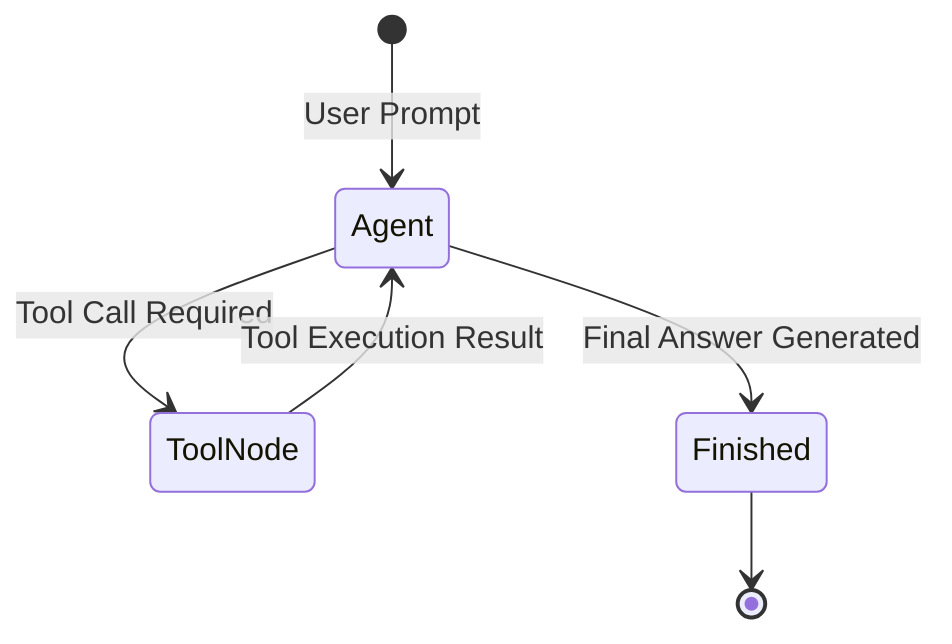

# 📹 LangGraph + SQLite ｜ Chatbot with Database Integration

<div className="video-card" style={{border: '1px solid #30363d', borderRadius: '8px', padding: '16px', marginBottom: '24px', background: 'rgba(56, 139, 253, 0.05)'}}>
  <div style={{display: 'flex', gap: '16px', flexWrap: 'wrap'}}>
    <div><strong>Instructor:</strong> Nitish Singh (CampusX)</div>
    <div><strong>Duration:</strong> 28m 48s</div>
    <div><strong>Playlist:</strong> Agentic AI with LangGraph (CampusX)</div>
    <div><strong>Watch Link:</strong> <a href="https://www.youtube.com/watch?v=c6a47iX5JkU" target="_blank" rel="noopener noreferrer">YouTube Lecture ↗</a></div>
  </div>
</div>

## 📌 Executive Summary & Learning Objectives

This lecture covers **LangGraph + SQLite ｜ Chatbot with Database Integration**, focusing on production implementations, edge cases, and industry standards:
- Core intuition, architecture, and underlying mechanisms.
- Key differences between theoretical research implementations and scalable enterprise patterns.
- Concrete Python walkthroughs, error recovery, and performance optimization.

---

## 🏗️ Architecture & Conceptual Workflow



---

## 📖 Core Concepts & Technical Deep Dive

### 1. Architectural Foundations
In modern production AI engineering, **LangGraph + SQLite ｜ Chatbot with Database Integration** is essential for ensuring reliability, low latency, and deterministic outcomes. As AI systems evolve from naive prompt-in / completion-out scripts into distributed systems, engineers must handle:
- **State management & consistency:** Ensuring intermediate states and tool invocations are tracked.
- **Error boundaries & recovery:** Graceful degradation when external LLMs or vector stores encounter rate limits or network partitions.
- **Resource utilization & cost efficiency:** Caching common queries and reducing unnecessary foundation model token expenditure.

### 2. Operational Considerations
- **Latency Optimization:** Pre-computing embeddings, utilizing asynchronous non-blocking event loops, and streaming tokens via Server-Sent Events (SSE).
- **Security & Sandboxing:** Validating inputs before ingestion, sanitizing LLM outputs, and isolating tool execution environments.

---

## 💻 Production Implementation Walkthrough

```python
from typing import TypedDict, Annotated, List
from langgraph.graph import StateGraph, END
import operator

# 1. Define State Schema
class AgentState(TypedDict):
    messages: Annotated[List[str], operator.add]
    next_step: str

# 2. Define Node Functions
def analyze_input(state: AgentState):
    print("Analyzing query...")
    return {"messages": ["Query analyzed."], "next_step": "generate"}

def generate_response(state: AgentState):
    print("Generating response...")
    return {"messages": ["Final response generated."], "next_step": "end"}

# 3. Build StateGraph
workflow = StateGraph(AgentState)
workflow.add_node("analyze", analyze_input)
workflow.add_node("generate", generate_response)

workflow.set_entry_point("analyze")
workflow.add_edge("analyze", "generate")
workflow.add_edge("generate", END)

app = workflow.compile()
output = app.invoke({"messages": ["Hello Agent"], "next_step": ""})
print(output)
```

---

## 💡 Production Best Practices & Tips

:::tip Production Deployment Guideline
When deploying LangGraph + SQLite ｜ Chatbot with Database Integration in enterprise environments, always configure automated retries with exponential backoff and telemetry tracing (such as OpenTelemetry or LangSmith).
:::

:::warning Common Failure Modes
Watch out for state contamination across concurrent requests. Ensure each session or user interaction uses an isolated thread ID or execution context.
:::

---

## 🎯 Key Takeaways & Quick Reference

| Dimension | Production Standard | Pitfall to Avoid |
| :--- | :--- | :--- |
| **Execution** | Async / Non-blocking with timeouts | Synchronous blocking calls in event loops |
| **Data Validation** | Strict Pydantic v2 schemas | Untyped dictionary access |
| **Monitoring** | Distributed tracing & latency percentiles | Relying only on standard console logs |

## ⏱️ Lecture Timeline & Key Topics

| Timestamp | Key Topic / Concept Discussed |
| :--- | :--- |
| **00:00:00** | हाय गाइज़, माय नेम इज़ नितीश एंड यू आर... |
| **00:06:58** | पॉइंटर को उस सीक्वलाइट डेटाबेस से कनेक्ट... |
| **00:14:19** | इस बार वो मुझे राहुल बुलाएगा। ये देखो... |
| **00:21:27** | उसके बाद करंट सेशन में जितने नए थ्रेड्स... |
| **00:28:46** | में।... |


---

---

## 📜 Complete Lecture Transcript (Hindi / Hinglish)

> **Language:** Hindi / Hinglish | **Source:** `15 - LangGraph + SQLite ｜ Chatbot with Database Integration ｜ CampusX.hi-orig.srt` | **Total Segments:** 15 | **Word Count:** ~5,586 words

<details>
<summary><b>Click to expand full chronological transcript (15 timestamped intervals)</b></summary>

#### ⏱️ [00:00 ➔ 00:02]

हाय गाइज़, माय नेम इज़ नितीश एंड यू आर वेलकम टू माय YouTube चैनल। इस वीडियो में भी हम लोग अपना एजेंटिक एआई यूज़िंग लंग ग्राफ प्लेलिस्ट कंटिन्यू करेंगे। और अगर आप इस प्लेलिस्ट को अभी तक कंटीन्यूअसली देख रहे हो तो शायद आपको पता होगा कि हम पिछले चारप वीडियोस से एक चैटबॉट डेवलप करने की कोशिश कर रहे हैं। हमने इनिशियली जो चैटबॉट बनाया था सबसे पहले वो बहुत ही बेसिक लेवल था। जहां पर हमने लंग ग्राफ की हेल्प से एक चैटबॉट वर्क फ्लो बनाया था। और हम उससे बातचीत करने के लिए हमारे वीएस कोड का कंसोल टर्मिनल यूज कर रहे थे। फिर हमने क्या किया? उस चैटबॉट को इंप्रूव करने के लिए उसमें एक जीयूआई ऐड किया। हमने स्ट्रीम का हेल्प लिया और उस वीडियो में हमने सीखा कि कैसे आप अपने चैटबॉट को जिसका बैक एंड लैंगग्राफ में लिखा हुआ है उसको एक यूआई दे सकते हो विथ द हेल्प ऑफ़ स्ट्रीम। ठीक है? उसके बाद हमने उस चैटबॉट को थोड़ा और इंप्रूव किया। इन द सेंस हमने उसमें स्ट्रीमिंग का फीचर ऐड किया। सो अभी तक क्या हो रहा था कि पूरा का पूरा जो रिस्पांस था हमारे चैटबॉट का वो वन गो में स्क्रीन पर एक साथ प्रिंट हो रहा था। बट हमने डिस्कस किया था कि ये यूजर एक्सपीरियंस पॉइंट ऑफ व्यू से अच्छा नहीं है। दैट इज व्हाई हमने वहां पे स्ट्रीमिंग का फीचर ऐड किया। यहां पे जैसे ही टोकन जनरेट होना शुरू होता है एलएलएम के पास वैसे ही हमारे यूजर को दिखना भी चालू हो जाता है। उसके बाद जो फोर्थ इंप्रूवमेंट हमने किया वो था कि हमने अपने चैटबॉट में थ्रेड्स का फीचर ऐड किया जिसकी हेल्प से कोई भी यूजर अगर चाहे तो अपने पास्ट कॉन्वर्सेशंस को रिज्यूम कर सकता है। ठीक है? सो इस पॉइंट पे हमारा जो चैटबॉट है वो कुछ ऐसा दिखाई देता है। अगर आप अपने स्क्रीन पे देखोगे तो दिस इज़ द चैटबॉट दैट वी हैव राइट नाउ। यहां पर आप जाकर के एक नया कॉन्वर्सेशन कर सकते हो। जैसे कि मैंने बोला हाय माय नेम इज नितीश और मैंने एंटर मारा और हमारा चैटबॉट रिप्लाई कर रहा है। एंड एट द सेम टाइम आई कैन क्रिएट अ न्यू चैट और वहां पे आई कैन डू सम अदर कन्वर्सेशन लेट्स से रेसिपी ऑफ पास्ता। ठीक है? नाउ द बेस्ट पार्ट इज़ कि आप पुराने किसी कॉन्वर्सेशन पे जा सकते हो।

#### ⏱️ [00:02 ➔ 00:04]

जैसे कि यह वाला यहां पे मैंने अपने बारे में बात की है। तो आई कैन गो बैक एंड से अह व्हाट इज़ माय नेम। तो वह मुझे बता देगा। सिमिलरली आई कैन गो टू द पास्ता रेसिपी। हाउ लॉन्ग विल दिस रेसिपी टेक टू कुक? लेट्स से मैंने यह क्वेश्चन पूछ लिया। तो उसने बता दिया कि 20 से 25 मिनट लगेगा। ठीक है? तो ये फीचर हमने डेवलप कर दिया है। बट देयर इज़ अ बिग प्रॉब्लम। द प्रॉब्लम इज दिस कि सिंस हम शॉर्ट टर्म मेमोरी इंप्लीमेंट करने के लिए इन मेमोरी सेवर यूज कर रहे हैं। इसका मतलब यह है कि हम हमारे सारे के सारे जो कन्वर्सेशंस हो रहे हैं यूजर के साथ उसको रैम में स्टोर कर रहे हैं। सो जैसे ही हम अपने एप्लीकेशन को बंद करते हैं या फिर सिंपली पेज को भी रीलोड करते हैं तो आपका सारा का सारा जो कन्वर्सेशन है जो आपने अभी तक किया वो सब गायब हो जाता है। सो बेसिकली कोई परमानेंट स्टोरेज नहीं है। आज के वीडियो में हम इस प्रॉब्लम को सॉल्व करेंगे। हम क्या करेंगे? इन मेमोरी सेवर को हटा करके उसके बदले हम एक दूसरा चेक पॉइंटर यूज़ करेंगे। जहां पर हम हमारे चैटबॉट को एक डेटाबेस से इंटीग्रेट करेंगे। जो भी मैसेजेस हमारा यूजर भेजेगा और हमारा एआई रिप्लाई करेगा उन मैसेजेस को हम उस डेटाबेस में स्टोर करेंगे और उससे यह फायदा होगा कि कल को अगर आपका एप्लीकेशन बंद भी हो जाता है या फिर आप अपने पेज को रिफ्रेश भी कर देते हो तो भी आपके कन्वर्सेशंस इंटैक्ट रहेंगे। आप तीन-चार दिन बाद आकर के भी बिल्कुल उसी पॉइंट से अपना कॉन्वर्सेशन रिज्यूम कर सकते हो जहां पर आपने लास्ट छोड़ा था। ठीक है? तो यह फीचर हमें आज इंप्लीमेंट करना है और दिस इज द मेन एजेंडा फॉर दिस वीडियो। सो आई होप आपको ये पूरी चीज समझ में आ गई। पूरा प्लान ऑफ एक्शन समझ में आ गया। नाउ लेट्स स्टार्ट द वीडियो। सो गाइस, हम लोग ये पूरा फीचर स्टेप बाय स्टेप डेवलप करेंगे। और स्टार्ट करने के पहले मैं आपको बस एक बात बताना चाहूंगा कि इस पर्टिकुलर फीचर को डेवलप करने के लिए आपको अपने बैक एंड में भी चेंजेस करने पड़ेंगे और आपको अपने फ्रंट एंड में भी चेंजेस करने पड़ेंगे। बैक एंड एज इन जहां पे आपने लंग ग्रा्राफ्ट का कोड लिख रखा है और फ्रंट एंड एज इन जहां पे आपने अपना स्ट्रीमलेट का कोड लिख रखा है। उन दोनों

#### ⏱️ [00:04 ➔ 00:06]

जगहों पे आपको चेंजेस करने पड़ेंगे। सो हम लोग क्या करते हैं? सबसे पहले एक बार अपना प्रोजेक्ट फोल्डर ओपन करते हैं। सो ये है हमारा प्रोजेक्ट फोल्डर। एंड व्हाट आई विल डू इज कि मैं दो नई फाइल्स बना रहा हूं। ठीक है? वन इज फॉर द बैक एंड एंड द अदर वन इज़ फॉर द फ्रंट एंड। सो पहले बैक एंड के ऊपर काम करते हैं। सो इस फाइल का नाम रखते हैं लग्राफ डेटाबेस बैक एंड डॉटpy। और हम क्या करेंगे? सबसे पहले इसमें एग्ज़िस्टिंग जो बैक एंड है उसका पूरा कोड पेस्ट कर देंगे। ठीक है? और यहीं पर हम चेंजेस करेंगे। सो सबसे पहले हमें क्या करना है? है। मैंने यहां पे स्टेप बाय स्टेप लिख रखा है कि क्या-क्या चीजें हमें करनी पड़ेंगी इन ऑर्डर टू डेवलप दिस फीचर। सबसे पहले व्हाट वी हैव टू डू इज़ वी हैव टू इंस्टॉल दिस लाइब्रेरी कॉल्ड लैंग्राफ्ट चेक पॉइंट सीक्वलाइट। सो व्हाट वी आर गोइंग टू डू इज़ कि इंस्टेड ऑफ यूजिंग दिस इन मेमोरी सेवर वी आर गोइंग टू यूज़ सीक्वलाइट डेटाबेस का चेक पॉइंटर। ठीक है? सो अगर आप लैंग्राफ्ट के डॉक्यूमेंटेशन पे जाओगे तो वहां पे आपको तीन तरह के चेक पॉइंटर्स देखने को मिलते हैं। पहला है इन मेमोरी सेवर जो हमने अभी तक यूज़ किया है रैम बेस्ड। दूसरा है सीक्वलाइट सेवर अ जो सीक्वलाइट डेटाबेस के ऊपर बेस्ड है। ये जनरली आप प्रोटोटाइपिंग के लिए यूज़ करते हो। बहुत स्मॉल सा डेटाबेस है। और प्रोडक्शन ग्रेड चीजों को बनाने के लिए उतना यूज़ नहीं होता है। बट सिंस अभी हम चीजें सीख रहे हैं लैंग्राफ्ट में। दैट इज़ व्हाई वी आर गोइंग टू अ स्टिक विद सीक्वलाइट सेवर। एंड द थर्ड वन इज पोस्ट ग्रेड अ व्हिच इज एक्चुअली अ प्रॉपर डेटाबेस। उसको आप यूज कर सकते हो जब आप प्रोडक्शन ग्रेड चैट बॉट्स बना रहे हो। बट राइट नाउ वी आर जस्ट इंटू द लर्निंग फेस। दैट इज व्हाई आई हैव डिसाइडेड कि हम सीक्वलाइट सेवर को यूज़ करेंगे। ठीक है? तो उसके लिए आपको क्या करना पड़ेगा? सबसे पहले एक लाइब्रेरी को इंस्टॉल करना पड़ेगा। ठीक है? और इस लाइब्रेरी का नाम है लैंग्राफ्ट चेक पॉइंट सीक्वलाइट। ठीक है? ये अभी बिल्ट इन नहीं है। लैंग्राफ के अंदर। आई एम प्रीटी श्योर कम्युनिटी में किसी ने डेवलप किया होगा और इन अ फ्यूचर वर्जन

#### ⏱️ [00:06 ➔ 00:08]

डेफिनेटली वो लैंग्राफ का पार्ट बन जाएगी। बट राइट नाउ आपको एक एक्सटर्नल लाइब्रेरी को इंस्टॉल करना पड़ेगा। अ इंस्टॉल करने के लिए व्हाट यू कैन डू इज़ यू कैन सिंपली Google lang्राफ्ट चैट पॉइंट सीक्वल लाइट। ये आपको सिंपली Google करना है। आपको सबसे टॉप पे ये पेज दिखाई देगा और आपको ये कमांड कॉपी कर लेना है। और आपको क्या करना है? है अपने वर्चुअल एनवायरमेंट में जाके इस कमांड को रन कर देना है। सो मेरे केस में इट्स ऑलरेडी इंस्टॉल्ड। आपके में थोड़ा ज्यादा टाइम लग सकता है। ठीक है? अब आप क्या करोगे? lang्राफ्ट डॉट चेक पॉइंट डॉट मेमोरी के बदले आप सीक्वलाइट को इंपोर्ट करोगे और सीक्वलाइट में भी आप सीक्वलाइट सेवर को इंपोर्ट करोगे। ठीक है? दिस इज़ द फर्स्ट चेंज। उसके बाद आपको क्या करना है? जहां पर आपने चेक पॉइंटर डिफाइन कर रखा है। इस जगह पर आपको इन मेमोरी सेवर के बदले सीक्वलाइट सेवर को कॉल करना है। अब ये सीक्वलाइट सेवर ऐसे डायरेक्टली काम नहीं करता है। आपको क्या करना पड़ेगा? बिहाइंड द सीन्स एक सीक्वलाइट डेटाबेस बनाना पड़ेगा और आपको इस पर्टिकुलर चेक पॉइंटर को उस सीक्वलाइट डेटाबेस से कनेक्ट करना पड़ेगा। ठीक है? तो कैसे होगा ये पूरा प्रोसेस? मैं आपको बताता हूं। सबसे पहले व्हाट यू विल डू इज़ कि आप Python में इंपोर्ट करोगे सीक्वलाइit 3 को और इसकी हेल्प से आप सीक्वलाई डेटाबेससेस बना सकते हो। सो आप लिखोगे सीक्वल 3 डॉट कनेक्ट ये फंक्शन है। यहां पे आपको दो चीजें प्रोवाइड करनी है। फर्स्ट आपके डेटाबेस का नाम। सो हमारे डेटाबेस का नाम है लेट्स से चैटबॉट डॉट डीबी। ठीक है? अगर ये डेटाबेस ऑलरेडी एकिस्ट नहीं करता होगा तो इस कमांड के रन होने के बाद क्रिएट हो जाएगा। ठीक है? कहां पे क्रिएट होगा? हमारे प्रोजेक्ट डायरेक्टरी में। ठीक है? और सेकंड यहां पे हमें ऐड करना है एक और एट्रिब्यूट या पैरामीटर आप बोल सकते हो चेक सेम थ्रेड बोल के। इसको आपको फॉल्स करना है। ठीक है? इसका क्या फंडा होता है? अ सो होता क्या है कि अगर आप इसको ट्रू रखोगे। मान लो डिफॉल्ट इसका ट्रू है। अगर आप इसको ट्रू रखोगे तो प्रॉब्लम क्या होती है कि आपका कोड एरर देता है। और वो एरर इसलिए आता है

#### ⏱️ [00:08 ➔ 00:10]

बिकॉज़ आप आगे चलके अपने कोड में मल्टीपल थ्रेड्स यूज़ करने वाले हो टू हैंडल मल्टीपल कॉन्वर्सेशंस। बट सीक्वलाइट में क्या रेस्ट्रिक्शन है कि सीक्वलाइट डेटाबेस सिर्फ सिंगल थ्रेड पे काम करता है। जिस थ्रेड में ये क्रिएट हुआ है उसी थ्रेड में आप इसको यूज़ कर सकते हो। किसी दूसरे थ्रेड में इसको यूज़ नहीं कर सकते। तो दैट इज व्हाई एरर थ्रो होता है। तो हम क्या कर रहे हैं? हम एक्सप्लसिटली बोल रहे हैं चेक सेम थ्रेड फॉल्स। मतलब हम बोल रहे हैं कि इस सेम डेटाबेस को हम अलग-अलग थ्रेड्स में यूज़ करेंगे। आप टेंशन मत लो। ठीक है? तो वो ये चेक करना बंद कर देगा कि आपका डेटाबेस जिस थ्रेड में क्रिएट हुआ है और जिस थ्रेड में यूज़ हो रहा है क्या वो सेम है कि नहीं। बेसिकली ये रेस्ट्रिक्शन हम हटा रहे हैं। ठीक है? तो थोड़ा सा टेक्निकल पार्ट है। आप थोड़ा सा इसको Google करोगे आपको समझ में आ जाएगा। फिलहाल बस ऐसा समझो कि हमारे वर्क फ्लो के लिए इस पैरामीटर का फॉल्स होना जरूरी है। ठीक है? अब हम क्या करेंगे? इस पूरी चीज को रन करने से हमें एक कनेक्शन ऑब्जेक्ट मिलता है और यही कनेक्शन ऑब्जेक्ट हम भेजेंगे हमारे चेक पॉइंटर में। सो ये दो लाइन का कोड क्या करेगा? आपके लिए एक सीक्वलाइट सेवर चेक पॉइंटर बना देगा। बिहाइंड द सीन एक डेटाबेस बन रहा है और आपका चेक पॉइंटर क्या करेगा? सारा का सारा जो वैल्यूज़ आएगा उसको इस डेटाबेस में स्टोर करता चला जाएगा। ये कम्युनिकेशन ऑटोमेटिकली एस्टैब्लिश्ड है। लैंग्राफ में ये कोड लिखा हुआ है। ठीक है? तो सब कुछ रेडी है। एक काम करते हैं। एक बार टेस्ट कर लेते हैं कि सच में जब हम हमारे चैटबॉट को यूज़ करके मैसेज भेज रहे हैं पलट के जब एआई का रिप्लाई आ रहा है तो क्या वो सच में डेटाबेस में स्टोर हो रहा है या फिर नहीं। तो टेस्ट करने के लिए मैं यहां पे कुछ कोड लिख रहा हूं। अ कोड बहुत सिंपल है। हम क्या करेंगे? हम हमारे फ्रंट एंड वाले कोड पे जाएंगे और फ्रंट एंड वाले कोड से हम वो वाला पार्ट उठा लेंगे जहां पे हम चैटबॉट को यूज़ करके हमारे एलएलएम से कम्युनिकेट करते हैं। सो हम चैटबॉट डॉट इनवोक फंक्शन को कॉल करेंगे। ये स्ट्रीम मोड भेजने की जरूरत नहीं है। यूजर इनपुट में लेट्स से हमने भेज दिया। हाय माय नेम

#### ⏱️ [00:10 ➔ 00:12]

इज़ नितीश। ठीक है? और इसके अलावा हमें एक कॉन्फ़िगरेशन वेरिएबल भी भेजना पड़ेगा। सो हम इसको भी कॉपी कर लेते हैं और इस जगह पर पेस्ट कर देते हैं। और यहां पे हमारा जो थ्रेड आईडी होगा उसको हम लोग मैनुअली रख लेते हैं। थ्रेड वन। ठीक है? सो ये हो गया मेरा सेटअप। इस कोड को रन करने से पलट के हमें जो रिस्पॉन्स मिलेगा उसको हम लोग एक वेरिएबल में स्टोर कर लेते हैं और प्रिंट करते हैं इस रिस्पांस को। ठीक है? तो अब मैं क्या करूंगा? मैं इस कोड को रन करूंगा। ठीक है? मैं एक बार समराइज़ कर देता हूं मैंने अभी तक क्या-क्या चेंजेस किए। सबसे पहले मैंने इन मेमोरी सेवर को रिप्लेस कर दिया विद सीक्वलाइड सेवर। यहां पे इन दो लाइंस में मैंने अपने सीक्वलाइड सेवर चेक पॉइंटर को सेटअप किया। ठीक है? सेटअप करने के लिए मुझे क्या चाहिए था? एक डेटाबेस चाहिए था सीक्वलाइड डेटाबेस वो मैंने क्रिएट किया जिससे मुझे एक कनेक्शन ऑब्जेक्ट मिला। वो कनेक्शन ऑब्जेक्ट मैंने इस पर्टिकुलर क्लास में भेजा और मेरा चेक पॉइंटर बन गया। और अब आगे का कोड बिल्कुल सेम है। व्हाट आई एम डूइंग इज़ मैं सिंपली अपने चैटबॉट को एक मैसेज भेज रहा हूं। दैट हाय माय नेम इज नितीश। ठीक है? अब जैसे ही मैं इस कोड को रन करूंगा आपको दो चीजें दिखाई देंगी। फर्स्ट आपको रिस्पांस दिखाई देगा। अपना मैसेज दिखाई देगा एज इन हाय माय नेम इज नितीश और एi का मैसेज दिखाई देगा। बट सेकंड बहुतेंट चीज जो आपको दिखाई देगी वो ये है कि आपको अपने प्रोजेक्ट डायरेक्टरी में एक चैटबॉट डॉट डीबी फाइल दिखाई देगी। ऑटोमेटिकली क्रिएट हो जाएगी और उसके अंदर आपका सारा का सारा डेटा स्टोर हो जाएगा। ठीक है? एक बार मैं आपको रन करके दिखाता हूं। देखो सबसे पहले यह रहा मेरा मैसेज हाय माय नेम इज नितीश और यहां पर पलट के एआई का मैसेज है। हेलो नितीश हाउ कैन आई असिस्ट यू टुडे? ठीक है? ये पहली चीज आपको ऑब्ज़र्व करनी है। दूसरी चीज ये है कि आपके पास ये चैट बॉट डॉट डीवी फॉर्म हो गया है। और फिलहाल मैं आपको नहीं दिखाऊंगा बट आई कैन प्रॉमिस यू दिस कि ये दोनों मैसेजेस हाय माय नेम इज नितीश एंड हेलो नितीश। हाउ कैन आई असिस्ट यू? ये दोनों इस चार्ट डॉट में स्टोर हो चुके हैं। लेट्स प्रूव दिस। प्रूव कैसे करेंगे? हम अपने कोड को दोबारा रन करेंगे और यहां

#### ⏱️ [00:12 ➔ 00:14]

पर हम पूछेंगे व्हाट इज माय नेम। ठीक है? अब अगर हमने इन मेमोरी सेवर यूज़ किया होता तो हमें हमारा आंसर नहीं मिलता। बिकॉज़ हमारा प्रोग्राम एक बार रन हो करके बंद हो चुका है। तो मेमोरी खाली हो चुकी है। बट सिंस अब हमने हमारे चेक पॉइंटर में सीक्वलाइड सेवर यूज़ कर रखा है। तो वो जाकर के डेटाबेस में देखेगा कि पहले क्या वैल्यूज़ थी, क्या मैसेजेस थे और उनके बेसिस पे आपको आंसर मिलेगा। सो अगर मैं इसको रन करूं देखो आपको अब शुरू से रिस्पांस दिखाई देगा। सबसे पहले आया हाय माय नेम इज नितेश। उसके बाद आया हेलो हाउ कैन आई असिस्ट यू टुडे। उसके बाद फिर से मेरा थर्ड मैसेज आया जो कि खोजने में थोड़ी परेशानी हो रही है। बट यह रहा व्हाट इज माय नेम? और फिर उसके बाद आया योर नेम इज नितीश। कैन यू सी दो के बदले चार मैसेजेस दिखाई दे रहे हैं। और ऐसा इसलिए बिकॉज़ दो मैसेजेस पिछले वाले रन के हैं और दो मैसेजेस इस वाले रन के हैं। और पिछले वाले रन के मैसेजेस हम इसलिए एक्सट्रैक्ट कर पाए बिकॉज़ वो डेटाबेस में सेफली स्टर्ड है। ठीक है? तो आई होप आपको समझ में आया है कि कैसे हमारा डेटाबेस बेस्ड अ चेक पॉइंटर काम कर रहा है। अब मजेदार चीज़ क्या है कि आप यहां पे थ्रेड को बदल दो। थ्रेड वन के बदले थ्रेड टू कर दो और यहां पर बोलो लेट्स से हाय माय नेम इज लेट्स से राहुल सेव किया अब मैंने रन किया अब क्या होगा ये एक कंप्लीटली नए थ्रेड में दो नए मैसेजेस जाके स्टोर हो जाएंगे कौन-कौन से हाय माय नेम इज राहुल हेलो राहुल हाउ कैन आई असिस्ट यू टुडे ठीक है अब अगर मैं पूछूं व्हाट इज माय नेम तो देखो आंसर हमें फिर से क्या मिलेगा योर नेम इज राहुल और फिर से चार मैसेजेस हैं। सो अब हमारे थ्रेड टू में भी चार मैसेजेस हैं। आप बहुत आसानी से थ्रेड चेंज कर लो। थ्रेड वन और फिर से पूछो व्हाट इज द कैपिटल ऑफ इंडिया नॉलेज माय नेम व्हाइल

#### ⏱️ [00:14 ➔ 00:16]

आंसरिंग। ठीक है? तो अब सिंस ये थ्रेड वन है तो आपको आंसर में नितीश दिखाई देना चाहिए। सो यह देखो इंडिया इज़ न्यू दिल्ली। थैंक यू फॉर योर क्वेश्चन। नितीश हाउ एल्स कैन आई हेल्प यू टुडे? ठीक है? अब मैं यहां पे अगर थ्रेड टू करके सेम क्वेश्चन रन करूं तो फिर से मुझे आंसर मिलेगा। बट इस बार वो मुझे राहुल बुलाएगा। ये देखो थैंक्स फॉर आस्किंग राहुल। सो हमने अभी जस्ट ये डेमोंस्ट्रेट किया कि कैसे फर्स्ट ऑफ़ ऑल प्रोग्राम के बंद होने के बाद भी आपके पुराने मैसेजेस खो नहीं रहे हैं। आप उनको रिट्रीव कर पा रहे हो। और सेकंड, आपके मैसेजेस थ्रेड्स में स्टोर हो रहे हैं। थ्रेड वन के मैसेजेस अलग तरीके से डेटाबेस में स्टोर हो रहे हैं। और थ्रेड टू के मैसेजेस अलग तरीके से डेटाबेस में स्टोर हो रहे हैं। और आप थ्रेड आईडी पकड़ कर के दोनों मैसेजेस को एक्सट्रैक्ट कर सकते हो। ठीक है? तो आई रियली होप आपको ये पूरा डेमोंस्ट्रेशन अभी तक समझ में आया। तो बैक एंड पॉइंट ऑफ व्यू से हमने सीख लिया कि कैसे आप एक डेटाबेस बेस्ड चेक पॉइंटर सेटअप करते हो। सो गाइस, हमने बैक एंड वाला काम तो कर लिया। हमारा चेक पॉइंटर सही से सेटअप हो गया है। काम भी कर रहा है। सो, यह पार्ट हो गया है। यह इंस्टॉलेशन हो गया है। हमने डेटाबेस इंप्लीमेंट कर लिया है। और हमने मल्टीपल थ्रेड्स में चैटिंग करके भी देख ली है। अब एक इंटरेस्टिंग चीज मैं आपको दिखाता हूं। हम क्या करेंगे कि हमारा जो डेटाबेस बना है चैटबॉट डीB हम उसको एक बार ओपन करके देखेंगे कि सच में उसके अंदर अलग-अलग थ्रेड्स के अंदर मैसेजेस स्टोर हो रहे हैं। अब ये देखने के लिए आपके पास मल्टीपल ऑप्शंस हैं। उनमें से एक ऑप्शन ये है कि आप वीएस कोड में एक्सटेंशन पे जाओ और वहां पे आप सीक्वलाइड सर्च करो। तो वहां पे आपको दो-तीन ऑप्शंस मिलेंगे। जैसे कि मैंने यह पर्टिकुलर एक्सटेंशन इंस्टॉल इंस्टॉल कर रखा है सीक्वलाइट व्यूअर बोल के। दिस इज़ द पब्लिशर नेम फ्लोरियन क्लैंफर। ठीक है? तो ये आप एक बार इंस्टॉल कर लो। जैसे ही आप इसको इंस्टॉल करोगे होगा क्या कि आपका चैटबॉट डीबी जो बनेगा उसको आप सिंपली क्लिक करोगे और आप उसको

#### ⏱️ [00:16 ➔ 00:18]

व्यू कर पाओगे। ठीक है? आप बहुत आसानी से उसको वीएस कोड में ही देख पाओगे। कुछ और सॉफ्टवेयर्स भी होते हैं जिनकी हेल्प से आप इस डेटाबेस फाइल को व्यू कर सकते हो। बट ये सबसे स्ट्रेट फॉरवर्ड तरीका है कि आपने वीएस कोड में ही इंस्टॉल किया और वीएस कोड में ही व्यू कर लिया। ठीक है? तो नाउ यू कैन सी यहां पर आपके सारे के सारे चेक पॉइंट्स आपको दिखाई दे रहे हैं। देख रहे हो? सो देयर आर मल्टीपल थ्रेड्स। फर्स्ट ऑफ़ ऑल दो थ्रेड्स आपको दिखाई देंगे। थ्रेड वन और थ्रेड टू। और ये रिपीट हो रहे हैं। और वो रिपीट इसलिए हो रहे हैं बिकॉज़ आप क्या कर रहे हो? आप सेम कोड को रन कर रहे हो विद द सेम थ्रेड नंबर। सो हमारा जो चैटबॉट है उसका जो वर्क फ्लो हमने बनाया है उसमें आपने इस तरीके से अपने वर्क फ्लो को डिजाइन किया है कि आपके एक एग्जीक्यूशन में तीन चेक पॉइंटर्स अ काइंड ऑफ क्रिएट होते हैं। तीन चेक पॉइंट्स क्रिएट होते हैं। एक स्टार्ट के टाइम, एक चैट नोड के पास और एक एंड के पास। तो दैट इज व्हाई हमने शुरू में थ्रेड वन को पकड़ के जैसे ही चलाया तो ये तीन चेक पॉइंट्स क्रिएट हुए। वन टू एंड थ्री। जहां पे मैंने बोला कि हाय माय नेम इज नितीश। उसके बाद मैंने दोबारा चलाया था यह बोल के कि व्हाट इज माय नेम? तो उसके लिए तीन और क्रिएट हुए। उसके बाद मैंने थ्रेड चेंज करके बोला था हाय माय नेम इज राहुल। तो फिर से तीन क्रिएट हुए। फिर मैंने पूछा था व्हाट इज माय नेम? तो फिर से तीन और क्रिएट हुए। उसके बाद मैंने फिर से थ्रेड चेंज करके पूछा था व्हाट इज द कैपिटल ऑफ न्यू दिल्ली। आई एम सॉरी व्हाट इज द कैपिटल ऑफ इंडिया? और साथ में मेरा नाम भी बताओ। तो फिर से तीन चेक पॉइंट्स उसके आए। और अगर आप उसके बाद मैंने फिर से चेंज किया था थ्रेड और मैंने बोला था कि व्हाट इज़ द कैपिटल ऑफ़ इंडिया फिर से मेरा नाम लेके बताओ। तो फिर से उसका भी थ्री आया। दैट इज़ व्हाई आपको इतने सारे चेक पॉइंट्स दिखाई दे रहे हैं। बट टोटल नंबर ऑफ यूनिक थ्रेड्स आपके पास दो ही हैं। अब अगर आपको देखना है कोई पर्टिकुलर थ्रेड तो आप क्या कर सकते हो? उसके ऊपर ऐसे क्लिक कर सकते हो। यहां पे क्लिक ना करके आप एक्चुअली यहां पे जा सकते हो चेक पॉइंट पे और इस जगह पे डबल क्लिक करोगे और यहां पे इस पे क्लिक करोगे तो यहां पे आपको सारे मैसेजेस दिखाई देंगे। अब यह बहुत परफेक्ट तरीके से नहीं दिखाई दे रहा है। बट यू कैन सी हाय

#### ⏱️ [00:18 ➔ 00:20]

माय नेम इज राहुल। उसके बाद दिखाई देगा एआई मैसेज। हेलो राहुल हाउ कैन आई हेल्प यू? फिर उसका अगला मैसेज व्हाट इज माय नेम? योर नेम इज राहुल। व्हाट इज द कैपिटल ऑफ इंडिया? द कैपिटल ऑफ इंडिया इज़ न्यू दिल्ली। राहुल ऐसे करके सब कुछ आपको इस पर्टिकुलर ऑब्जेक्ट में दिखाई देगा। ठीक है? तो दिस इज़ हाउ यू कैन एक्चुअली गो एंड विजुअलाइज़ योर सीक्वलाइ डेटाबेस। ठीक है? इससे आपको सीधे-सीधे दिखाई दे जाएगा कि कितने चेक पॉइंट्स बने हैं पर थ्रेड। ठीक है? तो आई वुड रिकमेंड अगर आप साथ में कर रहे हो ये पूरी चीज तो डेफिनेटली एक्सटेंशन इंस्टॉल करके देखो। इससे विजुअली आपको चीजें दिखाई देंगी तो थोड़ा सा आपका कॉन्फिडेंस और बढ़ेगा। और अगर आपको ये सब कुछ समझ में नहीं आ रहा है कि इतने चेक पॉइंटर्स क्यों बने तो आप एक बार पीछे जाके इस प्लेलिस्ट में मेरा जो पर्सिस्टेंस वाला वीडियो है वो जरूर देखना। वहां पे हमने ये सब कुछ बहुत डिटेल में डिस्कस किया है कि कब किस जगह पे आपका चेक पॉइंट बनता है। ठीक है? सो आई रियली होप आपको अभी तक चीजें एकदम क्रिस्टल क्लियर है। सो हमने बैक एंड में चेंजेस कर लिए हैं और हमने अपना डेटाबेस विजुअलाइज करके भी देख लिया है। अब आता है मेन काम जहां पे हमें अपने फ्रंट एंड में चेंजेस करने हैं। सो दैट हम अपने फ्रंट एंड में जो भी चैट करें वो लूज़ ना हो। अब अच्छी चीज यह है कि आपको बहुत ज्यादा चेंजेस नहीं करने अपने एकिस्टिंग फ्रंट एंड के कोड में। सो व्हाट आई विल डू इज़ आई विल गो टू माय कोड एंड यहां पे आई विल क्रिएट अ न्यू फाइल लेट्स कॉल इट स्ट्रीमलेट फ्रंट एंड डेटाबेस डॉट py ठीक है और मैं क्या करूंगा हमारा जो लास्ट फ्रंट एंड का कोड है जो हमने पिछले वीडियो में लिखा था थ्रेडिंग वाले में उसको मैं कॉपी करके एज़ इट इज़ यहां पे पेस्ट कर दूंगा। ठीक है? अब देखो इस पूरे के पूरे फ्रंट एंड लॉजिक में आपको सिर्फ और सिर्फ एक जगह पर चेंज करना है और मैं आपको बताता हूं वो चेंज क्या है। आपको एकदम शुरुआत में जहां पे आप सेशन को सेटअप कर रहे हो आपको बस यहां पे

#### ⏱️ [00:20 ➔ 00:22]

चेंजेस करने हैं। क्या चेंजेस करने हैं वो भी मैं आपको बताता हूं। सो इफ यू रिमेंबर हम तीन चीजें सेशन में सेटअप कर रहे हैं। पहला मैसेज हिस्ट्री जहां पर हम एक पर्टिकुलर थ्रेड के सारे मैसेजेस को एक लिस्ट में डाल रहे हैं और उसको सेशन में स्टोर कर रहे हैं। सेकंड करेंटली जो भी चैट चल रही है उसका थ्रेड आईडी भी मैं सेशन में स्टोर कर रहा हूं। और थर्ड है कि जितने भी थ्रेड्स हैं हमारे चैटबॉट के ऊपर उन सबको मैं सेशन में स्टोर कर रहा हूं। ठीक है? अब यहां पर आप देखना कि जब हम पिछला वाला कोड यूज कर रहे हैं तो हम हमारे प्रोग्राम को स्टार्ट होते ही हमारे चैटबॉट के लोड होते ही चैट थ्रेड्स को एंप्टी बता रहे हैं और ये लॉजिकल है। राइट? क्योंकि हमारे पास परमानेंट स्टोरेज नहीं था पहले। तो हर बार जब भी चैटबॉट नए से लोड होगा वो उसमें जीरो थ्रेड्स होंगे। कोई थ्रेड एक्सिस्ट नहीं करेंगे। बट नाउ आपने परमानेंट स्टोरेज इंप्लीमेंट कर लिया है। व्हिच मींस कि पास्ट के थ्रेड्स आपके डेटाबेस में हैं। तो अब आप ऐसे जीरो से स्टार्ट नहीं करोगे। अब आपको क्या करना पड़ेगा कि जैसे ही आप इस जगह पे आओगे, आप सबसे पहले जाकर के अपने बैक एंड वाले कोड से पूछोगे कि बताओ ऑलरेडी डेटाबेस में कितने थ्रेड्स एग्ज़िस्ट करते हैं? जैसे हमारे केस में अभी दो थ्रेड्स एक्सिस्ट करते हैं। थ्रेड वन एंड थ्रेड टू। तो यहां पे इनिशियलाइज़ करते टाइम यहां पे ऑलरेडी ये रहना चाहिए। थ्रेड वन एंड थ्रेड टू। उसके बाद करंट सेशन में जितने नए थ्रेड्स बनते जाएंगे वो भी हम इस लिस्ट में ऐड करते जाएंगे। राइट? तो द ओनली चेंज दैट यू नीड टू डू इज़ कि यहां पे जो आप एंप्टी लिस्ट से इनिशियलाइज कर रहे हो इसके बदले आपको जाकर के अपने बैक एंड से पूछना पड़ेगा कि डेटाबेस में ऑलरेडी कितने थ्रेड्स एकिस्ट करते हैं और उन थ्रेड्स को ला करके आप यहां पे फिल करोगे। तो हमें क्या करना पड़ेगा? हमें एक बार बैक एंड पे फिर से जाना पड़ेगा और यहां पे हमें एक कोड लिखना पड़ेगा जो हमें ये बताएगा कि ऑलरेडी हमारे चैटबॉट के डेटाबेस में कितने

#### ⏱️ [00:22 ➔ 00:24]

थ्रेड्स मौजूद हैं। ठीक है? और ये करने के लिए व्हाट आई विल डू इज़ पहले तो ये जो कोड हमने टेस्टिंग के लिए लिखा था इसको मैं हटा दूंगा। और अब मैं आपको दिखाता हूं कि कैसे आप नंबर ऑफ थ्रेड्स एक्सट्रैक्ट कर सकते हो। तो आपके पास ना जो चेक पॉइंटर ऑब्जेक्ट है उसके पास एक फंक्शन होता है लिस्ट बोल के। यह लिस्ट क्या करता है? यह आपको टोटल नंबर ऑफ चेक पॉइंट्स जितने भी मौजूद हैं अभी आपके डेटाबेस में वो निकाल के दे सकता है। या फिर अगर आप चाहो तो किसी पर्टिकुलर थ्रेड के अंदर कितने चेक पॉइंट्स हैं वो निकाल के आपको दे सकता है। जैसे अगर आप अभी देखो तो हमारे डेटाबेस में 18 चेक पॉइंट्स हैं। इसमें से नौ चेक पॉइंट थ्रेड वन के हैं। नौ चेक पॉइंट थ्रेड टू के हैं। तो ये जो फंक्शन है ये मुझे क्या करेगा? या तो ओवरऑल जितने चेक पॉइंट्स स्ट हैं डेटाबेस में वो निकाल के देगा। या फिर अगर मैं यहां पर बता दूं कि मुझे थ्रेड वन का चाहिए तो वो थ्रेड वन से एसोसिएटेड नाइन चेक पॉइंट्स निकाल के आपको देगा। ठीक है? तो मैं यहां पे सिंपली नन भेज रहा हूं। नन भेजने का मतलब है कि मुझे किसी पर्टिकुलर थ्रेड आईडी का चेक पॉइंट्स नहीं चाहिए। मुझे सारे के सारे चेक पॉइंट्स चाहिए। ठीक है? तो देखो इस कोड को रन करने से क्या होगा? जैसे ही आप इस कोड को रन करोगे आपको एक बहुत बड़ा सा आउटपुट दिखना चाहिए। एक्चुअली बड़ा सा आउटपुट नहीं दिख रहा है। हो क्या रहा है कि आपको पलट के एक जनरेटर ऑब्जेक्ट मिल रहा है। ठीक है? कोई बात नहीं। जनरेटर ऑब्जेक्ट मिल रहा है। तो व्हाट वी कैन डू इज़ कि हम इसके ऊपर लूप चला सकते हैं। सो हम लिखेंगे फॉर ईच चेक पॉइंट इन दिस जनरेटर ऑब्जेक्ट प्रिंट द डिटेल्स ऑफ द चेक पॉइंट। ठीक है? अब शायद आपको बहुत डरावना सा आउटपुट दिखेगा। यह देखो। यह रहा वह बहुत डरावना सा आउटपुट। ठीक है? क्योंकि हमारे पास 18 चेक पॉइंट्स हैं और हर चेक पॉइंट से रिलेटेड बहुत सारा मेटाडेटा भी है। यह देखो। सो, यह एक चेक पॉइंट टपल बोल के प्रिंट हो रहा है। और उस चेक पॉइंट टपल के अंदर कॉन्फिग के अंदर

#### ⏱️ [00:24 ➔ 00:26]

आपको सारा डिटेल मिलेगा। तो, मैं एक काम करता हूं। हर चेक पॉइंट का कॉन्फिग्स करता हूं। देखो। तो, कॉन्फिग एक्सट्रैक्ट करने से मुझे 18 चेक पॉइंट्स का यह डिटेल दिखाई दे रहा है। अब मैं क्या करता हूं? मुझे बेसिकली यह थ्रेड आईडी एक्सट्रैक्ट करना है। तो, इसके लिए मैं सबसे पहले यह कॉन्फ़िगरेबल को एक्सट्रैक्ट करता हूं। सेव किया। अब देखते हैं क्या आता है आउटपुट। ठीक है? अब यहां से मैंने थ्रेड आईडी को एक्सट्रैक्ट किया। सेव किया रन। देखो बेसिकली जितने भी चेक पॉइंट्स हैं हमारे डेटाबेस में उनसे एसोसिएटेड जो भी थ्रेड आईडी है वो मुझे मिल जा रहा है। अब आप सोचोगे ये मैंने क्यों एक्सट्रैक्ट किया? देखो मेरा फाइनल गोल है मुझे नंबर ऑफ यूनिक थ्रेड्स निकालने हैं। अब यहां पर थ्रेड्स रिपीट हो रहे हैं। तो व्हाट वी कैन डू इज कि एक सेट बना लेते हैं जिसका नाम है ऑल थ्रेड्स। और व्हाट आई विल डू इज़ इंस्टेड ऑफ़ प्रिंटिंग मैं लिखूंगा ऑल थ्रेड्स डॉट ऐड। सो बेसिकली ये थ्रेड वन थ्रेड टू ये सब ऐड होता जाएगा इसके अंदर। बट सिंस ये सेट है तो सिर्फ यूनिक वैल्यूज़ आएंगी। थ्रेड वन आएगा तो दोबारा थ्रेड वन नहीं आएगा। थ्रेड टू आएगा तो दोबारा थ्रेड टू नहीं आएगा। और एक बार जब ये पूरा लूप चल जाएगा उसके बाद व्हाट आई विल डू इज़ आई विल प्रिंट लिस्ट ऑफ ऑल थ्रेड्स। इससे मुझे फाइनली एक लिस्ट में मिल जाएंगे सारे यूनिक थ्रेड्स। ये देखो। ठीक है? अब अगर मेरे पास एक और थ्रेड होता थ्रेड आईडी थ्री। तो वो भी यहां पे आ जाता। तो मैंने इस पूरे जुगाड़ू लॉजिक से ये एक्सट्रैक्ट करना सीख लिया कि कैसे हम यूनिक थ्रेड्स अपने निकाल सकते हैं डेटाबेस के अंदर जो भी मौजूद है। नाउ व्हाट आई विल डू इज़ इस पूरे लॉजिक को मैं एक फंक्शन में कन्वर्ट कर देता हूं। और इस फंक्शन का हम नाम रख सकते हैं अ रिट्रीव ऑल थ्रेड्स। और यहां पे भी वी कैन सिंपली राइट रिटर्न। ये देखो गाइस। सो बेसिकली कोई भी अगर इस फंक्शन को कॉल करेगा तो हम उसको पलट के ये बता रहे हैं कि हमारे डेटाबेस के अंदर इस पॉइंट ऑफ

#### ⏱️ [00:26 ➔ 00:28]

टाइम पे कितने यूनिक थ्रेड्स एकिस्ट करते हैं। थ्रेड वन एंड थ्रेड टू ये लिस्ट हमें मिल जाएगी। अब देखो मैं क्या करूंगा। मैं अपने फ्रंट एंड के कोड पे जाऊंगा और जहां पे मैं चैट थ्रेड्स को इनिशियलाइज कर रहा हूं। वहां पे मैं सबसे पहले टॉप पे जा के अ यहां पे मैं थोड़ा कोड चेंज करूंगा। मेरे पास जो बैक बैक एंड है उसका फाइल का नाम चेंज हो गया है। इसका नाम हो गया है लंग्राफ्ट डेटाबेस बैक एंड और वहां से अब मैं सिर्फ चैट बॉट ही नहीं रिट्रीव ऑल थ्रेड्स फंक्शन को भी इंपोर्ट कर रहा हूं। और इस जगह पे मैं क्या कर रहा हूं? रादर देन इनिशियलाइजिंग विद एंप्टी लिस्ट आई एम राइटिंग रिट्रीव ऑल थ्रेड्स। जैसे ही ये फंक्शन कॉल होगा ये पलट के मुझे एक लिस्ट देगा जिसमें लिखा होगा थ्रेड वन एंड थ्रेड टू और वो जाकर के चैट थ्रेड्स में ऐड हो जाएगा। और फिर बाकी का जो फ्रंट एंड लॉजिक है वो अपने आप एग्जीक्यूट होता चला जाएगा। ठीक है? सो नाउ व्हाट आई विल डू इज मैं एक बार रन करता हूं अपने यूआई को। हमारे फ्रंट एंड फाइल का नाम है स्ट्रीमलेट फ्रंट एंड डेटाबेस और इसको रन करते हैं। देखना आपको चेंजेस क्या दिखाई देंगे। जैसे ही हमारा फर्स्ट टाइम भी चैटबॉट लोड होगा उसमें ऑलरेडी थ्रेड वन और थ्रेड टू दिखाई देगा। नॉट ओनली दैट उसके अंदर का कॉन्वर्सेशन जो हो रखा है वो भी दिखाई देगा। ये देखो ऑलरेडी एक नया विंडो खुल गया जहां पे आप चैट कर सकते हो। लेट्स से मैंने फिलहाल यहां पे चैट कर दिया रेसिपी ऑफ़ बिरयानी। ठीक है? ये मेरा एक थ्रेड नया मैंने बना दिया। बट अगर आप पीछे जाओगे थ्रेड वन देखो यहां पे वही मैसेजेस हैं जो हमने थोड़ी देर पहले बैक एंड पे लिखे थे। अ माय नेम इज नितीश। व्हाट इज माय नेम? व्हाट इज द कैपिटल ऑफ इंडिया? एकनॉलेज माय नेम व्हाइल आंसरिंग। और ये भी दिखाई दे रहा है। अगर मैं थ्रेड टू पे जाऊं तो आपको राहुल वाला थ्रेड दिखाई देगा। हाय माय नेम इज राहुल। हेलो राहुल। हाउ कैन आई असिस्ट यू? पूरा का पूरा सेम। और अगर आप चाहो तो वापस यहां पे जाओ। आपको यहां पे बिरयानी वाला थ्रेड दिख रहा है। अब मजेदार चीज क्या है कि अगर मैं इस जगह से बंद भी कर दूं अपने कोड को बंद हो गया। एज इन रैम से निकल गया और मैं दोबारा रन करूं इसको तो भी देखो सारे थ्रेड्स इंटैक्ट हैं। ये रहा

#### ⏱️ [00:28 ➔ 00:28]

थ्रेड वन नितिश वाला थ्रेड टू राहुल वाला। ये बिरयानी वाला। आप रिफ्रेश करो। कुछ भी करो। चार दिन बाद आओ। इस वेबसाइट को आप जब भी ओपन करोगे आपको अपने चैट्स दिखाई देंगे। पुराने वाले। इस तरीके से हमने हमारे चैटबॉट में एक पर्सिस्टेंट स्टोरेज ऐड कर दिया है। ठीक है? अब हमारे चैट्स गुम नहीं होंगे प्रोग्राम के बंद होने के बाद। ठीक है? तो आई होप आपको ये पूरा फीचर कैसे डेवलप हुआ समझ में आया और आप अच्छा फील कर रहे हो। बिकॉज़ ऑब्वियसली दिस इज़ एनेंट फीचर कि आप अपने चैट्स को रिटेन कर पा रहे हो। ठीक है? सो आज के वीडियो में इतना ही। अगर आपको वीडियो पसंद आया तो प्लीज लाइक करना। अगर आपने चैनल को सब्सक्राइब नहीं किया है, प्लीज डू सब्सक्राइब। मिलते हैं नेक्स्ट वीडियो में।

</details>
