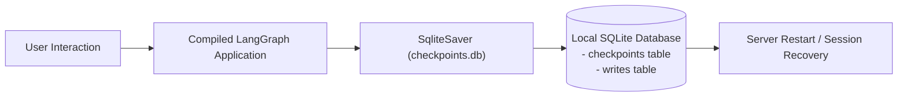

# 📹 LangGraph + SQLite ｜ Chatbot with Database Integration

<div className="video-card" style={{border: '1px solid #30363d', borderRadius: '8px', padding: '16px', marginBottom: '24px', background: 'rgba(56, 139, 253, 0.05)'}}>
  <div style={{display: 'flex', gap: '16px', flexWrap: 'wrap'}}>
    <div><strong>Instructor:</strong> Nitish Singh (CampusX)</div>
    <div><strong>Duration:</strong> 1728</div>
    <div><strong>Course:</strong> Module 4: Agentic AI & LangGraph</div>
    <div><strong>Watch Link:</strong> <a href="https://www.youtube.com/watch?v=c6a47iX5JkU" target="_blank" rel="noopener noreferrer">YouTube Lecture ↗</a></div>
  </div>
</div>

## 📌 Executive Summary

Integrating SQLite persistence into LangGraph provides durable, file-based session checkpoints without the operational burden of managing external database infrastructure. `SqliteSaver` writes conversation snapshots directly to disk, allowing applications to resume chat sessions seamlessly across server restarts.

This lesson explores `SqliteSaver` initialization, database schema inspection, context manager lifecycle, and building resilient local chat services.

---

## 🏗️ System Architecture & Execution Flow



---

## 📖 Core Concepts & Technical Deep Dive

### 1. Database Connection Management
`SqliteSaver.from_conn_string("checkpoints.db")` initializes the SQLite database, automatically applying necessary schema migrations to create tables for checkpoints and intermediate node writes.

### 2. Durable Resume Semantics
When a user returns to a conversation, passing their `thread_id` loads the latest checkpoint from SQLite, instantly reconstructing the entire conversation context without querying external APIs.

---

## 💻 Production Implementation

```python
import sqlite3
from langgraph.checkpoint.sqlite import SqliteSaver
from langgraph.graph import StateGraph, START, END
from typing import TypedDict

class ChatState(TypedDict):
    turn: int

builder = StateGraph(ChatState)
builder.add_node("step", lambda s: {"turn": s.get("turn", 0) + 1})
builder.add_edge(START, "step")
builder.add_edge("step", END)

# In production, use persistent file path e.g. "sqlite:///chat_history.db"
conn = sqlite3.connect(":memory:", check_same_thread=False)
checkpointer = SqliteSaver(conn)
app = builder.compile(checkpointer=checkpointer)

cfg = {"configurable": {"thread_id": "user-789"}}
app.invoke({"turn": 0}, config=cfg)
print(f"Resumed Turn from SQLite: {app.get_state(cfg).values['turn']}")
```

---

## ⚙️ Production Gotchas & Best Practices

:::tip Connection Thread Safety
When using SQLite in multi-threaded web frameworks like FastAPI, configure `check_same_thread=False` on the connection.
:::

:::warning Write Lock Contention
SQLite uses database-level write locks. For high-concurrency enterprise workloads (>100 concurrent writes/sec), migrate to `PostgresSaver`.
:::

---

## 📊 Architectural Reference & Comparison

| Parameter | Description | Recommended Value |
| :--- | :--- | :--- |
| `conn_string` | SQLite file location | `sqlite:///data/agents.db` |
| `check_same_thread` | Thread safety flag | `False` |
| `WAL Mode` | Write-Ahead Logging | Enable with `PRAGMA journal_mode=WAL;` |

---

## 📚 Key Takeaways & Enterprise Checklist

- [ ] **Architecture Verification:** Ensure your design addresses latency, decoupled interfaces, and strict data validation contracts.
- [ ] **Deterministic Testing:** Run unit tests and golden dataset evaluations before shipping changes to staging or production.
- [ ] **Security & Observability:** Enforce input/output guardrails, scrub sensitive credentials/PII, and capture distributed traces.
- [ ] **Scalability & Sizing:** Calibrate model parameters, context limits, and compute instance requirements against projected request concurrency.
