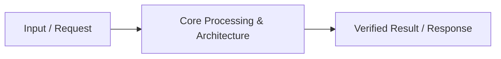

# 📹 LangSmith Crash Course ｜ LangSmith Tutorial for Beginners ｜ Observability in GenAI

<div className="video-card" style={{border: '1px solid #30363d', borderRadius: '8px', padding: '16px', marginBottom: '24px', background: 'rgba(56, 139, 253, 0.05)'}}>
  <div style={{display: 'flex', gap: '16px', flexWrap: 'wrap'}}>
    <div><strong>Instructor:</strong> Nitish Singh (CampusX)</div>
    <div><strong>Duration:</strong> 127m 40s</div>
    <div><strong>Playlist:</strong> Agentic AI with LangGraph (CampusX)</div>
    <div><strong>Watch Link:</strong> <a href="https://www.youtube.com/watch?v=4FFspU4riHk" target="_blank" rel="noopener noreferrer">YouTube Lecture ↗</a></div>
  </div>
</div>

## 📌 Executive Summary & Learning Objectives

This lecture covers **LangSmith Crash Course ｜ LangSmith Tutorial for Beginners ｜ Observability in GenAI**, focusing on production implementations, edge cases, and industry standards:
- Core intuition, architecture, and underlying mechanisms.
- Key differences between theoretical research implementations and scalable enterprise patterns.
- Concrete Python walkthroughs, error recovery, and performance optimization.

---

## 🏗️ Architecture & Conceptual Workflow



---

## 📖 Core Concepts & Technical Deep Dive

### 1. Architectural Foundations
In modern production AI engineering, **LangSmith Crash Course ｜ LangSmith Tutorial for Beginners ｜ Observability in GenAI** is essential for ensuring reliability, low latency, and deterministic outcomes. As AI systems evolve from naive prompt-in / completion-out scripts into distributed systems, engineers must handle:
- **State management & consistency:** Ensuring intermediate states and tool invocations are tracked.
- **Error boundaries & recovery:** Graceful degradation when external LLMs or vector stores encounter rate limits or network partitions.
- **Resource utilization & cost efficiency:** Caching common queries and reducing unnecessary foundation model token expenditure.

### 2. Operational Considerations
- **Latency Optimization:** Pre-computing embeddings, utilizing asynchronous non-blocking event loops, and streaming tokens via Server-Sent Events (SSE).
- **Security & Sandboxing:** Validating inputs before ingestion, sanitizing LLM outputs, and isolating tool execution environments.

---

## 💻 Production Implementation Walkthrough

```python
# Production Implementation Blueprint
def run_production_pipeline():
    print("Executing production pipeline...")

if __name__ == "__main__":
    run_production_pipeline()
```

---

## 💡 Production Best Practices & Tips

:::tip Production Deployment Guideline
When deploying LangSmith Crash Course ｜ LangSmith Tutorial for Beginners ｜ Observability in GenAI in enterprise environments, always configure automated retries with exponential backoff and telemetry tracing (such as OpenTelemetry or LangSmith).
:::

:::warning Common Failure Modes
Watch out for state contamination across concurrent requests. Ensure each session or user interaction uses an isolated thread ID or execution context.
:::

---

## 🎯 Key Takeaways & Quick Reference

| Dimension | Production Standard | Pitfall to Avoid |
| :--- | :--- | :--- |
| **Execution** | Async / Non-blocking with timeouts | Synchronous blocking calls in event loops |
| **Data Validation** | Strict Pydantic v2 schemas | Untyped dictionary access |
| **Monitoring** | Distributed tracing & latency percentiles | Relying only on standard console logs |

## ⏱️ Lecture Timeline & Key Topics

| Timestamp | Key Topic / Concept Discussed |
| :--- | :--- |
| **00:00:00** | हाय गाइस, माय नेम इज नितेश एंड यू वेलकम... |
| **00:32:09** | यह आपका यूजर इंटरफ़ेस है Langs का। इस... |
| **01:04:55** | एप्लीकेशन का। यह ट्रेस नहीं हो रहा है।... |
| **01:37:06** | दिन पहले हमारे लैंग ग्राफ प्लेलिस्ट में... |
| **02:07:38** | में। बाय।... |


---

---

## 📜 Complete Lecture Transcript (English)

> **Language:** English | **Source:** `16 - LangSmith Crash Course ｜ LangSmith Tutorial for Beginners ｜ Observability in GenAI ｜ CampusX.hi.srt` | **Total Segments:** 64 | **Word Count:** ~23,911 words

<details>
<summary><b>Click to expand full chronological transcript (64 timestamped intervals)</b></summary>

#### ⏱️ [00:00 ➔ 00:02]

हाय गाइस, माय नेम इज नितेश एंड यू वेलकम टू माय YouTube चैनल। इस वीडियो में हम लोग एक बहुत इंपॉर्टेंट जेएनएआई टॉपिक कवर करने वाले हैं और टॉपिक का नाम है लैंग स्मिथ। सो अभी तक हम बहुत स्ट्रक्चरर्ड तरीके से जेएनएआई का जो सिलेबस है जो करिकुलम है उसको कवर करते आ रहे हैं। हमने स्टार्टिंग किया लैंग चेन से। उसके बाद हमने लंग ग्राफ स्टार्ट किया जो कि अभी कंप्लीट नहीं हुआ है। वो प्रोग्रेस में है। बट लैंग ग्राफ पढ़ते-पढ़ते हम एक्चुअली एक ऐसे स्टेज पे आ गए हैं जहां पर हमें ऑब्जरवेबिलिटी कैसे इंप्लीमेंट की जाती है एलएलएम एप्लीकेशनेशंस में वो सीखना है। और दैट इज व्हाई आई थॉट कि एक छोटा सा डी टूर लेते हैं। और मैं आपको लैंगथ पढ़ाता हूं जो कि खुद में एक बहुत पावरफुल ऑब्जरवेबिलिटी एंड इवैल्यूएशन टूल है जिसको आप एलएलएम एप्लीकेशनेशंस में इंटीग्रेट कर सकते हो। सो आज का जो वीडियो है इसमें मैं आपको फर्स्ट ऑफ ऑल थोड़ा सा एक थ्योरिटिकल बैकग्राउंड दूंगा कि लंगसमिथ की जरूरत क्यों है? किसी भी एलएलएम सिस्टम को ऑब्ज़वेबिलिटी क्या होता है? और फिर मैं आपको काफी डिटेल में प्रैक्टिकली लैंगथ को इंटीग्रेट करके दिखाऊंगा विद लैंग चेन एंड लैंग्राफ बोथ। और लास्ट में मैं आपको थोड़ा सा एक आईडिया दूंगा अबाउट अ इमर्जिंग फील्ड कॉल्ड एलएलएम ओप्स व्हिच इज काइंड ऑफ रिलेटेड। तो ऑन द होल अगर आप ये वीडियो पूरा देखते हो तो आई एम प्रीटी श्योर आप कुछ नया और बहुत इंपॉर्टेंट सीख के जाओगे। ठीक है? देयर इज ओनली वन डिस्क्लेमर। अगर आप इस वीडियो को पूरी तरीके से फॉलो करना चाहते हो तो उसके दो प्रीरक्व्विजिट्स हैं। पहला आपको लैंग चेन का आईडिया होना चाहिए और दूसरा जितना भी लैंग ग्राफ मैंने आपको अभी तक पढ़ाया है उसका आपको आईडिया होना चाहिए। ये दोनों चीजें अगर आपको आती हैं तो आज का ये वीडियो कंज्यूम करने में समझने में आपको बहुत ज्यादा परेशानी नहीं होगी। बाकी आई एम सुपर एक्साइटेड फॉर दिस वीडियो। आई रियली होप आपको यह वीडियो पसंद आए। नाउ लेट्स स्टार्ट द वीडियो। अब लैंसिथ को डिटेल में पढ़ने के पहले एक बार मैं आपके साथ ये डिस्कस करना चाहता हूं कि लंगसमिथ जैसे टूल्स को यूज करने की जरूरत क्यों पड़ी। ठीक है? और ये चीज बताने के

#### ⏱️ [00:02 ➔ 00:04]

लिए मैं आपके साथ कुछ रियल वर्ल्ड सिनेरियोस डिस्कस करूंगा। ओके? लेट्स स्टार्ट विद सिनेरियो नंबर वन। सो सिनेरियो नंबर वन ये है कि आप एक स्टार्टअप में काम करते हो और आपकी टीम ने एक प्रॉब्लम आइडेंटिफाई की है स्टूडेंट्स के साथ। उन लोगों ने यह नोटिस किया कि स्टूडेंट्स जब कॉलेज से ग्रेजुएट होते हैं तो फिर वह जॉब खोजना स्टार्ट करते हैं। अब जॉब खोजने का जो प्रोसेस है वो कुछ इस तरीके का है कि स्टूडेंट्स ncry.com जैसी वेबसाइट पर जाते हैं। वहां पर दे फिल्टर जॉब्स फॉर देमसेल्व्स। उनको जो जॉब पसंद है उसको वह अलग करते हैं। उस जॉब का जेडी को वो लोग स्टडी करते हैं और उस जेडी के बेसिस पे दे मॉडिफाई देयर रेज्यूुे एंड कवर लेटर। और फिर एक बार इस मॉडिफाइड कवर लेटर के बन जाने के बाद दे अप्लाई। अब प्रॉब्लम यह है कि यह प्रोसेस स्टूडेंट्स को दिन में 10 बार करना पड़ता है या मे बी मोर देन दैट। बिकॉज़ आप एक बार nc.com पर जा रहे हो, जॉब हंटिंग कर रहे हो तो हो सकता है आपको दिन भर में 10 या उससे ज्यादा ऐसे जॉब्स दिखाई दे जहां पर आपको लगे कि हां मुझे अप्लाई करना चाहिए और आप सभी जगह पे सेम रेज्यूुे और सेम कवर लेटर के साथ अप्लाई नहीं करना चाहोगे। बिकॉज़ आप चाहोगे कि थोड़ा सा मैं एंप्लयर को ये फील कराऊं कि मैंने एफर्ट मारा है। राइट? तो ये जो पूरा प्रोसेस है सर्चिंग फॉर द जॉब, स्टडिंग द जेडी, अ मैचिंग द स्किल्स एंड मॉडिफाइंग योर कवर लेटर। ये आपको मल्टीपल टाइम्स करना है इन अ डे। तो यहां पर आपकी स्टार्टअप टीम ने एक प्रॉब्लम आइडेंटिफाई किया और आप लोगों ने ये सोचा कि हम एक एलएलएम बेस्ड एप्लीकेशन बना सकते हैं जो स्टूडेंट्स का यह प्रॉब्लम सॉल्व करेगी। ठीक है? और आप लोगों ने एक ऐसा एप्लीकेशन बना भी दिया। और इस एप्लीकेशन के काम करने का तरीका क्या है कि यहां पर स्टूडेंट क्या करता है इस वेबसाइट में जाकर के एक जेडी का लिंक डालता है या फिर एक पीडीएफ अपलोड करता है। ठीक है? जहां पे जॉब के बारे में डिस्क्रिप्शन दिया हुआ है। उसके

#### ⏱️ [00:04 ➔ 00:06]

बाद ये टूल क्या करता है कि उस जेडी को स्टडी करता है। ठीक है? उसको समझने की कोशिश करता है। उसके बाद ये टूल स्टूडेंट के अ Google ड्राइव अकाउंट में जाता है और वहां पे उसको जो भी पोर्टफोलियो, रे्यूे, प्रोजेक्ट्स जो भी डिटेल्स उसको मिलती है स्टूडेंट के बारे में उन सबको फैच करके लाता है। अब उसके पास जेडी भी है, स्टूडेंट का पूरा का पूरा प्रोफाइल भी है। तो वह उन दोनों में एक मैचिंग परफॉर्म करता है टू फाइंड आउट व्हाट आर द रेलेवेंट स्किल्स जिनकी हेल्प से स्टूडेंट अप्लाई कर सकता है इस पर्टिकुलर जॉब में। ठीक है? उसके बाद क्या करेगा वो? वो एक कवर लेटर प्रिपेयर करेगा स्पेसिफिक टू दिस जॉब। ठीक है? और नॉट ओनली दैट वो उस कवर लेटर को प्रूफ रीड भी करेगा कि उसमें कोई प्रॉब्लम तो नहीं है। टोनालिटी तो सही है। क्या इस पर्टिकुलर कवर लेटर को भेजने से कन्वर्शन होगा कि नहीं? यह सब एनालिसिस आपको करके फाइनली वो आपको एक कवर लेटर देता है और स्टूडेंट्स इसको दिन भर में कितनी बार भी यूज कर सकते हैं। 10 बार, 20 बार हर बार वो आपको एक गिवन जॉब के अकॉर्डिंग कवर लेटर मॉडिफाई करके देता है। ठीक है? तो ये टूल आपने रिलीज किया। स्टूडेंट्स ने इसको बहुत पसंद भी किया। डेली बेसिस पे आपके यूज़र्स इसको यूज़ भी कर रहे हैं। और नॉर्मली जो आपके सिस्टम का लेटेंसी है बेसिकली इनपुट डालने के बाद आउटपुट के निकलने तक का जो टाइम है वो 2 मिनट्स के आसपास रहता है जनरली। बट अचानक से आपने ऑब्जर्व किया कि एक पर्टिकुलर डे आपको बहुत सारे मेल्स आने लग गए हैं कि आपकी जो वेबसाइट है वो बहुत स्लो हो गई है। स्लो हो गई है। मतलब जो काम पहले 2 मिनट्स में हो जाता था। अब वो करने में 7 से 10 मिनट्स लग रहे हैं। और इसकी वजह से आपके जो यूज़र्स हैं वो फ्रस्ट्रेट हो रहे हैं। इंपेशेंट हो रहे हैं और आपका प्लेटफार्म छोड़ के जा रहे हैं। और ऑब्वियसली ये अच्छी बात नहीं है आपके स्टार्टअप के लिए बिकॉज़ यहां पे फिर रेवेन्यू लॉस होने लगेगा। ठीक है? तो आपको अब क्या करना है? आपको क्विकली इस सिस्टम को डीबग करना है कि प्रॉब्लम आई कहां पे? बट प्रॉब्लम क्या

#### ⏱️ [00:06 ➔ 00:08]

है इस पूरे सिस्टम में? दैट इट इज़ अ कॉम्प्लेक्स एलएलएम वर्क फ्लो व्हिच बेसिकली मीन्स कि यहां पे मल्टीपल स्टेजेस हैं। अलग-अलग स्टेज में अलग-अलग काम हो रहा है और बहुत जगहों पे आप एलएलएम के साथ इंटरेक्ट कर रहे हो। ठीक है? जैसे कि ये जेडी को स्टडी करने में आपको एलएलएम चाहिए। ये मैचिंग परफॉर्म करने में आपको एलएलएम चाहिए। ये कवर लेटर जनरेट करने में आपको एलएलएम चाहिए। और फाइनल प्रूफ रीडिंग करने में भी आपको एलएलएम चाहिए। ठीक है? तो इस तरह का कॉम्प्लेक्स एलएलएम वर्क फ्लो को डीबक करना आसान नहीं है। बिकॉज़ आपके पास सिर्फ ये इंफॉर्मेशन है कि यूजर ने इनपुट में क्या दिया और उसको आउटपुट में क्या मिला और इस पूरे प्रोसेस में टाइम कितना लगा। बट आपके पास ये इंडिविजुअल ब्रेकडाउन नहीं है। फॉर एग्जांपल आपके पास ये इनेशन नहीं है कि जेडी को रीड करने में और समझने में कितना टाइम लगा? अ यूजर के पोर्टफोलियो से डॉक्यूमेंट्स लाने में कितना टाइम लगा? मैचिंग में कितना टाइम लगा? सो यू गेट माय आईडिया। देयर आर मल्टीपल स्टेजेस। बहुत कॉम्प्लेक्स तरीके से ये वर्क फ्ल्लो बना हुआ है। हो सकता है इसमें ब्रांचेस वगैरह भी हो। तो आपके पास सिर्फ इनिशियल इनपुट और फाइनल आउटकम है। और टोटल टाइम कितना लग रहा है ये इनेशन है। बट आपको ये नहीं पता कि ये जो लेटेंसी बढ़ी है 2 मिनट से 10 मिनट की हो गई है। ये बाकी का 8 मिनट इनमें से कौन सा कंपोनेंट खा रहा है। अब अनफॉर्चूनेटली सिंस आपके पास ये पर्टिकुलर टूल नहीं है या पर्टिकुलर ऑप्शन नहीं है। ब्रेक डाउन करके चीजों को समझने का। आपका डिबगिंग का जो प्रोसेस है वो बहुत डिफिकल्ट हो जाएगा। ठीक है? ऐसा हो सकता है मान लो कि पिछले अपडेट में आपने गलती से एक ऐसा कोड पुश कर दिया था जिसकी वजह से अब Google ड्राइव में आप एक स्पेसिफिक फोल्डर को जाके स्कैन करने के बदले पूरा Google ड्राइव स्कैन कर रहे हो। जिसकी वजह से बहुत ज्यादा टाइम लग रहा है। तो हो सकता है कल्पेट हो यह वाला स्टेज जहां पर हम डॉक्यूमेंट्स फच करके ला रहे हैं। बट अगेन सिंस हम इस सिस्टम के अंदर घुस के स्टेप बाय स्टेप प्रोसेस में समझ नहीं सकते हैं कि क्या चल रहा है। दैट इज व्हाई वी कैन नॉट आइडेंटिफाई कि ये जो 8 मिनट का

#### ⏱️ [00:08 ➔ 00:10]

एक्स्ट्रा डिले आ रहा है वो ये पोर्टफोलियो स्कैन करने वाले प्रोसेस में लग रहा है। तो आई रियली होप फर्स्ट ऑफ ऑल आप समझ पा रहे हो इस पूरे प्रोसेस में प्रॉब्लम क्या है? द प्रॉब्लम इज इनक्रीज्ड लेटेंसी बट यू आर नॉट एबल टू आइडेंटिफाई द कल्पेट किसकी वजह से यह प्रॉब्लम खड़ी हुई। अब दिस इज वेयर टूल्स लाइक लैंगथ कम्स इनू द पिक्चर। ठीक है? कैसे? मैं आपको थोड़ी देर में बताता हूं। बट इसके पहले मैं आपके साथ और एक यूज़केस एक एग्जांपल शेयर करना चाहूंगा। अब जो सेकंड एग्जांपल है वह एग्जांपल है एक रिसर्च असिस्टेंट का वि इज बेसिकली एन एजेंट जो आपने और आपकी टीम ने बनाया है और इस पर्टिकुलर असिस्टेंट का काम क्या है कि ये रिस्चरर्स को हेल्प करता है। कैसे मैं आपको बताता हूं। सो इस टूल में आकर के कोई भी रिसर्चर एक टॉपिक डालेगा। फॉर एग्जांपल आपने डाला अ सोलर एनर्जी। तो ये टूल क्या करेगा? सबसे पहले उस टॉपिक से रिलेटेड जितने भी एकेडमिक रिसर्च पेपर्स हैं उनको फैच करके लाएगा फ्रॉम वेबसाइट्स लाइक Google scalar या फिर arcive.com इस तरह की वेबसाइट से वो उस टॉपिक से रिलेटेड पेपर्स को फैच करके लाएगा। फिर क्या करेगा? वो हर पेपर को स्टडी करेगा और जो की पॉइंट्स हैं उनको एक्सट्रैक्ट करेगा। ठीक है? एक बार जब ये पूरा पढ़ने का काम हो जाता है और की पॉइंट्स एक्सट्रैक्ट करने का काम हो जाता है उसके बाद आपका रिसर्च असिस्टेंट क्या करेगा उन सारे की पॉइंटर्स को समराइज करेगा और उसको एक रिपोर्ट का फॉर्म देगा और वो रिपोर्ट आपको मिल जाएगी एज अ यूजर अब आप क्या कर सकते हो उस रिपोर्ट के बारे में चैटिंग कर सकते हो यू कैन आस्क क्वेश्चंस अबाउट दैट रिपोर्ट तो ये रिसर्च असिस्टेंट टूल आपने बनाया है ऐसा ही एक टूल चैट जीपीडी भी आपको देता है आई आई गेस आपने यूज़ भी किया होगा। तो मान लो यह पर्टिकुलर टूल हमने बनाया और यह टूल बहुत एप्रिशिएट भी किया जा रहा है। हमारे यूज़र्स इसको यूज़ भी कर रहे हैं ऑन अ डेली बेसिस। दे आर आल्सो पेइंग अस सम मनी। तो हमारा जो बिजनेस है

#### ⏱️ [00:10 ➔ 00:12]

सही से चल रहा है। अब ऐसा मान लेते हैं फिलहाल फॉर द सेक ऑफ डिस्कशन कि एक रिपोर्ट जनरेट करने में आपको अराउंड 50 पैसे का कॉस्ट लगता है। ठीक है? बिकॉज़ ऑब्वियसली आप एलएलएम्स को यूज़ कर रहे हो तो बहुत सारे टोकंस जनरेट हो रहे हैं और आप ओपन एi के एपीआई यूज़ कर रहे हो तो दे आर चार्जिंग यू सम मनी। ठीक है? तो मान लो आपको पर रिपोर्ट जनरेट करने में 50 पैसे लगते हैं और आप अपने यूजर से भी कुछ पैसा चार्ज करते हो। ऑब्वियसली आपने अपना प्रॉफिटेबिलिटी समझ लिया है। उसी हिसाब से आप पैसे चार्ज कर रहे हो। बट अचानक से एक दिन क्या हुआ कि आपने यह ऑब्जर्व किया कि आपका जो कॉस्ट दिखाता है ओपन एi डैशबोर्ड में वो कॉस्ट अचानक से इनक्रीस होने लग गया है। तो आपने जब थोड़ा ब्रेकडाउन समझा तो आपने यह पाया कि अचानक से कुछ रिपोर्ट्स को जनरेट करने में 50 पैसे के बदले ₹2 लग रहे हैं और बाकी के रिपोर्ट्स अभी भी 50 पैसे में बन जा रहे हैं। तो बिकॉज़ ऑफ दिस ₹2 वाले रिपोर्ट देयर इज अ स्पाइक इन कॉस्ट और एट स्केल यह बहुत बड़ा कॉस्ट हो सकता है। अगर आपके बहुत सारे यूज़र्स हैं और अचानक से 50 पैसे के बदले आपको ₹2 खर्चने पड़ जाए तो यू कैन इमेजिन आपका एक दिन में कॉस्ट कितना ज्यादा भाग जाएगा और एक महीने में तो फिर आप सोच ही नहीं सकते। और सिंस आपके यूज़र्स तो उतने ही हैं उनसे आप पैसे तो उतने ही ले रहे हो तो आपका कॉस्ट सडनली से बहुत ज्यादा हो जाएगा और आप लॉस में चले जाओगे। व्हिच इज नॉट गुड। तो ऑब्वियसली आपको क्या करना है? अब जल्दी से आना है और इस एजेंट को डीबग करना है कि भाई ऐसा क्या हो गया अचानक से कि कुछ रिपोर्ट्स पहले जैसे 50 पैसे में बन रहे हैं बट कुछ रिपोर्ट्स ₹2 ले रहे हैं। अब यह डिबगिंग करने के लिए आपको पहले यह समझ होनी चाहिए कि एजेंट्स काम कैसे करते हैं। एजेंट्स आर सॉफ्टवेयर एप्लीकेशनेशंस हु आर ऑटोनॉमस। ठीक है? मतलब आप उसको एक गोल देते हो और उसके बाद वो पूरा का पूरा सिस्टम उस गोल को पर्स्यू करने के लिए खुद ब खुद रीजनिंग लगाता है। कुछ एक्शन परफॉर्म करता है। फिर सोचता है

#### ⏱️ [00:12 ➔ 00:14]

कि क्या मैंने गोल अचीव किया या नहीं और ये काम वो लूप में करता चला जाता है। ठीक है? अब ऐसा हो सकता है हाइपोथेटिकली स्पीकिंग कि आपने अपने पिछले अपग्रेड में एक ऐसा कोड पुश किया जहां पे आपने अपने प्र्प्ट में एक माइनर सा चेंज किया और आपने प्र्ट में यह लिख दिया कि तब तक रिपोर्ट बनाते रहो जब तक एकदम बढ़िया रिपोर्ट ना बन जाए। वि बेसिकली मींस कि अगर एजेंट को रिपोर्ट की क्वालिटी अच्छी नहीं लगी तो यह पूरा प्रोसेस वो रिपीट करेगा। वो फिर से जाएगा Google स्कॉलर की वेबसाइट पे। फिर से वो पेपर्स को डाउनलोड करके लाएगा। फिर से स्टडी करेगा। फिर से की पॉइंटर्स एक्सट्रैक्ट करेगा। फिर से उसको समराइज करके रिपोर्ट बनाएगा। फिर से एनालाइज करेगा कि क्या क्वालिटी ऑफ रिपोर्ट अच्छा है या मुझे फिर से दोबारा ये पूरा चीज रिपीट करना चाहिए। अब इस पर्टिकुलर अपग्रेड के होने से क्या हो रहा है? इस पर्टिकुलर वर्जन को पुश करने से क्या हो रहा है कि कुछ रिपोर्ट्स में तो आपका एजेंट खुश हो जा रहा है कि हां मैंने जो रिपोर्ट बनाया सही है और उसको वो यूजर को दिखा दे रहा है तो आपका काम 50 पैसे में हो जा रहा है। बट फॉर सर्टेन टॉपिक्स आपके एजेंट को लग रहा है कि यार मे बी मैंने उतना अच्छा काम नहीं किया। फिर से करता हूं। तो वो फिर से जाकर के पूरा प्रोसेस रिपीट कर रहा है। बेसिकली वो आमिर खान बन गया कि उसको परफेक्शन चाहिए। और ये सब हुआ क्यों? बिकॉज़ आपने लास्ट अपग्रेड में एक प्र्प्ट में चेंज किया था। माइनर चेंज एक दो सेंटेंस का चेंज किया था कि तब तक करते रहना जब तक आपको बेस्ट रिजल्ट ना मिल जाए। और ये प्र्प प्र्ट आपने ऐसा इसलिए लिखा बिकॉज़ आप यूजर का एक्सपीरियंस इंप्रूव करना चाहते थे। राइट? आप चाहते थे कि यूजर को जो फाइनल रिपोर्ट मिले वो उसको पसंद आए। बट इस सिंगल प्र्प चेन से क्या हो रहा है? आपके एजेंट का बिहेवियर बदल गया और वो भी हमेशा नहीं। कुछ पर्टिकुलर सिनेरियोस में बिल्कुल वैसे ही काम कर रहा है जैसे पहले काम कर रहा था। बट फिर कुछ सिनेरियोस में उसका बिहेवियर बदल जा रहा है जिसकी वजह से कॉस्ट भाग गया। अब आप सोच के देखो एज अ डेवलपर जिसने इस एजेंट को बनाया है उसके लिए ये डिबगिंग कितना

#### ⏱️ [00:14 ➔ 00:16]

डिफिकल्ट है। फर्स्ट ऑफ़ ऑल हर बार सेम एरर नहीं आ रहा। कभी आ रहा है कभी नहीं आ रहा है। कहीं पे एरर्स प्रिंट हो के दिखाई नहीं दे रहे। बिकॉज़ ऑब्वियसली ऐसा नहीं है कि कोड फट गया है। तो प्रोसेस में कहीं पे एरर ट्रेस भी नहीं दिखाई दे रहा। और देयर आर मल्टीपल स्टेजेस इन दिस वर्क फ्लो। तो आपको ये भी नहीं पता कि किस पर्टिकुलर स्टेज में जाकर के ज्यादा पैसा खर्चा हो रहा है। तो अगेन अ सिमिलर काइंड ऑफ़ सिचुएशन वेयर यू हैव बिल्ट अ प्रॉपर सिस्टम जो आपके यूज़र्स को पसंद आ रहा है। बट अगर उसमें कोई भी प्रॉब्लम आई इन दिस केस कॉस्ट की प्रॉब्लम आई। ज्यादा टोकन यूसेज की प्रॉब्लम आई। यू आर नॉट एबल टू सी इनसाइड द सिस्टम कि इनमें से कौन सा पर्टिकुलर कंपोनेंट गड़बड़ कर रहा है। तो अगेन हमें एक ऐसे टूल की रिक्वायरमेंट है जो हमें इस पूरे सिस्टम का एक इनसाइड व्यू दे। इस पूरे ब्लैक बॉक्स सिस्टम को वाइट बॉक्स में कन्वर्ट करे और हम देख पाए कि स्टेप बाय स्टेप हर कंपोनेंट में चल क्या रहा है। ठीक है? तो अगेन आई होप पिछला एग्जांपल मैंने आपको लेटेंसी से रिलेटेड दिया था। ये एग्जांपल मैंने आपको कॉस्ट से रिलेटेड दिया। आई थिंक यू आर एबल टू अंडरस्टैंड कि प्रॉब्लम कहां पर है। तो अभी तक हमने दो यूज केसेस की बात की। पहला यूज केस था एक एलएलएम वर्क फ्लो और दूसरा यूज़ केस था एक एजेंट। अब बात करते हैं एक थर्ड यूज़ केस की जो होगा रैक। ठीक है? तो एक सिनेरियो कंसीडर करते हैं। मान लो आप TCS में एज अ सीनियर सॉफ्टवेयर डेवलपर काम कर रहे हो और आपने TCS के अंदर एक प्रॉब्लम आइडेंटिफाई की है। प्रॉब्लम यह है कि TCS एक बहुत बड़ा ऑर्गेनाइजेशन है जिसमें लाखों लोग काम करते हैं और हर साल हजारों लोग एज फ्रेशर्स जॉइ करते हैं इस कंपनी को। अब सिंस यह बहुत बड़ा और बहुत पुराना ऑर्गेनाइजेशन है तो इस ऑर्गेनाइजेशन में बहुत सारे रूल्स हैं। फॉर एग्जांपल रूल्स अराउंड लीफ पॉलिसी फॉर एग्जांपल रूल्स अराउंड नोटिस पीरियड। ठीक है? अ हेल्थ इंश्योरेंस। बहुत तरह की चीजें हैं। ठीक है? अब जो फ्रेशर्स ज्वाइन करते हैं इनको इन चीजों के बारे में समझ

#### ⏱️ [00:16 ➔ 00:18]

नहीं होती है। तो व्हाट दे डू इज कि उनको जभी भी डाउट आता है तो वो एचआर के पास जाते हैं और एचआर से ये क्वेश्चन करते हैं। अब एचआर लोग कंप्लेन करते हैं कि हमें ये सेम क्वेश्चंस ऑन अ डेली बेसिस आंसर करने पड़ते हैं। इससे हमारा प्रोडक्टिविटी कम हो रहा है। तो आपने एज अ सीनियर सॉफ्टवेयर डेवलपर सोचा कि वी कैन सॉल्व दिस प्रॉब्लम बाय मेकिंग अ चैट बॉट। व्हाट वी कैन डू इज कि कंपनी के जितने भी डॉक्यूमेंट्स हैं जहां पर यह सारा इंफॉर्मेशन है उसको हम एक्यूमुलेट करके एक नॉलेज बेस बना सकते हैं और वो नॉलेज बेस हम एक एलएलएम को प्रोवाइड कर सकते हैं और एक चैटबॉट बन जाएगा और फिर कोई भी फ्रेशर आकर के इस चैटबॉट से बात करेगा उसको उसका आंसर मिल जाएगा। बेसिकली यू आर प्लानिंग टू मेक अ रैग बेस्ड चैटबॉट। यह पूरा सिस्टम काम कैसे करेगा? यूजर आएगा अपना क्वेश्चन पूछेगा कि लीव पॉलिसी क्या है? आपका चैटबॉट क्वेश्चन के हिसाब से नॉलेज बेस में घुसेगा। रेलेवेंट डॉक्यूमेंट्स फैच करके लाएगा। वो रेलेवेंट डॉक्यूमेंट्स और क्वेश्चन दोनों को उठा के एलएलएम को दे देगा। एलएलएम क्वेश्चन देखेगा। जो डॉक्यूमेंट्स फैच हो के आए हैं उनको देखेगा और उन दोनों के बेसिस पे वो एक नेचुरल लैंग्वेज इंग्लिश में रिस्पांस जनरेट करके देगा और आपने ये सिस्टम बना दिया। ठीक है? एंड अगेन दिस सिस्टम इज वर्किंग परफेक्टली। आपके फ्रेशर्स आए वो इससे आकर क्वेश्चन पूछने लग गए। लीफ पॉलिसी क्या है? हेल्थ इंश्योरेंस का क्या सीन है? नोटिस पीरियड का क्या सीन है? और उनको आंसर्स मिलने लग गए। और आपके एचआर के ऊपर से काइंड ऑफ ये जो एक्स्ट्रा प्रेशर था वो हट गया। बट अगेन जस्ट लाइक एनी अदर एलएम बेस्ड सिस्टम यहां पे भी अचानक से कुछ गड़बड़ होना शुरू हो गया। गड़बड़ यह होने लगा कि आपके टीममेट्स ने ये कंप्लेन किया कि आपका चैट बॉट हैज़ स्टार्टेड हेलुसिनेटिंग। बेसिकली वो आंसर्स इमेजिन करके दे रहा है। फक्चुअल आंसर्स नहीं दे रहा है। जिसकी वजह से कंपनी में मिसइफेशन फैल रहा है। फॉर एग्जांपल एक एंप्लई गया और उसने पूछा कि लीफ पॉलिसी क्या है? और आपके चैटबॉट ने बोल दिया कि यार कोई लोड

#### ⏱️ [00:18 ➔ 00:20]

नहीं है। जब मर्जी छुट्टी ले सकते हो। गोवा जाना है तो जाओ। अब वो बंदा बैक पैक करके चला गया। इसमें गलती किसकी है? आपके चैटबॉट की। राइट? उसको यह इंफॉर्मेशन कंपनी के चैट बॉट ने दिया है। राइट? तो यू कैन अंडरस्टैंड कि कितने सीरियस कंसर्न्स हो सकते हैं। नोटिस पीरियड से रिलेटेड कंसर्न्स हो सकते हैं। सैलरी से रिलेटेड कंसर्न्स हो सकते हैं और कंपनी में मिस इनफेशन फैल सकता है। तो बहुत ही सीरियस प्रॉब्लम हो गई। अब आपको यह बोला गया कि सिंस आपने ये चार्ट वर्ड बनाया है, यू हैव टू डीबग इट फास्ट ताकि यह इंफॉर्मेशन मिसइफेशन कंपनी में ना फैले। अब अगेन आई वुड लाइक टू एफसाइज ऑन दिस पॉइंट कि एक रैक बेस्ड सिस्टम को डीबग करना कितना डिफिकल्ट है। स्पेशली अगर वो हेलुसिनेट कर रहा है। व्हाई? बिकॉज़ कोई भी रैक बेस सिस्टम मोस्टली दो रीज़ंस की वजह से हेलुसनेट करता है। रीज़न नंबर वन आपका रिट्रीवर जो है जो क्वेश्चन देख के रेलेवेंट डॉक्यूमेंट्स फैच करके लाता है। वो कंपोनेंट सही से काम ना करें। मतलब उसने क्वेश्चन पढ़ा और वो उस क्वेश्चन के हिसाब से डॉक्यूमेंट फैच करके ला ही नहीं पाया। क्वेश्चन था नोटिस पीरियड के बारे में वो डॉक्यूमेंट्स लेके आ रहा है अबाउट कंपनी हिस्ट्री रेलेवेंसी ही नहीं है तो एलएलएम कहां से आंसर करेगा और सेकंड फेलियर पॉइंट होता है जनरेटर के आसपास एज इन आपका एलएलएम जो आंसर करता है तो हो सकता है आपने लो क्वालिटी का एक लोकल एलएलएम यूज़ किया हो या फिर ओपन एआई ने कोई अपग्रेड किया हो जिसकी वजह से क्वालिटी ऑफ़ आंसरिंग खराब हो गई है या फिर आपने प्र्ट ऐसा लिखा जिसकी वजह से आपका एलएलएम अच्छा आंसर नहीं दे रहा है। ठीक है? तो इट कुड बी एनीथिंग। तो ऐसा हो सकता है कि लास्ट जब आपने अपने चैटबॉट को अपग्रेड किया था तो वहां पे आपने गलती से रिट्रीवर वाले कंपोनेंट में नंबर ऑफ रिट्रीव डॉक्यूमेंट्स जो आपको मंगाने थे वो n की वैल्यू आपने वन सेट कर दी। वन इज टू लेस। कुछ क्वेरीज के लिए हो सकता है एक सिंगल डॉक्यूमेंट से आप इनफ कॉन्टेक्स्ट पुल कर लो। बट ऐसा हो सकता है कि बहुत सारे क्वेश्चंस ऐसे हो जहां पे आपको एक से ज्यादा डॉक्यूमेंट्स की रिक्वायरमेंट हो।

#### ⏱️ [00:20 ➔ 00:22]

तो ये n = 1 इज टू लेस। तो आपको मे बी थ्री रखना चाहिए या फाइव रखना चाहिए। राइट? तो दिस कुड बी वन प्रॉब्लम जो रिट्रीवर से अटैच्ड है। सेकंड प्रॉब्लम ऐसा हो सकता है कि पिछले अपग्रेड में आपके टीममेट ने एक ऐसा प्र्प्ट लिख दिया जो थोड़ा सा लीनिएंट है। लीनिएंट है इन द सेंस वो बहुत स्ट्रांगली एनफोर्स नहीं कर रहा आपके एलएलएम को कॉन्टेक्स्ट से आंसर देने के लिए। वो बेसिकली आपको प्र्ट कैसा लिखना होता है? आप रैक बेस्ड कंपोनेंट में या एलएलएम एप्लीकेशन में कॉन्टेक्स्ट कुछ प्र्प कुछ ऐसा लिखते हो कि आप एलएलएम को बोलते हो कि आपको आंसर जो करना है वो गिवन कॉन्टेक्स्ट से ही करना है। अगर गिवन कॉन्टेक्स्ट से आपको इनफ इनफेशन नहीं मिल रहा आंसर करने के लिए तो सिंपली बोल दो आई डोंट नो। बट हो सकता है आपने जो प्र्प्ट लिखा उसमें आपने इतना स्ट्रांगली एफसाइज नहीं किया और जब भी एलएलएम को रेलेवेंट कंटेंट नहीं दिखाई दे रहा कॉन्टेक्स्ट के अंदर तो वो अपनी मर्जी से कुछ आंसर दे दे रहा है। नाउ प्रॉब्लम दो जगहों से आ सकती है बट आपकी प्रॉब्लम ये है कि आपको नहीं पता कि रिट्रीवर से प्रॉब्लम हो रहा है या जनरेटर से प्रॉब्लम हो रहा है। बिकॉज़ आप इस सिस्टम के अंदर घुस के नहीं देख सकते। आपको नहीं पता कि रिट्रीवर कौन से डॉक्यूमेंट्स फैच करके लाया। आपको नहीं पता कि एग्जजेक्टली फाइनल जो प्र्प फॉर्म हुआ वि द क्वेश्चन एंड द कॉन्टेक्स्ट वो कैसा दिख रहा है। एंड इन प्रॉब्लम्स की वजह से इस सिस्टम को डीपक कर पाना फॉर हेलसिनेशन इज वेरी वेरीरी डिफिकल्ट। एंड अगेन एक ऐसे सिस्टम एक ऐसे टूल की रिक्वायरमेंट हमें दिखाई दे रही है जो स्टेप बाय स्टेप हर कंपोनेंट क्या देख रहा है, क्या कर रहा है यह हमें बता पाए तो बहुत अच्छा रहता। ठीक है? तो नाउ आई थिंक यू आर एबल टू अंडरस्टैंड विद द हेल्प ऑफ दी थ्री सिनेरियोस। पहला सिनेरियो जहां पर हमने देखा कि लेटेंसी आ गई और हम डीबग नहीं कर पा रहे। सेकंड हमने देखा कि कॉस्ट बढ़ गया हमें समझ नहीं आ रहा। थर्ड हमने देखा सिस्टम हेलुसिनेट कर रहा है। क्यों कर रहा है हमें नहीं पता। इन सारी चीजों को देखने के बाद आई गेस आपको समझ में आ रहा है कि क्यों आपको एक टूल की जरूरत है जो आपको सिस्टम के अंदर क्या चल रहा है वो

#### ⏱️ [00:22 ➔ 00:24]

बताएं। तो अब लेट्स फॉर्मली इंट्रोड्यूस लंगसमिथ होता क्या है? बट लैंगिथ को इंट्रोड्यूस करने के पहले मैं एक और की टर्म आपके सामने लाना चाहूंगा जो आप आगे बहुत ज्यादा सुनोगे और उस टर्म का नाम है ऑब्जरवेबिलिटी। सो गाइस यहां पे मैंने एक डेफिनेशन ऐड कर रखा है ऑब्जरवेबिलिटी का। एक बार इसको पढ़ते हैं। सो ऑब्ज़वेबिलिटी इज द एबिलिटी टू अंडरस्टैंड अ सिस्टम्स इंटरनल स्टेट बाय एग्जामिनिंग इट्स एक्सटर्नल आउटपुट्स लाइक लॉग्स, मैट्रिक्स एंड ट्रेसेस। इट अलाउस यू टू डायग्नोस इशूज़, अंडरस्टैंड परफॉर्मेंस एंड इंप्रूव रिलायबिलिटी बाय एनालाइजिंग डेटा जनरेटेड बाय द सिस्टम। एसेंशियली इट्स अबाउट बीइंग एबल टू आंसर व्हाई समथिंग इज़ हैप्पेनिंग विद इन अ सिस्टम। इवन इफ यू डिडंट एंटीिसिपेट द प्रॉब्लम। ठीक है? नटशेल में अभी तक हमने जो तीन एग्जांपल्स देखे उन तीनों एग्जांपल्स में कॉमन क्या था? कॉमन ये था कि ये तीनों सिस्टम्स एलएलएम बेस्ड सिस्टम्स हैं। राइट? और एलएलएम बेस्ड सिस्टम्स में जो सबसे कॉम्प्लेक्स बात होती है, सबसे मुश्किल बात होती है वो ये होती है कि एलएलएम्स का जो बिहेवियर है वो नॉन डिटरर्मिनिस्टिक होता है। नॉन डिटरर्मिनिस्टिक का मतलब क्या हुआ? जनरली कोई भी सॉफ्टवेयर आप उठा लो उसको अगर आप सेम इनपुट हमेशा दोगे तो आपको हमेशा सेम आउटपुट दिखाई देगा। कैलकुलेटर है उसमें आप 2 * बाय 4 करो और ऐसा आप 1000 बार करो आपको हर बार आउटपुट एट ही दिखाई देगा। बट एलएलएम बेस्ड सिस्टम्स में क्या होता है कि फॉर द सेम इनपुट और सेम काइंड ऑफ इनपुट यू कैन गेट डिफरेंट आउटपुट। और इस पर्टिकुलर रीजन की वजह से एलएलएम बेस सिस्टम्स में अगर कोई प्रॉब्लम आती है लेटेंसी की प्रॉब्लम, कॉस्ट की प्रॉब्लम या फिर हेलुसिनेशन की प्रॉब्लम तो उसको डीबक करना मुश्किल हो जाता है। बिकॉज़ ये प्रॉब्लम कोई प्रॉपर एरर ट्रेस नहीं छोड़ती आपके लिए। और ऑब्वियसली ये सिस्टम्स कॉम्प्लेक्स हैं। ब्लैक बॉक्स सिस्टम्स हैं। एक्सप्लेनेबिलिटी नहीं है। तो इन रीजंस की वजह से प्रोडक्शन में जब आप एलएलएम बेस्ड एप्लीकेशनेशंस को डिप्लॉय

#### ⏱️ [00:24 ➔ 00:26]

करते हो तो उनको डीबग कर पाना बहुत मुश्किल हो जाता है। और फिर यहां पे आपको हेल्प करता है ऑब्जरवेबिलिटी का कांसेप्ट। ऑब्जरवेबिलिटी का बेसिक फंडा यह है कि आप किसी टूल की हेल्प से अपने सिस्टम का जो इंटरनल वर्किंग है उसको पूरा खोल करके देख सकते हो कि कंपोनेंट बाय कंपोनेंट हो क्या रहा है? हर कंपोनेंट अपना काम कैसे कर रहा है। ठीक है? यही होता है बेसिक फंडा ऑब्जरवेबिलिटी का। सो व्हाट यू डू इज जब आप अपने सॉफ्टवेयर को एक बार चलाते हो एज एन एग्जीक्यूट करते हो तो आप उसको एंड टू एंड ट्रेस करते हो। ठीक है? और यह ट्रेस कहीं पर स्टोर हो जाता है जिसको आप फ्यूचर में आकर कभी भी देख सकते हो और समझ सकते हो कि कहां पर गड़बड़ हो रही है। तो अगर अब मैं आपको फॉर्म फॉर्मूली बताऊं कि लैंगसिथ क्या है? तो यहां पे देखो मैंने लिखा है लंगसमिथ इज अ यूनिफाइड ऑब्जर्वेबिलिटी एंड इवैल्यूएशन प्लेटफार्म वेयर टीम्स कैन डीबग टेस्ट एंड मॉनिटर एआई ऐप परफॉर्मेंस। ठीक है? तो नटशेल में लंगसmथ इज बेसिकली अ टूल जिसकी हेल्प से आप अपने एलएलएम बेस्ड एप्लीकेशनेशंस या सिस्टम के अंदर ऑब्जरवेबिलिटी का कांसेप्ट ला सकते हो। आप अपने एलएलएम एप्लीकेशन को चलाओगे, एग्जीक्यूट करोगे और लैंगsथ की हेल्प से उस पूरे एग्जीक्यूशन को आप ट्रेस कर सकते हो। कंपोनेंट बाय कंपोनेंट। आपको लैंगसिथ के अंदर यह प्रॉपर्ली दिखाई देगा कि आपका हर कंपोनेंट क्या इनपुट ले रहा है, क्या आउटपुट दे रहा है। उस पर्टिकुलर कंपोनेंट को अपना काम करने में कितना टाइम लगा। एवरीथिंग विल बी रिकॉर्डेड एट अ वेरी ग्रनुलर लेवल। ठीक है? दिस इज़ व्हाट लमिथ इज़। तो अब हम क्या करेंगे? नाउ दैट वी हैव अंडरस्टुड कि प्रॉब्लम क्या है? और लंगसमिथ एक्सजेक्टली कैसे उस प्रॉब्लम को सॉल्व करता है। अब हम प्रैक्टिकली ग्राउंड पे जाके एग्जांपल्स लेंगे। प्रैक्टिकल एग्जांपल्स, कोड्स और उसमें हम लैंग स्मिथ को इंट्रोड्यूस करेंगे, इंप्लीमेंट करेंगे, इंटीग्रेट करेंगे। ठीक है? तो मेरा प्लान ये है कि पहले मैं आपको लैंग

#### ⏱️ [00:26 ➔ 00:28]

चेन के साथ इंटीग्रेशन दिखाऊं लैंग स्मिथ का। फिर मैं आपको लैंग ग्राफ के साथ भी इंटीग्रेशन दिखाऊं लैंग्मिथ का। और इस पूरे प्रोसेस में हम नॉर्मल वर्क फ्लोस को भी टेस्ट करेंगे। रैग बेस्ड वर्क फ्लोस को भी टेस्ट करेंगे। एजेंटिक वर्क फ्लोस को भी टेस्ट करेंगे। सो आपको एक एंड टू एंड आईडिया हो जाएगा कि कैसे लैंग स्मिथ की हेल्प से आप ऑब्जरवेबिलिटी को इंप्लीमेंट कर सकते हो इन एनी काइंड ऑफ एलएलएम वर्क फ्लो। ठीक है? तो आई रियली होप अभी तक का डिस्कशन आपके लिए मीनिंगफुल था और आगे की चीजों के लिए आप एक्साइटेड हो। प्रैक्टिकल स्टार्ट करने के पहले एक और छोटी सी चीज मैं आपको बताना भूल गया। वो मैं जल्दी से कवर कर देता हूं कि जब आप ऑब्जरवेबिलिटी को इंप्लीमेंट करते हो विथ द हेल्प ऑफ लैंगिथ। और आप हर एग्जीक्यूशन हर ट्रेस को जब आप लॉक करते हो लैंसिथ के अंदर तो एग्जैक्टली लैंसिथ क्या-क्या ट्रेस करता है ये आप थोड़ी देर बाद प्रैक्टिकली भी देखोगे बट मैं पहले से आपको बताना चाहता हूं। सो langs क्या करता है? हर एग्जीक्यूशन का हर इनपुट और आउटपुट को ट्रेस करता है। ठीक है? यूजर ने आपके ऐप को चलाया। उसने कुछ इनपुट दिया और उसको कुछ पलट के आउटपुट मिला। जैसे कि उसने पूछा व्हाट इज द कैपिटल ऑफ इंडिया? तो यह उसका इनपुट है और एलएलएम ने पलट के आपके एप्लीकेशन ने पलट के बोला न्यू दिल्ली। तो यह इनपुट और आउटपुट दोनों चीजों को आप ट्रेस करते हो। इसके अलावा जितने भी इंटरमीडिएट स्टेट्स हैं या स्टेप्स हैं उनको भी आप पूरे तरीके से ट्रेस करते हो। ठीक है? सो अगर एक रैग बेस्ड सिस्टम है तो रिट्रीवर को क्या क्वेश्चन मिला? रिट्रीवर ने क्या कॉन्टेक्स्ट जनरेट किया? प्र्प में हमने क्या क्वेश्चन? क्या कॉन्टेक्स्ट भेजा? एलएलएम ने क्या जनरेट किया? आउटपुट पार्सर को क्या दिखाई दिया? ये सारे के सारे इंटरमीडिएट स्टेप्स हम केयरफुली ट्रैक करते हैं। इसके अलावा लेटेंसी कितनी है आपके सिस्टम की एज इन आउटपुट देने में कितना टाइम ले रहा है आपका सिस्टम? ये भी आप ट्रैक करते हो। नॉट ओनली एप्लीकेशन लेवल पे बट कंपोनेंट लेवल पे भी। उसके अलावा टोकन यूसेज कितना है। आप जो मॉडल यूज़ कर रहे हो उसके बेसिस पे आपको बता

#### ⏱️ [00:28 ➔ 00:30]

दिया जाता है कि कितने टोकंस आप यूज़ कर रहे हो। एंड साथ ही साथ कितना कॉस्ट आपको पे करना पड़ेगा उन टोकंस को यूज करने के लिए बोथ इनपुट टोकंस एंड आउटपुट टोकंस। उसके बाद कोई एरर तो नहीं आया आपके किसी भी कंपोनेंट में वो भी आपको बताया जाता है। उसके अलावा आप चाहो तो खुद से टैग्स वगैरह सेटअप कर सकते हो और थोड़े से सिस्टम जनरेटेड टैग्स भी होते हैं। जैसे कि अगर आप जीपीटी 4ओ मॉडल यूज़ कर रहे हो तो ऑटोमेटिकली लंग्सिथ इज स्मार्ट इनफ टू टैग द ट्रेस विद द मॉडल नेम। ठीक है? उसके अलावा आप चाहो तो कस्टम मेटा डेटा अटैच कर सकते हो। खुद का भी सिस्टम का कुछ मेटा डेटा अटैच होता है। जैसे कि अगर आप लक चेन यूज़ कर रहे हो तो लक चेन का कौन सा वर्जन यूज कर रहे हो और कौन-कौन सी डिपेंडेंसीज हैं ये सब कुछ ऑटोमेटिकली लॉक होता है। एंड लास्टली इफ यू वांट आप यूजर का फीडबैक भी अटैच कर सकते हो अपने ट्रेस के साथ। और ये सारी चीजें मैं आपको इस वीडियो में एक-एक करके दिखाऊंगा प्रैक्टिकली। बट अभी जस्ट मैं आपको दिखाना चाहता था कि ऑन अ टॉप लेवल लैंसिथ क्या-क्या ट्रेस करता है। सो गाइस हम लोग सबसे पहले क्या करेंगे कि एक सेटअप प्रिपेयर करेंगे और उसी सेटअप को हम थ्रूउ द वीडियो यूज़ करेंगे। सेटअप को प्रिपेयर करने के लिए मैंने यहां पे कुछ स्टेप्स लिख दिए हैं। हम एक-एक करके इन स्टेप्स को एग्जीक्यूट करते जाएंगे। जैसे कि जो हमारा पहला स्टेप है वो यह है कि हमें सबसे पहले GitHub से जो कोड्स हैं उनको अपनी मशीन पर डाउनलोड करना है। सो इस पूरे वीडियो में जो भी कोड्स हम ट्राई आउट करेंगे वो सारे के सारे मैंने ऑलरेडी लिख रखे हैं और फिलहाल वो सब GH के ऊपर मौजूद हैं। तो दिस इज द GitHub रेपोज़िटरी। यह पर्टिकुलर रेपोज़िटरी आपको इसका लिंक वीडियो के डिस्क्रिप्शन में भी मिल जाएगा। आपको सिंपली इस लिंक को ओपन करना है और यहां से आपको कोड में जाना है और इस GitHub रेपो का जो लिंक है उसको आपको कॉपी कर लेना है उसके बाद आपको अपने कमांड प्र्ट में जाना है और वहां पे आपको सिंपली ये कमांड लिखना है गेट क्लोन और जो भी यूआरएल आपने कॉपी किया था।

#### ⏱️ [00:30 ➔ 00:32]

मेरे केस में मैं इस पर्टिकुलर फोल्डर को अपने डेस्कटॉप पर डाउनलोड कर रहा हूं। यह आ गया हमारा फोल्डर। ठीक है? अब हम क्या करेंगे? इस फोल्डर को वीएस कोड में ओपन करेंगे। सो हम वीएस कोड में जाएंगे और ओपन फोल्डर में जाएंगे। लैंगsथ मास्टर क्लास इस फोल्डर को हम ओपन कर लेंगे। ठीक है? ये रहा हमारा फोल्डर। अब हमें क्या करना है? कुछ और चीजें करनी है जिससे यह सारे कोड्स हम अपने मशीन पर रन कर पाएंगे। जैसे कि सबसे पहले हमें अपने प्रोजेक्ट फोल्डर के अंदर एक वर्चुअल एनवायरमेंट क्रिएट करना है। सो वी विल गो टू टर्मिनल न्यू टर्मिनल और यहां पर हम लिखेंगे Python VNV हमारे वर्चुअल एनवायरमेंट का नाम जो कि है मई एनवी। ठीक है? बन गया। अब हम क्या करेंगे? इसको एक्टिवेट करेंगे हमारे वर्चुअल एनवायरमेंट को। सो हम लिखेंगे हमारे वर्चुअल एनवायरमेंट का नाम बिन एक्टिवेट। ठीक है? एक्टिवेट हो गया। अब हमें क्या करना है? सबसे पहले कुछ लाइब्रेरीज को इंस्टॉल करना है और वो सारी लिस्ट ऑफ लाइब्रेरीज मैंने इस रिक्वायरमेंट्स में डाल रखी हैं। तो आपको सिंपली ये कमांड लिखना है पिप इंस्टॉल - आर रिक्वायरमेंट्स डॉटxt ठीक है? एंड यू कैन सी ये सारी की सारी लाइब्रेरीज़ इंस्टॉल हो जाएंगी। ठीक है? तो हमने स्टेप थ्री भी कर लिया। अब जब मीनवाइल ये सारी लाइब्रेरीज़ इंस्टॉल हो रही हैं। हम क्या कर सकते हैं? हम langshथ पे जा के एज इन langsथ की वेबसाइट पे जा के हमारा एक अकाउंट बना सकते हैं। तो उसके लिए वी विल गो टू आवर ब्राउज़र और दिस इज द यूआरएल फॉर लैंगsथ।

#### ⏱️ [00:32 ➔ 00:34]

आपको साइन अप पे क्लिक करना है। मेरा अकाउंट ऑलरेडी बना हुआ है। तो मैं लॉगिन करूंगा। यह आपका यूजर इंटरफ़ेस है Langs का। इस पूरे वीडियो में आप इस यूआई को बहुत देखने वाले हो। यहां पे आपको सबसे पहले क्या करना है? सेटिंग्स में जाना है। और सेटिंग्स में जाके सबसे पहले आपको अपने लिए एक एपीआई की जनरेट करनी है। सो यहां पे आपको प्लस बटन दिखाई देगा। यहां पे आप एक डिस्क्रिप्शन ऐड कर सकते हो। लेट्स से मैंने डाल दिया पर्सनल प्रोजेक्ट। ठीक है? और की टाइप आपको रखना है पर्सनल एक्सेस टोकन। एक्सपायरी डेट आप सेट कर सकते हो। फिलहाल मैंने नेवर कर रखा है क्रिएट एपीआई की। अब यह जो की जनरेट हुई है, इसको आपको कॉपी कर लेना है। ठीक है? और अब हम क्या करेंगे? नेक्स्ट स्टेप में अ एक डॉट एनवी फाइल बनाएंगे। ठीक है? और वहां पे हम कुछ चीजें पेस्ट करेंगे। सो बेसिकली आपको ये सारी चीजें पेस्ट करनी है। अगेन ये जो पूरा कंटेंट मैंने अभी कॉपी किया ये आपको वीडियो के डिस्क्रिप्शन में मिल जाएगा। सो व्हाट यू हैव टू डू इज यू हैव टू गो बैक टू वीएस कोड एंड यहां पे यू हैव टू क्रिएट अ न्यू फाइल डॉट ईएनबी और यहां पे आप पेस्ट कर दोगे ये सारी चीजें। ठीक है? अब यहां पे क्या-क्या है मैं आपको बताता हूं। सबसे पहले आपका ओपन एi एपीआई की है बिकॉज़ हम ओपन एi के मॉडल्स यूज़ करेंगे। अ सो अभी आप टेंशन मत लो। ये की मेरा की है बट मैं इसको वीडियो शूट करने के बाद हटा दूंगा। यहां पे आपको अपने अकाउंट का की डालना है। उसके बाद यहां पे आपको लंगिथ के जो वेरिएबल्स हैं उनको पेस्ट करना होता है। सो आपको सबसे पहले डालना है लंग चे लैंग चेन ट्रेिंग B2। इसको आपको ट्रू करना है। तभी आप ट्रेस कर पाओगे अपने प्रोजेक्ट को। आपको एंड पॉइंट डिफाइन करना है। एंड पॉइंट ये है। और उसके बाद क्या करना है? आपको अपना लैंगथ की पेस्ट करना है। सो ये जो की हमने कॉपी किया था आप इसको यहां पे पेस्ट

#### ⏱️ [00:34 ➔ 00:36]

कर दोगे लाइक दिस। ठीक है? अगेन आप टेंशन मत लो। व्हाट आई विल डू इज़ आफ्टर शूटिंग द वीडियो मैं डिलीट कर दूंगा इन कीज़ को अपने अकाउंट से। एंड लास्टली यहां पे आपको क्या करना होता है? एक प्रोजेक्ट का नाम देना होता है। यहां पे जो आप प्रोजेक्ट का नाम दोगे उसी नाम से लंगसमिथ के ऊपर एक प्रोजेक्ट क्रिएट हो जाता है और सारी की सारी ट्रेिंग उस पर्टिकुलर प्रोजेक्ट में होती है। ठीक है? तो हमने फिलहाल अपने प्रोजेक्ट का नाम रखा है लंगसमिथ डेमो। ठीक है? तो इतना ही करना था हमें। अ जो भी सेटअप रिक्वायर्ड था वो हमने सारा का सारा कर लिया। नाउ वी आर गुड टू गो। अब नेक्स्ट स्टेप में हमें क्या करना है? हमें अपना फर्स्ट अ ट्रेसिंग परफॉर्म करना है वि द हेल्प ऑफ लैग स्मिथ। अब एक बार अपना पहला प्रोजेक्ट ट्रेस करने के पहले मैं आपको तीन कोर कांसेप्ट्स बताना चाहता हूं लैंगsथ के। पहले कांसेप्ट का नाम है प्रोजेक्ट। दूसरे कांसेप्ट का नाम है ट्रेस और तीसरे कांसेप्ट का नाम है रन। यह तीनों क्या होते हैं? मैं आपको एक एग्जांपल के थ्रू समझाता हूं। मान लो आप एक बहुत सिंपल एलएलएम एप्लीकेशन बना रहे हो। जहां पर आप क्या कर रहे हो कि आप यूजर से एक क्वेश्चन ले रहे हो। उस क्वेश्चन को एक एलएलएम के पास भेज रहे हो। एलएलएम आपको रिप्लाई दे रहा है। वो रिप्लाई आप यूजर को दिखा रहे हो। ठीक है? अब ये सिंपल सा एलएलएम एप्लीकेशन जो है उसका फ्लो कुछ ऐसा होगा कि यूजर हमें एक इनपुट देगा जिसको हम एक प्र्प्ट के अंदर डालेंगे। उस प्र्प्ट से जो भी आउटपुट आएगा उसको हम एलएलएम के पास भेजेंगे। एलएलएम से जो भी आउटपुट आएगा उसको हम एक पार्सर के पास भेजेंगे। और यही पार्सर का जो आउटपुट है वो हम यूजर को दोबारा दिखाएंगे। राइट? तो इस पर्टिकुलर एग्जांपल की हेल्प से मैं आपको ये तीनों कांसेप्ट समझाता हूं कि प्रोजेक्ट क्या होता है, ट्रेस क्या होता है और रन क्या होता है। ठीक है? तो सबसे पहले तो ये जो पूरा का पूरा आपने एलएलएम एप्लीकेशन बनाया इसी को लैंगथ में आप प्रोजेक्ट बुलाते हो।

#### ⏱️ [00:36 ➔ 00:38]

ऑब्वियसली आपने प्रोजेक्ट बनाया है तो आप इसको एग्जीक्यूट करोगे। राइट? आप इसको एग्जीक्यूट करोगे। मल्टीपल टाइम्स एग्जीक्यूट करोगे। एक बार पहला यूजर आएगा वह अपना क्वेरी देगा। यह पूरा सिस्टम चलेगा। फिर कोई दूसरा यूजर आएगा वो अपना क्वेरी देगा। दूसरी बार यह सिस्टम चलेगा। सो बेसिकली ये सिस्टम मल्टीपल टाइम्स एग्जीक्यूट होगा। तो हर बार जो एक एग्जीक्यूशन होता है उसको हम ट्रेस बुलाते हैं। वन सिंगल एग्जीक्यूशन इज कॉल्ड ट्रेस। जैसे मैं आया मैंने यहां पे अ क्वेश्चन दिया व्हाट इज द कैपिटल ऑफ इंडिया। अब इस क्वेश्चन की वजह से ये पूरा सिस्टम एंड टू एंड चलेगा। और मुझे एक आउटपुट देगा। तो इस पूरे के पूरे एग्जीक्यूशन को मैं एक ट्रेस बुलाऊंगा। ठीक है? तो आई होप आपको प्रोजेक्ट समझ में आ गया। ट्रेस भी समझ में आ गया। अब मैं आपको बताता हूं रन क्या होता है। सो हमारा ये जो एलएलएम एप्लीकेशन है यह मल्टीपल कंपोनेंट से मिलके बना है। जैसे कि इसमें एक प्र्प्ट का कंपोनेंट है। इसमें एक एलएलएम का कंपोनेंट है और इसमें एक पार्सर का कंपोनेंट है। अगर आप ध्यान दो तो इन तीनों कंपोनेंट्स में हमें एक इनपुट मिल रहा है और एक आउटपुट निकल के जा रहा है। तो हर एक कंपोनेंट के थ्रू जो एग्जीक्यूशन होता है उसको हम रन बुलाते हैं। सो इस पर्टिकुलर एग्जांपल में हमारे पास तीन रंस हैं। एक प्र्प्ट के थ्रू, एक एलएलएम के थ्रू और एक पार्सर के थ्रू। ठीक है? सो एकदम सिंपल कांसेप्ट ये है कि लैंगथ आपके पूरे के पूरे एलएलएम एप्लीकेशन को प्रोजेक्ट बुलाता है। जितनी बार आप उस प्रोजेक्ट को एग्जीक्यूट करते हो हर एग्जीक्यूशन को वो एक ट्रेस बुलाता है। और ड्यूरिंग एव्री ट्रेस हर कंपोनेंट जो है आपके एप्लीकेशन का वो रन हो रहा है। तो उस रन को ही हम रन बुला रहे हैं। ठीक है? तो ये तीन इंपॉर्टेंट कांसेप्ट्स आपको याद रखने हैं और ये आप थ्रूउ इस वीडियो में देखोगे। सो गाइस अब हमारे पास हमारा सेटअप रेडी है और जो बेसिक कांसेप्ट्स आपको पता होने चाहिए वो भी आपको पता चल गए। अब हम हमारा फर्स्ट प्रोजेक्ट ट्रेस करेंगे langs के ऊपर। ठीक है? तो आपको क्या करना

#### ⏱️ [00:38 ➔ 00:40]

है? जो फर्स्ट कोड मैंने यहां लिख रखा है सिंपल एलएलएम कॉल ये वाली फाइल को आपको ओपन करना है। और हम क्या करेंगे? हम सबसे पहले इस पर्टिकुलर फाइल को रन करेंगे। ठीक है? मैं जल्दी से आपको एक वॉक थ्रू दे देता हूं इस कोड का। बहुत ही सिंपल कोड है। स्पेशली अगर आपने लंग चेन पढ़ रखा है तो ये आपको बिल्कुल सिंपल लगेगा। यहां पर हम एक सिंपल एलएलएम एप्लीकेशन बना रहे हैं। जहां पर हम यूजर से अ एक क्वेश्चन पूछ रहे हैं और उस क्वेश्चन को हम एलएलएम के पास भेज रहे हैं। एलएलएम हमें रिप्लाई कर रहा है। और इस पूरी चीज को इंप्लीमेंट करने के लिए हमने एक चेन बना रखी है। चेन तीन चीजों से मिलके बनी है। अ सो प्र्प्ट है। उसके बाद मॉडल है। उसके बाद पार्सर है। ठीक है? सो प्र्प्ट हमने यहां पे बनाया है विथ द हेल्प ऑफ प्र्ट टेंपल्लेट। जो भी क्वेश्चन आ रहा है उसको हम फ्रॉम टेंपल्लेट के अंदर भेज दे रहे हैं और हमारा प्र्ट तैयार हो जा रहा है। मॉडल हम चैट ओपन एआई यूज़ कर रहे हैं जो भी डिफ़ॉल्ट मॉडल है और पार्सर में हम स्ट्रिंग आउटपुट पार्सर यूज़ कर रहे हैं। ठीक है? बिल्कुल सिंपल कोड। अब आपको क्या करना है? इस कोड को सिंपली रन कर देना है। सो, हमने ये रन बटन प्रेस किया और हमें हमारा आउटपुट मिल गया। ठीक है? क्वेश्चन था व्हाट इज़ द कैपिटल ऑफ़ पेरू? द आंसर इज़ द कैपिटल ऑफ़ पेरू इज़ लीमा। ठीक है? अब आई नो आपको लग रहा होगा कि लंगसमिथ रिलेटेड यहां पे कुछ भी नहीं हुआ और मुझे भी फर्स्ट टाइम ऐसा लगा था। बट द मैजिक ऑफ लंगसmथ इज कि आपको यहां पर अपने कोड में कुछ भी चेंज करने की जरूरत नहीं है। सिंस आपने अपने एनवायरमेंट फाइल्स में एनवायरमेंट फाइल में ऑलरेडी एंड पॉइंट बता रखा है और अपना एपीआई की बता रखा है। ऑटोमेटिकली आप जैसे ही अपने इस कोड को रन करोगे लैंसिथ क्या करेगा? इस पूरे के पूरे एग्जीक्यूशन को ट्रेस कर लेगा। सो अगर आप लैंगsथ यूआई में जाओगे वहां पे आपको जाना है ट्रेिंग प्रोजेक्ट्स के ऊपर तो फिलहाल यहां पे आपको दिखाई देगा कि आप दो प्रोजेक्ट्स को ट्रेस कर रहे हो वन इज़ डिफॉल्ट जो ऑटोमेटिकली बन के आता है और सेकंड देखो ये जो आपको दिखाई दे रहा है

#### ⏱️ [00:40 ➔ 00:42]

langs डेमो ये हमारा प्रोजेक्ट है ये देखो अगर आप पे जाओ तो यहां पे हमने अपने प्रोजेक्ट का नाम रखा था लैंगsथ डेमो एग्जैक्टली वही फाइल वही प्रोजेक्ट यहां पे क्रिएट हो गया है अब जैसे ही आप अपने इस प्रोजेक्ट पर क्लिक करोगे तो अब लैंगिथ आपको सारे के सारे ट्रेसेस दिखाएगा। ट्रेसेस का मतलब कितनी बार आपने अपने प्रोजेक्ट को एग्जीक्यूट किया है। फिलहाल मैंने अपने प्रोजेक्ट को जस्ट एक बार एग्जीक्यूट किया है। दैट इज व्हाई आपको यहां पर एक सिंगल ट्रेस दिखाई दे रहा है विद द स्टार्ट टाइम। ठीक है? अब आप यहां पे देखो आपको कितनी सारी चीजें देखने को मिल रही हैं। आपके इस ट्रेस में इनपुट क्या था? व्हाट इज द कैपिटल ऑफ पेरू? आउटपुट क्या आया? वो है क्या कोई एरर आया? नहीं लेटेंसी कितना था इस पूरी रिक्वेस्ट को हैंडल करने के लिए कितना टाइम लगा हमारे एप्लीकेशन को उसके अलावा आप और भी चीजें देख सकते हो कितने टोकंस यूज़ हुए हैं और उसका कॉस्ट कितना लगा डिपेंडिंग ऑन कौन सा मॉडल आप यूज़ कर रहे हो अ सो काफी सारा इनेशन है। अब मैं आपको दिखाता हूं कि अगर आप अपने ट्रेस को थोड़ा और डिटेल में देखना चाहते हो और आप ये देखना चाहते हो कि आपका हर कंपोनेंट किस तरीके से एग्जीक्यूट हुआ है तो आप क्या कर सकते हो? अपने ट्रेस के ऊपर क्लिक कर सकते हो। जैसे ही आप अपने ट्रेस के ऊपर क्लिक करोगे ये आपको एक डिटेल्ड ओवरव्यू देगा आपके सारे कंपोनेंट्स के रन के। ठीक है? तो यू कैन सी हमारा जो एलएलएम एप्लीकेशन है वो तीन कंपोनेंट से मिलके बना है। प्र्प टेंपल्लेट, चैट ओपन एआई एंड स्ट्रिंग आउटपुट पार्सर। तो ये तीनों चीजें विल कॉनस्टीट्यूट वन रन टू द ट्रेस। ठीक है? तो प्रम टेंपलेट एक रन है। चैट ओपन एआई एक रन है। स्ट्रिंग आउटपुट पार्सर एक रन है। आप क्या कर सकते हो? किसी भी रन पे भी क्लिक करके देख सक देख सकते हो कि उस पर्टिकुलर कंपोनेंट को क्या इनपुट मिला था और उस कंपोनेंट से क्या आउटपुट निकल के गया। जैसे कि आप अगर प्रम्प्ट टेंपल्लेट को देखो तो प्रम टेंपलेट को हमने इनपुट में ये दिया था क्वेश्चन। और आउटपुट क्या निकल के आया? यह जो आपके स्क्रीन पर है। फिर अगर आप सेकंड कंपोनेंट पर क्लिक करो

#### ⏱️ [00:42 ➔ 00:44]

वि इज चैट ओपन एआई आपका एलएलएम तो इसको इनपुट में यह मिला व्हिच वाज़ अ ह्यूमन मैसेज और आउटपुट में हमें ये एआई मैसेज देखने को मिला। और फाइनली स्ट्रिंग आउटपुट पार्स ने क्या किया? अ जो कॉम्प्लेक्स आउटपुट आ रहा था हमारे एलएलएम से उससे उसने स्ट्रिंग को एक्सट्रैक्ट किया। एंड नॉट ओनली दैट आपको हर रन के हिसाब से भी डिटेल्स देखने को मिलते हैं। जैसे कि प्र्प टेंपल्लेट को अपना काम करने में कितना टाइम लगा? चैट ओपन एआई को अपना काम करने में 1.11 सेकंड्स लगा। स्ट्रिंग आउटपुट पार्सर को कितना टाइम लगा और उसके अराउंड भी सारा का सारा इनफेशन आपको यहां पे देखने को मिलता है। तो यू कैन सी कि पूरी की पूरी जो चीज है वो कितने अच्छे तरीके से ऑर्गेनाइज्ड है। सबसे पहले आप ट्रेिंग प्रोजेक्ट्स में जाकर के अपने प्रोजेक्ट्स को देख सकते हो। प्रोजेक्ट के अंदर आप अपने ट्रेसेस को देख सकते हो और ट्रेसेस के अंदर आप जाकर के अपने रंस को देख सकते हो। एक काम करते हैं। एक बार और इस कोड को रन करते हैं। ठीक है? और इस बार लेट्स हैव अ डिफरेंट इनपुट। सो अगर हम यहां पे इंडिया डाल दें, सेव करें और रन करें तो फिर से हमें यहां पे हमारा आउटपुट दिख गया। बट असली चीज़ बिहाइंड द सीन्स यहां पे होगी। सो अगर मैं अपने प्रोजेक्ट पर क्लिक करूं तो आप देखो यहां पर दो ट्रेसेस दिखाई दे रहे हैं। और यह रहा हमारा सबसे रीसेंट वाला ट्रेस। इस पे अगर आप क्लिक करोगे तो अब आपको अपने सेकंड ट्रेस के हिसाब से सारा डिटेल देखने को मिल रहा है अपने कंपोनेंट्स के हिसाब से ऑर्गेनाइज्ड। ठीक है? तो दिस इज़ हाउ लैंगथ वर्क्स। हालांकि अभी हमने बहुत सिंपल सा एग्जांपल ले के इस पूरी चीज को देखा। बट ट्रस्ट मी अभी थोड़ी देर बाद हम बहुत कॉम्प्लेक्स एग्जांपल्स भी लेंगे। हम एक रैक सिस्टम का एग्जांपल लेंगे। हम एक एजेंट का एग्जांपल लेंगे। हम ये भी देखेंगे कि लंग ग्राफ में ये पूरी चीज कैसे काम करती है। सो आई रियली होप आपको अभी तक जो भी चीजें मैंने दिखाई वो समझ में भी आ रही हैं। एंड यू आर आल्सो फीलिंग कंफर्टेबल। सो गाइस अब हम लोग एक स्लाइटली मोर डिफिकल्ट कोड को ट्रेस करेंगे लैंगथ में। सो आपको क्या करना है? अपने प्रोजेक्ट फोल्डर में जाना है और ये जो सेकंड वाली फाइल है सीक्वेंशियल चेन इसको

#### ⏱️ [00:44 ➔ 00:46]

ओपन करना है। ठीक है? अब यहां पे आपको ज्यादा चेंजेस नहीं करने हैं। मैं आपको जल्दी से एक वॉक थ्रू देता हूं कि ये कोड करता क्या है? अ ऑनेस्टली ये कोड आप पहले देख चुके हो। ये सेम कोड मैंने लंग चेन प्लेलिस्ट में कवर किया था। यहां पे हम क्या कर रहे हैं? एक टू स्टेप एलएलएम एप्लीकेशन बना रहे हैं। जहां पे हम स्टेप वन में अपने एलएलएम को बोल रहे हैं एक पर्टिकुलर टॉपिक के ऊपर एक रिपोर्ट जनरेट करने के लिए। और फिर जैसे ही वो रिपोर्ट जनरेट हो जा रही है, हम उसी रिपोर्ट से एक फाइव पॉइंट्स समरी भी जनरेट कर रहे हैं। ठीक है? तो दिस इज द एंटायर फ्लो। यूजर आपको टॉपिक दे रहा है। उससे आप अपना फर्स्ट प्र्ट बना रहे हो। प्र्प ये है जनरेट अ डिटेल रिपोर्ट ऑन दिस टॉपिक। उस पर्टिकुलर प्र्प को हम भेज रहे हैं हमारे मॉडल के पास एज इन एलएलएम के पास। एलएलएम का जो भी रिस्पांस है उसको हम एक्सट्रैक्ट कर रहे हैं विद द हेल्प ऑफ़ पार्सर। और जो एक्सट्रैक्टेड रिस्पांस है उसको हम भेज रहे हैं प्र्ट टू में जो कि ये है। जनरेट अ फाइव पॉइंट समरी फ्रॉम द फॉलोइंग टेक्स्ट। और टेक्स्ट के बदले हमारा एक्सट्रैक्टेड रिपोर्ट आ गया। फिर हम वापस मॉडल को सेकंड प्र्प्ट भेज रहे हैं जिससे हमें रिस्पांस मिल रहा है और उस रिस्पांस से हम स्ट्रिंग एक्सट्रैक्ट कर रहे हैं विद द हेल्प ऑफ द पार्सर एकदम सिंपल सीक्वेंशियल फ्लो। ठीक है? अब हम इस पर्टिकुलर कोड को रन करेंगे और ट्रेस करेंगे लैंगथ में। ठीक है? बट इस कोड को एग्जीक्यूट करने के पहले आई वुड लाइक टू मेक अ फ्यू चेंजेस। ठीक है? सो सबसे पहला चेंज ये है कि इस पॉइंट पे अगर मैं इस कोड को रन कर दूं तो इसकी जो ट्रेसिंग है ये एग्जजेक्टली उसी प्रोजेक्ट में होगी जो प्रोजेक्ट हमने अभी तक फाइल में बना रखा था व्हिच इज langsथ डेमो। अब आइडियली आपको क्या करना चाहिए कि जितनी बार भी आप नए प्रोजेक्ट्स पे काम कर रहे हो तो आप उनके लिए सेपरेट प्रोजेक्ट्स बनाओ लैंगsथ के ऊपर। ठीक है? जैसे कि यह जो अभी सेकंड वाली फाइल है। यह खुद में एक डिफरेंट

#### ⏱️ [00:46 ➔ 00:48]

एलएलएम एप्लीकेशन है। तो दिस डिर्व्स अ सेपरेट प्रोजेक्ट ऑन लैंगsथ। ठीक है? तो हम क्या करेंगे? हम एक अलग प्रोजेक्ट बनाएंगे सबसे पहले। अब प्रोजेक्ट बनाने के तरीके क्या है? एक तरीका तो यही है कि आप यहां पे जा के चेंजेस कर दो। यहां पे नए प्रोजेक्ट का नाम डाल दो। मैं अब आपको एक दूसरा तरीका बताता हूं। जहां पे आप अपने कोड के अंदर से भी प्रोजेक्ट नेम सेट कर सकते हो। इसके लिए आपको कुछ नहीं करना है। आपको सबसे पहले ओएस मॉड्यूल को इंपोर्ट करना है और फिर ओs डॉट एनवायरमेंट वेरिएबल को सेट करना है। और यहां पे आपका जो की होगा वो होगा लंचिंग प्रोजेक्ट। बिल्कुल वही जो आपने एनवायरमेंट फाइल में सेट कर रखा था। और यहां पे हम इस प्रोजेक्ट को नाम दे रहे हैं सीक्वेंशियल ऐप। ठीक है? या सीक्वेंशियल एलएलएम एप। अब होगा क्या कि पहले वो एनवी फाइल से चेक करेगा कि प्रोजेक्ट नेम क्या है बट फिर उसको कोड में आने के बाद ये प्रोजेक्ट नेम दिखाई देगा तो ये पर्टिकुलर प्रोजेक्ट नेम पिछले वाले को ओवराइड कर देगा ठीक है तो इस तरीके से आप क्या कर सकते हो आप अपने कोड के अंदर ही प्रोजेक्ट नेम सेट कर सकते हो दोनों तरीके दोनों ऑप्शंस आपके पास अवेलेबल है ठीक है तो ये मुझे पहला चेंज करना था दूसरा चेंज मुझे यह करना था कि मैं यहां पे मॉडल एक्सप्लसिटली स्पेसिफाई करना चाहता हूं। जीपीटी 4 ओ मिनी। ठीक है? और मैं टेंपरेचर वैल्यू भी सेट करना चाहता हूं। लेट्स से। ठीक है? इनफैक्ट व्हाट वी कैन डू इज़ दो मॉडल्स हम बना सकते हैं। पहला हो जाएगा मॉडल वन और दूसरा हो जाएगा मॉडल टू। और मॉडल टू जो होगा वो जीपीटी 4 ओ होगा। और इसका टेंपरेचर वैल्यू फाइव रख दिया मैंने। ठीक है? यहां पर आ जाएगा मॉडल वन पहले टास्क के लिए रिपोर्ट जनरेशन के लिए और मॉडल टू आ जाएगा समराइजेशन के लिए। ठीक

#### ⏱️ [00:48 ➔ 00:50]

है? ये हो गया सेकंड चेंज। थर्ड चेंज मैं ये करना चाहता हूं कि मैं अपने इस पर्टिकुलर ट्रेस के साथ कुछ मेटा डेटा और कुछ टैग्स को भी लॉक करना चाहता हूं। ठीक है? मैंने आपको दिखाया था पिछले वाले एग्जांपल में कि आप वहां पे आपको कुछ टैग्स भी दिखाई दे रहे कुछ मेटा डेटा भी दिखाई दे रहा था। अब मैं आपको दिखाता हूं कि आप अपने मनपसंद का टैग्स और मेटा डेटा कैसे ऐड कर सकते हो। ठीक है? तो उसके लिए आपको क्या करना है? जहां पर आप फाइनली अपने चेन को इनवोक कर रहे हो वहां पे आपको एक कॉन्फिग बोल करके डिक्शनरी फॉर्म करनी है। और उस डिक्शनरी के अंदर आप मल्टीपल चीजें ऐड कर सकते हो। जैसे कि आप ऐड कर सकते हो टैग्स। तो मान लो हमारा टैग हो गया अ एलएलएम ऐप रिपोर्ट जनरेशन समराइजेशन इस तरीके से आप टैग्स ऐड कर सकते हो। ठीक है? एंड एट द सेम टाइम इफ यू वांट आप यहां पे कुछ मेटा डेटा भी ऐड कर सकते हो। ठीक है? जैसे मेटा डेटा विल बी अ डिक्शनरी। यहां पे आपने लिख दिया मॉडल वन इज जीपीटी फोर ओ मेनी मॉडल वन टेंपरेचर इज़ 7 अ और भी चीजें आप ऐड कर सकते हो जैसे कि पार्सर दैट यू आर यूजिंग इज़ स्ट्रिंग आउटपुट पार्सर। ठीक है? थिंग्स लाइक दैट यू कैन ऐड। और फिर आपको फाइनली क्या करना है? जब आप इनवोक को कॉल कर रहे हो तो वहां पर आप कॉन्फिग की वैल्यू सेट कर दो एज कॉन्फिग जो अभी आपने बनाया। एंड दैट्स इट। इस तरीके से आप अपने मनपसंद के टैग्स और मेटा डेटा सेट कर सकते हो अ अपने ट्रेस के अंदर। ठीक है? तो मैं इसको सेव कर रहा हूं और मैं इसको रन कर रहा हूं। क्या-क्या चेंजेस होंगे? सबसे पहले आपको एक नया प्रोजेक्ट दिखाई देगा। उस नए प्रोजेक्ट में यह पूरी की पूरी चीज ट्रेस

#### ⏱️ [00:50 ➔ 00:52]

होगी। उसके बाद यह टैग्स भी आपको दिखाई देंगे और यह मेटा डेटा भी आपको दिखाई देगा। सो लेट्स रन दिस कोड। एंड यू कैन सी दिस इज़ द आउटपुट दैट वी आर गेटिंग। अ एक काम करते हैं। लैंगsथ पे चलते हैं। एंड यू कैन सी अब हमारे पास दो ट्रेिंग प्रोजेक्ट्स हो गए। एक हो गया लैंगsथ डेमो जो हमने थोड़ी देर पहले देखा था और एक ये सीक्वेंशियल एलएलए मैप। इसके ऊपर अगर आप क्लिक करोगे तो देखो आपको दिखाई दे रहा है कि फिलहाल एक ट्रेस है वहां पे उसका नाम है रनेबल सीक्वेंस इनपुट ये है आउटपुट ये है अगर आप थोड़ा आगे जाओगे तो आपको टैग्स भी दिखने लगेंगे ये देखो रिपोर्ट जनरेशन समराइजेशन एलएलएम एप ठीक है मेटा डेटा में आपको दिखाई दे रहा है मॉडल वन इज़ दिस मॉडल टेंपरेचर इज़ दिस पार्सल स्ट्रिंग आउटपुट पार्सर और उसके खुद के भी कुछ मेटा डेटा है सो एक काम करते हैं एक बार क्लिक करते हैं इसको एंड यू कैन सी पूरी चीज प्रॉपर्ली रंस के हिसाब से ऑर्गेनाइज्ड है। सबसे पहले प्रम टेंपल्लेट वन आया। इसको इनपुट में हमने दिया अनइंप्लॉयमेंट इन इंडिया और ये रहा आउटपुट जनरेट अ डिटेल्ड रिपोर्ट ऑन अनइंप्लॉयमेंट इन इंडिया। फिर चार्ट ओपन एआई आया जो कि जीपीटी फोर ओम मिनी है। देखो यहां पे एक लेबल आ गया है। ठीक है? और इसने बोला जनरेट अ डिटेल रिपोर्ट ऑन अनइंप्लॉयमेंट इन इंडिया। ये पूरा का पूरा आपका आउटपुट है। दिस इज़ द रिपोर्ट। ठीक है? फिर हम स्ट्रिंग आउटपुट पार्सर के पास गए। फिर हम प्रम टेंपल्लेट के पास गए। हमने बोला हमने ये इनपुट दिया और आउटपुट ये था। जनरेट अ फाइव पॉइंट समरी फ्रॉम द फॉलोइंग टेक्स्ट। ठीक है? सेकंड वाला मॉडल इज़ gpटी4o एंड स्ट्रिंग आउटपुट पार्सर। ठीक है? तो यू कैन सी पूरी चीज़। और यहां पे आपको आपके टैग्स दिखाई दे रहे हैं। ठीक है? यहां पे एक चीज और आपको नोटिस करनी है। रन के हिसाब से भी टैग्स होते हैं। जैसे अगर आप प्रम टेंपलेट पे जाओ सबसे पहले वाले वहां पे आपको दिखाई देगा सीक्वेंस में दिस इज़ स्टेप वन। अगर आप चैट ओपन एआई पे जाओ तो यहां पे आपको दिखाई देगा सीक्वेंस में स्टेप टू। यहां पे अगर आप जाओगे सीक्वेंस

#### ⏱️ [00:52 ➔ 00:54]

में स्टेप फाइव। ठीक है? अगर आपको मेटा डेटा देखना है तो अभी आप फिलहाल रन पे हो। आप यहां से मेटा डेटा पे भी जा सकते हो। यहां पे आपको आपका मेटा डेटा दिखने लगेगा। ठीक है? जो भी मेटा डेटा हमने यहां पर सेट किया है एक्चुअली हमें इस लेवल पर दिखाई देगा ट्रेस के लेवल पे। ठीक है? सो यू कैन सी पार्सर इज़ स्ट्रिंग आउटपुट पार्सर मॉडल वन टेंपरेचर इज़ दिस और आपको रन के हिसाब से भी मेटा डेटा दिखाई देगा। जैसे ये पर्टिकुलर चैट ओपन आई वाला जो इंस्टेंस है इसमें जो मॉडल है वो GPT 4O मिनी है। अगर आप यहां पे जाओ तो द मॉडल इज़ GPT4O। तो उसमें खुद का भी इंटेलिजेंस है। वो अपने लेवल पर भी थोड़े-थोड़े मेटा डेटा लॉक करते रहता है। ठीक है? एक चीज मैं आपको और करके दिखाना चाहूंगा। जैसे ये जो नाम यहां पे आ रहा है रनेबल सीक्वेंस इसको भी आप चेंज कर सकते हो। ठीक है? आप अपनी पसंद की कोई चीज यहां पे डाल सकते हो। ये ऑटो जनरेटेड है। आपको सिंपली क्या करना है? आपको फिर से कॉन्फिग में जाना है और यहां पे आपको रन नेम में जाकर के सेट कर देना है। कुछ भी सीक्वेंशियल चेन। ठीक है? और अब आप इसको जैसे ही रन करोगे। ओके? सो यहां पे कॉमा आएगा। अब इसको रन करते हैं। अगेन हमें हमारा आउटपुट दिख रहा है। एक बार वापस जाते हैं। अब देखो यहां पर वो नेम आ गया जो आपने डिसाइड किया था। रादर देन अ ऑटो जनरेटेड नेम। ठीक है? बाकी सब कुछ बिल्कुल सेम होगा। यहां पे भी आपको सेम तरीके से आपके सारे कंपोनेंट्स ऑर्गेनाइज दिखाई देंगे। हर किसी का लेटेंसी, टोकन यूसेज हर चीज आपको देखने को मिलेगा और इनपुट आउटपुट जो भी है सब कुछ आपको एक जगह पे देखने को मिलेगा। ठीक है? तो इस पर्टिकुलर एग्जांपल में हमने नया क्या सीखा? कैसे आप कोड के अंदर से प्रोजेक्ट नेम सेटअप कर सकते हो? कैसे आप अपने खुद के टैग्स, खुद का मेटा

#### ⏱️ [00:54 ➔ 00:56]

डेटा सेट कर सकते हो। कैसे आप खुद का रन नेम सेट कर सकते हो। ठीक है? आई होप अभी तक चीजें आपको आसान लग रही हैं। अब हम डिफिकल्टी को थोड़ा सा और एक नच ऊपर लेके जाएंगे और अब हम ट्रेस करेंगे एक रैग एप्लीकेशन को। अब रैग एप्लीकेशन को प्रैक्टिकली ट्रेस करने के पहले मैं आपके साथ एक चीज डिस्कस करना चाहता हूं। मैं आपके साथ ये डिस्कस करना चाहता हूं कि क्यों किसी भी रैग एप्लीकेशन के साथ लैंगsथ का इंटीग्रेशन इज़ अ गुड आईडिया। सो रैग एप्लीकेशन होता क्या है? रैब रैग एप्लीकेशन एक ऐसा एप्लीकेशन होता है जहां पर आप अपने एलएलएम को एक क्वेरी देने के साथ-साथ कुछ एडिशनल कॉन्टेक्स्ट भी प्रोवाइड करते हो इन ऑर्डर टू हेल्प द एलएलएम आंसर द क्वेश्चन। राइट? आप अपने पर्सनल डेटा के ऊपर क्वेश्चन आंसरिंग करना चाहते हो। तो आपने एलएलएम को क्वेश्चन भेजा। बट साथ ही साथ आप जो आपके डॉक्यूमेंट से रेलेवेंट चंक ऑफ इनफेशन है वो भी निकाल के एलएलएम को देते हो। तो एलएलएम को क्वेश्चन भी मिला। रेलेवेंट चंक ऑफ इन भी मिला। उन दोनों को मिला करके वो आपको फाइनल आंसर देता है। यही करते हो आप रैग में। बट यह आईडिया सुनने में बहुत सिंपल लगता है थ्योरेटिकली। बट जब आप उसको इंप्लीमेंट करते हो प्रैक्टिकली और आप इसको प्रोडक्शन सेटअप में डालते हो तो आपको देखने को मिलेगा कि मोस्ट ऑफ द पीपल दे कंप्लेन कि उनका जो रैग चैटबॉट है उसका जो क्वालिटी ऑफ़ आंसरिंग है वो उतना अच्छा नहीं है। मतलब जो आंसर निकल के आ रहे हैं उनके रैग चैटबॉट से दे आर नॉट वेरी सेटिस्फाइड वि द रिस्पांस। और ऐसा इसलिए होता है बिकॉज़ रैट चैट वॉट में दो तरह के एरर्स आ सकते हैं। पहला एरर होता है रिट्रीवर एरर्स। रिट्रीवर एरर्स का मतलब ये है कि आपने एक क्वेश्चन भेजा। अब आपको इस क्वेश्चन से रिलेटेड रेलेवेंट डॉक्स रिट्रीव करने हैं अपने नॉलेज सोर्स से। यह काम किसका है? रिट्रीवर का। बट रिट्रीवर इस क्वेश्चन के हिसाब से सही चंक्स ऑफ इंफॉर्मेशन ला ही नहीं पाया। तो इसको बोलते हैं रिट्रीवर एरर। इसकी वजह से भी

#### ⏱️ [00:56 ➔ 00:58]

रैक चार्ट वॉट का रिस्पांस की क्वालिटी अच्छी नहीं होती। सेकंड इज़ जनरेटर एरर्स। भले ही आपके रिट्रीवर ने अच्छे चंक्स ऑफ इंफॉर्मेशन रेलेवेंट चंक्स ऑफ इंफॉर्मेशन ले आए बट आपका एलएलएम समहाऊ हेलुसनेट कर रहा है और आपको जो फाइनल आंसर मिल रहा है वो अच्छा नहीं है। अब प्रोडक्शन सेटअप में प्रॉब्लम क्या है कि अगर चैटबॉट का रिस्पांस खराब आ रहा है तो आप ये डिड्यूस नहीं कर सकते कि आंसर खराब आया क्यों? क्या रिट्रीवर की गलती थी या फिर जनरेटर की गलती थी? सिंस आपके पास सिर्फ फाइनल रिस्पांस आ रहा है, इंटरमीडिएट कुछ भी नहीं है आपके पास तो आप यह डिड्यूस नहीं कर पाओगे कि रिट्रीवर गलत काम कर रहा है या आपका जनरेटर और ये एक बहुत बड़ी प्रॉब्लम है। और इस प्रॉब्लम को सॉल्व कौन कर सकता है? लंगसmथ। व्हाई? बिकॉज़ जब आप एक लैंसिथ एप्लीकेशन की हेल्प से एक रैग चैटबॉट को ट्रेस करते हो तो लैंगसिथ क्या करता है? हर इंटरमीडिएट स्टेप को ट्रेस करता है। वो यह ट्रेस करता है कि यूजर ने क्वेश्चन क्या पूछा। वो यह ट्रेस करता है कि रिट्रीवर ने क्या डॉक्यूमेंट्स फ्रेच किए। वो ये ट्रेस करता है कि फाइनल जो प्र्प बना क्वेश्चन और कॉन्टेक्स्ट को मिला के वो क्या था और वो ये भी ट्रेस करता है कि फाइनल जो एलएलएम का रिस्पांस है वो क्या है तो सिंस आप हर इंटरमीडिएट स्टेप को जाकर के देख सकते हो तो आप बहुत आसानी से आईडिया लगा सकते हो कि रिट्रीवर फेल किया या जनरेटर फेल किया कहां पे गलती है वो आइडेंटिफाई करना बहुत आसान हो जाता है। ठीक है? तो एक्जेक्टली यही चीज मैं आपको अभी दिखाने वाला हूं प्रैक्टिकली। और इसके लिए मैंने एक कोड प्रिपेयर कर रखा है। सो आपको क्या करना है? अपने मशीन पे ये थर्ड कोड ओपन करना है। और एक बार मैं आपको थोड़ा वॉक थ्रू दे देता हूं उस कोड का। यहां पर हमने एक बहुत सिंपल रैग एप्लीकेशन बनाया है। जो कि क्या करता है? हमारे प्रोजेक्ट डायरेक्टरी में ही एक पीडीएफ पड़ा हुआ है। और यह पीडीएफ इज बेसिकली इंट्रोडक्शन टू स्टैटिस्टिकल

#### ⏱️ [00:58 ➔ 01:00]

लर्निंग वाली जो बुक है उसका पीडीएफ है। बेसिकली मशीन लर्निंग की एक बुक है। ठीक है? हम क्या करेंगे? हम इस बुक से रिलेटेड क्वेश्चंस पूछेंगे हमारे एलएलएम से और हमारा एलएलएम आंसर कर पाएगा। ठीक है? जैसे कि हम क्वेश्चन पूछेंगे कि हु इज द ऑथर ऑफ दिस बुक? तो हमारा एलएलएम हमें बता पाएगा। या फिर हम ये पूछेंगे कि व्हाट्स द समरी ऑफ़ चैप्टर नंबर सिक्स? तो हमारा एलएलएम हमें बता पाएगा। ठीक है? तो दिस इज अ प्रॉपर रैग एप्लीकेशन। मैं आपको एक बार फ्लो समझा देता हूं। अगेन अगर आपने मेरे लंग चेन प्लेलिस्ट का रैग वाला वीडियो देखा होगा तो दिस दिस कोड इज वेरी सिमिलर टू दैट वीडियो। ठीक है? बिल्कुल सेम कांसेप्ट्स यूज़ हुए हैं। मैं आपको एक बार फ्लो दे देता हूं। फिर हम इसको एक बार रन करके देखते हैं। सो हमने क्या किया? यहां पे सारे के सारे इंपोर्ट्स ले लिए हैं। हमने यहां पे लोड डॉट एनवी कर लिया है। यहां पे हमने अपने पीडीएफ का पाथ बता दिया है। अगर आपके पास कोई और पीडीएफ है तो यहां पे आप उसको रिनेम कर लेना। अब यहां पे तीन स्टेप्स बहुतेंट है। इस स्टेप में हम क्या कर रहे हैं? हम अपने पीडीएफ को लोड कर रहे हैं विथ द हेल्प ऑफ पाई पीडीएफ लोडर। ठीक है? उसके बाद सेकंड स्टेप में हम क्या कर रहे हैं? हम चंकिंग कर रहे हैं। ठीक है? सो चंकिंग के लिए हमने चंक साइज 1000 ले रखा है। चंक ओवरलैप 150 ले रखा है। उसके बाद इस स्टेप में हम क्या कर रहे हैं? हम एंबेडिंग परफॉर्म कर रहे हैं और एक रिट्रीवर क्रिएट कर रहे हैं। ठीक है? तो दिस इज आवर रिट्रीवर। यहां पर व्हाट वी आर डूइंग? वी आर क्रिएटिंग आवर प्र्ट। ठीक है? और प्र्प्ट में हमने क्या लिखा है? आंसर ओनली फ्रॉम द प्रोवाइडेड कॉन्टेक्स्ट। इफ नॉट फाउंड से यू डोंट नो। उसके बाद यहां पर हमने अपना एलएलएम डिफाइन किया है। यह एक पर्टिकुलर फंक्शन हमने लिख रखा है। इसका काम बहुत सिंपल है कि जब रिट्रीवर चंक्स ऑफ इनेशन लेके आता है तो वो डॉक्यूमेंट ऑब्जेक्ट्स होते हैं। तो हम उन सारे डॉक्यूमेंट ऑब्जेक्ट्स के टेक्स्ट को मर्ज करके एक बड़ा सा टेक्स्ट बना रहे हैं। ठीक है? इस फंक्शन का यही काम है। अब इसके आगे जो हमने चेन बनाई है इस एप्लीकेशन को बिल्ड करने के प्रोसेस में वो चेन ऐसी दिखाई देती है। आई विल शो इट टू यू।

#### ⏱️ [01:00 ➔ 01:02]

सो बेसिकली दो पार्ट्स हैं इस चेन में। वन पार्ट इज दिस पैरेलल चेन। ठीक है? जहां पर दो पाथ हैं। उसमें से एक पाथ में क्वेश्चन घुसता है और क्वेश्चन ही मिलता है। ये देखो ये पैरेलल चेन जो है इसमें ये पर्टिकुलर पार्ट में क्वेश्चन घुस रहा है। और रनेबल पाथ थ्रू की वजह से क्वेश्चन ही निकल रहा है इस जगह पे। और सेकंड पार्ट में क्वेश्चन घुस रहा है। रिट्रीवर के पास जा रहा है। रिट्रीवर कॉन्टेक्स्ट रिट्रीव कर रहा है और उस सारे कॉन्टेक्स्ट को मर्ज कर रहा है। तो ये देखो आप रिट्रीवर के पास जा रहा है इनेशन। वहां से फॉर्मेट डॉक्स के पास जा रहा है। फॉर्मेट डॉक्स सारे के सारे जो डॉक्यूमेंट्स हैं उनको मर्ज करके एक सिंगल टेक्स्ट बना रहा है। तो बेसिकली ये चेन के आउटपुट में आपको दो चीजें मिलेंगी। एक आपको मिलेगा अपना क्वेश्चन जो ओरिजिनल क्वेश्चन था और एक आपको मिलेगा कॉन्टेक्स्ट। इस चेन के दो आउटपुट्स हैं। अब इन दोनों आउटपुट्स को हम यहां पर भेज रहे हैं अगले चेन में। और अगला चेन हमारा यह है प्र्प प्र्ट से एलएलएम एलएलएम से स्ट्रिंग आउटपुट पार्सर। ये प्र्प्ट में हमने क्वेश्चन भी भेजा कॉन्टेक्स्ट भी भेजा। ये देखो आप ये आपको कोड में दिखाई देगा। अगर आप प्र्ट में देखोगे तो देखो यहां पे क्वेश्चन भी जा रहा है और कॉन्टेक्स्ट भी जा रहा है। ठीक है? उससे हम एलएलएम के पास जा रहे हैं। एलएलएम से हम पार्सर के पास जा रहे हैं। तो दिस इज़ द फ्लो ऑफ़ आवर एप्लीकेशन। ये एग्जैक्ट फ्लो मैंने आपको हमारे लैंडचेन प्लेलिस्ट में भी बना के दिखाया था। ठीक है? अब एक काम करते हैं। इस कोड को हम रन करते हैं। रन करने के पहले बस मैं एक छोटा सा चेंज करना चाहूंगा और वो चेंज ये है कि मैं यहां पर एक प्रोजेक्ट नेम क्रिएट करना चाहता हूं। तो आई वुड लाइट ओs डॉट एनवायरमेंट। यहां पे हम लिखेंगे लैंगचेन अंडरs प्रोजेक्ट और इस प्रोजेक्ट का हम नाम रखेंगे रैग चैट बॉक्स। ठीक है? ताकि ये अलग प्रोजेक्ट के अंदर लॉगिन हो, ट्रेिंग हो। ठीक है? अब एक काम करते हैं। एक बार इसको रन करते हैं। थोड़ा सा टाइम इसलिए लग रहा है बिकॉज़ हम डॉक्यूमेंट को लोड कर रहे हैं। फिर उसको स्प्लिट कर रहे हैं। फिर उसके ऊपर एंबेडिंग परफॉर्म कर रहे हैं। और जब ये पूरा प्रोसेस हो जाएगा उसके बाद हम क्वेश्चन पूछेंगे और हमें आंसर्स मिलेंगे। ठीक है? तो रैग में पहला रन जो होता है वो स्लो होता है। ठीक है? अब मैं क्वेश्चन

#### ⏱️ [01:02 ➔ 01:04]

पूछ सकता हूं। मैंने पूछा हु इज द ऑथर ऑफ दिस बुक? और यह देखो हमें आंसर मिल गया। गैरेट जेम्स ट्रेवर हे हस्टी रॉबर्ट ट्रिबिशानी जो भी है। अब असली मजेदार चीज आपको जो दिखाई देगी वो यहां पे आपको दिखाई देगी लैंगथ में। सबसे पहले आप देखो आपके ट्रेसिंग प्रोजेक्ट्स में एक नया प्रोजेक्ट बन गया रैट चैटबॉट और उसके ऊपर अगर आप क्लिक करोगे तो ये आपका पहला ट्रेस है। ठीक है? एक बार इस ट्रेस के ऊपर जाते हैं। एंड नाउ यू कैन सी कितना ब्यूटीफुली सब कुछ हमने ट्रैक किया है। ठीक है? सो सबसे ऊपर रनेबल सीक्वेंस है वि इज आवर एंटायर रैग एप्लीकेशन। अब उसके अंदर आप देखोगे तो आपको ये पूरी चेन दिखाई देगी। ये जो चेन हमने बनाई है ये पूरी चेन आपको दिखाई देगी। ठीक है? सो सबसे ऊपर है एक रनेबल पैरेलल। अब रनेबल पैरेलल में अ दो चीजें हैं। एक है आपका ये जहां पर आप क्वेश्चन भेज रहे हो। हु इज़ द ऑथर ऑफ़ द बुक और आपको पलट के चांस ऑफ इनेशन मिल रहा है। ठीक है? बेसिकली यह वाला पार्ट दिस पार्ट ठीक है और अगर आप रननेबल पास थ्रू पर क्लिक करो तो यह सेकंड पार्ट ऑफ द पैरेलल चेन है जहां पर आप जो क्वेश्चन भेज रहे हो वो एज इट इज आपको मिल रहा है ठीक है और अगर आप इस पे क्लिक करो तो आपने इनपुट में दिया हु इज द ऑथर ऑफ द बुक आउटपुट में आपको दो चीजें मिली एक कॉन्टेक्स्ट और सेकंड आपको मिला क्वेश्चन एज इट इज जो हमने डिस्कस भी किया था यहां पे कि इस पॉइंट पे आपको दो चीजें मिलेंगी एक क्वेश्चन मिलेगा एक आपको कॉन्टेक्स्ट मिलेगा अब यही दो चीजें हम प्र्ट में भेजने वाले हैं। सो अगर आप यहां पर आओ चैट प्र्ट टेंप्लेट में तो यहां पर आपको इनपुट में दो चीजें दिखाई देंगी। कॉन्टेक्स्ट और क्वेश्चन और इन दो चीजों की हेल्प से हम एक प्र्प्ट फॉर्म कर रहे हैं जिसमें सिस्टम मैसेज है। आंसर ओनली फ्रॉम द प्रोवाइडेड कॉन्टेक्स्ट इफ नॉट फाउंड से यू डोंट नो। और ये दो चीजें हमने प्रोवाइड कर दी कि दिस इज द क्वेश्चन एंड दिस इज द कॉन्टेक्स्ट। तो ये स्टेप में हमने अपना प्र्ट टेंपल्लेट बना लिया। अब उसी प्रेज रहे हैं अपने अ एलएलएम के पास। एलएलएम पलट

#### ⏱️ [01:04 ➔ 01:06]

करके एक आंसर जनरेट कर रहा है। उसी आंसर को हम थोड़े बेटर तरीके से स्ट्रिंग आउटपुट पार्सर की हेल्प से डिस्प्ले कर रहे हैं। ठीक है? अब इस पूरे प्रोसेस में अगर आप देखो तो आपको हर चीज बहुत अच्छे तरीके से ट्रैक्ड हो के मिल रही है। हर कंपोनेंट कितना टाइम ले रहा है, टोकन यूसेज कितना है? ये सारा इनेशन आपके पास बहुत ब्यूटीफुली आ चुका है। ठीक है? देयर इज ओनली वन प्रॉब्लम। एक्चुअली देयर आर टू प्रॉब्लम्स। आई विल टेल यू व्हाट दोज़ प्रॉब्लम्स आर। फर्स्ट प्रॉब्लम यह है कि एक्चुअली लंगसमिथ ना हमारे पूरे के पूरे रैग एप्लीकेशन को ट्रेस नहीं कर रहा है। वो सिर्फ और सिर्फ इस पार्ट को ट्रेस कर रहा है जहां पे हमने चेन को एग्जीक्यूट किया है। पैरेलल वाले को भी नॉर्मल वाले को भी। बट ये वाला जो पोर्शन है जहां पे हम पीडीएफ को लोड कर रहे हैं, चंक कर रहे हैं और उसको एंबेड कर रहे हैं। ये भी तो एक इंपॉर्टेंट पार्ट है हमारे रैग एप्लीकेशन का। यह ट्रेस नहीं हो रहा है। दैट इज व्हाई आप अगर यहां पर जाओ तो आपको यहां पर कहीं भी जिक्र नहीं मिलेगा पीडीएफ के लोड होने का या फिर उसके चंकिंग का या फिर उसके एंबेड होने का। सिर्फ और सिर्फ उस प्रोसेस के बाद जो भी हुआ वो हम ट्रेस कर रहे हैं। और ऐसा इसलिए है क्योंकि बाय डिफॉल्ट आपका जो लैंग्मिथ है वो सिर्फ जो लैंग चेन रनेबल्स हैं उनको ट्रेस करता है। मतलब जहां पे भी ये इनवोक हो रहा है बेसिकली चीजें जहां पे भी इनवोक फंक्शन का इंप्लीमेंटेशन हो रहा है वहां पे ऑटोमेटिकली लैंगथ ट्रेसिंग करता है। सिंस यहां ऊपर में व्हाइल लोडिंग द पीडीएफ या चंकिंग या फिर एंबेडिंग के प्रोसेस में हमने कोई भी रनेबल्स यूज़ नहीं किए तो बाय डिफॉल्ट वहां पे लैंगथ ट्रेिंग नहीं कर रहा। तो दिस इज द फर्स्ट प्रॉब्लम दैट आवर एंटायर रैग एप्लीकेशन इज़ नॉट बीइंग ट्रेस्ड। ठीक है? आइडियली क्या होना चाहिए? पूरा एंड टू एंड ट्रेिंग होना चाहिए। मुझे ये भी पता चलना चाहिए पीडीएफ को लोड होने में कितना टाइम लगा। मुझे ये भी पता होना चाहिए कि चंकिंग में कितना टाइम लगा। मुझे ये भी पता होना चाहिए कि

#### ⏱️ [01:06 ➔ 01:08]

एंबेडिंग में कितना टाइम लगा। एंबेडिंग में कौन सा मॉडल यूज़ हुआ है। ये सब कुछ मुझे पता होना चाहिए। बट अभी फिलहाल पार्शियली ट्रेस हो रहा है ये एप्लीकेशन। दिस इज प्रॉब्लम नंबर वन। प्रॉब्लम नंबर टू एक लॉजिकल प्रॉब्लम है। और मैं आपको दिखाता हूं क्या है। प्रॉब्लम ये है कि हमारा ये जो रैग एप्लीकेशन अभी जिस तरीके से बना हुआ है, इसमें एक बहुत बड़ा फ्लॉ है। फ्लॉ ये है कि आप इस एप्लीकेशन को जितनी बार भी रन करोगे, हर बार आपको ज्यादा टाइम लगेगा आंसर निकालने में। और उसका रीजन यह है कि एवरी टाइम यू आर रनिंग द एप्लीकेशन ईच टाइम द एप्लीकेशन इज लोडिंग द पीडीएफ देन चंकिंग इट एंड देन जनरेटिंग एंबेडिंग्स आइडियली होना क्या चाहिए फर्स्ट रन में पीडीएफ लोड हो जाना चाहिए चंकिंग हो जानी चाहिए एंबेडिंग्स बन जानी चाहिए और वो एंबेडिंग्स कहीं पे स्टोर हो जानी चाहिए ताकि ईच सबसीक्वेंट रन में हम फिर से पीडीएफ को लोड करें चंक करें ये सब करने की जरूरत ना पड़े सीधे-सीधे हम उस पर्टिकुलर डेटाबेस में जाएं और वहां से उसके एंबेडिंग से आंसर्स निकाल के लाएं। मैं आपको दिखाता हूं। मैं क्या कर रहा हूं? मैं दोबारा से इस एप्लीकेशन को चलाता हूं। देख रहे हो कितना टाइम लग रहा है। इतना टाइम इसलिए लग रहा है बिकॉज़ सेकंड टाइम फिर से हम सेम पीडीएफ को लोड कर रहे हैं। फिर से उसको चंक कर रहे हैं और फिर उसको एंबेड कर रहे हैं और फिर क्वेश्चन आंसरिंग होगी। तो फिर से उतना ही टाइम लगने वाला है। आई विल वेट फॉर द प्रोसेस टू गेट कंप्लीटेड। ठीक है? नाउ आई कैन आस्क क्वेश्चंस। सो लेट्स से मैंने पूछा व्हाट इज द फुल फॉर्म ऑफ जीएलएम? जनरलाइज्ड मॉडल्स। ठीक है? यह हमारा आंसर आ गया। और यहां पर ट्रेिंग भी हो गई। बट अगेन जो प्रॉब्लम है वो है और प्रॉब्लम ये है कि ईच टाइम वी आर डूइंग द सेम स्टेप्स जो कि लॉजिकल नहीं है। ऐसा नहीं होना चाहिए। ठीक है? तो ये दो बड़ी प्रॉब्लम्स है फिलहाल हमारे रैग एप्लीकेशन में। और अब हम क्या करेंगे? इन दोनों प्रॉब्लम्स को सॉल्व करेंगे। पहले आई विल मेक श्योर कि पूरा का पूरा एप्लीकेशन ट्रेस हो एंड देन आई विल सॉल्व दिस प्रॉब्लम ऑफ लेटेंसी एज वेल। ठीक है? तो गाइस पहले हम लोग फोकस करेंगे फर्स्ट प्रॉब्लम को सॉल्व करने के ऊपर।

#### ⏱️ [01:08 ➔ 01:10]

ठीक है? जहां पे हम मेक श्योर करेंगे कि हमारा पूरा का पूरा एप्लीकेशन ट्रेस हो इंक्लूडिंग द पार्ट्स वेयर वी आर लोडिंग एंड चंकिंग आवर पीडीएफ। ठीक है? तो इसके लिए भी कोड मैंने लिख रखा है। आपको क्या करना है? ये रैग वी2 वाला फाइल ओपन करना है। ठीक है? और मैं आपको क्विकली बताता हूं इसमें मैंने क्या चेंजेस किए हैं। सबसे पहले तो यहां पर भी आपको प्रोजेक्ट सेम रखना है। बिकॉज़ अभी हम रैक चार्टबॉट वाले प्रोजेक्ट में ही ट्रेिंग कर रहे हैं। जो मेन डिफरेंस है वो ये है कि हम लैंग्मिथ मॉड्यूल से ट्रेसेबल को कॉल कर रहे हैं। ठीक है? और इस ट्रेसेबल की हेल्प से आप क्या कर सकते हो? आप डेकोरेटर्स फॉर्म कर सकते हो। ठीक है? अब ये डेकोरेटर्स क्या करेंगे? मैं आपको बताता हूं। उसके पहले हम एक बड़ा चेंज कर रहे हैं अपने कोड में। हम हमारे ये जो सारे कंपोनेंट्स थे जहां पे हम पीडीएफ को लोड कर रहे थे या स्प्लिटिंग कर रहे थे या फिर एंबेडिंग परफॉर्म कर रहे थे इन सारे पीसेस ऑफ कोड को मैंने फंक्शनंस में कन्वर्ट कर दिया जैसे मैंने एक फंक्शन बना दिया लोड पीडीएफ अगर आप इसको पीडीएफ का पाथ देते हो तो ये आपको पीडीएफ लोड करके देगा सिमिलरली मैंने डॉक्यूमेंट्स को स्प्लिट करने के लिए एक फंक्शन बना दिया जहां पे आप अपने डॉक्यूमेंट्स प्रोवाइड करोगे चंक साइज प्रोवाइड करोगे चंक ओवरलैप प्रोवाइड करोगे तो ये आपको डॉक्यूमेंट्स को स्प्लिट करके दे देगा। सिमिलरली बिल्ड वेक्टर स्टोर बोल करके मैंने एक और फंक्शन बना दिया टू परफॉर्म एंबेडिंग एंड जनरेटिंग अ रिट्रीवर। ठीक है? और लास्ट में मैंने क्या किया? एक सेटअप पाइपलाइन बोल के फंक्शन बनाया जिसके अंदर मैं ये तीनों काम कर रहा हूं। सो इसी फंक्शन के अंदर पहले मैं लोड पीडीएफ को कॉल कर रहा हूं। पीडीएफ लोड करने के लिए। फिर मैं स्प्लिट डॉक्यूमेंट्स को कॉल कर रहा हूं। डॉक्यूमेंट्स को स्प्लिट करने के लिए और बिल्ड वेक्टर स्टोर को कॉल कर रहा हूं टू बिल्ड आवर रिट्रीवर। और यहां पर फाइनली आउटपुट में मुझे मेरा रिट्रीवर मिल रहा है। ठीक है? अब असली मजेदार चीज क्या है कि इफ आई वांट मैं इन फंक्शनंस को ट्रेस करवा सकता हूं इन लैंगथ। आपको बस क्या करना है कि जिस फंक्शन को भी आप ट्रेस

#### ⏱️ [01:10 ➔ 01:12]

करवाना चाहते हो उसके ऊपर आपको यह ट्रेसेबल डेकोरेटर को कॉल कर देना है और वहां पे आपको बस एक नेम प्रोवाइड कर देना है कि आप उस पर्टिकुलर फंक्शन को एज अ कंपोनेंट वहां पे किस रन नेम में दिखाना चाहते हो। ठीक है? तो मैंने क्या किया? सारे के सारे जो चारों फंक्शनंस हैं उन सबके ऊपर मैंने ट्रेसेबल लगा दिया और सबको एक-एक नाम दे दिया। एग्जैक्ट यही नाम आपको अब लैंगs यूआई में दिखाई देंगे। ठीक है? तो दिस इज द फर्स्ट चेंज। द सेकंड चेंज इज अ वेरी स्मॉल चेंज। मैंने क्या किया है? लास्ट में यहां पर भी जहां पर मैं चेन डॉट इनवोक को कॉल कर रहा हूं वहां पर भी मैंने एक कॉन्फिग वेरिएबल पास किया है और मैंने एक रन नेम दे दिया है पीडीएफ रैग क्वरी। अगर मैं चाहूं तो ये मैं ना भी दूं तो कोई फर्क नहीं पड़ेगा। अ ये बस मैंने इसलिए दिया ताकि वहां पे फिलहाल जो रनेबल सीक्वेंस करके दिखाई दे रहा था। ये जो रनेबल सीक्वेंस दिखाई दे रहा था इसके बदले आपको पीडीएफ रैग क्वरी ये दिखाई देगा। दैट्स द ओनली चेंज। सो जो बड़ा चेंज है वो यह है कि वी आर यूजिंग ट्रेसेबल फ्रॉम लैंसिथ। और ट्रेसेबल की हेल्प से आप क्या कर सकते हो? किसी भी नॉर्मल पython फंक्शन को ट्रेस करवा सकते हो। भले ही उसके अंदर कोई भी रनेबल ना हो। ठीक है? तो आई गेस आपने ये पूरी चीज समझ ली। अब फायदा क्या होगा इस पूरे चेंज को करने से कि हमारा पूरा एंटायर एप्लीकेशन ट्रेस होगा। जहां पे हम पूरा का पूरा पीडीएफ लोड कर रहे हैं वो पार्ट भी और जहां पे हम रैग परफॉर्म कर रहे हैं वो पार्ट भी। ठीक है? तो एक बार मैं आपको चला के दिखाता हूं इस एप्लीकेशन को। तो अगेन सिंस हम फर्स्ट टाइम चला रहे हैं तो इट विल टेक टाइम। ये प्रॉब्लम अभी रेोल्व नहीं हुई है। सो पहले पीडीएफ लोड हो रहा है, स्प्लिट हो रहा है, एंबेडिंग परफॉर्म हो रही है। ये सब होने के बाद फिर हम क्वेश्चन कर पाएंगे, क्वेरी कर पाएंगे। सो यहां पे नाउ आई कैन आस्क व्हाट इज़ लीनियर रिग्रेशन? और यहां पे मुझे मेरा आंसर मिल गया। सो नाउ इफ आई गो बैक और मैं ट्रेसिंग पे जाऊं, रैक चार्ट पॉट पे जाऊं। अब यहां पर आपको एक चीज इंटरेस्टिंग दिखाई देगी। आपको दिखाई देगा कि दो अलग ट्रेसेस क्रिएट हुए हैं। देख रहे हो? दो ट्रेसेस

#### ⏱️ [01:12 ➔ 01:14]

आपको दिखाई दे रहे हैं। एक है सेटअप पाइपलाइन नाम से दिस वन बिकॉज़ इसके अंदर ही लोडिंग चंकिंग और एंबेडिंग हुई है। और एक आपको दिखाई देगा पीडीएफ रैग क्वरी व्हिच इज़ दिस वन जहां पे आप रैग एप्लीकेशन चला रहे हो। दिस वन। तो एक काम करता हूं मैं आपको दोनों दिखाता हूं। ठीक है? पहले मैं आपको दिखाता हूं सेटअप पाइपलाइन में क्या चल रहा है। सो अगर मैं सेटअप पाइपलाइन पे क्लिक करूं तो आपको दिखाई देगा कि सेटअप पाइपलाइन वाला जो ट्रेस है इसके अंदर तीन रंस हैं। एक है लोड पीडीएफ, एक है स्प्लिट डॉक्यूमेंट्स, एक है बिल्ड वेक्टर स्टोर। एग्जैक्टली ये तीनों फंक्शनंस ट्रेस हुए हैं। ये देखो ये, ये एंड ये। ठीक है? और आप इन तीनों को इंडिपेंडेंटली ट्रैक कर सकते हो। जैसे कि अगर आप लोड पीडीएफ पे क्लिक करो तो आपको इनपुट में क्या मिल रहा है? ये पाथ मिल रहा है। और आउटपुट में क्या मिल रहा है? सेट ऑफ डॉक्यूमेंट्स वन डॉक्यूमेंट पर पेज। देयर आर 441 पेजेस इन दिस बुक। आपके पास 441 डॉक्यूमेंट ऑब्जेक्ट्स हैं। ठीक है? उसके बाद अगर आप स्प्लिट डॉक्यूमेंट पे जाओ तो यहां पे आपको इनपुट में क्या मिल रहा है? चंक ओवरलैप एंड चंक साइज। ठीक है? और उसके बेसिस पे आप स्प्लिटिंग परफॉर्म कर रहे हो। एंड लास्टली बिल्ड वेक्टर स्टोर में आपको क्या मिल रहा है? आपको इनपुट में मिल रहे हैं ये सारे डॉक्यूमेंट्स 441 डॉक्यूमेंट्स। और आप क्या कर रहे हो? उनके ऊपर एंबेडिंग परफॉर्म करके आपको एक रिट्रीवर ऑब्जेक्ट मिल रहा है। ये देखो। ठीक है? तो आई होप आपको समझ में आ रहा है कि सेटअप वाला पाइपलाइन ट्रेस भी हो रहा है और वो काम कैसे कर रहा है। साथ ही साथ आपको ये भी दिख रहा है कि लेटेंसी कितना लगा। 15 सेकंड लगे पीडीएफ को लोड करने में। स्प्लिट करने में ज्यादा टाइम नहीं लगा बट वेक्टर स्टोर बनाने में टाइम लगा। ठीक है? अब एक काम करते हैं। वापस जाते हैं अगले वाले में। पीडीएफ रैक क्वरी वाले में। अब यहां पे अगर आप देखोगे तो बिल्कुल सेम चीज आपको दिखाई देगी जो आपको मैंने प्रीवियसली दिखाई थी। फिर से वो रनेबल पैरेलल चल रहा है जिसके अंदर दो पाथ्स हैं। एक से क्वेश्चन जा रहा है। एक से क्वेश्चन रिट्रीवर के पास जा रहा है और आपको कॉन्टेक्स्ट मिल रहा है। ठीक है? उसके अलावा फिर चैट प्रॉ्ट टेंपल्लेट आ गया। उसके बाद चैट ओपन एआई आ गया और फिर स्ट्रिंग आउटपुट पार्सर आ गया। सो आई कैन से यू नो कि हमारा पूरा का पूरा रैग

#### ⏱️ [01:14 ➔ 01:16]

एप्लीकेशन ट्रेस हो रहा है। द ओनली प्रॉब्लम नाउ इज़ कि ये दो अलग पार्ट्स में ट्रेस हो रहा है। जबकि ये है एक सिंगल एप्लीकेशन। आइडियली क्या होना चाहिए था? आइडियली कुछ ऐसा होना चाहिए था कि हमारे पास एकदम टॉप पर हमारा रैग एप्लीकेशन होना चाहिए था और फिर उसके अंदर सेटअप पाइपलाइन होनी चाहिए थी और उसी के अंदर यहां पे अ रैग क्वेरी वाला पार्ट होना चाहिए था। अब सेटअप पाइपलाइन के अंदर लोड डॉक्यूमेंट चंकिंग एंबेडिंग होना चाहिए था। यहां पे पैरेलल और नॉर्मल वाला चेन होना चाहिए था। मुझे ये हायरार्की चाहिए थी। बट अनफॉर्चूनेटली अभी हमारा एप्लीकेशन ऐसे काम कर रहा है जैसे यह दो अलग एप्लीकेशन से मिलके बना है। व्हिच इज नॉट अ गुड आईडिया। सो नेक्स्ट व्हाट वी विल डू इज़ कि हम अपने कोड को इस तरीके से मॉडिफाई करेंगे कि टॉप लेवल पे एक ट्रेस बनेगा और उसके अंदर सेटअप वाला काम भी होगा और आपका रैक क्वेरी वाला काम भी होगा। ठीक है? तो ये चेंज हम लोग नेक्स्ट करेंगे। एक साइड नोट आपको और देना चाहता हूं। अ सो यह ट्रेसेबल ऐड करने से एक फायदा तो यह हुआ कि आप अपने नॉर्मल पython फंक्शनंस को भी ट्रेस कर पा रहे हो। बट इसका एक और फायदा है। अगर आप चाहो तो अपने कंपोनेंट्स को स्पेसिफिक टैग्स एंड मेटा डेटा भी आप असाइन कर सकते हो। फॉर एग्जांपल मान लो अम ये पर्टिकुलर कंपोनेंट है जहां पे हम डेटा को लोड कर रहे हैं। तो इसमें इफ आई वांट आई कैन ऐड सम टैग्स लाइक दिस। अ टैग्स इज इक्वल टू एक लिस्ट के अंदर लेट्स से मैंने ऐड कर दिया पीडीएफ या फिर लोडर। ठीक है? आई नो अभी बहुत मीनिंगफुल नहीं है। बट यू गेट द आईडिया। सिमिलरली इफ यू वांट यहां पे आप मेटा डेटा अटैच कर सकते हो इन द फॉर्म ऑफ अ डिक्शनरी। लेट्स से हम जो लोडर यूज़ कर रहे हैं उसका नाम हम यहां पे लॉक कर सकते हैं। पाई पीडीएफ लोडर। ठीक है? तो ये यहां पे लॉग हो जाएगा स्पेसिफिक टू दिस कंपोनेंट। सिमिलरली लेट्स से जहां पे हम वेक्टर स्टोर बना रहे हैं। यहां पे हम एक टैग अटैच कर सकते हैं। एंबेडिंग का वेक्टर

#### ⏱️ [01:16 ➔ 01:18]

स्टोर का सिमिलरली वी कैन अटैच मेटा डेटा। और इसमें वी कैन राइट एंबेडिंग मॉडल जो एंबेडिंग मॉडल हम यूज़ कर रहे हैं उसका नाम है अ टेक्स्ट एंबेडिंग थ्री स्मॉल। ठीक है? फिर आप ये भी अटैच कर सकते हो कि कितने डायमेंशंस होंगे आपके एंबेडिंग में। ये सारी चीजें आप कर सकते हो। ठीक है? तो बेसिकली जितने भी ट्रेसेबल डेकोरेटर्स आपने बनाए हैं उन सब में आप उनका खुद का स्पेसिफिक टैग्स एंड मेटा डेटा ऐड कर सकते हो। ठीक है? और ज्यादा रिच ट्रेिंग करने के लिए। ठीक है? चलो एक बार इसको चला के देखते हैं कि आउटपुट कैसा आ रहा है। सो इफ आई रन दिस यहां पे लेट्स से मैंने पूछा व्हाट इज़ लॉजिस्टिक रिग्रेशन और इसको रन किया। अगेन इट विल टेक सम टाइम बिकॉज़ क्वेश्चन पूछने के बाद पूरी की पूरी पाइपलाइन ट्रिगर हो रही है। फिर क्वेरी परफॉर्म हो रहा है। एंड यू कैन सी हमारा आंसर हमें मिल गया। एक बार वापस चलते हैं। ये हमारा आ गया रन। पूरी की पूरी हायरार्की हमें दिख रही है। अब इसमें हम चलते हैं लोड पीडीएफ वाले पे। तो यहां पे यू कैन सी पीडीएफ लोडर। ये हमने जो टैग्स ऐड किए थे वो आ रहा है। सिमिलरली मेटा डेटा में आपको दिखना चाहिए लोडर की वैल्यू इज़ पाई पीडीएफ लोडर। ठीक है? सिमिलरली अगर आप बिल्ड वेक्टर स्टोर वाले स्टेप में जाओगे तो यहां पे आपको एंबेडिंग मॉडल भी दिख रहा है अब। ठीक है? और अगर आप रन में जाओगे तो यहां पे आपको एंबेडिंग वेक्टर स्टोर ये सारे टैग्स दिख रहे हैं। तो आप अपने रन के हिसाब से अपने कंपोनेंट के हिसाब से भी टैग्स डाल सकते हो। मेटा डेटा डाल सकते हो। एंड द बेस्ट पार्ट इज़ अब इसके बेसिस पे ये सर्चेबल हो जाता है। ठीक है? आप ये मेटा डेटा पकड़ो और आप इस पे क्लिक करके पता कर सकते हो कि कौन-कौन से ट्रेसेस में ये पर्टिकुलर एंबेडिंग मॉडल यूज़ हुआ है। दिस इज द मेन फंक्शनैलिटी सर्चिंग के लिए। अगर आपके पास बहुत ज्यादा ट्रेसेस हैं तो वहां पे आप इस तरह के मेटा डेटा और टैग्स को पकड़ के सर्चिंग कर सकते हो। ठीक है? तो ये फायदा होता है। आई होप आपको ये पूरी चीज क्लियर हो गई। अब हम क्या करेंगे? जो सेकंड प्रॉब्लम है हमारे कोड की जहां पे ईच टाइम

#### ⏱️ [01:18 ➔ 01:20]

वी आर आस्किंग अ क्वेरी हर बार उतना ही ज्यादा टाइम लग रहा है 202 सेकंड के आसपास उस प्रॉब्लम को हम लोग सॉल्व करेंगे। ठीक है? अब ये लेटेंसी वाला प्रॉब्लम सॉल्व करने के लिए भी कोड मैंने लिख रखा है। और ये कोड आप एक्सेस कर सकते हो अगर आप ये फाइल ओपन करो। रैग अंडरs v4 अब आई विल बी ऑनेस्ट। यह जो कोड है यह थोड़ा सा डिफिकल्ट है। तो, इसको लाइन बाय लाइन समझाना मेरे लिए पॉसिबल नहीं है। बिकॉज़ इस पर्टिकुलर वीडियो में हमारा एंड गोल रैक का बेस्ट कोड लिखना नहीं है। बल्कि लैंगथ का वर्किंग समझना है। ठीक है? तो व्हाट वी विल डू इज़ मैं आपको बेसिक एक जस्ट दे देता हूं कि इस कोड में मैंने क्या चेंज किया है और फिर मैं आपको रन करके दिखाता हूं इस कोड को। ठीक है? सो जो बेसिक चेंज मैंने किया है वो ये है कि हम यहां पे जो वेक्टर डेटाबेस यूज़ कर रहे हैं वो है फायस। ठीक है? और मैंने इस तरीके से इस कोड को लिखा है कि आप जब फर्स्ट टाइम इस कोड को रन करोगे तो आप एक इंडेक्स बिल्ड कर लोगे अपने प्रोजेक्ट डायरेक्टरी में। वो इंडेक्स बेसिकली आपके डॉक्यूमेंट की एंबेडिंग्स होंगी और हर सब्सीक्वेंट रन में आप पहले चेक करोगे कि इंडेक्स ऑलरेडी प्रेजेंट है या नहीं। अगर ऑलरेडी प्रेजेंट है तो फिर आप क्या करोगे कि आप एग्जिस्टिंग इंडेक्स को यूज़ करोगे आंसर्स करने के लिए। बट अगर नहीं मिलेगा इंडेक्स तो दोबारा से हम बिल्ड करेंगे। ठीक है? तो ये पर्टिकुलर कोड यहां पर है। आई वुड रिकमेंड एक बार आप जाकर के इसको चेक करना जब कोड को आप डाउनलोड करो। मीनवाइल व्हाट आई विल डू इज मैं आपको एक बार चला के दिखाता हूं इस कोड को। मीनवाइल अगर आप देखो यहां पे फिलहाल कोई इंडेक्स एक्सिस्ट नहीं करता। व्हिच मींस हम इस कोड को फर्स्ट टाइम चला रहे हैं। तो यहां पे मान लो हमने क्वेश्चन पूछा अ हु इज द ऑथर। अब फर्स्ट टाइम है तो टाइम लगेगा। ठीक है? अभी वो पूरा का पूरा सेटअप होगा। फाइल लोड होगी, चंकिंग होगा और उसके बाद एंबेडिंग होगा, इंडेक्स बनेगा। तो वो टाइम लगेगा थोड़ा सा और फिर मुझे मेरा आंसर दिखाई देगा। एंड यू कैन सी मुझे मेरा आंसर मिल गया। अगर मैं एक बार आपको लेके चलूं अ यहां पर लैंगसिथ में तो आपको दिखाई देगा

#### ⏱️ [01:20 ➔ 01:22]

सबसे रीसेंट रन ये वाला जिसमें अराउंड 30 सेकंड्स लगे हैं। ओके? अगर आप इस पे क्लिक करोगे तो कुछ अलग नहीं दिखाई देगा। यहां पे आपको फिर से दिखाई देगा कि आपका पूरा का पूरा जो ये एप्लीकेशन है दो पार्ट्स में रन हो रहा है। एक है सेटअप पाइपलाइन जहां पे हम बिल्ड इंडेक्स को कॉल कर रहे हैं। ठीक है? बिल्ड इंडेक्स मतलब फर्स्ट टाइम चला है तो इंडेक्स बन रहा है और उसके अंदर क्या हो रहा है? वही तीन स्टेप्स लोड पीडीएफ, स्प्लिट डॉक्यूमेंट्स, बिल्ड वेक्टर स्टोर और फिर आगे वाला आपका क्वेरी हैंडल करने वाला पूरा कोड है। ठीक है? असली मजा तब आएगा जब आप इस कोड को दोबारा रन करोगे। सो अगर मैं इसको दोबारा रन करूं और मैं इस बार पूछूं व्हाट इज द फुल फॉर्म ऑफ जीएलएम? तो देखो उसने झट से आंसर दे दिया। द फुल फॉर्म ऑफ जीएलएम इज जनरलाइज्ड लीनियर मॉडल। अगर हम वापस जाएं और देखें जो सबसे रीसेंट रन है उसमें लेटेंसी क्या है? 1.65 सेकंड्स। क्यों हुआ ऐसा? मैं आपको दिखाता हूं। अगर आप अंदर जाओगे तो फिर से ये दो स्टेप का ही प्रोसेस है। बट इस बार जो फर्स्ट स्टेप है उस पे फोकस करो। फर्स्ट स्टेप क्या है? लोड इंडेक्स। बिल्ड इंडेक्स नहीं है। सो अगर आप इस पे क्लिक करोगे तो आपको दिखाई देगा कि डायरेक्टली आपको आउटपुट में वो इंडेक्स दिखाई दे रहा है जो हमने स्टोर कर रखा था अपने प्रोजेक्ट फोल्डर में और उसको आप एक्सेस कर सकते हो यहां से। ये देखो ये जो डॉट इंडेसेस है ना यहीं पे हमारा सारा का सारा एंबेडिंग स्टर्ड है। तो हर सब्सीक्वेंट रन में क्या होगा? हम रादर देन क्रिएटिंग अ न्यू इंडेक्स वी आर रयूजिंग दिस इंडेक्स। इसकी वजह से बहुत सारा टाइम बच रहा है। एक और अगर हम रन करके देखें। अह व्हाट इज़ दिस बुक ऑल अबाउट? एंड यू कैन सी वी आर गेटिंग आवर आंसर। और यह रहा सबसे रीसेंट वाला। इसमें फिर भी थोड़ा ज्यादा टाइम लगा है। मे बी बिकॉज़ पीछे से थोड़े ज्यादा आपके डॉक्यूमेंट्स रिट्रीव हो रहे होंगे। तो दैट इज व्हाई थोड़ा टाइम लग रहा है। बट अगेन जस्ट 4.42 सेकंड्स 202 सेकंड्स नहीं लग रहे। ठीक है? अब एक क्वेश्चन आपके दिमाग में आ रहा होगा कि कब बिल्ड होगा और कब रीयूज होगा। ठीक है? जैसे यहां पे लोड

#### ⏱️ [01:22 ➔ 01:24]

हो रहा है मतलब रीयूज़ हो रहा है। तो यहां पे देखो मैंने कंडीशंस लिख रखी है। इन कंडीशंस में क्या होगा कि दोबारा से बिल्ड होगा हमारा इंडेक्स। जैसे कि अगर आप फर्स्ट टाइम अपने कोड को चला रहे हो और आपका वो इंडेक्स नहीं अवेलेबल है तो फिर आपका बिल्ड होगा। सेकंड अगर आपके पीडीएफ के कंटेंट में कुछ भी चेंजेस होते हैं। जैसे यहां पर अगर मैं कोई दूसरा पीडीएफ ले आऊं और यहां पर उसका पाथ अगर मैं अपडेट कर दूं तो जैसे ही अब मैं रन करूंगा अपने कोड को तो दोबारा से इंडेक्स बिल्ड होगा ऑब्वियसली। ठीक है? अगर आपके पीडीएफ का कुछ मेटा डेटा भी अगर चेंज हो जाता है तो भी इंडेक्सेस दोबारा बनेंगे। ठीक है? आपका साइज अगर चेंज हो जाता है या फिर लास्ट मॉडिफिकेशन टाइम अगर चेंज हो जाता है तो भी इंडेक्सेस दोबारा से बनेंगे। रयूज नहीं होंगे। फोर्थ अगर आप अपने चंकिंग पैराटर्स चेंज करते हो व्हिच बेसिकली मीन्स अगर आप चंक साइज का वैल्यू या फिर चंक ओवरलैप का वैल्यू अगर चेंज करोगे तो फिर से इंडेक्सेस दोबारा बनेंगे और टाइम लगेगा। ठीक है? एंड लास्टली अगर आप कोई दूसरा एंबेडिंग मॉडल यूज़ करोगे। जैसे अभी हमने टेक्स्ट एंबेडिंग थ्री स्मॉल यूज़ कर रखा है। मान लो आप कोई और यूज़ करोगे तो फिर से आपका इंडेक्स दोबारा बनेगा। तो दीज़ आर द सिचुएशंस इन व्हिच वी विल गेट अ न्यू इंडेक्स एंड इट विल टेक सम टाइम। बट अपार्ट फ्रॉम दीज़ हर बार आप एकिस्टिंग इंडेक्स की हेल्प से आंसर करोगे। वि मींस आपका जो एप्लीकेशन है वो फास्ट आउटपुट देगा। ठीक है? एंड दिस इज व्हाट यू डू। जब आप प्रोडक्शन में पुश करते हो रैग एप्लीकेशन वहां पे आप ऑब्वियसली मेक श्योर करोगे कि एक इंडेक्स आप मेंटेन करो और वहीं से आप बार-बार आंसर निकाल के दो रादर देन ईच टाइम डूइंग द सेम थिंग। ठीक है? तो आई होप आपको इस पूरे डिटेल्ड डिस्कशन के बाद समझ में आ गया कि रैग होता क्या है? रैग को प्रोडक्शन पे चलाने पे क्या-क्या चैलेंजेस आते हैं? उन चैलेंजेस को सॉल्व करने में कैसे अ लंग स्मिथ आपकी हेल्प कर सकता है। और आई रियली होप आपको थोड़ी क्लेरिटी मिली रैक के अराउंड। ठीक है? अब हम क्या करेंगे? हम मूव करेंगे अ एक नच और थोड़ा और डिफिकल्ट टॉपिक की तरफ। जहां पे

#### ⏱️ [01:24 ➔ 01:26]

हम एक एजेंट का कोड रन करके देखेंगे और उसके ऊपर लैंसिथ अप्लाई करके देखेंगे कि क्या फायदा मिल रहा है। हम तो चलो गाइस इस कोड को एक बार रन करते हैं और देखते हैं कि लंगसmथ इस पूरी चीज को कैसे ट्रेस कर रहा है। सो यू कैन सी यहां पे हमारा एजेंट का काम स्टार्ट हो गया और ये हमें रिस्पांस मिल रहा है। धड़क इज़ सेट टू हिट थिएटर्स ऑन अगस्त 26 2025 व्हिच इज बेसिकली रॉन्ग इफ आई नो करेक्टली यह मूवी ऑलरेडी रिलीज हो चुकी है। इन एनी केस एक बार देखते हैं कैसे पूरी चीज ट्रेस हुई है। सो नया प्रोजेक्ट बन गया उसके अंदर यह रहा हमारा इकलौता ट्रेस और यह देखो एक काफी डिटेल्ड आपको कंपोनेंट्स दिखाई दे रहे हैं। अगर आप इन सबको कोलैप्स करो तो यह हाई लेवल पे सिर्फ तीन मेन कंपोनेंट्स हैं। इन द फर्स्ट कंपोनेंट क्या हो रहा है कि एजेंट का जो स्क्रैचपड है वो इनिशिएट हो रहा है। शुरू में वहां पे कुछ भी नहीं है। और फिर हम क्या कर रहे हैं कि हम एक प्र्प्ट तैयार कर रहे हैं जो रिएक्ट एजेंट का प्र्ट है। वहां पर हम बस अपना क्वेश्चन बता दे रहे हैं। और हमारा जो प्र्प्ट है उसमें काफी कुछ लिखा हुआ है। आंसर द फॉलोइंग क्वेश्चंस एज बेस्ट एज यू कैन। यू हैव द एक्सेस टू फॉलोइंग टूल्स। ये रहे हमारे दोनों टूल्स। फॉर्मेट बता दिया है थॉट एक्शन ऑब्जरवेशन वाला और यहां पे हमने अपना क्वेश्चन बता दिया। ठीक है? अब ये प्र्प्ट हम अ हमारे एलएलएम के पास भेज रहे हैं। ठीक है? तो हमारा एलएलएम इस प्र्प को देख के ये डिसाइड करेगा कि आवर एक्शन शुड बी टू गो एंड सर्च ऑन डक डक गो और एक्शन का इनपुट रहना चाहिए धड़क टू रिलीज डेट। ठीक है? और यही चीज हम क्या करेंगे? जाकर के हमारे स्क्रैचपड में ऐड कर देंगे। ठीक है? उसके बाद क्या होगा? हम एक डक डक गो सर्च करेंगे। सर्च का इनपुट होगा धड़क टू रिलीज़ डेट। ये पूरी चीज सर्च से हमें मिल रही है। अब हम क्या करेंगे? फिर से वही थॉट एक्शन ऑब्जरवेशन वाला

#### ⏱️ [01:26 ➔ 01:28]

पैटर्न करेंगे और यहां पे हम क्या करेंगे? सबसे पहले एजेंट के स्क्रैचपैड में जाके इस पूरी चीज को हम ऐड करेंगे। ठीक है? ये देखो ये पूरी चीज ऐड हो रही है। आई शुड यूज़ डक डक गो सर्च ऑब्जरवेशन ये रहा। ठीक है? तो पूरा का पूरा जो थॉट एक्शन ऑब्जरवेशन वाली चीज है वो हमने ऐड कर दी स्क्रैचपड में। उसके बाद हम क्या करेंगे? अपने प्र्प्ट को फिर से मॉडिफाई करेंगे। और इस बार हम प्र्प्ट में लास्ट में ये जो पूरी चीज है ऑब्जरवेशन इसको भी ऐड कर देंगे। ठीक है? बेसिकली एजेंट के स्क्रैच पैड स्क्रैच पैड से चीजें लाके हम प्र्प्ट में ऐड कर रहे हैं। और अब इस नए प्र्ट को हम भेजेंगे एलएलएम के पास। और एलएलएम इस पूरी चीज को देख के बोलेगा आई नाउ नो द रिलीज डेट ऑफ़ धड़क टू। फाइनल आंसर इज़ दिस। और ये चीज मैं फाइनली आउटपुट कर दूंगा कि जो आउटपुट होना चाहिए वो ये होना चाहिए। ठीक है? दिस इज़ द आउटपुट। तो दिस इज़ हाउ अह रिएक्ट एजेंट वर्क्स। बिकॉज़ ऑफ़ लैंगसिथ यू आर एबल टू सी ईच एंड एव्री स्टेप और कैसे पिछले वाली चीज का आउटपुट अगले वाली चीज के लिए इनपुट का काम कर रहा है। कैसे थॉट एक्शन ऑब्जरवेशन वाला पूरा पैटर्न इंप्लीमेंटेड है। यह पूरी चीज आपको दिखाई दे रही है। एक काम और कर सकते हैं। लेट्स ट्राई आउट वन मोर क्वेरी। सो हम ये क्वेरी यूज़ कर रहे हैं। व्हाट इज द करंट टेंपरेचर ऑफ गुड़गांव? इसमें हमारा जो एलएलएम है वो फोर्स करेगा टू यूज़ द सेकंड टूल व्हिच इज़ वेदर वाला टूल। सेव करते हैं। इसको रन करते हैं। एंड यू कैन सी द करंट टेंपरेचर ऑफ गुड़गांव इज 30° सेल्सियस। सो अगर मैं वापस जाऊं तो यह हमारा सेकंड ट्रेस है और फिर से वही सेटअप है। ठीक है? सो सबसे पहले स्क्रैच पैड इनिशिएट हुआ। उसके बाद हमने प्रम टेंप्लेट बनाया। प्रॉम टेंपलेट में इस बार हमने क्वेश्चन डाल दिया व्हाट इज द करंट टेंपरेचर ऑफ़ गुड़गांव? जिससे हमारे एलएलएम ने कैसे रिसोंड किया? उसने बोला आई शुड यूज द गेट वेदर डेटा फंक्शन टू फाइंड द करंट टेंपरेचर ऑफ गुड़गांव। एक्शन है इस फंक्शन को कॉल करना और एक्शन का इनपुट है गुड़गांव सिटी का नाम। ठीक है? और ये हमारे स्क्रैच पार्ट में हमने

#### ⏱️ [01:28 ➔ 01:30]

ऐड कर दिया। फिर हमने इस टूल को कॉल किया। इनपुट में हमने गुड़गांव भेजा। सिंस ये एक एपीआई हिट हो रही है तो वहां से बहुत तरह का डेटा पलट के आया। ह्यूमिडिटी क्या है? विंड स्पीड क्या है? एवरीथिंग इज गेटिंग रिकॉर्डेड। ठीक है? फिर हम वापस गए और वहां पर हमने फिर से अपने स्क्रैचपड में ये सारी चीजें ऐड की। ठीक है? एवरीथिंग इज बीइंग ऐडेड। ओके? अ यहां पे देखो लिखा हुआ है। ये पूरी चीज आ गई है। फिर से हमने प्रॉ्टम टेंपल्लेट में स्क्रैचपड का सारा कंटेंट पेस्ट कर दिया। ये सारा कंटेंट हमने पेस्ट कर दिया। अब हमने ये कंटेंट भेजा एलएलएम के पास। एलएलएम ने देख के बता दिया द फाइनल टेंपरेचर शुड बी 30° सेल्सियस। ठीक है? तो यू कैन सी कितना ज्यादा ट्रांसपेरेंसी आ जा रहा है एजेंट के काम करने के प्रोसेस में। भले ही वो अभी भी ऑटोनॉमस तरीके से काम कर रहा है। बट बिकॉज़ ऑफ लैंग स्मिथ यू आर एबल टू ऑब्जर्व ईच एंड एव्री इंटरमीडिएट स्टेट। ठीक है? तो कहीं गड़बड़ हो रही है। आपको डिबगिंग की जरूरत है। कहीं पे आपका कॉस्ट बहुत ज्यादा जा रहा है। वो सारी चीजें आप बहुत आसानी से जाके चेक कर सकते हो। आप देख सकते हो कि टोटल आपका टोकन कितना खर्च हुआ। सिंपली आप टॉप व्यू में जाकर के यू कैन चेक कितना टोकन आपका खर्च हो रहा है। उसमें आपके कितने पैसे लग रहे हैं? लेटेंसी क्या है? ये सारी चीजें आपको वन गो में लैंडस्मिथ ला के दिखा रहा है। ठीक है? अब एक काम करते हैं। थोड़ा सा और कॉम्प्लेक्स क्वेरी भेजते हैं। ठीक है? और वो क्वेरी है ये नेक्स्ट वाली। सो इस पर्टिकुलर क्वेरी में हम क्या कर रहे हैं कि हम पहले पूछ रहे हैं कि यू हैव टू आइडेंटिफाई द बर्थ प्लेस ऑफ कल्पना चावला। एंड देन गिव इट्स करंट टेंपरेचर। सो बेसिकली वी आर फोर्सिंग द एजेंट टू यूज टू डिफरेंट टूल्स। वन इज़ सर्च, सेकंड इज़ वेदर वाला टूल। ठीक है? तो एक काम करते हैं। इसको रन करते हैं एक बार। एंड उसने पिक किया गुड़गांव जो कि गलत है। एक्चुअली इट शुड बी करनाल। अ एक काम करता हूं। मैं इसको फिर से रन करता हूं। बिकॉज़

#### ⏱️ [01:30 ➔ 01:32]

थोड़ी देर पहले जब मैंने रन किया था तो उसने सही से पिक किया था। नाउ इट इज पिकिंग गुड़गांव। माय बैड। मैंने क्वेश्चन तो पेस्ट ही नहीं किया। एक काम करते हैं इसको पेस्ट करते हैं। कॉपी पेस्ट सेव रन एंड सी उसने करनाल पिक कर लिया और फिर करनाल का उसने टेंपरेचर निकाल के दिखा दिया। सो एक काम करते हैं। देखते हैं ट्रेसिंग में क्या है। सबसे लास्ट वाले में चलते हैं। इस बार आपको थोड़ा लंबा ट्रेस दिखाई देगा। यू कैन सी इस बार आपको एक एडिशनल टूल और यूज़ हो रहा है। तो स्टेप बाय स्टेप देखते हैं। फर्स्ट वाले में अ ये आपको इनपुट मिला है। आपका लॉग ये है। फर्स्ट वी नीड टू सर्च फॉर द बर्थ प्लेस ऑफ़ कल्पना चावला एंड देन गेट द करंट टेंपरेचर ऑफ द सिटी। दिस इज द एक्शन। दिस इज द एक्शन इनपुट। ठीक है? आप डग डक गो पर गए। आपने किया कल्पना चावला बर्थ प्लेस सिटी। अब यहां पर बहुत सारे अलग-अलग कल्पना नाम के लोगों का डिटेल्स आ रहा है। ये सारा डिटेल आपने स्क्रैचपड में डाला। ठीक है? यहां पे देखो अब आपका लॉग ये है। नाउ दैट वी नो द बर्थ प्लेस सिटी ऑफ़ कल्पना चावला इज़ करनाल। वी कैन गेट द करंट टेंपरेचर ऑफ़ कर्नाल। तो अब एक्शन क्या हो गया? गेट वेदर डाटा। और एक्शन इनपुट क्या हो गया? करनाल। तो अब हमने गेट वेदर डेटा को कॉल किया। इनपुट में करनाल भेजा। और यह हमें काफी सारा वेदर डेटा एपीआई से मिला। अब हम वापस गए।

#### ⏱️ [01:32 ➔ 01:34]

ये सारे इंटरमीडिएट स्टेप्स यहां पे हैं। और लास्ट में दिस इज़ द लॉक। द करंट टेंपरेचर इन करनाल इज़ 27° सेल्सियस। और टाइप हो गया। अब एजेंट फिनिश। फाइनल आंसर ये रहा। ठीक है? तो दिस इज हाउ अ लस्मिथ ट्रेसेस अ एजेंटिक एप्लीकेशन। हालांकि अभी हमने जो किया वो एक बहुत बेसिक लेवल एजेंट था। बट यू कैन इमेजिन हमने पास्ट में अलग-अलग एजेंट्स के डिस्कशन किए हैं। जैसे कि मैंने आपको बताया था एक हायरिंग प्लेटफार्म के लिए अगर आप एक एजेंट एक एप्लीकेशन बनाओगे तो वो कितने कॉम्प्लेक्स तरीके से हायरिंग का प्रोसेस कंडक्ट कर सकता है। इमेजिन दैट काइंड ऑफ एजेंट और उसके अंदर कितनी कॉम्प्लेक्सिटी है और उसमें अगर कुछ गड़बड़ हो जाए तो डिबगिंग करना कितना मुश्किल है। उस तरह के सिचुएशन में यह जो टूल है लैंग्मथ इट कैन बी अ वेरी वेरी हेल्पफुल थिंग। ठीक है? तो आगे से अगर आप कभी भी एजेंटिक एप्लीकेशनेशंस बना रहे हो, प्लीज मेक श्योर आप उसमें लैंगथ का इंटीग्रेशन करो। इनफैक्ट हम भी जो हमारा करेंटली लैंग्राफ्ट प्लेलिस्ट चल रहा है उसमें एजेंट्स बनाने वाले हैं। तो वहां पर आई विल मेक श्योर कि मैं लैंगथ का इंटीग्रेशन करूं और आपको ये सारी चीजें दिखा पाऊं। ठीक है? सो आई होप यहां तक आपको चीजें समझ में आ गई। अभी तक हमने जो भी डिस्कशन किया पहले हमने एक सिंपल एलएलएम एप्लीकेशन बनाया। फिर हमने रैक के ऊपर बहुत डिस्कशन किया। फिर हमने एजेंट्स के ऊपर बहुत डिस्कशन किया। बट ये सारा का सारा जो डिस्कशन था वो लैंग चेन लाइब्रेरी के अराउंड था। जो भी कोड हमने लिखा वो लैंग चेन में लिखा। अब हम क्या करेंगे? हम मूव करेंगे टुवर्ड्स लैंग ग्राफ। लैंग ग्राफ इज इक्वलीेंट मे बी मोर देनेंट मोरेंट देन लैंग चेन। तो वहां पे लैंग्मिथ का इंटीग्रेशन कैसे होता है? वहां पे लैंग्मिथ कैसे काम करता है? है इन कंजक्शन विद लैंग ग्राफ। ये हम लोग नेक्स्ट देखेंगे और वो भी एक बहुत इंपॉर्टेंट सेक्शन होगा। सो गाइस अब हम बात करते हैं लैंग ग्राफ और लैंग्मिथ के इंटीग्रेशन के बारे में। अगर आपको लैंग्राफ के बारे में

#### ⏱️ [01:34 ➔ 01:36]

ऑलरेडी नहीं पता है तो क्विकली अगर मैं आपको बताऊं तो लैंग्राफ इज़ बेसिकली दिस लाइब्रेरी जहां पर आप एलएलएम एप्लीकेशनेशंस बनाते हो। और लैंग्राफ की खासियत क्या है? कि वो एलएलएम एप्लीकेशनेशंस को एक वर्क फ्लो की तरह ट्रीट करता है और आप किसी भी तरह का वर्क फ्लो लंग ग्राफ के अंदर एक ग्राफ के फॉर्म में रिप्रेजेंट कर सकते हो। ठीक है? और उसके बाद और बहुत सारी टेक्निकिटी है। वहां पर एक स्टेट का फीचर होता है और हर जो नोड होता है वो एक टास्क को रिप्रेजेंट करता है। दो न्स एक एज से कनेक्टेड होते हैं जो आपको यह बताता है कि एक टास्क के एग्जीक्यूट होने के बाद नेक्स्ट कौन सा टास्क एग्जीक्यूट होता है। ये सब कुछ आप लैंग ग्राफ में कर सकते हो। अब लंग ग्राफ में प्रॉब्लम ये है कि जब आप थोड़े भी कॉम्प्लेक्स वर्क फ्लोस बनाने जाओगे तो ये जो ग्राफ है ये बहुत ही कॉम्प्लेक्स और डिफिकल्ट हो जाता है। स्पेशली अगर उसमें कोई प्रॉब्लम आ जाए तो उसको डीबग करना बहुत हेक्टिक है। बिकॉज़ द स्ट्रक्चर ऑफ़ द ग्राफ इज़ वेरी कॉम्प्लेक्स। एंड दिस इज़ वेयर लैंगसिथ हेल्प्स यू। लैंग स्मिथ का बहुत स्ट्रांग इंटीग्रेशन है लैंग्राफ के साथ। बिकॉज़ बोथ द प्रोडक्ट्स आर डेवलप्ड बाय द सेम टीम। और लैंगिथ काम कैसे करता है? लैंग ग्राफ के केस में कि आप क्या कर सकते हो? एक पूरे के पूरे ग्राफ एग्जीक्यूशन को आपने जो ग्राफ बनाया उसको एग्जीक्यूट किया टॉप से बॉटम तो उस पूरे के पूरे एग्जीक्यूशन को लैंग स्मिथ में एक ट्रेस की तरह स्टोर कर सकते हो। ठीक है? दिस इज़ कांसेप्ट नंबर वन। कॉनंसेप्ट नंबर टू इज़ कि ईच नोड बिकम्स अ रन इनसाइड द ट्रेस। अभी हमने देखा था जब हमने लंग चेन के साथ काम किया था कि अंदर मल्टीपल कंपोनेंट्स बन जाते हैं। अगर आपके चेन में अ एक प्र्प्ट है, एक एलएलएम है और एक पार्सर है। तो आपके तीन रंस बनते हैं। तीन कंपोनेंट्स बनते हैं। ठीक है? तो सिमिलरली यहां पर अगर आपके पास एक ग्राफ है विद लेट्स से फाइव नो्स। तो फॉर ईच नोड देयर

#### ⏱️ [01:36 ➔ 01:38]

विल बी वन कंपोनेंट और रन इनाइड योर लैंसिथ यूआई। ठीक है? तो ये एक बहुत इंपॉर्टेंट कांसेप्ट है और आप ये विजुअलाइज कर सकते हो कि कौन सा पाथ लिया गया ड्यूरिंग द एग्जीक्यूशन। ठीक है? और अगर आपके वर्क फ्लो में या ग्राफ में कहीं पे ब्रांचिंग हो रही है कंडीशनल पैरेलल या सबग्राफ बन रहे हैं तो लैंग स्मिथ उसको भी कैप्चर करता है। सो बेसिकली कितना भी कॉम्प्लेक्स ग्राफ आपने बना रखा है लैंग लैंग ग्राफ में आप लैंग्मिथ की हेल्प से उसको बहुत ईजीली ट्रैक कर सकते हो। आपको सिर्फ दो कांसेप्ट्स याद रखने हैं। पहला कांसेप्ट जैसे ही आप अपने ग्राफ को एग्जीक्यूट करते हो तो वो पूरा एग्जीक्यूशन बिकम्स वन ट्रेस इन लैंगथ। दिस इज़ वन कांसेप्ट। सेकंड कांसेप्ट इज़ ईच नोड इन लैंग ग्राफ बिकम्स वन रन इन लैंगथ। ठीक है? तो अब हम क्या करते हैं? एक एग्जांपल के थ्रू समझते हैं ये पूरी चीज काम कैसे कर रही है और एग्जांपल के लिए मैंने जो एलएलएम एप्लीकेशन चूज़ किया है वो एक ऐसा एलएलएम एप्लीकेशन है जो आपने कुछ दिन पहले हमारे लैंग ग्राफ प्लेलिस्ट में देखा होगा। बेसिकली ये एक एलएलएम एप्लीकेशन है जहां पे आप इनपुट में एक एस्स प्रोवाइड कर रहे हो हमारे ग्राफ को और हम उस एस्स को तीन पैराटर्स के बेसिस पे जज कर रहे हैं। सो दिस इज द एस्स। और हम उसको जज कर रहे हैं लैंग्वेज के बेसिस पर, एनालिसिस के बेसिस पर और क्लेरिटी के बेसिस पर। और फाइनली तीनों बेसिस पे हम एक-एक स्कोर जनरेट कर रहे हैं। और फिर तीनों बेसिस पे हम एक ओवरव्यू या ओवरऑल समरी या फीडबैक जनरेट कर रहे हैं और एक फाइनल स्कोर जनरेट कर रहे हैं। ठीक है? आई एम प्रीटी श्योर अगर आपने हमारा लैंग्राफ्ट प्लेलिस्ट देखा होगा तो आपको इसके बारे में आईडिया होगा। ठीक है? मैं कोड समझाने नहीं जा रहा बिकॉज़ अ अगर आपको लंग ग्राफ नहीं आता है तो इन एनी केस आपको कोड समझ में नहीं आएगा और अगर आपने लंग ग्राफ सीख रखा है अ तो आई एम प्रीटी

#### ⏱️ [01:38 ➔ 01:40]

श्योर इट्स अ वेरी सिंपल कोड फॉर यू बिकॉज़ यू कैन सी यहां पे चार नोट्स हैं। इनफैक्ट मैं आपको ग्राफिकल स्ट्रक्चर दिखाता हूं। दिस इज द स्ट्रक्चर ऑफ़ आवर ग्राफ। ठीक है? यहां से हमारा ग्राफ स्टार्ट होता है। बेसिकली यहां पे आप अपना ऐसे एज इनपुट दे रहे हो। वो ऐसे इन तीनों जगहों पे जा रहा है। ठीक है? एनालिसिस इवैलुएट करने के लिए, लैंग्वेज इवैलुएट करने के लिए, थॉट प्रोसेस इवैलुएट करने के लिए। यहां पर भी हमें एक फीडबैक मिल रहा है और एक स्कोर मिल रहा है। यहां पर भी हमें एक फीडबैक मिल रहा है और एक स्कोर मिल रहा है। यहां पे भी हमें एक फीडबैक मिल रहा है और एक स्कोर मिल रहा है। और फिर ये तीनों फीडबैक इस फाइनल इवैल्यूएशन के पास जा रहे हैं जिससे हमें एक ओवरऑल फीडबैक मिल रहा है। और ये तीनों स्कोर्स भी यहां पे जा रहे हैं जिनका हम एवरेज निकाल रहे हैं। दिस इज़ द वर्क फ्लो दैट वी आर गोइंग टू क्रिएट। ठीक है? तो कोड बहुत सिंपल सा है। यहां पे हमने सारे नोड्स क्रिएट किए। यहां पे हमने सारे एजेस क्रिएट किए। फॉर ईच नोड। हमने ऊपर यहां पर फंक्शनंस बना रखे हैं। ये है फंक्शन टू क्रिएट इवैलुएट लैंग्वेज। दिस इज़ फॉर इवैल्यूएट एनालिसिस। दिस इज़ फॉर इवैलुएट थॉट एंड दिस इज़ फॉर फाइनल इवैल्यूएशन। ठीक है? और एक चीज आप और नोटिस करोगे। भले ही लैंग स्मिथ खुद से अ सारे के सारे नोड को ट्रैक करता है बट मैंने यहां पर एक एडिशनल काम किया है। मैंने हर नोड का जो फंक्शन है उसको भी ट्रेस किया है। सो हम नोड को भी ट्रेस कर रहे हैं और नोड के अंदर जो फंक्शन एग्जीक्यूट हो रहा है उसको भी ट्रेस कर रहे हैं। ठीक है? ये स्टेप हालांकि ऑप्शनल है। आप चाहो तो ये पर्टिकुलर ट्रेसेबल वाली लाइन हटा सकते हो। उतनी प्रॉब्लम नहीं होगी। बट मैं फंक्शन लेवल पे भी ट्रेसिंग करना चाहता हूं। हूं। दैट इज व्हाई मैंने ये ट्रेसेबल वाले डेकोरेटर्स ऐड कर रखे हैं। ठीक है? इन एनी केस आई गेस आपको समझ में आ गया रफली फ्लो क्या है? यहां पर हम एक एस्स प्रोवाइड कर रहे हैं। व्हिच इज़ एसए टू। ये जो मैंने ऊपर आपको दिखाया। दिस इज़ एसए टू। और यहां पे हमने एक कॉन्फिग दे रखा है।

#### ⏱️ [01:40 ➔ 01:42]

कॉन्फिग में मल्टीपल टैग्स और मेटा डेटा वगैरह है। ये आप हटा सकते हो कोड को सिंपलीफाई करने के लिए। बट यू गेट द आईडिया। ठीक है? इट्स अ सिंपल लंग ग्राफ वर्क फ्लो जहां पे हमने लंग स्मिथ का इंटीग्रेशन कर रखा है। यहां पे हमने एक प्रोजेक्ट का नाम दे रखा है। अब इसको एक बार चलाते हैं और देखते हैं आउटपुट क्या आ रहा है। सो सिंस हम तीन-चार एलएलएम कॉल्स कर रहे हैं। यहां पे थोड़ा ज्यादा टाइम लग रहा है। और ये देखो ये रहा हमारा आउटपुट। ठीक है? तो सबसे पहले लैंग्वेज का फीडबैक आ रहा है। उसके बाद एनालिसिस का फीडबैक आ रहा है। उसके बाद क्लेरिटी का फीडबैक आ रहा है। फिर ओवरऑल फीडबैक आ रहा है। इंडिविजुअल स्कोर्स दिखाई दे रहे हैं। तीनों में ही चार-चार नंबर मिले हैं। तो एवरेज स्कोर भी चार है। ठीक है? अब यहां पे कुछ खास आपको समझ नहीं भी आ रहा है। तो एक बार चलते हैं लैंगsथ डैशबोर्ड में। वहां पे देखो हमारा एक नया प्रोजेक्ट बन गया लंग ग्राफ एस्स चेकर बोल के और वहां पे हमने एक नया ट्रेस क्रिएट किया है इवैलुएट यूपीएससी ऐसे ऐसा नाम क्यों आया बिकॉज़ यहां पे हमने एक नाम दे रखा है अगर आप एकदम बॉटम पे जाओ यहां पे हमने रन नेम बता रखा है दैट इज व्हाई ठीक है अगर आप इस पे क्लिक करो तो अब आपको पूरा का पूरा जो ग्राफ का एग्जीक्यूशन हुआ है वो स्टेप बाय स्टेप समझ में आएगा। ठीक है? मैं क्या करता हूं? पहले कोलैप्स कर देता हूं सो दैट आप अच्छे से समझ पाओ। ठीक है? सो देखो हो क्या रहा है ये तीनों जो नड्स हैं ये पैरेलली एग्जीक्यूट हो रहे हैं और फिर इन तीनों नोड्स का जो आउटपुट है वो हमारे फाइनल नोड के पास जा रहा है दैट इज फाइनल इवैल्यूएशन तो अब मैं क्या करता हूं आपको एक-एक करके सारे नोड्स का जो एग्जीक्यूशन हुआ है वो दिखाता हूं। ठीक है? तो ये है हमारा फर्स्ट नोड जो कि यहां पे फर्स्ट रन की तरह आपको दिखाई दे रहा है। अब इसके अंदर अगर आप जाओगे तो सबसे पहले आपको दिखाई देगा कि देयर इज़ अ अ फंक्शन इवैलुएट एनालिसिस फंक्शन। ठीक है? मैंने आपको थोड़ी देर पहले बताया कि हम सिर्फ नोड्स को ही ट्रैक नहीं कर रहे। हम साथ ही साथ जो फंक्शनंस हैं नोड के अंदर उनको भी ट्रैक कर रहे हैं। ठीक है? दैट इज़ व्हाई आपको दिखाई दे रहा है ये ये सारे फंक्शन के नाम। ठीक है? तो हो क्या रहा है? अगर

#### ⏱️ [01:42 ➔ 01:44]

आप मान लो इस फंक्शन पे जाओ तो इस फंक्शन को इनपुट में क्या मिल रहा है और इसका आउटपुट क्या है? ये दोनों चीजें आपको दिखाई दे रही है। जैसे कि इनपुट में आपको पूरा का पूरा स्टेट मिल रहा है। ये आपको याद होगा लंग ग्राफ में आप कभी भी किसी भी नोड का फंक्शन बनाते हो तो उसको इनपुट में आप अपना स्टेट पास करते हो। तो यहां पे वही स्टेट आपको मिल रहा है और ये आपका आउटपुट है। ठीक है? ये आउटपुट कैसे आया? अगर आपको ये जानना है तो आप यहां पे जा सकते हो। अ यहां पर एक रनेबल सीक्वेंस है। ठीक है? अब रनेबल सीक्वेंस में आपको ये इनपुट में ऐसे मिल रहा है और आउटपुट में आपके पास ये एक स्कीमा को फॉलो करता हुआ आउटपुट दिखाई दे रहा है कि फीडबैक का वैल्यू इतना स्कोर का वैल्यू इतना। अब ऐसा क्यों आया? बिकॉज़ आपके पास एक एलएलएम है जिसको आपने अपना प्र्ट भेजा और अपना एस्स भेजा। और साथ ही साथ ये पर्टिकुलर एलएलएम के साथ आपने एक इवैल्यूएशन स्कीमा बोला भेजा। जहां पर आप बोल रहे हो कि आप एग्जैक्टली दो चीजें मुझे निकाल के बताओ। पहला फीडबैक का वैल्यू, दूसरा स्कोर का वैल्यू। ठीक है? सो ये जो पर्टिकुलर एलएलएम हम यूज़ कर रहे हैं यहां पे ये एक स्ट्रक्चरर्ड एलएलएम है। और ये बना कैसे? अगर आप थोड़ा ऊपर जाओ तो आपको दिखाई देगा कि हमने एक नॉर्मल मॉडल बनाया और उसके ऊपर विद स्ट्रक्चरर्ड आउटपुट फंक्शन को कॉल किया। ठीक है? तो अब ये स्ट्रक्चरर्ड आउटपुट जनरेट करेगा और हमने इसके साथ एक स्कीमा अटैच कर दिया। इवैल्यूएशन स्कीमा जो आपको यहां पे दिखाई दे रहा है। तो ये पर्टिकुलर एलएलएम कॉल क्या करेगी? इस स्कीमा को फॉलो करके ही आउटपुट देगी। ठीक है? और वो आउटपुट एक्सट्रैक्ट करने के लिए देयर इज़ अ रननेबल लैम्ब्डा जो एलएलएम का ये रिस्पांस को ले रहा है और उसको आपके आउटपुट स्कीमा के हिसाब से अरेंज कर रहा है। ठीक है? तो दिस इज़ हाउ आवर फर्स्ट नोड इज़ वर्किंग। ठीक है? बिल्कुल सेम तरीके से आपका सेकंड नोड भी वर्क करेगा। यहां पे भी आपका नोड का फंक्शन है जिसको स्टेट एज इनपुट मिल रहा है। यहां पे भी एक रननेबल सीक्वेंस है और रनेबल सीक्वेंस का ये आउटपुट है। ऐसा आउटपुट इसलिए है बिकॉज़ आपके पास एक स्ट्रक्चर्ड एलएलएम है जो इस स्कीमा को फॉलो करके आउटपुट दे रहा है।

#### ⏱️ [01:44 ➔ 01:46]

सेम विद द थर्ड नोड। थर्ड नोड में भी आपके पास एक फंक्शन है जिसको स्टेट में सब कुछ मिल रहा है। यह स्ट्रक्चरर्ड मॉडल है आपके पास जो स्कीमा फॉलो करके आउटपुट दे रहा है और यह सब हो जाने के बाद जो तीनों नोड्स का आउटपुट है वो जा रहा है फाइनल इवैल्यूएशन के पास जहां पे इसका खुद का फंक्शन है इसको इनपुट में स्टेट मिल रहा है। स्टेट में ये सारी चीजें आ चुकी हैं। एनालिसिस फीडबैक, क्लेरिटी फीडबैक, लैंग्वेज फीडबैक, ऑल द इंडिविजुअल्स कोर्स। और इसके बेसिस पे ये फाइनल फंक्शन क्या कर रहा है? इट इज़ जनरेटिंग टू थिंग्स। द ओवरऑल फीडबैक समरी एंड द एवरेज स्कोर। ठीक है? अब ये ओवरऑल फीडबैक कहां से आ रहा है? वो आ रहा है इस पर्टिकुलर एलएलएम कॉल से जहां पे हमने ये प्र्प्ट लिख के भेजा है कि तीन तरह का फीडबैक मैं आपको दूंगा। आप उसके बेसिस पे एक ओवरऑल फीडबैक जनरेट करना। अब ये जो एलएलएम है ये एक नॉर्मल एलएलएम है। ये अगर आप देखो जा के तो आपको दिखाई देगा कि सबसे लास्ट वाला जो फंक्शन है उसमें हम जो मॉडल यूज़ कर रहे हैं वो सिंपल वाला है। ये कोई स्ट्रक्चरर्ड मॉडल नहीं है। स्ट्रक्चरर्ड आउटपुट नहीं देगा। दैट इज़ व्हाई यहां पे आपको ये सब कुछ नहीं दिखाई दे रहा है। रनेबल सीक्वेंस, रनेबल लैम्ब्डा ये सब आपको तब देखने को मिलता है जब आपके पास स्ट्रक्चरर्ड आउटपुट वाला एलएलएम होता है। यहां पे इट्स वेरी वेरी सिंपल। ठीक है? तो दिस इज़ व्हाट अ दिस इज़ हाउ लैंगथ वर्क्स इन द केस ऑफ़ लैंग ग्राफ। नथिंग फैंसी। बहुत सिंपल प्रिंसिपल्स पे बेस्ड है ये पूरी चीज़। लैंग ग्राफ का ग्राफ जब आप एग्जीक्यूट करोगे वो पूरा एग्जीक्यूशन एक ट्रेस में बदल जाएगा और हर नोड का एग्जीक्यूशन यहां पर एक रन बन जाएगा और फिर आप हर रन को एक नाम दे सकते हो उसके फंक्शन को एक नाम दे सकते हो उसके साथ उसका टैग मेटा डेटा एसोसिएट कर सकते हो प्लस आप नोड लेवल पे जाके देख सकते हो कि कोई नोड को एग्जीक्यूट होने में कितना टाइम लगा जैसे यहां पे मैं देख सकता हूं कि इवैलुएट एनालिसिस वाले नोड को 3.5 सेकंड सेकंड्स लगे। ठीक है? फिर मैं देख सकता हूं कि कितना कॉस्ट लग रहा है मुझे पर नोट बेसिस पे। तो सब कुछ बहुत सही तरीके से काम कर रहा है। ठीक है? जैसा कि मैंने बोला लैंगथ लैंग्राफ्ट दोनों सेम

#### ⏱️ [01:46 ➔ 01:48]

कंपनी के प्रोडक्ट हैं। तो एक दूसरे के साथ बहुत टाइटली कपल्ड है। एंड दैट इज व्हाई दे सजेस्ट कि जब भी आप कॉम्प्लेक्स वर्क फ्लोस बनाओ लैंग्राफ्ट के अंदर। ऑलवेज मेक श्योर कि आप साथ में लंग स्मिथ का इंटीग्रेशन करो। बिकॉज़ कॉम्प्लेक्स वर्क फ्लोस बनाने में फिर डिबगिंग डिफिकल्ट हो जाती है और ये पर्टिकुलर तरीके से आप बहुत आसानी से अपने कॉम्प्लेक्स ग्राफ्स को भी डीबग कर सकते हो। सो मैं पर्सनली कॉम्प्लेक्स ग्राफ बनाने के प्रोसेस में या एजेंटिक एआई एप्लीकेशनेशंस बनाने के प्रोसेस में डेफिनेटली लैंथ यूज़ करता हूं। बिकॉज़ नॉट ओनली डिबगिंग में हेल्प मिलता है बट कई बार मुझे समझने में भी हेल्प मिलता है कि पूरा का पूरा ग्राफ फंक्शन कैसे कर रहा है। ठीक है? तो इट इज़ आल्सो अ वेरी गुड लर्निंग टूल। और गोइंग फॉरवर्ड अभी हमारा लैंग्राफ्ट प्लेलिस्ट चल ही रहा है। तो वहां पर भी अब हम थोड़े और कॉम्प्लेक्स टाइप के वर्क फ्लोस बनाएंगे। एजेंटिक एआई एप्लीकेशनेशंस बनाएंगे। वहां पे आप देखोगे कि हम हर जगह पे लैंगथ का इंट्रो इंटीग्रेशन करेंगे। बिकॉज़ उससे हमें नॉट ओनली डीबगिंग कैपेबिलिटी मिल रही है बट साथ ही साथ वी आर आल्सो एबल टू लर्न कि पूरी चीज काम कैसे कर रही है। ठीक है? तो आई रियली होप आपको अभी तक मैंने जो दोनों चीजें पढ़ाई लैंग चेन के साथ इंटीग्रेशन और लैंग ग्राफ के साथ इंटीग्रेशन। आप दोनों चीजें अच्छे से समझ गए हो और फ्यूचर में आपको किसी भी तरह के लैंग चेन या लैंग्राफ कोड के साथ लैंग्मिथ को इंटीग्रेट करने में कोई परेशानी नहीं होगी। ठीक है? सो या सो गाइस अभी तक हमने जितना भी लैंगथ के बारे में पढ़ा है वो सब कुछ हमने सिर्फ एक सिंगल पर्सपेक्टिव के अराउंड पढ़ा और वो है ऑब्जरवेबिलिटी। जहां पे हमने ये देखा कि कैसे आप किसी भी एलएलएम एप्लीकेशन को एंड टू एंड ट्रेस कर सकते हो langs के थ्रू। बट गेस व्हाट? लैंगसिथ सिर्फ ऑब्ज़वेबिलिटी के लिए यूज़ नहीं होता। देयर आर सम अदर एस्पेक्ट्स एज वेल जिसको आप लैंगथ में इंप्लीमेंट कर सकते हो। एंड दे आर वेरीेंट। ठीक है? तो भले ही मैं इन सारी चीजों के डेप्थ में नहीं जाने वाला बट एटलीस्ट मैं आपको थोड़ा आईडिया देना चाहता हूं कि अपार्ट फ्रॉम ऑब्ज़वेबिलिटी लैंगथ और किस काम आ सकता है। ठीक है? तो

#### ⏱️ [01:48 ➔ 01:50]

सेकंड जो चीज है वो है मॉनिटरिंग एंड अलर्टिंग। ठीक है? सो मॉनिटरिंग क्या होता है? शायद आपको थोड़ा पता भी होगा। यहां पे मैंने देखो एक डेफिनेशन लिखा है। एक बार मैं आपको रीड आउट करके बताता हूं। फिर मैं आपको थोड़ा सा लैंगथ में यूआई में जाके भी दिखाऊंगा। सो मॉनिटरिंग इन लैंग्मिथ लुक्स अक्रॉस मेनी ट्रेसेस एट वंस टू ट्रैक द ओवरऑल हेल्थ ऑफ योर एलएलएम सिस्टम। इट एग्रीगेट्स की मैट्रिक्स लाइक लेटेंसी, टोकन यूसेज, कॉस्ट, एरर रेट्स एंड सक्सेस रेट्स। यू कैन सेट अप अलर्ट्स टू नोटिफाई यू व्हेन दीज़ मैट्रिक्स ड्रिफ्ट आउटसाइड एक्सेप्टेबल रेंजेस। ठीक है? अगर मैं एकदम सिंपल शब्दों में आपको बताऊं तो हमने ऑब्जरवेबिलिटी में क्या पढ़ा था? हमने ऑब्ज़वेबिलिटी में ये सीखा था कि जब आप अपने एलएलएम एप्लीकेशन को एक बार एग्जीक्यूट करते हो तो एक ट्रेस फॉर्म होता है। ठीक है? और उस ट्रेस को आप पूरा एंड टू एंड ऑब्ज़र्व कर सकते हो। देख सकते हो कि उस ट्रेस के अंदर हर कंपोनेंट किस तरीके से रन किया। राइट? अब ऑब्वियसली आपका जो एलएलएम एप्लीकेशन है वो सिर्फ एक बार तो रन करेगा नहीं वो तो मल्टीपल टाइम्स रन करेगा इन अ डे वो मल्टीपल टाइम्स रन करेगा तो लैंसिथ आपको ये फीचर देता है कि आप अगर चाहो तो आप मल्टीपल ट्रेसेस को साथ में मॉनिटर कर सकते हो ऑन वेरियस मैट्रसेस जैसे आप देखना चाहते हो कि आज जितने भी ट्रेसेस आए उन सारे ट्रेसेस में हमारा एवरेज लेटेंसी कितना था या फिर एवरेज टोकन यूसेज कितना था या एवरेज कॉस्ट कॉस्ट कितना था और अगर आपको कभी भी दिखाई दे कि अचानक से लेटेंसी बढ़ रहा है तो आप झट से जाकर के कुछ प्रएव मेजर ले सकते हो। दिस इज द मेन आईडिया बिहाइंड मॉनिटरिंग। इनफैक्ट यहां पे अलर्टिंग का भी सिस्टम होता है। आप चाहो तो अलर्ट सेट कर सकते हो। जैसे कि आपने लेटेंसी वाले ग्राफ में एक अलर्ट सेट कर दिया कि अगर लेटेंसी ग्रेटर देन 5 सेकंड्स हो रहा है तो रेज एन अलर्ट और हमारी टीम को एक मैसेज करो ताकि तुरंत हम जाकर के उसको डीबग करें और वापस नॉर्मल लिमिट्स

#### ⏱️ [01:50 ➔ 01:52]

में लेके आए। तो मैं आपको एक बार दिखाता हूं कि लैंगsथ के यूआई में ये काम कैसे होता है। सो अभी तक हम ऑब्जर्वेबिलिटी में ट्रेिंग प्रोजेक्ट्स के ऊपर काम कर रहे थे वेयर वी वर ट्रेिंग वन सिंगल एग्जीक्यूशन ऑफ द एलएलएम एप्लीकेशन। उसके ठीक नीचे आपको मॉनिटरिंग का ऑप्शन मिल जाएगा। जहां पे अगेन आप अपना प्रोजेक्ट सेलेक्ट कर सकते हो। जैसे मैंने सेलेक्ट किया लैंग ग्राफ एस्स चेकर। अब यहां पर आप नोटिस करोगे कि आपको बहुत तरह के ग्राफ्स दिखाई देंगे। जैसे कि पहला ग्राफ है ट्रेसेस का कि आपके डेट के हिसाब से पर डे कितने ट्रेसेस आ रहे हैं। ठीक है? तो ये एक कर्व हो सकता है यूसेज का। ठीक है? उसके अलावा ट्रेस की लेटेंसी कितनी रही? ठीक है? ट्रेस का एरर रेट कितना रहा? जैसे यहां पे दिख रहा है कि इट्स ज़ीरो। टोटल एलएलएम कॉल्स कितने हुए? एलएलएम कॉल की लेटेंसी कितनी है? कॉस्ट एंड टोकन का आपका अलग ग्राफ होता है। कॉस्ट पर ट्रेस का अलग ग्राफ होता है। आउटपुट टोकंस कितने हैं? आउटपुट टोकंस पर ट्रेस कितने हैं? इनपुट टोकंस इनपुट टोकंस पर पर ट्रेस कितने हैं? टूल का यूसेज कितना हुआ? ठीक है? और इसके अलावा और बहुत तरह के ग्राफ्स आपको मिलते हैं जब आप ये मॉनिटरिंग वाले सेक्शन में जाते हो। ठीक है? यहीं पे अगर आप फिर से मॉनिटरिंग पे जाओ तो यहां पर आपको अलर्ट का ऑप्शन मिलता है। अलर्ट में आप क्या कर सकते हो कि यहां से यू कैन सेलेक्ट वन प्रोजेक्ट और उसमें आप कोई भी कस्टम अलर्ट क्रिएट कर सकते हो बेस्ड ऑन सम मैट्रिक जिसको आप ट्रैक करना चाहते हो कि दिस इज द लिमिट इससे ज्यादा नहीं होना चाहिए। उससे ज्यादा अगर होगा तो फिर आप अपने वेबसाइट या वेब पे एक अलर्ट रेज कर सकते हो। ठीक है? तो ये एक बहुत इंपॉर्टेंट चीज है। बिकॉज़ सोच के देखो प्रोडक्शन में आपका एप्लीकेशन डिप्लॉयड है और साइलेंटली उसमें किसी तरह की प्रॉब्लम आ जाए, लेटेंसी बढ़ जाए या कॉस्ट ज्यादा होने लग जाए और आपको पता ही ना चले तो इट कैन बी वेरी वेरीरी डेंजरस। राइट? तो इन सब चीजों से बचने के लिए आपके पास ऑप्शन है मॉनिटरिंग एंड अलर्टिंग का। देखो यहां पर लिखा हुआ है इन प्रोडक्शन इशूज़ ऑफन अपीयर फर्स्ट एज पैटर्न्स अक्रॉस मल्टीपल रंस रादर देन अ

#### ⏱️ [01:52 ➔ 01:54]

सिंगल ट्रेस। राइट? किसी एक सिंगल ट्रेस से आपको समझ में नहीं आएगा कि सिस्टम का लेटेंसी बढ़ा है। हो सकता है कि वो वन ऑफ चीज हो। बट अगर आपको ओवर अ पीरियड ऑफ़ टाइम मल्टीपल ट्रेसेस में ये पैटर्न दिखने लग जाए कि लेटेंसी बढ़ रही है। नाउ दैट इज अ इंपॉर्टेंट सिग्नल जो आपको कैच करना है। ठीक है? तो मॉनिटरिंग हेल्प्स यू कैच दीज़ अर्ली सिग्नल्स बिफोर दे इंपैक्ट यूज़र्स एट स्केल। इंस्टेड ऑफ वेटिंग फॉर कस्टमर कंप्लेंट्स यू आर प्रोएक्टिवली अलर्टेड व्हेन परफॉर्मेंस डिग्रेड्स और कॉस्ट स्पाइक्स इनेबलिंग फास्ट रिस्पांस एंड मोर रिलायबल एप्लीकेशन। ठीक है? तो फिर से एक बार मैं समराइज कर देता हूं। ऑब्जरवेबिलिटी इज अबाउट स्टडीिंग अ सिंगल ट्रेस। ठीक है? एंड मॉनिटरिंग इज अबाउट हैविंग मल्टीपल ट्रेसेस। और उन सारे ट्रेसेस को साथ में आप स्टडी करते हो। ठीक है? एंड अलर्टिंग इज बेसिकली कि कभी भी आपका कोई मैट्रिक एक परमिसिबल लिमिट से ऊपर या नीचे जा रहा है तो यू कैन रेज एंड अलर्ट। ठीक है? तो बहुत इंपॉर्टेंट पार्ट है ये और लैंगथ में इसका बहुत स्ट्रांग सपोर्ट है। एक और चीज जिसके लिए लैंगथ को बहुत यूज़ किया जाता है वो है इवैल्यूएशन। अब इवैल्यूएशन का फंडा क्या है? मैं आपको समझाता हूं। सो मैंने आपको मल्टीपल टाइम्स ये बताया है कि एलएलएम्स जो होते हैं वो थोड़े नॉन डिटरर्मिनिस्टिक होते हैं इन नेचर। व्हिच बेसिकली मीन्स कि सेम इनपुट कैन गिव यू डिफरेंट आउटपुट्स। ठीक है? वो प्रोबेबलिस्टिक नेचर है। ठीक है? एलएलएम का। अब इस पर्टिकुलर चीज की वजह से ना बहुत प्रॉब्लम आती है जब आप सिस्टम्स बनाते हो अराउंड एलएलएम्स। आप एक छोटी सी चीज भी अगर बदल दोगे उस सिस्टम में तो हो सकता है कि आपका आउटपुट काफी चेंज हो जाएगा। जैसे अगर आपने प्र्ट में छोटा सा चेंज कर दिया या फिर आपने मॉडल ए के बदले मॉडल बी यूज़ कर लिया या फिर आपने कोई दूसरा रिट्रीवर यूज़ कर लिया। इन सारे सिनेरियोस में क्या होगा कि आपका इनपुट अभी भी सेम है। यूजर ने जो इनपुट दिया वो अभी भी सेम है। बट जो आउटपुट है वो काफी डिफर कर जाता है। और ऐसे सिनेरियोस में इट्स वेरीेंट कि आप किसी तरीके से बेंचमार्क करो अपने एलएलएम के आउटपुट को। आप उसको इवैल्यूएट करो और अगर एक सर्टेन थ्रेशहोल्ड से ऊपर है इवैल्यूएशन देन ओनली यू डिप्लॉय दैट एलएलएम सिस्टम। ठीक है?

#### ⏱️ [01:54 ➔ 01:56]

यहां पे देखो लिखा हुआ है एलएलएम बिहेवियर कैन बी अनप्रिडिक्टेबल। अ स्मॉल चेंज इन प्र्प्स मॉडल्स और रिट्रेवल लॉजिक मे इंप्रूव सम केसेस बट ब्रेक अदर्स। इवैल्यूएशन प्रोवाइड्स ऑब्जेक्टिव रिपीटेबल वे टू ट्रैक परफॉर्मेंस ओवर टाइम एनश्योरिंग दैट न्यू वर्जनंस आर एक्चुअली बेटर एंड प्रिवेंटिंग रिग्रेशंस। ठीक है? जैसे ही आप एक नया अपग्रेड डाल रहे हो प्रोडक्शन में। हाउ डू यू नो कि पिछले वाले से बेटर रहेगा। बिकॉज़ यहां पे देयर इज दिस प्रोबेबलिस्टिक बिहेवियर ऑफ़ द एलएलएम। हो सकता है आपने कुछ चेंजेस किए, डिप्लॉय किया और अब आपके ऐप का परफॉर्मेंस पिछले वाले वर्जन से भी खराब हो गया। तो हाउ डू यू मेजर कि पिछले वाले से बेटर है नया वाला वर्जन? इसी के काम में आता है इवैल्यूएशन। ठीक है? सो यहां पे देखो लिखा हुआ है इवैल्यूएशन इन लैंसिथ हेल्प्स यू सिस्टमैटिकली मेजर द क्वालिटी ऑफ योर एलएलएम आउटपुट्स। यू कैन रन टेस्ट्स अगेन गोल्ड स्टैंडर्ड डाटा सेट्स ओर अप्लाई कस्टम इवैल्यूएशन मैट्रिक्स सच एज फेथफुलनेस रेलेवेंस एंड कंप्लीटनेस। लैंगसमिथ सपोर्ट्स मल्टीपल अप्रोचेस ऑटोमेटेड स्कोरिंग विथ एलएलएम एज अ जज सिमेंटिक सिमिलरिटी चेकक्स और इवन कस्टम पाइथन इवैल्यूएटर्स और ऑनलाइन भी कर सकते हो आप इवैल्यूएशन ऑफलाइन भी कर सकते हो। ठीक है? तो इवैल्यूएशन में आपका बेसिक फंडा यही है कि आपने जो एलएलएम सिस्टम बनाया है उसको आप ट्राई आउट करते हो ऑन सम स्टैंडर्डाइज्ड डेटा सेट्स जिनके बारे में दुनिया भर को पता है कि इस इनपुट के लिए यही आउटपुट होना चाहिए। इसके अलावा और भी कुछ मैट्रिक्स पहले से प्रीडफाइंड होती हैं। फेथफुलनेस, कंप्लीटनेस इस तरह की बहुत सारी चीजें होती हैं। और बहुत सारे इवैल्यूएशन के मेथड्स भी ऑलरेडी पिक्चर में आ चुके हैं। जैसे कि एक बहुत फेमस मेथड है एलएलएम एज अ जज। जहां पर आप एक एलएलएम को ही यूज करते हो एक दूसरे एलएलएम बेस्ड सिस्टम को इवैलुएट करने के लिए। तो ये जो पूरी चीज है ये जो पूरा इकोसिस्टम है ये लैंगसिथ में आपको मिलता है। ठीक है? कैसे और कहां मैं आपको दिखाता हूं। सो फिर से अगर आप ट्रेिंग प्रोजेक्ट्स पे जाओगे जहां पे आपके सारे प्रोजेक्ट्स एकिस्ट करते हैं। वहां पे आप किसी भी प्रोजेक्ट

#### ⏱️ [01:56 ➔ 01:58]

पे क्लिक करके यहां पे इवैल्यूएटर्स पे जा सकते हो। एंड यू कैन सेट अप एन इवैल्यूएटर फॉर योर करंट प्रोजेक्ट। इसके ऊपर क्लिक करके आप अलग-अलग टाइप के इवैल्यूएटर्स बिठा सकते हो। अगर आप चाहो तो अपना खुद का डेटा यूज कर सकते हो। डेटा स्क्रैच से बना भी सकते हो। आप खुद के फंक्शनंस लिख सकते हो। और कुछ प्रीबिल्ट इवैल्यूएटर्स हैं। उनको भी आप यूज कर सकते हो। जैसे कि यहां पे आपको हेलुसिनेशन चेक करने के लिए एक प्रीबिल्ट इवैल्यूएटर मिला हुआ है। कंसाइजनेस चेक करने के लिए मिला हुआ है। कोड चेककर के लिए मिला हुआ है। ठीक है? इसके अलावा इफ यू वांट आप अपने खुद के इवैल्यूएटर्स भी यहां पे डिफाइन कर सकते हो। बट अगेन ये हमारे इस वीडियो का टॉपिक नहीं है। इसलिए हम बहुत डेप्थ में नहीं जाएंगे। इनफैक्ट आई विल टेल यू ये जो पूरी चीज मैं आपको पढ़ा रहा हूं मॉनिटरिंग हो गई इवैल्यूएशन हो गया एक दो चीजें अभी और मैं आपको बताऊंगा ये सब एक ब्रॉड अंब्रेला टर्म के अंदर आता है जिसको हम एलएलएम ओप्स बोलते हैं शायद आपने ये टर्म सुना भी होगा तो वहां पे एलएलएम ओप्स जब आप पढ़ते हो तो तब आप ये सारी चीजें अच्छे से सीखते हो समझते हो और वो काइंड ऑफ एक स्पेशलाइज जॉब रोल है। ठीक है? तो वो होपफुली हम फ्यूचर में किसी डिफरेंट प्लेलिस्ट या कोर्स में कवर करेंगे। बट अभी मेरा जो गोल है वो ये है कि मैं आपको एक ओवरव्यू एक आईडिया देना चाहता हूं कि अपार्ट फ्रॉम ऑब्जरवेबिलिटी लैंग्मिथ का और क्या-क्या यूसेज है। तो अभी तक हमने दो चीजें देखी। अपार्ट फ्रॉम ऑब्जरवेबिलिटी हमने मॉनिटरिंग एंड अलर्टिंग देखा और अब हमने इवैल्यूएशन देखा। इसके अलावा और कुछ चीजें हैं वो भी मैं आपको नेक्स्ट बताता हूं। एक और बहुत इंपॉर्टेंट चीज है जो करने में लैंगथ आपकी हेल्प करता है। और उसका नाम है प्र्प एक्सपेरिमेंटेशन। अब शायद मुझे यह बताने की जरूरत नहीं है कि जनरेटिव एआई में प्र्प कितना इंपॉर्टेंट है। प्र्प इतनाेंट है कि इसके अराउंड खुद की एक फील्ड बन गई है जिसको हम प्र्प्ट इंजीनियरिंग बोलते हैं। एक एलएलएम से आप कितना बढ़िया परफॉर्मेंस एक्सट्रैक्ट करवा सकते हो ये इस बात पे भी डिपेंड करता है कि आपने कितना अच्छा प्र्प लिखा है। एंड दैट इज व्हाई व्हेन यू आर बिल्डिंग सिस्टम्स लाइक चैटबॉट्स, रैग सिस्टम्स और एजेंट्स वहां पे आपका जो प्र्पिंग है इट शुड बी ऑन पॉइंट। बट हाउ डू यू नो कि अगर आपके पास

#### ⏱️ [01:58 ➔ 02:00]

दो प्रम्प्ट्स हैं प्र्प ए प्र्प बी दोनों में से कौन सा बेटर है? आप एक बार भले ही चला के देख लो उसको चार्ट जीपीटी पे बट उससे कोई कंक्लूसिव एविडेंस नहीं मिल जाता है कि प्र्प ए इज बेटर देन प्र्प बी। सो यहां पर आपको बहुत सिस्टमैटिकली प्लान करना पड़ता है कि हाउ डू यू डिसाइड कि ऑप्शन ए वर्सेस ऑप्शन बी में बेटर प्र्प कौन सा है? इसी को बोला जाता है प्र्प एक्सपेरिमेंटेशन। प्र्ट एक्सपेरिमेंटेशन में आप क्या करते हो कि आप एक डेटा सेट उठाते हो और उस डेटा सेट के ऊपर आप अपने प्र्प्ट को टेस्ट करते हो विद द हेल्प ऑफ सम इवैल्यूएशन क्राइटेरिया। ठीक है? और ये पूरी चीज करने में आपको हेल्प करता है लंगसmथ। तो एसेंशियली एक तरीके से बोला जाए तो आप प्र्प्स की एबी टेस्टिंग कर लेते हो विथ द हेल्प ऑफ लैंसिथ। देखो यहां पे लिखा हुआ है। प्र्प एक्सपेरिमेंटेशन इन लैंगिथ अलाउस यू टू सिस्टमैटिकली टेस्ट एंड कंपेयर डिफरेंट प्र्प वर्जन्स। यू कैन रन एबी टेस्ट अक्रॉस प्र्प्स ऑन द सेम डेटा सेट। ट्रैक देयर परफॉर्मेंस अगेंस्ट इवैल्यूएशन मैट्रिक्स एंड रिकॉर्ड द आउटकम्स। रिजल्ट्स आर स्टर्ड ओवर टाइम गिविंग यू अ क्लियर हिस्ट्री ऑफ व्हिच प्र्प वेरिएशंस वर्क्ड बेस्ट एंड अंडर व्हाट कंडीशंस। ठीक है? अ सो अगर मैं आपको दिखाऊं ये कैसे किया जाता है तो यहां पे देखो प्र्प इंजीनियरिंग बोल के एक सेक्शन है। इसमें अगर आप प्लेग्राउंड पे जाओगे तो प्लेग्राउंड में व्हाट यू कैन डू इज यू कैन एक्चुअली हिट कंपेयर। ठीक है? और यहां पे आप क्या कर सकते हो? यहां पे आप अपना प्र्ट सेटअप कर सकते हो। और आप यहां पे अपना अ स्कीमा भी प्रोवाइड कर सकते हो। कोई इवैल्यूएशन क्राइटेरिया यहां से सेटअप कर सकते हो। इवन आप अपने मॉडल्स को भी टेस्ट कर सकते हो। मतलब अगर आप चेक चेक करना चाहते हो कि कौन सा मेडल मॉडल आपको बेस्ट रिजल्ट दे रहा है तो आप सेम प्र्प को दो अलग मॉडल पे ट्राई आउट करके देख सकते हो। तो दिस इज द प्लेग्राउंड वेयर यू कैन टेस्ट आउट योर प्र्प्ट्स एंड देयर परफॉर्मेंस अगेंस्ट सम इवैल्यूएशन क्राइटेरिया। ठीक है? तो फ्यूचर में मेरा प्लान है जब हम प्र्प्ट इंजीनियरिंग का एक प्लेलिस्ट बनाएंगे इस चैनल पे। वहां पे मैं आपको ये सारी चीज करके दिखाऊंगा प्रैक्टिकली। ठीक है? इसके अलावा एक ऑप्शन

#### ⏱️ [02:00 ➔ 02:02]

और आपको मिलता है। एक और फीचर आपको मिलता है लैंगsथ में। आप चाहो तो यहां पर अपने प्र्प्ट्स की वर्जनिंग कर सकते हो। ठीक है? तो आप यहां पे अपने प्र्प्स स्टोर कर सकते हो। आपके टीममेट्स उसमें कोलबोरेट कर सकते हैं। इफ यू वांट आप पब्लिक प्र्प्ट्स भी जाकर के विजुअलाइज कर सकते हो। देख सकते हो विथ द हेल्प ऑफ लैंग चेन हब। तो ये काइंड ऑफ एक जगह है जहां पे आप अपने सारे प्र्ट्स को बहुत अच्छे तरीके से होस्ट कर सकते हो। ठीक है? तो प्र्प्ट्स के अराउंड भी काफी फीचर आपको मिलता है लंगसmथ के अंदर। नेक्स्ट एक और बहुत सॉलिड फीचर जो आपको लैंसिथ प्रोवाइड करता है वो है डेटा सेट क्रिएशन एंड एनोटेशन। सो जैसा मैंने आपको बताया कि इवैल्यूएशन करने के लिए आपको एक स्टैंडर्डाइज्ड डेटा सेट चाहिए होता है। वो या तो पब्लिकली अवेलेबल डेटा सेट्स में से कोई डेटा सेट हो सकता है या फिर आप अपने यूज केस के हिसाब से खुद का डेटा सेट भी बना सकते हो। यह ऑप्शन आपको लैंसिथ प्रोवाइड करता है। ठीक है? यहां पे देखो लिखा हुआ है। लैंगसिथ प्रोवाइड्स टूल्स टू बिल्ड डेटा सेट्स फॉर इवैल्यूएशन एंड फाइन ट्यूनिंग। इफ यू वांट यू कैन आल्सो डू मैनुअल एनोटेशन। ठीक है? मतलब आप लेबलिंग कर सकते हो अपने डेटा सेट की। ठीक है? कि वो जो रिस्पांस आया एलएलएम की तरफ से वो कितना सही था या गलत था। ये लेबलिंग आप कर सकते हो। और स्टोर्स डेटा सेट वर्जन फॉर रीयूज अक्रॉस प्रोजेक्ट्स। ऑब्वियसली डेटा की वर्जनिंग भी आप कर सकते हो। फॉर एग्जांपल आप क्या कर रहे हो? आप एक कस्टमर चैट बॉट बना रहे हो। एंड अलोंग द वे आप क्या कर रहे हो? यू आर बिल्डिंग अ डेटा सेट फॉर मोस्ट कॉमन क्वेश्चंस एंड एक्सपेक्टेड आंसर्स जो आपके एप्लीकेशन के सारे फ्यूचर वर्जनंस को टेस्ट करने में आपको हेल्प करेगा। ठीक है? तो कैसे किया जाता है मैं आपको जल्दी से बताता हूं। सो यहां पर आपको दिखाई देगा इवैल्यूएशन वाला एक सेक्शन। उसमें अगर आप जाओगे डेटा सेट्स एंड एक्सपेरिमेंट्स में। तो यहां पर आप क्या कर सकते हो? आप या तो एक नया एक्सपेरिमेंट सेटअप कर सकते हो फॉर इवैल्यूएशन या फिर इफ़ यू वांट यू कैन सेट अप अ न्यू डेटा सेट। ठीक है? तो आप कुछ एकिस्टिंग रोज़ को इंपोर्ट भी कर सकते हो या फिर इफ यू वांट यू कैन क्रिएट अ ए्प्टी

#### ⏱️ [02:02 ➔ 02:04]

डेटा सेट जिसमें आप फिर डेटा ऐड कर सकते हो। डेटा ऐड कैसे करना है? सो मान लो आपने ट्रेिंग कर रखा है इस प्रोजेक्ट का और उसमें ये पर्टिकुलर ट्रेस को आप स्टडी कर रहे हो। अब यहां पे आपको ऑप्शन आता है कि आप चाहो तो ऐड टू डेटा सेट कर सकते हो। ठीक है? जैसे ही आप ऐड टू डेटा सेट करोगे तो आपके जो आपने डेटा सेट अभी बनाया है उसमें ये एक रो की तरह ऐड हो जाएगा। ठीक है? अब वहां पे इफ यू वांट आप इसमें एनोटेशन भी कर सकते हो। आप अपने हिसाब से लेबल्स ऐड कर सकते हो। जैसे यहां पे आपको दिख रहा है। जैसे ही आप एनोटेशन क्यू में डालोगे यहां पे वो आपको दिखने लगेगा और यहां से आप उसको एनोटेट करते चले जाओगे। और ये पूरी चीज बहुत प्रॉपर्ली ऑर्गेनाइज्ड रहती है और रयूजेबल रहती है। आप एक डेटा सेट अगर क्रिएट कर रहे हो अपने अकाउंट में इट कैन बी यूज्ड फॉर एनी प्रोजेक्ट जो आप अपने अकाउंट में बनाओगे। ठीक है? तो अगेन अ वेरीेंट थिंग बट अगेन समथिंग जो हम इस वीडियो में डिटेल में कवर नहीं कर सकते। बट आई प्रॉमिस फ्यूचर में जब भी हम एलएलएम ऑप्स के ऊपर काम करेंगे मैं आपको ये सारी चीजें प्रैक्टिकली करके दिखाऊंगा। दो और बहुत इंपॉर्टेंट फीचर्स के बारे में मैं बात करना चाहूंगा। वन ऑफ देम इज यूजर फीडबैक इंटीग्रेशन। सो आपने देखा होगा चार्ट जीपीटी यूज करते टाइम कि जब भी चार्ट जीपीटी का कोई आंसर स्क्रीन पे प्रिंट होता है तो नीचे आपको कुछ ऑप्शंस देता है चार्ट जीपीटी। उनमें से दो ऑप्शंस होते हैं। थम्स अप, थम्स डाउन। और ये ऑप्शंस को आप यूज़ करके चैट जीपीटी या ओपन एआई को यह बता सकते हो कि आपको वो पर्टिकुलर रिस्पांस पसंद आया या नहीं। इसे हम यूजर फीडबैक बोलते हैं। एंड ऑब्वियसली जस्ट लाइक एनी अदर फीडबैक यह आपके एलएलएम सिस्टम को इंप्रूव करने में हेल्प करता है। लंगसmथ आपको यह फीचर देता है कि आप इस तरह का मैकेनिज्म अपने एलएलएम ऐप में ऐड कर सकते हो। यहां पे देखो लिखा हुआ है इट लेट्स यू कैप्चर थम्स अप डाउन रेटिंग्स या फिर स्ट्रक्चरर्ड फीडबैक फ्रॉम यूज़र्स इन प्रोडक्शन। फीडबैक इज लॉक्ड अलोंग साइड ट्रेसेस टाइड टू द एकैक्ट प्र्प मॉडल एंड स्टेट एंड इट आल्सो सपोर्ट्स बल्क

#### ⏱️ [02:04 ➔ 02:06]

एनालिसिस ऑफ व्हाट यूज़र्स लाइक एंड डिसलाइक मॉनिटरिंग वाले टैब में आपको पूरा का पूरा एनालिसिस भी मिल जाता है। कहां पे एक्सैक्टली दिखाई देता है मैं आपको दिखाता हूं। सो अगर आप यहां पे जाओ कोई भी प्रोजेक्ट के किसी भी ट्रेस को उठा लो जैसे कि मान लो हम इस ट्रेस को उठाते हैं। तो यहां पे हम हमेशा अभी तक रन पे फोकस करते आ रहे थे। बट यहां पे देखो आपके पास एक फीडबैक का ऑप्शन है। दिस इज द प्लेस वेयर द फीडबैक इज लॉक्ड। तो हर ट्रेस के साथ उसका फीडबैक भी हम रिकॉर्ड कर सकते हैं और फिर हम उसको मॉनिटरिंग में जाकर के देख भी सकते हैं। ठीक है? यहां पे नीचे फीडबैक स्कोर में वो हमें अक्रॉस ट्रेसेस भी दिखाई देने लग जाता है। तो हमें साथ ही साथ ये भी पता चल रहा होता है कि यूज़र्स के अंदर कैसा सेंटीमेंट है एलएलएम एप्लीकेशन को लेकर के। तो यह भी एक छोटा बट बहुतेंट फीचर है जो लंगसmथ आपको प्रोवाइड कर रहा है। एंड द लास्ट फीचर दैट आई वुड लाइक टू टॉक अबाउट इज कोलबोरेशन। लैंग्मिथ इस तरीके से डिज़ है कि टीम्स बहुत इफेक्टिवली लैंसिथ को यूज़ करके एक एलएलएम एप्लीकेशन को बना सकती हैं। अभी तक लैंगsथ जैसे टूल्स जब नहीं थे तो मोस्टली कोलैबोरेशन कैसे होता था? अ ओवर मेल जैसे अगर मान लो कोई पर्टिकुलर एग्जीक्यूशन के टाइम पे लेटेंसी ज्यादा है या कॉस्ट ज्यादा आ रहा है तो लोग क्या करते थे कि स्नैपशॉट्स लेके मेल पे टैग करते थे कि देखो दिस इज द इशू। अब लैंसिथ के आने के बाद ऑब्वियसली आप फर्स्ट ऑफ ऑल सब कुछ बहुत प्रॉपर्ली ट्रेस कर पा रहे हो। बट आपको लैंसिथ यह भी ऑप्शन दे रहा है कि आप झट से यहां पर इस बटन पे क्लिक करके जल्दी से कॉपी कर सकते हो इसका लिंक और इसको आप किसी के साथ भी शेयर कर सकते हो। जैसे ही आप यह लिंक किसी के साथ शेयर करोगे वो बंदा सामने से अपने मशीन पे एग्जैक्टली स्ट्रेस को एज इट इज़ विजुलाइज़ कर सकता है और स्टडी कर सकता है। तो बहुत ज्यादा हेल्पफुल हो जाता है यह पूरी चीज कोलैबोरेशन में। सिमिलरली अगर आप प्र्प्स के साथ एक्सपेरिमेंट कर रहे हो तो वहां पर भी आप वर्जनिंग कर सकते हो,

#### ⏱️ [02:06 ➔ 02:07]

कोलैबोरेटर्स को इनवाइट कर सकते हो। इनफैक्ट यहां पे आपके पास ऑप्शंस हैं कि आप अपना खुद का डैशबोर्ड बना सकते हो। कस्टम डैशबोर्ड बना सकते हो और वो भी आप किसी के साथ शेयर कर सकते हो। तो इन शॉर्ट लैंगसिथ को स्क्रैच से ही ऐसा डिज़ाइन किया गया है कि टीम्स इनको बहुत इफेक्टिवली यूज़ कर पाए। तो कोलैबोरेशन का जो एक बहुत बड़ा प्रॉब्लम रहता है स्पेशली व्हेन यू आर वर्किंग विद बिग लार्ज टीम्स वहां पर ये टूल कैन बी वेरी वेरी हैंडी ठीक है तो नटशेल में दिस वास द डिस्कशन जो मैं करना चाहता था हमने लंगसिथ को काफी डिटेल में पढ़ा हालांकि सबसे ज्यादा जो फोकस किया हमने वो ऑब्जरवेबिलिटी वाले एस्पेक्ट के ऊपर किया बट उसके अलावा भी लैंग स्मिथ कैन डू अ लॉट ऑफ थिंग्स। हमने मॉनिटरिंग के बारे में पढ़ा, इवैल्यूएशन के बारे में पढ़ा, प्र्प्ट एक्सपेरिमेंटेशन के बारे में पढ़ा, डेटा सेट क्रिएशन एंड एनोटेशन के बारे में पढ़ा, यूजर फीडबैक इंटीग्रेशन के बारे में पढ़ा और फाइनली कोलैबोरेशन के बारे में पढ़ा। ये जो हमने सारी चीजें पढ़ी है, इनको ब्रॉडली हम एलएलएम ऑप्स के अंदर डाल सकते हैं। और होपफुली फ्यूचर में हम इसके अराउंड एक वीडियो या प्लेलिस्ट या फिर एक कोर्स ल्च करेंगे। और वहां पर जब आप ये पूरी चीज पढ़ोगे तो आपको थोड़ा और अच्छा पर्सपेक्टिव मिलेगा कि एलएलएम एप्स को बनाना तो एक बात है बट उसको प्रोडक्शन में इफेक्टिवली चला पाना विदाउट हैविंग प्रॉब्लम्स इज अ होल डिफरेंट गेम। ठीक है? सो आई रियली होप ये दो ढाई घंटे का जो भी वीडियो था आपको पसंद आया। आपको थोड़ा पर्सपेक्टिव मिला। कुछ नई चीजें आपने सीखी। अगर आपको ये वीडियो पसंद आया प्लीज लाइक करना। अगर आपने इस चैनल को सब्सक्राइब नहीं किया है, प्लीज डू सब्सक्राइब। मिलते हैं नेक्स्ट वीडियो में। बाय।

</details>
