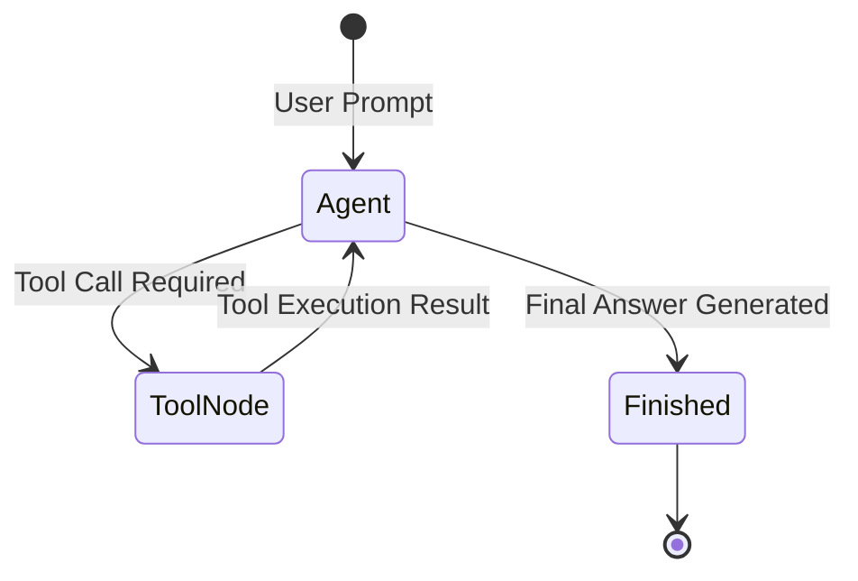

# 📹 Observability in LangGraph ｜ LangSmith Integration with LangGraph

<div className="video-card" style={{border: '1px solid #30363d', borderRadius: '8px', padding: '16px', marginBottom: '24px', background: 'rgba(56, 139, 253, 0.05)'}}>
  <div style={{display: 'flex', gap: '16px', flexWrap: 'wrap'}}>
    <div><strong>Instructor:</strong> Nitish Singh (CampusX)</div>
    <div><strong>Duration:</strong> 21m 40s</div>
    <div><strong>Playlist:</strong> Agentic AI with LangGraph (CampusX)</div>
    <div><strong>Watch Link:</strong> <a href="https://www.youtube.com/watch?v=ikzN6byFNWw" target="_blank" rel="noopener noreferrer">YouTube Lecture ↗</a></div>
  </div>
</div>

## 📌 Executive Summary & Learning Objectives

This lecture covers **Observability in LangGraph ｜ LangSmith Integration with LangGraph**, focusing on production implementations, edge cases, and industry standards:
- Core intuition, architecture, and underlying mechanisms.
- Key differences between theoretical research implementations and scalable enterprise patterns.
- Concrete Python walkthroughs, error recovery, and performance optimization.

---

## 🏗️ Architecture & Conceptual Workflow



---

## 📖 Core Concepts & Technical Deep Dive

### 1. Architectural Foundations
In modern production AI engineering, **Observability in LangGraph ｜ LangSmith Integration with LangGraph** is essential for ensuring reliability, low latency, and deterministic outcomes. As AI systems evolve from naive prompt-in / completion-out scripts into distributed systems, engineers must handle:
- **State management & consistency:** Ensuring intermediate states and tool invocations are tracked.
- **Error boundaries & recovery:** Graceful degradation when external LLMs or vector stores encounter rate limits or network partitions.
- **Resource utilization & cost efficiency:** Caching common queries and reducing unnecessary foundation model token expenditure.

### 2. Operational Considerations
- **Latency Optimization:** Pre-computing embeddings, utilizing asynchronous non-blocking event loops, and streaming tokens via Server-Sent Events (SSE).
- **Security & Sandboxing:** Validating inputs before ingestion, sanitizing LLM outputs, and isolating tool execution environments.

---

## 💻 Production Implementation Walkthrough

```python
from typing import TypedDict, Annotated, List
from langgraph.graph import StateGraph, END
import operator

# 1. Define State Schema
class AgentState(TypedDict):
    messages: Annotated[List[str], operator.add]
    next_step: str

# 2. Define Node Functions
def analyze_input(state: AgentState):
    print("Analyzing query...")
    return {"messages": ["Query analyzed."], "next_step": "generate"}

def generate_response(state: AgentState):
    print("Generating response...")
    return {"messages": ["Final response generated."], "next_step": "end"}

# 3. Build StateGraph
workflow = StateGraph(AgentState)
workflow.add_node("analyze", analyze_input)
workflow.add_node("generate", generate_response)

workflow.set_entry_point("analyze")
workflow.add_edge("analyze", "generate")
workflow.add_edge("generate", END)

app = workflow.compile()
output = app.invoke({"messages": ["Hello Agent"], "next_step": ""})
print(output)
```

---

## 💡 Production Best Practices & Tips

:::tip Production Deployment Guideline
When deploying Observability in LangGraph ｜ LangSmith Integration with LangGraph in enterprise environments, always configure automated retries with exponential backoff and telemetry tracing (such as OpenTelemetry or LangSmith).
:::

:::warning Common Failure Modes
Watch out for state contamination across concurrent requests. Ensure each session or user interaction uses an isolated thread ID or execution context.
:::

---

## 🎯 Key Takeaways & Quick Reference

| Dimension | Production Standard | Pitfall to Avoid |
| :--- | :--- | :--- |
| **Execution** | Async / Non-blocking with timeouts | Synchronous blocking calls in event loops |
| **Data Validation** | Strict Pydantic v2 schemas | Untyped dictionary access |
| **Monitoring** | Distributed tracing & latency percentiles | Relying only on standard console logs |

## ⏱️ Lecture Timeline & Key Topics

| Timestamp | Key Topic / Concept Discussed |
| :--- | :--- |
| **00:00:00** | हाय गाइस, माय नेम इज नितेश एंड यू वेलकम... |
| **00:05:02** | उसके बाद आपको अपना एपीआई की बताना है।... |
| **00:10:44** | से एक नया थ्रेड ओपन करूं और यहां पर मैं... |
| **00:16:13** | अभी भी पहले जैसी है। ये नया चीज ऐड किया... |
| **00:21:37** | में। बाय।... |


---

---

## 📜 Complete Lecture Transcript (Hindi / Hinglish)

> **Language:** Hindi / Hinglish | **Source:** `17 - Observability in LangGraph ｜ LangSmith Integration with LangGraph.hi-orig.srt` | **Total Segments:** 11 | **Word Count:** ~4,063 words

<details>
<summary><b>Click to expand full chronological transcript (11 timestamped intervals)</b></summary>

#### ⏱️ [00:00 ➔ 00:02]

हाय गाइस, माय नेम इज नितेश एंड यू वेलकम टू माय YouTube चैनल। इस वीडियो में भी हम लोग अपना एजेंटिक एआई यूजिंग लैंग्राफ्ट प्लेलिस्ट कंटिन्यू करेंगे और वीडियो को स्टार्ट करने के पहले आपके साथ दो-तीन बातें मैं डिस्कस करना चाहता हूं। सबसे पहली चीज जो मुझे डिस्कस करनी है वो है कि अभी तक की हमारी इस प्लेलिस्ट में जर्नी कैसी रही है। अगर मैं समराइज करूं तो हमने शुरू किया था थोड़े थ्योरिटिकल टॉपिक्स के साथ। जहां पे मैंने आपको बताया था कि एजेंटिक एआई क्या होता है? मैंने आपको बताया था कि लैंडग्राफ क्या होता है? उसकी जरूरत क्यों है? उसके बाद हमने स्टार्ट कर दिया था प्रैक्टिकली लैंग्राफ को सीखना जहां पर मैंने आपको लैंग्राफ के फंडामेंटल्स बताए थे और फिर हमने लंग ग्राफ में अलग-अलग टाइप के वर्क फ्लोस बनाना सीखा। उसके बाद हमने एक छोटा सा प्रोजेक्ट उठाया जहां पे हमने एक चैटबॉट को डेवलप करना शुरू किया और फिर हर अगले वीडियो में हमने उस चैटबॉट में कुछ-कुछ फीचर्स ऐड किए। सो इस पॉइंट पे हमारा जो चैटबॉट है वो कुछ ऐसा दिखाई देता है। सो हमारे चैटबॉट में एक जीयूआई है जिसके थ्रू यूजर इंटरेक्ट कर सकता है हमारे चैटबॉट से। उसके अलावा हमने स्ट्रीमिंग का फीचर दिया है ताकि यूजर को वेट ना करना पड़े एलएलएम का रिस्पांस देखने के लिए। और लास्ट वीडियो में हमने क्या किया कि हमारे चैटबॉट में डेटाबेस पर्सिस्टेंस का फीचर ऐड किया। इससे क्या फायदा है कि हमारा चैट इरेज नहीं होता है। बेसिकली आप अगर आज कुछ चैट करो इस चैटबॉट से और आप अपना मशीन बंद कर दो, प्रोग्राम बंद कर दो और चार दिन बाद आप दोबारा से इस चैटबॉट को ओपन करो तो आपको अपने पुराने चैट्स एज इट इज इंटैक्ट दिखाई देंगे। ठीक है? अब आज हम क्या करने वाले हैं? इस चैटबॉट में एक और बहुत इंपॉर्टेंट फीचर ऐड करने वाले हैं जिसका नाम है ऑब्जरवेबिलिटी। ऑब्जरवेबिलिटी क्या होती है? और क्यों मैटर करती है एलएलएम सिस्टम्स के लिए? यह मैं आपको आज के वीडियो में नहीं बताने वाला हूं। इनफैक्ट आप क्या कर सकते हो? मैंने कुछ दो दिन पहले ही YouTube पे ये वीडियो डाला है। अ जिसका टॉपिक है लैंडथ क्रैश कोर्स। आई वुड रिकमेंड आप प्लीज आज का वीडियो देखने के पहले ये पर्टिकुलर दो घंटे का वीडियो एंड टू एंड देख लो। इससे आपको दो फायदे होंगे।

#### ⏱️ [00:02 ➔ 00:04]

पहला आपको ऑब्जरवेबिलिटी का कांसेप्ट बिल्कुल अच्छे से समझ में आ जाएगा। सेकंड हम जो टूल यूज़ करने वाले हैं ऑब्ज़वेबिलिटी के लिए उस टूल का नाम है लैंग्मिथ। तो उस वीडियो में मैंने लैंगथ के साथ बहुत डिटेल में काम करना सिखाया है। सो अगर आपने वो वीडियो नहीं देखा है तो ट्रस्ट मी आपको आज का वीडियो कुछ खास समझ में नहीं आएगा। तो प्लीज मेक श्योर आप वो वीडियो देखो। फिलहाल मैं आपको नटशेल में बस एक समरी दे देता हूं कि ऑब्जर्वेबिलिटी क्या है? ऑब्जरवेबिलिटी का सिंपल मतलब हमारे कॉन्टेक्स्ट में ये है कि हमारा जो चैटबॉट है, हम उसके एग्जीक्यूशन को एंड टू एंड ट्रेस करने वाले हैं। बेसिकली एक यूजर आया हमारे चैटबॉट पे। उसने चैटिंग शुरू की तो उसने जो भी मैसेज भेजा उसको जो भी मैसेज पलट के मिला वो सारी चीजें हम एक सॉफ्टवेयर में रिकॉर्ड करने वाले हैं और उस सॉफ्टवेयर का नाम है लंगसmथ। ठीक है? इसके अलावा भी हम और बहुत सारी चीजें वहां पर रिकॉर्ड करेंगे। जैसे कि टोकन यूसेज कितना हुआ? अ लेटेंसी कितनी रही और इंटरनली हर सिस्टम जो है हमारे चैटबॉट का वो कैसे काम कर रहा है। ठीक है? तो नटशेल में बहुत ही इंटरेस्टिंग कांसेप्ट है और इस पर्टिकुलर फीचर को चैट बॉट में इंप्लीमेंट करने से फायदा ये होगा कि आगे के वीडियोस में जब हम थोड़े और कॉम्प्लेक्स फीचर्स ऐड करेंगे जैसे कि टूल्स या फिर रैक तो वहां पे आपको इस पर्टिकुलर ऑब्जर्वेबिलिटी फीचर की वजह से और चीजों को और अच्छे से समझने में आसानी होगी। ठीक है? तो आईली होप आपको पूरा फंडा समझ में आ गया। लेट्स स्टार्ट आवर वीडियो। सो गाइस लैंगsथ को इंटीग्रेट करने के लिए सबसे पहले आपको लैंगsथ की वेबसाइट पे जाना पड़ेगा। दिस इज द यूआरएल smith langin.com और यहां पे आपको सबसे पहले एक अकाउंट बनाना पड़ेगा। मेरे पास ऑलरेडी एक अकाउंट है तो मैं उस अकाउंट से लॉग इन कर रहा हूं। सो दिस इज द लंगसmथ यूजर इंटरफेस। इसके बारे में हम थोड़े डिटेल में भी डिस्कस करेंगे। सबसे पहले एक बार सेटअप तैयार कर लेते हैं। तो सबसे पहली चीज जो आपको चाहिए है वो ये है कि आपको एक एपीआई की जनरेट करनी पड़ेगी। उस एपीआई की की हेल्प से ही आप लैंग्राफ और लैंगथ को आपस में इंटीग्रेट करवा पाओगे। तो इसके लिए

#### ⏱️ [00:04 ➔ 00:06]

आपको क्या करना है? आपको सेटिंग्स में जाना है। वहां पे एपीआई कीज़ का ऑप्शन है। आपको यहां पे आकर के एपीआई की वाले बटन पे क्लिक करना है। यू हैव टू प्रोवाइड सम डिस्क्रिप्शन और जस्ट क्लिक ऑन क्रिएट एपीआई की। जैसे ही आप ये क्रिएट करोगे, आपके पास एक एपीआई की आ जाएगा। आपको इस एपीआई की को कहीं पे कॉपी कर लेना है। ठीक है? उसके बाद आपको क्या करना है? ये थोड़ा सा कोड है। ये मैं आपके साथ शेयर कर लूंगा वीडियो के डिस्क्रिप्शन में। आपको सिंपली इस कोड को कॉपी करना है और अपने प्रोजेक्ट फोल्डर में जाके एनवायरमेंट फाइल में पेस्ट कर देना है। ठीक है? सो ये बेसिकली तीनचार वेरिएबल्स हैं जो आपको अपने प्रोजेक्ट में ऐड करने पड़ेंगे। जैसे ही आप इन वेरिएबल्स को ऐड करते हो अपने प्रोजेक्ट में ऑटोमेटिकली लंगिथ आपके प्रोजेक्ट को लैंग्राफ्ट प्रोजेक्ट को ट्रेस करने लग जाता है। क्या-क्या वेरिएबल्स हैं? आप सबसे पहले ये एक वेरिएबल सेट कर रहे हो लैंसिथ ट्रेिंग और इसकी वैल्यू आप ट्रू रख रहे हो। ठीक है? उसके बाद आपको बताना है लस्मिथ एंड पॉइंट जहां पे आप यूआरएल बता रहे हो लैंगथ का। उसके बाद आपको अपना एपीआई की बताना है। ठीक है? तो ये एपीआई की एक्सैक्टली वही होना चाहिए जो आपने अभी क्रिएट किया है। ठीक है? और लास्ट में यहां पर आपको एक प्रोजेक्ट नेम प्रोवाइड करना होता है। सो लैंडस्मिथ में क्या होता है कि आपके सारे के सारे प्रोजेक्ट्स एक जगह पे ऑर्गेनाइज्ड होते हैं। सो अगर आप यहां पे जाओगे ट्रेिंग प्रोजेक्ट्स में तो यहां पे आपको अलग-अलग प्रोजेक्ट्स देखने को मिलेंगे। सो ये मेरे पास्ट प्रोजेक्ट्स हैं और यहां पे फिलहाल आपको शायद कुछ भी देखने को ना मिले। बट जैसे ही आप यह पर्टिकुलर प्रोजेक्ट बनाओगे और रन करोगे बिल्कुल इसी नाम से चैटबॉट प्रोजेक्ट नाम से आपको इस जगह पे एक प्रोजेक्ट दिखने लगेगा और सारी की सारी जो ट्रेिंग होगी हमारे चैटबॉट की वो सब आपको इस प्रोजेक्ट के अंदर दिखाई देगी। ठीक है? सो आई होप आपको अभी तक का पूरा का पूरा फ्लो समझ में आ रहा है। और इतना सेटअप करने के बाद वी आर रेडी टू गो। सो नाउ दैट द सेटअप इज़ रेडी। मैं आपको दिखाता हूं कि कैसे आप

#### ⏱️ [00:06 ➔ 00:08]

अपने कोड को एग्जीक्यूट करके उसका ट्रेस स्टोर कर सकते हो lang स्मिथ के अंदर। अब लैंसिथ की सबसे अच्छी चीज क्या है कि अगर आपने बस इतना सेटअप रेडी कर लिया है तो आपको अपने मेन कोड में जाकर के कोई चेंजेस करने की जरूरत नहीं है। लैंसिथ ऑटोमेटिकली बिहाइंड द सीन सारा ट्रेसिंग करने लग जाता है। ठीक है? सो व्हाट आई विल डू इज़ कि मैं एक बार फिर से इस कोड को रन करता हूं। आई विल ओपन अ न्यू टर्मिनल और बाय द वे ये एकैक्टली वही कोड है जो हमने लास्ट कोड वीडियो में लिखा था जहां पे हमने डेटाबेस वाला इंटीग्रेशन किया था। बिल्कुल सेम कोड है। नो चेंजेस। ठीक है? सो व्हाट आई विल डू इज़ आई विल सिंपली रीरन दिस कोड। और जैसे ही मैंने रीरन किया तो दिस इज़ द विंडो दैट आई एम गेटिंग। सो फिलहाल लेट्स से मैंने बोल दिया गिव मी अ रोड मैप टू स्टडी एआई इंजीनियरिंग। ठीक है? मैंने एंटर मारा एंड यू कैन सी हमारा जो चैटबॉट है वह बिल्कुल नॉर्मली बिहेव कर रहा है जैसा उसको करना चाहिए। बट इंटरेस्टिंगली हो क्या रहा है? बिहाइंड द सीन्स लंगसिथ अपना काम करना स्टार्ट कर चुका है। और अगर आप अपने लैंगसिथ डैशबोर्ड में जाओगे तो वहां पे देखो ट्रेिंग प्रोजेक्ट्स के अंदर आपको यह चैटबॉट प्रोजेक्ट नाम का एक नया प्रोजेक्ट दिखने लगेगा। और ऐसा इसलिए हुआ बिकॉज़ आपने अपने एनवायरमेंट वेरिएबल में ये नया लैंडस्मिथ प्रोजेक्ट बना रखा था। ठीक है? सो अब आपको क्या करना है? इफ यू वांट टू सी कि एग्जजेक्टली यूजर ने क्या बात की चैटबॉट से कितना टोकन यूसेज हुआ, लेटेंसी कितनी थी? तो आपको सिंपली इस प्रोजेक्ट के ऊपर क्लिक करना है। अब लैगिथ किस तरीके से ऑर्गेनाइज करता है पूरी चीज को मैं आपको बताता हूं। सो एकदम टॉप लेवल पे होता है प्रोजेक्ट। सो हमने एक प्रोजेक्ट बना दिया चैटबॉट प्रोजेक्ट बोल के। अब जितनी बार हमारा यूजर हमारे चैटबॉट से बात करेगा उतनी बार क्या होगा कि लंगिथ एक ट्रेस कैप्चर करता है। जैसे अभी हमने एक बार चैटबॉट को एक मैसेज दिया और चैटबॉट ने पलट

#### ⏱️ [00:08 ➔ 00:10]

के हमें एक रिप्लाई किया तो वो एक सिंगल ट्रेस बन गया जो आपको यहां पे दिखाई दे रहा है। ठीक है? और अब अगर आप इस ट्रेस पे क्लिक करोगे तो आपको कई तरह का इनेशन यहां पे देखने को मिलेगा। सो यहां पर सबसे पहले आपको दिखाई देगा कि आपका जो नोड था लैंडग्राफ में उसका नाम क्या था? चैट नोड और उसके अंदर आपने एक एलएलएम मॉडल यूज़ किया है जिसका नाम है चैट ओपन एआई। ठीक है? और अंदर हुआ क्या? आपको ये इनपुट मिला और आपको ये आउटपुट मिला एलएलएम की तरफ से। और इसके अलावा और बहुत सारी चीजें आपको देखने को मिलेंगी। ये एग्जीक्यूशन कब स्टार्ट हुआ? एग्जीक्यूशन कब खत्म हुआ? अ आपका फर्स्ट टोकन देखने में कितना टाइम लगा? स्टेटस क्या था? टोटल कितने टोकंस आए? टोकंस में दोनों टोकंस। इनपुट टोकंस भी और आउटपुट टोकंस भी। ठीक है? उसके बाद सिस्टम की लेटेंसी कितनी रही? कितना टाइम लगा रिस्पांस जनरेट होने में? ये सारा इंफॉर्मेशनेशन आपको एक जगह पे देखने को मिल जाता है। ठीक है? तो एक काम करते हैं। एक और अ मैसेज करते हैं। लेट्स से मैंने लिखा हाउ मच टाइम विल इट टेक टू कवर दिस सिलेबस। सो उसने कुछ आंसर लिखा। ठीक है? अब फिर से बिहाइंड द सीन्स लैंथ अपना काम कर रहा है। सो आई विल गो बैक। एंड नाउ यू कैन सी जैसे ही हमने सेकंड टर्न बात की हमारे चैटबॉट से तो वो सेकंड टर्न भी जो है वो एक सेपरेट ट्रेस की तरह कैप्चर हो गया। और ये रहा वो ट्रेस। इसके ऊपर अगर मैं क्लिक करूं तो दिस इज़ माय सेकंड ट्रेस। ठीक है? हाउ मच टाइम विल इट टेक टू कवर दिस सिलेबस? और ये रहा उसका आंसर। अब इसको अपना काम करने में कितना टाइम लगा? कितने टोकंस जनरेट हुए? ये सारा इंफॉर्मेशन आपको एक जगह पर मिल रहा है। तो बेसिक फंडा ये है कि आपने एक प्रोजेक्ट बना लिया है लैंडथ में। अब उस प्रोजेक्ट के अंदर जितनी बार भी आपका यूजर टर्न बाय टर्न चैटिंग कर

#### ⏱️ [00:10 ➔ 00:12]

रहा है हर टर्न एज अ ट्रेस कैप्चर होता जा रहा है। सो अगर मैं फिर से कुछ मैसेज डालूंगा पलट के मुझे रिप्लाई आएगा। तो दैट इज वन टर्न। वो टर्न एज इट इज़ एज अ ट्रेस कैप्चर हो जाएगा हमारे लैंगथ वाले डैशबोर्ड में। ठीक है? और आप कभी भी फ्यूचर में आकर के चेक कर सकते हो कि यूजर ने क्या क्वेश्चन किया था। उसको क्या आंसर मिला था, कितना टाइम लगा था। आप हर चीज को ऑब्जर्व कर सकते हो। ठीक है? और इसीलिए इसको बोला जाता है ऑब्जरवेबिलिटी। ठीक है? अब आई नो आपको एक चीज शायद थोड़ी सी खटक रही होगी बिकॉज़ वो सेम चीज मुझे भी खटकी थी जब मैंने फर्स्ट टाइम लैंग्मिथ को यूज़ किया था। और आपको ऐसा लग रहा होगा कि यह बहुत लॉजिकल नहीं है। कल को अगर मैं लेट्स से एक नया थ्रेड ओपन करूं और यहां पर मैं लेट्स से लिखूं रेसिपी ऑफ बिरयानी। ठीक है? तो दिस इज अ सेपरेट थ्रेड। एक अलग कॉन्वर्सेशन मैं कर रहा हूं मेरे चैटबॉट के साथ। आंसर आ रहा है। अब एक बार लैंग्मिथ में आकर देखते हैं कि यहां पर क्या हो रहा है। सो यहां पर अगर आप देखो तो अब थर्ड ट्रेस आ गया है व्हिच इज रेसिपी ऑफ़ बिरयानी एंड उसका रिस्पांस एलएलएम का रिस्पांस। बट प्रॉब्लम क्या है इस पूरे अप्रोच में कि आप एक सेपरेट थ्रेड स्टार्ट करके एक नया कॉन्वर्सेशन कर रहे हो। बट वो पर्टिकुलर टर्न भी एग्जैक्टली उसी जगह पे आके स्टोर हो रहा है जहां पे आपका प्रीवियस थ्रेड के मैसेजेस थे। तो इन अ वे आपके सारे के सारे थ्रेड्स में जो सारे के सारे अलग कन्वर्सेशंस हैं उनके सारे मैसेजेस एक ही जगह पर आप स्टोर कर रहे हो। अब सडनली से अगर मैं थ्रेड स्विच करके वापस पिछले वाले थ्रेड में चला जाऊं और वहां पर बात करने लगूं तो फिर से उसका मैसेज भी एक्सजेक्टली यहीं पे आएगा। तो डोंट यू थिंक ये थोड़ा सा मिसमैनेज्ड लग रहा है। देयर शुड बी अ बेटर वे टू ऑर्गेनाइज आवर चैट्स। अलग-अलग कन्वर्सेशंस अलग-अलग तरीके से स्टोर होने चाहिए। दैट इज माय पॉइंट। सो अगर आपके दिमाग में ये बात आ रही है तो बहुत ही वैलिड बात है। एंड ट्रस्ट मी लैंगिथ के क्रिएटर्स ने इसके बारे में सोचा एंड दे हैव प्रोवाइडेड स्यूशन। सो उन लोगों ने क्या फीचर ऐड किया

#### ⏱️ [00:12 ➔ 00:14]

है कि आप चाहो तो अपने सारे के सारे ट्रेसेस को थ्रेड्स के अंदर ऑर्गेनाइज कर सकते हो। हो। सो इफ यू रिमेंबर हमने अपने चैटबॉट में थ्रेडिंग का कांसेप्ट यूज कर रखा है। सो कभी भी आप एक नया कॉन्वर्सेशन स्टार्ट करते हो तो हमारे चैटबॉट में एक नया थ्रेड क्रिएट होता है और उस थ्रेड के अंदर ही हम सारा का सारा चैट स्टोर करते हैं। तो लैंसिथ आपको ये फीचर दे रहा है कि इफ यू वांट तो आप अलग-अलग कॉन्वर्सेशनल थ्रेड्स बना सकते हो और हर थ्रेड का मैसेज ऑटोमेटिकली उस थ्रेड के अंदर ही स्टोर होगा। ठीक है? बस एक प्रॉब्लम है। इस थ्रेड को सेटअप करने के लिए आपको थोड़ा सा एक्स्ट्रा कोड लिखना पड़ेगा। मैं आपको दिखाता हूं आपको एक्सजेक्टली क्या करना पड़ेगा। जैसे यहां पर अगर आप थ्रेड्स वाले सेक्शन में जाओ तो फिलहाल कोई भी थ्रेड्स प्रेजेंट नहीं है हमारे चैटबॉट एप्लीकेशन में। इट सेस नो थ्रेड फाउंड। बट अगर आप यहां पे नीचे देखो तो उन लोगों ने एक लिंक प्रोवाइड कर रखा है। लर्न हाउ टू लॉग योर फर्स्ट थ्रेड। और अगर आप इस पे जाओ तो यहां पे इन लोगों ने एकदम सिंपल शब्दों में लिखा है कि अगर आपको थ्रेड का फीचर इंप्लीमेंट करना है तो आपको क्या करना पड़ेगा? आपको अपने कोड में रन करते टाइम एग्जीक्यूट करते टाइम एक्सप्लसिटली थ्रेड आईडी मेंशन करना पड़ेगा। ठीक है? या तो थ्रेड आईडी या तो सेशन आईडी या तो कन्वर्सेशन आईडी। इन तीनों में से कोई एक चीज आपको मेंशन करनी पड़ेगी वाइल इनवोकिंग योर चैट बॉट। ठीक है? तो बेसिक फंडा ये है कि आपको एक पीस ऑफ कोड ऐड करना है और मैं आपको दिखाता हूं वो पीस ऑफ कोड क्या है। सो दिस इज द पीस ऑफ कोड। अगेन ये आपको मिल जाएगा वीडियो के डिस्क्रिप्शन में। अ मैं आपको दिखाता हूं कि ये कोड हम कहां पे प्लग इन करेंगे। सो ये हमारा एकिस्टिंग कोड है। बिल्कुल वही जो हमने लास्ट वीडियो में लिखा था। अब इसमें एक जगह पर अगर आप आओ तो आपको दिखाई देगा कि यहां पर हमने एक कॉन्फिग बोल के वेरिएबल बना रखा है जिसमें एक डिक्शनरी है और उस डिक्शनरी का की है कॉन्फ़िगरेबल और फिर वो खुद एक डिक्शनरी है

#### ⏱️ [00:14 ➔ 00:16]

और उसमें हमने थ्रेड आईडी बता रखा है जो कि सेशन में स्टर्ड है। और ये पर्टिकुलर जो पूरा का पूरा कॉन्फ़िगरेशन वेरिएबल है ये हमने इसलिए बनाया था पास्ट में सो दैट इसको हम भेज पाएं अ हमारे चैटबॉट के बैक एंड के पास। ठीक है? लैंग्राफ के पास लंग ग्राफ इसी को देख करके अ थ्रेड्स के अंदर मैसेजेस को ऑर्गेनाइज करता है। राइट? आपको बस ये करना है कि इस कॉन्फिग वाले वेरिएबल को चेंज करके इसको इस वेरिएबल से रिप्लेस कर देना है। दैट्स इट। आपको ये कॉन्फिग वेरिएबल ना यूज़ करके ये कॉन्फ़िग वेरिएबल यूज़ करना है। अब इसमें क्या अलग है? मैं आपको बताता हूं। ये वाली चीज एग्जजेक्टली सेम है। ऊपर अगर आप देखो तो ऊपर वाला कॉन्फिग वेरिएबल और नीचे वाले कॉन्फिग वेरिएबल में ये चीज बिल्कुल सेम है। अलग क्या है? अलग है ये दोनों चीजें। आपको एक और चीज करनी पड़ेगी। आपको एक मेटा डेटा बोल के की बनानी पड़ेगी। सो यहां पे अगर आप आओ तो यहां पे आपको कहीं पे दिखाई देगा। यहां पे देखो लिखा हुआ है यू कैन ऐड मेटा डेटा टू योर ट्रेसेस। ठीक है? और वो मेटा डेटा एग्जजेक्टली ये है। और इस मेटा डेटा के अंदर हमने थ्रेड आईडी पास किया। ठीक है? और थ्रेड आईडी में हमने अपना करंट यूजर का जो थ्रेड आईडी है वो डाल दिया। ठीक है? और उसके अलावा हमने यहां पे एक और वेरिएबल ऐड किया है। अगर आप चाहो तो इसको हटा भी सकते हो। अ इसका नाम है रन नेम। तो बेसिकली अभी अगर आप देखो तो आपके जो भी ट्रेसेस बन रहे हैं उन ट्रेसेस का जो डिफॉल्ट नेम है वो है लंग ग्राफ व्हिच इज नॉट वेरी एक्यूरेट या बहुत ज्यादा इनफेटिव नहीं है। देख के नहीं समझ में आ रहा है कि एक्सैक्टली ये क्या रिप्रेजेंट कर रहा है। तो मैं बस ये चाह रहा हूं कि वहां पे लैंग ग्राफ के बदले चैट टर्न लिखा आए। बिकॉज़ ईच ट्रेस इज रिप्रेजेंटिंग वन टर्न ऑफ कॉन्वर्सेशन। एक बार मैं कुछ बोल रहा हूं पलट के चैट बॉट कुछ बोल रहा है। दैट इज वन टर्न। तो इसलिए आई वांट कि मैं रन नेम में चैट टर्न नाम का वेरिएबल डाल दूं। ठीक है? सो दैट यहां पे लैंग ग्राफ के बदले चैट

#### ⏱️ [00:16 ➔ 00:18]

टर्न दिखाई दे। दैट्स इट। सो बेसिक चेंज जो हमने किया हमारे कोड में हमने इस कॉन्फिग वेरिएबल को हटा दिया और उसको रिप्लेस कर दिया इस चीज से। ये वाली चीज अभी भी पहले जैसी है। ये नया चीज ऐड किया बिकॉज़ ये हमें बोला जा रहा है मेटा डेटा ऐड करने के लिए और ये हमने ऑप्शनली ऐड किया फॉर बेटर रीडेबिलिटी। ठीक है? अब दिस इज द कोड जो हमें रन करना है। ओके? सो व्हाट आई विल डू इज़ एक काम करते हैं। दोबारा से चला लेते हैं इस कोड को। यह हमने रन किया। और व्हाट आई विल डू इज कि मैं एक बार ट्रेिंग प्रोजेक्ट में जाकर के यह जो चैटबॉट प्रोजेक्ट है इसको डिलीट कर देता हूं ताकि हम दोबारा से स्क्रैच से पूरा का पूरा ट्रेिंग करें और आपको कुछ भी कंफ्यूजन ना हो। ठीक है? ओके नाउ इट इज़ डिलीटेड। सो नाउ लेट्स डू वन राउंड ऑफ़ चैटिंग। सो आई विल से हाय। सो इट सेज़ हेलो। हाउ कैन आई असिस्ट यू? नाउ इफ वी गो हियर तो आप देखोगे कि फिर से एक नया प्रोजेक्ट बन जाएगा चैटबॉट प्रोजेक्ट के नाम से। सो इफ आई रिफ्रेश ये देखो आ गया। इस पे क्लिक किया। बिल्कुल पहले जैसा ही सब कुछ है। हमें एक ट्रेस दिखाई दे रहा है। द ओनली डिफरेंस इज इस बार लैंग्राफ के बदले चैट टर्न दिखाई दे रहा है। बिकॉज़ हमने रन नेम सेट कर रखा है। यहां पे भी कुछ नया नहीं है। बिल्कुल सेम है। जो डिफरेंस है वो ये है कि अगर आप इस बार थ्रेड्स पे जाओ तो यहां पे आपको एक थ्रेड दिखाई देने लगेगा। और उस थ्रेड के अंदर आपको दिखाई दे रहा है देयर इज़ वन ट्रेस या फिर वन टर्न। सो अगर मैं इसके ऊपर क्लिक करूं तो फिर ये मुझे एक बहुत अच्छे यूआई में दिखाएगा कि हमारी अभी तक क्या बात हुई है। सो ह्यूमन ने बोला है हाय एआई ने बोला है हेलो हाउ कैन आई असिस्ट यू? अब देखो मैं क्या बोलता हूं। मैं बोलूंगा माय नेम इज नितीश। नाइस टू मीट यू नितीश जो भी है उसका मैसेज। अब अगर मैं यहां पे वापस आऊं और ट्रेिंग प्रोजेक्ट पे जाऊं। चैटबॉट प्रोजेक्ट पे जाऊं तो अब मुझे यहां पे दो ट्रेसेस दिखाई दे रहे हैं। दिस इज़ द सेकंड वन। बट इफ आई गो टू थ्रेड्स तो अभी भी एक

#### ⏱️ [00:18 ➔ 00:20]

ही थ्रेड है बट उस थ्रेड के अंदर नाउ वी हैव टू ट्रेसेस। सो इसके ऊपर अगर मैं क्लिक करूं तो नाउ यू कैन सी कि ये पूरी चीज कितने अच्छे से ट्रेस हो रही है। ठीक है? सो दिस इज़ टर्न वन हाय हेलो एंड दिस इज़ टर्न टू। सो अगर आप इसके ऊपर होवर कर रहे हो तो आपको दिखाई भी दे रहा होगा। ठीक है? एक और मैसेज करते हैं। अ हु क्रिएटेड यू। ठीक है? आई वास क्रिएटेड बाय ओपन एआई। अब अगर मैं यहां पर थोड़ी देर वेट करूं तो थोड़ी देर में थर्ड टर्न भी अपीयर कर गया। एंड दिस इज द थर्ड टर्न। सो दिस इज द बेनिफिट ऑफ एडिंग थ्रेड आईडी। अब आपका पूरा का पूरा जो कॉन्वर्सेशन है वो एक थ्रेड के अंदर स्टर्ड है। ठीक है? उसमें तीन ट्रेसेस हैं, 10 ट्रेसेस हैं। वो डिपेंड करता है। अब एक काम करते हैं। एक इंटरेस्टिंग चीज करते हैं। एक नया कॉन्वर्सेशन क्रिएट करते हैं। एक नया थ्रेड क्रिएट करते हैं। और यहां पे लिखते हैं हाय माय नेम इज राहुल। ठीक है? और यहां पे लिखते हैं व्हाट इज द रोड मैप टू स्टडी एआई। ठीक है? उसने कुछ मैसेज कैप्चर किया। अब हम वापस जाते हैं। एक बार अपने ट्रेिंग प्रोजेक्ट पर चलते हैं। अब यहां पर आपको बहुत सारे ट्रेसेस दिखाई दे रहे हैं। बट यहां पर देख के कोई फायदा नहीं है। लेट्स गो टू थ्रेड्स। अब थ्रेड में देखो क्या चेंज आया है कि अब एक नया थ्रेड क्रिएट हो गया है जो हमने नया कॉन्वर्सेशन बनाया और वो ऊपर दिखाई दे रहा है। अब अगर मैं इसके ऊपर क्लिक करूं तो मुझे मेरा सेकंड कॉन्वर्सेशन दिखाई दे रहा है। बिल्कुल सही तरीके से अरेंज्ड है। हाय माय नेम इज राहुल। हेलो राहुल। व्हाट इज द रोड मैप टू स्टडी एआई? और यहां पे वो एग्जैक्ट मैसेज आ गया है। ठीक है? और यहां पे सारे के सारे टर्न्स कैप्चर हो गए हैं। अब आप किसी पर्टिकुलर टर्न को स्टडी करना चाहते हो। जस्ट क्लिक ऑन दैट। आपको दिखाई देगा कि उस टर्न में एक्सैक्टली क्या बात हुई है। एआई ने क्या रिप्लाई किया है। लेटेंसी कितना था? टोकंस कितने यूज़ हुए। सारा का सारा

#### ⏱️ [00:20 ➔ 00:21]

इनेशन एक जगह पे अरेंज हो गया है। अब आप जितने भी नए कॉन्वर्सेशंस क्रिएट करोगे अपने चैटबॉट के ऊपर वो सारा का सारा कॉन्वर्सेशन बहुत ब्यूटीफुली थ्रेड्स के फॉर्म में स्टोर होता जाएगा लैंग स्मिथ में और सारे के सारे ट्रेसेस अपने रेस्पेक्टिव थ्रेड्स के अंदर स्टर्ड होंगे। तो दिस इज द ब्यूटी ऑफ़ लैंग्मिथ। इसीलिए लोग इसको यूज़ करते हैं। फिलहाल अभी शायद आप इसको बहुत ज्यादा एप्रिशिएट नहीं कर पा रहे होंगे। बट ट्रस्ट मी गोइंग फॉरवर्ड जब हम थोड़ी कॉम्प्लेक्स चीजें करेंगे हम टूल्स ऐड करेंगे और रैक का फीचर ऐड करेंगे एमसीपी वगैरह के साथ काम करेंगे तो यू वुड नोटिस कि ये पर्टिकुलर चीज जो है लंगसmथ का ये जो पूरा डैशबोर्ड है ये आपकी अंडरस्टैंडिंग को डेवलप करने में बहुत ज्यादा हेल्प करेगा एंड मोर देन दैट जब आप एक सॉफ्टवेयर डेवलपर की तरह अपने चैटबॉट को प्रोडक्शन पे पुश करोगे तो वहां पे यह आपको बहुत इंपॉर्टेंट इंफॉर्मेशन एक जगह पे लाके देता है। इस वीडियो में मैं आपको ज्यादा फीचर्स नहीं बता रहा लैगिथ के। बट अगेन अगर आप इस वीडियो पे जाओगे जो मैंने चैनल पे डाल रखा है। तो यहां पर यू वुड फाइंड अ लॉट मोर इनेशन अबाउट दिस वंडरफुल टूल। जो भी यहां पे चीजें आपको दिखाई दे रही है मॉनिटरिंग, डेटा सेट एंड एक्सपेरिमेंट्स, प्र्प्ट्स, प्लेग्राउंड ये सब चीजों के बारे में मैंने वहां पे बताया है। और होपफुली हम फ्यूचर में इन सारी चीजों को डिस्कस करेंगे। ठीक है? सो या दिस वास अ स्माल वीडियो बट एक बहुत इंपॉर्टेंट फीचर हमने ऐड किया हमारे चैट बॉट में जो कि हमें आगे बहुत फायदा देगा। ठीक है? अगर आपको वीडियो पसंद आया प्लीज लाइक करना। अगर आपने इस चैनल को सब्सक्राइब नहीं किया है। प्लीज डू सब्सक्राइब। मिलते हैं नेक्स्ट वीडियो में। बाय।

</details>
