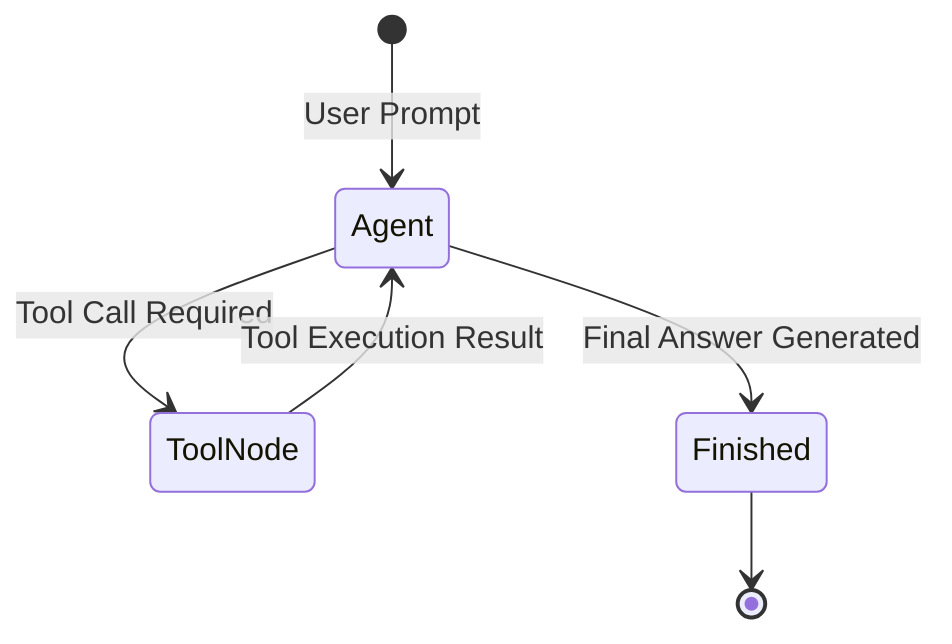

# 📹 Tools in LangGraph ｜ Agentic AI using LangGraph

<div className="video-card" style={{border: '1px solid #30363d', borderRadius: '8px', padding: '16px', marginBottom: '24px', background: 'rgba(56, 139, 253, 0.05)'}}>
  <div style={{display: 'flex', gap: '16px', flexWrap: 'wrap'}}>
    <div><strong>Instructor:</strong> Nitish Singh (CampusX)</div>
    <div><strong>Duration:</strong> 34m 20s</div>
    <div><strong>Playlist:</strong> Agentic AI with LangGraph (CampusX)</div>
    <div><strong>Watch Link:</strong> <a href="https://www.youtube.com/watch?v=_UuUigoM9MA" target="_blank" rel="noopener noreferrer">YouTube Lecture ↗</a></div>
  </div>
</div>

## 📌 Executive Summary & Learning Objectives

This lecture covers **Tools in LangGraph ｜ Agentic AI using LangGraph**, focusing on production implementations, edge cases, and industry standards:
- Core intuition, architecture, and underlying mechanisms.
- Key differences between theoretical research implementations and scalable enterprise patterns.
- Concrete Python walkthroughs, error recovery, and performance optimization.

---

## 🏗️ Architecture & Conceptual Workflow



---

## 📖 Core Concepts & Technical Deep Dive

### 1. Architectural Foundations
In modern production AI engineering, **Tools in LangGraph ｜ Agentic AI using LangGraph** is essential for ensuring reliability, low latency, and deterministic outcomes. As AI systems evolve from naive prompt-in / completion-out scripts into distributed systems, engineers must handle:
- **State management & consistency:** Ensuring intermediate states and tool invocations are tracked.
- **Error boundaries & recovery:** Graceful degradation when external LLMs or vector stores encounter rate limits or network partitions.
- **Resource utilization & cost efficiency:** Caching common queries and reducing unnecessary foundation model token expenditure.

### 2. Operational Considerations
- **Latency Optimization:** Pre-computing embeddings, utilizing asynchronous non-blocking event loops, and streaming tokens via Server-Sent Events (SSE).
- **Security & Sandboxing:** Validating inputs before ingestion, sanitizing LLM outputs, and isolating tool execution environments.

---

## 💻 Production Implementation Walkthrough

```python
from typing import TypedDict, Annotated, List
from langgraph.graph import StateGraph, END
import operator

# 1. Define State Schema
class AgentState(TypedDict):
    messages: Annotated[List[str], operator.add]
    next_step: str

# 2. Define Node Functions
def analyze_input(state: AgentState):
    print("Analyzing query...")
    return {"messages": ["Query analyzed."], "next_step": "generate"}

def generate_response(state: AgentState):
    print("Generating response...")
    return {"messages": ["Final response generated."], "next_step": "end"}

# 3. Build StateGraph
workflow = StateGraph(AgentState)
workflow.add_node("analyze", analyze_input)
workflow.add_node("generate", generate_response)

workflow.set_entry_point("analyze")
workflow.add_edge("analyze", "generate")
workflow.add_edge("generate", END)

app = workflow.compile()
output = app.invoke({"messages": ["Hello Agent"], "next_step": ""})
print(output)
```

---

## 💡 Production Best Practices & Tips

:::tip Production Deployment Guideline
When deploying Tools in LangGraph ｜ Agentic AI using LangGraph in enterprise environments, always configure automated retries with exponential backoff and telemetry tracing (such as OpenTelemetry or LangSmith).
:::

:::warning Common Failure Modes
Watch out for state contamination across concurrent requests. Ensure each session or user interaction uses an isolated thread ID or execution context.
:::

---

## 🎯 Key Takeaways & Quick Reference

| Dimension | Production Standard | Pitfall to Avoid |
| :--- | :--- | :--- |
| **Execution** | Async / Non-blocking with timeouts | Synchronous blocking calls in event loops |
| **Data Validation** | Strict Pydantic v2 schemas | Untyped dictionary access |
| **Monitoring** | Distributed tracing & latency percentiles | Relying only on standard console logs |

## ⏱️ Lecture Timeline & Key Topics

| Timestamp | Key Topic / Concept Discussed |
| :--- | :--- |
| **00:00:00** | हाय गाइज़, माय नेम इज नितेश एंड यू आर... |
| **00:08:31** | है और वह यहां पर नॉर्मल आंसर जनरेट करके... |
| **00:16:55** | बिल्कुल सेम नथिंग डिफरेंट। अब यहां पर... |
| **00:25:28** | करते हैं। लेट्स चेक कि बिहाइंड द सीन्स... |
| **00:34:17** | नेक्स्ट वीडियो में। बाय।... |


---

---

## 📜 Complete Lecture Transcript (English)

> **Language:** English | **Source:** `18 - Tools in LangGraph ｜ Agentic AI using LangGraph ｜ CampusX.hi.srt` | **Total Segments:** 18 | **Word Count:** ~6,696 words

<details>
<summary><b>Click to expand full chronological transcript (18 timestamped intervals)</b></summary>

#### ⏱️ [00:00 ➔ 00:02]

हाय गाइज़, माय नेम इज नितेश एंड यू आर वेलकम टू माय YouTube चैनल। इस वीडियो में भी हम लोग अपना एजेंटिक एआई यूज़िंग लैंडग्राफ प्लेलिस्ट कंटिन्यू करेंगे। पिछले कई वीडियोस से हम लोग एक चैटबॉट बिल्ड कर रहे हैं और हर अगले वीडियो में हम उस चैटबॉट में एक नया फीचर ऐड कर रहे हैं। सो इस पॉइंट तक हमारे पास चैटबॉट में बहुत सारे फीचर्स हो गए हैं। हमारे चैटबॉट के पास जीयूआई है, अ शॉर्ट टर्म मेमोरी है, डेटाबेस पर्सिस्टेंस है, स्ट्रीमिंग का फीचर है। अब आज हम लोग एक नया फीचर ऐड करने जा रहे हैं। ठीक है? तो मैं आपको एक प्रॉब्लम बताता हूं हमारे चैटबॉट की। हमारा चैटबॉट करेंटली बैक एंड पर ओपन एi के एलएलएम से कनेक्टेड है। एंड दैट इज व्हाई आप इससे बात कर सकते हो। किसी भी बारे में बात कर सकते हो और आपको पलट करके यह चैटबॉट सही रिस्पांस देता है। बट अभी तक इस चैटबॉट में यह कैपेबिलिटी नहीं है कि यह कोई एक्शंस आपको परफॉर्म करके दे। सो आज के वीडियो में हम एग्जैक्टली यही काम करने वाले हैं। हम अपने चैटबॉट से कुछ एक्शंस परफॉर्म करवाएंगे। बेसिकली व्हाट वी आर गोइंग टू डू इज कि हम अपने चार्टबॉट में कुछ टूल्स ऐड करेंगे। ठीक है? और उन टूल्स के ऐड करने की वजह से क्या होगा कि नॉट ओनली हमारा चैटबॉट हमसे नॉर्मली बात कर पाएगा बट अगर हम उसको कोई काम देंगे तो वो काम भी हमारा चैटबॉट हमें करके दे सकता है। ठीक है? अब ऑनेस्टली देयर इज़ नो लिमिट। आप किसी भी तरह का टूल अटैच कर सकते हो अपने चैटबॉट के साथ। बट सिंस ये एक बिगिनर फ्रेंडली ट्यूटोरियल है। तो यहां पर हम कुछ बेसिक टूल्स ऐड करेंगे। सो आई एम प्लानिंग टू ऐड थ्री टूल्स। द फर्स्ट टूल इज़ जहां पर हमारे चैटबॉट के पास कैपेबिलिटी आ जाएगी कि वो कोई भी न्यूमेरिकल कैलकुलेशन कर सकता है। बेसिकली हम हमारे चैटबॉट को एक कैलकुलेटर टूल देंगे। सेकंड कैपेबिलिटी जो हम देंगे वो होगा इंटरनेट सर्च करने का। इस पॉइंट पे हमारा जो चैटबॉट है उसके पास इंटरनेट पे जाकर के चीजें सर्च करने की कैपेबिलिटी नहीं है। जैसे अगर मैं अपने चैटबॉट से पूछ लूं कि बताओ आज इंडिया में टॉप न्यूज़ क्या है? हमारा चैटबॉट हमें यह नहीं बता पाएगा। बट आफ्टर एडिंग दिस टूल इंटरनेट

#### ⏱️ [00:02 ➔ 00:04]

सर्च वाला टूल आवर चैटबॉट वी विल बी एबल टू गो सर्च ऑन इंटरनेट एंड गेट अस रिजल्ट्स। एंड द थर्ड कैपेबिलिटी दैट वी आर गोइंग टू ऐड इज़ स्टॉक टूल जहां पर आप किसी भी कंपनी का नाम डालोगे और वो टूल आपको इस मोमेंट पे उस कंपनी का जो भी स्टॉक प्राइस है वो ला करके देगा। ठीक है? तो ये हम लोग आज के वीडियो में अचीव करने वाले हैं। सो मैंने डेमो प्रिपेयर कर रखा है। मैं आपको एक बार डेमो दिखाता हूं। सो अगर आप नॉर्मली चैटबॉट से बात करो इफ यू से हाय तो वो नॉर्मल मोड में फंक्शन करेगा। बट जैसे ही आप उसको कोई काम दोगे तो वो आइडेंटिफाई कर लेगा कि उसको टूल यूज़ करना चाहिए और फिर वो उस पर्टिकुलर टूल को यूज़ करेगा जो उसको लगेगा कि सही टूल है इस पर्टिकुलर टास्क को एग्जीक्यूट करने के लिए। फॉर एग्जांपल अगर मैं इससे पूछूं अ व्हाट हैपेंड टू द मुंबई मोनो रेल लास्ट वीक? मान लो मैंने ये क्वेश्चन पूछा। ठीक है? अब यह पर्टिकुलर इंफॉर्मेशनेशन चैटबॉट के पास नहीं है तो वह जाकर के झट से इंटरनेट पर सर्च करने लगेगा। देखो यहां पर आपने शायद देखा होगा बहुत जल्दी आके चला गया बट वहां पर लिखा हुआ था यूजिंग डक डक गो सर्च टूल। सो डक डक गो इज अ सर्च इंजन जस्ट लाइक Google और हमारा जो वेबसाइट हमारा जो चैटबॉट है वो बिहाइंड द सीन्स इंटरनेट सर्च करने के लिए डग डक गो यूज़ कर रहा है। अभी उसने फिलहाल ये आंसर नहीं बताया। लेट्स से फिर हम पूछ ले कि हु वॉन द साउथ अफ्रीका वर्सेस ऑस्ट्रेलिया ओडीआई मैच यस्टरडे अगेन यूजिंग डग डग गो सर्च सो ठीक है थोड़ी बेज्जती हो रही है बट यू गेट द आईडिया हमारा टूल पीछे से काम कर रहा है। इट्स जस्ट कि वो अच्छे रिजल्ट्स नहीं दे पा रहा है। आई एम रियली थिंकिंग कि मैं आपको कुछ ऐसा दिखा पाऊं जहां पर हमें सही आंसर मिल पाए। बट अगेन चलो ठीक है। मैं आपको दूसरा टूल दिखाता हूं। लेट्स से हम बोले व्हाट इज द प्रोडक्ट ऑफ 654 एंड 713 ठीक है और मैंने एंटर मारा अब देखो वहां पे दिखाई दे रहा है यूजिंग

#### ⏱️ [00:04 ➔ 00:06]

कैलकुलेटर और यूजिंग कैलकुलेटर दिस इज़ द आउटपुट ठीक है अगेन आप क्रॉस चेक कर सकते हो सिमिलरली वी आल्सो हैव अ थर्ड टूल जहां पे आप किसी भी कंपनी का स्टॉक प्राइस इस पॉइंट पे क्या है वो निकाल सकते हो जैसे कि मैंने बोला व्हाट इज द करंट स्टॉक प्राइस ऑफ Tesla तो देखो वो एक थर्ड टूल यूज़ कर रहा गेट स्टॉक प्राइस बोल के और बोल रहा है कि द करंट स्टॉक प्राइस ऑफ़ Tesla इज़ $323। ठीक है? तो दिस इज़ द पावर ऑफ़ टूल्स। नॉट ओनली आप अपने चैटबॉट से बात कर पा रहे हो बट एट द सेम टाइम आप उससे कुछ काम भी करवा सकते हो विथ द हेल्प ऑफ दीज़ टूल्स। ठीक है? अगेन मेरे दिमाग में चल रहा है कि अगर मैं आपको एटलीस्ट एक यूज़ केस दिखा पाऊं सही से परफॉर्म होते हुए। तो एक एग्जांपल लेते हैं। मान लो हु ओन्स YouTube फाइंड द स्टॉक प्राइस ऑफ दैट कंपनी। ठीक है? इस बार हम दो टूल्स यूज़ करने के लिए फोर्स कर रहे हैं अपने चार्टबॉट को। पहले मैं उसे सर्च करवाना चाहता हूं कि YouTube की पेरेंट कंपनी कौन सी है और फिर उस कंपनी का स्टॉक प्राइस क्या है? ठीक है? लेट्स सी काम करता है कि नहीं। देखो पहले डग डग्गो सर्च हो रहा है एंड थैंक गॉड उसने आंसर दिया। YouTube इज ओन बाय Google। लेट मी फाइंड द स्टॉक प्राइस ऑफ Google फॉर यू। द करंट स्टॉक प्राइस ऑफ Google इज $54। ठीक है? सो दिस इज़ हाउ आवर चैटबॉट इज़ गोइंग टू फंक्शन इन द फ्यूचर। जब उसके पास नॉर्मल क्वेरीज आएंगी तो वो नॉर्मल चैट मोड में ऑपरेट करेगा। जब आप उससे कोई काम कराना चाहोगे तो वो टूल्स से जाकर के हेल्प लेगा और टास्क को एग्जीक्यूट करेगा। ठीक है? तो ये फीचर हम लोग आज ऐड करने जा रहे हैं हमारे चैट बॉट में। ठीक है? सो मेरा प्लान ऑफ एक्शन बहुत सिंपल है। मैंने इस पूरे वीडियो को दो पार्ट्स में डिवाइड कर रखा है। इन द फर्स्ट पार्ट मैं आपको फंडामेंटल्स सिखाऊंगा कि कैसे आप लैंग ग्राफ में टूल्स ऐड कर पाते हो। ठीक है? एक बार जब ये सीख जाओगे आप तो फिर हम अपने चैटबॉट वाले प्रोजेक्ट में ये तीन टूल्स ऐड करेंगे। तो बेसिकली दो पार्ट्स में ये पूरा वीडियो डिवाइडेड है। ठीक है? अब मैं इस पर्टिकुलर

#### ⏱️ [00:06 ➔ 00:08]

वीडियो में पूरा इन डेप्थ नहीं जाने वाला और मैं आपको पूरा डिटेल में नहीं बताने वाला कि टूल क्या होता है? टूल कॉलिंग क्या होता है? ये सब आपको ऑलरेडी आना चाहिए। अगर आपको नहीं आता है तो मैं आपको एक रिसोर्स सजेस्ट करूंगा। मेरे पास जो लैंग चेन प्लेलिस्ट है जो शायद आपने देखी भी होगी। वहां पर हमने ये टॉपिक कवर किया था टूल्स बोल करके। और वहां पे मैंने आपको बहुत डिटेल में बताया था टूल्स क्या होते हैं? क्यों यूज़ किए जाते हैं? एलएलएम्स उनको कैसे कॉल करते हैं? ये सारे कांसेप्ट्स बहुत डिटेल में कवर्ड हैं इस वीडियो में। अगर आपने ये वीडियो नहीं देखा है या फिर आपको टूल्स के बारे में पता नहीं है तो आई वुड रिक्वेस्ट कि प्लीज आप एक बार ये वीडियो देख करके आओ। फिर आपको आज का वीडियो बहुत अच्छे से समझ में आएगा। ठीक है? सो नाउ दैट वी नो हम इस वीडियो में क्या करने वाले हैं और कैसे करने वाले हैं। नाउ लेट्स स्टार्ट द वीडियो। अब गाइज़ टूल्स को लैंग ग्राफ में कैसे ऐड किया जाता है? है। यह प्रैक्टिकली करने के पहले मैं आपको थोड़ा सा बेसिक थ्योरी पढ़ाना चाहता हूं ताकि आगे का कोड आपको समझने में परेशानी ना हो। और हम अपने डिस्कशन की शुरुआत करेंगे सिंपलेस्ट पॉसिबल वर्क फ्लो के साथ। हमने लंग ग्राफ में जो सबसे सिंपल वर्क फ्लो बनाना सीखा था वो ये था कि आपके पास एक स्टार्ट नोट होता है जहां पे यूजर का एक क्वेश्चन आता है व्हाट इज द कैपिटल ऑफ इंडिया। और यहां पर आप एक चैट नोट बिठा देते हो जिसके अंदर बेसिकली एक एलएलएम होता है और वो एलएलएम इस क्वेश्चन को देख के एक आंसर बताता है और फिर आप फाइनली एंड नोट पे इस वर्क फ्लो को खत्म कर देते हो। अब बात करते हैं हमारे रिक्वायरमेंट की। अब हमारा रिक्वायरमेंट यह है कि हमारा चैटबॉट दोनों तरह के काम करना चाहता है। वो नॉर्मल बातचीत भी करना चाहता है और अगर जरूरत पड़ी तो वो कोई काम करके भी देना चाहता है। ठीक है? तो हमें क्या करना पड़ेगा? इस बेसिक वर्क फ्लो को थोड़ा सा चेंज करना पड़ेगा। दो-तीन चेंजेस हमें करने पड़ेंगे। मैं आपको एक-एक करके बताता हूं। सबसे पहला चेंज आपको यह करना पड़ेगा कि यहां पे ये जो आपने सिंपल सा चार्ट नोड बनाया था जहां पे आपने एक एलएलएम को बिठा रखा था। इसको आप बदल दोगे और यहां पे आपको

#### ⏱️ [00:08 ➔ 00:10]

थोड़ा सा एक एडिशनल डिसीजन मेकिंग करना पड़ेगा। क्या डिसीजन मेकिंग करना पड़ेगा? आपको यह डिसीजन मेकिंग करना पड़ेगा कि जब यह क्वेश्चन आपके पास आएगा तो आप इस क्वेश्चन का कंटेंट पढ़ के यह समझने की कोशिश करोगे कि आपका यूजर सिंपल चैटिंग करना चाहता है या फिर वो आपसे कोई काम कराना चाहता है। सो अगर क्वेश्चन है व्हाट इज द कैपिटल ऑफ इंडिया? तो हमारा चैट नोड यह समझ जाएगा कि उसे नॉर्मल चैटिंग करनी है और वह यहां पर नॉर्मल आंसर जनरेट करके इस रास्ते से एंड पर चला जाएगा। बट अगर आपने कुछ ऐसा क्वेश्चन पूछा जैसे कि मुझे इंटरनेट से सर्च करके बताओ आज की टॉप न्यूज़ क्या है? तो यहां पे आपका चैट नोड यह समझ लेगा कि अब मुझे चैटिंग नहीं करनी है। मुझे कोई एक्शन परफॉर्म करना है। तो फिर वो एक अल्टरनेट रूट लेगा। दूसरा रूट लेगा। तो सबसे पहला चेंज आपको यह करना है कि यह जो चैट नोट था सिंपल सा जो सिर्फ चैटिंग करने के काम आता था उसमें आपको एक बेसिक चेंज लाना पड़ेगा। अब वो सिर्फ चैटिंग ना करके डिसीजन मेकिंग भी करेगा कि उसको चैटिंग करनी है या फिर उसको एक्शन लेना है। ठीक है? अब मान लेते हैं कि उसने डिसीजन लिया कि उसको एक्शन लेना है। तो अब यहां पे आता है एक बहुत इंपॉर्टेंट कांसेप्ट। और इस कांसेप्ट का नाम है टूल नोड। सो होता क्या है लैंडग्राफ में कि आप जितने भी टूल्स अपने सिस्टम में ऐड करना चाहते हो अपने चैटबॉट में ऐड करना चाहते हो उन सबका एक कलेक्शन बना करके आप एक स्पेशल नोड प्रिपेयर करते हो और वो पर्टिकुलर नड जो है वो उन सारे टूल्स को हैंडल करता है। ठीक है? तो ये जो आपको यहां पे नड दिखाई दे रहा है, दिस इज़ अ टूल नोड। और इसके अंदर क्या है? इसके अंदर हमारे तीनों टूल्स रखे हुए हैं। हमारा कैलकुलेटर टूल भी यहीं है। हमारा डग डग गो सर्च टूल भी यही है। और हमारा स्टॉक प्राइस वाला टूल भी यही है। तो अब पूरा फ्लो कैसे है वो समझना कि यहां पे क्वेश्चन आया आज की टॉप न्यूज़ निकाल के

#### ⏱️ [00:10 ➔ 00:12]

दो। इस चैट नोड ने डिटेक्ट कर लिया कि उसको चैटिंग नहीं करनी है। एक्शन परफॉर्म करना है। तो अब वो क्या करेगा? एग्जीक्यूशन फ्लो को इधर भेजेगा टूल नोड के पास। अब टूल नोड की खासियत क्या होती है कि यह ऑटोमेटिकली समझ जाता है कि उसको कौन से टूल को एग्जीक्यूट करना है। यहां से उसको टूल का नाम मिल रहा है और इनपुट क्या देना है उस टूल को ये मिल रहा है। जैसे कि अगर आपने ये क्वेरी किया कि मुझे आज की टॉप न्यूज़ बताओ। तो हमारा जो एलएलएम है वो यह तो बता ही देगा कि डग डग गो सर्च टूल यूज़ करो और साथ ही साथ वो यह भी बता देगा कि उस सर्च टूल में इनपुट क्या डालना है। टॉप न्यूज़ इन इंडिया टुडे। अब यह पूरी चीज़ टूल नोड के पास आई। टूल नोड क्या करेगा? उसके पास सारे टूल्स बैठे हुए हैं। वह डक डक को सर्च वाले टूल को बोलेगा कि चलो तुम अब अपना काम करना स्टार्ट करो और तुमको इनपुट में मिला है टॉप न्यूज़ इन इंडिया टुडे। और फिर आपका टूल एग्जीक्यूट होगा और वो आंसर प्रिंट करेगा और आपका वर्क फ्लो खत्म हो जाएगा। ठीक है? तो नटशेल में टूलनोड इज बेसिकली दिस प्लेस जहां पे आपके सारे टूल्स रिसाइड करते हैं। और टूलन नोड इज़ द गाय जो आपके टूल्स को एग्जीक्यूट करता है। तो इन अ वे आप उसको बोल सकते हो कि इट इज़ आवर टूल एग्जीकटर। ठीक है? अगर आपको थोड़ा और फॉर्मल डेफिनेशन देखना है तो यहां पे मैंने लिख रखा है। इन लैंग्राफ अ टूल नोड इज़ अ प्रीबिल्ट नोड। हमने नहीं बनाया। ये फंक्शनैलिटी लैंग्राफ हमें देता है। दैट एक्ट्स एज अ एज अ ब्रिज बिटवीन योर ग्राफ एंड एक्सटर्नल टूल्स। नॉर्मली इन लैंग्राफ यू वुड राइट अ नोड फंक्शन योरसेल्फ। इट टेक्स इन अ स्टेट रिटर्न स्टेट। अ टूल नोड इज़ अ रेडीमेड नोड दैट नोज़ हाउ टू हैंडल अ लिस्ट ऑफ लैंग चेन टूल्स। ठीक है? इट्स जॉब इज़ टू लिसन फॉर टूल कॉल्स। जो एलएलएम ने टूल कॉल किया है उसको सुनता रहेगा। और जैसे ही उसको एक टूल कॉल मिलेगा वो ऑटोमेटिकली उस रिक्वेस्ट को राउट कर देगा टू द करेक्ट टूल। और फिर टूल का जो रिस्पांस है वह आपको दिखने लग जाएगा। यहां पर एक और टेक्निकल टर्म आपको सीखना पड़ेगा और इस टेक्निकल टर्म का नाम है टूल्स

#### ⏱️ [00:12 ➔ 00:14]

कंडीशन। सो ये एक इनबिल्ट फंक्शन है लंग ग्राफ का जो आप इस जगह पे यूज़ करते हो अपने चैट नोड के अंदर। और ये टूल्स कंडीशन ही आपको बताता है कि आपके क्वेश्चन के हिसाब से आपको चैटिंग करनी है या फिर आपको टूल को कॉल करना है। ठीक है? सो यहां पर यू कैन सी दिस इज़ अ कंडीशनल फ्लो। या तो आप इस जगह पे जाओगे या तो दूसरी जगह पे जाओगे। तो यह कंडीशन डिसाइड कौन कर रहा है? यह टूल्स कंडीशन कर रहा है। ठीक है? यहां पे मैंने इसका भी डेफिनेशन लिखा है। यहां पे लिखा हुआ है। टूल्स कंडीशन इज अ प्रीबिल्ट कंडीशनल एज फंक्शन दैट हेल्प्स योर ग्राफ डिसाइड शुड द फ्लो गो टू द टूल नोड और बैक टू द एलएलएम। और टू द एंड नोड। ठीक है? तो टूल्स कंडीशन की हेल्प से ये पर्टिकुलर नोड आपको बता पा रहा है कि उसको नॉर्मल एलएलएम वाला एग्जीक्यूशन करना है या फिर टूल्स के पास जाना है। ठीक है? तो दो ही नए कांसेप्ट्स पे आपको फोकस करना है। टूल नोड क्या होता है और टूल्स कंडीशन क्या होता है। ये दोनों चीजें अगर आपको समझ में आ गई तो आगे का कोड आपको बहुत आसान लगेगा। चलो गाइस अब हम लोग देखते हैं कि कोड में आप कैसे लैंगग्राफ के अंदर टूल्स ऐड कर सकते हो। ठीक है? कोड मैंने लिख रखा है। मैं आपको एक वॉक थ्रू देता हूं। इन द फर्स्ट सेल हमने सारे के सारे जो नेसेसरी इंपोर्ट्स हैं वो ले लिए हैं। यहां पर मोस्टली चीजें आपने देख रखी हैं। जो नई चीजें हैं वो मैं आपको दिखाता हूं। अ जैसे कि ये एक नई चीज है और ये एग्जैक्टली वही है जो अभी हमने डिस्कस किया था। हम लैंग्राफ्ट डॉट प्रीबिल्ट के अंदर से टूल नोड एंड टूल्स कंडीशन को इंपोर्ट कर रहे हैं। ठीक है? प्लस हम लोग लंग चेन कम्युनिटी डॉट टूल्स से डग डग गो सर्च रन बोल के एक टूल को इंपोर्ट कर रहे हैं जो हमने लैंगचेन प्लेलिस्ट में पढ़ा भी था। ठीक है? और उसके अलावा हम लैंग चेन कोर टूल्स के अंदर से टूल को इंपोर्ट कर रहे हैं। बिकॉज़ हम अपने खुद के कस्टम टूल्स बनाना चाहते हैं। जैसे कि कैलकुलेटर। तो इस कोड को हमने रन कर लिया। यहां पे हमने अपनी एनवायरमेंट फाइल को लोड कर लिया। यहां पे वी आर क्रिएटिंग अ

#### ⏱️ [00:14 ➔ 00:16]

एलएलएम जो कि चैट ओपन एi का एलएलएम है। ठीक है? अब यहां पे आता है सबसे इंपॉर्टेंट स्टेप। यहां पर हम अपने तीनों टूल्स क्रिएट कर रहे हैं। ठीक है? कौन-कौन से तीन? डग डग गो, अ कैलकुलेटर एंड स्टॉक प्राइस वाला। ठीक है? अब यहां पे आपको एक कांसेप्ट पता होना चाहिए। टूल्स दो तरह के होते हैं लक चेन में। एक होता है प्रीबिल्ट, एक होता है कस्टम। प्रीबिल्ट ऐसा टूल है जो लंग चेन आपको पहले से देता है। जैसे कि डग डग गो सर्च वाला जो टूल है यह एक प्रीबिल्ट टूल है। लंग चेन को लगता है कि बहुत सारे यूज़ केसेस हैं जहां पे आपको इंटरनेट पे सर्च करने की जरूरत होगी। तो उन्होंने यह टूल बना के आपको दे दिया है। आपको दोबारा से बनाने की जरूरत नहीं है। उसके बाद सेकंड टाइप ऑफ टूल होता है जहां पे आप एज अ प्रोग्रामर खुद के टूल्स बनाते हो अपने कस्टम यूज़ केस के हिसाब से। ठीक है? तो यहां पे हम कैलकुलेटर बोल के एक अ खुद का टूल बना रहे हैं। और खुद का टूल बनाने के लिए आप @ टूल डेकोरेटर यूज करते हो। अगेन ये सारे कांसेप्ट्स मैंने आपको वो लैंगचेन वाले वीडियो में पढ़ा रखे हैं। ठीक है? तो कुछ खास यहां पे है नहीं। पहला टूल हमारा बन गया डग डग गो सर्च रन। इसको हमने एक वेरिएबल में डाल दिया। उसके बाद हमने एक सेकंड फंक्शन बनाया जिसका नाम है कैलकुलेटर। उसके ऊपर हमने @ टूल लगा दिया। तो ये एक टूल बन गया। ठीक है? ये कैलकुलेटर का कोड आपको बस देखते ही समझ में आ जाएगा। बहुत बेसिक कोड है। अगर हमें तीन इनपुट्स चाहिए। फर्स्ट नंबर क्या है? सेकंड नंबर क्या है? और उनके बीच में क्या ऑपरेशन परफॉर्म कराना है? प्लस माइनस मल्टीप्लिकेशन डिवीज़। ठीक है? अंदर इफ एल्स हमने लगा रखा है। एंड दिस इज़ गिविंग अस द आउटपुट। ठीक है? एंड थर्ड जो टूल है वो है गेट स्टॉक प्राइस बोल के। ठीक है? अ यहां पे हम इस पर्टिकुलर एपीआई को यूज़ कर रहे हैं। देयर इज़ दिस वेबसाइट कॉल्ड अल्फा वांटेज। यहां पर आपको एक एपीआई की बनानी पड़ेगी। फ्री है। बना लेना। मेरा की यूज़ मत करना। बहुत जल्दी खत्म हो जाता है। इसका जो डेली यूसेज है। तो ये भी सिंपली आपको रिटर्न कर रहा है। jसon में जो भी उसको डेटा मिल रहा है। ठीक है? यहां पर बस

#### ⏱️ [00:16 ➔ 00:18]

एक चीज आपको याद रखनी है। ये मैंने आपको बता रखा है। ऑलदो कभी भी कोई अपना टूल बना रहे हो तो वहां पे आपको ये डॉक स्ट्रिंग पक्का ऐड करनी है। जहां पे आप बताते हो कि इस टूल का एग्जैक्ट काम क्या है। ठीक है? ये एलएलएम पढ़ता है और इसके हिसाब से वो डिसाइड करता है कि उसको कौन सा टूल यूज़ करना चाहिए किसी पर्टिकुलर प्रॉब्लम स्टेटमेंट में। ठीक है? तो ये हमारे तीन टूल्स हैं। ये तीनों हमने बना लिए। अब हम क्या करेंगे? हम एक लिस्ट बना रहे हैं सारे टूल्स की। तो हमारे पास तीन टूल्स हैं। हमने तीनों को एक लिस्ट में डाल दिया और एक वेरिएबल बना दिया टूल्स बोल के। ठीक है? तो टूल्स के अंदर हमारे तीनों टूल्स हैं। अब मैं क्या कर रहा हूं? मैं अपने एलएलएम को बता रहा हूं कि देखो भाई हमारे पास ये तीन टूल्स हैं। तो बाइंड टूल्स फंक्शन को हम यूज़ कर रहे हैं और ये पूरा का पूरा टूल्स वाला लिस्ट हम असाइन कर दे रहे हैं। अब यहां से काम शुरू होता है लंग ग्राफ वाला जो आपने ऑलरेडी बहुत बार कर लिया है। तो सबसे पहले हमने एक स्टेट क्रिएट की। स्टेट बहुत सिंपल है। बस एक मैसेजेस बोल के वेरिएबल है जो एग्जैक्टली हमारा चार्ट बॉट वाले प्रोजेक्ट में था। बिल्कुल सेम नथिंग डिफरेंट। अब यहां पर आता है मेन फंडा कि हमें जो वर्क फ्लो बनाना है उसमें वी आर गोइंग टू क्रिएट टू नोड्स। द फर्स्ट नोड इज़ दिस चैट नोड एंड द सेकंड वन इज़ दिस टूल नोड। ठीक है? तो देखो यहां पे मैंने एग्जैक्टली यही किया है। हमने सबसे पहले इस जगह पे एक स्टेट ग्राफ ऑब्जेक्ट बनाया और उसमें दो नोड्स ऐड किए। पहला है चैट नोड और दूसरा है टूल नोड। अब ये टूल नोड आया कहां से? हमने टूल नोड बिल्ट इन फंक्शन को कॉल किया और उसके अंदर अपने टूल्स पास कर दिए। तो, यह ऑटोमेटिकली एक टूल नोड बन गया। और चैट नोड के अंदर क्या कोड लिखा हुआ है? एक्जेक्टली वही कोड लिखा हुआ है जो हमने चैटबॉट वाले प्रोजेक्ट में लिखा था। हम अपने मैसेजेस को रीड कर रहे हैं और एलएलएम विथ टूल्स को कॉल कर रहे हैं। नॉर्मल वाले एलएलएम को नहीं, एलएलएम विथ टूल्स को कॉल कर रहे हैं। अपने अभी तक के सारे मैसेजेस प्रोवाइड कर रहे हैं। पलट के जो रिस्पांस आ रहा है वो हमें मिल जा रहा है। तो ये हमारा स्ट्रक्चर हो गया। अब इनके बीच में एजेस कैसे ड्रॉ होंगी? बहुत सिंपल है। आपका पहला एज होगा स्टार्ट और चैट नोड के बीच में। बेसिकली ये वाला एज। उसके बाद हम

#### ⏱️ [00:18 ➔ 00:20]

क्या कर रहे हैं? एक कंडीशनल एज ऐड कर रहे हैं जो चैट नोड से शुरू होता है। और कहां जाना है ये डिसाइड करके बताता है हमारा टूल्स कंडीशन। अगर नॉर्मल वर्क फ्लो होगा तो एंड पे चला जाएगा। अगर टूल्स की रिक्वायरमेंट होगी तो टूल नोड पे चला जाएगा। तो इसको भी हम लोग रन करते चले जाते हैं एक बार सारे के सारे फंक्शनंस सारे के सारे सेल्स को। सो आई गेस मैंने यहां तक चलाया था। इसको भी चला लिया। इसको भी चला लिया। इसको भी चलाया और हमने फिर ग्राफ को कंपाइल कर लिया। एंड दिस इज़ आवर ग्राफ। ये एग्जैक्टली वही ग्राफ है जो हमने अभी प्लान किया था। दिस वन। ठीक है? अब यहां से हम क्वेश्चन पूछना स्टार्ट करते हैं अपने इस वर्क फ्लो को। सो, हम क्या कर रहे हैं? चार्टबॉट डॉट इनवोक को कॉल करके हेलो भेज रहे हैं। तो देखना इसमें हमें आउटपुट क्या मिल रहा है? हमें आउटपुट मिल रहा है हाय देयर हाउ कैन आई असिस्ट यू? मतलब नॉर्मल वाला वर्क फ्लो। क्वेश्चन पूछा एलएलएम से रिप्लाई आया वर्क फ्लो खत्म। अब एक ऐसा चार्ट करते हैं जहां पे रिक्वायरमेंट होगी किसी टूल की। सो मैंने बोला व्हाट इज द प्रोडक्ट ऑफ़ 2 क्रॉस 3 इसको हम जैसे ही रन करेंगे ये देखो दिस इज़ आवर आउटपुट। नाउ दिस इज़ नॉट अ नॉर्मल आउटपुट। दिस इज़ एन आउटपुट कमिंग फ्रॉम योर टूल। व्हिच टूल कैलकुलेटर टूल। सिमिलरली लेट्स से हम बोलते हैं व्हाट इज़ द स्टॉक प्राइस ऑफ़ Apple? इसको रन किया एंड यू कैन सी हमें पलट के एक jसon दिखाई दे रहा है जिसमें बहुत सारा इनेशन है अबाउट Apple का स्टॉक्स। ठीक है? तो यू कैन सी आवर फ्लो इज़ वर्किंग। अगर हम इससे नॉर्मल बातचीत कर रहे हैं तो हम इस रास्ते से जा रहे हैं और अगर हम एक्शन परफॉर्म करवाना चाह रहे हैं तो हम इस रास्ते से जा रहे हैं। अब आई वुड लाइक कि आप एक बार वीडियो पॉज करो और सोचो कि इस पर्टिकुलर स्ट्रक्चर में इस पर्टिकुलर ग्राफ में क्या कोई प्रॉब्लम है या फिर हमने परफेक्ट स्ट्रक्चर क्रिएट कर दिया। द आंसर इज प्रॉब्लम है। प्रॉब्लम यह है कि चैट नोड से हम टूल्स वाले नड पर जा रहे हैं। और फिर टूल्स नोड से जो भी आउटपुट आ रहा है

#### ⏱️ [00:20 ➔ 00:22]

उसको हम एंड पे भेज के यूजर को डिस्प्ले करा दे रहे हैं। बट इसमें दो बड़ी प्रॉब्लम्स हैं। पहली प्रॉब्लम ये है कि टूल्स का जो आउटपुट है वो उतना रिफाइंड या पॉलिश्ड नहीं है कि आप उसको डायरेक्टली यूजर को दिखा पाओ। फॉर एग्जांपल जब आपने यहां पे बोला कि Apple का स्टॉक प्राइस बताओ। तो यू कैन सी आउटपुट कैसा आया है। एक बहुत ही टेक्निकल सा आउटपुट आया है व्हिच इज बेसिकली jसon। अब एक नॉर्मल यूजर को ये आउटपुट समझ में नहीं आएगा। राइट? आइडियली आउटपुट कुछ ऐसा होना चाहिए कि द करंट स्टॉक प्राइस ऑफ़ Apple इज़ दिस मच। बट द प्रॉब्लम इज़ कि सिंस आपने स्ट्रक्चर ऐसा बना रखा है कि चार्ट नोट से टूल नोड पे जा रहे हो और टूल नोड से एंड पे चले जा रहे हो। तो आपके पास कोई ऑप्शन ही नहीं है कि आप पॉलिश तरीके से टूल का आउटपुट दिखाओ। यह पहली प्रॉब्लम है। दूसरी प्रॉब्लम क्या है कि अगर आप थोड़ा सा और कॉम्प्लेक्स क्वेरी कर लो जैसे कि ये क्वेरी व्हाट इज द स्टॉक प्राइस ऑफ़ Apple? हाउ मच वुड इट कॉस्ट टू परचेस 15 शेयर्स। अगर आप इस क्वेरी को चलाओगे तो देखो आउटपुट क्या आ रहा है। कुछ वियर्ड सा आउटपुट आया जिसमें लिखा हुआ है फर्स्ट नंबर 50, सेकंड नंबर ज़ीरो, ऑपरेशन इज़ मल्टीप्लिकेशन, रिजल्ट इज़ ज़ीरो। सो यहां पर हम चाह क्या रहे थे कि पहले स्टेप वन में आप Apple का स्टॉक प्राइस निकालते। जैसे ही आपको स्टॉक प्राइस मिल जाता फिर आप क्या करते? आप 50 शेयर्स परचेस करने के लिए कितना प्राइस चाहिए वो करने के लिए आप मल्टीप्लिकेशन परफॉर्म करते। बेसिकली आप टू स्टेप पे सोचने का काम करते। पहले एक टूल से यूज़ करते कुछ उसके आउटपुट के बेसिस पे सेकंड टूल को यूज़ करते। बट सिंस आपका फ्लो कुछ ऐसा है कि आप चैट नोड से टूल नोड पे चले जा रहे हो और टूल नोड का काम होते ही आप एंड पे चले जा रहे हो तो ये टू स्टेप या थ्री स्टेप फ्लो पॉसिबल ही नहीं है। सो व्हाट आई एम ट्राइंग टू से इज़ कि ये स्ट्रक्चर पूरे तरीके से सही नहीं है। हमें क्या करना पड़ेगा? हमें इस स्ट्रक्चर को मॉडिफाई करना पड़ेगा। हमें टूल का आउटपुट को वापस चैट नोड के पास भेजना

#### ⏱️ [00:22 ➔ 00:24]

पड़ेगा। ताकि मान लो अगर आपने बोला कि 2 क्रॉस 3 निकाल के बताओ या फिर आपने बोला Apple का स्टॉक प्राइस निकाल के बताओ। तो क्या होगा? यहां से आप आओगे टूल के पास। टूल jसon देगा आपको। ये jसon को आप वापस एलएलएम के पास भेजोगे। एलएलएम उस jसon को देखेगा और वो समझ जाएगा कि मुझे जो क्वेश्चन पूछा गया था उसका आंसर मेरे पास है। वो उसको रिफाइंड तरीके से इस रस्ते में प्रिंट करके भेज देगा। अगर आप टू स्टेप प्रोसेस करवाना चाहते हो कि Apple का स्टॉक बताओ और बताओ 50 स्टॉक खरीदने में कितने पैसे लगेंगे? तो अब क्या होगा? बिकॉज़ यह एक काइंड ऑफ लूप बन गया। मैं थोड़ा सा इसको क्लियर करता हूं। बिकॉज़ ये बहुत ज्यादा यहां पे मैंने कचरा मचा दिया। सो मान लो आप टू स्टेप प्रोसेस करना चाहते हो। जहां पे आप चाहते हो पहले आपको Apple का शेयर पता चले। शेयर वैल्यू पता चले और फिर आप आपको ये पता चले कि 50 शेयर खरीदने में कितने पैसे लगेंगे। तो क्या होगा? यहां पर चार्ट नोड के पास क्वेरी आई तो वह समझ गया कि पहले मुझे Apple का स्टॉक प्राइस निकालना है। तो वो इधर जाएगा और स्टॉक वाले टूल को इनवोक करेगा और बोलेगा Apple का स्टॉक प्राइस बताओ। Apple का स्टॉक प्राइस आपको जैसे ही मिलेगा आप वापस इस रास्ते पे जाओगे। अब यहां पे चैट नोट फिर से उसके पास पूरी हिस्ट्री है। तो वो समझेगा कि इनिशियली यूजर ने क्या पूछा था? फिर मैंने क्या डिसाइड किया? फिर टूल ने मुझे क्या बताया? तो इसके बेसिस पे वो बोलेगा कि अब मेरे पास Apple का स्टॉक प्राइस आ गया है। तो अब मुझे 50 शेयर खरीदने के कितने पैसे लगेंगे यह कैलकुलेट करना चाहिए। और इसके लिए मुझे कैलकुलेटर को इनवोक करना चाहिए। तो वो वापस इस रस्ते कैलकुलेटर के पास आएगा। उसको बोलेगा पहला नंबर है 50, दूसरा नंबर है Apple का स्टॉक प्राइस। इन दोनों के बीच में मल्टीप्लिकेशन करो। जो रिजल्ट आया वो यहां पे आएगा। अब वो फिर से पूरा चैट हिस्ट्री देखेगा और समझ जाएगा कि अब मुझे जो भी चाहिए था प्रिंट करने के लिए आंसर वो सब कुछ है मेरे पास। अब वो इस रास्ते आपको फाइनल रिजल्ट दे देगा। तो बेसिकली आपको क्या करना है? यहां पर एक लूप क्रिएट करना है बिटवीन योर एलएलएम एंड योर टूल्स। तो

#### ⏱️ [00:24 ➔ 00:26]

फिर ये सारी प्रॉब्लम नहीं होगी। मैं आपको दिखाता हूं। सो व्हाट आई विल डू इज़ इसमें हम एक माइनर सा चेंज करेंगे। और वो चेंज ये है कि हम यहां पे आएंगे और हम लिखेंगे ग्राफ डॉट ऐड एज टूल से स्टार्ट हो के हम चैट नोड पे भी एक एज क्रिएट करना चाहते हैं। ठीक है? तो एक काम करते हैं एक नया ग्राफ ऑब्जेक्ट बनाते हैं। नए एजेस बनाते हैं। और ये देखो दिस इज द न्यू स्ट्रक्चर। दिस इज़ व्हाट आई वांट कि हम कंडीशनली या तो टूल्स पे जा रहे हैं या तो एंड पे जा रहे हैं। बट टूल्स से हम हमेशा वापस पक्की बात है चैट नोड के पास जा रहे हैं। ठीक है? अब देखो हमारी प्रॉब्लम कैसे सॉल्व होती है। ये तो ठीक है। ये तो नॉर्मल केस है। यहां पे देखो अभी कैसा jसon बेस्ड आउटपुट आ रहा था। अब देखना आपको कैसा आउटपुट मिलेगा। देखो द रिजल्ट ऑफ़ 2 * 3 इज़ सिक्स। व्हाई? बिकॉज़ टूल का आउटपुट आपने वापस एलएलएम के पास भेजा और एलएलएम ने सब कुछ सही से हैंडल किया। ठीक है? सिमिलरली यहां पे देखो अभी कैसा टेक्निकल आउटपुट आ रहा था। अब देखो राइट और लास्ट में अगर आप इसको टू लेवल थिंकिंग देते हो तो देखते हैं क्या आउटपुट आता है। ये देखो आई डोंट नो द कैलकुलेशन इज़ राइट ऑ नॉट होना चाहिए। ठीक है? इनफैक्ट एक काम करते हैं। चलो अ सिंस हमने लैंगथ पढ़ रखा है लास्ट वीडियो में। तो मैंने एक्चुअली बिहाइंड द सीन्स लैंगथ से इसको इंटीग्रेट कर रखा है। यहां पे हमारी एनवी फाइल में लैंगथ वाला भी सारा का सारा वेरिएबल्स हैं। तो एक काम करते हैं। लेट्स चेक कि बिहाइंड द सीन्स यह पूरी चीज काम कैसे कर रही है। लैंगथ में जाकर के इसको स्टडी करते हैं। सो ये आ गए गाइस हम लोग लंगसमिथ के अंदर और मैं आपको दिखाता हूं एक पर्टिकुलर ट्रेस जहां पे हमने हमारे चैटबॉट से ये क्वेश्चन पूछा था। व्हाट इज द स्टॉक प्राइस ऑफ़ Apple? अब ये जो पूरा का पूरा एग्जीक्यूशन फ्लो है वो तीन पार्ट्स में आप डिवाइड कर सकते हो। द फर्स्ट पार्ट इज वेयर जब द कंट्रोल वेंट टू चैट नोड। और चैट नोड के पास ये

#### ⏱️ [00:26 ➔ 00:28]

क्वेश्चन गया। बाय द वे चैट नोट के पास ये तीनों टूल्स अवेलेबल हैं। यहां पे दिखाया जा रहा है। पूछा गया व्हाट इज द स्टॉक प्राइस ऑफ़ Apple? आउटपुट क्या आया चैट नोट से? उसने सोचा कि गेट स्टॉक प्राइस टूल को कॉल कर लेते हैं और उसको इनपुट में भेज देते हैं Apple। अब यहां पे अगर आप टूल्स कंडीशन चेक करो तो इस पर्टिकुलर इनपुट के लिए आपका जो आउटपुट है वो क्या है? टूल्स। इसका मतलब टूल्स कंडीशन बोल रहा है कि आप यहां से यहां पे जाओ। ठीक है? तो हम चले गए टूल के पास और हमने टूल को कॉल कर दिया गेट स्टॉक प्राइस को। इनपुट में हमने भेज दिया एएपीl जो Apple का टकर है। ठीक है? और इससे हमें आउटपुट में मिल गया ये सारा डिटेल जो भी एपीआई से हमें मिला। ठीक है? अब अगेन कंट्रोल फ्लो क्या है कि यहां से इस जगह से आपको वापस यहां पर जाना है। तो आप वापस गए कहां पे? चार्ट नोड के पास। अब चार्ट नोड के पास ये पूरा का पूरा इंफॉर्मेशनेशन है। सबसे पहले ये क्वेश्चन आया। उसके बाद चार्ट नोड ने ये बोला। फिर टूल ने ये बोला। इन सब चीज के बेसिस पे उसने फाइनली ये आउटपुट दिया। और यहां पे भी आप चेक कर सकते हो कि अब टूल्स कंडीशन का आउटपुट क्या है? टूल्स कंडीशन का आउटपुट है कि तुम एंड पे जाओ। इसका मतलब अब वो बोल रहा है कि आप इस रास्ते से एंड पे चले जाओ। सो लैंग्मथ में जाकर के आप इस पूरी चीज को जब विजुअलाइज करोगे कि कब टूल को कॉल किया जा रहा है, कब एलएलएम को कॉल किया जा रहा है। तो फिर ये पूरी जो लर्निंग है, पूरा जो कांसेप्ट है वो और डीपली आप समझ पाओगे। तो अब हमने फर्स्ट पार्ट ऑफ द वीडियो कंप्लीट कर लिया है। अगर आपको याद हो हमने प्लान किया था कि हम पहले फंडा सीखेंगे कि लंग ग्राफ में टूल्स को ऐड कैसे किया जाता है। वो हमने सीख लिया। अब हम अपने एकिस्टिंग चार्टबॉट प्रोजेक्ट में ये तीनों टूल्स ऐड करेंगे। ये हमारा नेक्स्ट गोल है। सो टूल्स को हमारे चार्टबॉट प्रोजेक्ट में इंटीग्रेट करना अब बहुत आसान हो गया। नाउ दैट यू अंडरस्टैंड द कोड। सो मैंने क्या किया है?

#### ⏱️ [00:28 ➔ 00:30]

हमारे प्रोजेक्ट फोल्डर के अंदर एक नई फाइल बनाई है। ठीक है? और इस फाइल का नाम है लंग ग्राफ अंडरस्कोर टूल अंडरस्कोर बैक एंड। बेसिकली जो हमारा बैक एंड था जहां पे हमने अपना चार्ट पॉट का पूरा ग्राफ बना रखा था उसको हम दोबारा से लिख रहे हैं और दिस विल बी आवर न्यू बैक एंड। सो कुछ खास नहीं है। जो हमने अभी डिस्कस किया एग्जैक्टली वही चीजें आपको देखने को मिलेंगी। सेम इंपोर्ट्स हैं यहां पे। लोड डॉट एनv है। यहां पे हमने अपना एलएलएम बना लिया। यहां पर हमने एग्जैक्टली हमारे वो तीन टूल्स बनाए हैं। सर्च टूल, कैलकुलेटर टूल एंड गेट स्टॉक प्राइस वाला टूल। उसके बाद हमने टूल्स को फिर से एक वेरिएबल में डाल दिया लिस्ट के अंदर और हमने एलएलएम के साथ बाइंड कर दिया। यहां पर सेम हमने वो स्टेट रखा है। यहां पे सेम चैट नोड वाला फंक्शन है। यह हमारा टूल नोड हो गया। यह कोड आपने पहले से देख रखा है। चेक पॉइंटर बनाने का कोड है। यह हमारा ग्राफ का कोड है। बिल्कुल सेम जो हमने अभी डिस्कस किया। और यह हमारा एक हेल्पर फंक्शन है जो हमने यूज़ किया था पास्ट एक वीडियो में। तो ये बन गया हमारा बैक एंड और हमारा जो फ्रंट एंड है जहां पे हमने स्ट्रीमलेट का कोड लिख रखा है। वहां पे हमें कोई चेंजेस करने की जरूरत नहीं है। जो फाइल हमने लास्ट वीडियो में यूज़ की थी, हम एज़ इट इज़ उसको यूज़ करेंगे। जस्ट वन माइनर चेंज। यहां पे आप फ्रॉम लang्राफ्ट टूल बैक एंड जो आपकी नई वाली बैक एंड फाइल है उसका नाम लिखोगे। पुरानी वाली का नाम हटा दोगे। दैट्स इट। ठीक है? और इतना करके आपको क्या करना है? यू हैव टू बेसिकली रन दिस कोड। सो हम सिंपली रन कर देंगे इस कोड को। सो ये रहा हमारा फ्रंट एंड। यहां पे हमने लिखा हाय। यहां पर हमने लिखा व्हाट इज द प्रोडक्ट ऑफ 245 या 2456 एंड 1 2 3 4 और हमें हमारा आउटपुट मिल गया। ठीक है? एक प्रॉब्लम है यहां पे। प्रॉब्लम ये है कि सम हाउ हमारा जो टूल का आउटपुट है वो भी प्रिंट हो जा रहा है। सो एक और एग्जांपल लेते हैं।

#### ⏱️ [00:30 ➔ 00:32]

व्हाट इज द स्टॉक प्राइस ऑफ Apple? देखो ऑलदो हमें सही आंसर मिल जा रहा है फाइनली बट बीच में क्या प्रॉब्लम हो रही है कि हमारा जो आप कह सकते हो कि जो टूल का आउटपुट है वो भी एज इट इज प्रिंट हो जा रहा है या स्ट्रीम हो जा रहा है। अब उसका रीज़न क्या है मैं आपको बताता हूं। अगर आप अपने फ्रंट एंड वाले कोड में जाओगे तो वहां पे आपको दिखाई देगा कि लास्ट में हमने यहां पे जहां पे स्ट्रीमिंग का कोड लिख रखा है वहां पे हम क्या कर रहे हैं कि कोई भी मैसेज जो हमें बैक एंड से मिल रहा है उसको हम स्ट्रीम करके प्रिंट कर दे रहे हैं। बट एक्चुअली आपको ऐसा नहीं करना चाहिए। पीछे से दो टाइप के मैसेज आ रहे हैं। एक एआई मैसेज आ रहा है जो एलएलएम भेज रहा है और एक टूल मैसेज आ रहा है जो टूल भेज रहा है। तो आइडियली हमें एआई मैसेज को स्ट्रीम करना है। टूल मैसेज को स्ट्रीम नहीं करना है। तो आपको कुछ नहीं करना है। मैंने यहां पर एक पीस ऑफ कोड लिख रखा है। जहां पे हमने बेसिकली इस चीज को मॉडिफाई कर दिया है। सो व्हाट यू हैव टू डू इज़ यू हैव टू सिंपली कॉपी दिस मच। दिस मच। अब मैं एक बार पहले पेस्ट करके आपको दिखाता हूं कि मैंने क्या डिफरेंट किया है इस बार। यह देखो इस बार हमने सिंपली एक चेक लगा दिया है कि अगर एआई मैसेज होगा तभी स्ट्रीम करना। अदरवाइज मत करना। और इसके लिए हमें यहां पर एक इंपोर्ट भी लेना पड़ेगा एआई मैसेज का और इसको हम सेव कर लेंगे। वापस जाएंगे और रीरन कर लेंगे। सो अगर हमने पूछा व्हाट इज द शेयर प्राइस ऑफ Tes्ला? तो देखो इस बार आपको वो वाला मैसेज नहीं दिखाई दे रहा है। ठीक है? सो आई होप आपको पूरा फंडा क्लियर हो गया। हमने बैक एंड में एक नई फाइल बनाई। फ्रंट एंड में दो छोटे चेंजेस किए। बैक एंड वाली फाइल को रिप्लेस किया और एक फिल्टर लगा दिया। स्ट्रीमिंग करने के पहले हम चेक कर रहे हैं कि एi मैसेज होगा तभी हम स्ट्रीमिंग करेंगे। अदरवाइज स्ट्रीमिंग नहीं करेंगे। दैट्स इट। अब वीडियो को एंड करने के पहले एक लास्ट चीज आपके साथ और

#### ⏱️ [00:32 ➔ 00:34]

शेयर करना चाहूंगा। जब मैंने आपको वीडियो के शुरुआत में डेमो दिखाया था तो वहां पर आपने शायद एक चीज नोटिस की होगी कि जैसे ही हमारा चैटबॉट टूल को यूज करता था तो हम एक स्टेटस कंटेनर में दिखा रहे होते थे कि कौन सा टूल यूज़ हो रहा है जो कि काइंड ऑफ एक अच्छा यूजर एक्सपीरियंस है। बिकॉज़ आपके यूजर को पूरे टाइम पता चलना चाहिए कि नॉर्मल चैटिंग हो रही है या टूल यूसेज हो रहा है। और अगर टूल यूसेज हो रहा है तो फिर कौन सा टूल यूज़ हो रहा है। ठीक है? सो ये एक लास्ट पीस ऑफ इंटीग्रेशन हमें करना है। अब ऑनेस्टली ये बहुत ज्यादा फ्रंट एंड रिलेटेड काम है। और अगर आप स्ट्रीमलेट की वेबसाइट पे जाओगे उनके ऑफिशियल डॉक्यूमेंटेशन पे तो वहां पे आपको चैट एलिमेंट्स में चार चैट एलिमेंट्स दिखाई देंगे। ठीक है? इनमें से तीन हम ऑलरेडी यूज़ कर चुके हैं। दिस इज़ द फोर्थ वन स्टेटस कंटेनर। और ऑनेस्टली इसका कोड थोड़ा सा डिफिकल्ट है। स्लाइटली ट्रिकी है। तो मैं आपको पूरा कोड समझाने नहीं जा रहा हूं। इंस्टेड मैंने क्या किया है कि मैंने एक कंप्लीटली नई फाइल बना दी है फ्रंट एंड के लिए जो कि मोस्टली सेम है। बस यह जो लास्ट वाला पार्ट है यहां पे हमने स्टेटस कंटेनर को यूज़ किया है जिसकी वजह से आपको अपडेट्स देखने को मिलेंगे कि कौन सा टूल यूज़ हो रहा है बिहाइंड द सीन्स। ठीक है? तो आप चाहो तो इसको डायरेक्टली यूज़ कर सकते हो। इफ यू वांट आप इस कोड को ब्रेक डाउन करके समझ भी सकते हो विथ द हेल्प ऑफ़ चार्ट GPT। इस पॉइंट पे मैं अननेसेसरीली वीडियो को लंबा नहीं करना चाह रहा। ठीक है? सो अगर आप इस अपडेटेड फाइल को रन करोगे तो आपको कुछ इस तरह का आउटपुट दिखाई देगा। व्हाट इज द टॉप न्यूज़ इन इंडिया देखो डग डग सर्च और ये रहा आपका आउटपुट। तो ये आप अपने हिसाब से कर सकते हो। सारा का सारा कोड मैं आपको डिस्क्रिप्शन बॉक्स में दे दूंगा। आप जाकर के एक्सपेरिमेंट कर सकते हो। ठीक है? सो विद दैट जो हमने प्लान किया था इस वीडियो में वो हमने अचीव कर लिया। हमने एक तरफ सीख लिया कि टूल्स क्या होते हैं? उनको कैसे यूज़ करना है लंग्राफ में। सेकंड हमारे एकिस्टिंग प्रोजेक्ट में हमने एक और फीचर ऐड कर लिया

#### ⏱️ [00:34 ➔ 00:34]

जो मेरे हिसाब से एक बहुत पावरफुल फीचर है। अब मैं आपको होमवर्क देना चाहूंगा कि आप अपने पसंद का कोई टूल ऐड करने की कोशिश करो जितना अभी आपने इस वीडियो में देख करके सीखा है। और इसके अलावा अगर आपको वीडियो पसंद आया तो प्लीज लाइक करना और अगर आपने इस चैनल को सब्सक्राइब नहीं किया है तो प्लीज सब्सक्राइब। मिलते हैं नेक्स्ट वीडियो में। बाय।

</details>
