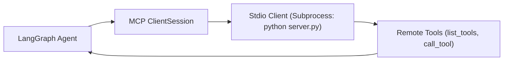

# 📹 How to build MCP Client using LangGraph

<div className="video-card" style={{border: '1px solid #30363d', borderRadius: '8px', padding: '16px', marginBottom: '24px', background: 'rgba(56, 139, 253, 0.05)'}}>
  <div style={{display: 'flex', gap: '16px', flexWrap: 'wrap'}}>
    <div><strong>Instructor:</strong> Nitish Singh (CampusX)</div>
    <div><strong>Duration:</strong> 2671</div>
    <div><strong>Course:</strong> Module 4: Agentic AI & LangGraph</div>
    <div><strong>Watch Link:</strong> <a href="https://www.youtube.com/watch?v=yZGjVA4uDc4" target="_blank" rel="noopener noreferrer">YouTube Lecture ↗</a></div>
  </div>
</div>

## 📌 Executive Summary

Building custom MCP clients allows developers to connect any AI framework (LangChain, LangGraph, custom agent loops) to the vast ecosystem of MCP servers. The official Python `mcp` SDK provides robust client primitives for subprocess launching, capability negotiation, and tool execution.

This lesson explores `stdio_client`, `ClientSession`, discovering tools via `list_tools()`, and converting MCP tools into native LangChain tools.

---

## 🏗️ System Architecture & Execution Flow



---

## 📖 Core Concepts & Technical Deep Dive

### 1. The ClientSession Abstraction
The `ClientSession` manages the JSON-RPC state machine, matching asynchronous request IDs to server responses and handling automatic ping keep-alives.

### 2. Converting MCP Tools to LangChain
By querying `session.list_tools()`, clients can dynamically convert MCP tool schemas into native LangChain `StructuredTool` objects, making them instantly usable inside LangGraph agents.

---

## 💻 Production Implementation

```python
import asyncio
from mcp import ClientSession, StdioServerParameters
from mcp.client.stdio import stdio_client

async def run_mcp_client():
    server_params = StdioServerParameters(
        command="python",
        args=["server.py"]
    )
    
    # Connect over stdio
    async with stdio_client(server_params) as (read, write):
        async with ClientSession(read, write) as session:
            await session.initialize()
            
            # Discover tools dynamically
            tools = await session.list_tools()
            print(f"Discovered {len(tools.tools)} MCP tools:")
            for t in tools.tools:
                print(f"- {t.name}: {t.description}")

print("MCP Client architecture blueprint loaded.")
```

---

## ⚙️ Production Gotchas & Best Practices

:::tip Async Context Managers
Always manage `stdio_client` and `ClientSession` using `async with` context managers. This guarantees child subprocesses and open pipes are closed cleanly even during exceptions.
:::

:::warning Handling Stdio Deadlocks
Never write directly to the child process's standard input stream; always route through the `ClientSession` to avoid buffer deadlocks.
:::

---

## 📊 Architectural Reference & Comparison

| Client Method | Purpose | Return Type |
| :--- | :--- | :--- |
| `session.initialize()` | Performs initial handshake | `InitializeResult` |
| `session.list_tools()` | Fetches tool catalog | `ListToolsResult` |
| `session.call_tool(name, args)` | Executes a tool | `CallToolResult` |
| `session.list_resources()`| Fetches readable resources | `ListResourcesResult` |

---

## 📚 Key Takeaways & Enterprise Checklist

- [ ] **Architecture Verification:** Ensure your design addresses latency, decoupled interfaces, and strict data validation contracts.
- [ ] **Deterministic Testing:** Run unit tests and golden dataset evaluations before shipping changes to staging or production.
- [ ] **Security & Observability:** Enforce input/output guardrails, scrub sensitive credentials/PII, and capture distributed traces.
- [ ] **Scalability & Sizing:** Calibrate model parameters, context limits, and compute instance requirements against projected request concurrency.
