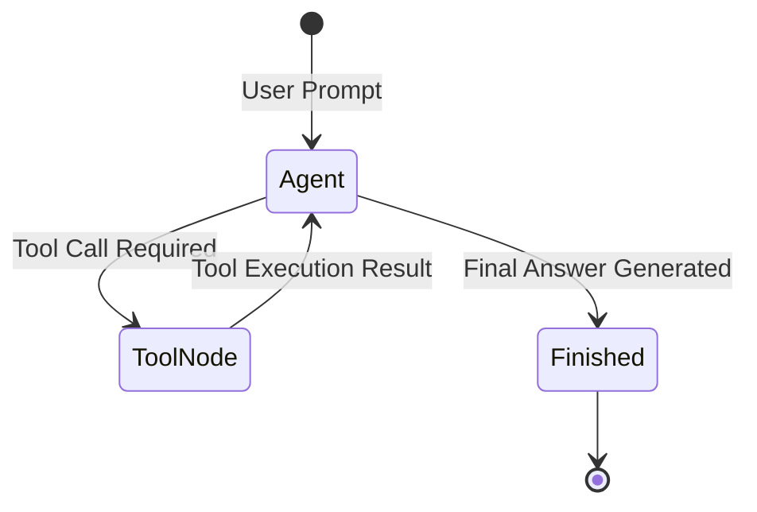

# 📹 How to build MCP Client using LangGraph ｜ Agentic AI using LangGraph

<div className="video-card" style={{border: '1px solid #30363d', borderRadius: '8px', padding: '16px', marginBottom: '24px', background: 'rgba(56, 139, 253, 0.05)'}}>
  <div style={{display: 'flex', gap: '16px', flexWrap: 'wrap'}}>
    <div><strong>Instructor:</strong> Nitish Singh (CampusX)</div>
    <div><strong>Duration:</strong> 44m 31s</div>
    <div><strong>Playlist:</strong> Agentic AI with LangGraph (CampusX)</div>
    <div><strong>Watch Link:</strong> <a href="https://www.youtube.com/watch?v=yZGjVA4uDc4" target="_blank" rel="noopener noreferrer">YouTube Lecture ↗</a></div>
  </div>
</div>

## 📌 Executive Summary & Learning Objectives

This lecture covers **How to build MCP Client using LangGraph ｜ Agentic AI using LangGraph**, focusing on production implementations, edge cases, and industry standards:
- Core intuition, architecture, and underlying mechanisms.
- Key differences between theoretical research implementations and scalable enterprise patterns.
- Concrete Python walkthroughs, error recovery, and performance optimization.

---

## 🏗️ Architecture & Conceptual Workflow



---

## 📖 Core Concepts & Technical Deep Dive

### 1. Architectural Foundations
In modern production AI engineering, **How to build MCP Client using LangGraph ｜ Agentic AI using LangGraph** is essential for ensuring reliability, low latency, and deterministic outcomes. As AI systems evolve from naive prompt-in / completion-out scripts into distributed systems, engineers must handle:
- **State management & consistency:** Ensuring intermediate states and tool invocations are tracked.
- **Error boundaries & recovery:** Graceful degradation when external LLMs or vector stores encounter rate limits or network partitions.
- **Resource utilization & cost efficiency:** Caching common queries and reducing unnecessary foundation model token expenditure.

### 2. Operational Considerations
- **Latency Optimization:** Pre-computing embeddings, utilizing asynchronous non-blocking event loops, and streaming tokens via Server-Sent Events (SSE).
- **Security & Sandboxing:** Validating inputs before ingestion, sanitizing LLM outputs, and isolating tool execution environments.

---

## 💻 Production Implementation Walkthrough

```python
from typing import TypedDict, Annotated, List
from langgraph.graph import StateGraph, END
import operator

# 1. Define State Schema
class AgentState(TypedDict):
    messages: Annotated[List[str], operator.add]
    next_step: str

# 2. Define Node Functions
def analyze_input(state: AgentState):
    print("Analyzing query...")
    return {"messages": ["Query analyzed."], "next_step": "generate"}

def generate_response(state: AgentState):
    print("Generating response...")
    return {"messages": ["Final response generated."], "next_step": "end"}

# 3. Build StateGraph
workflow = StateGraph(AgentState)
workflow.add_node("analyze", analyze_input)
workflow.add_node("generate", generate_response)

workflow.set_entry_point("analyze")
workflow.add_edge("analyze", "generate")
workflow.add_edge("generate", END)

app = workflow.compile()
output = app.invoke({"messages": ["Hello Agent"], "next_step": ""})
print(output)
```

---

## 💡 Production Best Practices & Tips

:::tip Production Deployment Guideline
When deploying How to build MCP Client using LangGraph ｜ Agentic AI using LangGraph in enterprise environments, always configure automated retries with exponential backoff and telemetry tracing (such as OpenTelemetry or LangSmith).
:::

:::warning Common Failure Modes
Watch out for state contamination across concurrent requests. Ensure each session or user interaction uses an isolated thread ID or execution context.
:::

---

## 🎯 Key Takeaways & Quick Reference

| Dimension | Production Standard | Pitfall to Avoid |
| :--- | :--- | :--- |
| **Execution** | Async / Non-blocking with timeouts | Synchronous blocking calls in event loops |
| **Data Validation** | Strict Pydantic v2 schemas | Untyped dictionary access |
| **Monitoring** | Distributed tracing & latency percentiles | Relying only on standard console logs |

## ⏱️ Lecture Timeline & Key Topics

| Timestamp | Key Topic / Concept Discussed |
| :--- | :--- |
| **00:00:00** | हाय गाइस, माय नेम इज नितेश एंड यू आर... |
| **00:10:20** | चेंजेस करने पड़ेंगे। और व्हाट इफ आपकी... |
| **00:21:57** | कोड लिख रहे हैं तो हम चैटबॉट डॉट इनवोक... |
| **00:33:12** | वी आर गेटिंग द आंसर। आई होप आपको ये चीज... |
| **00:44:29** | में। बाय।... |


---

---

## 📜 Complete Lecture Transcript (English)

> **Language:** English | **Source:** `19 - How to build MCP Client using LangGraph ｜ Agentic AI using LangGraph ｜ CampusX.hi.srt` | **Total Segments:** 23 | **Word Count:** ~7,824 words

<details>
<summary><b>Click to expand full chronological transcript (23 timestamped intervals)</b></summary>

#### ⏱️ [00:00 ➔ 00:02]

हाय गाइस, माय नेम इज नितेश एंड यू आर वेलकम टू माय YouTube चैनल। इस वीडियो में हम लोग अपना एजेंटिक एआई यूजिंग लैंडग्राफ प्लेलिस्ट कंटिन्यू करेंगे। वीडियो को शुरू करने के पहले मुझे आपको एक बार सॉरी बोलना है। बिकॉज़ इस प्लेलिस्ट को मैंने बहुत दिनों से पॉज कर रखा था। कोई नई वीडियोस यहां पर मैंने नहीं डाली थी। और उसकी वजह से क्या हो रहा था कि आपकी साइड से मुझे रेगुलरली मैसेजेस आ रहे थे कि सर आप प्लीज इस प्लेलिस्ट पे फोकस करो। इसे कंप्लीट करो। बट अनफॉर्चुनेटली उस टाइम पे मैं कुछ और वीडियोस, कुछ और चीजों में लगा हुआ था, जिसकी वजह से इस प्लेलिस्ट के ऊपर मैं काम नहीं कर पा रहा था। बट अच्छी बात ये है कि नाउ आई एम बैक और अब मेरा फोकस है सबसे पहले इस प्लेलिस्ट को कंप्लीट करने के ऊपर। ठीक है? तो आज हम लोग इस प्लेलिस्ट को रिज्यूम करने जा रहे हैं और वीडियो को स्टार्ट करने के पहले एक बार मैं आपको काइंड ऑफ एक रिकैप देना चाहूंगा कि अभी तक हमने इस प्लेलिस्ट में क्या-क्या कवर किया है। तो ये हमारा प्लेलिस्ट है। अभी तक इस प्लेलिस्ट में 18 वीडियोस आ चुके हैं। हमने शुरुआत की थी बाय डिस्कसिंग सब जनरल टॉपिक्स। लाइक एजेंटिक एआई क्या होता है? जनरेटिव एआई और एजेंटिक एआई में क्या डिफरेंस है? लैंग्रा ग्राफ और लैंग चेन में क्या डिफरेंस है? फिर हमने लंग ग्राफ के ऊपर फोकस शुरू कर फोकस करना शुरू किया। हमने डिस्कस किया कि लैंग्राफ के कोर कांसेप्ट्स क्या हैं? उसके बाद हमने लंग ग्राफ में अलग-अलग टाइप के वर्क फ्लोस बनाना सीखा। ठीक है? लाइक पैरेलल वर्क फ्लोस, सीक्वेंशियल वर्क फ्लोस, कंडीशनल वर्क फ्लोस, आइट्रेटिव वर्क फ्लोस। इतना करने के बाद फिर हमने एक छोटा सा प्रोजेक्ट लिया जहां पे हमने एक चार्टबॉट को उठाया और उस चार्टबॉट में हम कंटीन्यूअसली नए फीचर्स ऐड करते चले गए। ठीक है? तो सबसे पहले हमने एक बेसिक चैटबॉट बनाया यूजिंग लंग्राफ। फिर हमने उसमें यूआई ऐड किया। फिर हमने उसमें स्ट्रीमिंग का फीचर ऐड किया। फिर हमने उसमें रिज्यूम चैट का फीचर ऐड किया। फिर हमने उसमें डेटाबेस ऐड किया ताकि आप कभी बाद में आके अपना पुराना चैट देखना चाहो तो आप देख पाओ। उसके बाद हमने ऑब्ज़वेबिलिटी का फीचर ऐड किया विद द हेल्प ऑफ लैंसिथ। और लास्ट जो वीडियो हमने यहां पे कवर किया है वो है टूल्स के ऊपर। ठीक है? तो हमने अपने चैटबॉट को मल्टीपल टूल्स के साथ कनेक्ट किया था। ठीक है? इफ आई रिमेंबर करेक्टली हमने एक स्टॉक मार्केट टूल के साथ कनेक्ट किया था। हमने एक वेब

#### ⏱️ [00:02 ➔ 00:04]

सर्च टूल के साथ कनेक्ट किया था और हमने एक कैलकुलेटर टूल के साथ अपने चैटबॉट को कनेक्ट किया था। ठीक है? अब यहां से ही हम लोग अपना इस प्लेलिस्ट को रिज्यूम करेंगे। आज का जो टॉपिक है वीडियो का वो है एमसीपी मॉडल कॉन्टेक्स्ट प्रोटोकॉल जो कि अभी बहुत फेमस हो गया है पिछले 6 महीनों में। हम अपने चार्टबॉट में एमसीपी का फीचर ऐड करेंगे। ठीक है? एमसीपी की वजह से ही यह पूरा का पूरा डिले आया है। जो पिछले काफी टाइम में मैंने इस प्लेलिस्ट को अपडेट नहीं किया। उसके पीछे एक बड़ा रीजन यह भी था कि मैं अपने चैनल पे एमसीपी का एक प्लेलिस्ट स्टार्ट करके उसको कंप्लीट करने में लगा हुआ था। सो अगर आपको एमसीपी के बारे में आईडिया नहीं है इस पॉइंट पे तो मैं इनफैक्ट आपको यह सजेस्ट करूंगा कि करंट वीडियो यह वाला वीडियो देखने से पहले एक बार आप मेरा यह प्लेलिस्ट देख के आओ। जहां पर आठ वीडियोस में मैंने बहुत प्यार से एमसीपी के सारे कांसेप्ट समझाए हैं। अगर आप यह प्लेलिस्ट कंप्लीट करके आज का वीडियो देखोगे तो आप बहुत ज्यादा समझ पाओगे। मैंने आज आपको जो भी पढ़ाया है। ठीक है? तो ये है हमारा स्टेटस अपडेट। अब एक काम करते हैं। स्टेप बाय स्टेप डिस्कस करते हैं कि हमारे चैटबॉट को एमसीपी की क्या जरूरत है? एमसीपी होता क्या है? और कैसे आप उसको लैंग ग्रा्राफ्ट में इंप्लीमेंट कर सकते हो? यही हमारे आज के वीडियो का एजेंडा है। तो गाइस सबसे पहले हम लोग वीडियो में फोकस करेंगे इस बात के ऊपर कि एमसीपी होता क्या है और इसकी क्या जरूरत है? अगर मैं आपको एकदम सिंपल शब्दों में समझाऊं तो आप ऐसे बोल सकते हो कि एमसीपी इज अ इंप्रूव्ड वर्जन ऑफ टूल्स। हमने अपने चैटबॉट में कुछ टूल्स ऐड किए। राइट? इन ऑर्डर टू मेक इट मोर कैपेबल। उससे हम अगर कुछ काम कराना चाहते हैं तो उसके लिए हमने टूल्स ऐड किए। बट व्हाट आई एम ट्राइंग टू से इज कि यह जो टूल्स वाला टेक्निक हमने यूज किया इसमें देयर इज़ अ इनहेरेंट फ्लॉ। एक बड़ी प्रॉब्लम है। और उसी प्रॉब्लम को सॉल्व करने के लिए एमसीपी आता है। तो एमसीपी खुद में कुछ कंप्लीटली

#### ⏱️ [00:04 ➔ 00:06]

नई चीज नहीं है। इट इज़ जस्ट अ बेटर वे टू इंटीग्रेट टूल्स विथ योर चैटबॉट और एलएलएम एप्लीकेशन। या फिर ऐसे बोल सकते हो कि एमसीपी इज अ स्टैंडर्डाइज्ड वे टू कनेक्ट टूल्स टू योर एलएलएम एप्लीकेशनेशंस। ठीक है? तो सबसे पहले मैं एक काम करता हूं। मैं आपको टूल्स की क्या प्रॉब्लम होती है वो समझाता हूं और फिर मैं आपको बताऊंगा कि कैसे एमसीपी इस प्रॉब्लम को सॉल्व करता है। तो एक एग्जांपल लेके बात करेंगे। सो मान लो अभी हमने ये जो चैटबॉट बनाया है इसमें फिलहाल हमने तीन टूल्स का इस्तेमाल किया है। एक है सर्च टूल जो इंटरनेट सर्च करता है। एक है कैलकुलेटर टूल जिसकी हेल्प से वो मैथमेटिकल कैलकुलेशन करता है और तीसरा है गेट स्टॉक प्राइस टूल जिसकी हेल्प से आप किसी भी स्टॉक का करंट प्राइस निकाल सकते हो। अब मेरे मैनेजर ने मुझे आकर बोला कि हमें इस चैटबॉट को और कुछ फीचर्स देने हैं और हम स्पेसिफिकली चाहते हैं कि यह चैटबॉट गीब से कनेक्ट हो के GitHub रेपोजिटरीज के ऊपर क्वेश्चन आंसर करके दें। बिकॉज़ हम ये चैटबॉट अपनी कंपनी के डेवलपर्स के लिए बिल्ड कर रहे हैं। अब सोचो आप इस पूरी चीज को कैसे एग्जीक्यूट करोगे? आपको मैं एक बार कोड दिखाता हूं और फिर हम डिस्कशन करते हैं। सो अभी तक हमने कोई भी जो टूल इंटीग्रेट किया है या तो वो यूजर डिफाइन टूल होता है या तो वो लाइब्रेरी बेस्ड टूल होता है। जैसे कि ये डग डग गो सर्च रन एक लाइब्रेरी बेस्ड टूल है। ये हमें लैंगचेन के अंदर से मिल जाता है। तो हमें इसके लिए कोई कोड लिखने की जरूरत नहीं है। बट अगर कोई भी यूजर डिफाइंड टूल आपको इस्तेमाल करना है तो उसके लिए आपको खुद का कोड लिखना पड़ता है। जैसे कि यह देखो यह दोनों टूल्स यूजर डिफाइंड टूल्स हैं। ठीक है? तो अभी हमें क्या करना है? हमें गेटब से इंटीग्रेट करना है अपने चैटबॉट को और जितना मुझे पता है लंगचेन में कोई आपको कस्टम लंगचेन में कोई आपको बिल्ट इन टूल नहीं मिलेगा इसके लिए। तो आपको क्या करना पड़ेगा? आपको खुद का एक टूल क्रिएट करना पड़ेगा। तो अभी मैं आपको दिखाता हूं एक डमी टूल

#### ⏱️ [00:06 ➔ 00:08]

जो गटब से कनेक्ट करके आपको आपके गटब रिपोजिटरी में जितनी भी पुल रिक्वेस्ट है उसका लिस्ट ला के देगा। ठीक है? तो ये एक क्विक टूल मैंने बनाया है। आई डोंट नो ये काम करता है कि नहीं? ये बस पढ़ाने के लिए मैंने लिख के दिखाया है। सो इस टूल में फंडा क्या है? कि आपको ये सारा इनपुट चाहिए। ओनर कौन है रेपोजिटरी का? रेपोजिटरी का यूआरएल क्या है? आपको कौन सा पुल रिक्वेस्ट चाहिए? ओपन या क्लोज्ड और आप एक बार में कितने पुल रिक्वेस्ट शो करना चाहते हो यूजर को फिलहाल पांच। ठीक है? तो यहां पे आपको चेक क्या करना होगा? आपको अपने इस टूल में गेट का टोकन एक्सेस देना पड़ेगा ताकि यह कनेक्ट कर पाए गीटब के साथ। फिर आपको कुछ एडिशनल हेडर प्रोवाइड करना पड़ेगा। अ उसके अलावा इस यूआरएल पे आप हिट करोगे टू फाइंड आउट कि कितने पुल रिक्वेस्ट हैं आपकी करंट रेपोजिटरी में। वहां से आपको पलट के एक रिस्पांस आएगा। उस रिस्पांस को आप jसon का जो डेटा है उसको एक्सट्रैक्ट करोगे और फिर एक-एक करके सारा इंफॉर्मेशन प्रिंट करोगे। जैसे कि पुल रिक्वेस्ट का नंबर क्या है? टाइटल क्या है? हु इज द ऑथर स्टेट क्या है? यूआरएल क्या है? ये सारा इनेशन आप डिस्प्ले करोगे। तो ये सिर्फ एक सिंगल टूल है जिसकी हेल्प से आप एक सिंगल काम करवा पा रहे हो। गेट के ऊपर व्हिच इज़ टू पुल द इंफॉर्मेशनेशन ऑफ़ ऑल द पुल रिक्वेस्ट। ठीक है? अगर आपको कमिट्स देखने हैं तो उसके लिए अलग टूल बनाना पड़ेगा। नंबर ऑफ़ फाइल्स देखनी है तो उसके लिए अलग टूल बनाना पड़ेगा। यू गेट द आईडिया। दिस इज़ जस्ट अ सैंपल टूल जो मैं आपको दिखाना चाहता हूं कि आपको कुछ इस तरह का काम करना पड़ेगा इन ऑर्डर टू कनेक्ट टू GH। अब मैं आपको बताता हूं कि प्रॉब्लम क्या है इस अप्रोच में। प्रॉब्लम ये है कि ये जो अप्रोच है ये ब्रिटल है। ठीक है? ब्रिटल है इन द सेंस यह बहुत आसानी से टूट सकता है। यह पूरा का पूरा जो कोड है जो फिलहाल हो सकता है अच्छे से काम कर रहा हो। देयर इज़ नो गारंटी कि यह कल भी अच्छे से काम करेगा। क्यों मैं ऐसा बोल रहा हूं? समझना इस बात को। सो, फिलहाल हमने यह जो पूरा का पूरा सिस्टम डेवलप किया है, इसमें दो पार्ट्स हैं। एक है चैटबॉट

#### ⏱️ [00:08 ➔ 00:10]

और एक है अपना GitHub। ठीक है? अब ghub पे यह एक एपीआई बनी हुई है। api.github.com रेपोस पुल। यह एक एपीआई बनी हुई है। और हमने अपने चैटबॉट के पास एक टूल क्रिएट किया वि इज दिस एंटायर पीस ऑफ कोड जो इस एपीआई पे हिट करके पुल रिक्वेस्ट का डेटा लेकर के आ रहा है। ठीक है? अब सडनली से कुछ महीनों के बाद क्या हुआ? फिलहाल तो आपका चार्टबोर्ड सही से काम कर रहा है। GitHub से इनफेशन फैच करके ला रहा है। बट सडनली से 6 महीनों के बाद क्या हुआ? GitHub ने अपनी एपीआई को अपडेट कर दिया। अब उनका एपीआई 1.0 से एपीआई 2.0 में आ गया। और कई बार ऐसा होता है सॉफ्टवेयर में कि इस तरह के मेजर वर्जन चेंजेस में कोड में भी बहुत सारे चेंजेस आ सकते हैं। जैसे कि मान लो एक चेंज ये आया कि गिट वालों ने अपना ये जो यूआरएल था इसको बदल करके पुल से पुल रिक्वेस्ट कर दिया। ठीक है? या फिर वो लोग यहां पे जो टाइटल भेजते थे उसके बदले टाइटल अंडरस्कोर नेम भेजने लग गए। यहां पे जो यूजर भेजते थे उसके बदले यूजर अंडरस्कोर नेम भेजने लग गए। यू गेट द आईडिया कि यहां पे एपीआई वाली साइड में कुछ चेंजेस हो गए। अब जैसे ही चेंजेस हुए उसी टाइम से हमारा ये चैट बॉट एरर देना शुरू कर देगा। जैसे ही कोई गेटब से पुल रिक्वेस्ट मांगेगा यह वाला कोड फट जाएगा। बिकॉज़ यहां पे पुराना यूआरएल दिया हुआ है। या फिर यहां पे यह पुराने एट्रिब्यूट्स दिए हुए हैं। अब आपको क्या करना पड़ेगा? एज अ कोडर ऑफ दिस प्रोजेक्ट। आपको जाकर के सबसे पहले इस पूरे कोड को अपडेट करना पड़ेगा। फर्स्ट यू विल गो टू गेट का वेबसाइट। उनका डॉक्यूमेंटेशन देखोगे कि उन्होंने वर्जन 2.0 में क्या चेंजेस किए हैं। वो स्टडी करके आप यहां पे आके देखोगे कि अच्छा मैंने यहां पे पुल्स लिखा हुआ था। अब यहां पे पुल रिक्वेस्ट करना पड़ेगा। मैंने यहां पे टाइटल लिखा था। मुझे टाइटल नेम करना पड़ेगा। तो यू विल हैव टू मेक दिस चेंजेस।

#### ⏱️ [00:10 ➔ 00:12]

अब आप बोलोगे ठीक है ये कौन सी बड़ी बात है? 6 महीने में एक बार अगर ऐसा करना भी पड़े तो ये कोई बड़ी बात तो नहीं है। एक्चुअली बड़ी बात है। दिस इज जस्ट वन टूल। गिट जैसी एक सर्विस के साथ कनेक्ट करने के लिए हो सकता है आपको 10 इस तरह के टूल्स लिखने पड़े। और अगर एक सिंगल एपीआई चेंज हुआ तो आपको 10ों जगहों पे जाके चेंजेस करने पड़ेंगे। और व्हाट इफ आपकी कंपनी में यह सिर्फ एक चैटबॉट ना हो के पांच अलग-अलग चैटबॉट्स हो अलग-अलग डिवीज़ंस के लिए। हो सकता है ना? तो फिर आपको पांच अलग-अलग जगहों पर जाके ये चेंजेस करने पड़ेंगे। और ये बाय द वे सिर्फ गिटब है। व्हाट इफ आपकी कंपनी ने आपको बोला कि आप Gmail से भी इंटीग्रेट कर दो। आप स्लैक से भी इंटीग्रेट कर दो। आप zरा से भी इंटीग्रेट कर दो। तो हर चैटबॉट के पास अगर n टूल्स हैं और आपके पास अगर m चैटबॉट्स हैं तो नाउ दिस इज़ अ n क्रॉस m मेंटेनेंस प्रॉब्लम। तो आप बेसिकली क्या करोगे? आप पूरे टाइम इन चैटबॉट्स को मेंटेन करने का ही कोड लिखते रहोगे। तो यू कैन सी द हेडेक। द प्रॉब्लम इज कि यहां पे जो चेंजेस हो रहे हैं वो आपके चार्टबॉट वाली साइट को भी अफेक्ट कर रहे हैं। यहां में जो यहां पे जो कोड में चेंजेस हो रहे हैं वो आपके क्लाइंट साइड को भी अफेक्ट कर रहे हैं। ऐसा नहीं होना चाहिए। एंड दिस इज़ द बिगेस्ट प्रॉब्लम विद टूल्स वाला अप्रोच। और इसी प्रॉब्लम को एमसीपी सॉल्व करता है। अब एमसीपी में आप क्या करते हो कि आप यह जो दोनों पार्टीज हैं आप चार्टबॉट वाली साइड को क्लाइंट बुला सकते हो और ये जो टूल वाली साइड है इसको आप सर्वर बुला सकते हो। तो एमसीपी में आप इन दोनों के बीच में एक प्रॉपर सेपरेशन ऑफ कंसर्न रखते हो। आप सिंपली यह बात बोलते हो कि जो भी टूल वाला कोड है, टूल से रिलेटेड जो भी कोड है, वो सर्वर वाली साइड रहेगा और क्लाइंट वाली साइड सिर्फ एक कॉन्फिग कोड रहेगा। सो इवन इफ सर्वर पे आप कुछ भी चेंजेस कर

#### ⏱️ [00:12 ➔ 00:14]

रहे हो, अपने एपीआई को अपडेट कर रहे हो, आपका कॉन्फिग वाला कोड शुड नॉट चेंज। व्हिच मींस कि GitHub अपने एपीआई चेंज कर ले। उसमें कोड में चेंजेस ले आए। बट एक बार अगर अपने आपने अपने चैटबॉट को कनेक्ट कर रखा है विद द हेल्प ऑफ दिस कॉन्फिग कोड टू गेट हब तो फिर वो वर्जन चेंजेस से यहां पे आपको कुछ भी चेंजेस करने की जरूरत नहीं पड़ेगी। सो सारा का सारा जो हैवी लिफ्टिंग है कोडिंग में वो सर्वर वाली साइड होता है। क्लाइंट वाली साइड आपकी रिस्पांसिबिलिटी होती है कि जस्ट आपको उस सर्वर एमसीपी सर्वर से कनेक्ट करना है। ठीक है? सो बेसिकली व्हाट आई एम ट्राइंग टू से इज़ कि इन कोड रादर दन आपको इतना बड़ा कोड लिखने के ये जो आपने पूरा का पूरा बड़ा सा कोड लिखा है इतना बड़ा कोड लिखने के आपको सिंपली कुछ इस तरह का कोड लिखना पड़ता है। यह एक कॉन्फिग रिलेटेड कोड है जिसकी हेल्प से आप अपने गेट एमसीपी सर्वर से कनेक्ट कर जाओगे। एंड दैट्स इट। बस इतने कोड की हेल्प से ऑटोमेटिकली आपके पास पूरा इंफॉर्मेशन आ जाएगा कि GitHub के पास कौन-कौन से टूल्स हैं और उन टूल्स का डेफिनेशन क्या है? वो टूल्स करते क्या हैं और उनको कब यूज़ करना चाहिए। और फिर कल को अगर कुछ चेंजेस हो भी गए सर्वर वाली साइड इस कोड में आपको कोई चेंजेस नहीं करने। तो क्लाइंट एकदम आराम से बैठ सकता है। ठीक है? तो ये जो मेंटेनेंस प्रॉब्लम हो गई थी इतनी बड़ी इसको सॉल्व करता है एमसीपी। एंड दिस इज़ द बिगेस्ट सेलिंग पॉइंट ऑफ़ एमसीपी। बाकी मैंने आपको बहुत सरफेस लेवल पर समझाया है। ऑनेस्टली इट्स अ डेंस कांसेप्ट एंड आई वुड रिकमेंड अगर आप थोड़ा डीपली एक्सप्लोर करना चाहते हो तो आप मेरा ये एमसीपी प्लेलिस्ट देखो। यहां पे मैंने बहुत डिटेल में आपको एमसीपी के बारे में सब कुछ समझाया है। प्रॉब्लम क्या होती है? उसको एमसीपी सॉल्व कैसे करता है? एमसीपी का लाइफ साइकिल क्या है? एमसीपी का आर्किटेक्चर क्या है? जो एकदम टेक्निकल टॉपिक्स हैं वो सब यहां पे कवर्ड हैं। तो अगर आप ये देखने के बाद आज का वीडियो

#### ⏱️ [00:14 ➔ 00:16]

देखोगे तो बहुत ज्यादा आप अच्छे से समझ पाओगे आज का वीडियो। अदरवाइज हो सकता है कि आपको थोड़े से आपकी अंडरस्टैंडिंग में गैप्स रह जाएं। ठीक है? तो नाउ दैट यू हैव अ बेसिक आईडिया कि कैसे एमसीपी इज सुपीरियर टू यूजिंग टूल्स। नाउ व्हाट वी विल डू इज़ कि हम लोग एक एमसीपी क्लाइंट बनाएंगे इन लैंग ग्राफ। और मैं आपको दिखाऊंगा कि कैसे इंस्टेड ऑफ यूजिंग टूल्स वी कैन हैव एमसीपी क्लाइंट्स जो कि सेम काम करके देते हैं। बस थोड़े ज्यादा आसान हैं। तो चलो अब स्टार्ट करते हैं कोडिंग वाला पार्ट। अब कोड करने के पहले मैं एक छोटा सा क्लेरिफिकेशन यहां पर आपको देना चाहूंगा कि एमसीपी का कोड लिखते टाइम आपको दो चीजें क्रिएट करनी पड़ती हैं। एक अपना एमसीपी सर्वर और दूसरा उस सर्वर से बात करने के लिए आपका एमसीपी क्लाइंट। आज का जो वीडियो है उसमें हम सिर्फ और सिर्फ एमसीपी क्लाइंट के ऊपर फोकस करेंगे। हम लंग ग्राफ में अपना खुद का एमसीपी क्लाइंट बनाएंगे जो हमारे एमसीपी सर्वर के साथ बात करेगा और काम करवाएगा। बट आज के वीडियो में हम एमसीपी सर्वर लिखना नहीं सीख रहे। ठीक है? क्योंकि फर्स्ट ऑफ़ ऑल लैंग्राफ्ट में आप एमसीपी के सर्वर्स नहीं बना सकते। इसके लिए देयर इज़ अ डेडिकेटेड लाइब्रेरी लाइकस्ट एमसीपी। ठीक है? तो अगर आपको सर्वर बनाना भी सीखना है तो उसके लिए आप मेरा एमसीपी प्लेलिस्ट देखो। वहां पे मैंने फास्ट एमसीपी की हेल्प से कैसे आप अलग-अलग टाइप के सर्वर्स बनाते हो वह सिखाया है। आज की वीडियो में मैं आपको सिंपली दिखा दूंगा कि हमारे पास एक बना बनाया एमसीपी सर्वर है और फिर उस एमसीपी सर्वर से कनेक्ट करने के लिए हम लंग ग्राफ में एक एमसीपी क्लाइंट का कोड लिखेंगे। दैट इज द पर्पस ऑफ़ टुडेज़ वीडियो। अब कोड करना स्टार्ट करने के पहले मैं आपको एक बार सेटअप दिखा देता हूं। सो हमारे पास यह पीस ऑफ कोड है जो हमने लास्ट वीडियो में लिखा था। यह कोड एक बहुत सिंपल

#### ⏱️ [00:16 ➔ 00:18]

लंग्राफ्ट चैटबॉट का है जिसके पास एक टूल का एक्सेस है। दैट इज कैलकुलेटर टूल और आप इसको चला करके या तो नॉर्मल चैटिंग कर सकते हो या फिर इससे कुछ कैलकुलेशन करवा सकते हो। जैसे फिलहाल हमने इससे क्वेश्चन पूछा है कि इसको इन दो नंबर्स के बीच में मॉड्यूलस ऑपरेशन परफॉर्म करना है और जो भी आंसर आए उसको एक क्रिकेट कमेंटेटर की तरह बताना है। सो ये देखो एंड दैट्स अ पिच ये है प्लेस मिसेस अ फ्यू और लास्ट में 12 आया आपका रिमेंडर। ठीक है? तो हम इस कोड से अपना पूरा का पूरा अ जो फ्लो है वो स्टार्ट करेंगे। पहले एक बार मैं आपको इस कोड का एक रिवीजन दे देता हूं। ये एग्जैक्ट कोड हमने लास्ट वीडियो में लिखा है। वैसे यहां पे वी हैव टेकन द इंपोर्ट्स। यहां पे हमारा लोडenी है। यहां पे हमारी ओपन एi की की है। उसको लोड करने के लिए हम इस मॉडल को यूज़ कर रहे हैं। यहां पे हमारे टूल का कोड है। उसके बाद हमने क्या किया? अपने एलएलएम में बाइंड टूल्स की हेल्प से उसको बता दिया कि हमारे पास कैलकुलेटर टूल है। नाउ वी हैव दिस एलएलएम। एलएलएम विद टूल्स। यहां पे हमारा लैंग्राफ का कोड शुरू होता है। यह हमारा स्टेट का क्लास स्टेट का क्लास है। ये हमारा दो दो न्स हैं इस पूरे चैटब में। एक हमारा चैट नोड है और दूसरा हमारा टूल नोड है जैसा हमने लास्ट वीडियो में किया था। ठीक है? उसके बाद यहां पे हम अपना ग्राफ का स्ट्रक्चर डिफाइन कर रहे हैं। सो हमने ये दो नोड्स ऐड कर दिए। और ये रहा हमारा ग्राफ का डेफिनेशन। ठीक है? सो स्टार्ट से चैट नोड पे जा रहे हैं। उसके बाद एक कंडीशनल एज है। अ चैट नोड और आपका टूल नोड के बीच में और लास्ट में हम ये कनेक्शन भी कर रहे हैं ताकि इनेशन वापस जाए। यू रिमेंबर दिस राइट? ये हमने एग्जैक्ट लास्ट वीडियो में बनाया था। और यहां पे हमारा कोड है उस चैटबॉट से बात करने का। ठीक है? तो अब हम क्या करने वाले हैं? ये जो टूल का कोड हमने लिखा था लास्ट वीडियो में। यहां पे

#### ⏱️ [00:18 ➔ 00:20]

इस टूल को हम रिप्लेस करेंगे विद अ एमसीपी क्लाइंट। ठीक है? सो ये जो कैलकुलेटर का टूल का कोड हमने यहां लिखा है, ये हम एक एमसीपी सर्वर में लिखेंगे और उस सर्वर से कनेक्ट करेंगे विद द हेल्प ऑफ द एमसीपी क्लाइंट दैट वी आर गोइंग टू राइट हियर। ठीक है? और मैं आपको ये दिखाऊंगा कि अगर आप कल को अपने कैलकुलेटर वाले टूल में एज एन एमसीपी सर्वर में कोई चेंजेस करोगे। आपको यहां पे क्लाइंट साइड में कोई चेंजेस करने की जरूरत नहीं पड़ेगी। ठीक है? तो आई होप आपको फंडा समझ में आ गया। अब मैं आपको प्लान ऑफ़ एक्शन बताता हूं। हम डायरेक्टली एमसीपी क्लाइंट का कोड नहीं लिखेंगे। उसके पहले हमें एक छोटा सा बीच का स्टेप फुलफिल करना है। और वो स्टेप क्या है कि हमारा ये जो कोड है पूरा का पूरा ये कोड एक्चुअली सिंक्रोनस कोड है। ठीक है? आप देख ही सकते हो यहां पे कहीं भी असिंक वेट हमने यूज़ नहीं किया है। हम सबसे पहले क्या करेंगे? इस सिंक्रोनस कोड को असिंक्रोनस कोड में कन्वर्ट करेंगे। लैंग्राफ्ट सपोर्ट्स असिंक्रोनस एग्जीक्यूशन। तो हम सबसे पहले इस सिंक्रोनस कोड को असिंक में कन्वर्ट करेंगे। अब आई नो आपके दिमाग में क्वेश्चन आ रहा होगा कि एमसीपी पढ़ने के चक्कर में असिंक कहां से बीच में आ गया? सो द फंडा इज़ वेरी सिंपल कि हम जो लाइब्रेरी यूज़ करेंगे एमसीपी क्लाइंट बनाने के लिए वो लाइब्रेरी सिर्फ असिंक मोड में ही काम करता है। तो मैं आपको डायरेक्टली झटका नहीं देना चाहता। पहले इसीलिए मैं आपको दिखाऊंगा कि कैसे आप इस कोड को असिंक में कन्वर्ट करोगे और फिर उस असिंक कोड को यूज़ करोगे टू राइट एमसीपी क्लाइंट वाला कोड। बेसिकली हमने स्टेप बाय स्टेप पूरा चीज करके दिखाना है। ठीक है? तो अभी हमारा नेक्स्ट गोल है कि इस टूल को रखते हुए हम अपने इस कोड को असिंक्रोनस कोड में कन्वर्ट करेंगे। तो चलो गाइस लेट्स राइट द असिंक्रोनस वर्जन ऑफ आवर चैटबॉट कोड। ठीक है? तो मैं यहां पे जो कोड है उसको कॉपी पेस्ट करता जाऊंगा। मैंने एक नई फाइल बना ली है चैटबॉट अंडरस्कोर अ सिंक बोल के। सो

#### ⏱️ [00:20 ➔ 00:22]

यहां का कोड मैं यहां पे पेस्ट करता जाऊंगा और जहां पे भी मुझे असिंक्रोनस वाले चेंजेस करने होंगे वो मैं आपके सामने करता जाऊंगा। ठीक है? तो सबसे पहले हमें ये सारी चीजें तो चाहिए ही पड़ेंगी। इनको मैं यहां पे पेस्ट कर लेता हूं। साथ ही साथ मुझे असिंकाओ लाइब्रेरी भी चाहिए। ठीक है? अ उसके बाद आगे का जो कोड है इनफैक्ट ये जो पूरा कोड है जहां पर हमने एलएलएम क्रिएट किया है टूल का कोड लिखा है और बाइंड किया है ये सारा कोड भी एज इट इज़ हमें चाहिए पड़ेगा ठीक है यहां पे हमने कोई चेंजेस नहीं किए उसके बाद व्हाट वी विल डू इज़ हम लोग अपने लैंडग्राफ का कोड लिखेंगे। सो सबसे पहले हमें ये स्टेट चाहिए। तो ये स्टेट का भी जो डेफिनेशन है यह हम एज इट इज यहां पर रख देंगे। उसके बाद आगे का काम जो है वो इंटरेस्टिंग है। सो व्हाट वी विल डू इज कि ग्राफ को बिल्ड करने का जो पूरा कोड है वो मैं एक फंक्शन को डेलीगेट कर दूंगा। सो आई विल कॉल दिस फंक्शन अ बिल्ड ग्राफ और ये पलट के हमें हमारा चार्टबॉट ग्राफ रिटर्न करेगा। चार्ट बॉट फिलहाल डिफाइंड नहीं है। हम कर लेंगे डिफाइन। ठीक है? उसके बाद हमारे पास एक मेन फंक्शन होगा और यह मेन फंक्शन असिंक्रोनस होगा। और इस मेन फंक्शन में सबसे पहले हमें हमारा चार्ट बॉट चाहिए होगा जो हमें बिल्ड ग्राफ से मिलेगा। और इसके आगे एक बार जैसे ही हमारा चार्ट बॉट हमें मिल जाएगा तो हम यह जो आगे का कोड है इसको एज इट इज़ लिख देंगे लाइक दिस। ठीक है? यहां पे बस एक चेंज हमें करना पड़ेगा कि हम सिंस असिंक्रोनस कोड लिख रहे हैं तो हम चैटबॉट डॉट इनवोक ना लिख करके ए इनवोक लिखेंगे। असिंक्रोनस

#### ⏱️ [00:22 ➔ 00:24]

इनवोक और यह सारा काम अवेट कंस्ट्रक्ट के अंदर होगा। ठीक है? और लास्ट में हम यहां पर लिखेंगे इफ नेम इज इक्वल टू इक्वल टू मेन देन असिंक आईo डॉट रन द मेन फंक्शन। ठीक है? इतना हमने कर लिया। अब एक काम करते हैं। यह ग्राफ बिल्ड करने का जो कोड है, वो भी हम लोग जल्दी से कॉपी पेस्ट कर लेते हैं। सो, ग्राफ बिल्ड करने का कोड इतना है यहां पे जहां पे हम ये दो न्स बना रहे हैं और ये जो हम कनेक्शंस ड्रॉ कर रहे हैं और जो कंपाइल कर रहे हैं। ये सारा कोड आपको यहां पे डालना है। ठीक है? अब यहां पे भी हमें कुछ चेंजेस करने पड़ेंगे। सबसे पहले हमें क्या करना पड़ेगा कि हमें इसको भी शिफ्ट करना पड़ेगा। हां देखो अब सबसे पहले आपको क्या करना पड़ता है? लैंग्राफ कोड को अगर आपको असिंक्रोनस बनाना है तो आपको उसके नड्स के एग्जीक्यूशन को असिंक्रोनस बनाना पड़ता है। तो आप क्या करोगे? ये जो आपने चार्ट नोड बना रखा है इसको आप एक असिंक्रोनस फंक्शन में कन्वर्ट कर दोगे। ठीक है? और यहां पे अंदर आप जो एलएलएम की हेल्प से इनवोक कर रहे हो आप वहां पे असिंक्रोनस इनवोक करोगे और ये अवेट आ जाएगा। ठीक है? तो ये बना दिया हमने इस नोड को अ असिंक्रोनस ये वाला कोड यहां पे आना चाहिए। और इसके अलावा लेट मी क्विकली स्कैन थ्रू इफ देयर इज़ इफ देयर इज़ एनी चेंज दैट इज़ रिक्वायर्ड। अ सो यहां पे हमने असिंक्रोनस बना लिया। ये हमारा टूल हो गया। यहां पे हमने टूल बना

#### ⏱️ [00:24 ➔ 00:26]

के रिटर्न कर दिया। ठीक है? और वही हमें यहां पे चार्ट बॉट में मिल रहा है। हां, आई गेस इतना ही हमें करना है। आपके दिमाग में शायद ये क्वेश्चन आ रहा होगा कि अगर आपने इस नोड को असिंक्रोनस बनाया तो आपने इस नोड को असिंक्रोनस क्यों नहीं बनाया? बिकॉज़ ये टूल नोड इंटरनली खुद में असिंक्रोनस होता है। इसका इंप्लीमेंटेशन असिंक्रोनस ही है। आपको करने की जरूरत नहीं है। ठीक है? आपको सिर्फ अपने कस्टम नोट्स को असिंक्रोनस करना होता है। वो हमने कर दिया। सो या इन माय ओपिनियन दिस कोड इज़ रेडी। एक काम करते हैं। इसको चला के देखते हैं। अगर हमें हमारा आंसर मिल रहा है तो फिर ये कोड सही से काम कर रहा है। सो या इट इज़ वर्किंग फाइन। अ सो या वी आर डन विद द फर्स्ट स्टेप ऑफ आवर फ्लो। हमने अपने असिंक्रोनस टूल वाले कोड को आई एम सॉरी सिंक्रोनस टूल वाले कोड को असिंक्रोनस कोड में कन्वर्ट कर दिया। अह इस पॉइंट पे अगर आपको जरा भी आईडिया नहीं है कि असिंक्रोनस कोड क्या होता है तो मैं आपको एक क्विक आईडिया देता हूं। अह यहां पे हम असिंक्रोनस अह प्रोग्रामिंग कवर करने नहीं जाएंगे बिकॉज़ वो खुद में एक बहुत बड़ा टॉपिक है। सो बेसिक फंडा इज़ टू डू पैरेलल एग्जीक्यूशन। फॉर एग्जांपल आपके पास अ दो न्स हैं या फिर आपके पास मान लो दो टूल्स हैं। एक है वेदर फाइंड आउट करने के लिए और एक है क्रिकेट स्कोर फाइंड आउट करने के लिए। और आपने यह क्वेरी लिखा आपके यूजर ने कि फाइंड मी द वेदर ऑफ़ बेंगलुरु व्हेयर द मैच इज़ हैपनिंग एंड आल्सो टेल मी इज़ द टेल मी द करंट स्कोर ऑफ़ द मैच। तो यहां पे अगर आपने सीक्वेंशियल कोड लिख रखा होगा तो पहले क्या होगा? आपका जो लैंग्राफ कोड है वह जाके वेदर फाइंड आउट करेगा और बाकी पूरा कोड वेट करता रहेगा। जैसे ही वेदर का आंसर आपको मिलेगा फिर आप जाओगे आप क्रिकेट स्कोर फाइंड आउट करने। सीक्वेंशियली पूरी चीज हो रही है। बट अगर आपने असिंक्रोनस

#### ⏱️ [00:26 ➔ 00:28]

बना दिया अपने सारे नोट्स को और अपने टूल्स को तो होगा क्या कि आप पैरेलली चीजों को एग्जीक्यूट कर पाओगे। एक डायरेक्शन में आप जाके वेदर फाइंड आउट करोगे साथ में आप क्रिकेट स्कोर भी फाइंड आउट करने जाओगे। दोनों का आंसर आपको साथ में मिलेगा। बेसिकली स्पीड अप हो जाएगी पूरी चीज़। ठीक है? और कॉनकरेंसी वगैरह में भी इंप्रूवमेंट होता है। ये खुद में बहुत बड़ा फील्ड ऑफ़ स्टडी है। अ असिंक्रोनस प्रोग्रामिंग। फिलहाल हम उसको टच नहीं कर रहे हैं। आप बस ऐसे समझो कि ये हमें मजबूरी में करना पड़ रहा है। बिकॉज़ जो एमसीपी क्लाइंट हम यूज़ करने जा रहे हैं, जो लाइब्रेरी हम यूज़ करने जा रहे हैं, वो सिर्फ असिंक्रोनस कोड के साथ ही काम करती है। दैट इज़ व्हाई हमें मजबूरी में अपने सिंक्रोनस कोड को असिंक्रोनस कोड में कन्वर्ट करना पड़ा। ठीक है? एंड वो हमने कर लिया है। हमारा जो कोड है वो सही से काम कर रहा है। ठीक है? अब नेक्स्ट स्टेप क्या है? हम यहां पे इस टूल को रिमूव करेंगे। और इस टूल के बदले हम एक एमसीपी क्लाइंट लिखेंगे जो अ इस टूल के बदले एक एमसीपी सर्वर से कनेक्ट करेगा और वहां पे कैलकुलेशंस परफॉर्म करवाएगा। अब एमसीपी क्लाइंट का कोड लिखने के पहले एक बार मैं आपको दिखा देता हूं कि हमारा एमसीपी सर्वर दिखता कैसा है। सो यह रहा हमारे एमसीपी सर्वर का कोड। ठीक है? तो ये सर्वर फिलहाल मेरे ही मशीन पे रखा हुआ है। मेरे ही डेस्कटॉप पे रखा हुआ है। और इसको बनाया है मैंने विद द हेल्प ऑफ दिस लाइब्रेरी कॉल्डस्ट एमसीपी। ठीक है? और बहुत ही सिंपल एमसीपी सर्वर है। यहां पे हम क्या कर रहे हैं कि हमारे पास कुछ टूल्स हैं जो हमें मैथमेटिकल ऑपरेशंस परफॉर्म करके देते हैं। ठीक है? सो वी हैव वन टूल फॉर एडिशन, वन फॉर सब्ट्रैक्शन, मल्टीप्लिकेशन, डिवीज़, पावर एंड मॉड्यूलस। इतने ही टूल्स हमारे पास अवेलेबल हैं। और आप देखोगे ये सारे टूल्स कैन फंक्शन असिंक्रोनसली। तो ये हमारा सर्वर है। हमारे डेस्कटॉप पे एक फोल्डर के अंदर फिलहाल रखा हुआ है। और अब हम नेक्स्ट क्या करेंगे? इस सर्वर से कनेक्ट करने के लिए एक एमसीपी क्लाइंट का कोड लिखेंगे लनग्राफ में। और वहां पर आप देखोगे कि हम अपना जो टूल है उसको हटा

#### ⏱️ [00:28 ➔ 00:30]

देंगे और सिर्फ उस क्लाइंट के कोड से इस कैलकुलेटर एमसीपी सर्वर से कनेक्ट करके सारे कैलकुलेशंस परफॉर्म करवाएंगे। सो गाइज़ मैंने एक नई फाइल बना ली है चैटबॉट अंडरsर mcp डॉटpy और इसमें मैं क्या करूंगा? सबसे पहले यह जो पूरा कोड है असिंक्रोनस वाला इसको मैं कॉपी करके यहां पे पेस्ट कर दूंगा। एंड द फर्स्ट थिंग दैट आई विल डू इज सबसे पहले एक बार वार्डब ऑन कर लेते हैं। सबसे पहले मैं यह जो कैलकुलेटर वाला टूल है इसको हटा दूंगा। आई विल रिमूव दिस टूल। ठीक है? और नेक्स्ट व्हाट आई विल डू इज़ कि हमें एक लाइब्रेरी की जरूरत होती है एमसीपी क्लाइंट बनाने के लिए। उस लाइब्रेरी को मैं सबसे पहले इंपोर्ट करूंगा। इस लाइब्रेरी का नाम होता है फ्रॉम लैंगचेन एमसीपी अप्टर्स। यह लाइब्रेरी का नाम है डॉट क्लाइंट इंपोर्ट मल्टी सर्वर एमसीपी क्लाइंट। हम इस क्लास को यूज़ करेंगे। ठीक है? तो आपको सबसे पहले इस लाइब्रेरी को इंस्टॉल करना पड़ेगा। पिप इंस्टॉल लैंगचेन एमसीपी अप्टर्स। ये अगर आप यूवी यूज़ कर रहे हो तो UV ऐड लैंगचेन एमसीपी अप्टर्स। ये आपको करना पड़ेगा। ठीक है? उसके बाद अब आपको क्या करना है? है। सबसे पहले यू हैव टू राइट अ कोड जिससे आप अह अपने इस क्लाइंट को कनेक्ट करोगे अपने सर्वर के साथ। ठीक है? तो इसका कोड मैंने यहां पे लिख रखा है एक जगह पे। ये रहा वो कॉन्फिग कोड जिसकी मैं बात कर रहा था। सो हम क्या करेंगे? इस जगह पे जहां पे हमने एक बार अपना एलएलएम डिफाइन कर लिया। उसके ठीक नीचे हम अपना एमसीपी क्लाइंट डिफाइन करेंगे। ठीक है? तो वी आर मेकिंग एन इंस्टेंस ऑफ दिस क्लास। इसको हम क्लाइंट बुला रहे हैं और यहां पे हम अपना एक सिंगल सर्वर ऐड कर रहे हैं। बट इस मल्टी सर्वर एमसीपी क्लाइंट का फायदा क्या है कि आप एक से ज्यादा एमसीपी सर्वर्स को भी ऐड कर सकते हो। मैं आपको करके दिखाऊंगा। ठीक है? तो यहां पे देखो मैंने क्या लिखा है? मेरे एमसीपी सर्वर का नाम कौन से ट्रांसपोर्ट पे काम कर रहा है। तो हमारा जो

#### ⏱️ [00:30 ➔ 00:32]

ट्रांसपोर्ट है वो एसटीडीआईओ है। एसटीडीआईओ इसलिए है बिकॉज़ जो सर्वर है वो मेरी ही मशीन पे एग्ज़िस्ट करता है। तो दो तरह के एमसीपी सर्व होते हैं। लोकल एंड रिमोट। तो ये जो एमसीपी सर्वर है सिंस वो मेरी मशीन पे वो एक रिमोट सर्वर है आई एम सॉरी एक लोकल सर्वर है तो उसके लिए जो ट्रांसपोर्ट यूज़ होता है वो स्टैंडर्ड इनपुट आउटपुट होता है। ठीक है? उसके बाद आपको क्या करना है इस पर्टिकुलर फाइल से जो आपकी करंट फाइल है क्लाइंट वाली फाइल यहां से आपको उस एमसीपी सर्वर को रन करना है। तो उसका आप कमांड लिख रहे हो python और आपने उस फाइल का पाथ दे दिया। फाइल का पाथ क्या है? मेरे मशीन पे डेस्कटॉप में इस फोल्डर के अंदर फाइल का नाम है main डॉटpy। यू कैन सी दिस। ठीक है? एमसीपी मैथ सर्वर फाइल का नाम मेन डॉटpy। ठीक है? तो ये हमने प्रोवाइड कर दिया। अब बस हमें क्या करना है कि इस क्लाइंट की हेल्प से उस सर्वर पे जितने भी टूल्स अवेलेबल हैं उनका नाम फच करके लाना है। कैसे करूंगा मैं आपको दिखाता हूं। सो, हम ये जो कोड है, इसको कट कर लेंगे। यहां पे नहीं रखेंगे। और हम बिल्ड ग्राफ के अंदर जाएंगे। जहां पर हम अपना ग्राफ बिल्ड कर रहे हैं। और यहां पर हम यह कोड लिखेंगे। अवेट क्लाइंट जो हमने अभी ऊपर बनाया डॉट गेट टूल्स यह कोड क्या करेगा? ये कोड हमें अ ये फच करके ला के देगा उस सर्वर पे कितने टूल्स हैं। ऐड सब्ट्रैक्ट मल्टीप्लिकेशन और इसको हम टूल्स में ऐड कर देंगे। और यहां पर नीचे हम इसको हटा देंगे और हम जो भी टूल्स हमें मिले उन टूल्स के साथ एलएलएम को बाइंड कर देंगे। इनफैक्ट इस स्टेप पे आई कैन आल्सो शो यू कि कौन-कौन से टूल्स वहां से आ रहे हैं। ठीक है? अ यहां पे अब ये अवेट एरर शो कर रहा है बिकॉज़ हमें इस फंक्शन को असिंक बनाना पड़ेगा। ठीक है? कभी भी आप अवेट तभी कर सकते हो जब वो फंक्शन असिंक्रोनस हो। ठीक है? तो ये हो गया हमारा कोड। एंड दैट्स इट गाइस। आगे के कोड में हमें कोई चेंजज़ नहीं करने हैं बिकॉज़ आगे का कोड ऑलरेडी असिंक्रोनस है। ठीक है?

#### ⏱️ [00:32 ➔ 00:34]

तो, दैट्स इट। दिस इज़ हाउ यू क्रिएट अ एमसीपी क्लाइंट व्हिच कैन कम्यूनिकेट विथ अ एमसीपी सर्वर। ठीक है? अब हम क्या करेंगे? इस सेम प्र्पों्ट को दोबारा से रन करेंगे एंड वी विल सी कि क्या हमें आंसर मिल रहा है कि नहीं। सो, लेट्स रन दिस। अ ओके। सो द प्रॉब्लम इज कि हमने इसे इस फंक्शन को असिंक्रोनस बनाया है। तो हम जब यहां पे इस फंक्शन को कॉल कर रहे हैं तो ये अवेट के अंदर आना चाहिए। सेव नाउ रन। एंड यू कैन सी गाइस फर्स्ट ऑफ़ ऑल हमें टूल्स का लिस्ट मिल गया। कौन-कौन से टूल्स हैं हमारे पास? पहला टूल है ऐड। उसके बाद दूसरा टूल है। यह काफी कॉम्प्लेक्स आपको दिखाई दे रहा होगा। बट यह सारे टूल्स और उनका डेफिनेशन है। ऐड सब्ट्रैक्ट आपको दिख गया। यहां पे डिवाइड भी आपको दिख रहा होगा। तो सारे टूल्स का नाम आपको मिल गया। यहां पे देखो इंटरनली क्या हो रहा है? हमारा क्लाइंट हमारे सर्वर को स्टार्ट कर रहा है। तो वो स्टार्ट हो गया। और अब देखो यहां पे हमें हमारा आंसर भी मिल गया। ठीक है? यू कैन सी वी आर गेटिंग द आंसर। आई होप आपको ये चीज समझ में आ गई। ठीक है? तो हमने अभी जस्ट अपना पहला एमसीपी क्लाइंट बनाया विद द हेल्प ऑफ लंग ग्राफ एंड दिस लाइब्रेरी कॉल्ड लैंग चेन एमसीपी अप्टर्स। ठीक है? अब मैं यहां पे आपको एक और सर्वर एक और एमसीपी सर्वर ऐड करके दिखाता हूं। सो, मेरे पास एक और एमसीपी सर्वर है जो मैंने पास्ट में बनाया था। और यह सर्वर एक रिमोट एमसीपी सर्वर है। बिकॉज़ यह डिप्लॉयड है सर्वर के ऊपर। ठीक है? अ इस सर्वर का नाम है एक्सपेंस ट्रैकर। और इस सर्वर के अंदर देयर आर थ्री टूल्स अवेलेबल। एक है ऐड एक्सपेंस जहां पे आप अपना कोई एक्सपेंस ऐड कर सकते हो। सेकंड आप अपने पास एक्सपेंसेस को लोड कर सकते हो। थर्ड आप अपने एक्सपेंसेस को समराइज़ कर सकते हो कि इस

#### ⏱️ [00:34 ➔ 00:36]

महीने मैंने इन टोटल इस पर्टिकुलर कैटेगरी में कितना खर्चा किया। ठीक है? तो ये एक सर्वर मैंने बनाया है। अब मैं क्या करूंगा? इस सर्वर को भी कनेक्ट करूंगा अपने चैटबॉट के साथ विद द हेल्प ऑफ अ एमसीपी क्लाइंट। ठीक है? तो बहुत सिंपल है सारा काम। मैं आपको दिखाता हूं। आपको सिंपली क्या करना है? आपको अपने क्लाइंट के कोड में जाके यहां पे एक और क्लाइंट ऐड कर देना है। दैट्स इट। एंड दिस इज़ द कोड। यू हैव टू सिंपली डू दिस। लाइक दिस। सो यह मेरा एक एमसीपी सर्वर से कनेक्ट करने का कॉन्फिग कोड है। यह मेरा सेकंड एमसीपी सर्वर से कनेक्ट करने का कॉन्फिग कोड है। ठीक है? यहां पर बस आपको दो चीजें बतानी है। पहला यूआरएल ऑफ योर रिमोट एमसीपी सर्वर हमारे केस में दिस इज़ द यूआरएल जो आपको यहां पे दिखाई दे रहा है। दिस थिंग। ठीक है? सेकंड आपको बताना है ट्रांसपोर्ट। सिंस दिस इज़ अ रिमोट एमसीपी सर्वर। यहां पे जो आपका ट्रांसपोर्ट है वो स्ट्रीमेबल HTTP है। ठीक है? एंड दैट्स इट। इतना करने से अब आप इस पर्टिकुलर एमसीपी सर्वर से भी बात कर सकते हो। मैं आपको दिखाता हूं। सो व्हाट आई विल डू इज मैं यहां पर लिखूंगा एक प्र्प्ट ऐड एन एक्सपेंस 500 फॉर अ यूडेडमी कोर्स ऑन 10th नवंबर सेव रन। यह हमें हमारे सारे के सारे टूल्स का लिस्टिंग मिल गया। यू कैन सी एक हमारा टूल है समराइज बोल के। यह नया आ गया। एक और आ गया लिस्ट एक्सपेंसेस। और ऐसा ही एक और आ गया होगा ऐड एक्सपेंसेस। ठीक है? अब नीचे हमें ये देखो ये रहा रिस्पांस। एडेड योर एक्सपेंस। इस डेट पे इतना रुपए कैटेगरी उसने अपने आप डिड्यूस कर लिया और एक एडिशनल नोट ऐड कर दिया। अब देखो मैं यहां पर लिखता हूं गिव मी ऑल माय एक्सपेंसेस

#### ⏱️ [00:36 ➔ 00:38]

फॉर द मंथ ऑफ नवंबर फ्रॉम फर्स्ट नवंबर टू 30th नवंबर सेव लेट्स रन दिस यहां पे आ रहा है हियर आर योर एक्सपेंसेस फ्रॉम 1 नवंबर टू 30th नवंबर 10 तारीख को ₹500 यूएमी कोर्स पे आपने आपने खर्चा किया था। सो टोटल फॉर द पीरियड इज़ ₹500 एंड यू कैन सी कितनी आसानी से मैंने यहां पे अपने क्लाइंट वाली साइट पे अपने चैटबॉट वाली साइट पे कुछ भी कोड नहीं लिखा एक्सपेंस ट्रैकिंग का। यू कैन सी यहां पे एक्सपेंस ट्रैकिंग से रिलेटेड कोई भी कोड नहीं है। येट मेरा ये चैटबॉट एक्सपेंस ट्रैकिंग भी कर पा रहा है। राइट? तो अब आप बहुत आसानी से क्या कर सकते हो? जाके इंटरनेट पे सर्च कर सकते हो कि व्हाट आर सम इंटरेस्टिंग एंड यूज़फुल एमसीपी सर्वर्स और उनको इस तरीके से अपने चैटबॉट से कनेक्ट करते जा सकते हो। द बेस्ट पार्ट इज आपको कोई कोड लिखना ही नहीं है। और कल को अगर मान लो यहां पे एक्सपेंस ट्रैकर वालों ने अपना कोई कोड चेंज कर लिया या फिर कोई नया टूल ऐड कर दिया या कोई एकिस्टिंग टूल हटा दिया तो भी हमें यहां पे कुछ भी चेंज करने की जरूरत नहीं है। ये कॉन्फिग कोड एज़ इट इज़ काम करेगा। ये यूआरएल तो चेंज नहीं करेगा कोई। तो यूआरएल एज़ इट इज़ रहेगा। लोकल है तो फिर यूआरएल सेम रहेगा। तो यू डोंट हैव टू चेंज एनीथिंग। एंड दिस इज़ द बिगेस्ट बेनिफिट ऑफ यूजिंग एमसीपी इंस्टेड ऑफ़ यूजिंग टूल्स। अब अगर आपको यह सेम काम टूल्स की हेल्प से करना पड़ता तो आप यहां पे तीन नए फंक्शनंस बनाते एक्सपेंस ट्रैकिंग के। राइट? वो आपको करना ही नहीं पड़ा। आपने किसी और की मेहनत को इंटेलिजेंटली स्मार्टली यूज़ किया और आपका चैटबॉट हैज़ बिकम मोर एंड मोर पावरफुल। ठीक है? तो आई रियली होप ये जो डेमोंस्ट्रेशन है, ये आपको बता पा रहा है एमसीपी का पावर। ठीक है? इन कंपैरिजन टू यूजिंग टूल्स। एंड दैट इज़ व्हाई एमसीपी हैज़ बिकम सच एन इंडस्ट्री स्टैंडर्ड दैट आज की डेट में इवन चार्ट जीपीटी को भी उसको इंप्लीमेंट करना पड़ रहा है। ठीक है? तो अब एक लास्ट चीज मैं आपको और करके

#### ⏱️ [00:38 ➔ 00:40]

दिखाना चाहता हूं। हमारा जो वो एकिस्टिंग चार्टबॉट वाला प्रोजेक्ट चल रहा है वहां पे मैं ये एमसीपी वाली फंक्शनैलिटी को ऐड करना चाहता हूं इंस्टेड ऑफ़ टूल्स। इनफैक्ट एक इंटरेस्टिंग चीज ये है कि जरूरी नहीं है कि आप या तो टूल्स यूज़ करो या तो एमसीपी यूज़ करो। आप दोनों का मिक्सचर भी यूज़ कर सकते हो। ऐसा हो सकता है कि दो चीजों के लिए आपने टूल्स बना रखे हैं और फिर तीन-चार चीजों के लिए आपने एमसीपी यूज़ किया है। आप मिक्सचर में भी ऑपरेट कर सकते हो। देयर इज़ नो प्रॉब्लम इन दैट अप्रोच आल्सो। बट आई वुड रिकमेंड जितना हो सके आप एमसीपी की तरफ इंक्लाइन करो। बिकॉज़ यह ज्यादा फ्यूचर प्रूफ है और ज्यादा रोबस्ट है। सो गाइज़ कोड मैंने लिख दिया है। यह जो हमारा चैटबॉट इन लैंग्राफ फोल्डर है, इसमें मैंने दो नई फाइल्स बना दी हैं। एक है lang्राफ्ट एमसीपी बैक एंड और एक है स्ट्रीम फ्रंट एंड एमसीपी बोल के। एक बैक एंड की अलग फाइल और फ्रंट एंड की अलग फाइल। ठीक है? पहले एक बार मैं आपको दिखा देता हूं कि ये पूरी चीज काम कैसे कर रही है। फिर थोड़ा सा कोड में हम डिस्कस करेंगे कि क्या-क्या चेंजेस किए गए हैं। सो ये हमारा चैटबॉट है। अ यहां पे आप नॉर्मल चैटिंग तो कर ही सकते हो बट यहां पे आप अपने एमसीपी टूल्स और नॉर्मल टूल्स के साथ भी चैटिंग कर सकते हो। जैसे मेरे पास एक नॉर्मल टूल है जो स्टॉक प्राइस मुझे निकाल के देगा। सो आई कैन चैट टू इट। आई कैन से फाइंड द करंट स्टॉक प्राइस ऑफ़ Apple। तो देखो वो गेट स्टॉक प्राइस से निकाल के दे रहे हैं। सिमिलरली इफ आई वांट आई कैन टॉक टू माय एमसीपी सर्वर ऐड दिस नंबर विद दिस नंबर यूजिंग द टूल। तो बिहाइंड द सीन ऐड वाले को यूज़ करके वो रिजल्ट्स दे रहा है। आई कैन आल्सो फाइंड आउट अ एक्सपेंस ट्रैकिंग वाला जो भी मेरा पूरा टूल्स हैं उनको भी यूज़ करके आई कैन डू एक्सपेंस ट्रैकिंग। सो आई कैन फाइंड अ लिस्ट माय नवंबर एक्सपेंसेस। देखो लिस्ट एक्सपेंसेस को यूज़ कर रहा है। एंड इट सेज़ देयर आर करेंटली नो रिकॉर्डेड

#### ⏱️ [00:40 ➔ 00:42]

एक्सपेंसेस। आई डोंट नो ऐसा क्यों हुआ? अह मे बी शायद मैंने अह जो भी डेटाबेस था उसको डिलीट कर दिया था। एक काम करते हैं। लेट्स से ऐड एन एक्सपेंस 500 ऑन अ यूडेडमी कोर्स ऑन 10th नवंबर। एंड यू कैन सी इट सेस कि हो गया। लेट्स से लिस्ट ऑल एक्सपेंसेस ऑफ नवंबर नाउ इट से समराइज ठीक है ₹500 की एंट्री दिखा रहा है। ठीक है? तो यू कैन सी हमारा कोड हमारा चार्ट बॉट सही से काम कर रहा है। अब एक बार मैं आपको कोड दिखाता हूं। सो जो कोड है ना वो थोड़ा सा हैकी है। हैकी है मतलब थोड़ा जुगाड़ लगा करके ये पूरा कोड मैंने लिखा है। इसलिए मैं आपको लाइन बाय लाइन एक्सप्लेन नहीं करूंगा। मेन प्रॉब्लम ये हुई कि हमारे पास तीनचार कंपोनेंट्स हैं इस पूरे कोड में। कौन-कौन से कंपोनेंट्स हैं? लंग ग्राफ एक कंपोनेंट है, एमसीपी क्लाइंट एक कंपोनेंट है, स्ट्रीमलेट एक कंपोनेंट है और सीक्वलाइट एक कंपोनेंट है। सो देयर आर फोर मेन कंपोनेंट्स इन दिस चैट बॉट। अब प्रॉब्लम ये है कि इसमें से एमसीपी क्लाइंट जो है वो बोलता है कि मैं हमेशा असिंक्रोनस मोड में रन करूंगा। लैंडग्राफ इज़ कंफर्टेबल विद बोथ सिंक्रोनस एंड असिंक्रोनस। सीक्वलाइट फिलहाल सिंक्रोनस है बट जो स्ट्रीमलेट है वो फंडामेंटली एक सिंक्रोनस लाइब्रेरी है। तो उसको असिंक्रोनस बनाने में बहुत प्रॉब्लम्स मुझे फेस हुई। ये कोड लिखने में मुझे बहुत प्रॉब्लम्स फेस हुई। फिर मुझे अपने डेटाबेस को भी असिंक्रोनस बनाना पड़ा। ठीक है? तो अगर मैं आपको रफली पॉइंट बाय पॉइंट बताऊं कि मैंने क्या चेंजेस किए हैं तो चेंजेस ये हैं कि हमारा बैक एंड वाला जो कोड है उसमें अ यू कैन सी हम टूल्स भी यूज़ कर रहे हैं। एमसीपी क्लाइंट भी यूज़ कर रहे हैं। तो ये सर्च टूल अभी भी यूज़ हो रहा है। गेट स्टॉक प्राइस वाला टूल अभी भी यूज़

#### ⏱️ [00:42 ➔ 00:44]

हो रहा है। और इसके साथ हम दो क्लाइंट्स यूज़ कर रहे हैं। एक मैथ्स वाले के लिए एक एक्सपेंस ट्रैकिंग के लिए। ये कोड अ सारे के सारे टूल्स को फैच करके लाता है एमसीपी के। और यहां पे हम सारे टूल्स को मर्ज कर रहे हैं और एलएलएम को पास ऑन कर रहे हैं। आगे का कोड बहुत सिमिलर है। यह हमारा चैट नोड है जिसको हमने असिंक्रोनस बना लिया। और यहां पे एक अलग पीस ऑफ़ कोड आपको दिखाई देगा। ये कोड क्या है? कि हमने सीक्वलाइट को यूज़ ना करके एआई ओ सीक्वलाइट यूज़ किया है। व्हिच इज़ द असिंक्रोनस काउंटर पार्ट ऑफ़ सीक्वलाइट लाइब्रेरी। ठीक है? तो ये उसको लोड करने का कोड है। अह और उसके बाद यहां पे हमने ग्राफ पूरा बनाया है। और ये सारे हेल्पर्स हमने लिखे हैं। ठीक है? ठीक है? तो ये हो गया हमारा बैक एंड वाली साइड। फ्रंट एंड वाली साइड में एक ही मेजर चेंज है और वो ये है कि पहले जहां पर हम स्ट्रीम फंक्शन को यूज़ कर रहे थे। अब हम ए स्ट्रीम फंक्शन को यूज़ कर रहे हैं। असिंक्रोनस स्ट्रीम को। ठीक है? और इस पूरे के पूरे लूप को हमने असिंक्रोनसली चलाया है। सो ये जो फंक्शन है ये अब असिंक्रोनस हो गया है। बट अगेन अ मेरा सजेशन आपके लिए यह रहेगा कि अगर आपको एमसीपी क्लाइंट्स यूज़ करने हैं तो फ्रंट एंड के लिए आपको स्ट्रीमलेट यूज़ नहीं करना चाहिए। बिकॉज़ यह फंडामेंटली असिंक्रोनस नहीं है। इट्स सिंक्रोनस मोस्टली। तो अ बेटर अप्रोच वुड बी टू यूज फास्ट एपीआई टू एक्सपोज एपीआई और फिर आप एक रिएक्ट का फ्रंट एंड यूज़ करो या नेक्स्ट जेएस का फ्रंट एंड यूज़ करो जो कि खुद में एक कॉम्प्लेक्स चीज़ है। आई नो हम सभी को शायद रिएक्ट या नेक्स्ट JS नहीं आता होगा। तो फिलहाल आप ये हैकी कोड यूज़ कर सकते हो। मैं इसका लिंक आपको दे दूंगा डिस्क्रिप्शन में। आप इसको चला के देख लेना। बट अगेन इन अ प्रोडक्शन सेटअप ये चीज यूज़ नहीं होगी। बिकॉज़ दिस इज़ नॉट कंपैटिबल। ठीक है? तो वि दैट दिस वाज़ द वीडियो। मुझे आपको लैंडग्राफ में एमसीपी क्लाइंट्स कैसे बनाए जाते हैं वो सिखाना था और हमने वो सीख लिया। हमारे पास एक नई फंक्शनैलिटी आ गई

#### ⏱️ [00:44 ➔ 00:44]

हमारे चैट बॉट में दैट नाउ इट सपोर्ट्स एमसीपी एज़ वेल। अब ऐसे ही अब हम अपने नेक्स्ट वीडियो में एक और कैपेबिलिटी ऐड करेंगे व्हिच इज़ रैग कासेप्ट। ठीक है? तो हमारा जो चैटबॉट होगा वो हमारे इंटरनल डॉक्यूमेंट्स के ऊपर भी क्वेश्चन आंसरिंग करके हमें देगा। यह हम लोग नेक्स्ट वीडियो में देखेंगे। ठीक है? सो, आई होप आपको यह वीडियो पसंद आया। अगर आपको यह वीडियो पसंद आया तो प्लीज लाइक करना और अगर आपने इस चैनल को सब्सक्राइब नहीं किया है, प्लीज डू सब्सक्राइब। मिलते हैं नेक्स्ट वीडियो में। बाय।

</details>
