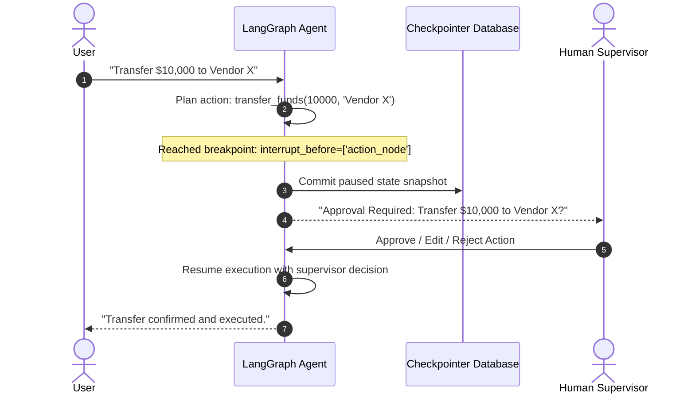

# 📹 Human in the loop (HITL) using LangGraph

<div className="video-card" style={{border: '1px solid #30363d', borderRadius: '8px', padding: '16px', marginBottom: '24px', background: 'rgba(56, 139, 253, 0.05)'}}>
  <div style={{display: 'flex', gap: '16px', flexWrap: 'wrap'}}>
    <div><strong>Instructor:</strong> Nitish Singh (CampusX)</div>
    <div><strong>Duration:</strong> 2404</div>
    <div><strong>Course:</strong> Module 4: Agentic AI & LangGraph</div>
    <div><strong>Watch Link:</strong> <a href="https://www.youtube.com/watch?v=xxqZzVZ4gE0" target="_blank" rel="noopener noreferrer">YouTube Lecture ↗</a></div>
  </div>
</div>

## 📌 Executive Summary

Human-in-the-Loop (HITL) enables human oversight of high-stakes AI actions. In enterprise systems, agents must never execute sensitive operations (transferring funds, executing raw shell commands, modifying production databases) autonomously. LangGraph supports native interrupts (`interrupt_before`, `interrupt_after`), pausing execution, presenting pending state for human review, and resuming with approval or edits.

This guide details configuring breakpoints, inspecting interrupted state snapshots, approving or rejecting actions, and resuming execution.

---

## 🏗️ System Architecture & Execution Flow



---

## 📖 Core Concepts & Technical Deep Dive

### 1. Native Breakpoints in LangGraph
During graph compilation, developers specify which nodes require human confirmation:
`app = builder.compile(checkpointer=checkpointer, interrupt_before=["action_node"])`
When execution reaches `"action_node"`, LangGraph commits the state snapshot and halts without executing the node.

### 2. State Modification via update_state()
A human supervisor can review the paused action and optionally modify it:
`app.update_state(config, {"tool_args": {"amount": 5000}})`
When resumed via `app.invoke(None, config)`, the graph continues execution using the modified state.

---

## 💻 Production Implementation

```python
from langgraph.checkpoint.memory import MemorySaver
from langgraph.graph import StateGraph, START, END
from typing import TypedDict

class TransferState(TypedDict):
    amount: float
    recipient: str
    status: str

def plan_transfer(state: TransferState):
    return {"status": "AWAITING_APPROVAL"}

def execute_transfer(state: TransferState):
    return {"status": f"SUCCESS: Transferred ${state['amount']} to {state['recipient']}"}

builder = StateGraph(TransferState)
builder.add_node("plan", plan_transfer)
builder.add_node("execute", execute_transfer)

builder.add_edge(START, "plan")
builder.add_edge("plan", "execute")
builder.add_edge("execute", END)

# Configure human-in-the-loop breakpoint before execution
cp = MemorySaver()
app = builder.compile(checkpointer=cp, interrupt_before=["execute"])

cfg = {"configurable": {"thread_id": "transfer-01"}}
app.invoke({"amount": 10000.0, "recipient": "Acme Corp", "status": ""}, config=cfg)

# Inspect paused state
paused_state = app.get_state(cfg)
print(f"Next Node to Execute: {paused_state.next}") # ('execute',)
print(f"Current State: {paused_state.values}")

# Human approves: Resume by passing None
resumed_output = app.invoke(None, config=cfg)
print(f"Final Execution Output: {resumed_output['status']}")
```

---

## ⚙️ Production Gotchas & Best Practices

:::tip Breakpoint Placement
Always place breakpoints `interrupt_before` the destructive execution node rather than inside tool definitions, keeping business logic clean.
:::

:::warning Resuming Interrupted Graphs
To resume an interrupted graph without modifying state, call `app.invoke(None, config=config)`. Passing a new dictionary will trigger state updates.
:::

---

## 📊 Architectural Reference & Comparison

| HITL Pattern | LangGraph Mechanism | Use Case |
| :--- | :--- | :--- |
| **Pre-Action Review** | `interrupt_before=["node"]` | Financial transfers, SQL DELETE, API mutations |
| **Post-Action Review**| `interrupt_after=["node"]` | Reviewing generated email drafts before sending |
| **State Editing** | `app.update_state()` | Correcting bad tool arguments before execution |

---

## 📚 Key Takeaways & Enterprise Checklist

- [ ] **Architecture Verification:** Ensure your design addresses latency, decoupled interfaces, and strict data validation contracts.
- [ ] **Deterministic Testing:** Run unit tests and golden dataset evaluations before shipping changes to staging or production.
- [ ] **Security & Observability:** Enforce input/output guardrails, scrub sensitive credentials/PII, and capture distributed traces.
- [ ] **Scalability & Sizing:** Calibrate model parameters, context limits, and compute instance requirements against projected request concurrency.
