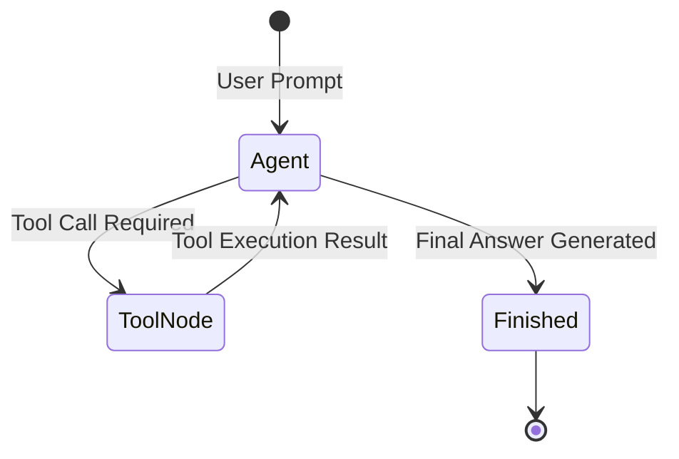

# 📹 Human in the loop (HITL) using LangGraph

<div className="video-card" style={{border: '1px solid #30363d', borderRadius: '8px', padding: '16px', marginBottom: '24px', background: 'rgba(56, 139, 253, 0.05)'}}>
  <div style={{display: 'flex', gap: '16px', flexWrap: 'wrap'}}>
    <div><strong>Instructor:</strong> Nitish Singh (CampusX)</div>
    <div><strong>Duration:</strong> 40m 4s</div>
    <div><strong>Playlist:</strong> Agentic AI with LangGraph (CampusX)</div>
    <div><strong>Watch Link:</strong> <a href="https://www.youtube.com/watch?v=xxqZzVZ4gE0" target="_blank" rel="noopener noreferrer">YouTube Lecture ↗</a></div>
  </div>
</div>

## 📌 Executive Summary & Learning Objectives

This lecture covers **Human in the loop (HITL) using LangGraph**, focusing on production implementations, edge cases, and industry standards:
- Core intuition, architecture, and underlying mechanisms.
- Key differences between theoretical research implementations and scalable enterprise patterns.
- Concrete Python walkthroughs, error recovery, and performance optimization.

---

## 🏗️ Architecture & Conceptual Workflow



---

## 📖 Core Concepts & Technical Deep Dive

### 1. Architectural Foundations
In modern production AI engineering, **Human in the loop (HITL) using LangGraph** is essential for ensuring reliability, low latency, and deterministic outcomes. As AI systems evolve from naive prompt-in / completion-out scripts into distributed systems, engineers must handle:
- **State management & consistency:** Ensuring intermediate states and tool invocations are tracked.
- **Error boundaries & recovery:** Graceful degradation when external LLMs or vector stores encounter rate limits or network partitions.
- **Resource utilization & cost efficiency:** Caching common queries and reducing unnecessary foundation model token expenditure.

### 2. Operational Considerations
- **Latency Optimization:** Pre-computing embeddings, utilizing asynchronous non-blocking event loops, and streaming tokens via Server-Sent Events (SSE).
- **Security & Sandboxing:** Validating inputs before ingestion, sanitizing LLM outputs, and isolating tool execution environments.

---

## 💻 Production Implementation Walkthrough

```python
from typing import TypedDict, Annotated, List
from langgraph.graph import StateGraph, END
import operator

# 1. Define State Schema
class AgentState(TypedDict):
    messages: Annotated[List[str], operator.add]
    next_step: str

# 2. Define Node Functions
def analyze_input(state: AgentState):
    print("Analyzing query...")
    return {"messages": ["Query analyzed."], "next_step": "generate"}

def generate_response(state: AgentState):
    print("Generating response...")
    return {"messages": ["Final response generated."], "next_step": "end"}

# 3. Build StateGraph
workflow = StateGraph(AgentState)
workflow.add_node("analyze", analyze_input)
workflow.add_node("generate", generate_response)

workflow.set_entry_point("analyze")
workflow.add_edge("analyze", "generate")
workflow.add_edge("generate", END)

app = workflow.compile()
output = app.invoke({"messages": ["Hello Agent"], "next_step": ""})
print(output)
```

---

## 💡 Production Best Practices & Tips

:::tip Production Deployment Guideline
When deploying Human in the loop (HITL) using LangGraph in enterprise environments, always configure automated retries with exponential backoff and telemetry tracing (such as OpenTelemetry or LangSmith).
:::

:::warning Common Failure Modes
Watch out for state contamination across concurrent requests. Ensure each session or user interaction uses an isolated thread ID or execution context.
:::

---

## 🎯 Key Takeaways & Quick Reference

| Dimension | Production Standard | Pitfall to Avoid |
| :--- | :--- | :--- |
| **Execution** | Async / Non-blocking with timeouts | Synchronous blocking calls in event loops |
| **Data Validation** | Strict Pydantic v2 schemas | Untyped dictionary access |
| **Monitoring** | Distributed tracing & latency percentiles | Relying only on standard console logs |

## ⏱️ Lecture Timeline & Key Topics

| Timestamp | Key Topic / Concept Discussed |
| :--- | :--- |
| **00:00:00** | हाय गाइस, माय नेम इज नितेश एंड यू वेलकम... |
| **00:09:54** | की हैं। 30 दिनों से जो फाइल्स मैंने यूज़... |
| **00:19:50** | गए। सेकंड हम इसी जगह पे जो हमारा स्टेट... |
| **00:30:10** | चलाते हैं। अ सो हम फिर से चला रहे हैं।... |
| **00:40:02** | में। बाय।... |


---

---

## 📜 Complete Lecture Transcript (Hindi / Hinglish)

> **Language:** Hindi / Hinglish | **Source:** `21 - Human in the loop (HITL) using LangGraph ｜ CampusX.hi.srt` | **Total Segments:** 21 | **Word Count:** ~6,998 words

<details>
<summary><b>Click to expand full chronological transcript (21 timestamped intervals)</b></summary>

#### ⏱️ [00:00 ➔ 00:02]

हाय गाइस, माय नेम इज नितेश एंड यू वेलकम टू माय YouTube चैनल। इस वीडियो में भी हम लोग अपना एजेंटिक एआई यूजिंग लैंग्राफ्ट प्लेलिस्ट कंटिन्यू करेंगे। और आज के वीडियो में हम एक बहुत इंपॉर्टेंट एंड इंटरेस्टिंग टॉपिक कवर करने जा रहे हैं जिसका नाम है एचआईटीएल। एचआईटीएल का फुल फॉर्म होता है ह्यूमन इन द लूप। ठीक है? और यह एक ऐसा टॉपिक है जो आपको आगे चलके जब आप कोई भी एजेंटिक एआई सिस्टम बनाओगे, वहां पे आपको बहुत हेल्प करेगा। बिकॉज़ इट इज़ अ वेरी कॉमन एज वेल एज इंपॉर्टेंट टॉपिक। ठीक है? तो आज का जो वीडियो है उसमें हम सबसे पहले थ्योरेटिकली डिस्कस करेंगे कि एचआईटीएल होता क्या है? एचआईटीएल की जरूरत क्यों पड़ती है एजेंटिक केआई सिस्टम्स को? उसके बाद हम लैंग ग्राफ के पर्सपेक्टिव से एचआईटीएल को समझेंगे। ठीक है? तो पहले मैं आपको एक थ्योरिटिकल इंट्रोडक्शन दूंगा कि लंग ग्राफ के अंदर एचआईटीएल कैसे इंप्लीमेंटेड है और फिर उसको हम प्रैक्टिकली देखेंगे विद द हेल्प ऑफ टू डिफरेंट कोड्स। ठीक है? एक थोड़ा बेसिक लेवल और फिर थोड़ा एक एडवांस लेवल। ओके? सो दैट्स द प्लान फॉर दिस वीडियो। तो चलो अपना डिस्कशन स्टार्ट करते हैं। सबसे पहले समझते हैं कि एचआईटीएल होता क्या है? ठीक है? तो अगर हम बात करें एजेंटिक एआई सिस्टम्स की तो एजेंटिक एआई सिस्टम्स को बनाया ही इसीलिए गया था बिकॉज़ हमें चाहिए थी ऑटोनोमी। ऑटोनोमी का मतलब हमारा कोई काम ऑटोमेटिकली हमारे किसी भी दखल अंदाजी के बिना हो जाए। राइट? जैसे मान लो कस्टमर सपोर्ट। अब SWGI Zomato जैसी कंपनीज़ को ऑन अ डेली बेसिस हजारों लाखों कस्टमर्स पंगे और उनके बहुत सारे जो रिक्वेस्ट होते होंगे वो बहुत रेपिटेटिव होते होंगे कि मेरा ऑर्डर नहीं पहुंचा या मेरे ऑर्डर में यह कमी है। तो इन इस तरह के रेपिटेटिव कामों को आप बहुत आसानी से हैंडल कर सकते हो विथ द हेल्प ऑफ एआई एजेंट्स। फिर आपको एक्चुअल लोगों को हायर करने की जरूरत नहीं पड़ती है। राइट? तो इस तरह के काम जहां पे आप

#### ⏱️ [00:02 ➔ 00:04]

थोड़ा सा रेपटेशन देख रहे हो वहां पे आप ह्यूमंस को रिप्लेस कर सकते हो विद द हेल्प ऑफ एआई एजेंट्स। राइट? तो ऑटोनोमी के लिए एजेंटिक सिस्टम्स को यूज किया जाता है। बट होता क्या है कि इन सर्टेन सिनेरियोस आप कंप्लीटली एजेंटिक एआई सिस्टम्स के ऊपर डिपेंड नहीं कर सकते। आप यूं समझो कि अभी हमारे जो एलएलएम्स हैं जो कि ब्रेन है इन एजेंटिक एआई सिस्टम्स के वो इतने भी डेवलप नहीं हुए हैं कि वो हर तरह का सिचुएशन खुद में हैंडल कर ले। तो इस तरह के सिचुएशनंस में क्या करना होता है कि आपको बीच में एक ह्यूमन को लाना पड़ता है और इस ह्यूमन के जजमेंट को आप यूज करते हो टू ड्राइव दिस एजेंटिक एआई सिस्टम। फॉर एग्जांपल आप ट्रैवल बुकिंग कर रहे हो। देयर इज़ अ चैटबॉट जो आपके लिए पूरा का पूरा सर्चिंग कर रहा है। आपने बोला मुझे दिल्ली से बॉम्बे की फ्लाइट दिखाओ। उसने दिखा दिया। आपने उससे पूछा कि इसमें से सुबह 6:00 से 9:00 बजे के बीच में सस्ती फ्लाइट्स निकाल के दिखाओ। उसने वो भी दिखा दिया। बट जैसे ही आपने बोला कि नाउ बुक द टिकट्स। तो यहां पर आप क्या चाहोगे कि पूरा का पूरा कंट्रोल एजेंटिक सिस्टम को ना दे के आप वापस वो कंट्रोल ह्यूमन को दो। आप ह्यूमन से पूछो कि देखो यह फ्लाइट मैंने डिसाइड की है, फाइनलाइज की है और इसके लिए मैं पेमेंट करना चाहता हूं। शुड आई गो अहेड? सो जब ह्यूमन उसको बोलेगा तभी वो आगे जाकर के टिकट बुक कराएगा। तो हम बेसिकली इस पूरे प्रोसेस में ह्यूमन का जजमेंट लेके आ रहे हैं बीच में बिकॉज़ वो इंपॉर्टेंट है क्योंकि इस पॉइंट पे वी कंप्लीटली डोंट ट्रस्ट द एलएलएम्स द ब्रेन बिहाइंड दिस सिस्टम्स। तो दैट इज़ द होल आईडिया बिहाइंड एचआईटीएल। यहां पर देखो मैंने लिखा भी है। सो एचआईटीएल इज अ डिज़ अप्रोच इन एआई सिस्टम्स वेयर अ ह्यूमन एक्टिवली पार्टिसिपेट्स एट क्रिटिकल पॉइंट्स ऑफ द एआई वर्क फ्लो इदर टू सुपरवाइज अप्रूव करेक्ट और गाइड द

#### ⏱️ [00:04 ➔ 00:06]

मॉडल्स आउटपुट। थिंक ऑफ एचआईटीएल एज़ पुटिंग अ ह्यूमन चेक पॉइंट इनसाइड एन एआई पाइपलाइन सो दैट इंपॉर्टेंट डिसीजंस आर नॉट मेड ऑटोनमसली बाई द मॉडल। दैट इज द होल आईडिया बिहाइंड एचआईडीएल एंड दैट इज व्हाई आप किसी भी तरह का एआई सिस्टम आज की डेट में बनाने जाओ देयर इज अ 99% चांस कि आपको उसके अंदर एचआईटीएल इंप्लीमेंट करना पड़ेगा। ठीक है? तो आई रियली होप मैं आपको सिंपल शब्दों में समझा पाया कि एचआईटीएल होता क्या है? अब एक बार और क्विकली डिस्कस करते हैं कि एचआईटीएल एग्जिस्ट क्यों करता है एजेंटिक सिस्टम्स में। सो एचआईटीएल के दो इंपॉर्टेंट बेनिफिट्स होते हैं। पहला बेनिफिट ये होता है कि एचआईटीएल किसी भी तरह के एजेंटिक सिस्टम्स को हेल्प करता है। जैसा मैंने बोला कि जो हमारे एलएलएम्स हैं आज की डेट में दे आर नॉट परफेक्ट। राइट? सो हो सकता है कि वो आपके यूजर जो हैं उसके गोल को मिसरप्रेट कर ले। या फिर हो सकता है कि यूजर का जो क्वेरी था उसमें किसी तरह का कुछ ए्बगुटी हो या फिर ऐसा हो सकता है कि आपका एलएलएम हेलसनेट कर रहा हो जिसकी वजह से जो आउटपुट है आपके एजेंट के एआई सिस्टम का वो गलत आ सकता है। मैं आपको एक सिंपल एग्जांपल देता हूं। मान लो यूजर ने बोला बुक फ्लाइट टिकट्स फॉर नेक्स्ट फ्राइडे। अब आज आपका मंडे है। अब इस क्वेरी में थोड़ी सी ए्बिग्विटी है। जहां पर आपका एलएलएम कंफ्यूज हो सकता है। अब नेक्स्ट फ्राइडे का मतलब यह भी हो सकता है कि आज मंडे है तो इस वीक जो फ्राइडे आ रहा है उसकी टिकट्स कराओ। या फिर इसका मतलब यह भी हो सकता है कि अगले वीक का जो फ्राइडे है उसकी टिकट्स कराओ। तो यहां पर आपका एलएलएम कंफ्यूज हो के गलती कर सकता है। तो यहां पर एचआईटीएल पिक्चर में आता है और आप यूजर से वापस पूछते हो कि सॉरी देयर इज़ दिस एम्बिग्विटी इन योर क्वेरी। आप इस वीक के फ्राइडे की बात कर रहे हो या नेक्स्ट वीक

#### ⏱️ [00:06 ➔ 00:08]

के फ्राइडे की बात कर रहे हो। तो इस तरह के जो रोड ब्लॉक्स हैं जहां पे कुछ मिस इंटरप्रिटेशन हो रहा है या फिर थोड़ी ए्बिग्विटी है या एलएलएम खुद हेलुसनेट कर रहा है वहां पे आप चांस नहीं लेते हो और ह्यूमन को पिक्चर में लाते हो और उसके जजमेंट का हेल्प लेते हो बिकॉज़ कम ऑन वी अंडरस्टैंड दैट कि ह्यूमंस आज की डेट में एटलीस्ट एलएलएम से ज्यादा बेटर हैं इस तरह के सिचुएशनंस को हैंडल करने में। तो दिस इज़ रीज़न नंबर वन व्हाई एचआईडीएल एक्सिस्ट। रीज़न नंबर टू और भी बड़ा है। और वो है अकाउंटेबिलिटी। सो एआई सिस्टम्स कितने भी पावरफुल हो जाए, कितने भी इंटेलिजेंट हो जाए, एक चीज एआई सिस्टम्स आपको नहीं दे सकते वो है अकाउंटेबिलिटी। अकाउंटेबिलिटी के लिए आपको कोई ह्यूमन चाहिए ही पड़ेगा। कुछ गड़बड़ हुई तो आप दोष एआई पे नहीं डाल सकते। उसका कुछ नहीं जा रहा है। तो आपको एक ह्यूमन को पिक्चर में लाना पड़ता है। फॉर एग्जांपल मैं Google हूं। मैंने Gmail के अंदर एक एआई सिस्टम को बिठा दिया जो मेल को देख करके एक रिप्लाई ईमेल जनरेट करता है और वापस भेज देता है। बट अगर मैं रिप्लाई जनरेट करने के बाद यूजर से पूछूं ना और डायरेक्टली मेल रिप्लाई कर दूं तो दिस इज़ नॉट अ गुड आईडिया। बिकॉज़ एज अ यूजर कोई मेरे को एज इन Google को क्वेश्चन कर सकता है कि यार तुमने क्या रिप्लाई भेज दिया? खुद से कुछ रिप्लाई तुमने जनरेट किया, खुद से भेज भी दिया और देखो यहां पे ये गड़बड़ हो गया। राइट? तो यहां पे Google क्या करेगा? वो समझता है इस बात को। तो वो बीच में एक यूजर को लेके आएगा। जैसे ही रिप्लाई जनरेट हुआ तो यूजर से पूछा जाएगा कि देखो इस ईमेल के लिए हमने ये रिप्लाई सोचा है। क्या हम इसे फॉरवर्ड कर दें? तो ह्यूमन अपना जजमेंट देगा कि हां यह ठीक लग रहा है या फिर इसमें यह चेंजेस करो और उसके बाद ही वो वो मेल वापस भेजा जाता है। यू गेट द आईडिया। वन मोर एग्जांपल इज़ पेमेंट करना। किसी भी तरह का पेमेंट करना। तो पेमेंट करने के पहले आप

#### ⏱️ [00:08 ➔ 00:10]

चाहोगे कि जिस यूजर के लिए आप पेमेंट कर रहे हो उससे कंफर्मेशन ले लो। बिकॉज़ हो सकता है कि कभी गलत अमाउंट फिल करके पेमेंट हो जाए एजेंट की साइड से। तो इस तरह के सिनेरियोस जहां पर फाइनेंशियल डिसीजन मेकिंग इनवॉल्वड है वहां पे बहुत ज्यादा यूजर एक्सपीरियंस खराब हो सकता है। हो सकता है कि आपका कस्टमर इतना खफा हो जाए कि वो बहुत लोगों को जाके आपके बारे में नेगेटिव फीडबैक दे दे। तो अगेन अकाउंटेबिलिटी ऐड करने के लिए आप एचआईटीएल को पिक्चर में लाते हो। तो कोई भी अगर आपसे पूछे कि एचआईटीएल क्यों एग्ज़िस्ट करता है एजेंटिक सिस्टम्स में? तो दो प्राइमरी पर्पस हैं। पहला एजेंटिक सिस्टम्स को हेल्प करने के लिए बिकॉज़ अभी वो परफेक्ट नहीं है। और सेकंड अकाउंटेबिलिटी को पिक्चर में लाने के लिए बिकॉज़ आप ह्यूमन को ब्लेम कर सकते हो। एआई सिस्टम्स को ब्लेम नहीं कर सकते। अब एक बार डिस्कस कर लेते हैं कि एचआईटीएल के होने से क्या-क्या फायदा मिलता है। सबसे पहला फायदा मिलता है कि किसी भी एजेंटिक एआई सिस्टम की जो एक्यूरेसी है वो इंप्रूव कर जाती है। ऑब्वियसली जहां पे भी आपका एलएलएम स्ट्रगल कर रहा है वहां पे वो ह्यूमन की हेल्प ले लेता है और ह्यूमन की जजमेंट से क्या होता है कि आपका एक्यूरेसी इंप्रूव कर जाता है। फॉर एग्जांपल आपने एक इनवॉइस अपलोड किया अपने चैट बॉट में और आपने बोला कि यह पेमेंट कर दो। अब ऐसा हो सकता है कि इमेज को स्कैन करने में उसने 12 को 12,000 रीड कर लिया और उसने पेमेंट कर दिया तो गड़बड़ हो सकती है। बट वही अगर बीच में एक बार ह्यूमन से कंफर्म कर ले कि देखो मैंने ₹1,000 एक्सट्रैक्ट किया है इनवॉइस से। इज इट करेक्ट? शुड आई पे? तो फिर आपका ह्यूमन पिक्चर में आके बोलेगा नहीं यार 120,000 तो हो ही नहीं सकता। इट शुड बी समवेयर अराउंड 1000? तो फिर वो वापस करेक्ट करके 1200 पे चला गया। तो जो गलती होने के चांसेस हैं उसको आप रिड्यूस कर रहे हो एचआईटीएल की हेल्प से। सेकंड सिस्टम में सेफ्टी आती है। फॉर एग्जांपल आपने एक चैटबॉट को बोला कि यार मेरे मशीन से पिछले 30 डेज जो मैंने फाइल्स यूज़ नहीं की हैं। 30 दिनों से जो फाइल्स मैंने यूज़ नहीं की हैं उनको डिलीट कर दो। अब वो क्या करेगा? डिलीट करने के पहले आपसे पूछ लेगा

#### ⏱️ [00:10 ➔ 00:12]

कि देखो मैं सारी फाइल्स डिलीट करने जा रहा हूं। बट इसमें से 10 फाइल्स ऐसी हैं जो आपके करंट प्रोजेक्ट के अंदर आती हैं। क्या मैं उनको भी डिलीट कर दूं? तो आप रियलाइज करोगे नहीं नहीं भले मैंने इन फाइल्स को 30 दिन के लिए यूज नहीं किया है बट स्टिल दे आरेंट फॉर द करंट प्रोजेक्ट। तो अगेन ह्यूमन के पिक्चर में आने से थोड़ी सेफ्टी बढ़ रही है। थर्ड इज़ एथिकल एलाइनमेंट। अ सो फॉर एग्जांपल आपका एक कस्टमर है। उसने आपके चैटबॉट के ऊपर या आपके कस्टमर एग्जीक्यूटिव को एक मैसेज किया गुस्से में कि यार मेरा ऑर्डर अभी तक नहीं आया। और आपके कस्टमर एग्जीक्यूटिव ने क्या किया? एलएलएम की हेल्प से एक रिप्लाई जनरेट किया। बट जो रिप्लाई था वह उतना इमोशनल नहीं था। वह उतना एमैथी शो नहीं कर रहा था। तो एजेंट जो आपका कस्टमर एग्जीक्यूटिव है वो झट से आपके एजेंट को बोल सकता है कि यार देखो तुमने जो भी रिप्लाई जनरेट किया वो है तो सही लॉजिकल है बट इसमें थोड़ा सा एमथी ऐड करो। तो उससे क्या होगा कि कस्टमर थोड़ा ठंडा होगा, शांत होगा। राइट? अब ये चीज हो सकता है एलएलएम को समझ में ना आए। तो आपकी कंपनी का जो एथिक पॉलिसी है या जो आपके कस्टमर वैल्यूस हैं, कोर वैल्यूस हैं उसके हिसाब से आप अलाइन कर सकते हो एजेंटिक सिस्टम्स को अगर आप ह्यूमन को बीच में लेके आ रहे हो तो यह भी एक फायदा मिलता है। एंड इन शॉर्ट अगर समराइज किया जाए तो आपके किसी भी एi ऐप में आप बेटर यूजर एक्सपीरियंस ऐड कर सकते हो विथ द हेल्प ऑफ एचआईटीएल। जितना आप ह्यूमन और एआई की सिनर्जी को यूज़ करोगे, आपका आउटपुट उतना अच्छा रहेगा। आपका यूजर एक्सपीरियंस उतना अच्छा रहेगा। तो एचआईटीएल यही लेके आता है पिक्चर में। एक लास्ट चीज और डिस्कस कर लेते हैं एचआईटीएल के बारे में कि व्हाट आर सम कॉमन वेज़ इन व्हिच एचआईटीएल इज़ इंटीग्रेटेड इंटू एआई एजेंटिक सिस्टम्स। ठीक है? सो, देयर आर थ्री फोर मेन कैटेगरीज़ जहां पे आपको एचआईटीएल देखने को मिलेगा। सबसे पहली कैटेगरी है एक्शन अप्रूवल पैटर्न। ये सबसे कॉमन है। कोई भी

#### ⏱️ [00:12 ➔ 00:14]

एजेंट एक एआई सिस्टम है जब वो कोई भी क्रूशियल डिसीजन मेकिंग कर रहा होता है या एक्शन ले रहा होता है तो वहां पे आप एचआईटीएल बीच में लेके आते हो। ह्यूमन को बीच में लेके आते हो। ठीक है? फॉर एग्जांपल आपका एजेंटिक एआई सिस्टम कोई पेमेंट करने जा रहा है या फिर कोई इंपॉर्टेंट ईमेल करने जा रहा है या फिर कोई इंपॉर्टेंट एक्शन परफॉर्म करने जा रहा है। जैसे कि डिलीटिंग फाइल्स फ्रॉम अ सर्वर। तो इस तरह की चीजों के बीच में आप क्या करते हो? एक ह्यूमन को ले आते हो। ह्यूमन से पूछते हो करना चाहिए या नहीं? हां बोलता है तो करते हो। ना बोलने पर आप रुक जाते हो। ठीक है? तो दिस इज़ द मोस्ट कॉमन एचआईटीएल पैटर्न जो आपको मोस्ट ऑफ द एजेंटिक एआई सिस्टम्स में देखने को मिलेगा। उसके बाद सेकंड जो थोड़ा कम कॉमन पैटर्न है वो है आउटपुट रिव्यू या एडिट पैटर्न। फॉर एग्जांपल आपने एक रिसर्च एजेंट बना रखा है जो आपके लिए ब्लॉग्स पब्लिश करता है। ठीक है? तो उसका दो काम है। पहले ब्लॉग के लिए रिसर्च करना। एक ड्राफ्ट जनरेट करना और फिर उसको पोस्ट करना। ठीक है? या फिर आपने एक सोशल मीडिया के लिए एक एजेंट बना रखा है जो आपके लिए रिसर्च करके लाता है कंटेंट और फिर उसको पोस्ट भी कर देता है। तो यहां पे आप जब रिसर्च करके ला रहे हो और एक ड्राफ्ट फॉर्म कर रहे हो तो वहां पे आप रिव्यू करवाते हो ह्यूमन से कि ये जो मैंने बनाया है क्या वो सही लग रहा है? अगर सही लग रहा है तो पोस्ट कर देते हो। अगर सही नहीं लग रहा है तो उसको रिफाइन करते हो। तो यह भी एक पैटर्न है जहां पे आपको एचआईटीएल देखने को मिलता है। इसके अलावा थर्ड इज़ ए्बिगुटी क्लेरिफिकेशन पैटर्न। ये भी काफी कॉमन है। बेसिकली कभी भी अगर आपके एजेंट को कंफ्यूजन हो रहा है तो वो ह्यूमन से पूछ लेता है। जैसा मैंने आपको थोड़ी देर पहले एग्जांपल दिया कि नेक्स्ट फ्राइडे की टिकट्स कराओ। अब इस हफ्ते का फ्राइडे या नेक्स्ट हफ्ते का फ्राइडे ये ए्बिग्विटी है। इसके लिए आपका जो एजेंट है वो ह्यूमन की हेल्प लेगा। एंड द लास्ट वन इज़ एस्केलेशन पैटर्न। सो एआई एजेंट अपना काम कर रहा है, कर रहा है, कर रहा है। बट किसी भी मोमेंट पर उसको लगेगा कि अब बात मेरे हाथ से निकल गई तो वह एस्केलेट कर देगा प्रॉब्लम को और वो ह्यूमन एजेंट के पास भेज देगा। सो, यह जनरली आपको कस्टमर

#### ⏱️ [00:14 ➔ 00:16]

सपोर्ट में बहुत देखने को मिलता है। SWGI जैसी कंपनीज़ हुई। काफी देर तक आप उनके चैटबॉट से बात करते हो। एंड में जब चैटबॉट को लगता है कि नहीं यह पर्टिकुलर केस मेरे से हैंडल नहीं हो रहा है। तो वो पूछ लेता है कि वुड यू लाइक टू टॉक टू अ ह्यूमन एग्जीक्यूटिव? सामने वाला बंदा बोलता है यस वो केस एस्केलेट हो जाता है। ठीक है? तो ये तीनचार सबसे कॉमन पैटर्न्स हैं जो आपको देखने को मिलेंगे एजेंटिक एआई सिस्टम्स में। ठीक है? तो नाउ दैट वी हैव अ क्लियर आईडिया ऑफ़ व्हाट एचआईटीएल इज़। उसकी क्या जरूरत है? किस तरह के पैटर्न्स आपको देखने को मिलते हैं। अब हम एक काम करेंगे। हम एचआईटीएल को लैंग ग्राफ के पर्सपेक्टिव से समझेंगे कि लैंग्राफ में एचआईटीएल किस तरीके से इंप्लीमेंटेड है। तो पहले मैं आपको थ्योरी विद एन एग्जांपल समझाऊंगा। फिर हम कोड में इस पूरी चीज को देखेंगे। तो गाइज़ अब हम समझेंगे कि एचआईटीएल का कांसेप्ट लैंग ग्राफ में कैसे इंप्लीमेंटेड है। और ये समझने के लिए मैं आपको एक छोटा सा एग्जांपल बताता हूं। सो मान लो अ हमने एक छोटा सा सोशल मीडिया मैनेजर एजेंट बना रखा है। यह करता क्या है कि यह किसी भी कंपनी के लिए Twitter या एक्स प्लेटफार्म जो है उसके लिए ट्वीट्स जनरेट करके देता है। नॉट ओनली ट्वीट्स जनरेट करके देता है बट उसको पोस्ट भी कर देता है। जैसे मान लो हमारी कंपनी है CPS X और हम चाहते हैं कि हमारा जो हमारी कंपनी जो है वह X पे भी ग्रो करे। तो हम क्या कर सकते हैं? हम इस एजेंट को यूज़ कर सकते हैं। यह एआई एजेंट काम कैसे करता है कि यहां पर एक वेबसाइट है। इस वेबसाइट पे जाके आप एक टॉपिक का नाम लिख दो। जैसे आपने लिख दिया JI आप जैसे ही सबमिट बटन पर क्लिक करोगे दो काम होंगे। फर्स्ट एक ट्वीट के ऊपर रिसर्च स्टार्ट हो जाएगा और उस ट्वीट का ड्राफ्ट रेडी हो जाएगा

#### ⏱️ [00:16 ➔ 00:18]

और सेकंड आप उस ट्वीट को पोस्ट कर सकते हो। आप नहीं कर सकते ये एजेंट खुद से पोस्ट कर देगा। तो इसके दो काम है। ट्वीट को जनरेट करना फिर उसको पोस्ट करना। ठीक है? अब यह सिस्टम काम कैसे कर रहा है? बिहाइंड द सीन्स। इसके दो इंपॉर्टेंट पार्ट्स हैं। फर्स्ट देयर इज़ दिस फ्रंट एंड सेकंड देयर इज़ दिस बैक एंड अब बैक एंड जो है वह आपने लैंड ग्राफ में बना रखा है। तो यह एक सिंपल वर्क फ्लो है जो चार स्टेप्स में कंप्लीट होता है। स्टार्ट रिसर्च फॉर द ट्वीट, पोस्ट द ट्वीट एंड। अब हम समझते हैं टेक्निकली एचआईटीएल इस पर्टिकुलर सिस्टम में कैसे काम करेगा। ठीक है? तो मैं आपको स्टेप बाय स्टेप बताता हूं। सो स्टेप वन क्या है कि आपका यूजर आया और उसने इस वेबसाइट को लोड किया और यहां पर उसने एक टॉपिक प्रोवाइड किया। टॉपिक का नाम है ji। उसके बाद उसने सबमिट बटन पे क्लिक किया। अब सबमिट बटन पे जैसे ही क्लिक होगा तो हम क्या चाहते हैं कि बिहाइंड द सींस ये जो लैंडग्राफ का ये जो ग्राफ है ये एग्जीक्यूट हो। तो सबमिट बटन के क्लिक पे हम लंग ग्राफ का इनवोक ग्राफ डॉट इनवोक फंक्शन को कॉल कर देंगे। जैसे ही हम इनवोक फंक्शन को कॉल करेंगे ये स्टार्ट नोड ट्रिगर हो जाएगा और स्टार्ट नोड में हम बता देंगे कि हमारा जो टॉपिक है वो है जेनआई। सो बेसिकली इस ग्राफ का जो स्टेट है उसमें मान लो टॉपिक बोल के एक एट्रिब्यूट है उसकी वैल्यू सेट हो जाएगी। इसके अलावा ड्राफ्ट बोल के एक एट्रिब्यूट है जो कि फिलहाल ब्लैंक है। फिर अब रिसर्च नड पर बात पहुंची। रिसर्च नड में कोड लिखा हुआ है कि अलग-अलग सोर्सेस पे जाओ और जेन एआई जो हमारा टॉपिक है उसके बारे में इंफॉर्मेशन फैच करके लाओ। फिर क्या करो? उस इंफॉर्मेशनेशन से एक ट्वीट जनरेट करो। ठीक

#### ⏱️ [00:18 ➔ 00:20]

है? तो अब इस स्टेप में हमारे पास यह ड्राफ्ट की वैल्यू भी आ गई। अब आएगा अगला स्टेप वि इज द पोस्ट वाला नोड। अब इस पोस्ट वाले नोड में आपका काम क्या है कि जो भी ड्राफ्ट रेडी हुआ है आप उसको पोस्ट करना चाहते हो। बट ऑब्वियसली हम विदाउट यूजर के परमिशन के डायरेक्टली पोस्ट नहीं करेंगे। सो हमें इस पर्टिकुलर नोड में एचआईटीएल इंप्लीमेंट करना है। अब इस नोड के अंदर कैसा कोड लिखा होता है वो मैं आपको बताता हूं। एक सूडो कोड की हेल्प से। यहां पर आप एक इंटरप्ट बोल के फंक्शन होता है। आप उसको यूज करते हो। सो आपका जो सूडो कोड है वो कुछ ऐसा दिखाई देगा। मैं पहले लिखता हूं फिर मैं आपको एक्सप्लेन करता हूं। सो कोड ऐसा होगा कि डिसीजन बोल के एक वेरिएबल है व्हिच इज़ इक्वल टू दिस इंटरप्ट फंक्शन। और फिर हम चेक कर रहे हैं कि इफ डिसीजन इज इक्वल टू इक्वल टू यस देन पोस्ट एल्स रिजेक्ट और डोंट पोस्ट। ये कोड हमने लिख रखा है पोस्ट वाले नोड के अंदर। ठीक है? अब मैं आपको स्टेप बाय स्टेप बताता हूं कि चीजें कैसे हो रही हैं पोस्ट वाले नोड के अंदर। सो जैसे ही हमारा कंट्रोल पोस्ट के पास पहुंचा तो पोस्ट के अंदर ये लाइन ऑफ कोड लिखा हुआ है। तो जैसे ही कंट्रोल इस इंटरप्ट फंक्शन को देखता है लंग ग्राफ का जो कोड जैसे ही इंटरप्ट फंक्शन को देखता है तो वो दो-तीन चीजें करता है। सबसे पहले वो जो एग्जीक्यूशन चल रहा होता है उसको पॉज कर देता है। ठीक है? तो ऊपर से नीचे स्टार्ट से हम रिसर्च पे गए थे। रिसर्च से हम पोस्ट पे गए थे और पोस्ट से हमें एंड पे जाना था। बट पोस्ट में हमें इंटरप्ट फंक्शन दिखाई दिया। तो हमने अपना एग्जीक्यूशन पॉज कर दिया। हम वहां पर रुक गए। सेकंड हम इसी जगह पे जो हमारा स्टेट का करंट वैल्यू है जहां पे हमारे पास टॉपिक का एक वैल्यू है, ड्राफ्ट का एक

#### ⏱️ [00:20 ➔ 00:22]

वैल्यू है, इसको हम सेव कर लेते हैं। कहां पे सेव करते हैं? चेक पॉइंटर की हेल्प से आप मेमोरी सेवर या सीक्वलाइ डेटाबेस में सेव कर लेते हो। ठीक है? थर्ड आप क्या करते हो? यू प्रिपेयर अ मैसेज जैसे कि यहां पर हो सकता है मैसेज हो कि आई हैव मेड और प्रिपयर्ड दिस ड्राफ्ट। क्या यह सही लग रहा है? शुड आई पोस्ट इट? यह मैसेज है। और फिर फोर्थ स्टेप में क्या करते हो कि आप इस मैसेज को लैंग ग्राफ से फ्रंट एंड के पास भेज देते हो। ठीक है? सो हुआ क्या कि यहां से एक मैसेज गया आपके फ्रंट एंड वाले लॉजिक के पास जहां पर हमने लिख रखा है कि यह हमने ट्वीट का ड्राफ्ट बनाया है। क्या हम इसको पोस्ट करें क्वेश्चन मार्क। अब कंट्रोल चला गया हमारे फ्रंट एंड के पास। अब फ्रंट एंड में क्या होगा? सबसे पहले यू रिसीव द इंटरप्ट मैसेज। ठीक है? फिर सेकंड आप क्या करते हो? यूजर को वह मैसेज दिखाते हो कि देखो बैक एंड से हमें यह मैसेज मिला है। आप यह देखो और अपना इनपुट दो यस या नो में। फिर आप क्या करते हो? आप यूजर का इनपुट लेते हो यस या नो। उसको वापस भेजते हो बैक एंड में बाय अगेन कॉलिंग द इनवोक फंक्शन। ठीक है? तो आप फिर से ग्राफ डॉट इनवोक करते हो। बट इस बार आप इनवोक के अंदर एक कमांड बोल के पैरामीटर भेजते हो। और इस कमांड में ही आप बताते हो कि यूजर ने यस भेजा है या नो भेजा है। अब क्या होगा? जब इस बार आप इनवोक को कॉल करोगे तो कंट्रोल वापस जाएगा बैक एंड एज इन लैंग्राफ के पास और लैंग्राफ क्या करेगा? एग्जैक्टली उसी पॉइंट से कंटिन्यू करेगा जहां पे उसने लास्ट कंट्रोल छोड़ा था। व्हिच वाज़ दिस

#### ⏱️ [00:22 ➔ 00:24]

नोड। तो वो क्या करेगा? चेक पॉइंटर के पास जाएगा। पूछेगा कि करंट स्टेट की वैल्यू क्या है? उसको लोड करेगा मेमोरी में और उसके पास अब यह भी वैल्यू है कि यूजर ने यस या नो बोला वो वैल्यू जाकर के डिसीजन में सेव हो जाएगी। अब अगर उसने यस भेजा होगा तो पोस्ट हो जाएगा। अगर उसने नो भेजा होगा तो रिजेक्ट हो जाएगा और फिर आप एंड पे जाओगे और आपका वर्क फ्लो एंड हो जाएगा। सो दिस इज़ हाउ कॉनसेप्चुअली एचआईटीएल वर्क्स इन लैंग ग्राफ। यह जो पूरा गेम है यह दो चीजों का है। दो फंक्शन का है। पहला आपका इंटरप्ट और दूसरा कमांड। ठीक है? अब ये चीज मैं आपको डायरेक्टली कोड करके भी दिखा सकता था। बट पहले मैंने आपको ये एक ओवरव्यू दे दिया। अब मैं आपको कोड में दिखाऊंगा तो आप बेटर समझ पाओगे। चलो गाइस, अब हम लोग कोड में समझते हैं कि एचआईटीएल को लैंग ग्राफ में कैसे इंप्लीमेंट करना है। सो, मैंने प्लान किया है कि मैं आपको दो अलग पीसेस ऑफ़ कोड्स दिखाऊंगा। इनमें से जो पहला पीस ऑफ कोड है वो एक बहुत ही सिंपल इनफैक्ट आप बोल सकते हो कि बहुत ही स्टूपिड एग्जांपल है। बट ट्रस्ट मी इस सिंपल एग्जांपल से आप बहुत अच्छे से समझ पाओगे कि एचआईटीएल लैंग ग्राफ में कैसे इंप्लीमेंट करना है। सो एग्जांपल ये है कि हम एक सिंपल सा छोटा सा वर्क फ्लो बना रहे हैं। जहां पे आपका यूजर आएगा और वो एक एलएलएम से क्वेश्चन पूछेगा और आपका एलएलएम क्या करेगा? उस क्वेश्चन का रिप्लाई जनरेट करके यूजर को देगा। बट इस बीच में हम एक सिंपल अननेसेसरी कॉम्प्लेक्सिटी ऐड कर रहे हैं कि जैसे ही यूजर क्वेश्चन पूछेगा, हम पलट के यूजर से कंफर्म करेंगे कि क्या तुम सच में यह क्वेश्चन एलएलएम से पूछना चाहते हो? और जब यूजर हां बोलेगा तभी हम एलएलएम के ऊपर इस क्वेश्चन को भेजेंगे। अदरवाइज हम बोलेंगे कि एग्जिट हो गया फ्लो। यह क्वेश्चन हम एलएलएम से नहीं पूछ

#### ⏱️ [00:24 ➔ 00:26]

सकते। ठीक है? आई नो इस पूरे लॉजिक का कुछ मीनिंग नहीं है। ऐसा कोई एप्लीकेशन कभी रिक्वायर्ड नहीं है। बट इस सिंपल एप्लीकेशन की हेल्प से आप बहुत आसानी से समझ जाओगे कि एचआईडीएल कैसे काम करता है। तो चलो मैं आपको कोड दिखाता हूं। सो यह पूरा कोड मैंने एक जुपिटर नोटबुक में लिख रखा है। सबसे पहले हमने इंपोर्ट्स ले लिए सारे के सारे। उसके बाद हमने लोड डॉट कर दिया। उसके बाद यहां पे हमने एक एलएलएम अपना बना लिया है। यहां पे हमने एक चैट स्टेट डिफाइन कर लिया है। ये सारी चीजें मैं आपको नहीं सिखा रहा हूं। ये हम लोग ऑलरेडी डिटेल में डिस्कस कर चुके हैं। अब यहां पे आता है सबसे इंपॉर्टेंट एस्पेक्ट। जहां पर हम अपना यह पर्टिकुलर नड डेवलप कर रहे हैं। चैट वाला नड और यही हमारा एचआईटीएल नड भी है। तो यहां पे देखो कोड क्या लिखा हुआ है। यहां पे हमने सबसे पहले इंटरप्ट फंक्शन को कॉल किया है। ठीक है? और इंटरप्ट फंक्शन को कॉल करने के प्रोसेस में अंदर मैंने वह सारी चीजें लिखी हैं। वह सारी डिटेल्स लिखी हैं जो मेरे फ्रंट एंड को रिक्वायर्ड होंगी। ठीक है? हमने अभी डिस्कस किया था कि स्टेप थ्री में क्या होता है? यू प्रिपेयर अ मैसेज जो आप भेजते हो अपने फ्रंट एंड के पास। तो वही मैसेज यहां पे आपको दिखाई दे रहा है। दिस इज अ डिक्शनरी जहां पे हमने मल्टीपल तरीकों से इंफॉर्मेशन प्रोवाइड किया है कि टाइप क्या है? अप्रूवल रीजन क्या है? क्वेश्चन क्या है जो यूजर ने पूछा है? और इंस्ट्रक्शन क्या है? हमारे यूजर को हम उससे पूछना चाहते हैं कि अप्रूव करोगे या अप्रूव नहीं करोगे। ठीक है? तो हमने इस चैट नोट के अंदर सबसे पहले इंटरप्ट फंक्शन को कॉल किया और इंटरप्ट के अंदर हमने यह इंफॉर्मेशन ये मैसेज प्रिपेयर किया जो हम भेजेंगे फ्रंट एंड के पास। ठीक है? और फ्रंट एंड से जो भी हमें आंसर मिलेगा उसको हम डिसीजन में स्टोर कर रहे हैं। एंड वी आर एक्सपेक्टिंग कि हमारा जो फ्रंट एंड है

#### ⏱️ [00:26 ➔ 00:28]

वो हमें एक डिक्शनरी पास करे और उस डिक्शनरी के अंदर अप्रूव्ड बोल करके एक की हो। अगर इस अप्रूव्ड की की वैल्यू नो होगी तो हम सिंपली यह रिटर्न कर देंगे। हम एक एआई मैसेज रिटर्न कर देंगे जिसमें कॉन्टेंट होगा नॉट अप्रूव्ड। बट अगर यूजर ने अप्रूव किया उसने बोला कि हां एलएलएम के पास क्वेश्चन को भेजो तो हम क्या करेंगे? हम एलएलएम को इनवोक करेंगे और मैसेजेस को भेजेंगे और जो भी रिस्पांस आएगा उसी को हम रिटर्न करेंगे। दिस इज़ द फ्लो। ठीक है? ये हमारा चैट नोड हो गया। अब इसके आगे का कोड बहुत फमिलियर लगेगा आपको। यहां पे हमने एक स्टेट ग्राफ ऑब्जेक्ट बनाया। यहां पे हमने उसमें तीन न्स ऐड किए। ठीक है? सो अ तीन न्स ऐड नहीं किए। इनफैक्ट देयर इज़ जस्ट वन नोड। ऑब्वियसली हमने यहां पे चार्ट नोड ऐड कर लिया। उसके बाद हमने एजेस डिफाइन किए। स्टार्ट से लेके चैट तक, चार्ट से लेके एंड तक। सिंपल लीनियर वर्क फ्लो है। उसके बाद मैंने आपको बताया कि एचआईटीएल के लिए चेक पॉइंटर्स यूज़ करना इज़ एब्सोलुटलीेंट। बिकॉज़ चेक पॉइंटर के केस में क्या होता है? आपका ग्राफ पॉज होता है। तो, आपका स्टेट कहीं पर तो सेव करना पड़ेगा। तो, वह आप चेक पॉइंटर की हेल्प से करते हो। तो, हम यहां पे इन मेमोरी सेवर यूज कर रहे हैं और फाइनली हमने अपने ग्राफ को कंपाइल कर लिया। ठीक है? यहां तक आपको फ्लो समझ में आ रहा होगा। ऐसा दिखता है हमारा फ्लो स्टार्ट चैट एंड। ठीक है? अब यहां से इंटरेस्टिंग चीज शुरू होती है। अब हम क्या करेंगे? या आप ऐसे समझो कि हमारा फ्रंट एंड क्या कर रहा है कि फर्स्ट टाइम वो इस ग्राफ को इनवोक कर रहा है। ठीक है? तो हमने क्या किया? एक थ्रेड आईडी डिफाइन कर दिया। ऑब्वियसली चेक पॉइंटर है तो थ्रेड आईडी होना पड़ेगा। उसके बाद यह रहा हमारा इनिशियल स्टेट। इसमें हमने यूजर की साइड से एक क्वेश्चन पूछा। एक्सप्लेन ग्रेडियंट डिसेंट इन वेरी सिंपल टर्म्स। ये हम इनपुट दे रहे हैं हमारे ग्राफ को। ठीक है? और यहां पे हम अपने ग्राफ को इनवोक कर रहे हैं। ठीक है? अब इंटरेस्टिंग चीज देखना

#### ⏱️ [00:28 ➔ 00:30]

क्या होगा? जैसे ही मैं इस ग्राफ को इनवोक करूंगा और रिजल्ट को प्रिंट करूंगा। बेसिकली स्टेट को प्रिंट करूंगा तो आपको दिखाई देगा कि सबसे पहले आपके पास एक यूजर मैसेज आया एक्सप्लेन ग्रेडियंट डिसेंट इन वेरी सिंपल टर्म्स। अब उसके बाद क्या हुआ कि फ्लो पहुंचा इस चैट नोड के पास। बट इस चैट नोड के पास इंटरप्ट फंक्शन था। तो फ्लो यहीं पे ब्रेक हो गया और आपको मिला यह इंटरप्ट की। और इसके अंदर आपको वही सारा मैसेज दिखाई दे रहा है जो हमने इंटरप्ट फंक्शन के अंदर डाला था। ठीक है? तो अगले कोड में मैंने क्या किया है? रिजल्ट के अंदर से उस इंटरप्ट मैसेज को एक्सट्रैक्ट किया है। ये देखो। और अब मैं क्या कर रहा हूं? फ्रंट एंड की साइड पे जाकर के यूजर को इनपुट फंक्शन के अंदर एग्जैक्टली वही मैसेज दिखा रहा हूं। और उससे पूछ रहा हूं कि बताओ भाई यस करोगे या नो करोगे। और उसका जो भी इनपुट है उसको मैं यूजर इनपुट में स्टोर कर रहा हूं। ठीक है? सो, मैंने इसको रन किया। अब देखो यूजर को एग्जैक्टली ये चीज दिखाई दे रही है कि बैक एंड से यह मैसेज आया है। टाइप अप्रूवल रीजन क्वेश्चन यह पूछा गया था। इंस्ट्रक्शन यह है कि अप्रूव करना है कि नहीं। तो लेट्स से यूजर ने बोला नहीं करना है। हमारे पास यूजर का इनपुट आ गया। ये अब हम वापस भेजेंगे बैक एंड के पास। और बैक एंड के पास भेजने के लिए हम क्या करेंगे? फिर से अपने ग्राफ को इनवोक करेंगे। बट इस बार ग्राफ को इनवोक करने के प्रोसेस में हम कमांड फंक्शन को कॉल करेंगे। जिसके अंदर रिज्यूम बोल करके एक की है और उस की की वैल्यू होगी यह डिक्शनरी और इस डिक्शनरी में जो की है उसका नाम है अप्रूव्ड। यहां पे हमने अप्रूव्ड क्यों लिखा? बिकॉज़ अगर आप ऊपर जाओ तो यहां पे देखो हमने ये एक्सपेक्ट कर रखा है कि डिसीजन का अप्रूव्ड वैल्यू में यूजर इनपुट रहेगा। तो यहां पे अब क्या हो रहा है? हमने अप्रूव्ड के अंदर यूजर इनपुट भेज दिया जो भी यूजर ने डाला था। फिलहाल उसने नो डाला था और हमने कॉन्फिग वही भेजा जो थ्रेड आईडी था। ठीक है? अब हमने इसको रन किया और यह रहा हमारा फाइनल रिजल्ट। यू

#### ⏱️ [00:30 ➔ 00:32]

कैन सी द फाइनल रिजल्ट इज कि एआई मैसेज ने बोला नॉट अप्रूव्ड। मतलब यूजर ने अप्रूव नहीं किया। ठीक है? अब एक बार इसको फिर से चलाते हैं। अ सो हम फिर से चला रहे हैं। फिर से हमने पूछा ग्रेडियंट डिसेंट बताओ। रिजल्ट में फिर से इंट्रप्ट वैल्यू आ गई। ये हमें यूजर को दिखाना है। और ये हमने यूजर को दिखाया। इस बार यूजर ने बोला यस एलएलएम से पूछो। तो अब हम फिर से इनवोक को कर रहे हैं और इस बार हम फाइनल रिजल्ट करेंगे। तो हमें ये सारा का सारा आंसर दिखाई दे रहा है। बिकॉज़ यूजर ने हां बोला। तो दिस इज़ द कंप्लीट फ्लो ऑफ़ एचआईटीएल इन लैंग ग्राफ। बहुत ही सिंपल है। द ओनली डिफरेंस इज़ कि आपका एक नॉर्मल लैंग ग्राफ ग्राफ एक बार इनवोक होता है। एचआईटीएल के केस में जितनी बार ह्यूमर इनपुट चाहिए होगा उतनी बार आपको एडिशनली इनवोक करना पड़ता है। क्योंकि बीच में ग्राफ का एग्जीक्यूशन पॉज हो जा रहा है। कहीं पे सेव हो जा रहा है। तो जब आप दोबारा इनवोक करते हो विद कमांड तो वो रिज्यूम होता है उसी पॉइंट से। यही बस आपको सीखना है। ठीक है? तो दैट इज़ व्हाई मैंने बहुत सिंपल एग्जांपल लिया। आई रियली होप आपको समझ में आ गया। अब हम एक थोड़ा सा स्लाइटली मोर डिफिकल्ट एग्जांपल लेंगे। सो दैट आप इस कांसेप्ट को थोड़ा और एप्रिशिएट कर पाओ। सो नाउ दैट यू अंडरस्टैंड कि एचआईटीएल लैंडग्राफ्ट में कैसे काम करता है। अब हम थोड़ा सा ज्यादा मीनिंगफुल कोड लिखेंगे। ठीक है? सो अब हम क्या करने जा रहे हैं? हम एक छोटा सा चार्ट बॉट बनाने जा रहे हैं। और ये एक नॉर्मल चार्टबॉट है। इन द सेंस आप इससे नॉर्मल बातचीत तो कर ही सकते हो। बट साथ ही साथ इसके पास कुछ टूल्स का एक्सेस है। ठीक है? और फिलहाल मैंने इसको दो टूल्स का एक्सेस दिया है। फर्स्ट इज़ अ गेट स्टॉक प्राइस व्हिच इज़ बेसिकली एन एपीआई जिस पे हिट करके हम किसी भी कंपनी का करंट स्टॉक प्राइस ला सकते हैं।

#### ⏱️ [00:32 ➔ 00:34]

एंड सेकंड एक डमी टूल है जिसका नाम है परचेस स्टक्स। ठीक है? जिसका काम है कि किसी गिवन कंपनी के शेयर्स खरीदना। ठीक है? तो यूजर बताएगा कि मुझे इस कंपनी के इतने शेयर्स खरीदने हैं। यह पर्टिकुलर टूल क्या करेगा? यह काम हमें करके देगा। ऑब्वियसली इस पॉइंट पे ये एक डमी है। बट एक रियल चार्ट बॉट में यहां पर हम पेमेंट गेटवे वगैरह इंटीग्रेट करेंगे। सो दैट यह पूरा ऑपरेशन स्मूथली हो पाए। ठीक है? तो पहले मैं क्या करता हूं? मैं पहले आपको दिखाता हूं कि अगर आप यह चार्ट बॉट विदाउट एचआईटीएल बनाओगे तो यूजर का एक्सपीरियंस कैसा रहेगा। फिर मैं आपको दिखाता हूं कि एचआईटीएल ऐड करने पर यूजर का एक्सपीरियंस कैसा रहता है। और फिर लास्ट में मैं आपको कोड भी दिखाऊंगा। कोड मैंने ऑलरेडी लिख रखा है विदाउट एचआईटीएल वाले का और मैं एक बार आपको रन करके दिखाता हूं। सो हमने रन किया। अब यहां पे हम चैटबॉट से बात कर सकते हैं। मैंने बोला हाय। उसने रिप्लाई किया। मैंने बोला व्हाट इज द स्टॉक प्राइस ऑफ Apple? अब वह बिहाइंड द सीन गेट स्टॉक प्राइस वाले टूल को एक्सेस करके मुझे बता रहा है कि करंट स्टॉक प्राइस इज़ $278। अब मैं क्या बोल रहा हूं? मैं बोल रहा हूं परचेस 10 स्टॉक्स। अब देखना क्या होगा कि वह जो सेकंड टूल है उसकी हेल्प से वह हमारे लिए स्टॉक भी परचेस कर देगा। यू कैन सी यहां पे लिखा आ रहा है योर परचेस ऑर्डर ऑफ 10 शेयर्स ऑफ़ Apple हैज़ बीन सक्सेसफुली प्लेस्ड। अब यहां पे आप प्रॉब्लम देख सकते हो। द प्रॉब्लम इज कि यह इतना इंपॉर्टेंट जो काम है वह बिना हमारी परमिशन के हो रहा है। बिना ह्यूमन के परमिशन के हो रहा है। अब यहां पे हो सकता था ना कि हमारा जो एलएलएम है वो कुछ मिस इंटरप्रेट कर कर जाता। हो सकता है कि हम अलग-अलग कंपनीज़ के बारे में

#### ⏱️ [00:34 ➔ 00:36]

बात कर रहे थे और मैंने अचानक से बोला परचेस 10 स्टॉक्स और वो कंफ्यूज होके किसी दूसरी कंपनी का स्टॉक खरीद लेता। सो यू अंडरस्टैंड कि यहां पे अकाउंटेबिलिटी इज़ेंट। तो आइडियली क्या होना चाहिए कि जब मैं परचेस स्टॉक्स वाले टूल को एक्सेस करना चाहूं तो पहले मुझसे कंफर्म किया जाए कि देखो मैं ये पर्टिकुलर कंपनी के इतने स्टॉक्स खरीदने जा रहा हूं। राइट? तो ये यहां पर प्रेजेंट नहीं है इस पर्टिकुलर कोड में। ठीक है? अब मैं आपको दिखाता हूं कि अगर आप ये सेम फ्लो एचआईटीएल के थ्रू इंप्लीमेंट करोगे तो रिजल्ट कैसा होगा। सो यह अब हमारा एक सेकंड चैट बॉट है जहां पर हमने एचआईटीएल इंप्लीमेंट कर रखा है। ठीक है? तो इससे बात करते हैं। सो हमने बोला हाय उसने रिप्लाई किया। मैंने बोला व्हाट इज द स्टॉक प्राइस ऑफ ऑफ Apple? अगेन सेम फ्लो है। गेट स्टॉक प्राइस वाले टूल की हेल्प से उसने बता दिया कि 278 है। मैंने बोला परचेस 10 स्टॉक्स। अब देखो यहां पर क्या हो रहा है। अब यहां पर एक एचआईटीएल मैसेज आ रहा है। अप्रूव बाइंग 10 शेयर्स ऑफ Apple यस और नो। मैंने बोला यस। और मैंने एंटर मारा। उसने बोला आई हैव सक्सेसफुली प्लेस्ड अ परचेस ऑर्डर फॉर 10 शेयर्स ऑफ Apple। नाउ लेट से मैंने बोला नाउ परचेस 50 शेयर्स ऑफ Google। ठीक है? फिर से वो मुझसे क्वेश्चन कर रहा है। इस बार मैंने बोला नो तो बोल रहा है कि डिक्लाइन हो गया। ठीक है? मैंने बोला एग्जिट एंड द फ्लो इज़ ओवर। सो यू कैन सी द डिफरेंस कि एचआईटीएल के पिक्चर में आने से कितनी चीजें स्टेबलाइज़ हो रही हैं। ठीक है? अकाउंटेबिलिटी बढ़ रही है सिस्टम की। स्टेबिलिटी बढ़ रही है। ठीक है? तो यही बेनिफिट है। तो ये एक काइंड ऑफ रियल

#### ⏱️ [00:36 ➔ 00:38]

एग्जांपल है जहां पे आप ट्रूली एप्रिशिएट कर पाओगे कि एचआईटीएल टेबल पे क्या लेके आ रहा है। ठीक है? अ मैं जल्दी से अब आपको कोड भी दिखा देता हूं एचआईटीएल वाला। सो दैट आप समझ पाओ। कोड बहुत ही सिंपल है। वैसे जो हमने ऑलरेडी देखा है उसी के ऊपर बेस्ड है। सो यहां पे हमने इंपोर्ट्स ले लिए हैं। यहां पे हमारा एलएलएम आ गया है। ये हमारे दो टूल्स हैं। ठीक है? सो, दिस इज़ द फर्स्ट टूल। गेट स्टॉक प्राइस। यह मैंने आपको पुराने वीडियोस में भी दिखाया है। बिल्कुल सेम टूल है। कॉपी पेस्ट किया है। और यह हमारा परचेस स्टॉक वाला टूल है जो कि एक डमी टूल है। सच में यहां पे परचेस ऑपरेशन नहीं हो रहा है। बट यहां पे आप फ्लो देखो। सिंस ये एक एचआईटीएल नोड है। तो यहां पे सबसे पहले हमने इंटरप्ट फंक्शन को इंप्लीमेंट किया है। जहां पे हम पूछ रहे हैं अप्रूव बाइंग दिस क्वांटिटी शेयर ऑफ दिस कंपनी। और ये एग्जैक्ट मैसेज हम भेज रहे हैं फ्रंट एंड के पास। ठीक है? और जो भी वहां से रिटर्न आ रहा है वो हम डिसीजन में स्टोर कर रहे हैं। अब यहां पे थोड़ा सा कोड अलग है इन द सेंस कि हम एक्सपेक्ट कर रहे हैं कि ये जो डिसीजन आएगा फ्रंट एंड से वो स्ट्रिंग होगा। तो हम चेक कर ले रहे हैं कि अगर डिसीजन एक स्ट्रिंग है और डिसीजन की वैल्यू यस है तो हम ये डमी मैसेज रिप्लाई कर रहे हैं कि परचेस सक्सेसफुल मैसेज में हम बता दे रहे हैं कि कौन सी कंपनी के हमने कितने शेयर्स खरीदे। अगर आपका इसमें से कुछ भी फेलियर हो रहा है मान लो नो आ रहा है तो हम ये भेज रहे हैं स्टेटस कैंसिल्ड और आगे का इंफॉर्मेशनेशन तो ये हो गया हमारा सेकंड टूल ठीक है यहां पर आपको ध्यान ये देना है कि डिसीजन मेकिंग टूल के अंदर हो रहा है नोड के अंदर नहीं हो रहा ठीक है उसके बाद हमने क्या किया हमने हमारे एलएलएम को टूल्स दे दिए एज इन बाइंड कर दिए यहां पे हमने अपना स्टेट डिफाइन कर रखा है ये हमारा सिंपल चैट नोड है जहां पे चैटिंग हो रही है। ठीक है? कुछ खास नहीं है यहां पे। यह हमारा टूल नोड है जहां पे हमने अपने टूल्स प्रोवाइड कर दिए। मेमोरी सेवर हम यूज़ कर रहे हैं। यहां पे हम अपना

#### ⏱️ [00:38 ➔ 00:40]

ग्राफ बिल्ड कर रहे हैं। ये सब आपको पता है। हमने डिस्कस कर रखा है। यहां पे आपका मेन काइंड ऑफ़ फ्रंट एंड वाला कोड है। ठीक है? यहां पे यूआई नहीं है। ये सारा का सारा काम कमांड प्र्ट से हो रहा है। सीएलआई के थ्रू हो रहा है। ठीक है? तो यहां पे हमने एक थ्रेड आईडी डिफाइन कर लिया। एक वाइल लूप लगा दिया। सो दैट हम कंसिस्टेंटली चैट करते जाएं। सो पहली बार हम यूजर से मैसेज पूछ रहे हैं और वो मैसेज को लेकर के हम चैट बॉट को फर्स्ट टाइम इनवोक कर रहे हैं। ठीक है? अब इनवोक के बाद यहां पे हमें इंटरप्ट की वैल्यू मिल रही है। हम चेक कर रहे हैं क्या इंटरप्ट खाली नहीं है। अगर इंटरप्ट खाली नहीं है। इट मींस कि वो वाला टूल ट्रिगर हुआ है। रिस्की वाला टूल परचेस वाला टूल। ठीक है? वहां पे हम मैसेज को एक्सट्रैक्ट कर रहे हैं। वही मैसेज हम यूजर को दिखा रहे हैं। यूजर अपना डिसीजन बता रहा है। यस और नो। और हम फिर से क्या कर रहे हैं? चैटबॉट को इनवोक कर रहे हैं विद कमांड। और कमांड में रिज्यूम में इस बार हम डिक्शनरी भेजने के बदले सिंपली वो स्ट्रिंग भेज दे रहे हैं। यस और नो। वही ऊपर जाकर के टूल को मिल रहा है और फिर टूल अपना काम कर रहा है और यहां पे फिर हम यूजर को मैसेजेस दिखाते जा रहे हैं। तो बिल्कुल एग्जैक्ट सेम फ्लो है। बस इस बार हम इसको थोड़े और मीनिंगफुल तरीके से एक चार्ट बॉट में इंप्लीमेंट करके बैठे हैं। ठीक है? तो आई वुड रेकमेंड ये कोड्स मैं आपको प्रोवाइड कर दूंगा डिस्क्रिप्शन में। एक बार जाओ और देखो। बहुत ही बेसिक सिंपल सा कोड है। आप खुद भी लिख सकते हो। और इसके अंदर इफ यू वांट आप giuy भी ऐड कर सकते हो विथ द हेल्प ऑफ स्ट्रीम। ठीक है? तो आई गेस जो भी मुझे पढ़ाना था इस इस वीडियो में मैंने पढ़ा दिया। अह इट इज़ अ वेरी वेरीेंट कॉन्सप्ट बट एट द सेम टाइम लैंडग्राफ में इसका जो इंप्लीमेंटेशन है वो बहुत इंट्यूटिव है। बहुत सिंपल है। तो बहुत आसानी से आप इसको यूज़ कर पाओगे फ्यूचर प्रोजेक्ट्स में। सो या दैट्स इट फॉर द वीडियो गाइस। अगर आपको वीडियो पसंद आया प्लीज लाइक करना। अगर आपने चैनल को सब्सक्राइब नहीं किया है, प्लीज डू

#### ⏱️ [00:40 ➔ 00:40]

सब्सक्राइब। मिलते हैं नेक्स्ट वीडियो में। बाय।

</details>
